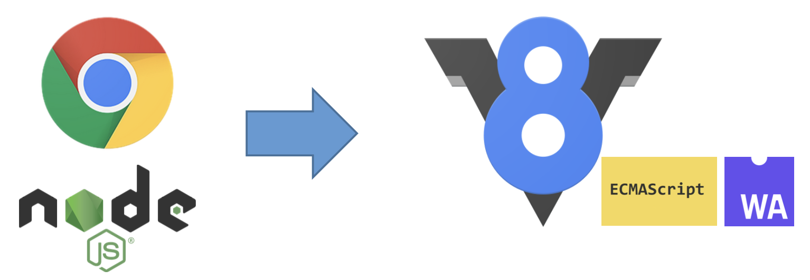
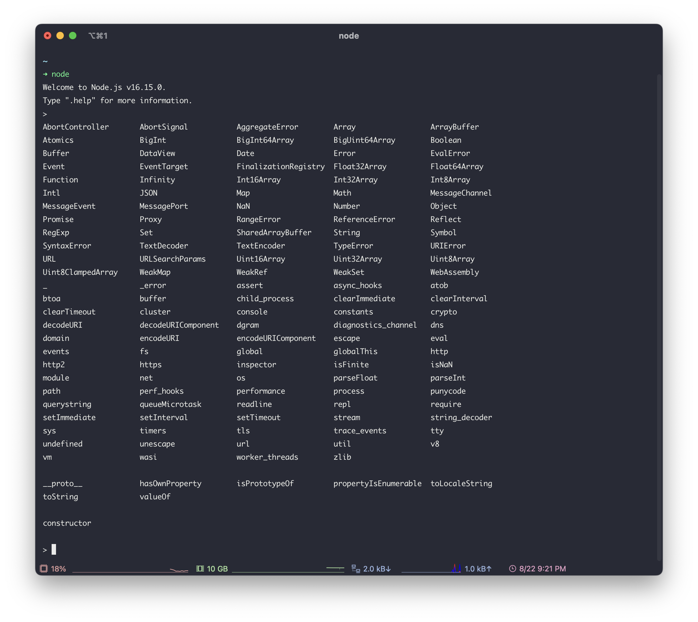
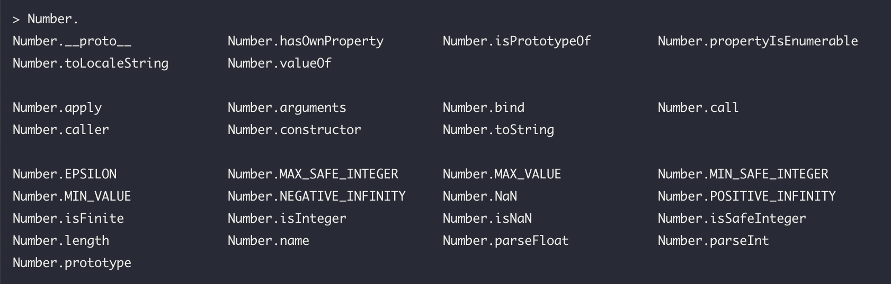

### 1주차 마스터클래스

# NodeJS + ExpressJS

---

_2022.09.02. 황준일_


## Contents

1. NodeJS 란
2. NodeJS API
3. NodeJS Package Manager
4. REST API
5. ExpressJS
6. 간단한 CRUD 만들기 (실습)


## 1. NodeJS 란?


### (1) Javascript

- 브라우저에서 사용할 수 있는 유일한(?) 언어
- Window Object Model
- Document Object Model
- CSS Object Model
- Web API


### (2) ECMAScript

- ECMA-262 기술 규격에 따라 정의하고 있는 **표준화된 스크립트 프로그래밍언어**
- 즉, **Javascript의 스펙**이면서 **NodeJS의 스펙**이라고 할 수 있다.


### (3) V8 Engine



- [NodeJS 공식 홈페이지](https://nodejs.org/en/)
  - Node.js® is a JavaScript runtime built on [Chrome's V8 JavaScript engine](https://v8.dev/).
- Google에서 만든 오픈 소스이고 고성능 JavaScript 및 WebAssembly 엔진


## 2. NodeJS API


NodeJS Optical Tutorial

- [https://nodejs.dev/en/learn](https://nodejs.dev/en/learn)


### (0) Global Module



Node 실행 후 `tab` 두 번


#### API Namespace 까지 입력 후 Tab 두 번




#### NodeJS 16 API Document

[https://nodejs.org/dist/latest-v16.x/docs/api/documentation.html](https://nodejs.org/dist/latest-v16.x/docs/api/documentation.html)


### (1) FileSystem

[https://nodejs.org/dist/latest-v16.x/docs/api/fs.html](https://nodejs.org/dist/latest-v16.x/docs/api/fs.html)


#### async api
- [fs.access](https://nodejs.org/dist/latest-v16.x/docs/api/fs.html#fsaccesspath-mode-callback)

```js
const filePath = './files/data.json';
fs.access(filePath, constants.F_OK, (err) => {
  console.log(`${filePath} ${err ? 'does not exist' : 'exists'}`);
});
```

- [fs.mkdir](https://nodejs.org/dist/latest-v16.x/docs/api/fs.html#fsmkdirpath-options-callback)

```js
fs.mkdir('./files', { recursive: true }, (err) => {
  if (err) throw err;
});
```

- [fs.readFile](https://nodejs.org/dist/latest-v16.x/docs/api/fs.html#fsreadfilepath-options-callback)

```js
fs.readFile('./files/data.json', 'utf8', (err, data) => {
  if (err) throw err;
  console.log(data);
});
```

- [fs.writeFile](https://nodejs.org/dist/latest-v16.x/docs/api/fs.html#fswritefilefile-data-options-callback)

```js
const data = JSON.stringify({ id: 'junil', name: '황준일' })
fs.writeFile('./files/data.json', data, 'utf8', (err) => {
  if (err) throw err;
  console.log('The file has been saved!');
});
```


#### sync api
- [fs.accessFileSync](https://www.notion.so/e20a628da7444774b8b48c1f90fccf04)

```js
const filePath = './files/data.json';
try {
  fs.accessSync(filePath, constants.R_OK | constants.W_OK);
  console.log(`${filePath} exists`);
} catch (err) {
  console.error(`${filePath} does not exist`);
}
```

- [fs.existsSync](https://nodejs.org/dist/latest-v16.x/docs/api/fs.html#fsexistssyncpath)

```js
const filePath = './files/data.json';
if (existsSync(filePath)) {
  console.log(`${filePath} exists`);
}
```


- [fs.mkdirSync](https://nodejs.org/dist/latest-v16.x/docs/api/fs.html#fsmkdirsyncpath-options)

```js
fs.mkdirSync('./files');
```

- [fs.readFileSync](https://nodejs.org/dist/latest-v16.x/docs/api/fs.html#fsreadfilesyncpath-options)

```js
const data = fs.readFileSync('./files/data.json', 'utf8');
```

- [fs.writeFileSync](https://nodejs.org/dist/latest-v16.x/docs/api/fs.html#fswritefilesyncfile-data-options)

```js
const data = JSON.stringify({ id: 'junil', name: '황준일' });
fs.writeFileSync('./files/data.json', data, 'utf8');
```


### (2) OS

[https://nodejs.org/dist/latest-v16.x/docs/api/os.html#os](https://nodejs.org/dist/latest-v16.x/docs/api/os.html#os)


### (3) Path

[https://nodejs.org/dist/latest-v16.x/docs/api/path.html#path](https://nodejs.org/dist/latest-v16.x/docs/api/path.html#path)


- <!-- .element: class="fragment" --> path.join
- <!-- .element: class="fragment" --> path.resolve
- <!-- .element: class="fragment" --> path.basename
- <!-- .element: class="fragment" --> path.dirname


### (4) HTTP <!-- .element: style="margin-bottom: 100px;" -->

#### http

[https://nodejs.org/dist/latest-v16.x/docs/api/http.html](https://nodejs.org/dist/latest-v16.x/docs/api/http.html#http)


```js[|1|3|5-9|6|7|8|11-13]
const http = require('http')

const port = process.env.PORT || 3000

const server = http.createServer((req, res) => {
  res.statusCode = 200
  res.setHeader('Content-Type', 'text/html')
  res.end('<h1>Hello, World!</h1>')
})

server.listen(port, () => {
  console.log(`Server running at port ${port}`)
})
```


#### http/2

[https://nodejs.org/dist/latest-v16.x/docs/api/http2.html](https://nodejs.org/dist/latest-v16.x/docs/api/http2.html#http2)


```js[|1|3-6|4|5|19|10-17|12-15|16|8]
const http2 = require('http2');

const server = http2.createSecureServer({
  key: fs.readFileSync('localhost-privkey.pem'),
  cert: fs.readFileSync('localhost-cert.pem')
});

server.on('error', (err) => console.error(err));

server.on('stream', (stream, headers) => {
  // stream is a Duplex
  stream.respond({
    'content-type': 'text/html; charset=utf-8',
    ':status': 200
  });
  stream.end('<h1>Hello World</h1>');
});

server.listen(8443);
```


#### https

[https://nodejs.org/dist/latest-v16.x/docs/api/https.html](https://nodejs.org/dist/latest-v16.x/docs/api/https.html#https)


```js[|1|4-7|9-12|14-16]
const https = require('https');
const port = process.env.PORT || 443;

const options = {
  key: fs.readFileSync('test/fixtures/keys/agent2-key.pem'),
  cert: fs.readFileSync('test/fixtures/keys/agent2-cert.pem')
};

const server = https.createServer(options, (req, res) => {
  res.writeHead(200);
  res.end('<h1>Hello, World!</h1>')
});

server.listen(port, () => {
  console.log(`Https Server running at port ${port}`)
});
```


#### https.request | http.request

```js[|1|3-7|10-14|16-18|20]
const https = require('https');

const options = {
  hostname: 'github.com',
  port: 443,
  path: '/',
  method: 'GET'
};

const req = https.request(options, (res) => {
  res.on('data', (d) => {
    console.log(d.toString())
  });
});

req.on('error', (e) => {
  console.error(e);
});

req.end();
```


### (5) URL

- [https://nodejs.org/dist/latest-v16.x/docs/api/url.html#url](https://nodejs.org/dist/latest-v16.x/docs/api/url.html#url)


<div class="r-stack">


<!-- .element class="fragment fade-out" data-fragment-index="0" -->


<!-- .element class="fragment fade-in" data-fragment-index="0" -->

</div>


### (6) process

[https://nodejs.org/dist/latest-v16.x/docs/api/process.html#process](https://nodejs.org/dist/latest-v16.x/docs/api/process.html#process)


#### process.env


#### process.argv
#### process.argv0


#### process.cwd()
#### process.env.PWD

  


#### process.std*


- **stderr** 표준 에러
- **stdin** 표준 입력
- **stdout** 표준 출력


#### `process.stdin.*`


#### `process.stdout.*`


#### 번외: `readline`
[https://nodejs.org/dist/latest-v16.x/docs/api/readline.html#readline](https://nodejs.org/dist/latest-v16.x/docs/api/readline.html#readline)


```js[|1|2-6|4|5|8-11]
const readline = require("readline");

const rl = readline.createInterface({
  input: process.stdin,
  output: process.stdout
});

rl.question('당신의 이름을 입력해주세요: ', (answer) => {
  console.log(`당신의 이름을 거꾸로 하면: ${[ ...answer ].reverse().join('')}`);
  rl.close();
});
```


### (7) Timers

[https://nodejs.org/dist/latest-v16.x/docs/api/timers.html#timers](https://nodejs.org/dist/latest-v16.x/docs/api/timers.html#timers)


```js[|1|2|3|8|5|1|2|3]
setImmediate(() => console.log('setImmediate')); // 즉시 실행 (task queue에 올림)
setTimeout(() => console.log('setTimeout'), 1000); // 1초 뒤 실행
setInterval(() => console.log('setInterval'), 1000); // 1초 마다 실행

console.log('console.log');

// 출력 순서
// console.log => setImmediate => setTimeout => setInterval
```


#### timers/promise

**promise 방식으로** setTimeout, setInterval, setImmediate, scheduler 를 사용할 수 있음

#### scheduler <!-- .element style="margin-top: 100px;" -->


```js[1-6|8|10|12|14|16-25]
const {
  setTimeout,
  setImmediate,
  setInterval,
  scheduler,
} = require('timers/promises');
  
setImmediate().then(() => console.log('setImmediate'));
  
setTimeout(1000).then(() => console.log('setTimeout'));
  
scheduler.wait(100).then(() => console.log('scheduler.wait'));

scheduler.yield().then(() => console.log('scheduler.yield'));
  
async function main() {
  const interval = 100;
  for await (const startTime of setInterval(interval, Date.now())) {
    const now = Date.now();
    console.log(now);
    if ((now - startTime) > 1000)
      break;
  }
  console.log(Date.now());
}
  
main();
```


### (8) Assert

[https://nodejs.org/dist/latest-v16.x/docs/api/assert.html#assert](https://nodejs.org/dist/latest-v16.x/docs/api/assert.html#assert)

#### assert.*


#### assert.strict.*


### (9) command

```bash
$ node -p "1 + 2"
3
```

```bash
$ COMPUTED = $(node -p "1 + 2")
$ echo $COMPUTED
3
```

```bash
$ echo "node process properties: $(node -p "Object.keys(process).length")"
node process properties: 74
```

```bash
$ echo "timestamp: $(node -p "Date.now()")"
$ echo "random: $(node -p "Math.round(Math.random() * 1000000000)")"
```


## 3. NodeJS Package Manager

### (1) 소개

[https://docs.npmjs.com/about-npm](https://docs.npmjs.com/about-npm)

> npm is the world's largest software registry. Open source developers from every continent use npm to share and borrow packages, and many organizations use npm to manage private development as well.
>

> npm은 세계 최대의 소프트웨어 레지스트리입니다. 모든 대륙의 오픈 소스 개발자는 npm을 사용하여 패키지를 공유하고 차용하며 많은 조직에서 npm을 사용하여 비공개 개발도 관리합니다.
>

### (2) commands (feat. package.json)

[https://docs.npmjs.com/cli/v8/commands](https://docs.npmjs.com/cli/v8/commands)

- 초기화

    ```bash
    $ npm init -y
    ```

  


- package.json

  [https://docs.npmjs.com/cli/v8/configuring-npm/package-json](https://docs.npmjs.com/cli/v8/configuring-npm/package-json)

    ```json
    {
      "name": "desktop",
      "version": "1.0.0",
      "description": "",
      "main": "index.js",
      "scripts": {
        "test": "echo \"Error: no test specified\" && exit 1"
      },
      "keywords": [],
      "author": "",
      "license": "ISC"
    }
    ```


- npm scripts

    ```bash
    $ npm run test
    ```

  

    ```bash
    $ echo "console.log(Math.max(...process.argv.slice(2).map(Number)))" > index.js
    ```

    ```json
    {
      "name": "desktop",
      "version": "1.0.0",
      "description": "",
      "main": "index.js",
      "scripts": {
        "max:1-2": "node index.js 1 2",
        "max:10-20-30": "node index.js 10 20 30"
      },
      "keywords": [],
      "author": "",
      "license": "ISC"
    }
    ```

    ```bash
    $ npm run max:1-2
    2
    
    $ npm run max:10-20-30
    30
    ```

  


- install

    ```bash
    > npm install express
    > npm install axios
    > npm install -D jest
    > npm install -D typescript
    ```

  

  

    ```json
    {
      "name": "desktop",
      "version": "1.0.0",
      "description": "",
      "main": "index.js",
      "scripts": {
        "max:1-2": "node index.js 1 2",
        "max:10-20-30": "node index.js 10 20 30"
      },
      "keywords": [],
      "author": "",
      "license": "ISC",
      "dependencies": {
        "axios": "^0.27.2",
        "express": "^4.18.1"
      },
      "devDependencies": {
        "jest": "^28.1.3",
        "typescript": "^4.7.4"
      }
    }
    ```

  - [dependencies](https://www.notion.so/1-14964ec2c15a4078a16d008f79e347bd)
    - 프로덕션에 필요함
  - [devDependencies](https://docs.npmjs.com/cli/v8/configuring-npm/package-json#devdependencies)
    - 개발에 필요함

- uninstall

    ```bash
    $ npm uninstall express axios jest typescript
    ```

  


## 4. REST API

[https://meetup.toast.com/posts/92](https://meetup.toast.com/posts/92)

### REST

- **RE**presentational **S**tate **T**ransfer
- HTTP를 제대로 사용하기 위해 설계된 **아키텍쳐 (≠ protocal)**
  - 지키면 좋지만, 안 지켜도 상관 없음
- 구성
  - **행위(Verb)** - HTTP METHOD
  - **자원(RESOURCE)** - URI
  - **표현(Representations)**
- 원칙


    | METHOD | 역할 |
    | --- | --- |
    | POST | POST를 통해 해당 URI를 요청하면 리소스를 생성합니다. |
    | GET | GET를 통해 해당 리소스를 조회합니다.
    리소스를 조회하고 해당 도큐먼트에 대한 자세한 정보를 가져온다. |
    | PUT | PUT를 통해 해당 리소스를 수정합니다. |
    | DELETE | DELETE를 통해 리소스를 삭제합니다. |
    - URI ⇒ 정보의 자원 표현
    - 자원에 대한 행위 ⇒ HTTP Method(GET, POST, PUT, DELETE)로 표현

### GET

```js
GET /users
GET /users/1
GET /users/6cd9cf7c-fe62-409a-aa8e-30541a41b87f

GET /comments
GET /comments/1

GET /posts
GET /posts/1
GET /posts?page=5%size=100&limit=100&search=부스트캠프

GET /users/1/posts
GET /users/1/comments
GET /posts/2/comments
```

### POST

```js
POST /users
POST /comments
POST /posts/1/comments
POST /users/2/posts
POST /users/2/comments
POST /users/2/posts/1/comments
```

### PUT

```js
PUT /users/1
PUT /comments/2
PUT /posts/3
```

### PATCH

```js
PATCH /users/1
PATCH /comments/2
PATCH /posts/3
```

### DELETE

```js
DELETE /users/1
DELETE /comments/2
DELETE /posts/3
```

### Status (상태코드)

[https://developer.mozilla.org/ko/docs/Web/HTTP/Status](https://developer.mozilla.org/ko/docs/Web/HTTP/Status)

- 1XX: 정보 제공 응답


    | 상태코드 |  |
    | --- | --- |
    | 100 Continue | 이 임시적인 응답은 지금까지의 상태가 괜찮으며 클라이언트가 계속해서 요청을 하거나 이미 요청을 완료한 경우에는 무시해도 되는 것을 알 |
    | 101 Switching Protocol | 이 코드는 클라이언트가 보낸 Upgrade (en-US) 요청 헤더에 대한 응답에 들어가며 서버에서 프로토콜을 변경할 것임을 알림 |
    | 102 Processing | 이 코드는 서버가 요청을 수신하였으며 이를 처리하고 있지만, 아직 제대로 된 응답을 알려줄 수 없음을 알림 |
    | 103 Early Hints | 이 상태 코드는 주로 Link (en-US) 헤더와 함께 사용되어 서버가 응답을 준비하는 동안 사용자 에이전트가(user agent) 사전 로딩(preloading)을 시작할 수 있도록 함 |
- 2XX: 성공적인 응답


    | 상태코드 |  |
    | --- | --- |
    | 200 OK | 클라이언트의 요청을 정상적으로 수행 |
    | 201 Created | 클라이언트가 어떠한 리소스 생성을 요청, 해당 리소스가 성공적으로 생성됨 |
    | 204 No Content | 요청에 대해서 보내줄 수 있는 콘텐츠가 없지만, 헤더는 의미있을 수 있습니다. 사용자-에이전트는 리소스가 캐시된 헤더를 새로운 것으로 업데이트 할 수 있습니다. |
- 3XX: Redirect 응답


    | 상태코드 |  |
    | --- | --- |
    | 301 | 이 응답 코드는 요청한 리소스의 URI가 변경되었음을 의미
    (응답 시 Location header에 변경된 URI를 적어줌) |
    | 304 Not Modified | 이것은 캐시를 목적으로 사용됩니다. 이것은 클라이언트에게 응답이 수정되지 않았음을 알려주며, 클라이언트는 계속해서 응답의 캐시된 버전을 사용 |
- 4XX: client 에러


    | 상태코드 |  |
    | --- | --- |
    | 400 Bad Request | 클라이언트의 요청이 부적절 할 경우 사용하는 응답 코드 |
    | 401 Unauthorized | 클라이언트가 인증되지 않은 상태에서 보호된 리소스를 요청했을 때 사용하는 응답 코드 |
    | 403 Forbidden | 유저 인증상태와 관계 없이 응답하고 싶지 않은 리소스를 클라이언트가 요청했을 때 사용하는 응답 코드 |
    | 404 Not Found | - 서버: 요청받은 리소스를 찾을 수 없음
    - 브라우저: 알려지지 않은 URL
    - endpoint는 있으나 적절하지만 리소스 자체는 존재하지 않음 |
    | 405 Method Not Allowed | 클라이언트가 요청한 리소스에서는 사용 불가능한 Method를 이용했을 경우 사용하는 응답 코드 |
    - 401: 로그인 X
    - 403: 로그인은 했으나 권한이 없음 (관리자 페이지에 일반 사용자가 접근)
- 5XX: server 에러


    | 상태코드 |  |
    | --- | --- |
    | 500 Internal Server Error | 서버에 문제가 있을 경우 사용하는 응답 코드 |
    | 502 Bad Gateway | 이 오류 응답은 서버가 요청을 처리하는 데 필요한 응답을 얻기 위해 게이트웨이로 작업하는 동안 잘못된 응답을 수신했음을 의미 |
    | 503 Service Unavailable | - 서버가 요청을 처리할 준비가 되지 않았음
    - 유지보수를 위해 작동이 중단되거나 과부하가 걸렸을 때 |

### RESTful

- 앞서 언급한 가이드 라인을 잘 지키는 것
- 즉, REST 를 잘 구현하는 것

### REST API

- RESTful 하게 만들어진 API

### REST API의 장점

`독립성`

- REST API는 사용되는 기술과 독립적
  - Java
  - Go
  - Python
  - NodeJS
  - .NET
  - etc
- API 설계에 영향을 주지 않고 다양한 프로그래밍 언어로 클라이언트 및 서버 애플리케이션을 모두 작성
- 통신에 영향을 주지 않고 양쪽의 기본 기술을 변경할 수 있습니다.

`확장성`

- 클라이언트-서버 상호 작용을 최적화 ⇒ 확장이 용이함
  - 과거의 PHP, JSP로 만들던 사이트(MPA) ⇒ 현대의 사이트 (SPA + REST API)
  - 잘 만들어진 REST API를 이용하여 서비스 확장 가능
  - 오픈 API 처럼 사용 가능 ⇒ 확장성
- Stateless한 특징으로 서버가 과거 클라이언트 요청 정보를 유지할 필요가 없기 때문에 서버 로드를 제거

`유연성`

- 완전한 클라이언트-서버 분리를 지원
- 각 부분이 독립적으로 발전할 수 있도록 다양한 서버 구성 요소를 단순화하고 분리
- 서버 애플리케이션의 플랫폼 또는 기술 변경은 클라이언트 애플리케이션에 영향을 주지 않도록 할 수 있음

!Stop!

- 독립적이기 때문에 확장할 수 있고,
- 확장할 수 있기 때문에 유연할 수 있다.
- 코드에도 적용가능

- 하나의 코드가 하나의 역할만
- 확장 가능하다 = 인터페이스를 잘 정의한다 = 주입할 수 있다.
  - USB
  - 콘센트
  - 컴퓨터 부품
    - CPU
    - RAM
    - SSD, HDD

## 4. ExpressJS

[https://expressjs.com/ko/](https://expressjs.com/ko/)

### (1) 소개


- **웹 애플리케이션**
  웹 및 모바일 애플리케이션을 위한 일련의 강력한 기능을 제공하는 간결하고 유연한 Node.js 웹 애플리케이션 프레임워크입니다.
- **API**
  자유롭게 활용할 수 있는 수많은 HTTP 유틸리티 메소드 및 미들웨어를 통해 쉽고 빠르게 강력한 API를 작성할 수 있습니다.
- **성능**
  Express는 기본적인 웹 애플리케이션 기능으로 구성된 얇은 계층을 제공하여, 여러분이 알고 있고 선호하는 Node.js 기능을 모호하게 만들지 않습니다.
- **Frameworks**
  많은 유명한 프레임워크들이 Express를 기반으로 하고 있습니다.

### (2) 실행

```js
const express = require('express')
const app = express()
const port = 3000

app.get('/', function (req, res) {
  res.send('Hello World!');
});

app.post('/', function (req, res) {
  res.send('Got a POST request');
});

app.put('/user', function (req, res) {
  res.send('Got a PUT request at /user');
});

app.delete('/user', function (req, res) {
  res.send('Got a DELETE request at /user');
});

app.listen(port, () => {
  console.log(`Example app listening on port ${port}`)
})
```

## 5. (실습) 간단한 CRUD 만들기

- 로컬 변수 사용
- CRUD 정의
- index.html 만들기
- 로컬 변수 ⇒ json file 로 변경
- 간단한 css 적용
- css를 파일로 분리
- static에 대한 이해

## 부록. 고민해볼 것

- express를 http, https 등으로 직접 구현해보기