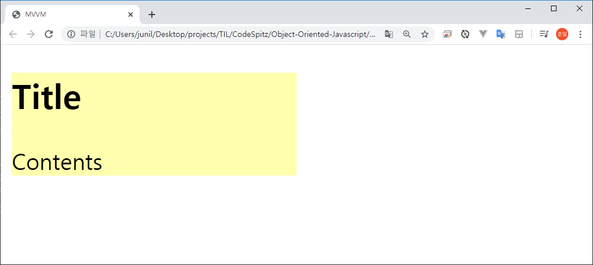
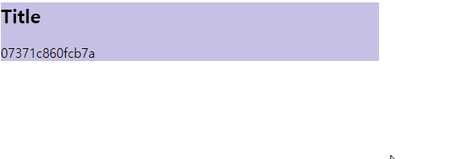

---

title: MVVM System 만들기
description: 객체지향을 통해서 MVVM System을 만드는 과정입니다.
sidebarDepth: 2
date: 2020-02-08

---

# MVVM System 만들기

::: tip 해당 포스트는 아래의 내용들을 토대로 정리한 것입니다.

[코드스피츠 86기 2회차 동영상](https://www.youtube.com/watch?v=RT38Za1pkdI)

::: 

## MVC와 MVP의 문제점

MVVM에 대해 구체적으로 살펴보기 이전에 이것이 어떤 문제들의 해결 방안으로 등장 하였는지 살펴봐야 한다. 그 다음 MVVM이 __객체지향의 원칙을 통해 앞서 언급한 문제들을 어떤 방식으로 해결하였는지__ 이해해야 한다.

### MVC Pattern

MVC는 `Model - View - Controller` 등을 사용하며, 주로 Server-side에서 사용 된다.

::: tip MVC를 사용하는 Server-side Framework

- Spring Framework
- Python Django
- PHP Laravel
- .NET Framework
- Ruby On Rails

:::

Servier-side에서 사용하는 MVC Pattern의 구조는 다음과 같다.

@startuml
rectangle View
rectangle Model
rectangle Controller

View -[hidden] Model : "          "
Model <<-- Controller 
View <<-- "data" Controller
@enduml

이렇게 View와 Model은 직접적으로 의존하지 않고 Controller를 통해서 메세지를 주고 받는다. 왜냐하면 _Server-side에 넘기는 User의 interaction은 Http Request 하나 밖에 없기 때문이다._ 

그런데 Client-side에서 MVC Pattern이 사용될 땐 이야기가 다르다.
브라우저를 예로 들면 _User는 마우스, 터치, 키보드를 통해 Browser에게 interaction을 보낼 수 있다._

뿐만 아니라 `window resize` `window scroll` 같이 user가 의도하지 않아도 browser에서 일어나는 interaction 또한 처리 할 수 있어야 한다.

즉, Client-side는 Interaction이 다양하고, 이에 따른 대응이 필수적이다. 그래서 Client-Side에서 사용되는 MVC는 다음과 같은 구조를 띈다.

@startuml
rectangle View
rectangle Model
rectangle Controller

View ->> Model : "          "
Model <<-- Controller 
View <<-- "data" Controller
@enduml

- Controller는 Model과 View를 알고 있다.
- View는 User의 Interaction(Event)를 알고 있다.
- View는 어떤 Model을 갱신해야 되는지 알고 있어야 한다.

이럴 경우의 문제는 다음과 같다.

- Model은 비지니스로직과 관련있다.
- View는 UI와 관련있다.
- 즉, Model과 View는 변화의 이유가 다르다.
- 그런데 서로 간의 의존성이 있다

요약하자면 변화의 이유가 다른데 서로간의 의존성이 있기 때문에 문제가 발생한다.

::: tip Backbone.js
MVC를 사용하는 Client-Side Framework 중 대표적으로 backbone.js가 있다. 이제 MVVM을 사용하는 React, View, Angular 등에게 밀려 사용되지 않는다.
:::

Client, Server에 대한 분류를 접어두고, 실제로 많은 사람들이 사용하는 MVC는 다음과 같은 `제왕적 MVC Model`이다.

@startuml
rectangle View
rectangle Model
rectangle Controller

View --[hidden]right-- Model : "          "
Model --->> Controller 
Model <<--- Controller 
View <<--- "data" Controller
View --->> Controller
@enduml

- `Controller`는 자신이 소비할 Model과 View를 생성하거나 섭외해야할 책임을 갖게 된다.
- `Model`은 순수한 데이터를 표현하며 자신이 소유하고 있는 데이터의 변경이 일어날 때 마다 Controller에 알려야할 책임을 갖는다.
- `View`는 Controller가 전달해주는 Model을 기반으로 화면을 구성하고 user Interaction을 받아들인다.

이 구조에서는 View가 Model에 의존하는 건 없지만, Controller에 대한 의존이 너무 강하게 나타난다.

즉, Controller가 View와 Model의 변화를 흡수해야 한다는 것이고, 그럴 수록 _Controller의 변화가 매우 많아지게 된다._

> Controller에 변화가 많다 = 유지보수가 급격하게 많아진다.

그래서 점점 MVC를 사용하지 않고 있는 것이다.

### MVP Pattern

MVP는 `Model - View - Presenter`를 사용하는 Pattern이다.

- MFC 같은 Builder에서 사용된다
- 안드로이드에서도 사용하고 있다 

MVP의 구조는 다음과 같다.

@startuml
rectangle "**View**\n- getter\n- setter" as View
rectangle Model
agent Presenter

View --[hidden]right-- Model : "          "
Model --->> Presenter 
Model <<--- Presenter 
View <<--- Presenter
View --->> Presenter
@enduml

View에는 Logic이 없고, getter와 setter만 있다. Presenter는 View의 getter, setter를 사용 한다. 이럴 경우, _View는 Model에 대한 의존성이 완전히 없어진다._ 즉, View는 Model을 몰라도 된다. 그러기 위해선, **_필요한 모든 getter와 setter를 만들어야 한다._** 

따라서 MVP Pattern의 문제점은 다음과 같다.

- View Component가 매우 커진다.
- 가볍게 Application을 만들기는 너무 부담스럽다.
- 그래서 Framework 차원에서 제공하는 경우에만 사용한다.

## MVVM의 개념

이제 `MVVM(Model - View - ViewModel) Pattern` 에 대해 알아보자.

@startuml
rectangle View
rectangle Binder
rectangle Model
agent ViewModel

View -[hidden] Model : "                    "
View <<-- Binder
Binder ->> ViewModel : "**observer**"
Model <<-- ViewModel 
Model -->> ViewModel 
@enduml

MVVM의 핵심은 `ViewModel`과 `Binder`이다.

- `ViewModel` : View를 대신하는 **순수한 데이터 구조체** 이다. 다른 말로 **순수한 인메모리 객체**라고 할 수 있다.
- `Binder` : ViewModel을 감지하여 View에 반영한다.
  - 양방향 바인딩의 경우 Binder가 View에도 Observing을 하고 있는 상태이다. 즉, Binder가 View와 ViewModel 모두 감지하여 모두 반영하는 것을 의미한다. 
  - Binder가 없으면 MVVM은 성립하지 않으며 Binder로 인해 ViewModel은 View의 존재를 모르는 상태로 유지할 수 있다.

::: tip MVVM의 핵심 개념

- View와 ViewModel은 서로의 존재를 모르는 상태로 유지한다.
- ViewModel만 잘 만들면 테스트와 유지보수가 매우 간단하다.

:::

### 약간의 난이도 조정

MVVM의 핵심은 앞서 언급했듯이 ViewModel과 Binder인데,
_문제는 Observer를 이용하여 구현하기가 힘들다는 것이다._

그래서 다음과 같이 Observer 대신에 `Call`을 사용하여 만들 것이다.

@startuml
rectangle View
rectangle Binder
rectangle Model
agent ViewModel

View -[hidden] Model
View <<-- Binder
Binder <<->> ViewModel : call
Model <<-- ViewModel 
Model -->> ViewModel 
@enduml

이렇게 Call을 사용하면 ViewModel이 Binder에게 변화를 알리게 된다.
__즉, 자동으로 감지하는 방식(Observer)에서 수동으로 감지를 알리는 방식(Call)을 사용하는 것이다.__

정리하자면 다음과 같다.

1. ViewModel의 순수한 데이터 갱신
2. _Binder에 알림(Call)_
3. Binder가 View를 갱신
4. 결론적으로 ViewModel은 View를 모르는 상태로 유지한다.

### TypeCheck

구현에 앞서 TypeCheck를 담당하는 코드를 만들어야 한다.

```js
const type = (target, type) => {
  if (typeof type == "string") {
    if (typeof target != type) throw `invalid type ${target} : ${type}`
  } else if (!(target instanceof type)) {
    throw `invalid type ${target} : ${type}`
  }
  return target;
}

type(12, 'number')
type('abc', 'string')
type([1, 2, 3 ], Array)
type(new Set, Set)
type(document.body, HTMLElement)
```

Javascript는 Compile 언어가 아니기 때문에 __runtime에 무조건 throw 하지 않으면 무조건 오류가 전파된다.__
그래서 runtime 에서 실행되는 언어는 에러가 발견되는 즉시 throw로 멈춰야 디버깅할 수 있다.

개발할 때는 throw를 던지는 방식으로 개발 하고, 배포할 때는 console.log 같은 걸로 처리하면 된다.

그리고 다음과 같이 응용할 수 있다.

```js
const test = (arr, _ = type(arr, Array)) => {
  console.log(arr)
}

test([1, 2, 3]) // 정상
test(123) // 오류.  throw로 인해 멈춤

const test2 = (a, b, c, _0 = type(a, "string"), _1 = type(b, "number"), _2 = type(c, "boolean")) => {
  console.log(a, b, c);
}

test2("abc", 123, true);
```

이렇게 type을 check하면 큰 실수가 퍼져나가는 것을 방지할 수 있다.

::: tip Javascript에서 TypeCheck가 필요한 이유
- 코드의 오염에 대한 일부 책임을 TypeCheck에게 맡긴다.
- 오류의 전파를 막아서 **안전한 프로그램**을 만든다.
:::

Type에 대한 이야기는 나중에 따로 다룰 것이다.

### Role Design

MVVM의 핵심은 ViewModel, 더 정확히는 `Binder`에 있다.

그리고 Binding에는 두 가지 방식이 있다
- Template Scan : Vue나 Angular에서 사용한다.
- Template과 State의 결합 : React에서 사용한다.
  - Data와 연결되어있는 view를 만들고, binder가 view를 꼭 껴안아 가지고 있는 방식이다.

Scan을 사용하는 방식이 더 간단하기 때문에 scan 방식을 이용할 것이다.

@startuml
skinparam linetype polyline
skinparam linetype ortho
rectangle Binder {
  rectangle BinderItem
}
rectangle ViewModel
agent Scanner
rectangle HTMLElement as el
ViewModel <<- Binder
Binder <<- Scanner
BinderItem <<- Scanner
Scanner ->> el
@enduml

Binder와 HTMLElement는 코드의 변경 이유가 다르기 때문에 Binder에서 Scanner를 분리하여 관리하는 게 좋다. 이게 바로 SRP 원칙이다.
그러기 위해선 Binder가 HTML을 인식하는 부분을 밖으로 빼야 하며, 이 때 Scanner가 사용된다.

_Scanner의 역할은 Binder와 HTMLElement의 연결을 끊어 주는 것이다._

::: tip 핵심
- 코드의 변화율(변화하는 주기)에 따라 객체를 분리하여 관리해야 한다.
- 혹은 코드를 바꾸는 이유가 같은지의 여부에 따라 관리해야 한다.
:::

## Class 작성

이제 구현에 필요한 Class들을 만들어보자.

### HTMLElement

@startuml
skinparam linetype polyline
skinparam linetype ortho
rectangle Binder {
  rectangle BinderItem
}
rectangle ViewModel
agent Scanner
rectangle HTMLElement as el #09F
ViewModel <<- Binder
Binder <<- Scanner
BinderItem <<- Scanner
Scanner ->> el
@enduml

```html
<section id="target" data-viewmodel="wrapper">
  <h2 data-viewmodel="title"></h2>
  <section data-viewmodel="contents"></section>
</section>
```

단순하게 HTML을 작성하기만 하면 된다. 이 때 `custom attribute`를 사용하기 위해서 `data-**`를 쓰면 된다.

### ViewModel

@startuml
skinparam linetype polyline
skinparam linetype ortho
rectangle Binder {
  rectangle BinderItem
}
rectangle ViewModel #09F
agent Scanner
rectangle HTMLElement as el
ViewModel <<- Binder
Binder <<- Scanner
BinderItem <<- Scanner
Scanner ->> el
@enduml

ViewModel은 순수한 Data Object 이기 때문에 제일 만들기가 쉽다.

```js
const ViewModel = class {
  static #private = Symbol()
  static get (data) {
    return new ViewModel(this.#private, data)
  } 
  styles = {}; attributes = {}; properties = {}; events = {};
  constructor(checker, data) {
    if (checker != ViewModel.#private) throw 'use ViewModel.get()!'
    Object.entries(data).forEach(([k, v]) => {
      switch (k) {
        case 'styles': this.styles = v; break;
        case 'attributes': this.attributes = v; break;
        case 'properties': this.properties = v; break;
        case 'events': this.events = v; break;
        default: this[k] = v;
      }
    });
    Object.seal(this); // Value를 바꿀 순 있지만 Key를 추가할 순 없다.
  }
}
```
어떠한 종류의 ViewModel, View 든 상관없이 Draw(혹은 Rendering) Logic은 Binder에게 위임한다.

### Binder

Binder를 만들기 이전에, BinderItem을 만들어야 한다.

@startuml
skinparam linetype polyline
skinparam linetype ortho
rectangle Binder {
  rectangle BinderItem #09F
}
rectangle ViewModel
agent Scanner
rectangle HTMLElement as el
ViewModel <<- Binder
Binder <<- Scanner
BinderItem <<- Scanner
Scanner ->> el
@enduml

```js
const BinderItem = class {
  el; viewmodel;
  constructor (el, viewmodel, _0 = type(el, HTMLElement), _1 = type(viewmodel, 'string')) {
    this.el = el
    this.viewmodel = viewmodel
    Object.freeze(this) // 아예 불변 객체로 만든다. 
  }
}

```

다음과 같이 사용할 수 있다.

```js
new BinderItem(section, 'wrapper')
new BinderItem(h2, 'title')
new BinderItem(section2, 'contents')
```

이제 Binder를 만들 차례다.

@startuml
skinparam linetype polyline
skinparam linetype ortho
rectangle Binder #09F {
  rectangle BinderItem #FFA
}
rectangle ViewModel
agent Scanner
rectangle HTMLElement as el
ViewModel <<- Binder
Binder <<- Scanner
BinderItem <<- Scanner
Scanner ->> el
@enduml

```js{2}
const Binder = class {
  #items = new Set()
  add (v, _ = type(v, BinderItem)) { this.#items.add(v) }
  render (viewmodel, _ = type(viewmodel, ViewModel)) {
    this.#items.forEach(item => {
      const vm = type(viewmodel[item.viewmodel], ViewModel), el = item.el
      Object.entries(vm.styles).forEach(([k, v]) => el.style[k] = v)
      Object.entries(vm.attributes).forEach(([k, v]) => el.attribute[k] = v)
      Object.entries(vm.properties).forEach(([k, v]) => el[k] = v)
      Object.entries(vm.events).forEach(([k, v]) => el[`on${k}`] = e => v.call(el, e, viewmodel))
    })
  }
}
```

- Array를 사용한다 = Value Context를 사용한다.
- 객체지향에서는 Value Context 사용을 지양한다.
- _Set을 사용한다 = Identifier Context를 사용한다._

### Scanner

@startuml
skinparam linetype polyline
skinparam linetype ortho
rectangle Binder {
  rectangle BinderItem
}
rectangle ViewModel
agent Scanner #09F
rectangle HTMLElement as el
ViewModel <<- Binder
Binder <<- Scanner
BinderItem <<- Scanner
Scanner ->> el
@enduml

- Scanner는 _HTML을 Scan 하여 Binder에게 알리는 역할_ 을 수행한다.
- 그래서 Scanner에서 _Binder를 만들고 반환한다._

```js{3,14}
const Scanner = class {
  scan (el, _ = type(el, HTMLElement)) {
    const binder = new Binder();
    this.checkItem(binder, el)
    const stack = [el.firstElementChild]

    // HTML 전체에 대한 순회
    let target
    while (target = stack.pop()) {
      this.checkItem(binder, target)
      if (target.firstElementChild) stack.push(target.firstElementChild)
      if (target.nextElementSibling) stack.push(target.nextElementSibling)
    }
    return binder;
  }
  checkItem (binder, el) {
  	const vm = el.getAttribute('data-viewmodel')
  	if (vm) binder.add(new BinderItem(el, vm))
  }
}
```

## Client Code 작성

이제 앞서 작성한 `HTMLElement` `ViewModel` `BindItem` `Bind` `Scanner` 등을 사용하는 코드를 작성해야 한다.

```js
const viewmodel = ViewModel.get({
  wrapper: ViewModel.get({
    styles: { width: '50%', background: '#ffa', cursor: 'pointer'}
  }),
  title: ViewModel.get({
  	properties: { innerHTML: 'Title' }
  }),
  contents: ViewModel.get({
  	properties: { innerHTML: 'Contents' }
  })
})
```

viewmodel은 HTML 형태 처럼 보이지만 _순수한 인메모리 객체의 데이터들이다._
**그래서 View를 직접 조작하지 않고 ViewModel을 통해 조작하게 된다.**

```js{3}
const scanner = new Scanner
const binder = scanner.scan(document.querySelector('#target'))
binder.render(viewmodel) // 제어 역전
```

결과 화면은 다음과 같다.



### 약간 개선하기

viewmodel을 개선해보자.

```js{7-8}
const getRandom = () => parseInt(Math.random() * 150) + 100
const viewmodel2 = ViewModel.get({
  isStop: false,
  changeContents () {
    // viewmodel을 갱신하면, binder가 viewmodel을 view에 rendering 한다.
    // 즉, '인메모리 객체'만 수정하면 된다
    this.wrapper.styles.background = `rgb(${getRandom()},${getRandom()},${getRandom()})`
    this.contents.properties.innerHTML = Math.random().toString(16).replace('.', '')
    binder.render(viewmodel2).
  },
  wrapper: ViewModel.get({
    styles: { width: '50%', background: '#fff', cursor: 'pointer' },
    events: { click(e, vm) { vm.isStop = true } }
  }),
  title: ViewModel.get({
    properties: { innerHTML: 'Title' }
  }),
  contents: ViewModel.get({
    properties: { innerHTML: 'Contents' }
  })
})

const f = () => {
  viewmodel2.changeContents()
  binder.render(viewmodel2)
  if (!viewmodel2.isStop) requestAnimationFrame(f)
}

requestAnimationFrame(f)
```



### 전체 코드

<<< @/CodeSpitz/Object-Oriented-Javascript/02-MVVM/example2.html

[github에서 보기](https://github.com/JunilHwang/TIL/blob/master/CodeSpitz/Object-Oriented-Javascript/02-MVVM/example2.html)

## MVVM의 사용 결과

앞서 작성한 모든 코드에 View를 직접적으로 Control 하는 Code는 나오지 않았다. Binder에 제어역전을 전부다 부어버렸기 때문이다.

::: tip View에서 Binder로 IoC(제어역전) 발생

- View에 대한 제어는 Binder에게 위임된다.
- ViewModel은 순수한 인메모리 객체(데이터 구조체)이다
- Test시 View가 필요 없다 = Unit Test가 매우 쉽다.
- 개발자는 Data만 조작하면 되기 때문에 View에 대해서는 일절 신경쓰지 않아도 된다.

:::

그리고 MVVM을 구축하는 과정 보다 MVVM이라는 프레임워크 자체의 객체 구조를 이해하는 것이 객체를 관리하는 것에 도움이 된다.

::: tip MVVM으로 어떤 문제를 해결했는가?

- Model이 바뀔 때 마다 View가 영향을 받는 의존성 문제
- View 마다 View를 그리는 로직을 다 MVC에서 하나하나 만들어야 하는 문제
- 어떻게해야 View마다 View를 그리는 로직을 다 없앨까?
  - 제어 역전을 통해서(Binder에게 위임) 해결했다.
  - View를 직접적으로 알지 못하게 하는 모델을 만들었다.
  
:::

__객체지향에서 문제의 핵심은 의존성에 존재한다.__ 변화율이 다른 객체들이 의존하고 있을 때, 변화율에 따라 객체를 분류해야 한다. 그래서 의존관계를 어떻게 분리하느냐가 핵심이다.

::: tip 변화율이란 다음과 같은 것들을 말한다.

- 생명주기
- 갱신주기
- 수정주기
- 코드가 변경되어야 하는 이유

그리고 변화율은 단일책임원칙(SRP)와 관련된 문제다.

:::