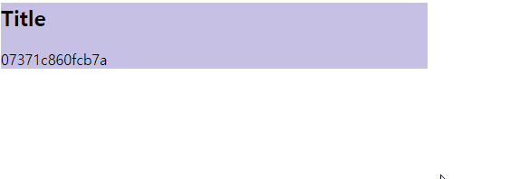

---

title: MVVM System 만들기
description: 객체지향을 통해서 MVVM System을 만드는 과정입니다.
date: 2020-01-21
sidebarDepth: 2

---

# MVVC System 만들기

MVVM : Model - View - ViewModel

## MVC Model

MVVC를 언급하기 이전에, MVC부터 알아야 한다.

MVC는 Model - View - Controller 등을 사용하며, 주로 Spring Framework 같이 Server에서 사용 된다.

@startuml
rectangle View
rectangle Model
rectangle Controller

View -[hidden] Model : "          "
Model <<-- Controller 
View <<-- "data" Controller
@enduml

이렇게 Server에서 사용하는 MVC의 형태는 View와 Model은 직접적으로 의존하지 않고 Controller를 통해서 메세지를 주고 받는다.

그런데 Client에서 사용할 땐 다음과 같이 바뀌게 된다.

@startuml
rectangle View
rectangle Model
rectangle Controller

View ->> Model : "          "
Model <<-- Controller 
View <<-- "data" Controller
@enduml

- Controller는 Model과 View를 알고 있다.
- View는 User의 Interaction(Event)를 알고 있다.
- View는 어떤 Model을 갱신해야 되는지 알고 있어야 한다.

이럴 경우의 문제는 다음과 같다.

- Model은 비지니스로직과 관련있다.
- View는 UI와 관련있다.
- 즉, Model과 View는 변화의 이유가 다르다.
- 그런데 서로 간의 의존성이 있다

이렇게 Client에서 MVC Model을 사용할 경우, 변화의 이유가 다른데 서로간의 의존성이 있기 때문에 문제가 발생한다.

실제로 많은 사람들이 사용하는 MVC는 다음과 같은 `제왕적 MVC Model`이다.

@startuml
rectangle View
rectangle Model
rectangle Controller

View --[hidden]right-- Model : "          "
Model --->> Controller 
Model <<--- Controller 
View <<--- "data" Controller
View --->> Controller
@enduml

이 구조에서는 View가 Model에 의존하는 건 없지만, Controller에 대한 의존이 너무 강하다는 것이다.

즉, Controller가 View와 Model의 변화를 흡수해야 한다는 것이고, 그럴 수록 Controller의 변화가 매우 많다.

## MVP

MVP : Model - View - `Presenter`

- MFC 같은 Builder에서 사용된다
- 안드로이드에서도 사용하고 있다 

@startuml
rectangle "**View**\n- getter\n- setter" as View
rectangle Model
agent Presenter

View --[hidden]right-- Model : "          "
Model --->> Presenter 
Model <<--- Presenter 
View <<--- Presenter
View --->> Presenter
@enduml

View에는 Logic이 없고, getter와 setter만 있다. Presenter는 View의 getter, setter를 사용 한다.

이럴 경우, View는 Model에 대한 의존성이 완전히 없어진다. 즉, View는 Model을 몰라도 된다.

그러기 위해선, _필요한 모든 getter와 setter를 만들어야 한다._ 

문제점

- View Component가 매우 커진다.
- 가볍게 Application을 만들기는 너무 부담스럽다.
- 그래서 Framework 차원에서 제공하는 경우에만 사용한다.

## MVVM

이제 MVVM(Model - View - ModelView)에 대해 알아보자.

@startuml
rectangle View
rectangle Binder
rectangle Model
agent ViewModel

View -[hidden] Model : "                    "
View <<-- Binder
Binder ->> ViewModel : "**observer**"
Model <<-- ViewModel 
Model -->> ViewModel 
@enduml

MVVM은 ViewModel에 대해 이해해야 한다.

ViewModel은 인메모리로서의 순수한 Data에 대한 View를 의미한다.

즉, View를 대신하는 순수한 data 구조체(객체)이다.

Binder는 ViewModel을 감지하여 View에 반영하기도 한다.

양방향 바인딩의 경우 Binder가 View에도 Observing을 하고 있는 상태이다. 즉, Binder가 View와 ViewModel 모두 감지하여 모두 반영하는 것을 의미한다. 

그래서 Binder가 없으면 MVVM은 성립하지 않으며 Binder로 인해 ViewModel은 View를 모르는 상태로 유지할 수 있다.

위의 형태를 직접 구현하기는 무척 힘들다. 그래서 다음과 같이 만들어볼 것이다.

@startuml
rectangle View
rectangle Binder
rectangle Model
agent ViewModel

View -[hidden] Model : "                    "
View <<-- Binder
Binder ->> ViewModel
Binder <<- ViewModel : "**call**"
Model <<-- ViewModel 
Model -->> ViewModel 
@enduml

ViewModel이 Binder에게 변화를 알리는 방식으로 구현할 것이다.
즉, 자동으로 감지하는 방식(Observer)에서 수동으로 감지를 알리는 방식(Call)을 사용하는 것이다.

1. ViewModel의 순수한 데이터 갱신
2. Binder에 알림
3. Binder가 View를 갱신
4. 결론적으로 ViewModel은 View를 모르는 상태로 유지한다.

## TypeCheck

MVVM을 들어가기 전에, TypeCheck에 대해 알아보도록 하자.

```js
const type = (target, type) => {
  if (typeof type == "string") {
    if (typeof target != type) throw `invalid type ${target} : ${type}`
  } else if (!(target instanceof type)) {
    throw `invalid type ${target} : ${type}`
  }
  return target;
}

type(12, 'number')
type('abc', 'string')
type([1, 2, 3 ], Array)
type(new Set, Set)
type(document.body, HTMLElement)
```

javascript는 compile 언어가 아니기 때문에 runtime에 무조건 throw 하지 않으면 무조건 오류가 전파된다.
그래서 runtime 에서 실행되는 언어는 에러가 발견되는 즉시 throw로 멈춰야 디버깅할 수 있다.

개발할 때는 throw를 던지는 방식으로 개발 하고, 배포할 때는 console.log 같은 걸로 처리하면 된다.

사용은 위와 같이 하면 된다.

그리고 다음과 같이 응용할 수 있다.

```js
const test = (arr, _ = type(arr, Array)) => {
  console.log(arr)
}

test([1, 2, 3]) // 정상
test(123) // 오류.  throw로 인해 멈춤

const test2 = (a, b, c, _0 = type(a, "string"), _1 = type(b, "number"), _2 = type(c, "boolean")) => {
  console.log(a, b, c);
}

test2("abc", 123, true);
```

이렇게 type을 check하면 큰 실수가 퍼져나가는 것을 방지할 수 있다.

## View hook & bind

```html
<section id="target" data-viewmodel="wrapper">
  <h2 data-viewmodel="title"></h2>
  <section data-viewmodel="contents"></section>
</section>
```

### Role Design

MVVM의 핵심은 Binder에 있다.

Binding에는 두 가지 방식이 있다. Vue나 Angular는 Template은 Scan하는 방식이고, React는 Data와 연결되어있는 view를 만들고, binder가 view를 꼭 껴안아 가지고 있는 방식이다.

@startuml
skinparam linetype polyline
skinparam linetype ortho
rectangle Binder {
  rectangle BinderItem
}
rectangle ViewModel
agent Scanner
rectangle HTMLElement as el
ViewModel <<- Binder
Binder <<- Scanner
BinderItem <<- Scanner
Scanner ->> el
@enduml

Binder가 HTML을 인식하는 부분을 밖으로 빼야 된다. 그래서 Scanner가 필요하다.
코드의 변화율(변화하는 주기)에 따라 객체를 분리하여 관리해야 한다.
혹은 코드를 바꾸는 이유가 같은지의 여부에 따라 관리해야 한다.
Binder와 HTMLElement는 코드의 변경 이유가 다르기 때문에 Binder에서 Scanner를 분리하여 관리하는 게 좋다. 이게 바로 SRP 원칙이다.

Scanner의 역할 : Binder와 HTMLElement의 연결을 끊어준다.

### ViewModel

@startuml
skinparam linetype polyline
skinparam linetype ortho
rectangle Binder {
  rectangle BinderItem
}
rectangle ViewModel #09F
agent Scanner
rectangle HTMLElement as el
ViewModel <<- Binder
Binder <<- Scanner
BinderItem <<- Scanner
Scanner ->> el
@enduml

ViewModel은 순수한 Data Object 이기 때문에 제일 만들기가 쉽다.

```js
const ViewModel = class {
  static #private = Symbol()
  static get (data) {
    return new ViewModel(this.#private, data)
  } 
  styles = {}; attributes = {}; properties = {}; events = {};
  constructor(checker, data) {
    if (checker != ViewModel.#private) throw 'use ViewModel.get()!'
    Object.entries(data).forEach(([k, v]) => {
      switch (k) {
        case 'styles': this.styles = v; break;
        case 'attributes': this.attributes = v; break;
        case 'properties': this.properties = v; break;
        case 'events': this.events = v; break;
        default: this[k] = v;
      }
    });
    Object.seal(this); // Value를 바꿀 순 있지만 Key를 추가할 순 없다.
  }
}
```

ViewModel을 사용하면 unit test를 하기가 굉장히 쉽다.

어떠한 종류의 ViewModel, View 든 상관없이 Draw(혹은 Rendering) Logic은 Binder에게 위임한다.

즉, IoC(제어역전)이 되는 것이다.

개발자는 Data만 조작하면 되기 때문에 View에 대해서는 일절 신경쓰지 않아도 된다.

### Binder

Binder를 만들기 이전에, BinderItem을 만들어야 한다.

@startuml
skinparam linetype polyline
skinparam linetype ortho
rectangle Binder {
  rectangle BinderItem #09F
}
rectangle ViewModel
agent Scanner
rectangle HTMLElement as el
ViewModel <<- Binder
Binder <<- Scanner
BinderItem <<- Scanner
Scanner ->> el
@enduml

```js
const BinderItem = class {
  el; viewmodel;
  constructor (el, viewmodel, _0 = type(el, HTMLElement), _1 = type(viewmodel, 'string')) {
    this.el = el
    this.viewmodel = viewmodel
    Object.freeze(this) // 아예 불변 객체로 만든다. 
  }
}

```

다음과 같이 사용할 수 있다.

```js
new BinderItem(section, 'wrapper')
new BinderItem(h2, 'title')
new BinderItem(section2, 'contents')
```

이제 Binder를 만들 차례다.

@startuml
skinparam linetype polyline
skinparam linetype ortho
rectangle Binder #09F {
  rectangle BinderItem #FFA
}
rectangle ViewModel
agent Scanner
rectangle HTMLElement as el
ViewModel <<- Binder
Binder <<- Scanner
BinderItem <<- Scanner
Scanner ->> el
@enduml

```js
const Binder = class {
  // Set을 사용하는 이유는 Value Context를 사용하지 않기 위함이다.
  // Set을 사용한다 = Identifier Context를 사용한다.
  #items = new Set()
  add (v, _ = type(v, BinderItem)) { this.#items.add(v) }
  render (viewmodel, _ = type(viewmodel, ViewModel)) {
    this.#items.forEach(item => {
      const vm = type(viewmodel[item.viewmodel], ViewModel), el = item.el
      Object.entries(vm.styles).forEach(([k, v]) => el.style[k] = v)
      Object.entries(vm.attributes).forEach(([k, v]) => el.attribute[k] = v)
      Object.entries(vm.properties).forEach(([k, v]) => el[k] = v)
      Object.entries(vm.events).forEach(([k, v]) => el[`on${k}`] = e => v.call(el, e, viewmodel))
    })
  }
}
```

### Scanner

@startuml
skinparam linetype polyline
skinparam linetype ortho
rectangle Binder {
  rectangle BinderItem
}
rectangle ViewModel
agent Scanner #09F
rectangle HTMLElement as el
ViewModel <<- Binder
Binder <<- Scanner
BinderItem <<- Scanner
Scanner ->> el
@enduml

Scanner는 binder를 만들어서 반환한다.

```js{3,13}
const Scanner = class {
  scan (el, _ = type(el, HTMLElement)) {
    const binder = new Binder();
    this.checkItem(binder, el)
    const stack = [el.firstElementChild]

    // HTML 전체에 대한 순회
    let target
    while (target = stack.pop()) {
      this.checkItem(binder, target)
      if (target.firstElementChild) stack.push(target.firstElementChild)
      if (target.nextElementSibling) stack.push(target.nextElementSibling)
    }
    return binder;
  }
  checkItem (binder, el) {
  	const vm = el.getAttribute('data-viewmodel')
  	if (vm) binder.add(new BinderItem(el, vm))
  }
}
```

### Client

위에서 작성한 코드를 직접 사용해보도록 하자.

```js
const viewmodel = ViewModel.get({
  wrapper: ViewModel.get({
    styles: { width: '50%', background: '#ffa', cursor: 'pointer'}
  }),
  title: ViewModel.get({
  	properties: { innerHTML: 'Title' }
  }),
  contents: ViewModel.get({
  	properties: { innerHTML: 'Contents' }
  })
})
```

HTML 처럼 보이지만 순수한 In Momory Object로 만든 데이터들이다. 그래서 View를 직접 조작하지 않고 ViewModel을 통해 조작하게 된다.

```js{3}
const scanner = new Scanner
const binder = scanner.scan(document.querySelector('#target'))
binder.render(viewmodel) // 제어 역전
```

결과 화면은 다음과 같다.


### 약간 개선하기

viewmodel을 개선해보자.

```js{6-7}
const getRandom = () => parseInt(Math.random() * 150) + 100
const viewmodel2 = ViewModel.get({
  isStop: false,
  changeContents () {
    // viewmodel을 갱신하면, binder가 viewmodel을 view에 rendering 한다.
    // 즉, '인메모리 객체'만 수정하면 된다
    this.wrapper.styles.background = `rgb(${getRandom()},${getRandom()},${getRandom()})`
    this.contents.properties.innerHTML = Math.random().toString(16).replace('.', '')
    binder.render(viewmodel2).
  },
  wrapper: ViewModel.get({
    styles: { width: '50%', background: '#fff', cursor: 'pointer' },
    events: { click(e, vm) { vm.isStop = true } }
  }),
  title: ViewModel.get({
    properties: { innerHTML: 'Title' }
  }),
  contents: ViewModel.get({
    properties: { innerHTML: 'Contents' }
  })
})

const f = () => {
  viewmodel2.changeContents()
  binder.render(viewmodel2)
  if (!viewmodel2.isStop) requestAnimationFrame(f)
}

requestAnimationFrame(f)
```



### 전체 코드

<<< @/CodeSpitz/Object-Oriented-Javascript/MVVM/example2.html

## MVVM의 사용 결과

모든 코드에 View를 Control 하는 Code는 나오지 않았다. 제어역전을 Binder에다가 전부다 부어버렸기 때문이다.

MVVM을 사용하면 인메모리 객체만 수정하면 View에도 반영되고, unit test도 ViewModel만 검증하면 된다. 즉, View를 조작하는 코드 자체가 아예 필요 없어진 것이다.

그리고 MVVM을 구축하는 과정 보다 MVVM이라는 프레임워크 자체의 객체 구조를 이해하는 것이 객체를 관리하는 것에 도움이 된다.

- MVVM으로 어떤 문제를 해결했는가?
- Model이 바뀔 때 마다 View가 영향을 받는 의존성 문제
- View 마다 View를 그리는 로직을 다 MVC에서 하나하나 만들어야 하는 문제
- 어떻게해야 View마다 View를 그리는 로직을 다 없앨까?
  - 제어 역전을 통해서
  - View를 직접적으로 알지 못하게 하는 모델을 만들어서

객체지향에서 문제의 핵심은 대부분 다 의존성에 있다.

- 생명주기
- 갱신주기
- 수정주기
- 변화율이 다른 객체들의 의존성

의존관계를 어떻게 분리하느냐가 핵심이다.

