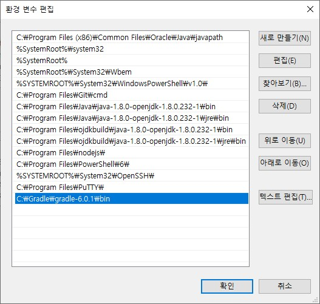
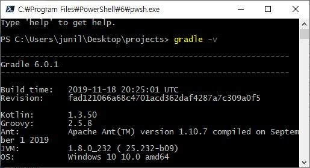
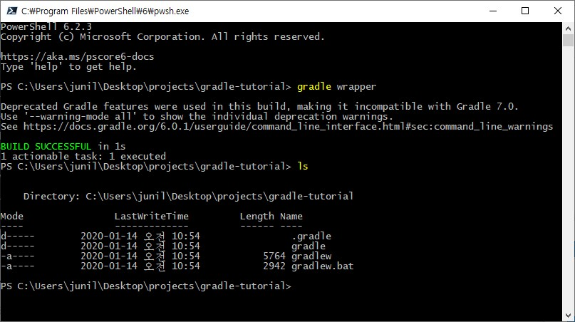

---

title: Gradle Wrapper
description: Gradle Wrapper는 Gradle을 각 개발자나 CI 서버에 깔지 않고, 프로젝트에 함께 포함시켜 배포할 수 있는 방법을 제공해준다.
sidebarDepth: 2

---

# Gradle Wrapper

`Gradle Wrapper`는 Gradle을 각 개발자나 CI 서버에 깔지 않고, 프로젝트에 함께 포함시켜 배포할 수 있는 방법을 제공해준다.

::: tip Wrapper를 사용하는 이유
Gradle 빌드를 실행하는 데 권장되는 방법은 Gradle Wrapper를 사용하는 것이다.
Wrapper는 선언 된 버전의 Gradle을 호출하여 필요한 경우 미리 다운로드하는 스크립트다.
결과적으로 수동 설치 프로세스를 수행하지 않고도 Gradle 프로젝트를 신속하게 시작할 수 있다.
:::

즉, Gradle Wrapper를 사용하면 이미 존재하는 프로젝트를 새로운 환경에서 바로 빌드할 수 있다. java나 gardle도 설치할 필요가 없다. **환경에 종속되지 않는다는 이야기다.**

## Gradle Download

Gradle을 시작하기 이전에, Gradle을 [다운로드](https://gradle.org/releases/) 받아야 한다. 링크에서 원하는 버전을 다운받으면 된다. gradle을 다운 받은 다음, 원하는 위치로 옮긴 후 환경변수를 설정해야된다.

### Linux & MacOS

``` sh {3}
$ mkdir /opt/gradle # gradle 폴더 생성
$ unzip -d /opt/gradle gradle-6.0.1-bin.zip # 압축 해제
$ export PATH=$PATH:/opt/gradle/gradle-6.0.1/bin # 환경변수 설정
```

### Window

`C:\Gradle`에 폴더를 만든 후, 다운받은 gradle을 옮긴다.


그리고 `컴퓨터 > 속성 > 고급 시스템 설정 > 고급 > 환경변수`로 들어간 다음 `시스템 변수`의 `Path`에 `C:\Gradle\gradle-6.0.1\bin`를 추가해준다.



### 설치 확인

환경변수까지 설정이 완료되었으면 `gradle -v` 명령을 통해 정상적으로 설치 되었는지 확인한다.

``` sh
$ gradle -v
```



## gradlew

프로젝트 폴더에서 다음과 같이 `gradle wrapper` 명령을 실행하면 `gradlew` 파일이 생성된다.

``` sh
# 그냥 실행
gradle wrapper

# 옵션을 사용하는 경우
gradle wrapper --gradle-version 6.0.1 --distribution-type all
```



`gradle build`를 사용하면 컴퓨터에 설치된 gradle과 java를 기준으로 build 하고, `./gradlew build`를 실행하면 `build.gradle` 파일에 정의한 내용을 기준으로 build된다.

- Linux, OSX, MacOS : _gradlew_ 사용
- window : _gradleㅈ.bat_ 사용 

### build.gradle 작성

다음은 SpringBoot를 gradle.build에 추가하는 내용이다.

``` groovy
plugins {
    id 'org.springframework.boot' version '2.2.0.RELEASE'
    id 'io.spring.dependency-management' version '1.0.8.RELEASE'
    id 'java'
}

// java version
sourceCompatibility = '1.8'

// 프로젝트의 종속성을 구성합니다.
configurations {
    developmentOnly
    runtimeClasspath {
        extendsFrom developmentOnly
    }
}

// dependency를 maven에서 가져온다.
repositories {
    mavenCentral()
}

dependencies {
    // 의존성(jar)을 가져온다.
    implementation 'org.springframework.boot:spring-boot-starter-web'

    // test시에만 의존성을 가져온다.
    testImplementation('org.springframework.boot:spring-boot-starter-test') {
        exclude group: 'org.junit.vintage', module: 'junit-vintage-engine'
    }
}

test {
    useJUnitPlatform()
}

```

## Reference
- [Gradle 공식 문서](https://docs.gradle.org/current/userguide/gradle_wrapper.html)
- [Gradle 빌드 시스템 기초](https://effectivesquid.tistory.com/entry/Gradle-%EB%B9%8C%EB%93%9C%EC%8B%9C%EC%8A%A4%ED%85%9C-%EA%B8%B0%EC%B4%88)
- [Gradle Wrapper](https://kwonnam.pe.kr/wiki/gradle/wrapper)