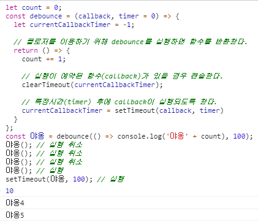
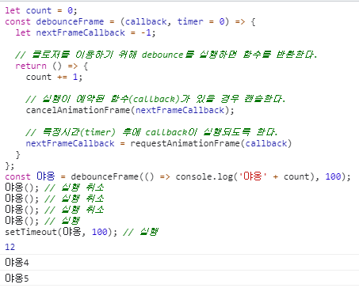
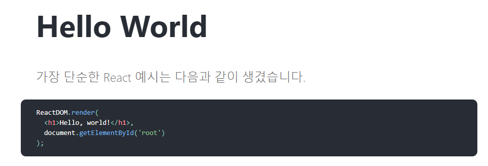

---

title: Vanilla Javascript로 React UseState Hook 만들기
description: React의 UseState Hook의 작동방식에 대해 고민해보고, 구현해보고, 최적화하는 내용을 다룹니다.
sidebarDepth: 2
date: 2021-08-25

---

# Vanilla Javascript로 React UseState Hook 만들기

::: tip 목표 

본 포스트는 React의 UseState Hook의 작동방식에 대해 고민해보고, 구현해보고, 최적화하는 내용을 다룹니다.

:::

::: tip 선행학습
구현부 코드는 아래 포스트의 내용을 모르면 이해하기가 힘들 수 있습니다.

- **[Vanilla Javascript로 웹 컴포넌트 만들기](https://junilhwang.github.io/TIL/Javascript/Design/Vanilla-JS-Component/)**
- **[Vanilla Javascript로 상태관리 시스템 만들기](https://junilhwang.github.io/TIL/Javascript/Design/Vanilla-JS-Store/)**
- **[Vanilla Javascript로 가상돔(VirtualDOM) 만들기](https://junilhwang.github.io/TIL/Javascript/Design/Vanilla-JS-Virtual-DOM/)**

:::

## 1. React의 useState

### (1) 의문을 갖기

필자는 React를 사용할 때 hook api들을 보면서 항상 신기했다.

```jsx
function Counter () {
  const [count, setCount] = useState(1);

  // 돔에서 직접 호출하기 위해 window(전역객체)에 할당
  window.increment = () => setCount(count + 1);

  return `
    <div>
      <strong>count: ${count} </strong>
      <button onclick="increment()">증가</button>
    </div>
  `;
}
```

1. useState로 state와 setState를 만들 수 있다.
2. 500ms(0.5초)마다 setCount를 실행한다.
  1. 값이 1씩 증가한다.
3. setCount가 실행되면 다시 렌더링이 실행된다.
4. 렌더링이 실행되면 Counter가 다시 실행될 것이다.
5. **Counter 컴포넌트가 다시 실행되어도 count의 값은 초기화되지 않고 유지된다.**

핵심은 5번의 내용이다. 컴포넌트 함수가 다시 실행 되더라도 count의 값이 초기화되지 않는 다는 것이다. 어떻게 이게 가능할까?

### (2) bottom - up 분석

밑 바닥 부터 차근차근 `useState` 에 대해 분석해보자.

이번 섹션의 목적은 count의 값이 어떻게 초기화되지 않고 유지 되는지 알아보는 것이다.

일단 `Counter` 컴포넌트를 렌더링 해주는 코드를 작성해보자.

```jsx
/** HTML **/
<div id="app"></div>

/** Javascript **/
function useState (initState) { }

function Counter () {
  const [count, setCount] = useState(1);

  window.increment = () => setCount(count + 1);

  return `
    <div>
      <strong>count: ${count} </strong>
      <button onclick="increment()">증가</button>
    </div>
  `;
}

function render () {
	const $app = document.querySelector('#app');
	$app.innerHTML = Counter();
}

render();
```

아마도 이런 형태일 것이다.

React를 사용하는 사람들이라면, 위의 코드를 보고 `useState`와 `render`와의 관계를 유추할 수 있다.

`useState`를 실행하면 첫 번째 인자는 `state`를 반환하고, 두 번째 인자는 state를 변경하는 `setState`를 반환하다. 그리고 `setState` 를 실행하면 `render`가 실행된다.

그래서 대략 다음과 같은 형태의 코드가 될 것이다.

```jsx
function useState(initState) {
  let state = initState; // state를 정의한다.
  const setState = (newState) => {
    state = newState; // 새로운 state를 할당한다
    render(); // render를 실행한다.
  }
  return [ state, setState ];
}
```

`useState`를 실행하면 내부에 state를 정의하고, setState를 실행하면 내부에 선언된 state를 변경할 것이다. 즉, 함수가 실행될 때 마다 결국 state의 값은 `initState` 로 초기화 될 것이다.

```jsx
const [count, setCount] = useState(1); // state에는 항상 1이 들어간다.
```

[iframe 영역]

결과물에서도 확인할 수 있듯이, state에는 항상 1이 들어간다.

그래서 `state`의 값은 내부가 아닌 외부에서 관리해야 한다.

```jsx
let state = undefined;
function useState(initState) {
  // state에 값이 없을 때만 초기화를 진행한다.
  if (state === undefined) {}
    state = initState;
  }
  const setState = (newState) => {
    state = newState; // 새로운 state를 할당한다
    render(); // render를 실행한다.
  }
  return [ state, setState ];
}

function Counter() { /*생략*/ }
function render () { /*생략*/ }

render();
```

[iframe 영역]

잘 실행되고 있다.

그런데 만약 useState와 Component가 여러 개라면 어떨까?

```jsx
function Counter () {
  const [count, setCount] = useState(1);

  window.increment = () => setCount(count + 1);

  return `
    <div>
      <strong>count: ${count} </strong>
      <button onclick="increment()">증가</button>
    </div>
  `;
}

function Cat () {
  const [cat, setCat] = useState('고양이');

  window.meow = () => setCat(cat + ' 야옹!');

  return `
    <div>
      <strong>${cat}</strong>
      <button onclick="meow()">고양이의 울음소리</button>
    </div>
  `;
}

function render () {
  app.innerHTML = `
    <div>
      ${Counter()}
      ${Cat()}
    </div>
  `;
}
```

[iframe 영역]

한 개의 state 변수로 두 개의 state를 관리하기 때문에 count와 cat이 똑같은 값을 보여주게 된다.

이를 해결하기 위해서 외부의 state 갯수를 useState가 실행되는 횟수만큼 만들어주면 될 것이다.

```jsx
let currentStateKey = 0; // useState가 실행 된 횟수
const states = []; // state를 보관할 배열
function useState(initState) {
  // initState로 초기값 설정
  if (states.length === currentStateKey) {
    states.push(initState);
  }

  // state 할당
  const state = states[currentStateKey];
  const setState = (newState) => {
    // state를 직접 수정하는 것이 아닌, states 내부의 값을 수정
    states[currentStateKey] = newState;
    render();
  }
  currentStateKey += 1;
  return [ state, setState ];
}

function Counter () { /*생략*/ }
function Cat () { /*생략*/ }

const render = () => {
  app.innerHTML = `
    <div>
      ${Counter()}
      ${Cat()}
    </div>
  `;
  // 이 시점에 currentStateKey는 2가 될 것이다.
  // 그래서 다시 0부터 접근할 수 있도록 값을 초기화 해야 한다.
  currentStateKey = 0;
}
```

[iframe 영역]

여기까지가 `useState`의 핵심 원리이다. 생각보다 간단하지 않은가?

## 2. useState 최적화

앞선 과정은 `useState`가 값을 보존하는 방법에 대해 분석해보는 내용이었다. 이제 useState를 최적화 해보자.

### (1) 변경된 값이 없을 경우

먼저 고민해볼 수 있는 경우는 `setState`에 `state`와 동일한 값을 넣었을 경우이다.

```jsx
function Counter () {
  const [count, setCount] = useState(1);
  window.nochange = () => setCount(1); // count에 똑같은 값을 삽입한다.
  return `
    <div>
      <strong>count: ${count} </strong>
      <button onclick="nochange()">변화없음</button>
    </div>
  `;
}

let renderCount = 0;
const render = () => {
  const $app = document.querySelector('#app');
  $app.innerHTML = `
    <div>
      renderCount: ${renderCount}
      ${Counter()}
    </div>
  `;
  currentStateKey = 0;
  renderCount += 1;
}
```

[iframe 영역]

값은 똑같은데 render는 계속 실행하고 있다.

이럴 때는 렌더링이 되지 않도록 방지해야한다.

```jsx
function useState(initState) {
  // initState로 초기값 설정
  const key = currentStateKey;
  if (states.length === key) {
    states.push(initState);
  }

  // state 할당
  const state = states[key];
  const setState = (newState) => {
// 값이 똑같은 경우
    if (newState === state) return;
    
    // 배열/객체일 때는 JSON.stringify를 통해 간단하게 비교할 수 있다.
    // 그런데 Set, Map, WeekMap, Symbol 같은 원시타입의 경우
    // JSON으로 파싱되지 않기 때문에 주의해야한다.
    if (JSON.stringify(newState) === JSON.stringify(state)) return;

		// 기존 값과 다른 경우에만 값을 변경하고 render()를 실행한다.
    states[key] = newState;
    render();
  }
  currentStateKey += 1;
  return [ state, setState ];
}
```

[iframe 영역]

이제 값이 똑같을 경우에는 렌더링이 되지 않는다.

### (2) 동시에 여러 setState가 실행될 경우

일단 다음과 같이 하나의 함수에 `setState`가 두 번 사용 되는 경우가 있다.

```jsx
function CounterAndMeow () {
  const [count, setCount] = useState(1);
  const [cat, setCat] = useState('야옹! ');

  function countMeow (newCount) {
    setCount(newCount);
    setCat('야옹! '.repeat(newCount));
  }

  window.increment = () => countMeow(count + 1);
  window.decrement = () => countMeow(count - 1);

  return `
    <div>
      <p>고양이가 ${count}번 울어서 ${cat} </p>
      <button onclick="increment()">증가</button>
      <button onclick="decrement()">감소</button>
    </div>
  `;
}

let renderCount = 0;
const render = () => {
  const $app = document.querySelector('#app');
  $app.innerHTML = `
    <div>
      ${renderCount}
      ${CounterAndMeow()}
    </div>
  `;
  renderCount += 1;
  currentStateKey = 0;
}
```

[iframe 영역]

`countMeow` 를 실행할 때 마다 `render`는 2번 실행된다. 즉, 비효율적이다.

이를 해결할 수 있는 방법 중 하나가 `debounce` 를 이용하는 것이다.

주절주절 설명하기보단, 코드로 살펴보자.

```jsx
let count = 0;
const debounce = (callback, timer = 0) => {
  let currentCallbackTimer = -1;

  // 클로저를 이용하기 위해 debounce를 실행하면 함수를 반환한다.
  return () => {
    count += 1;

    // 실행이 예약된 함수(callback)가 있을 경우 캔슬한다.
    clearTimeout(currentCallbackTimer);
    
    // 특정시간(timer) 후에 callback이 실행되도록 한다.
    currentCallbackTimer = setTimeout(callback, timer)
  }
};
const 야옹 = debounce(() => console.log('야옹' + count), 100);
야옹(); // 실행 취소
야옹(); // 실행 취소
야옹(); // 실행 취소
야옹(); // 실행
setTimeout(야옹, 100); // 실행
```



일반적으로 우리가 사용하는 모니터의 주사율음 60프레임이다. 즉, 1초에 60번 동안 변화가 발생하는 것이다. 마찬가지로 render 또한 1초에 많아봤자 60번만 실행되면 되지 않을까? 그정도면 충분히 최적화 할 수 있다고 생각한다.

```jsx
setInterval(() => console.log('실행'), 1000 / 60); // 1초에 60번 실행된다.
```

이 때 이용할 수 있는 API가 바로 `requestAnimationFrame` 이다.

- `requestAnimationFrame(callback)`은 브라우저에게 수행하기를 원하는 애니메이션을 알리고, 다음 리페인트가 진행되기 전에 인자로 넘겨진 `callback`함수를 호출한다.
- 화면에 새로운 애니메이션을 업데이트할 준비가 될 때마다 이 메소드를 호출하는것이 좋다.
- 일반적으로 대부분의 브라우저에서는 W3C 권장사항에 따라 그 수가 디스플레이 주사율과 일치하게됩니다. (1초에 60회, 144회, 240회 등)

```jsx
const fn = requestAnimationFrame(() => {
  console.log('실행');
  fn();
})
fn(); // 1초에 60번 실행된다.
```

- 만약 모니터의 주사율이 144HZ 일 경우, 1초에 144번 실행될 것이다.

어쨌든 다시 `requestAnimationFrame`을 이용하여 debounce를 다시 만들어보자.

```jsx
let count = 0;
const debounceFrame = callback => {
  let nextFrameCallback = -1;

  // 클로저를 이용하기 위해 debounce를 실행하면 함수를 반환한다.
  return () => {
    count += 1;

    // 실행이 예약된 함수(callback)가 있을 경우 캔슬한다.
    cancelAnimationFrame(nextFrameCallback);
    
    // 특정시간(timer) 후에 callback이 실행되도록 한다.
    nextFrameCallback = requestAnimationFrame(callback)
  }
};
const 야옹 = debounceFrame(() => console.log('야옹' + count), 100);
야옹(); // 실행 취소
야옹(); // 실행 취소
야옹(); // 실행 취소
야옹(); // 실행
setTimeout(야옹, 100); // 실행
```



사실 `setTimeout`을 사용하는 것과 크게 다르지 않다.

그리고 setTimeout과 requestAnimationFrame이 실행되는 시점에 대해 정확하게 이해하기 위해선 `이벤트 루프` 라는 개념에 대해 알아야한다. 이에 대한 내용은 [자바스크립트와 이벤트 루프 | NHN Clound Meetup](https://meetup.toast.com/posts/89) 아티클에 자세히 나와있으니 참고하면 될 것 같다.

이러한 내용을 바탕으로 리팩토링을 진행해보자.

```jsx
function debounceFrame (callback) {
  let nextFrameCallback = -1;
  return () => {
    cancelAnimationFrame(nextFrameCallback);
    nextFrameCallback = requestAnimationFrame(callback)
  }
};

let renderCount = 0;
const render = debounceFrame(() => {
  const $app = document.querySelector('#app');
  $app.innerHTML = `
    <div>
      renderCount: ${renderCount}
      ${CounterAndMeow()}
    </div>
  `;
  renderCount += 1;
  currentStateKey = 0;
});
```

사실 `debounce`는  `useState`에 적용하기보단 `render`에 적용하는게 더 쉽고 직관적이다.

[iframe 영역]

일단 이정도만 적용해도 `useState`를 이용하는데 큰 어려움은 없으리라 생각한다.

## 3. render 함수 추상화

이제 끝인줄 알았다면 매우 큰 오산! useState는 필연적으로 render와 같이 사용된다. 아주 그냥 천생연분이다. 둘 사이를 외부에서 간섭하지 못하게 함수로 보호해주자.

```jsx
function MyReact () {
  function useState () {}
  function render () {}

  return { useState, render };
}

const { useState, render } = MyReact();
```

이렇게 사용할 경우 useState와 render는 내부적으로 엮기가 더 쉬워진다. 다른 변수들도 추가해보자.

```jsx
function MyReact () {
  let currentStateKey = 0;
  const states = [];
  function useState () {}

  let renderCount = 0;
  function render () {}

  return { useState, render };
}

const { useState, render } = MyReact();
```

이렇게 하면 `currentStateKey`와 `renderCount`는 함수 내부에서만 사용할 수 있다. `useState`와 `render`에서만 접근 가능한 것이다.

다시 내용을 채워보자.

```jsx
function MyReact () {
  // 내부에서 사용되는 변수는 options에 모아놓기
  const options = {
    currentStateKey: 0,
    renderCount: 0,
    states: [],
  }

  function useState(initState) {
    const key = options.currentStateKey;
    if (states.length === key) states.push(initState);

    const state = states[key];
    const setState = (newState) => {
      states[key] = newState;
      render();
    }
    options.currentStateKey += 1;
    return [ state, setState ];
  }

  function render () {}

  return { useState, render };
}

const { useState, render } = MyReact();
```

눈치빠른 사람들(?)은 `render`가 이전 처럼 사용될 수 없으리라는 것을 알았을 것이다.

이제 `render`는 다음과 같이 사용되어야 한다.

```jsx
const { render } = MyReact();
const App = () => `
  <div>
    ${CounterAndMeow()}
  </div>
`;
render(App, document.querySelector('#app'));
```

사실 위의 코드는 [React의 HelloWorld](https://ko.reactjs.org/docs/hello-world.html) 코드와 똑같다.



어쨌든 `render`를 한 번 구성해보자.

```jsx

function MyReact () {
  // 내부에서 사용되는 변수는 options에 모아놓기
  const options = {
    currentStateKey: 0,
    renderCount: 0,
    states: [],
    root: null, 
    rootComponent: null,
  }

  function useState(initState) { /*생략*/}
  
  // render는 일종의 바지사장이라고 보면 될 것 같다.
  function render (root, rootComponent) {
    options.root = root;
    options.rootComponent = rootComponent;
    _render();
  }

  // 내부적으로 _render를 이용하여 상태변화에 대응한다.
	const _render = debounceFrame(() => {
    const { root, rootComponent } = options;
    if (!root || !rootComponent) return;
    root.innerHTML = rootComponent();
    options.currentStateKey = 0;
    options.renderCount += 1;
  });

  return { useState, render };
}
```

`_render`라는 비선실세(?)가 `render`라는 바지사장을 세워놓고 일하는 것이다.

최근에 [드라마 빈센조](http://program.tving.com/tvn/tvnvincenzo)를 재밌게 봤는데,

- `render`는 `장한서`고
- `_render`는 `장준우` 라고 보면 될 것 같다.
- 비유가 좀 이상한가?

이제 `useState`의 코드도 조금 변경해야한다.

```jsx
function useState (initState) {
  const { currentStateKey: key, states } = options;
  if (states.length === key) states.push(initState);

  const state = states[key];
  const setState = (newState) => {
    states[key] = newState;
    _render(); // 사실 이 부분만 변경되면 된다.
  }
  options.currentStateKey += 1;
  return [ state, setState ];
}
```

전체적인 코드는 다음과 같다.

```jsx
function MyReact () {
  const options = {
    currentStateKey: 0,
    renderCount: 0,
    states: [],
    root: null,
    rootComponent: null,
  }

  function useState (initState) {
    const { currentStateKey: key, states } = options;
    if (states.length === key) states.push(initState);

    const state = states[key];
    const setState = (newState) => {
      states[key] = newState;
      _render();
    }
    options.currentStateKey += 1;
    return [ state, setState ];
  }

  const _render = debounceFrame(() => {
    const { root, rootComponent } = options;
    if (!root || !rootComponent) return;
    root.innerHTML = rootComponent();
    options.currentStateKey = 0;
    options.renderCount += 1;
  });

  function render (rootComponent, root) {
    options.root = root;
    options.rootComponent = rootComponent;
    _render();
  }

  return { useState, render };

}

const { useState, render } = MyReact();

function CounterAndMeow () {
  const [count, setCount] = useState(1);
  const [cat, setCat] = useState('야옹! ');

  function countMeow (newCount) {
    setCount(newCount);
    setCat('야옹! '.repeat(newCount));
  }

  window.increment = () => countMeow(count + 1);
  window.decrement = () => countMeow(count - 1);

  return `
    <div>
      <p>고양이가 ${count}번 울어서 ${cat} </p>
      <button onclick="increment()">증가</button>
      <button onclick="decrement()">감소</button>
    </div>
  `;
}

function debounceFrame (callback) {
  let nextFrameCallback = -1;
  return () => {
    cancelAnimationFrame(nextFrameCallback);
    nextFrameCallback = requestAnimationFrame(callback)
  }
};

const App = () => `
  <div>
    ${CounterAndMeow()}
  </div>
`;

render(App, document.querySelector('#app'));
```

[iframe 영역]

위와 같이 잘 작동하는 것을 확인할 수 있다.

## 4. 모듈화

이제 모듈화를 해보자. 전체적인 디렉토리 구성은 다음과 같다.

```jsx
.
├─ src
│   ├─ components
│   │  └─ CounterAndMeow.js
│   ├─ core
│   │  └─ MyReact.js
│   ├─ utils
│   │  └─ debounceFrame.js
│   ├─ App.js
│   └─ main.js
└─ index.html
```

`/index.html`

```html
<!DOCTYPE html>
<html lang="en">
<head>
  <meta charset="UTF-8">
  <meta name="viewport" content="width=device-width, initial-scale=1.0">
  <title>MyReact App</title>
</head>
<body>
<div id="app"></div>
<script type="module" src="./src/main.js"></script>
</body>
</html>
```

`/src/main.js`

```jsx
import { render } from "./core/MyReact.js";
import { App } from "./App.js";

render(App, document.querySelector('#app'));
```

`/src/App.js`

```jsx
import { CounterAndMeow } from "./components/CounterAndMeow.js";

export const App = () => `
  <div>
    ${CounterAndMeow()}
  </div>
`;
```

`/src/utils/debounceFrame.js`

```jsx
export function debounceFrame (callback) {
  let nextFrameCallback = -1;
  return () => {
    cancelAnimationFrame(nextFrameCallback);
    nextFrameCallback = requestAnimationFrame(callback)
  }
};
```

`/src/core/MyReact.js`

```jsx
import { debounceFrame } from "../utils/debounceFrame.js";

function MyReact () {
  const options = {
    currentStateKey: 0,
    renderCount: 0,
    states: [],
    root: null,
    rootComponent: null,
  }

  function useState (initState) {
    const { currentStateKey: key, states } = options;
    if (states.length === key) states.push(initState);

    const state = states[key];
    const setState = (newState) => {
      states[key] = newState;
      _render();
    }
    options.currentStateKey += 1;ㅇ
    return [ state, setState ];
  }

  const _render = debounceFrame(() => {
    const { root, rootComponent } = options;
    if (!root || !rootComponent) return;
    root.innerHTML = rootComponent();
    options.currentStateKey = 0;
    options.renderCount += 1;
  });

  function render (rootComponent, root) {
    options.root = root;
    options.rootComponent = rootComponent;
    _render();
  }

  return { useState, render };

}

export const { useState, render } = MyReact();
```

`/src/components/CounterAndMeow.js`

```jsx
import { useState } from "../core/MyReact.js";

export function CounterAndMeow () {
  const [count, setCount] = useState(1);
  const [cat, setCat] = useState('야옹! ');

  function countMeow (newCount) {
    setCount(newCount);
    setCat('야옹! '.repeat(newCount));
  }

  window.increment = () => countMeow(count + 1);
  window.decrement = () => countMeow(count - 1);

  return `
    <div>
      <p>고양이가 ${count}번 울어서 ${cat} </p>
      <button onclick="increment()">증가</button>
      <button onclick="decrement()">감소</button>
    </div>
  `;
}
```

코드에 대한 설명은 생략하겠다. 이미 앞선 과정에서 많이 다뤘기 때문이다.

---

이렇게 `useState` 그리고 이와 강하게 엮여있는 `render`에 대해서 다뤄봤다.

여기에 diff 알고리즘까지 사용한다면 더욱더 완성도 있는 렌더링 시스템이 되리라 생각한다.

그리고 지금은 이벤트를 관리하는 방법이 무척 잘못된 상태다.

따라서 위와 같이 구성했을 때 어떤 방식으로 이벤트를 관리하면 좋은지에 대해서도 다룰 수 있을 것 같다.

## Summary

- useState에 대해 분석하기
- 클로저에 대한 이해
- useState 최적화하기
  - 값이 변경되지 않는 경우
- 렌더링 최적화하기
  - 동시에 setState가 실행되는 경우
  - debounce로 최적화하기
  - requestAnimationFrame 이용하기
- 모듈화

## Reference


