---

title: 프레임워크 없이 만드는 SSR
description: 프레임워크를 사용하지 않고 SSR과 CSR을 적용해보면서 프론트엔드에서의 SSR에 대해 학습합니다.
sidebarDepth: 2
date: 2023-02-12
tag: javascript, vanilla, ssr
thumbnail: https://user-images.githubusercontent.com/18749057/218312378-4a6d1e60-813b-4dab-a1aa-a07dcba82411.png

feed:
   enable: true

---

# 프레임워크 없이 만드는 SSR

::: tip 

✒️ 본 게시물은 줌인터넷에 재직할 때 작성한 [Vue SSR 제대로 적용하기 (feat. Vanilla SSR)](https://zuminternet.github.io/vue-ssr/)의 **프레임워크 없이 적용해보기(Vanilla SSR)** 파트를 조금 더 고도화한 것입니다.

:::

## 1. SSR과 CSR

<br />

### (1) SSR(Servier Side Rendering)이란 무엇인가?

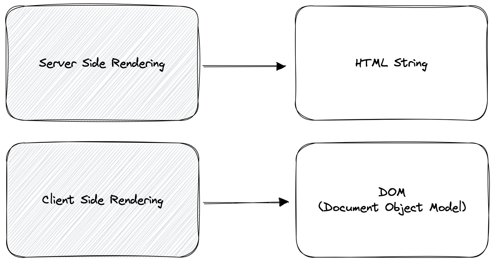

SSR은 쉽게 말해서 **“서버에서 HTML을 문자열로 만들어주는 것”** 이라고 할 수 있다.
사실 렌더링이란 표현이 무척 어색하다.
렌더링이라기보단, 문자열을 만들어 주는 것이다.
아마 Client Side Rendering 이라는 표현의 대비로 만든 표현이 아닐까?

나는 2011년도에 PHP라는 언어로 웹 개발에 입문했다.
PHP는 Hypertext Preprocessor(HTML 전처리기)를 의미한다.
[위키백과](https://ko.wikipedia.org/wiki/PHP)에 있는 표현을 빌리자면
**“동적 웹 페이지를 만들기 위해 설계되었으며 이를 구현하기 위해 PHP로 작성된 코드를 PHP 엔진에서 html 파일과 같이 처리하여 작성자가 원하는 웹 페이지를 생성”** 하는 언어이다.
HTML 문자열을 서버에서 동적으로 만들어낸다는 것이다.

`index.html`은 정적인 한 개의 페이지를 의미하고, `index.php`는 수 십, 수 백, 수 천개의 페이지를 “동적”으로 보여줄 수 있는 페이지가 될 수 있다.


즉, 서버에서 정의한 규칙에 따라 HTML 문자열을 동적으로 만들어낼 수 있었고, 원래는 이게 웹 개발의 자연스러운 모습이었다.
**웹 개발자들은 SSR이라는걸 인지하지 않고 SSR을 하고 있었다는 것이다.**

<br />

### (2) CSR의 등장하기 까지

웹 사이트는 쉽게 말해서 **문서(Document)** 이다.
HTML을 이용하여 텍스트에 의미와 규칙을 부여하여 문서를 구성하고, 웹 브라우저를 이용해 이를 출력(렌더링) 되도록 만든 것이다.

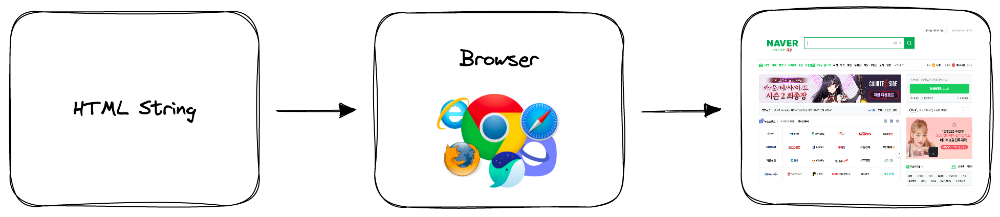

그러다 웹 브라우저에 이미지도 넣고, 동영상도 넣고, 플래시도 넣고, 넣을 수 있는 미디어는 다 넣을 수 있게 되었다.
어렸을 때는 웹 사이트에 올라와있는 플래시 게임들을 즐겼었다.

이 외에도 웹 사이트에서 할 수 있는 것들이 점점 많아졌는데,
가령 구글에서 `ajax(Asynchronous Javascript And XML)`라는 웹 API를 이용하여 gmail과 google map을 만들었다.
즉, **페이지 이동 없이** 서버의 데이터를 불러올 수 있게 된 것이다. 필자는 처음 Ajax를 사용했을 때 무척 신기했다.
브라우저에서 직접 서버의 데이터를 가져올 수 있다는 것이,
그래서 페이지의 새로고침 없이 사용자에게 새로운 정보(UI)를 보여줄 수 있다는 것이 굉장히 세련된 기술이라고 느꼈다.

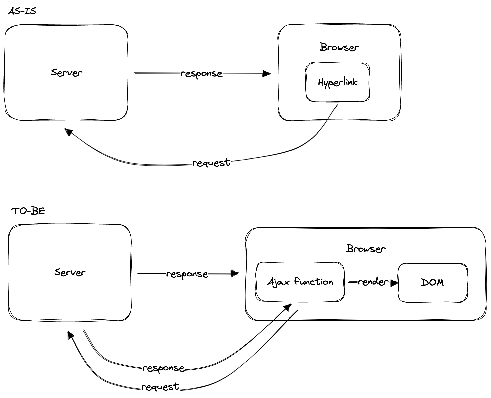

그러다 **아이폰**과 아이폰에서 실행되는 **모바일 앱** 이라는 것들이 등장했다.
그리고 구글에서는 **안드로이드 OS**를 만들었으며, 그렇게 스마트폰이 전세계적으로 보급되고, **모바일 앱은 소프트웨어 산업의 큰 축**이 되었다.

그래서 사람들은, 기업들은 **앱 개발**을 하기 시작했다. 아니, 앱 개발을 해야만 했다. 그래야 자본주의 시장에서 돈을 벌 수 있고 생존할 수 있었으니까.

::: tip 앱과 웹

뜬금없이 앱 개발을 언급하는 이유는, **웹의 폭발적인 발전은 앱의 등장 이후라고 생각하기 때문**이다.

일단 앱 개발을 한다고 치면, 적어도 두 개(iOS와 Android) 이상의 OS에서 동작하도록 만들어야했다. 그래야 사용자를 잘 확보할 수 있기 때문이다.

:::

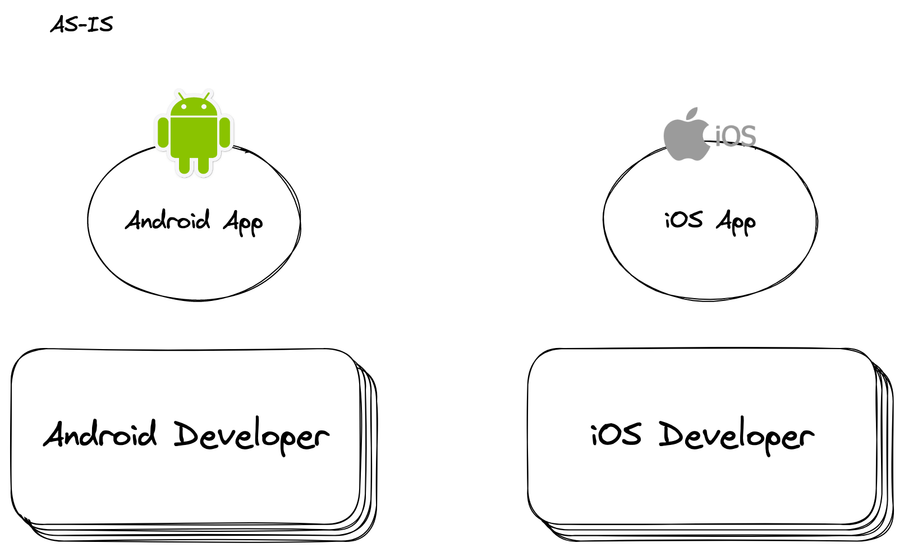

그래서 Android 개발자와 iOS 개발자를 채용해야 했고, 심지어 모바일 웹도 만들 수 있게 웹 개발자도 필요했다. 

가령, 필자가 근무하고 있는 네이버를 예로 들자면

- 데스크톱 웹(naver.com)
- 모바일 웹(m.naver.com)
- 모바일 앱(iOS, Android)
- …

이런 식으로 서비스를 사용자들에게 다양한 형태로 보급하고 있다.
옛날에는 웹 개발자 한 명만 있으면 됐었는데, 이제 앱 개발자 + 웹 개발자 모두 필요한 것이다.
기업 입장에서는 **비용에 대한 생각**을 할 수 밖에 없을 것이다.

그리고 모바일 앱의 경우 업데이트가 쉽지 않다.
웹은 서버에 배포하면 끝이지만,
앱은 업데이트를 할 경우 검수도 받아야 하고,
사용자가 직접 배포된 앱에 대해 업데이트를 실행해야 새로운 기능들을 이용할 수 있는 것이다.

이 때 문제가 되는 것은, **어플리케이션에 치명적인 문제가 있어서 당장 업데이트를 해야되는 상황** 일 때 이다.
단순히 작은 버그일 수도 있고, 보안과 관련된 문제일 수도 있고, 혹은 서비스 유지비에 구멍이 있어서 이를 막아야 하는 경우일 수도 있다.
하지만 어떤식으로든 **모바일 앱은 사용자가 업데이트를 해야** 최신화가 된다.

다시 기업(서비스 제공자)의 입장에서 할 수 있는 핵심 고민거리를 나열해보자.

- 어떻게 해야 최대한 적은 돈으로 서비스를 제공할 수 있을까?
- 어떻게 해야 모바일 앱을 즉시 업데이트할 수 있을까?

이렇게 두 가지 축이라고 생각하는데, 이를 해결해줄 수 있는 수단이 바로 "웹"이다.
**꼭 네이티브로 구성하지 않아도 되는 부분을 웹 뷰로 제공한다면,** 이슈가 생겼을 때 바로 업데이트할 수도 있으며 많은 수의 앱 개발자들을 필요로 하지 않을 것이다.

대신 웹에서 네이티브 앱까지의 퍼포먼스까지는 아니더라도 어떻게든 **네이티브 앱과 유사한 사용성**을 만들어내야 했다.
그래서 등장한 것이 Angular, Vue, React 같은 프론트엔드 프레임워크라고 생각한다.
UI에 대한 관리포인트가 많아질수록 과거의 SSR 방식이 발목을 잡았을 것이며, 이를 해결하기 위해 프론트엔드를 전문적으로 다루는 개발자와 프레임워크가 생겨난 것이다.

**웹(Client)에서 렌더링을 어떻게 빠르게 할 수 있을지, 정교하게 관리할 수 있을지 고민하기 시작했고, CSR(Client Side Rendering)이란 개념을 만들어냈다.**

이제 서버에서는 REST API로 JSON이나 XML를 만들고, 웹 브라우저에서 Javascript로 UI를 그리는 현재의 모습이 된 것이다.

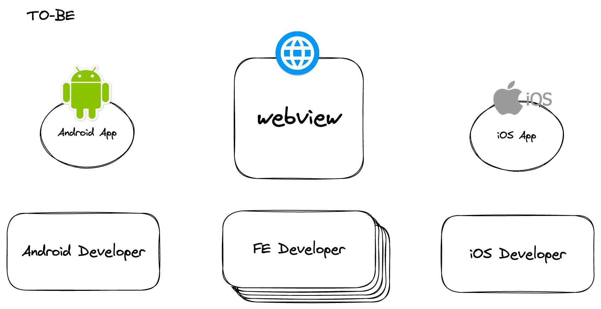

::: tip 정리

1. 과거에는 원래 SSR이 자연스러웠다.
2. 스마트폰과 모바일 앱이 등장했다.
3. 모바일 앱은 개발 비용과 유지 비용이 많이 든다. (iOS + Android + 검수 + 업데이트)
4. 이를 해결하기 위해 앱에 웹을 불러오는 하이브리드 방식의 앱을 만들기 시작했다.
5. 다만 웹은 앱에 비해 무척 느리고 무거웠기 때문에, 앱과 유사한 사용성을 제공하기 위해 많은 연구가 이루어졌고, 브라우저가 발전해갔으며 자연스럽게 프론트엔드 개발자들이 생겼고, 프론트엔드 프레임워크도 생겼다.
6. 지금은 브라우저에서 오직 Javscript만 이용하여 UI를 만드는 것(CSR)이 자연스러운 모습으로 자리잡혔다.

:::

<br />

### (3) 왜 SSR이 필요한가?

개발자는 항상 “왜”를 생각해야 한다.

- 이 기술을 “왜” 써야 할까?
- “왜” SSR이 필요한걸까?
- “왜” CSR로는 충분하지 않을걸까?
- …

CSR을 한다는 것은 **자바스크립트 파일이 비대해진다**는 것이다. 그래서 브라우저는 자바스크립트 파일을 파싱하여 화면에 렌더링하기 까지의 시간이 늘어난다.
    
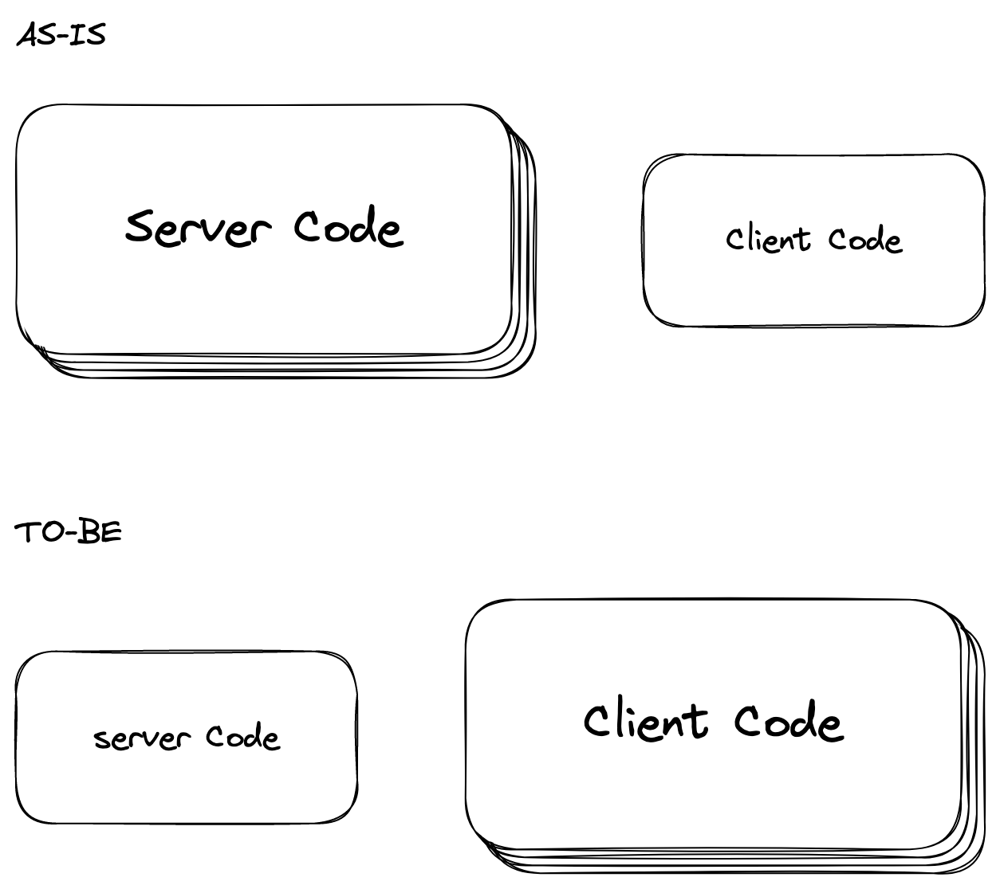
    
브라우저가 서버에서 받아오는 최초의 HTML은 고작 `<div id="app"></div>` 혹은 `<div id="root"></div>` 한 줄 인데,
이렇게 될 경우 **검색엔진이 사이트의 내용을 파악하여 색인하는 것이 불가능** 해진다.
    
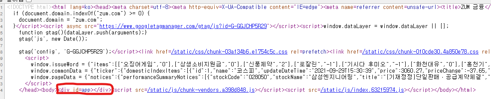

쉽게 말해서 CSR은 **사용성**과 **사용자 유입**에 대한 **손실**이 있다. 이를 해결하기 위해 SSR(Server Side Rendering)을 해야 하는 것이다.

::: tip 정리

- 브라우저가 자바스크립트 파일을 해석하여 렌더링 하기 전에, Server에서 내려준 HTML 문자열을 토대로 렌더링을 한다. (사용성 확보)
- 검색 엔진이 웹 페이지에 접근했을 때 HTML 문자열을 해석하여 색인(인덱싱)이 가능해진다.

:::

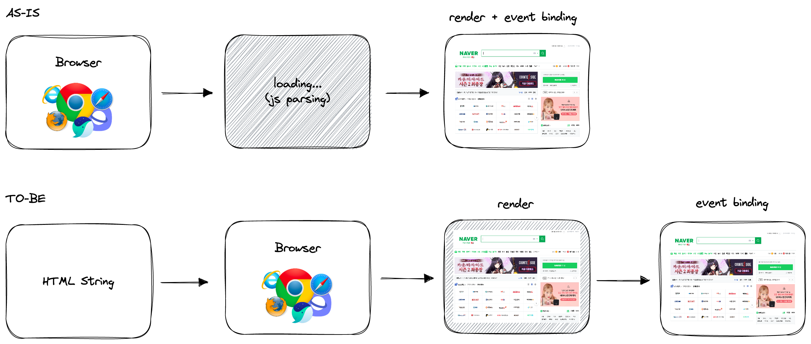

필요한 이유(Why)는 알았는데, 문제는 과거의 SSR 방식으로는 이 문제를 해결할 수 없다는 것이다. 어떻게(How) 이 문제를 해결할 수 있을까?

<br />

### (4) 관심사 분석 및 분리

"관심사" 라는 용어를 많이 들어봤을 것이다. 우리가 작성하는 코드들의 **목적**을 잘 분석해보면 어떨까?
javascript로 간단하게 할 일 목록을 만들어서 출력하는 코드를 작성해보자.

```html
<!DOCTYPE html>
<html lang="en">
<head>
  <meta charset="UTF-8">
  <title>Todo List</title>
</head>
<body>
<div id="app"></div>
<script>
const todoItems = ['SSR이 뭔데?', 'CSR은 뭔데?', '이게 왜 필요한건데?'];

const $app = document.querySelector('#app');

$app.innerHTML = `
  <ul>
    ${todoItems.map(item => `<li>${item}</li>`).join('')}
  </ul>
`;
</script>
</body>
</html>
```

이렇게 작성한 코드를 한 번 분석해보자.

- data

```js
const todoItems = ['SSR이 뭔데?', 'CSR은 뭔데?', '이게 왜 필요한건데?'];
```

이 코드는 브라우저에 종속적이지 않은 자바스크립트 코드이다. 그냥 “배열”이다.

- view

```js
const $app = document.querySelector('#app');

$app.innerHTML = `
  <ul>
    ${todoItems.map(item => `<li>${item}</li>`).join('')}
  </ul>
`;
```

이 코드는, data를 토대로 DOM을 만들고 있다. 즉, “브라우저에 종속적”인 코드이다. 그런데 잘 보면 “브라우저에 독립”적인 코드가 보인다.

```js
`<ul>${todoItems.map(item => `<li>${item}</li>`).join('')}</ul>`;
```

이 부분은 DOM이 아닌 “문자열”을 만드는 코드이다. 그래서 전체적으로 다음과 같이 분리해볼 수 있을 것 같다.

```js
/*********** 브라우저에 독립적인 코드 ***********/

// Data
const todoItems = ['SSR이 뭔데?', 'CSR은 뭔데?', '이게 왜 필요한건데?'];

// Component
const TodoItem = (item) => `<li>${item}</li>`;
const TodoList = (items) => `<ul>${items.map(TodoItem).join('')}</ul>`;

/*********** 브라우저에 독립적인 코드 ***********/

/*********** 브라우저에 종속적인 코드 ***********/
const $app = document.querySelector('#app');
$app.innerHTML = TodoList(todoItems);
/*********** 브라우저에 종속적인 코드 ***********/
```

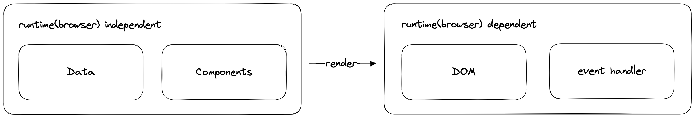

이렇게 관심사를 분리해볼 수 있을 것이다.
여기서 **브라우저에 독립적인 코드**는 Node.js로 만들어진 서버에서 **재사용**할 수 있지 않을까?
SSR이 가능해지지 않을까?

이에 대한 검증은 뒤에서 자세히 다뤄보도록 하겠다.

## 3. MVVM Pattern

뜬금없지만 MVVM Pattern을 짚고 넘어가야 SSR을 더 잘 설명할 수 있을 것 같다.

MVVM은 `Model` - `View` - `ViewModel` 이라는 관심사로 이루어진 패턴이다.

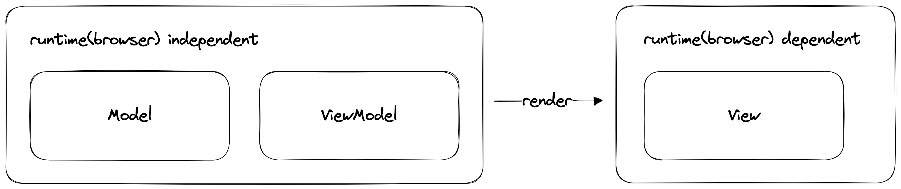


::: tip MVVM Pattern

1. Model을 토대로 ViewModel(실제 View는 아니지만, View의 모습을 본뜬 것)을 구성한다.

2. ViewModel에 변화가 생기면 View에 반영한다.

3. ViewModel은 Runtime(브라우저, 서버, 앱)에 독립적이다. React에서 쓰는 JSX(VirtualDOM)이 이에 해당한다.

4. View는 브라우저, 서버, 앱 등 런타임에 종속적이다.
    - 브라우저 → DOM(Document Object Model)
    - 서버 → 표준입출력, 콘솔 등
    - 앱 → Native View

:::

어떤 내용인지 아직 감이 잡히지 않을 것이다. 

그럼 앞에서 작성한 코드를 토대로 MVVM이 무엇인지 자세하게 살펴보자.

<br />

### 1) Model

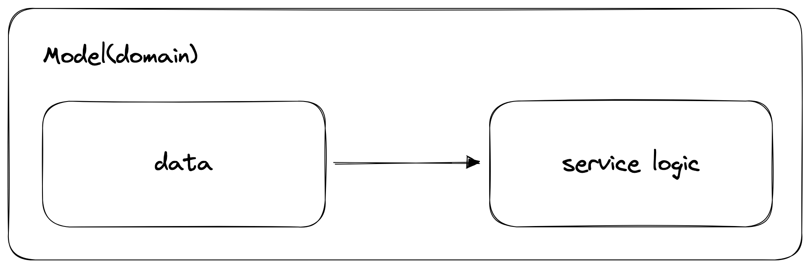

Model은 데이터와 데이터를 변경하는 각종 서비스(비즈니스) 로직이 이에 해당한다.
앞에서 작성한 `todoItems`가 이에 해당한다.

```js
const todoItems = ['SSR이 뭔데?', 'CSR은 뭔데?', '이게 왜 필요한건데?'];
```

여기에 비즈니스 로직을 추가해보자.

```js
const addItem = (item) => todoItems.push(item);
const deleteItem = (index) => { todoItems.splice(index, 1); }
const updateItem = (index, item) => { todoItems[index] = item; }
const itemCount = () => todoItems.length;
const fetchItemsInPage = (page, size = 5) => {
  const start = page * size;
  const end = start + size;
  return todoItems.slice(start, end);
}
```

**todoItems라는 데이터와, 이를 변경하거나 가져오는 함수 혹은 메소드가 Model에 해당하는 것이다.**

<br />

### 2) ViewModel

ViewModel은 View와 비슷한 구조를 가진 객체인데, **쉽게 말해서 jsx 같은 것**이다.
그런데 앞에서 작성한 코드는 “객체”가 아니라 “문자열”을 반환한다.

```js
const TodoItem = (item) => `<li>${item}</li>`;
const TodoList = (items) => `<ul>${items.map(TodoItem).join('')}</ul>`;
```

이걸 객체로 표현하고 싶다면, 다음과 같이 작성해보면 된다.

```js
const createViewModel = (name, props, ...children) => ({ name, props, children: children.flat() });

const el = createViewModel;

const TodoItem = (item) => el('li', null, item)
const TodoList = (items) => el('ul', null, items.map(TodoItem));
```

그리고 미관상 좋지 않기 때문에(?) jsx라는 것을 사용하여 VirtualDOM을 표현한다.

```js
const TodoItem = (item) => <li>{item}</li>;
const TodoList = (items) => <ul>{items.map(TodoItem)}</ul>;
```

React나 Vue에서 이렇게 작성된 VirtualDOM을 RealDOM으로 변경해주는 것이다. (ViewModel을 View로 변환)

<br />

### 3) View

프론트엔드 개발자에게 View는 보통 “브라우저(DOM)”를 의미한다.

::: tip 그런데 만약에 “테트리스”라는 게임을 만든다고 한다면 어떨까 🤔

테트리스의 UI로 `canvas` `svg` `html` 등을 선택할 수 있을 것이다.
즉, View가 달라지는 것이다.

혹은 브라우저 콘솔이 될 수도 있고, OS의 표준 출력이 될 수도 있다.

:::

```js
// ViewModel
const TodoItem = (item) => `<li>${item}</li>`;
const TodoList = (items) => `<ul>${items.map(TodoItem).join('')}</ul>`;

// View
const $app = document.querySelector('#app');
$app.innerHTML = TodoList(todoItems);
```

이를 조금 더 변형해보자면, 다음과 같다.

```js
// View
const render = () => {
  const $app = document.querySelector('#app');
  $app.innerHTML = TodoList(todoItems);
}

render();
```

만약에 사용자의 동작을 통해서 아이템을 만든다고 한다면 어떨까?

```js
// View
const render = () => {
  const $app = document.querySelector('#app');
  $app.innerHTML = `
    ${TodoList(todoItems)}
    <button id="delete">아이템 삭제</button>
    <button id="add">아이템 추가</button>
  `;
 
   $app.querySelector('#add').onclick = () => {
      addItem('아이템 추가' + Date.now());
      render();
   }
   
   $app.querySelector('#delete').onclick = () => {
      deleteItem(itemCount - 1);
      render();
   }
}

render();
```

model에서 작성한 서비스 로직을 수행하고, ViewModel에 반영하고, View로 변환하는 과정이라고 볼 수 있다.

ViewModel을 문자열이 아닌 객체로 표현하고, 이를 변환하는 과정까지 최소한으로 작성해보자.

```js
const createViewModel = (name, props, ...children) => ({ name, props, children: children.flat() });

const createElement = (viewModel) => {
  if (typeof viewModel === 'string') {
    // text node를 만들어서 반환한다.
    return document.createTextNode(viewModel);
  }

  // tag에 대한 element를 만든다.
  const $el = document.createElement(viewModel.name);

  // 정의한 속성을 삽입한다.
  Object.entries(viewModel.props || {})
        .forEach(([attr, value]) => $el.setAttribute(attr, value));
  
  // node의 children viewModel을 dom으로 변환한다.
  // 즉, 모든 viewModel을 순회한다.
  const children = viewModel.children.map(createElement);
  
  // $el에 변환된 children을 추가한다.
  children.forEach(child => $el.appendChild(child));
  
  return $el;
}

const TodoItem = (item) => createViewModel('li', null, item)
const TodoList = (items) => createViewModel('ul', null, items.map(TodoItem));
const Button = ({ id, children }) => createViewModel('button', { id }, children);

const render = () => {
  const $app = document.querySelector('#app');
  $app.append(createElement(
    createViewModel('div', null,
      TodoList(todoItems),
      Button({ id: 'add', children: '추가' }),
      Button({ id: 'delete', children: '삭제' }),
    )
  ));

  $app.querySelector('#add').onclick = () => {
    addItem('아이템 추가' + Date.now());
    render();
  }

  $app.querySelector('#delete').onclick = () => {
    deleteItem(itemCount - 1);
    render();
  }
}

render();
```

이렇게 Model을 ViewModel로 관리하고, ViewModel을 View로 변환하는 과정에 대해 간단하게 살펴봤다.
그런데 이게 도대체 SSR이랑 무슨 상관이 있는지 의문이 들 수 있다.

핵심은 Model과 ViewModel인데, **ViewModel을 DOM이 아닌 string으로 변환**해보면 어떨까?

```js
const createViewModel = (name, props, ...children) => ({ name, props, children: children.flat() });

const TodoItem = (item) => createViewModel('li', null, item)
const TodoList = (items) => createViewModel('ul', null, items.map(TodoItem));

const convertViewModelToString = (viewModel) => {
  if (typeof viewModel === 'string') {
    return viewModel;
  }

  const { name, props, children } = viewModel;
  const attrs = Object.entries(props || {})
    .map(([key, value]) => `${key}="${value}"`)
    .join(' ');

  const tagAndAttrs = [name, attrs].filter(Boolean).join(' ');
  const childrenString = children.map(convertViewModelToString).join('');

  return `<${tagAndAttrs}>${childrenString}</${name}>`
}

// <ul><li>hello</li><li>world</li></ul>
const result = convertViewModelToString(TodoList(['hello', 'world']));
```

서버에서는 이렇게 html 문자열로 변환된 response를 내려주면 되는 것이다.

**사실, SSR만 생각한다면 그냥 Template literal을 쓰는게 더 편할 수 있다.**

```js
const TodoItem = (item) => `<li>${item}</li>`;
const TodoList = (items) => `<ul>${items.map(TodoItem).join('')}</ul>`;

// <ul><li>hello</li><li>world</li></ul>
console.log(TodoList(['hello', 'world']));
```

이 글의 목적은 MVVM이 아닌 SSR이기 때문에 **이제부터 ViewModel(vdom)에 대한 언급은 따로 하지 않을 것**이다. 

<br />

### 4) 정리하며

이렇게 MVVM을 다뤘던 이유는 프론트엔드 프레임워크에서 다루는 관심사가 무엇인지 이해가 필요했기 때문이다.
정리해보자면 프론트엔드 개발에서는 다음과 같은 관심사를 가진다.

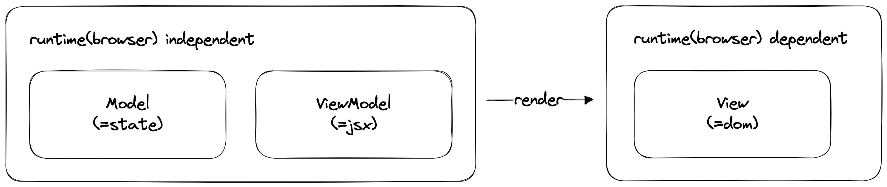

1. UI를 그릴 때 필요한 “데이터”와 이 데이터를 다루는 “서비스 로직”
2. 데이터를 “어떤 모습으로 그려질 것인가”를 표현하는 객체 (JSX 같은)
3. 실제 UI (DOM, EventHandler)

그리고 **SSR과 CSR은 1번과 2번의 코드를 공유**할 수 있고, 이를 공유할 수 있는 형태로 코드를 작성해야 한다는 것이다.
당연한 이야기지만, 이게 잘 구분이 되어있으면 **테스트**를 하기도 편해진다. 

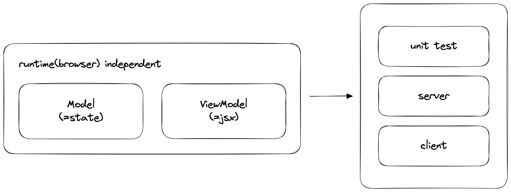

## 4. Vanilla Javascript SSR

<br />

### 1) 무작정 만들어보기

앞에서 장황하게 설명했으니  이제 본격적으로 Server Side Rendering을 직접 구현해보자.

일단 프로젝트를 구성해야 하기 때문에, express를 설치해야한다.

```bash
$ npm init -y
$ npm install express
```

package.json에 server.js를 node로 실행해주는 npm script를 작성하고

```json{8-10}
{
  "name": "01-simply",
  "version": "0.0.0",
  "main": "server.js",
  "type": "module",
  "license": "MIT",

  "scripts": {
    "start": "node server.js"
  },

  "dependencies": {
    "express": "latest"
  }
}
```

server.js를 만들고 코드를 작성해보자.

```js
import express from 'express';

const app = express();

app.get("/", (req, res) => {
  res.send(`
    <!DOCTYPE html>
    <html lang="en">
    <head>
      <meta charset="UTF-8">
      <title>Todo List</title>
    </head>
    <body>
    <div id="app">
      <ul>
        <li>SSR이 뭔데?</li>
        <li>CSR은 뭔데?</li>
        <li>이게 왜 필요한건데?</li>
        <li>MVVM은 또 뭐야?</li>
        <li>공부해야 할게 왜이렇게 많아?</li>
      </ul>
    </div>
    </body>
    </html>
  `);
});

app.listen(8000, () => console.log('listen to http://localhost:8000'));
```

서버에 요청이 들어오면 html을 문자열을 통째로 만들어서 넘겨주는 방식이 Server Side Rendering 이다.

그리고 정상적으로 나오는지 실행해보자.

```bash
$ npm run start
```

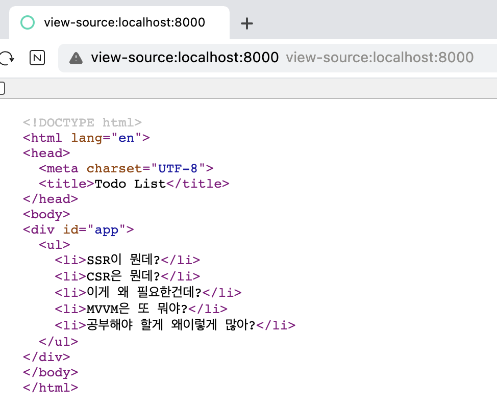 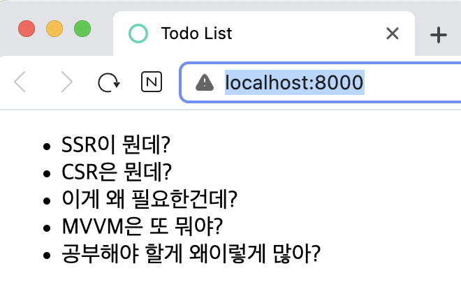 

“소스보기”에서 모든 HTML 문자열이 정상적으로 내려왔는지 확인해볼 수 있고, 렌더링도 정상적으로 되었다.

<br />

### 2) 관심사 분리

앞에서 작성한 코드에서 “서버에 독립적인 코드”와 “서버를 구성하는 코드”를 구분할 수 있다. 이를 토대로 코드를 다시 작성해보자.

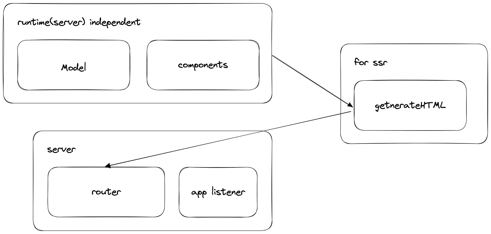

```js{1-20}
const html = `
  <!DOCTYPE html>
  <html lang="en">
  <head>
    <meta charset="UTF-8">
    <title>Todo List</title>
  </head>
  <body>
  <div id="app">
    <ul>
      <li>SSR이 뭔데?</li>
      <li>CSR은 뭔데?</li>
      <li>이게 왜 필요한건데?</li>
      <li>MVVM은 또 뭐야?</li>
      <li>공부해야 할게 왜이렇게 많아?</li>
    </ul>
  </div>
  </body>
  </html>
`;

const app = express();
app.get("/", (req, res) => res.send(html));
app.listen(8000, () => console.log('listen to http://localhost:8000'));
```

`html` 이라는 변수는 단순한 문자열을 담고 있다. 즉, 서버를 구성할 때 필요한 코드가 아니기 때문에 아예 분리해볼 수 있을 것 같다.

`html` 의 값에서 목록을 표현하는 부분도 분리해보자.

```js
const todoItems = ['SSR이 뭔데?', 'CSR은 뭔데?', '이게 왜 필요한건데?', 'MVVM은 또 뭐야?', '공부해야 할게 왜이렇게 많아?'];
const TodoList = `
  <ul>
    ${todoItems.map(item => `<li>${item}</li>`).join('')}
  </ul>
`;

const html = `
  <!DOCTYPE html>
  <html lang="en">
  <head>
    <meta charset="UTF-8">
    <title>Todo List</title>
  </head>
  <body>
  <div id="app">${TodoList}</div>
  </body>
  </html>
`;
```

지금은 단순하게 “문자열”로 표현하고 있는데, 이걸 함수로 변환하여 이렇게 표현할 수 있다. 이렇게 함수로 분리할 경우, items에 대한 관리를 유연하게 할 수 있을 것이다. 전역에 있는 item을 사용해도 되고, 필요할 때 만들어서 사용할 수도 있다. 테스트가 가능해지는 것이다.

```js
const todoItems = ['SSR이 뭔데?', 'CSR은 뭔데?', '이게 왜 필요한건데?', 'MVVM은 또 뭐야?', '공부해야 할게 왜이렇게 많아?'];
const TodoItem = item => `<li>${item}</li>`;
const TodoList = items => `<ul>${items.map(TodoItem).join('')}</ul>`;

const generateHTML = (todoItems) => `
  <!DOCTYPE html>
  <html lang="en">
  <head>
    <meta charset="UTF-8">
    <title>Todo List</title>
  </head>
  <body>
  <div id="app">${TodoList(todoItems)}</div>
  </body>
  </html>
`;
```

이걸 다시 router에 적용해보자.

```js
app.get("/", (req, res) => res.send(generateHTML(todoItems)));
```

이제 Server에 독립적인 코드를 모듈화해서 관리할 수 있지 않을까?

`/src/model.js`

```js
export const model = {
  todoItems: [
    'SSR이 뭔데?',
    'CSR은 뭔데?',
    '이게 왜 필요한건데?',
    'MVVM은 또 뭐야?',
    '공부해야 할게 왜이렇게 많아?'
  ],
}
```

먼저 model(data)를 관리하는 부분을 아예 분리했다. 기존에는 todoItems라는 문자열로 표현했는데, 이렇게 명확하게 model이라고 명시해주는게 좋을 것 같다.

`/src/components.js`

```js
export const TodoItem = item => `<li>${item}</li>`;
export const TodoList = items => `<ul>${items.map(TodoItem).join('')}</ul>`;
```

이 코드들은 html 문자열을 구성하는 각각의 컴포넌트이기 때문에 별도의 파일로 분리했다.

`/src/ssr.js`

```js
import { TodoList } from './components.js';

export const generateHTML = (model) => `
  <!DOCTYPE html>
  <html lang="en">
  <head>
    <meta charset="UTF-8">
    <title>Todo List</title>
  </head>
  <body>
  <div id="app">${TodoList(model.todoItems)}</div>
  </body>
  </html>
`;
```

`generateHTML`함수도 별도의 파일로 분리한 이유는, Server에 독립적이라고 하더라도 Client에서는 사용될 일이 없을 것 같기 때문이다. 즉, 코드 자체는 Server에 독립적이지만, 이 코드의 관심사는 Server에서 HTML 문자열을 만드는 것에 초점이 있기 때문에 아예 ssr이라는 파일로 분리했다. ssr에 관련된 것들은 이 파일에서 관리하면 될 것이다.

`/server.js`

```js
import express from 'express';
import { generateHTML } from "./src/ssr.js";
import { model } from "./src/model.js";

const app = express();
app.get("/", (req, res) => res.send(generateHTML(model)));
app.listen(8000, () => console.log('listen to http://localhost:8000'));
```

앞에서 작성한 모듈을 조합하여 Server의 코드를 구성해주면 된다. `/` 페이지에 요청(Request)가 들어오면 html 문자열을 만들어서 응답(Response)하는 것이다.

::: tip 현재 전체적인 파일 및 폴더 구조는 다음과 같다.
```
.
├── package.json
├── server.js
└── src
    ├── components.js
    ├── model.js
    └── ssr.js
```
:::

<br />

### 3) 데이터 추가/삭제

여태까지는 이미 있는 데이터를 표현하는 수준으로만 다뤘다. 만약에 데이터를 추가하거나 삭제하는 경우가 생긴다면 어떻게 해야 좋을까? 이를 최대한 심플하게 표현해보자.

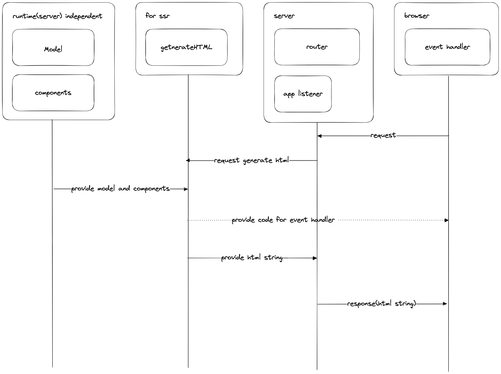

`/src/model.js`

먼저 model에 todoItem을 추가/삭제하는 메소드를 추가해야한다.

```js{10-11}
export const model = {
  todoItems: [
    'SSR이 뭔데?',
    'CSR은 뭔데?',
    '이게 왜 필요한건데?',
    'MVVM은 또 뭐야?',
    '공부해야 할게 왜이렇게 많아?'
  ],

  addTodoItem(item) { this.todoItems.push(item) },
  deleteTodoItem(index) { this.todoItems.splice(index, 1) },
}
```

`/src/components.js`

간단하게 버튼을 표현할 수 있는 컴포넌트를 추가해보자.

```js{3}
export const TodoItem = (item) => `<li>${item}</li>`;
export const TodoList = (items) => `<ul>${items.map(TodoItem).join('')}</ul>`;
export const Button = ({ id, text }) => `<button id="${id}">${text}</button>`;
```

`/src/ssr.js`

generateHTML에 아이템을 추가/삭제 할 수 있는 버튼을 하나 만들자.

```js{12-13,17-29}
import { TodoList, Button } from './components.js';

export const generateHTML = (model) => `
  <!DOCTYPE html>
  <html lang="en">
  <head>
    <meta charset="UTF-8">
    <title>Todo List</title>
  </head>
  <body>
    <div id="app">
      ${Button({ id: 'add', text: '아이템 추가' })}
      ${Button({ id: 'delete', text: '아이템 삭제' })}
      ${TodoList(model.todoItems)}
    </div>
    <script>
      document.querySelector('#add').onclick = () => {
        fetch('/api/todo-items', {
          method: 'post',
          body: JSON.stringify({ content: '추가된 아이템' }),
          headers: {
            'Content-Type': 'application/json',
          }
        }).then(() => location.reload())
      }
  
      document.querySelector('#delete').onclick = () => {
        fetch('/api/todo-items/0', { method: 'delete' }).then(() => location.reload())
      }
    </script>
  </body>
  </html>
`;
```

추가 버튼, 삭제 버튼을 만들었고 해당 버튼을 클릭하면 서버에 요청을 보낸 뒤 새로고침을 하는 방식이다.

`/server.js`

```js{6,10-18}
import express from 'express';
import { generateHTML } from "./src/ssr.js";
import { model } from "./src/model.js";

const app = express();
app.use(express.json());

app.get("/", (req, res) => res.send(generateHTML(model)));

app.post("/api/todo-items", (req, res) => {
  model.addTodoItem(req.body.content);
  res.status(201).send();
});

app.delete("/api/todo-items/:index", (req, res) => {
  model.deleteTodoItem(req.params.index);
  res.status(204).send();
});

app.listen(8000, () => console.log('listen to http://localhost:8000'));
```

서버에는 todoItems를 추가/삭제할 수 있는 route를 추가했다.

서버를 다시 시작해서 확인해보면 이렇게 동작하는 것을 확인할 수 있다.

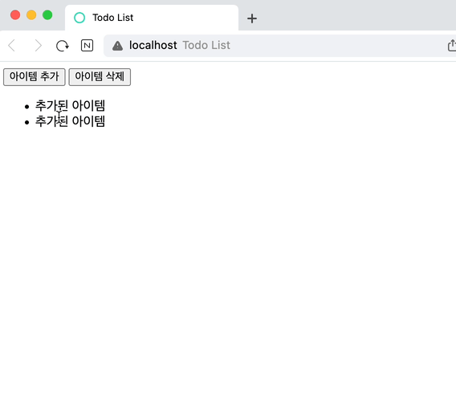

소스보기를 하면 다음과 같다.

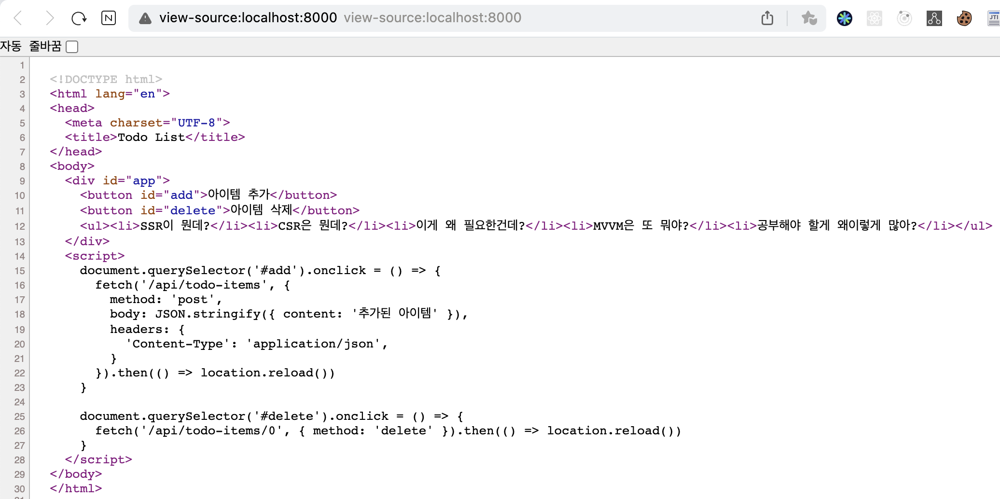

## 5. SSR에 CSR 덧붙이기 ( Hydration )

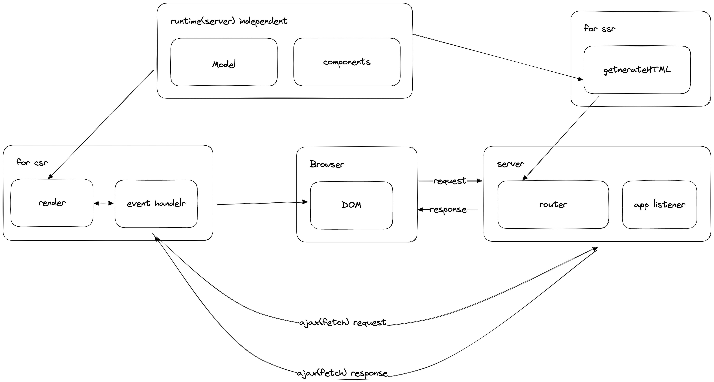

이제부터가 제일 중요한데, **SSR로 만들어진 HTML 페이지에 CSR을 덧씌우는 작업(hydration)** 이 필요하다.

<br />

### 1) ssr에서 static 파일 불러오기

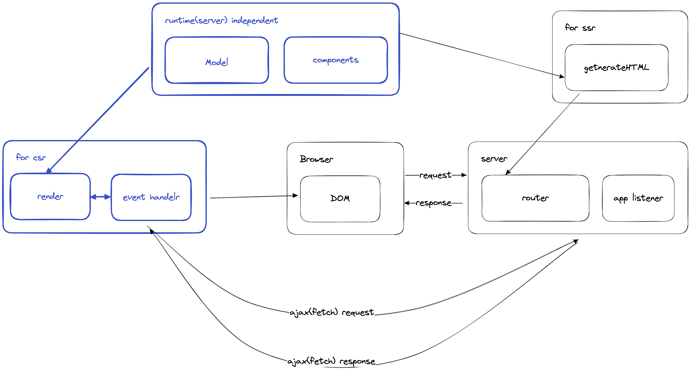

CSR을 같이 하기 위해서 javascript 파일을 client(browser)에서도 사용할 수 있게 정적파일(static)으로 등록하는 과정이 필요하다. 지금은 클라이언트(브라우저)에서 src 폴더에 있는 파일들에 접근할 수 없는 상태이다.


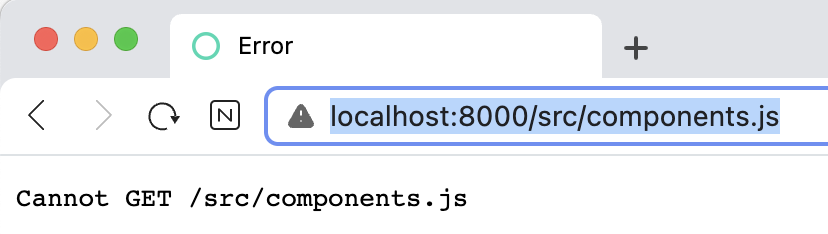

일단 위의 문제를 해결해야 한다.

`/server.js`

```js{9-10}
import express from 'express';
import { generateHTML } from "./src/ssr.js";
import { model } from "./src/model.js";

const app = express();

app.use(express.json());

// static 파일 등록
app.use("/src", express.static("./src"));

app.get("/", (req, res) => res.send(generateHTML(model)));
app.post("/api/todo-items", (req, res) => {
  model.addTodoItem(req.body.content);
  res.status(201).send();
});
app.delete("/api/todo-items/:index", (req, res) => {
  model.deleteTodoItem(req.params.index);
  res.status(204).send();
});

app.listen(8000, () => console.log('listen to http://localhost:8000'));
```

이렇게 하면 클라이언트에서 `/src` 폴더에 있는 정적 파일들에 접근할 수 있게 된다.

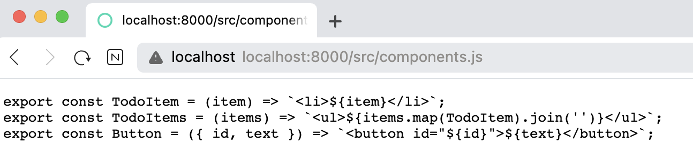

이제 `ssr.js`에 있던 이벤트 등록 코드를 분리해보자.

`/src/main.js`

```js
function main() {
  document.querySelector('#add').onclick = () => {
    fetch('/api/todo-items', {
      method: 'post',
      body: JSON.stringify({ content: '추가된 아이템' }),
      headers: {
        'Content-Type': 'application/json',
      }
    }).then(() => location.reload())
  }
  
  document.querySelector('#delete').onclick = () => {
    fetch('/api/todo-items/0', { method: 'delete' }).then(() => location.reload())
  }
}

main();
```

그리고 이 파일을 SSR을 할 때 불러오도록 만들 수 있다.

`/src/ssr.js`

```js{16}
import { TodoList, Button } from './components.js';

export const generateHTML = (model) => `
  <!DOCTYPE html>
  <html lang="en">
  <head>
    <meta charset="UTF-8">
    <title>Todo List</title>
  </head>
  <body>
    <div id="app">
      ${Button({ id: 'add', text: '아이템 추가' })}
      ${Button({ id: 'delete', text: '아이템 삭제' })}
      ${TodoList(model.todoItems)}
    </div>
    <script src="./src/main.js" type="module"></script>
  </body>
  </html>
`;
```

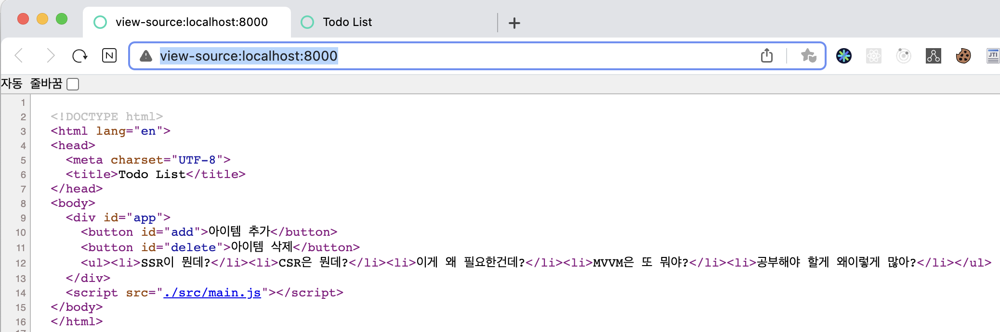

정상적으로 동작하는 것도 확인할 수 있다.

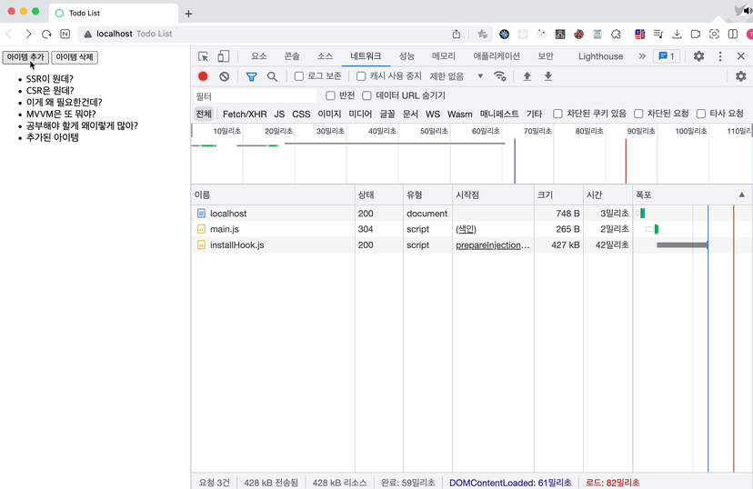

여기서 살펴봐야할 부분은, 변경된 데이터를 불러오기 위해 **새로고침을 하고 있다는 점**이다.
**렌더링을 오직 Server에 의존**하고 있기 때문에 Client에서도 데이터를 받아와서 렌더링할 수 있는 코드가 있어야 이 문제를 해결할 수 있다.
한 번 작성해보자.

<br />

### 2) Client Side Rendering 덧붙이기

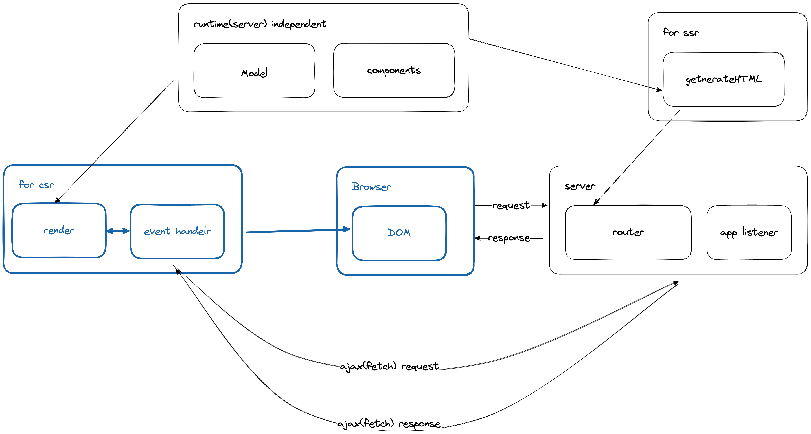

일단 ssr.js에 있던 일부 코드를 분리해서 components에 작성해보자.

`/src/components.js`

```js{5-9}
export const TodoItem = (item) => `<li>${item}</li>`;
export const TodoList = (items) => `<ul>${items.map(TodoItem).join('')}</ul>`;
export const Button = ({ id, text }) => `<button id="${id}">${text}</button>`;

export const App = (todoItems) => `
  ${Button({ id: 'add', text: '아이템 추가' })}
  ${Button({ id: 'delete', text: '아이템 삭제' })}
  ${TodoList(todoItems)}
`;
```

App 컴포넌트가 server와 client 양쪽에서 쓰일 수 있기 때문에 ssr에서 분리해서 components에 다시 정의했다.

`/src/ssr.js`

```js{1,12}
import { App } from "./components.js";

export const generateHTML = (model) => `
  <!DOCTYPE html>
  <html lang="en">
  <head>
    <meta charset="UTF-8">
    <title>Todo List</title>
  </head>
  <body>
    <div id="app">
      ${App(model.todoItems)}
    </div>
    <script src="./src/main.js" type="module"></script>
  </body>
  </html>
`;
```

ssr.js의 generateHTML에 방금 작성한 App 컴포넌트를 적용해주고

`/src/main.js`

```js{1,6}
import { App } from "./components.js";
import { model } from "./model.js";

function render() {
  const $app = document.querySelector('#app');
  $app.innerHTML = App(model.todoItems);

  $app.querySelector('#add').onclick = () => {
    model.addTodoItem('새로운 아이템');
    render();
  }

  $app.querySelector('#delete').onclick = () => {
    model.deleteTodoItem(0);
    render();
  }
}

function main() {
  render();
}

main();
```

main.js에도 App를 DOM으로 변환하고 이벤트를 바인딩 해주는 render 함수를 만들었다. 이제 사이트가 로딩 되면 CSR로 UI를 다시 그려준다.

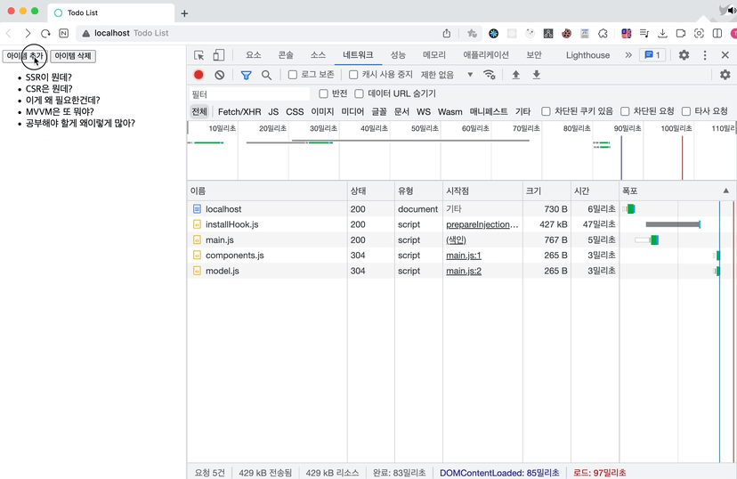

보이는 것 처럼, **CSR로 렌더링을 하기 때문에 새로고침을 하지 않는다.** 다만 새로고침을 하면 **데이터가 초기화되는 모습**을 확인할 수 있다. 이제 이 문제를 해결해보자.

<br />

### 3) Server의 데이터를 Client에 동기화 하기

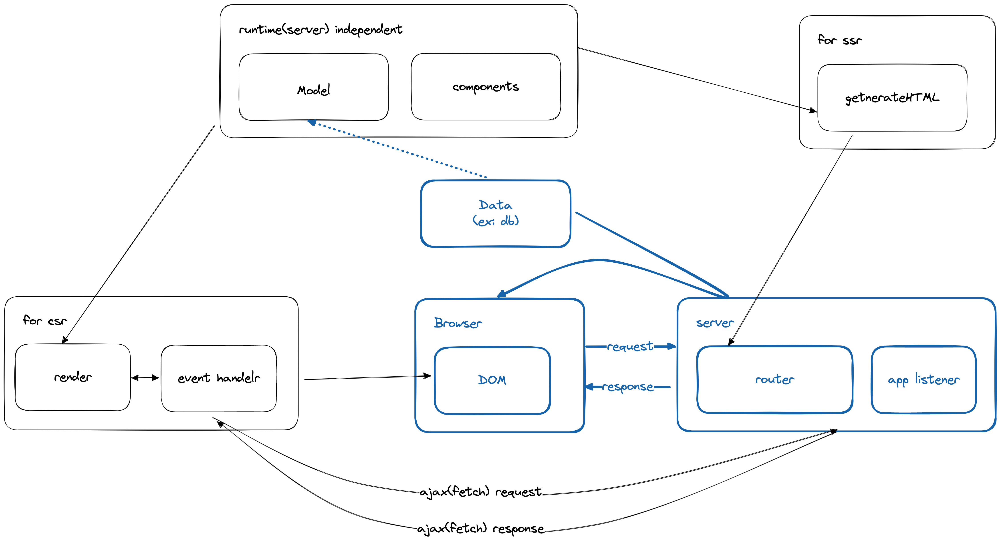

동기화하는 방법이 어렵진 않다. **model data를 전역에 등록해서 관리**하면 된다.

`/src/model.js`

```js{12}
export const model = {
  todoItems: [
    'SSR이 뭔데?',
    'CSR은 뭔데?',
    '이게 왜 필요한건데?',
    'MVVM은 또 뭐야?',
    '공부해야 할게 왜이렇게 많아?'
  ],

  addTodoItem(item) { this.todoItems.push(item) },
  deleteTodoItem(index) { this.todoItems.splice(index, 1) },
  init(initialModel) { this.todoItems = initialModel.todoItems; }
}
```

먼저 model에 init이라는 메소드를 추가했다. 새로운 todoItems을 받아와서 교체해주는 메소드이다. **이걸 server와 client에서 각각 사용할 것**이다.

`/src/ssr.js`

```js{14}
import { App } from "./components.js";

export const generateHTML = ({ todoItems }) => `
  <!DOCTYPE html>
  <html lang="en">
  <head>
    <meta charset="UTF-8">
    <title>Todo List</title>
  </head>
  <body>
    <div id="app">
      ${App(todoItems)}
    </div>
    <script>window.__INITIAL_MODEL__ = ${JSON.stringify({ todoItems })}</script>
    <script src="./src/main.js" type="module"></script>
  </body>
  </html>
`; 
```

핵심은
```html
<script>window.__INITIAL_MODEL__ = ${JSON.stringify({ todoItems })};</script>
```
이 코드인데, client의 **window 객체에 server에 있는 model 값을 할당**하여 넘겨주는 것이다.
그 후에 **main.js에서 client에 있는 model에 이를 동기화**해주며 될 것이다.

`/src/main.js`

```js{20}
import { App } from "./components.js";
import { model } from "./model.js";

function render() {
  const $app = document.querySelector('#app');
  $app.innerHTML = App(model.todoItems);

  $app.querySelector('#add').onclick = async () => {
    model.addTodoItem('새로운 아이템');
    render();
  }

  $app.querySelector('#delete').onclick = async () => {
    model.deleteTodoItem(model.todoItems.length - 1);
    render();
  }
}

function main() {
  model.init(window.__INITIAL_MODEL__);
  render();
}

main();
```

이렇게 **server에서 내려주는 데이터를 client에 동기화**시킬 수 있다.
한 번 server.js에서 임의의 데이터를 넘겨주고 어떻게 렌더링을 하는지 확인해보자.

`/src/server.js`

```js{10}
import express from 'express';
import { generateHTML } from "./src/ssr.js";
import { model } from "./src/model.js";

const app = express();
app.use(express.json());

app.use("/src", express.static("./src"));

app.get("/", (req, res) => res.send(generateHTML({ todoItems: ['test'] })));

app.listen(8000, () => console.log('listen to http://localhost:8000'));
```

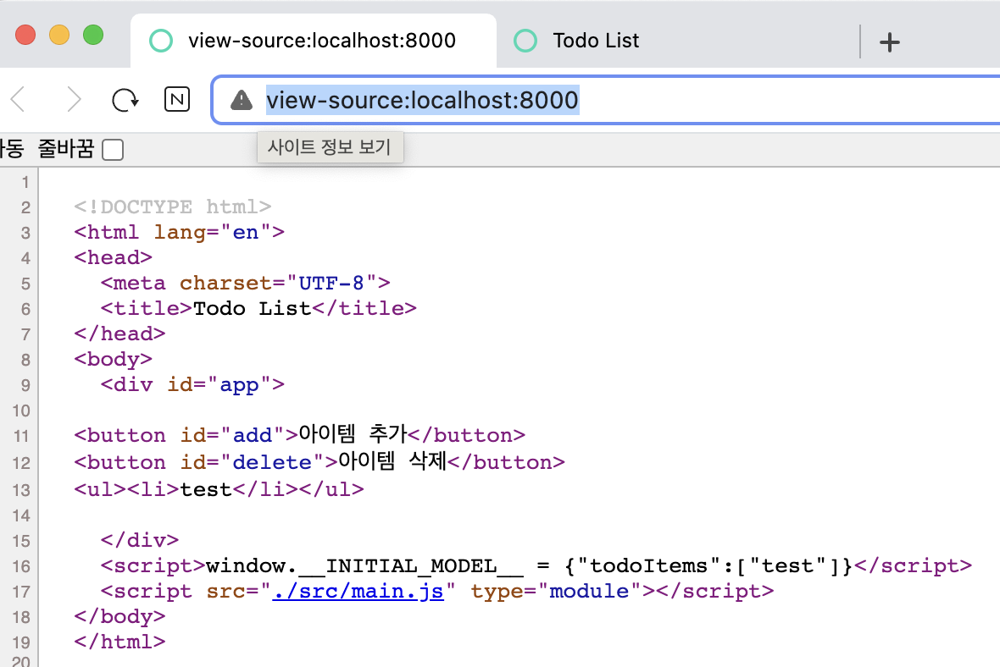

16번째 줄에서 server에서 정의한 todoItems가 출력된 것을 확인할 수 있으며

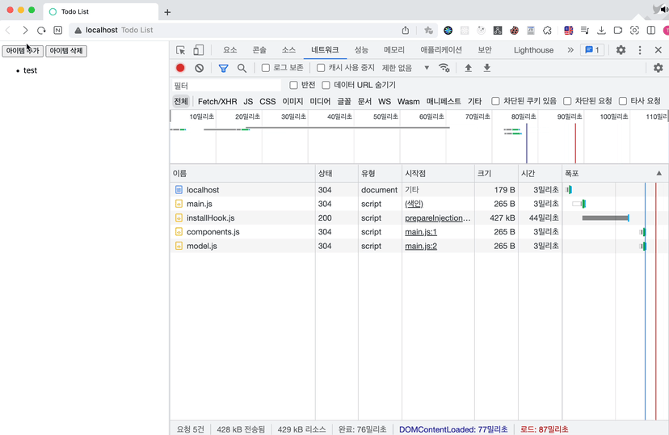

client에 정상적으로 동기화 되는 것을 확인할 수 있다.
다만, **client에서 데이터를 변경한 다음에 새로고침을 하면 데이터가 날라가는 것**을 확인할 수 있다.

이제 client에서 데이터가 변했을 때 server에 이를 넘겨주도록 해보자.

<br />

### 4) 양방향 동기화 (Server ←→ Client)

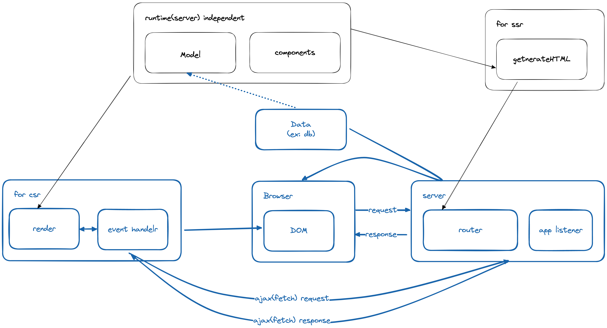

1. model의 변화를 api를 통해 server에 알리고
2. server에서 model의 값을 변경하고
3. 변경된 값을 다시 client에게 넘겨주는 방식이다.

`/server.js`

```js
import express from 'express';
import { generateHTML } from "./src/ssr.js";
import { model } from "./src/model.js";

const app = express();
app.use(express.json());

app.use("/src", express.static("./src"));

app.get("/", (req, res) => res.send(generateHTML(model)));

app.put("/api/todo-items", (req, res) => {
  model.init({ todoItems: req.body.todoItems });
  res.status(200).send(model.todoItems);
});

app.listen(8000, () => console.log('listen to http://localhost:8000'));
```

이렇게 `PUT /api/todo-items`에 새로운 todoItems을 보내고, 이를 서버에서 관리하는 model에 덮어쓰도록 해야한다. 클라이언트에서 이 API를 호출하면 될 것이다.

`/src/main.js`

```js{4-14,22,27}
import { App } from "./components.js";
import { model } from "./model.js";

function updateTodoItems(todoItems) {
  const headers = {  'Content-Type': 'application/json',  };
  const body = JSON.stringify({ todoItems });
  return fetch('/api/todo-items', { method: 'put', headers, body })
    .then(res => res.json());
}

async function syncServerModel() {
  const newTodoItems = await updateTodoItems(model.todoItems);
  model.init({ todoItems: newTodoItems });
}

function render() {
  const $app = document.querySelector('#app');
  $app.innerHTML = App(model.todoItems);

  $app.querySelector('#add').onclick = async () => {
    model.addTodoItem('새로운 아이템');
    syncServerModel().then(render);
  }

  $app.querySelector('#delete').onclick = async () => {
    model.deleteTodoItem(model.todoItems.length - 1);
    syncServerModel().then(render);
  }
}

function main() {
  model.init(window.__INITIAL_MODEL__);
  render();
}

main();
```

아이템을 추가하거나 삭제하면 api를 호출하고, 새로운 아이템을 받아오고, 이를 동기화시키는 형태이다.

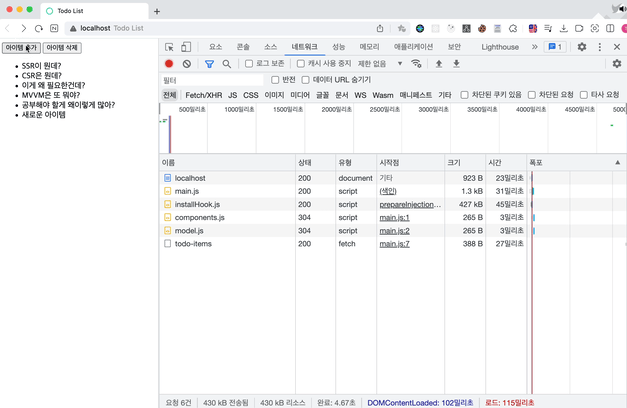

이제 **새로고침을 해도 데이터가 보존되는 것**을 확인할 수 있다.

<br />

### 5) 정리

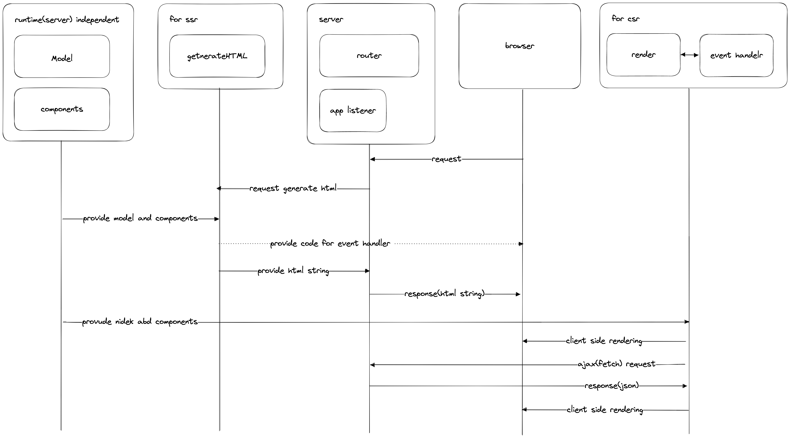

1. model과 component를 작성한다. 이 때 model과 component는 런타임(브라우저 혹은 서버)에 독립적인 코드여야 한다.
2. browser가 server에 요청을 보내면, server에서 component와 model을 조합하여 html 문자열을 만들어서 응답으로 보내준다.
3. browser는 server에서 내려준 html을 토대로 사용자에게 유의미한 화면(UI)을 보여주고, model과 component를 조합하여 다시 렌더링(DOM을 그려줌)한다.
4. client와 server 사이에는 데이터 동기화 작업이 필요하다. 이 때 window 객체를 이용할 수 있다.

::: tip 주의할 점

model과 component에 런타임에 종속적이 코드가 있을 경우 문제가 발생할 수 있다는 점이다.
이를 해결하기 위해서는 `jsdom` 같은 라이브러리로 가상의 window, document 객체를 만들어서 억지로라도 코드가 돌아고도록 만드는 방법이 있다.
테스트를 할 때도 `jsdom`이 이용된다.

:::

::: tip 폴더구조

```{6}
.
├── package.json
├── server.js
└── src
    ├── components.js
    ├── main.js          # 이 파일이 새로 생겼다.
    ├── model.js
    └── ssr.js
```

:::

## 7. Simple Router


한 가지 더 고려할 것은 바로 Router 이다. 
메인페이지와 서브페이지 모두 SSR을 적용해야 한다면, **페이지에 따라 서로 다른 데이터를 내려주는 방식**으로 작성해야 할 것이다.

한 번 간단하게 서브페이지와 메인페이지를 구성해보자.

`/src/components.js`

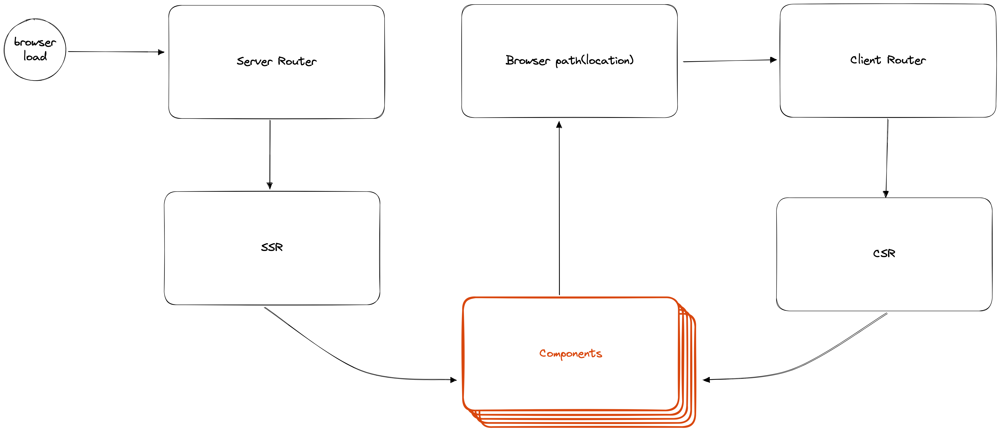

```js{4-8,28-36}
export const TodoItem = (item) => `<li>${item}</li>`;
export const TodoList = (items) => `<ul>${items.map(TodoItem).join('')}</ul>`;
export const Button = ({ id, text }) => `<button id="${id}">${text}</button>`;
export const Home = (todoItems) => `
  ${Button({ id: 'add', text: '아이템 추가' })}
  ${Button({ id: 'delete', text: '아이템 삭제' })}
  ${TodoList(todoItems)}
`;

export const DefaultLayout = (children) => `
  <main>
    <h1>Todo App</h1>
    <header>
      <nav>
        <a href="/">메인페이지</a>
        <a href="/sub">서브페이지</a>
      </nav>
    </header>
    <section style="margin: 30px 0">
      ${children}
    </section>
    <footer>
      <p>Copyright &copy; 2023 황준일</p
    </footer>
  </main>
`;

export const App = (path, model) => {
  if (path === "/") {
    return DefaultLayout(Home(model.todoItems));
  } else if (path === "/sub") {
    return DefaultLayout(`<p>서브페이지 입니다.</p>`);
  } else {
    return DefaultLayout(`<p>404</p>`);
  }
}
```

먼저 기존에 있던 `App` 컴포넌트의 이름을 `Home`으로 변경하고, `DefaultLayout`을 만들어서 Header와 Footer를 삽입했다. App은 다시 정의하여 path에 대응하는 컴포넌트를 반환하도록 했다.

`/src/main.js`

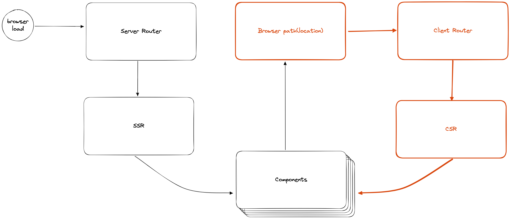

```js{20-30,50}
import { App } from "./components.js";
import { model } from "./model.js";

function updateTodoItems(todoItems) {
  const headers = {  'Content-Type': 'application/json',  };
  const body = JSON.stringify({ todoItems });
  return fetch('/api/todo-items', { method: 'put', headers, body }).then(res => res.json());
}

async function syncServerModel() {
  const newTodoItems = await updateTodoItems(model.todoItems);
  model.init({ todoItems: newTodoItems });
}

function render() {
  const path = location.pathname;
  const $app = document.querySelector('#app');
  $app.innerHTML = App(path, model);

  document.querySelectorAll('a').forEach($a => {
    $a.addEventListener('click', (event) => {
      const path = $a.getAttribute('href');
      if ($a.href === path) {
        return;
      }
      event.preventDefault();
      history.pushState(null, null, path);
      render();
    })
  })

  if (path !== '/') return;

  $app.querySelector('#add').onclick = async () => {
    model.addTodoItem('새로운 아이템');
    syncServerModel().then(render);
  }

  $app.querySelector('#delete').onclick = async () => {
    model.deleteTodoItem(model.todoItems.length - 1);
    syncServerModel().then(render);
  }
}

function main() {
  model.init(window.__INITIAL_MODEL__);
  render();

  // 뒤로가기를 했을 때도 렌더링을 다시 실행함
  window.addEventListener('popstate', render);
}

main();
```

~~render가 무척 비대해지고 있는데, 이를 깔끔하게 분리하는건 독자의 몫이라고 생각한다~~

render 내부에 간단하게 router를 표현할 수 있도록 만들었다. a 태그를 클릭했을 때 원본 이벤트를 제거하고 `history.pushState`로 브라우저의 주소를 바꾸고, 다시 렌더링을 실행한다. 동적으로 페이지를 렌더링 하는 것이다.

`/server.js`

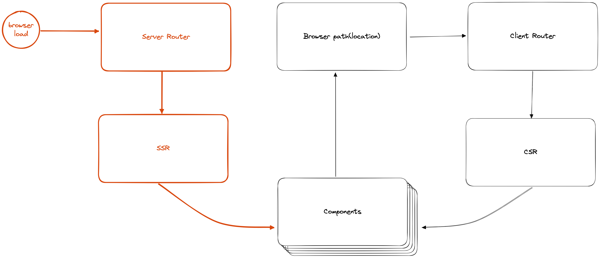

```js{9-12,15}
import express from 'express';
import { generateHTML } from "./src/ssr.js";
import { model } from "./src/model.js";

const app = express();
app.use(express.json());

app.use("/src", express.static("./src"));
app.put("/api/todo-items", (req, res) => {
  model.init({ todoItems: req.body.todoItems });
  res.status(200).send(model.todoItems);
});

// 정규식을 통해 모든 url과 매칭되도록 했다.
app.get(/\/.*/, (req, res) => res.send(generateHTML(req.path, model)))

app.listen(8000, () => console.log('listen to http://localhost:8000'));
```

express에서는 route의 등록 순서로 주소를 핸들링한다.

그러니까 request path가  `/src/**` → `/api/todo-items` → `/*` 순서로 매칭 되는지 탐색하는 것이다. 이제 사용자가 접근하는 모든 페이지는

```js
app.get(/\/.*/, (req, res) => res.send(generateHTML(req.path, model)))
```

이 router에 매칭될 것이다.

`/src/ssr.js`

```js{12}
import { App } from "./components.js";

export const generateHTML = (path, model) => `
  <!DOCTYPE html>
  <html lang="en">
  <head>
    <meta charset="UTF-8">
    <title>Todo List</title>
  </head>
  <body>
    <div id="app">
      ${App(path, model)}
    </div>
    <script>window.__INITIAL_MODEL__ = ${JSON.stringify({ todoItems: model.todoItems })}</script>
    <script src="./src/main.js" type="module"></script>
  </body>
  </html>
`;
```

generateHTML에서는 model 뿐만 아니라 path도 같이 받아오도록 했다. path에 따라 App 내부적으로 어떤 layout을 그릴지 판단하도록 하기 위함이다.


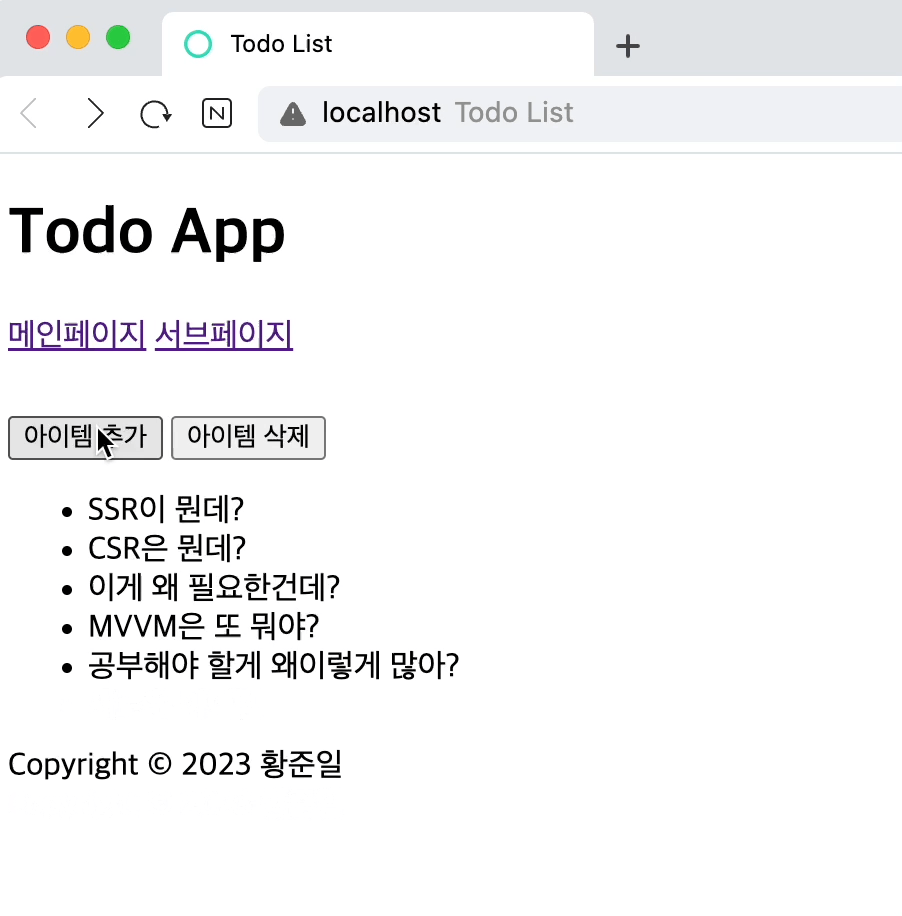

::: tip 정리

1. 클라이언트에서 동적으로 현재 주소에 대한 컴포넌트를 그리고
2. 사용자가 새로고침을 하거나, 사이트에 접근했을 때 주소를 토대로 SSR을 한다.
3. 404 페이지 또한 SSR을 토대로 표현한다.

:::

## Summary

다시 핵심적인 내용만 정리해보면 다음과 같다.

_1. CSR과 SSR 양쪽에서 사용 가능한 코드를 분리해서 관리해야 한다._
    
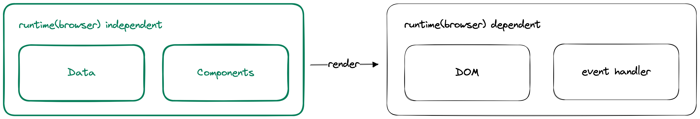

<br>

_2. SSR에서는 model과 component를 조합해서 문자열로 만들어서 응답을 해준다._
    
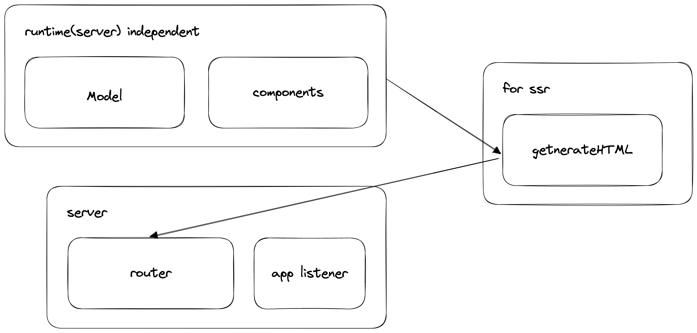

<br>
    
_3. CSR에서는 model과 component를 조합해서 DOM으로 만들어준다._
    
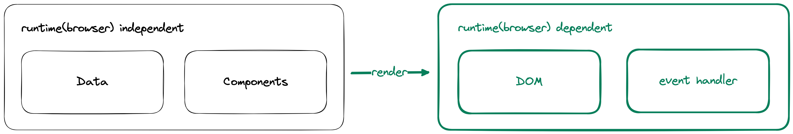

<br>
    
_4. SSR과 CSR은 데이터를 동기화해야 한다._
    
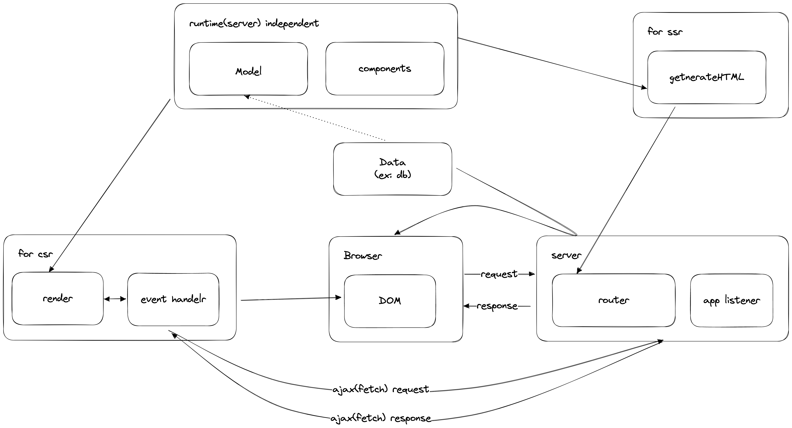

<br>


_5. SSR과 CSR은 같은 페이지에 대해 같은 UI를 그려야 한다._
    
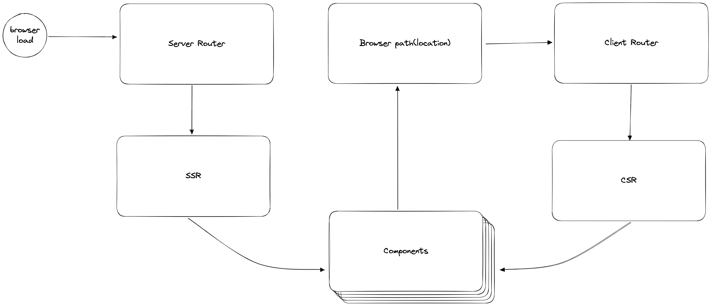

<br>

## 소스코드 확인

- [Github Repository](https://github.com/JunilHwang/simple-ssr/tree/master/v2)
- [Github Codespaces](https://github.dev/JunilHwang/simple-ssr/tree/master/v2)

## Reference

- [[react] 리액트 훅 MVVM #1 - Bsidesoft co.](https://www.bsidesoft.com/8267)
- [MVVM System 만들기](https://junilhwang.github.io/TIL/CodeSpitz/Object-Oriented-Javascript/02-MVVM/)
- [Vanilla Javascript로 웹 컴포넌트 만들기](https://junilhwang.github.io/TIL/Javascript/Design/Vanilla-JS-Component/)
- [Vanilla Javascript로 가상돔(VirtualDOM) 만들기](https://junilhwang.github.io/TIL/Javascript/Design/Vanilla-JS-Virtual-DOM/)
- [Vue SSR 제대로 적용하기 (feat. Vanilla SSR)](https://zuminternet.github.io/vue-ssr/)
