---

title: Vanilla Javascript로 상태관리 시스템 만들기
description: Vanilla Javascript로 Vuex와 Redux 같은 상태관리 시스템을 만드는 방법에 대해 소개합니다.
sidebarDepth: 2
date: 2021-07-26

---

# Vanilla Javascript로 상태관리 시스템 만들기

> 본 포스트는 Vuex나 Redux 같은 상태관리 프레임워크를 직접 만들어보는 내용이다.
그리고 이 포스트를 읽기 전에 [Vanilla Javascript로 웹 컴포넌트 만들기](https://junilhwang.github.io/TIL/Javascript/Design/Vanilla-JS-Component/)를 먼저 정독해야 이해하기가 수월하다.

## 1. 중앙 집중식 상태관리

[이전에 작성했던 포스트](https://junilhwang.github.io/TIL/Javascript/Design/Vanilla-JS-Component/)에도 언급했지만, 현대적인 프론트엔드 개발에서 제일 중요한 것은 바로 `상태관리` 라고 해도 무방하다. Vue나 React 같은 프론트엔드 프레임워크의 주된 목적 중 하나가 **상태를 기반으로 DOM을 렌더링 하는 것**이기 때문이다.

학습을 위해 TodoList를 만드는 수준에서는 사실 상태관리 프레임워크가 필요하진 않다. 다양한 종류의 컴포넌트가 있는 것도 아니고, 컴포넌트의 Depth도 낮기 때문이다.

그런데 엔터프라이즈급 어플리케이션을 만든다고 생각하면 이야기가 달라진다. 상태관리가 복잡해지고 컴포넌트의 Depth가 무척 깊어지기 때문이다.

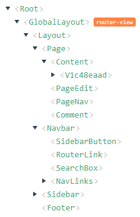

이 때 `중앙 집중식 저장소 역할을 하며 예측 가능한 방식으로 상태를 변경` 할 수 있다면 편하지 않을까? 사실 이에 대한 자료는 이미 시중에 많이 있기 때문에 본 포스트에서는 자세하게 다루진 않겠다.

대신 다음 아티클을 참고하면 될 것이다.

- [Vuex가 무엇인가요?](https://vuex.vuejs.org/kr/)
- [Redux 시작하기](https://ko.redux.js.org/introduction/getting-started/)
- [Vuex 시작하기](https://joshua1988.github.io/web-development/vuejs/vuex-start/)

## 2. Observer Pattern에 대해 이해하기

`중앙 집중식 저장소`를 간단하게 `Store` 라고 표현해보자. `Store`를 구현하기 위해 먼저 `저장소(Store)`와 `컴포넌트(Component)`의 관계를 잘 살펴봐야 한다.

- Store는 여러 개의 컴포넌트에서 사용될 수 있다..
- Store가 변경될 때, Store가 사용되고 있는 Component도 변경되어야 한다.

이를 코드로 표현해보자.

```jsx
// Store를 생성한다.
const store = new Store({
  a: 10,
  b: 20,
});

// 컴포넌트를 생성한다.
const component1 = new Component({ subscribe: [store] });
const component2 = new Component({ subscribe: [store] });

// 컴포넌트가 store를 구독한다.
component1.subscribe(store); // a + b = ${store.state.a + store.state.b}
component2.subscribe(store); // a * b = ${store.state.a * store.state.b}

// store의 state를 변경한다.
store.setState({
  a: 100,
  b: 200,
});

// store가 변경되었음을 알린다.
store.notify();
```

- 처음에 `component1`은 `a + b = 30`을 출력하고, `component2`는  `a * b = 200` 을 출력할 것이다.
- store의 값이 변경된 다음에는 각각 `a + b = 300` `a * b = 20000` 을 출력할 것이다

이러한 형태로 코드를 작성하는 것을 `Observer Pattern` 이라고 한다.

- Observer pattern은 객체의 상태 변화를 관찰하는 관찰자들, 즉 옵저버들의 목록을 객체에 등록하여 `상태 변화가 있을 때마다 메서드 등을 통해 객체가 직접 목록의 각 옵저버에게 통지하도록 하는 디자인 패턴`이다.
- 주로 `분산 이벤트 핸들링 시스템`을 구현하는 데 사용된다.
- `발행/구독 모델`로 알려져 있기도 한다.

대충 어떤 느낌인지만 감이 오는가? ~~이보다 더 자세한 설명이 필요하다면 구글링을 해보자!~~

아마 한 번에 이해하기는 어려울 것이다. 우리는 개발자이므로 조금 더 구체적인 코드를 통해 이해해보자.

### (1) Publish

제일 먼저 `발행기관(Publish)`를 만들어보자.

```jsx
class 발행기관 {
  #state;
  #observers = new Set();

  constructor (state) {
    this.#state = state;
    Object.keys(state).forEach(key => Object.defineProperty(this, key, {
      get: () => this.#state[key]
    }));
  }

  내부에_변화가_생김 (newState) {
    this.#state = { ...this.#state, ...newState };
    this.구독자에게_알림();
  }

  구독자_등록 (subscriber) {
    this.#observers.add(subscriber);
  }

  구독자에게_알림 () {
    this.#observers.forEach(fn => fn());
  }
}
```
- 음.. 어색하지만 일단 최대한의 이해를 돕기 위해 한글로 메소드를 작성했는데, 무척 어색하하다 😅
- 메소드의 내용 그대로 이해하면 될 것이다.
- 위에서 핵심적인 내용은 `내부에 변화가 생길 경우 구독자에게 알리는 것` 이다.
```jsx
내부에_변화가_생김 (newState) {
  this.#state = { ...this.#state, ...newState };
  this.구독자에게_알림();
}
```

### (2) Subscriber

이제 `구독자(Subscriber)`를 만들어보자.

```jsx
class 구독자 {
  #fn;

  constructor (발행기관에_변화가_생길_때_하는_일) {
    this.#fn = 발행기관에_변화가_생길_때_하는_일;
  }

  구독 (publisher) {
    publisher.구독자_등록(this.#fn);
  }
}

```

- 구독자는 `발행기관에서 변화가 생겼을 때 하는 일`을 정의해야 한다.
- 그리고 `발행기관을 구독` 한다.

### (3) 적용하기

이제 작성된 코드를 사용해보자.

```jsx
const 상태 = new 발행기관({
  a: 10,
  b: 20,
});

const 덧셈계산기 = new 구독자(() => console.log(`a + b = ${상태.a + 상태.b}`));
const 곱셈계산기 = new 구독자(() => console.log(`a * b = ${상태.a * 상태.b}`));

덧셈계산기.구독(상태);
곱셈계산기.구독(상태);

상태.구독자에게_알림();
// a + b = 30
// a * b = 200

상태.내부에_변화가_생김({ a: 100, b: 200 });
// a + b = 300
// a * b = 20000
```

이에 대한 결과는 다음과 같다.

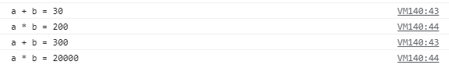

그런데 이 코드의 문제점이 있다.

- 지금 작성한 코드는 쉽게 말해서 `2명의 구독자`가 `1개의 신문사(혹은 잡지)`를 구독하고 있는 상황이다.
- 그런데 만약에 `10명의 구독자`가 `100개의 신문사(혹은 잡지)`를 구독한다고 했을 경우, 구독 관련 코드가 기하급수적으로 늘어날 것이다.

::: tip

- [전체 코드 보기](https://github.com/JunilHwang/simple-store/blob/master/01-pubsub/index.html)
- [결과 확인](https://junilhwang.github.io/simple-store/01-pubsub/)

:::

## 3. 리팩토링

앞서 작성한 코드를 다시 단순하게 `observable`과 `observe`라는 관계로 만들어보자.

- observable은 observe 에서 사용된다.
- observable에 변화가 생기면, observe에 등록된 함수가 실행된다.

```jsx
const 상태 = observable({ a: 10, b: 20 });
observe(() => console.log(`a = ${상태.a}`));
observe(() => console.log(`b = ${상태.b}`));
observe(() => console.log(`a + b = ${상태.a} + ${상태.b}`));
observe(() => console.log(`a * b = ${상태.a} + ${상태.b}`));
observe(() => console.log(`a - b = ${상태.a} + ${상태.b}`));

상태.a = 100;
상태.b = 200;
```

위의 코드는 다음과 같은 결과를 보일 것이다.

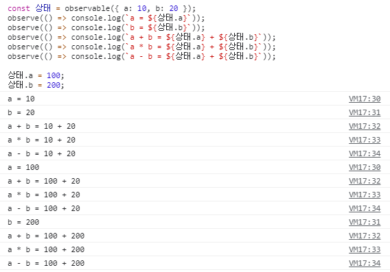

### (1) Object.defineProperty 이해하기

이를 구현하기 위해선 먼저 [Object.defineProperty](https://developer.mozilla.org/ko/docs/Web/JavaScript/Reference/Global_Objects/Object/defineProperty) 라는 API에 대해 알아야 한다.

MDN 문서에 나와있는 설명은 다음과 같다.

> 객체에 직접 새로운 속성을 정의하거나 이미 존재하는 속성을 수정한 후, 그 객체를 반환합니다.

사실 이런 설명을 보면 이해되지 않는 경우가 대부분일 것이다. 그래서 구구절절 늘어놓기 보단, 역시 코드로 이해하는 게 더 빠를 것이다.

```jsx
let a = 10;
const state = {};
Object.defineProperty(state, 'a', {
  get () {
    console.log(`현재 a의 값은 ${a} 입니다.`)
    return a;
  },
  set (value) {
    a = value;
    console.log(`변경된 a의 값은 ${a} 입니다.`)
  }
});

console.log(`state.a = ${state.a}`);
state.a = 100;
```

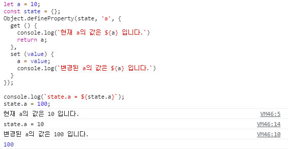

::: tip

- [코드 확인](https://github.com/JunilHwang/simple-store/blob/master/02-object-define-property/01-example.html)
- [결과 확인](https://junilhwang.github.io/simple-store/02-object-define-property/01-example.html)

:::

- `Object.defineProperty(object, prop, descriptor)`
  - `object` 속성을 정의할 객체
  - `prop` 새로 정의하거나 수정하려는 속성의 이름 또는 Symbol
  - `descriptor` 새로 정의하거나 수정하려는 속성을 기술하는 객체

이렇게 `Object.defineProperty(object, prop, descriptor)` 는 객체에 어떤 변화가 생기거나 객체를 참조할 경우 우리가 원하는 행위를 중간에 집어넣을 수도 있다.

### (2) 여러 개의 속성 관리하기

여러 개의 속성이 있을 때는 다음과 같이 표현할 수 있다.

```jsx
const state = {
  a: 10,
  b: 20,
};

const stateKeys = Object.keys(state);

for (const key of stateKeys) {
  let _value = state[key];
  Object.defineProperty(state, key, {
    get () {
      console.log(`현재 state.${key}의 값은 ${_value} 입니다.`);
      return _value;
    },
    set (value) {
      _value = value;
      console.log(`변경된 state.${key}의 값은 ${_value} 입니다.`);
    }
  })
}

console.log(`a + b = ${state.a + state.b}`);

state.a = 100;
state.b = 200;
```

결과는 다음과 같다.

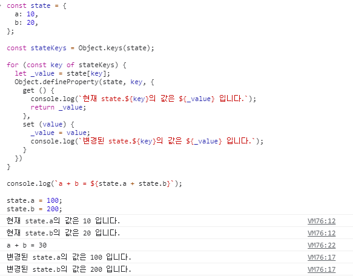


::: tip

- [코드 확인](https://github.com/JunilHwang/simple-store/blob/master/02-object-define-property/02-multiple-key.html)
- [결과 확인](https://junilhwang.github.io/simple-store/02-object-define-property/02-multiple-key.html)

:::

여기서 `console.log` 부분을 `observer` 함수로 바꿔보자.

```jsx
const state = {
  a: 10,
  b: 20,
};

const stateKeys = Object.keys(state);
const observer = () => console.log(`a + b = ${state.a + state.b}`);

for (const key of stateKeys) {
  let _value = state[key];
  Object.defineProperty(state, key, {
    get () {
      return _value;
    },
    set (value) {
      _value = value;
      observer();
    }
  })
}

observer();

state.a = 100;
state.b = 200;
```

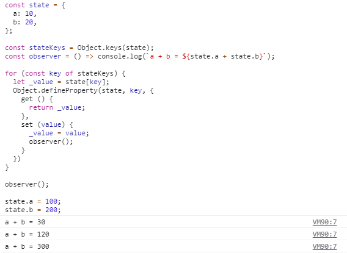


::: tip

- [코드 확인](https://github.com/JunilHwang/simple-store/blob/master/02-object-define-property/03-multiple-key-refactor.html)
- [결과 확인](https://junilhwang.github.io/simple-store/02-object-define-property/03-multiple-key-refactor.html)

:::

### (3) 여러 개의 Observer 관리하기

이제 여러 개의 observer를 만들어서 관리해보자.

```jsx
let currentObserver = null;

const state = {
  a: 10,
  b: 20,
};

const stateKeys = Object.keys(state);

for (const key of stateKeys) {
  let _value = state[key];
  const observers = new Set();
  Object.defineProperty(state, key, {
    get () {
      if (currentObserver) observers.add(currentObserver);
      return _value;
    },
    set (value) {
      _value = value;
      observers.forEach(observer => observer());
    }
  })
}

const 덧셈_계산기 = () => {
  currentObserver = 덧셈_계산기;
  console.log(`a + b = ${state.a + state.b}`);
}

const 뺄셈_계산기 = () => {
  currentObserver = 뺄셈_계산기;
  console.log(`a - b = ${state.a - state.b}`);
}

덧셈_계산기();
state.a = 100;

뺄셈_계산기();
state.b = 200;

state.a = 1;
state.b = 2;
```

이 코드에서 핵심은, 함수가 실행될 때 `currentObsever가 실행중인 함수를 참조하도록 만드는 것` 이다.

- `state`의 `property`가 **사용**될 때(=`get` 메소드가 실행될 때) currentObserver를 observers에 등록한다.
- `state`의 `property`가 **변경**될 때(=`set` 메소드가 실행될 때) observers에 등록된 모든 observer를 실행한다.

결과는 다음과 같다.

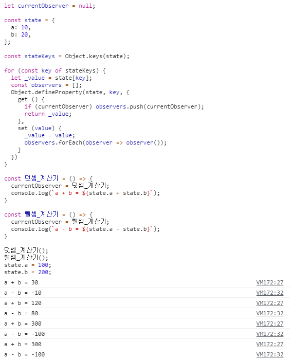

::: tip

- [코드 확인](https://github.com/JunilHwang/simple-store/blob/master/02-object-define-property/04-multiple-observer.html)
- [결과 확인](https://junilhwang.github.io/simple-store/02-object-define-property/04-multiple-observer.html)

:::

### (4) 함수화

앞서 작성한 코드를 재사용하기 위해서 `observe`와 `observable` 함수로 만들어야 한다.

```jsx
let currentObserver = null;

const observe = fn => {
  currentObserver = fn;
  fn();
  currentObserver = null;
}

const observable = obj => {
  Object.keys(obj).forEach(key => {
    let _value = obj[key];
    const observers = new Set();

    Object.defineProperty(obj, key, {
      get () {
        if (currentObserver) observers.add(currentObserver);
        return _value;
      },

      set (value) {
        _value = value;
        observers.forEach(fn => fn());
      }
    })
  })
  return obj;
}
```

다음과 같이 사용할 수 있다.

```jsx
const 상태 = observable({ a: 10, b: 20 });
observe(() => console.log(`a = ${상태.a}`));
observe(() => console.log(`b = ${상태.b}`));
observe(() => console.log(`a + b = ${상태.a} + ${상태.b}`));
observe(() => console.log(`a * b = ${상태.a} + ${상태.b}`));
observe(() => console.log(`a - b = ${상태.a} + ${상태.b}`));

상태.a = 100;
상태.b = 200;
```

결과는 다음과 같다.

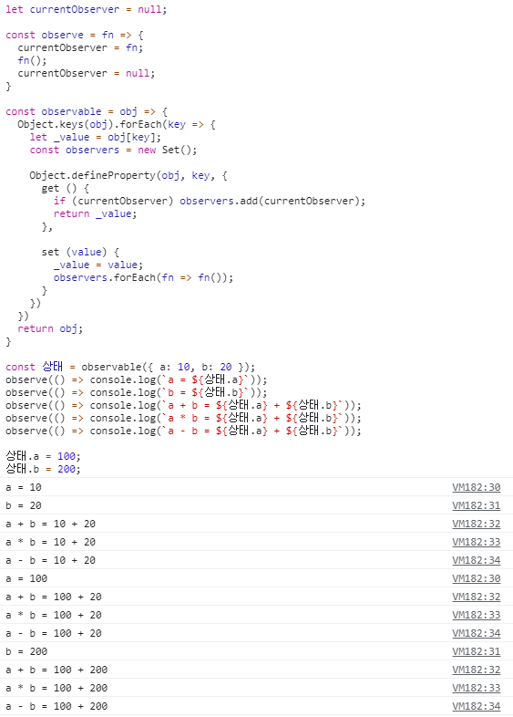


::: tip

- [코드 확인](https://github.com/JunilHwang/simple-store/blob/master/02-object-define-property/05-functionalized.html)
- [결과 확인](https://junilhwang.github.io/simple-store/02-object-define-property/05-functionalized.html)

:::

## 4. DOM에 적용하기

이제 DOM(Component)에 직접 적용해보자.

### (1) 일단 구현해보기

일단 구조적인 부분은 생각하지말고, 기능만 구현해보자.

- `index.html`

    ```html
    <!DOCTYPE html>
    <html lang="en">
    <head>
    	<meta charset="UTF-8">
    	<title>Store를 적용해보자</title>
    </head>
    <body>
    	<div id="app"></div>
      <script type="module" src="./src/main.js"></script>
    </body>
    </html>
    ```

- `src/main.js`

    ```jsx
    import { observable, observe } from "./core/observer.js";

    const state = observable({
      a: 10,
      b: 20,
    });

    const $app = document.querySelector('#app');

    const render = () => {
      $app.innerHTML = `
        <p>a + b = ${state.a + state.b}</p>
        <input id="stateA" value="${state.a}" />
        <input id="stateB" value="${state.b}" />
      `;

      $app.querySelector('#stateA').addEventListener('change', ({ target }) => {
        state.a = Number(target.value);
      })

      $app.querySelector('#stateB').addEventListener('change', ({ target }) => {
        state.b = Number(target.value);
      })
    }

    observe(render);
    ```

- `src/core/observer.js`

    ```jsx
    let currentObserver = null;

    export const observe = fn => {
      currentObserver = fn;
      fn();
      currentObserver = null;
    }

    export const observable = obj => {
      Object.keys(obj).forEach(key => {
        let _value = obj[key];
        const observers = new Set();

        Object.defineProperty(obj, key, {
          get () {
            if (currentObserver) observers.add(currentObserver);
            return _value;
          },

          set (value) {
            _value = value;
            observers.forEach(fn => fn());
          }
        })
      })
      return obj;
    }
    ```

input의 값을 변경할 경우 바로 rendering이 실행될 것이다. 

<iframe class="example-frame" src="https://junilhwang.github.io/simple-store/03-with-component/01-just-implement/" width="100%"></iframe>

::: tip

- [전체코드](https://github.com/JunilHwang/simple-store/tree/master/03-with-component/01-just-implement/)
- [브라우저에서 확인](https://junilhwang.github.io/simple-store/03-with-component/01-just-implement/)

:::

### (2) Component로 추상화하기

- 먼저 [웹 컴포넌트 만들기](https://junilhwang.github.io/TIL/Javascript/Design/Vanilla-JS-Component/#_2-%E1%84%8E%E1%85%AE%E1%84%89%E1%85%A1%E1%86%BC%E1%84%92%E1%85%AA)의 코드를 참고하여 Component 코드를 구성해보자.
- `src/core/Component.js`

    ```jsx{12-19}
    import { observable, observe } from './observer.js';
    
    export class Component {
      state; props; $el;
    
      constructor ($el, props) {
        this.$el = $el;
        this.props = props;
        this.setup();
      }
    
      setup() {
        this.state = observable(this.initState()); // state를 관찰한다.
        observe(() => { // state가 변경될 경우, 함수가 실행된다.
          this.render();
          this.setEvent();
          this.mounted();
        });
      }
    
      initState() { return {} }
      template () { return ''; }
      render () { this.$el.innerHTML = this.template(); }
      setEvent () {}
      mounted () {}
    }
    
    ```

- 그 다음 `src/App.js` 에 `Component`를 적용해보자.

    ```jsx
    import {Component} from "./core/Component.js";
    
    export class App extends Component {
      initState () {
        return {
          a: 10,
          b: 20,
        }
      }
    
      template () {
        const { a, b } = this.state;
        return `
          <input id="stateA" value="${a}" size="5" />
          <input id="stateB" value="${b}" size="5" />
          <p>a + b = ${a + b}</p>
        `;
      }
    
      setEvent () {
        const { $el, state } = this;
    
        $el.querySelector('#stateA').addEventListener('change', ({ target }) => {
          state.a = Number(target.value);
        })
    
        $el.querySelector('#stateB').addEventListener('change', ({ target }) => {
          state.b = Number(target.value);
        })
      }
    }
    ```
  
- 그 다음 `src/main.js` 에서 `App`을 불러와서 실행시켜야한다.
    ```jsx
    import { App } from "./App.js";

    new App(document.querySelector('#app'));
    ```

<iframe class="example-frame" src="https://junilhwang.github.io/simple-store/03-with-component/02-component/" width="100%"></iframe>


::: tip

- [전체코드](https://github.com/JunilHwang/simple-store/tree/master/03-with-component/02-component/)
- [브라우저에서 확인](https://junilhwang.github.io/simple-store/03-with-component/02-component/)

:::

결과물은 똑같다. 다만 구조화를 했을 뿐!

### (3) 고민해보기

사실 이렇게 Component 내부에서 관리되는 State에 observable을 씌워 사용할 경우 만들 경우 `setState`를 사용하는 방식이랑 크게 다르지 않다고 느낄 수 있다.
**setState 또한 state가 변경될 때 마다 render를 실행하는 방식**이기 때문이다.

```jsx{3}
setState(newState) {
  this.state = { ...this.state, ...newState }
  this.render();
}

render () {
  this.innerHTML = this.template();
}
```

`observer`는 이렇게 컴포넌트의 상태에 사용하기 보단 `중앙 집중식 저장소` 를 관리할때 매우 효과적이다.

### (4) 컴포넌트 외부에 상태를 만들어주기

Vuex나 Redux 같은 프레임워크를 사용하기 이전에, 일단 **매우 간단하게 Store를 만들어서 관리**해보자.

- `src/store.js`

```jsx{5-8,13}
import { observable } from './core/observer.js'

export const store = {

  state: observable({
    a: 10,
    b: 20,
  }),

  setState (newState) {
    for (const [key, value] of Object.entries(newState)) {
      if (!this.state[key]) continue;
      this.state[key] = value;
    }
  }
}
```

- `src/App.js`

```jsx{5,9,13,29,33}
import { Component } from "./core/Component.js";
import { store } from './store.js';

const InputA = () => `
  <input id="stateA" value="${store.state.a}" size="5" />
`;

const InputB = () => `
  <input id="stateB" value="${store.state.b}" size="5" />
`

const Calculator = () => `
  <p>a + b = ${store.state.a + store.state.b}</p>
`

export class App extends Component {
  template () {
    return `
      ${InputA()}
      ${InputB()}
      ${Calculator()}
    `;
  }

  setEvent () {
    const { $el} = this;

    $el.querySelector('#stateA').addEventListener('change', ({ target }) => {
      store.setState({ a: Number(target.value) });
    })

    $el.querySelector('#stateB').addEventListener('change', ({ target }) => {
      store.setState({ b: Number(target.value) });
    })
  }
}
```

- 여기서 InputA, InputB, Calculator를 무척 단순하게 구현했는데, 이게 전부 복잡한 컴포넌트라고 생각해보자.
  **세 개의 컴포넌트가 store를 참조**하고 있고, **store가 변경되었을 때 컴포넌트가 자동으로 렌더링** 되는 형태로 만든 것이다.
- 여기에 **Flux 패턴**을 붙이면 **Redux**나 **Vuex**가 되는 것이다.

<iframe class="example-frame" src="https://junilhwang.github.io/simple-store/03-with-component/03-store/" width="100%"></iframe>

::: tip

- [전체코드](https://github.com/JunilHwang/simple-store/tree/master/03-with-component/03-store/)
- [브라우저에서 확인](https://junilhwang.github.io/simple-store/03-with-component/03-store/)

:::

## 5. Flux Pattern

앞서 Observer Pattern에 대해 알아본 것 처럼, Vuex나 Redux에서 사용되는 Flux Pattern에 대해서 알아보자.

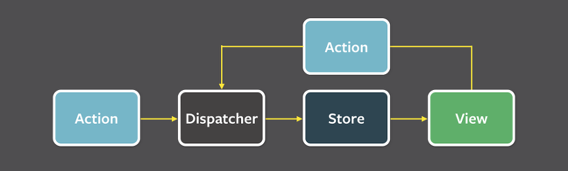

- Flux의 가장 큰 특징은 **단방향 데이터 흐름**이다.
- 데이터 흐름은 다음과 같다
  - Dispatcher → Store
  - Store → View
  - View → Action
  - Action → Dispatcher
- 이런 단방향 데이터 흐름은 데이터 변화를 휠씬 예측하기 쉽게 만든다.

Vue는 이를 조금 변형하여 다음과 같은 형태로 사용한다.

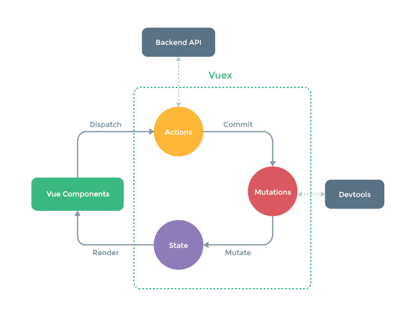

- actions, mutations, state를 묶어서 store라고 보면 된다.
- state를 변화시킬 수 있는 것은 오직 mutations다.
- actions는 backend api를 가쳐온 다음에 mutations를 이용하여 데이터를 변경한다.
- state가 변경 되면, state를 사용 중인 컴포넌트를 업데이트한다.

## 6. Vuex 같은 Store 만들기

일단 vuex를 만들기 이전에, vuex가 어떤 interface를 가지고 있는지 살펴보자.
[공식문서](https://vuex.vuejs.org/kr/guide/)에서 보여주고 있는 코드는 다음과 같다.

```js
const store = new Vuex.Store({
  state: {
    count: 0
  },
  mutations: {
    increment (state) {
      state.count++
    }
  }
});
```

`state`가 있고, state를 변경시킬 수 있는 `mutations`가 존재하는 것을 확인할 수 있다.

그리고 이렇게 선언된 store는 다음과 같이 사용된다.
```js
store.commit('increment')

console.log(store.state.count) // -> 1
```

`commit`으로 `mutations`에 선언된 메소드를 실행하는 구조이다.

이러한 형태로 사용할 수 있도록 한 번 `Store` 클래스를 구성해보자.

- `src/core/Store.js`

    ```jsx{9,13-20,24-25}
    import { observable } from './observer.js';

    export class Store {

      #state; #mutations; #actions; // private으로 지정하여 외부에서는 접근이 안 되도록 한다.
      state = {};

      constructor ({ state, mutations, actions }) {
        this.#state = observable(state);
        this.#mutations = mutations;
        this.#actions = actions;
        
        // state를 직접적으로 수정하지 못하도록 다음과 같이 정의한다.
        Object.keys(state).forEach(key => {
          Object.defineProperty(
            this.state,
            key,
            { get: () => this.#state[key] },
          )
        })
      }

      commit (action, payload) {
        // state는 오직 commit을 통해서 수정 할 수 있다.
        this.#mutations[action](this.#state, payload);
      }

      dispatch (action, payload) {
        /**
         * 예제에서 dispatch는 사용되고 있진 않진 않지만 아마 vuex를 써본 사람이라면 익숙할 것이다.
         * @see {https://vuex.vuejs.org/kr/api/#actions}
         */
        return this.#actions[action]({
          state: this.#state,
          commit: this.commit.bind(this),
          dispatch: this.dispatch.bind(this),
        }, payload);
      }

    }
    ```
  - `dispatch`에서 실행해주는 `action`의 첫 번째 인자인 `context` 의 요소는 [이 문서](https://vuex.vuejs.org/kr/api/#actions)에서 확인할 수 있다.
  - `store.state`는 Object.defineProperty로 get만 사용할 수 있도록 선언했다. 즉, 직접적으로 할당할 수 없는 형태이다.
  - `store.state`의 값을 변경하고 싶다면 무조건 `commit` method를 사용해야 한다.
  
- `src/store.js`

    ```jsx{12,16}
    import { Store } from './core/Store.js';

    export const store = new Store({
      state: {
        a: 10,
        b: 20,
      },

      // state의 값은 오직 mutations를 통해서 변경할 수 있다.
      mutations: {
        SET_A (state, payload) {
          state.a = payload;
        },

        SET_B (state, payload) {
          state.b = payload;
        }
      },

      // actions도 있으면 좋겠지만.. 딱히 지금 쓸만한 API가 없다.
    });
    ```

- `src/App.js`

    ```jsx{4-6,22,27}
    import { Component } from "./core/Component.js";
    import { store } from './store.js';
    
    const InputA = () => `<input id="stateA" value="${store.state.a}" size="5" />`;
    const InputB = () => `<input id="stateB" value="${store.state.b}" size="5" />`;
    const Calculator = () => `<p>a + b = ${store.state.a + store.state.b}</p>`;
    
    export class App extends Component {
      template () {
        return `
          ${InputA()}
          ${InputB()}
          ${Calculator()}
        `;
      }
    
      setEvent () {
        const { $el} = this;
    
        $el.querySelector('#stateA').addEventListener('change', ({ target }) => {
          // commit을 통해서 값을 변경시킨다.
          store.commit('SET_A', Number(target.value));
        })
    
        $el.querySelector('#stateB').addEventListener('change', ({ target }) => {
          // commit을 통해서 값을 변경시킨다.
          store.commit('SET_B', Number(target.value));
        })
      }
    }
    ```

이렇게 vuex를 정의해 사용할 수 있다. 원리만 알고 있다면 크게 어렵지 않을 것이다.

<iframe class="example-frame" src="https://junilhwang.github.io/simple-store/04-simple-vuex/" width="100%"></iframe>

::: tip

- [전체코드](https://github.com/JunilHwang/simple-store/tree/master/04-simple-vuex)
- [브라우저에서 확인](https://junilhwang.github.io/simple-store/04-simple-vuex/)

:::


## 7. Redux 만들기

앞선 과정 처럼 Redux를 만들기 전에, Redux가 사용되는 형태를 일단 살펴보자.
[공식 문서](https://ko.redux.js.org/introduction/getting-started/)에 나와있는 코드이다.

```js
import { createStore } from 'redux'

/**
 * 이것이 (state, action) => state 형태의 순수 함수인 리듀서입니다.
 * 리듀서는 액션이 어떻게 상태를 다음 상태로 변경하는지 서술합니다.
 *
 * 상태의 모양은 당신 마음대로입니다: 기본형(primitive)일수도, 배열일수도, 객체일수도,
 * 심지어 Immutable.js 자료구조일수도 있습니다.  오직 중요한 점은 상태 객체를 변경해서는 안되며,
 * 상태가 바뀐다면 새로운 객체를 반환해야 한다는 것입니다.
 *
 * 이 예제에서 우리는 `switch` 구문과 문자열을 썼지만,
 * 여러분의 프로젝트에 맞게
 * (함수 맵 같은) 다른 컨벤션을 따르셔도 좋습니다.
 */
function counter(state = 0, action) {
  switch (action.type) {
    case 'INCREMENT':
      return state + 1
    case 'DECREMENT':
      return state - 1
    default:
      return state
  }
}

// 앱의 상태를 보관하는 Redux 저장소를 만듭니다.
// API로는 { subscribe, dispatch, getState }가 있습니다.
let store = createStore(counter)

// subscribe()를 이용해 상태 변화에 따라 UI가 변경되게 할 수 있습니다.
// 보통은 subscribe()를 직접 사용하기보다는 뷰 바인딩 라이브러리(예를 들어 React Redux)를 사용합니다.
// 하지만 현재 상태를 localStorage에 영속적으로 저장할 때도 편리합니다.

store.subscribe(() => console.log(store.getState()))

// 내부 상태를 변경하는 유일한 방법은 액션을 보내는 것뿐입니다.
// 액션은 직렬화할수도, 로깅할수도, 저장할수도 있으며 나중에 재실행할수도 있습니다.
store.dispatch({ type: 'INCREMENT' })
// 1
store.dispatch({ type: 'INCREMENT' })
// 2
store.dispatch({ type: 'DECREMENT' })
// 1
```

::: tip

사실 redux는 `불변성` 이라는 개념을 사용하고 있기 때문에 `observable`과 `observe`를 이용하는 것이 부자연스러울 수 있다.

:::

코드를 살펴보니 `createStore`가 `subscribe, dispatch, getState` 등의 메소드를 가진 객체를 반환하는 것을 알 수 있다.
```js
const createStore = (reducer) => {
  /* 내부 구현 */
  return { subscribe, dispatch, getState };
}
```

이렇게 interface만 알고 있어도 구현은 어렵지 않다. 한 번 구현해보자.

- `src/core/Store.js`
```js{6,23,27}
import { observable } from './observer.js';

export const createStore = (reducer) => {
  
  // reducer가 실행될 때 반환하는 객체(state)를 observable로 만들어야 한다.
  const state = observable(reducer());
  
  // getState가 실제 state를 반환하는 것이 아니라 frozenState를 반환하도록 만들어야 한다.
  const frozenState = {};
  Object.keys(state).forEach(key => {
    Object.defineProperty(frozenState, key, {
      get: () => state[key], // get만 정의하여 set을 하지 못하도록 만드는 것이다.
    })
  });
  
  // dispatch로만 state의 값을 변경할 수 있다.
  const dispatch = (action) => {
    const newState = reducer(state, action);

    for (const [key, value] of Object.entries(newState)) {
      // state의 key가 아닐 경우 변경을 생략한다.
      if (!state[key]) continue;
      state[key] = value;
    }
  }

  const getState = () => frozenState;
  
  // subscribe는 observe로 대체한다.
  return { getState, dispatch };

}
```

이제 createStore를 이용하여 store를 만들어보자.

- `src/store.js`
```js
import {createStore} from './core/Store.js';

// 초기 state의 값을 정의해준다.
const initState = {
  a: 10,
  b: 20,
};

// dispatch에서 사용될 type들을 정의해준다.
export const SET_A = 'SET_A';
export const SET_B = 'SET_B';

// reducer를 정의하여 store에 넘겨준다.
export const store = createStore((state = initState, action = {}) => {
  switch (action.type) {
    case 'SET_A' :
      return { ...state, a: action.payload }
    case 'SET_B' :
      return { ...state, b: action.payload }
    default:
      return state;
  }
});

// reducer에서 사용될 action을 정의해준다.
export const setA = (payload) => ({ type: SET_A, payload });
export const setB = (payload) => ({ type: SET_B, payload });

```

이제 App에서 Store를 사용하도록 작업해줘야 한다.

- `src/App.js`
```js{4-6,21-22,26-27}
import { Component } from "./core/Component.js";
import {setA, setB, store} from './store.js';

const InputA = () => `<input id="stateA" value="${store.getState().a}" size="5" />`;
const InputB = () => `<input id="stateB" value="${store.getState().b}" size="5" />`;
const Calculator = () => `<p>a + b = ${store.getState().a + store.getState().b}</p>`;

export class App extends Component {
  template () {
    return `
      ${InputA()}
      ${InputB()}
      ${Calculator()}
    `;
  }

  setEvent () {
    const { $el} = this;

    $el.querySelector('#stateA').addEventListener('change', ({ target }) => {
      // commit을 통해서 값을 변경시킨다.
      store.dispatch(setA(Number(target.value)));
    })

    $el.querySelector('#stateB').addEventListener('change', ({ target }) => {
      // commit을 통해서 값을 변경시킨다.
      store.dispatch(setB(Number(target.value)));
    })
  }
}
```


<iframe class="example-frame" src="https://junilhwang.github.io/simple-store/05-simple-redux/" width="100%"></iframe>

::: tip

- [전체코드](https://github.com/JunilHwang/simple-store/tree/master/05-simple-redux)
- [브라우저에서 확인](https://junilhwang.github.io/simple-store/05-simple-redux/)

:::

이렇게 간단한 `redux`를 만들 수 있다.

## 8. 심화학습

`observable`과 `observer`를 사용할 때 고려해야 할 것들이 몇 가지 더 있다.

### (1) 최적화

상태가 변경되어 render를 해야하는데, 만약에 변경된 상태가 이전 상태와 값이 똑같을 경우에는 어떻게 해야할까?

```js
state.a = 1;
state.a = 1;
state.a = 1;
state.a = 1;
```

이럴 때는 다시 렌더링 되지 않도록 방어로직을 작성하면 된다.

```js{13-14}
export const observable = obj => {
  Object.keys(obj).forEach(key => {
    let _value = obj[key];
    const observers = new Set();

    Object.defineProperty(obj, key, {
      get () {
        if (currentObserver) observers.add(currentObserver);
        return _value;
      },

      set (value) {
        if (_value === value) return;
        if (JSON.stringify(_value) === JSON.stringify(value)) return;
        _value = value;
        observers.forEach(fn => fn());
      }
    })
  })
  return obj;
}
```

- 숫자, 문자열, null, undefined 등의 원시타입은 `_value === value` 처럼 검사하면 된다.
- 배열이나 객체의 경우 `JSON.stringify(_value) === JSON.stringify(value)`를 사용하면 된다.
- Set, Map, WeekSet, WeekMap 같은 것들은 `JSON.stringify`로 변환되지 않는다. 이런 경우에는 추가적인 검사 로직이 필요하다.
  - 시간이 된다면 직접 구현해보길!
  - 내용이 너무 길어지고 있어서 다시 구현하기는 귀찮다..

그리고 상태가 연속으로 변경되는 경우에는 어떻게 해야 좋을까?

```js
state.a = 1;
state.b = 2;
```

단순하게 console.log를 찍는 경우라면 상관없지만, 브라우저에 DOM으로 렌더링 되는 경우라면 이야기가 다르다.
이럴 때는 `requestAnimationFrame`과 `debounce`를 이용하여 한 프레임에 한 번만 렌더링 되도록 만들어줘야한다.

::: tip requestAnimationFrame
[MDN 문서](https://developer.mozilla.org/ko/docs/Web/API/Window/requestAnimationFrame)에 나와있는 내용은 다음과 같다.
- 브라우저에게 수행하기를 원하는 애니메이션을 알리고 다음 리페인트가 진행되기 전에 해당 애니메이션을 업데이트하는 함수를 호출하게 합니다.
   이 메소드는 **리페인트 이전에 실행할 콜백**을 인자로 받습니다.
- 화면에 새로운 애니메이션을 업데이트할 준비가 될때마다 이 메소드를 호출하는것이 좋습니다.
  **콜백의 수는 보통 1초에 60회**지만,
  일반적으로 대부분의 브라우저에서는 W3C 권장사항에 따라 그 수가 **디스플레이 주사율과 일치**하게됩니다.

쉽게 말해서 requestAnimationFrame은 1프레임에 1회 호출된다. 보통 `1초에 60프레임`이고, 1프레임은 약 `16ms` 정도 된다.
:::


```js
const debounceFrame = (callback) => {
  let currentCallback = -1;
  return () => {
    cancelAnimationFrame(currentCallback); // 현재 등록된 callback이 있을 경우 취소한다.
    currentCallback = requestAnimationFrame(callback); // 1프레임 뒤에 실행되도록 한다.
  }
};

debounceFrame(() => console.log(1));
debounceFrame(() => console.log(2));
debounceFrame(() => console.log(3));
debounceFrame(() => console.log(4));
debounceFrame(() => console.log(5)); // 이것만 실행된다.
```

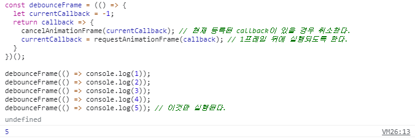

이렇게 구성한 debounceFrame을 `observe`에 씌워주면 된다. 그런데 debounce된 함수를 넘겨야해서, 즉시실행 부분은 제거해야줘야 한다.

```js
const debounceFrame = (callback) => {
  let currentCallback = -1;
  return () => {
    cancelAnimationFrame(currentCallback);
    currentCallback = requestAnimationFrame(callback);
  }
};

export const observe = fn => {
  currentObserver = debounceFrame(fn);
  fn();
  currentObserver = null;
}

```

::: tip

- [전체코드](https://github.com/JunilHwang/simple-store/tree/master/06-optimization/src/core/observer.js)
- [브라우저에서 확인](https://junilhwang.github.io/simple-store/06-optimization/)

:::

### (2) Proxy

사실 `Object.defineProperty`는 `IE`를 지원하기 위해 사용하는 `API`이다.
최신 브라우저에서는 [Proxy](https://developer.mozilla.org/ko/docs/Web/JavaScript/Reference/Global_Objects/Proxy)를 이용한다면 더 쉽게 `Observable`을 만들 수 있다.

```js
export const observable = obj => {
  
  const observerMap = {};

  return new Proxy(obj, {
    get (target, name) {
      observerMap[name] = observerMap[name] || new Set();
      if (currentObserver) observerMap[name].add(currentObserver)
      return target[name];
    },
    set (target, name, value) {
      if (target[name] === value) return true;
      if (JSON.stringify(target[name]) === JSON.stringify(value)) return true;
      target[name] = value;
      observerMap[name].forEach(fn => fn());
      return true;
    },
  });

}
```

맥락은 크게 다르지 않지만, Proxy를 사용하는 코드가 더 짧은 것을 알 수 있다.

::: tip

- [전체코드](https://github.com/JunilHwang/simple-store/tree/master/07-proxy/src/core/observer.js)
- [브라우저에서 확인](https://junilhwang.github.io/simple-store/07-proxy/)

:::

## 저장소
- 이 아티클에 사용된 모든 코드는 [여기](https://github.com/JunilHwang/simple-store)에서 확인할 수 있습니다.

## Summary

- 컴포넌트가 많아질수록 상태를 관리하기가 힘들어진다.
- 이 때 컴포넌트에 종속적이지 않은 중앙집중형저장소(Store)를 만들어서 사용하면 편리하다.
- 상태관리 시스템을 이해하기 위해선 `Observer Pattern`과 `Flux Pattern` 을 먼저 이해해야 한다.
- `Observer Pattern`을 그대로 사용할 경우 매우 번거롭다. 이 때 `Object.defineProperty` 를 이용하여 자동화할 수 있다.
  - 포스트에서는 다루지 않았지만 최신 브라우저에서는 Proxy를 이용해도 무방하다.

## Reference

- [[디자인패턴] Flux, MVC 비교](https://beomy.tistory.com/44)
- [0.7KB로 Vue와 같은 반응형 시스템 만들기](https://meetup.toast.com/posts/188)
- [Vuex 공식문서](https://vuex.vuejs.org/kr/)
