---

title: Vanilla Javascript로 가상돔 구현하기
description: React와 Vue에서 사용되고 있는 가상돔을 Vanilla JS로 직접 만드는 과정에 대해 소개합니다.
sidebarDepth: 2
date: 2021-08-18

---

# Vanilla Javascript로 가상돔 구현하기

> 본 포스트는 React와 Vue에서 사용되고 있는 가상돔 직접 만들어보는 내용이다. 그리고 이 포스트를 읽기 전에 [Vanilla Javascript로 웹 컴포넌트 만들기](https://junilhwang.github.io/TIL/Javascript/Design/Vanilla-JS-Component/)와 [Vanilla Javascript로 상태관리 시스템 만들기](https://junilhwang.github.io/TIL/Javascript/Design/Vanilla-JS-Store/)를 먼저 정독해야 이해하기가 수월하다.

아마 이 글을 읽는 사람들 대부분은 가상돔의 개념에 대해 이해하고 있으리라 생각한다. 그러니까 어떻게 구현하는지 궁금해서 찾아온게 아닐까?

그래도 ~~너무 귀찮지만~~ 개념을 한 번 짚고 넘어가야 한다.

## 1. 브라우저 로딩 과정

Virtual DOM을 이해하기 위해 브라우저의 로딩 과정에 대해 ~~간략하게~~ 알아보자.


브라우저는 `파싱` → `스타일` → `레이아웃` → `페인트` → `합성` → `렌더` 등의 과정을 거친다. 그 후에 JS나 CSS를 통해 DOM이나 CSS에 변화가 생길 경우 reflow 혹은 repaint 등의 과정을 수행한다.

한 번 차례대로 알아보자.

### (1) 파싱

브라우저가 HTML을 파싱하고 읽어들이는 과정이다.

- DOM Tree

    ```html
    <!DOCTYPE html>
    <html>
      <head>
        <meta name="viewport" content="width=device-width,initial-scale=1">
        <link href="style.css" rel="stylesheet">
        <title>Critical Path</title>
      </head>
      <body>
        <p>Hello <span>web performance</span> students!</p>
        <div></div>
      </body>
    </html>
    ```

  - HTML을 통해 DOM 객체 트리를 구성한다.
  - 위의 코드는 다음과 같이 해석된다.

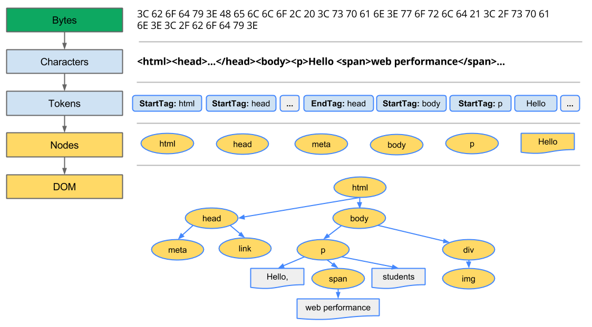

  - 나중에 시간이 되면 HTML을 직접 파싱하는 작업을 해보길 권유한다.
    - ~~무척 재밌다~~
    - ~~HTML을 파싱하여 직접 DOM Tree를 구성하는 작업까지 해보면 더 재밌다.~~
- CSSOM Tree

    ```css
    body { font-size: 16px }
    p { font-weight: bold }
    span { color: red }
    p span { display: none }
    img { float: right }
    ```

  - 외부/내부의 스타일시트의 CSS를 해석해 CSSOM 트리를 구성한다.

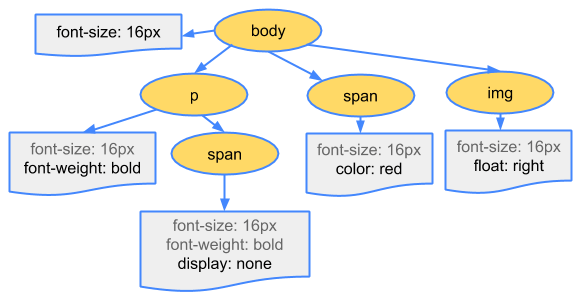

  - body, p, span 등 선택자가 노드로 생성되고 각 노드는 스타일을 참조한다.

### (2) 스타일

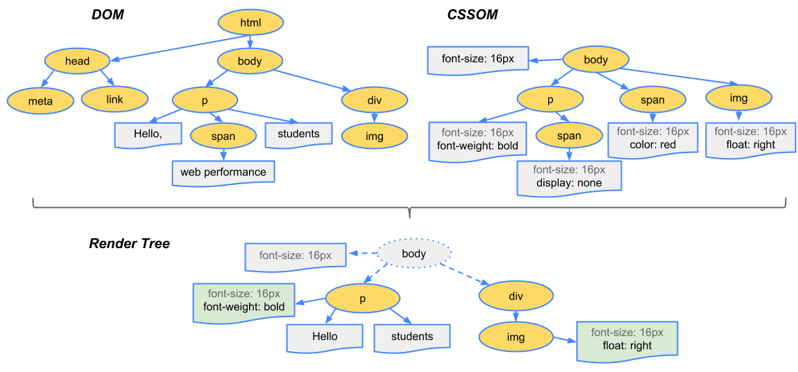

- DOM Tree, CSSOM Tree가 생선되면 스타일을 매칭시켜주는 과정을 거쳐 렌더 트리를 구성한다.
- 렌더링 트리에는 **페이지를 렌더링하는 데 필요한 노드만 포함**된다.
- 참고
  - `visibility: hidden`
    - 요소를 보이지 않게 만든다.
    - 여전히 레이아웃에서 공간을 차지
  - `display: none`
    - 요소가 보이지 않음
    - 레이아웃에 포함되지도 않음
    - 렌더링 트리에서 요소를 완전히 제거

### (3) 레이아웃

- 기기의 뷰포트 내에서 노드의 정확한 위치와 크기를 계산하는 과정

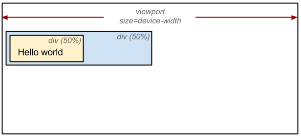

- 경우에 따라 `리플로우`라고도 함
- 레이아웃 단계에서는 노드의 정확한 위치와 크기를 계산한다.
- `%`로 지정된 값은, 픽셀 단위로 측정 및 계산된다.

### (4) 페인트

- 렌더링 트리의 각 노드를 화면의 실제 픽셀로 변환하는 마지막 단계

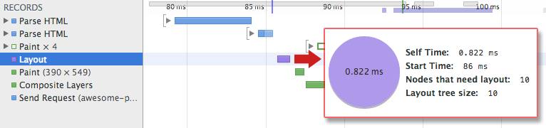

- 레이아웃이 완료될 때 브라우저가 'Paint Setup' 및 'Paint' 이벤트를 발생
- 렌더링 트리를 화면의 픽셀로 변환
- `래스터화`라고도 한다.
- **위치와 관계없는** CSS 속성(`background-color`, `opacity`, `tranform`, `box-shadow` 등)을 적용한다.
- 픽셀로 변환된 결과는 **포토샵의 레이어처럼 생성**되어 개별 레이어로 관리된다.

### (5) 합성(Compositing)

- 화면에 표시하기 위해 페이지에서 페인트된 부분을 합치는 과정
- 쉽게 이야기 하자면, `tranform` `opacity` `will-change` 등을 사용했을 때 합성 과정을 거친다.

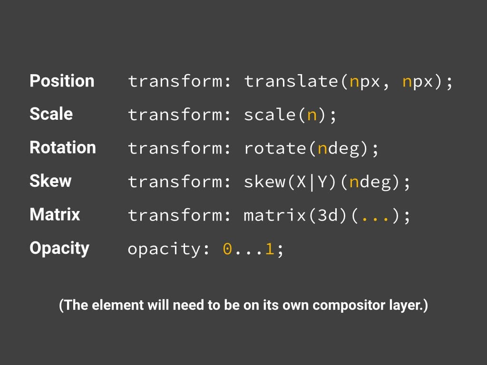

- 지금 당장 깊게 이해할 필요는 없다.

## 2. Reflow, Repaint

- 앞서 소개한 `스타일 → 레이아웃 → 페인트 → 합성`을 **렌더링**이라고 한다.
- 이 렌더링 과정은 **상황에 따라 반복하여 발생**할 수 있다.
- Reflow(=Layout)는 다음과 같은 경우에 발생한다.
  - DOM의 추가/삭제
  - CSS 속성 변경을 통해 기하학적(높이/넓이/위치 등)인 변화
  - ex) margin, padding, width, height, ...
- Repaint(=Pain)는 다음과 같은 경우에 발생한다.
  - CSS 속성 변경이 기하학적 변화가 발생하지 않았을 경우
  - ex) color, background, transform, box-shadow, ...

## 3. 브라우저에서 제일 성능을 많이 잡아먹는 것

- 브라우저는 `렌더링 과정`에서 성능을 제일 많이 잡아먹는다.
- 특히 `Reflow`가 순간적으로 많이 발생할 경우 치명적이다.

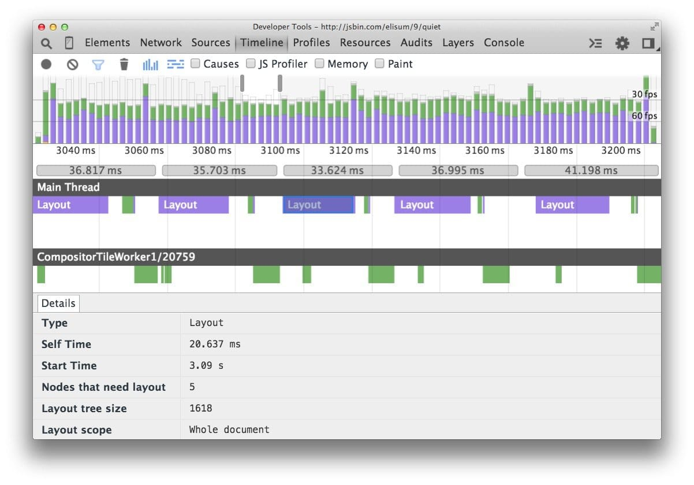

## 4. 가상돔

이전에 다뤘던 포스트들은 State와 Component에 대해 소개했다. 이러한 개념이 등장한 이유는 DOM의 조작에 대한 복잡도가 날이 갈수록 증가하고 있기 때문이다. 복잡도가 증가한다는 것은 DOM의 변화가 기하급수적으로 많이 발생한다는 것이다. 그리고 우리는 앞선 내용을 통해서 `DOM`에 변경이 있을 경우 **렌더트리를 재생성**하고(그러면 모든 요소들의 스타일이 다시 계산됩니다) **레이아웃**을 만들고 **페인팅을 하는 과정**이 다시 **반복**되는 것을 알 수 있었다. 즉, 브라우저가 많이 연산을 해야한단 소리고, 전체적인 프로세스를 비효율적으로 만든다는 것이다.

**그래서 등장한 개념이 가상돔(Virtual DOM)**이다. 뷰(HTML)에 변화가 있을 때, 가상의 DOM 에 먼저 적용하고, 마지막에 Virtual DOM의 내용을 Real DOM에 적용한다. 이를 통해 브라우저 내에서 발생하는 연산의 양(정확히는 렌더링 과정)을 줄이면서 성능이 개선되는 것 이다.

더 쉽게 말하자면 변화를 모아서 한 번에 처리하는 **일종의 Batch 작업**이다.

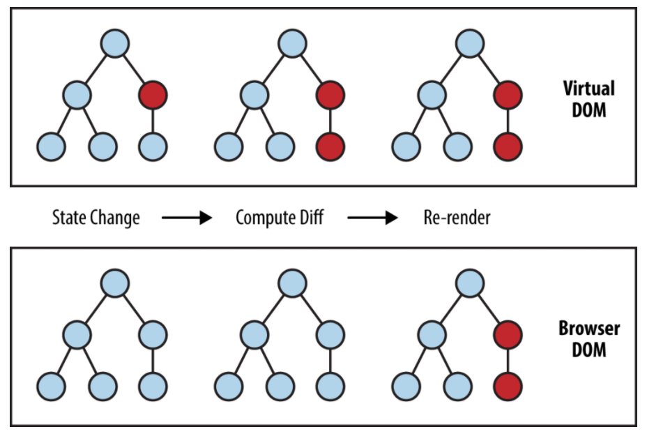

그리고 가상돔을 사용할 경우, Real DOM이 아니기 때문에, 즉, 추상화 되었기 때문에 `브라우저의 종속적이지 않다`는 점도 매력적이다. 그래서 `React Native` 처럼 React를 이용하여 네이티브 앱을 만들 수 있는 프레임워크도 만들어졌으며 테스트하기도 용이하다.

가상돔의 개념에 대해 알아봤으니, 이제 가상돔을 어떻게 사용할 수 있는지 살펴보자.

- 먼저 `Real DOM`이 다음과 같이 구성되어 있다고 하자.

```html
<div id="app">
  <ul>
    <li>
      <input type="checkbox" class="toggle" />
      todo list item 1
      <button class="remove">삭제</button>
    </li>
    <li class="completed">
      <input type="checkbox" class="toggle" checked />
      todo list item 2
      <button class="remove">삭제</button>
    </li>
  </ul>
  <form>
    <input type="text" />
    <button type="submit">추가</button>
  </form>
</div>
```

- 이에 대한 `Virtual DOM`은 다음과 같이 구성되어 있을 것이다

```jsx
function virtualDom(type, props, ...children) {
  return { type, props, children }
}

virtualDom('div', { id: 'app' },
  virtualDom('ul', null,
    virtualDom('li', null,
      virtualDom('input', { type: 'checkbox', className: 'toggle' }),
      'todo list item 1',
      virtualDom('button', { className: 'remove' }, '삭제')
    ),
    virtualDom('li', { className: 'completed' },
      virtualDom('input', { type: 'checkbox', className: 'toggle', checked: true }),
      'todo list item 2',
      virtualDom('button', { className: 'remove' }, '삭제')
    ),
  ),
  virtualDom('form',
    virtualDom('input', { type: 'text' }),
    virtualDom('button', { type: 'submit' }, '추가'),
  )
);
```

- 보통 `virtualDom` 대신 `h` 로 표현한다.

```jsx
function h(type, props, ...children) {
  return { type, props, children }
}

h('div', { id: 'app' },
  h('ul', null,
    h('li', null,
      h('input', { type: 'checkbox', className: 'toggle' }),
      'todo list item 1',
      h('button', { className: 'remove' }, '삭제')
    ),
    h('li', { className: 'completed' },
      h('input', { type: 'checkbox', className: 'toggle', checked: true }),
      'todo list item 2',
      h('button', { className: 'remove' }, '삭제')
    ),
  ),
  h('form',
    h('input', { type: 'text' }),
    h('button', { type: 'submit' }, '추가'),
  )
);
```

코드를 보면 알겠지만, 가상돔은 거창한게 아니라 DOM의 형태를 본따 만든 **객체 덩어리**다.

사실 가상돔만 쓴다고해서 드라마틱한 변화가 생기는 것은 아니다. 딱 하나 좋은 점은 Real DOM을 사용하지 않기 때문에 테스트 하기가 용이하다는 점 정도이다. 가령, DOM API는 브라우저에만 존재하는데, Virtual DOM의 경우 굳이 브라우저 환경이 아니더라도 사용할 수 있는 것이다.

## 5. JSX

앞서 다룬 가상돔의 문제는 바로 `가독성`이다. 이를 해결하기 위해 `jsx`라는 것이 등장했다.

먼저 다음과 같은 가상돔을 돔으로 변환하는 `createElement` 라는 함수가 있다고 가정해보자. 이를 표현해보면 다음과 같다.

```jsx
function createElement(node) { /* 중간 생략 */ }

createElement(
  h('div', { id: 'app' },
    h('ul', null,
      h('li', null,
        h('input', { type: 'checkbox', class: 'toggle' }),
        'todo list item 1',
        h('button', { class: 'remove' }, '삭제')
      ),
      h('li', { class: 'completed' },
        h('input', { type: 'checkbox', class: 'toggle', checked: true }),
        'todo list item 2',
        h('button', { class: 'remove' }, '삭제')
      ),
    ),
    h('form',
      h('input', { type: 'text' }),
      h('button', { type: 'submit' }, '추가'),
    )
  )
);
```

babel의 [jsx](https://babeljs.io/docs/en/babel-plugin-transform-react-jsx)를 이용하면 다음과 같은 문법으로 표현할 수 있다.

> jsx를 적용하기 위해선 babel 관련 패키지를 설치해야하며, 실제 프로덕션 코드로 사용하기 위해서는 다시 es5 코드로 변환하는 `트랜스파일링(transfilling)` 과정이 필요합니다.

```jsx
/** @jsx h */

function createElement(node) { /* 중간 생략 */ }

createElement(
  <div id="app">
    <ul>
      <li>
        <input type="checkbox" class="toggle" />
        todo list item 1
        <button class="remove">삭제</button>
      </li>
      <li class="completed">
        <input type="checkbox" class="toggle" checked />
        todo list item 2
        <button class="remove">삭제</button>
      </li>
    </ul>
    <form>
      <input type="text" />
      <button type="submit">추가</button>
    </form>
  </div>
);
```

여기에 `state` 까지 적용해보자.

```jsx
const state = [
  { id: 1, completed: false, content: 'todo list item 1' },
  { id: 2, completed: true, content: 'todo list item 2' },
];

function createElement(node) { /* 중간 생략 */ }

createElement(
  h('div', { id: 'app' },
    h('ul', null,
      ...state.map(({ completed, content }) => 
        h('li', completed ? { completed: true } : null,
          h('input', { type: 'checkbox', class: 'toggle', checked: completed }),
          content,
          h('button', { class: 'remove' }, '삭제')
        )
      )
    ),
    h('form',
      h('input', { type: 'text' }),
      h('button', { type: 'submit' }, '추가'),
    )
  );
);
```

딱 봐도 가독성이 무척 좋지 않다. 그런데 jsx를 적용하면 다음과 같이 표현할 수 있다.

```jsx
/** @jsx h */

const state = [
  { id: 1, completed: false, content: 'todo list item 1' },
  { id: 2, completed: true, content: 'todo list item 2' },
];

function createElement(node) { /* 중간 생략 */ }

createElement(
  <div id="app">
    <ul>
      { state.map(({ completed, content }) => (
        <li class={completed ? 'completed' : null}>
          <input type="checkbox" class="toggle" checked={completed} />
          { content }
          <button class="remove">삭제</button>
        </li>
      )) }
    </ul>
    <form>
      <input type="text" />
      <button type="submit">추가</button>
    </form>
  </div>
);
```

`jsx`로 표현하니까 훨씬 보기 좋아졌다.

## 6. Virtual DOM → DOM

이제 가상돔(Virtual DOM)을 돔(DOM)으로 변환하는 과정이 필요하다. 즉, `createElement`의 내용을 채워야한다.

```jsx
function createElement(node) {}
```

먼저 `node`는 `tag`일 수도 있고, `text`일 수도 있다.

```jsx
function createElement(node) {
  if (typeof node === 'string') {
    /* text일 때 */
  }
  /* tag일 때 */
}
```

주석을 코드로 채워보면 다음과 같다.

```jsx
function createElement(node) {
  if (typeof node === 'string') {
    // text node를 만들어서 반환한다.
    return document.createTextNode(node);
  }

  // tag에 대한 element를 만든다.
  const $el = document.createElement(node.type);

  // 정의한 속성을 삽입한다.
  if (node.props) {
    Object.entries(node.props).forEach(([attr, value]) => {
      $el.setAttribute(attr, value);
    });
  }
  
  // node의 children virtual dom을 dom으로 변환한다.
  // 즉, 모든 Virtual DOM을 순회한다.
  const children = node.children.map(createElement);
  
  // $el에 변환된 children dom을 추가한다.
  children.forEach(child => $el.appendChild(child));
  
  // 변환된 dom을 반환한다.
  return $el;
}
```

이렇게 작성된 `createElement`를 이용하여 VirtaulDom을 RealDom으로 만들어보자.

```jsx
const state = [
  { id: 1, completed: false, content: 'todo list item 1' },
  { id: 2, completed: true, content: 'todo list item 2' },
];

function createElement(node) {
  if (typeof node === 'string') {
    return document.createTextNode(node);
  }
  if (node.props) {
    Object.entries(node.props)
          .forEach(([attr, value]) => (
            $el.setAttribute(attr, value)
          ));
  }
  const $el = document.createElement(node.type);
  const children = node.children.map(createElement);
  children.forEach(child => $el.appendChild(child));
  return $el;
}

const realDom = createElement(
  <div id="app">
    <ul>
      { state.map(({ completed, content }) => (
        <li class={completed ? 'completed' : null}>
          <input type="checkbox" class="toggle" checked={completed} />
          { content }
          <button class="remove">삭제</button>
        </li>
      )) }
    </ul>
    <form>
      <input type="text" />
      <button type="submit">추가</button>
    </form>
  </div>
);

console.log(realDom);
```

결과물은 다음과 같다.

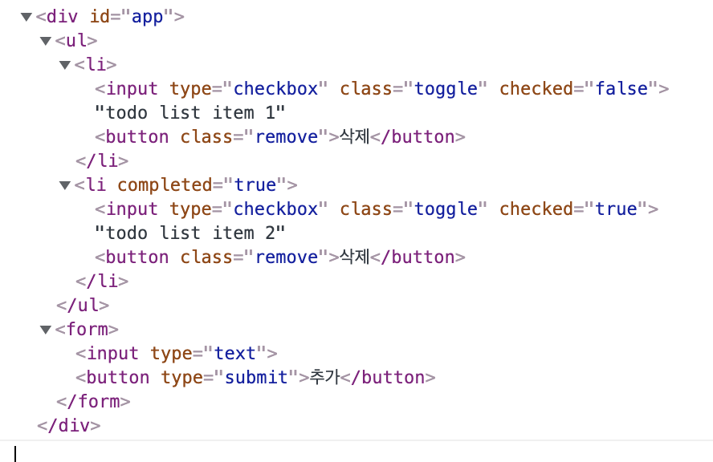

## 7. Diff 알고리즘 적용

여태까지 기술한 내용의 경우 가상돔을 RealDom으로 변경하는 과정이고, 가성돔으로 성능상의 이점을 가져오기 위해선 `Diff 알고리즘` 을 통해서 변경된 속성이나 태그에 대해 업데이트 하는 과정이 필요하다.

```jsx
const oldState = [
  { id: 1, completed: false, content: 'todo list item 1' },
  { id: 2, completed: true, content: 'todo list item 2' },
];

const newState = [
  { id: 1, completed: true, content: 'todo list item 1 update' },
  { id: 2, completed: true, content: 'todo list item 2' },
  { id: 3, completed: false, content: 'todo list item 3' },
];

function createElement(node) { /* 생략 */ };
function updateElement(parent, newNode, oldNode) { /* 구현부 */ }

const render = (state) => (
  <div id="app">
    <ul>
      { state.map(({ completed, content }) => (
        <li class={completed ? 'completed' : null}>
          <input type="checkbox" class="toggle" checked={completed} />
          { content }
          <button class="remove">삭제</button>
        </li>
      )) }
    </ul>
    <form>
      <input type="text" />
      <button type="submit">추가</button>
    </form>
  </div>
);

const oldNode = render(oldState);
const newNode = render(newState);

const $root = document.createElement('div');

document.body.appendChild($root);
updateElement($root, oldNode);
setTimeout(() => 
  updateElement($root, newNode, oldNode),
  1000
); // 1초 뒤에 DOM 변경
```

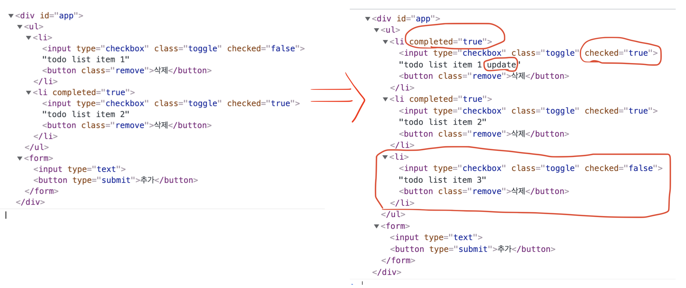

위의 코드를 보고 `updateElement(parennt, newNode, oldNode)` 함수의 내용을 요약해보자면 다음과 같다.

> 모든 태그를 비교하여 변경된 부분에 대해 수정/추가/삭제 한다.

다시 이 내용을 `분할 정복((Divide and conquer)` 해보자.

1. oldNode만 있는 경우(`oldNode && !newNode`)
  - oldNode를 parent에서 제거한다.
2. newNode만 있는 경우(`!oldNode && newNode`)
  - newNode를 parent에 추가한다.
3. oldNode와 newNode 모두 text 타입일 경우(`typeof oldNode === "string" && typeof newNode === "string"`)
  - oldNode의 내용과 newNode의 내용이 다르다면, oldNode의 내용을 newNode의 내용으로 교체한다.
4. oldNode와 newNode의 태그 이름(type)이 다를 경우(`oldNode.type !== newNode.type`)
  - 둘 중에 하나가 `String`일 경우에도 해당
  - oldNode를 제거하고, 해당 위치에 newNode를 추가한다.
5. oldNode와 newNode의 태그 이름(type)이 똑같을 경우(`oldNode.type === newNode.type`)
  - newNode와 oldNode의 attribute를 비교하여 변경된 부분만 반영한다.
    - oldNode의 attribute 중 newNode에 없는 것은 모두 제거한다.
    - newNode의 attribute에서 변경된 내용만 oldNode의 attribute에 반영한다.
6. newNode와 oldNode의 모든 자식 태그를 순회하며 1 ~ 5의 내용을 반복한다.

위의 내용을 다시 코드로 간략하게 표현해보자.

```jsx
function updateElement (parent, newNode, oldNode, index = 0) {
  // 1. oldNode만 있는 경우
  if (!newNode && oldNode) {}

  // 2. newNode만 있는 경우
  if (newNode && !oldNode) {}

  // 3. oldNode와 newNode 모두 text 타입일 경우
  if (typeof newNode === "string" && typeof oldNode === "string") {}

  // 4. oldNode와 newNode의 태그 이름(type)이 다를 경우
  if (newNode.type !== oldNode.type) {}

  // 5. oldNode와 newNode의 태그 이름(type)이 같을 경우
  updateAttributes(
    parent.childNode[index],
    newNode.props,
    oldNode.props
  );
  
  // 6. newNode와 oldNode의 모든 자식 태그를 순회하며 1 ~ 5의 내용을 반복한다.
}

// 5 - newNode와 oldNode의 attribute를 비교하여 변경된 부분만 반영한다.
function updateAttributes(target, newProps, oldProps) {}
```

이제 비어있는 코드를 채워보자.

```jsx
function updateElement (parent, newNode, oldNode, index = 0) {
  // 1. oldNode만 있는 경우
  if (!newNode && oldNode) {
    return parent.removeChild(parent.childNode[index]);
  }

  // 2. newNode만 있는 경우
  if (newNode && !oldNode) {
    return parent.appendChild(createElement(newNode));
  }

  // 3. oldNode와 newNode 모두 text 타입일 경우
  if (
    typeof newNode === "string" && typeof oldNode === "string"
  ) {
    if (newNode === oldNode) return;
    return parent.replaceChild(
      createElement(newNode),
      parent.childNodes[index]
    )
  }

  // 4. oldNode와 newNode의 태그 이름(type)이 다를 경우
  if (newNode.type !== oldNode.type) {
    return parent.replaceChild(
      createElement(newNode),
      parent.childNodes[index]
    )
  }

  // 5. oldNode와 newNode의 태그 이름(type)이 같을 경우
  updateAttributes(
    parent.childNodes[index],
    newNode.props || {},
    oldNode.props || {}
  );
  
  // 6. newNode와 oldNode의 모든 자식 태그를 순회하며 1 ~ 5의 내용을 반복한다.
  const maxLength = Math.max(
    newNode.children.length,
    oldNode.children.length,
  );
  for (let i = 0; i < maxLength; i++) {
    updateElement(
      parent.childNodes[index],
      newNode.children[i],
      oldNode.children[i],
      i
    )
  }
}

// 5 - newNode와 oldNode의 attribute를 비교하여 변경된 부분만 반영한다.
function updateAttributes(target, newProps, oldProps) {
  // 달라지거나 추가된 Props를 반영
  for (const [attr, value] of Object.entries(newProps)) {
    if (oldProps[attr] === newProps[attr]) continue;
    target.setAttribute(attr, value);
  }

  // 없어진 props를 attribute에서 제거
  for (const attr of Object.keys(oldProps)) {
    if (newProps[attr] !== undefined) continue;
    target.removeAttribute(attr)
  }
}
```

복잡한 로직의 경우 미리 어떤 로직을 만들어야하는지 정의하고 코드를 구성하면 훨씬 구현하기가 쉽다. ~~필자만 그렇게 느끼는건가..?~~

어쨌든 위의 코드가 정상적으로 작동하는지 확인해보자.

```jsx
const oldState = [
  { id: 1, completed: false, content: 'todo list item 1' },
  { id: 2, completed: true, content: 'todo list item 2' },
];

const newState = [
  { id: 1, completed: true, content: 'todo list item 1 update' },
  { id: 2, completed: true, content: 'todo list item 2' },
  { id: 3, completed: false, content: 'todo list item 3' },
];

function createElement(node) { /* 생략 */ };

function updateElement (parent, newNode, oldNode, index = 0) {
  if (!newNode && oldNode) return parent.removeChild(parent.childNode[index]);
  if (newNode && !oldNode) return parent.appendChild(createElement(newNode));
  if (typeof newNode === "string" && typeof oldNode === "string") {
    if (newNode === oldNode) return;
    return parent.replaceChild(
      createElement(newNode),
      parent.childNodes[index]
    )
  }
  if (newNode.type !== oldNode.type) {
    return parent.replaceChild(
      createElement(newNode),
      parent.childNodes[index]
    )
  }

  updateAttributes(
    parent.childNodes[index],
    newNode.props || {},
    oldNode.props || {},
  );
  
  const maxLength = Math.max(newNode.children.length, oldNode.children.length);
  
  for (let i = 0; i < maxLength; i++) {
    updateElement(
      parent.childNodes[index],
      newNode.children[i],
      oldNode.children[i],
      i
    )
  }
}

function updateAttributes(target, newProps, oldProps) {
  for (const [attr, value] of Object.entries(newProps)) {
    if (oldProps[attr] === newProps[attr]) continue;
    target.setAttribute(attr, value);
  }

  for (const attr of Object.keys(oldProps)) {
    if (newProps[attr] !== undefined) continue;
    target.removeAttribute(attr)
  }
}

const render = (state) => (
  <div id="app">
    <ul>
      { state.map(({ completed, content }) => (
        <li class={completed ? 'completed' : null}>
          <input type="checkbox" class="toggle" checked={completed} />
          { content }
          <button class="remove">삭제</button>
        </li>
      )) }
    </ul>
    <form>
      <input type="text" />
      <button type="submit">추가</button>
    </form>
  </div>
);

const oldNode = render(oldState);
const newNode = render(newState);

const $root = document.createElement('div');

document.body.appendChild($root);
updateElement($root, oldNode);
setTimeout(() => 
  updateElement($root, newNode, oldNode),
  1000
); // 1초 뒤에 DOM 변경
```

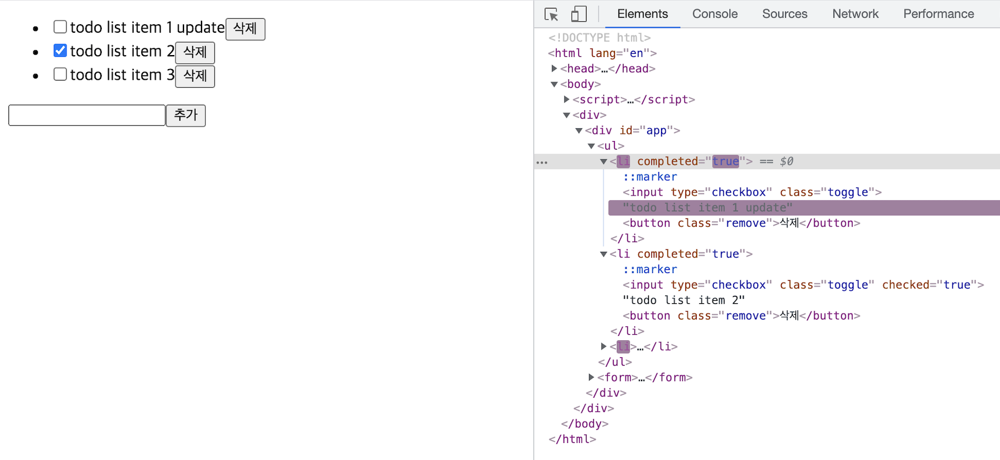

## 8. VirtualDOM이 가지는 문제

Babel이나 Webpack과 함께 VirtualDOM을 사용한다면 사실 특별한 문제는 없다. 그런데 필자가 작성하고 있는 `Vanilla Javascript` 의 경우, 문제가 된다. 특별한 도구 없이 순수한 JS로 작성할 때 VirtualDOM의 가독성은 무척 좋지 않기 때문이다.

그리고 사실 `diff 알고리즘`만 잘 작성한다면 성능상의 문제는 없을 것이다.

그래서 필자는 RealDOM을 VirtualDOM 처럼 사용해보면 어떨까 생각해봤다.

```jsx
// text를 node로 변환하는 작업이다.
const render = (state) => {
  // 빈 태그를 하나 만든다.
  const el = document.createElement('div');

  // 안에 내용을 채워넣는다.
  el.innerHTML = `
    <div id="app">
      <ul>
        ${ state.map(({ completed, content }) => `
          <li class="${completed ? 'completed' : ''}">
            <input type="checkbox" class="toggle" ${completed ? 'checked' : ''} />
            ${content}
            <button class="remove">삭제</button>
          </li>
        `).join('') }
      </ul>
      <form>
        <input type="text" />
        <button type="submit">추가</button>
      </form>
    </div>
  `.trim();

  // innerHTML에 등장한 첫 번째 태그를 반환한다.
  return el.firstChild;
}
```

혹은 이런 방법도 가능하다.

```jsx
const render = (state) => `
  <div id="app">
    <ul>
      ${ state.map(({ completed, content }) => `
        <li class="${completed ? 'completed' : ''}">
          <input type="checkbox" class="toggle" ${completed ? 'checked' : ''} />
          ${content}
          <button class="remove">삭제</button>
        </li>
      `).join('') }
    </ul>
    <form>
      <input type="text" />
      <button type="submit">추가</button>
    </form>
  </div>
`;

// 외부에서 text를 node로 변환할 수 있다.
const oldNode = document.createElement('div');
oldNode.innerHTML = render(oldState);

const realNode = oldNode.cloneNode(true); // 복제
realNode.innerHTML = render(newState); // 복제된 노드의 내용 변경
```

둘 중에 한 가지 방법을 사용하면 되고, 중요한 점은 DOM을 메모리상에만 올려놓고 값을 변경하는 작업을 하는 것이다. 이렇게 할 경우 렌더링이 발생하지 않고 메모리에 참조중인 값만 변경하기 때문에 가상돔을 사용하는 것과 별  차이 없다.

그리고 **diff 알고리즘의 내용을 조금 수정**해야한다.

```jsx
function updateElement (parent, newNode, oldNode) {
  // 1. oldNode만 있는 경우
  if (!newNode && oldNode) {
    return oldNode.remove();
  }

  // 2. newNode만 있는 경우
  if (newNode && !oldNode) {
    return parent.appendChild(newNode);
  }

  // 3. oldNode와 newNode 모두 text 타입일 경우
  if (
    // typeof가 아니라 instanceof로 직접 비교한다.
    newNode instanceof Text && oldNode instanceof Text
  ) {
    // Text일 경우 nodeValue로 값 비교가 가능하다.
    if (oldNode.nodeValue === newNode.nodeValue) return;

    // nodeValue의 값을 변경해준다.
    oldNode.nodeValue = newNode.nodeValue
    return;
  }

  // 4. oldNode와 newNode의 태그 이름이 다를 경우
  if (newNode.nodeName !== oldNode.nodeName) {
    const index = [ ...parent.childNodes ].indexOf(oldNode);
    return (
			oldNode.remove(),
	    parent.appendChild(newNode, index)
		); // undefined를 반환할 것이다.
  }

  // 5. oldNode와 newNode의 태그 이름(type)이 같을 경우
  // 가상돔의 props를 넘기는게 아니기 때문에 oldNode와 newNode를 직접 넘긴다.
  updateAttributes(oldNode, newNode);
  
  // 6. newNode와 oldNode의 모든 자식 태그를 순회하며 1 ~ 5의 내용을 반복한다.
  // 일단 childNodes를 배열로 변환해야한다.
  const newChildren = [ ...newNode.childNodes ]; 
  const oldChildren = [ ...oldNode.childNodes ];
  const maxLength = Math.max(newChildren.length, oldChildren.length);
  for (let i = 0; i < maxLength; i++) {
    updateElement(oldNode, newChildren[i], oldChildren[i]);
  }
}

function updateAttributes(oldNode, newNode) {
	const oldProps = [ ...oldNode.attributes ];
	const newProps = [ ...newNode.attributes ];
	
	// 달라지거나 추가된 Props를 반영
	for (const {name, value} of newProps) {
	  if (value === oldNode.getAttribute(name)) continue;
	  oldNode.setAttribute(name, value);
	}
	
	// 없어진 props를 attribute에서 제거
	for (const {name} of oldProps) {
	  if (newNode.getAttribute(name) !== undefined) continue;
	  oldNode.removeAttribute(name);
	}
}
```

전체 코드를 종합해보면 다음과 같다.

```jsx
const oldState = [
  { id: 1, completed: false, content: 'todo list item 1' },
  { id: 2, completed: true, content: 'todo list item 2' },
];

const newState = [
  { id: 1, completed: true, content: 'todo list item 1 update' },
  { id: 2, completed: true, content: 'todo list item 2' },
  { id: 3, completed: false, content: 'todo list item 3' },
];

function updateElement (parent, newNode, oldNode) {
  if (!newNode && oldNode) return oldNode.remove();
  if (newNode && !oldNode) return parent.appendChild(newNode);
  if (newNode instanceof Text && oldNode instanceof Text) {
    if (oldNode.nodeValue === newNode.nodeValue) return;
    oldNode.nodeValue = newNode.nodeValue
    return;
  }
  if (newNode.nodeName !== oldNode.nodeName) {
    const index = [ ...parent.childNodes ].indexOf(oldNode);
    oldNode.remove();
    parent.appendChild(newNode, index);
    return;
  }
  updateAttributes(oldNode, newNode);
  
  const newChildren = [ ...newNode.childNodes ];
  const oldChildren = [ ...oldNode.childNodes ];
  const maxLength = Math.max(newChildren.length, oldChildren.length);
  for (let i = 0; i < maxLength; i++) {
    updateElement(oldNode, newChildren[i], oldChildren[i]);
  }
}

function updateAttributes(oldNode, newNode) {
	for (const {name, value} of [ ...newNode.attributes ]) {
	  if (value === oldNode.getAttribute(name)) continue;
	  oldNode.setAttribute(name, value);
	}
	for (const {name} of [ ...oldNode.attributes ]) {
	  if (newNode.getAttribute(name) !== undefined) continue;
	  oldNode.removeAttribute(name);
	}
}

const render = (state) => {
  const el = document.createElement('div');
  el.innerHTML = `
    <div id="app">
      <ul>
        ${ state.map(({ completed, content }) => `
          <li class="${completed ? 'completed' : ''}">
            <input type="checkbox" class="toggle" ${completed ? 'checked' : ''} />
            ${content}
            <button class="remove">삭제</button>
          </li>
        `).join('') }
      </ul>
      <form>
        <input type="text" />
        <button type="submit">추가</button>
      </form>
    </div>
  `.trim();

  return el.firstChild;
}

const oldNode = render(oldState);
const newNode = render(newState);

const $root = document.createElement('div');

document.body.appendChild($root);
updateElement($root, oldNode);
setTimeout(() => 
  updateElement($root, newNode, oldNode),
  1000
); // 1초 뒤에 DOM 변경
```

이렇게만 사용해도 충분할 것이다.

## 9. DIFF 알고리즘 +  컴포넌트

앞서 작성한 DIFF 알고리즘을 이용해서 [Vanilla Javascript로 웹 컴포넌트 만들기](https://junilhwang.github.io/TIL/Javascript/Design/Vanilla-JS-Component/)를 다시 구성해보자.

```jsx
class Component {
  $target; $state;
  
  constructor ($target) { 
    this.$target = $target;
    this.setup();
    this.render();
  }
  setup () {};
  template () { return ''; }
  
  // 여기가 핵심이다.
  render () {
    const { $target } = this;
    
    // 기존 Node를 복제한 후에 새로운 템플릿을 채워넣는다.
    const newNode = $target.cloneNode(true);
    newNode.innerHTML = this.template();
    
    // DIFF알고리즘을 적용한다.
    const oldChildNodes = [ ...$target.childNodes ];
    const newChildNodes = [ ...newNode.childNodes ];
    const max = Math.max(oldChildNodes.length, newChildNodes.length);
    for (let i = 0; i < max; i++) {
      updateElement($target, newChildNodes[i], oldChildNodes[i]);
    }

    // 이벤트를 등록한다.
    this.setEvent();
  }

  setEvent () {}
  setState (newState) {
    this.$state = { ...this.$state, ...newState };
    this.render();
  }
}
```

위의 코드를 이용해서 `App Component`를 만들어보자.

```jsx
class App extends Component {
  setup () {
    this.$state = { items: ['item1', 'item2'] };
  }
  template () {
    const { items } = this.$state;
    return `
      <ul>
        ${items.map(item => `<li>${item}</li>`).join('')}
      </ul>
      <button>추가</button>
    `;
  }
  
  setEvent () {
    // button을 클릭할 때 마다 state가 변경되고, 렌더링이 실행된다.
    this.$target.querySelector('button').addEventListener('click', () => {
      const { items } = this.$state;
      this.setState({ items: [ ...items, `item${items.length + 1}` ] });
    }); 
  }
}

// 컴포넌트 생성
new App(document.querySelector('#app'));
```

실행은 잘 되지만 문제는 `렌더링을 할 때 마다 이벤트가 다시 등록`된다는 점이다.

기존에는 template의 모든 코드를 다시 그렸다. 그런데 이제 변경된 부분에 대해서만 반영하기 때문에 기존 태그에 등록된 이벤트가 있을 경우 이벤트를 해제하고 다시 등록하는 과정이 필요하다.

```jsx
class App extends Component {
  setup () {/**생략**/}
  template () {/**생략**/}

  // 아이템 추가 메소드
  addItem = () => {
		const { items } = this.$state;
		this.setState({ items: [ ...items, `item${items.length + 1}` ] });
  }

  // 이벤트 등록 메소드
  setEvent () {
    // setEvent를 실행할 당시에는 this가 App이 아닌 Component를 가르키게 된다.
    // 그래서 setEvent가 실행하는 시점에서 1프레임 이후에 이벤트를 등록/삭제하도록 한다.
    requestAnimationFrame(() => {
      // 이벤트 삭제 후 다시 등록
	    const $addButton = this.$target.querySelector('button');
	    $addButton.removeEventListener('click', this.addItem);
	    $addButton.addEventListener('click', this.addItem); 
		});
  }
}
```

주석에도 언급했지만, `requestAnimationFrame`을 사용하는 이유는 `this`가 binding 되는 시점 때문이다. 이 부분은 Component에 추상화해서 관리하는 것이 좋다.

```jsx
class Component {
  constructor ($target) { /*생략*/}
  setup () {};
  template () { /*생략*/ }
  render () {
    /*생략*/
   
    // setEvent에 있던 requestAnimationFrame을 이곳으로 옮김
    requestAnimationFrame(() => this.setEvent());
  }
  setEvent () {}
  setState (newState) { /*생략*/ }
}

class App extends Component {
  setup () {/*생략*/}
  template () {/*생략*/}
  addItem = () => {/*생략*/}
  setEvent () {
    // requestAnimationFrame 제거
    const $addButton = this.$target.querySelector('button');
    $addButton.removeEventListener('click', this.addItem);
    $addButton.addEventListener('click', this.addItem); 
  }
}

new App(document.querySelector('#app'));
```

사실 고도화 하고자 한다면 더욱 더 복잡해질 것이다. 다른 것 보다 이벤트를 관리하는게 무척 복잡하기 때문이다. 그래서 이 포스팅은 여기까지만 다루도록 하겠다.

## Summary

- 브라우저 렌더링 과정에 대해서 이해해야 한다.
- 태그가 변경되면서 기하학적인 변화가 있을 경우에 reflow가 발생하고, reflow는 비용이 매우 크다.
- reflow를 최소화하기 위해서 가상돔(VirtualDOM)이 등장했다.
- VirtualDOM의 가독성이 좋지 않기 때문에 JSX라는 것을 사용한다.
- VirtualDOM 보다 더 중요한 것은 DIFF 알고리즘이다.
- 굳이 VirtualDOM을 사용하지 않아도 된다.

## Reference

- [성능 최적화 | Toast UI](https://ui.toast.com/fe-guide/ko_PERFORMANCE#%EC%84%B1%EB%8A%A5-%EC%B5%9C%EC%A0%81%ED%99%94)
- [렌더링 성능 | Google Developers](https://developers.google.com/web/fundamentals/performance/rendering?hl=ko)
- [객체 모델 생성 | Google Developers](https://developers.google.com/web/fundamentals/performance/critical-rendering-path/constructing-the-object-model?hl=ko)
- [[번역] 리액트에 대해서 그 누구도 제대로 설명하기 어려운 것 – 왜 Virtual DOM 인가?](https://velopert.com/3236)
- [How to write your own Virtual DOM](https://medium.com/@deathmood/how-to-write-your-own-virtual-dom-ee74acc13060)