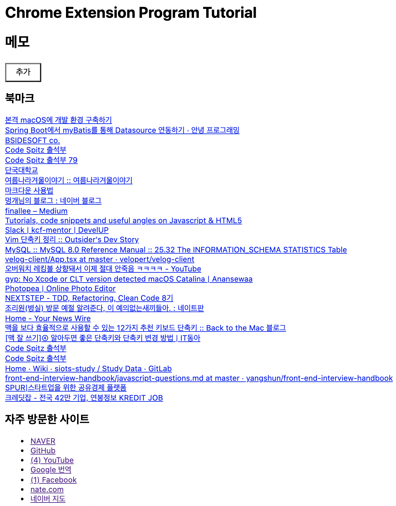
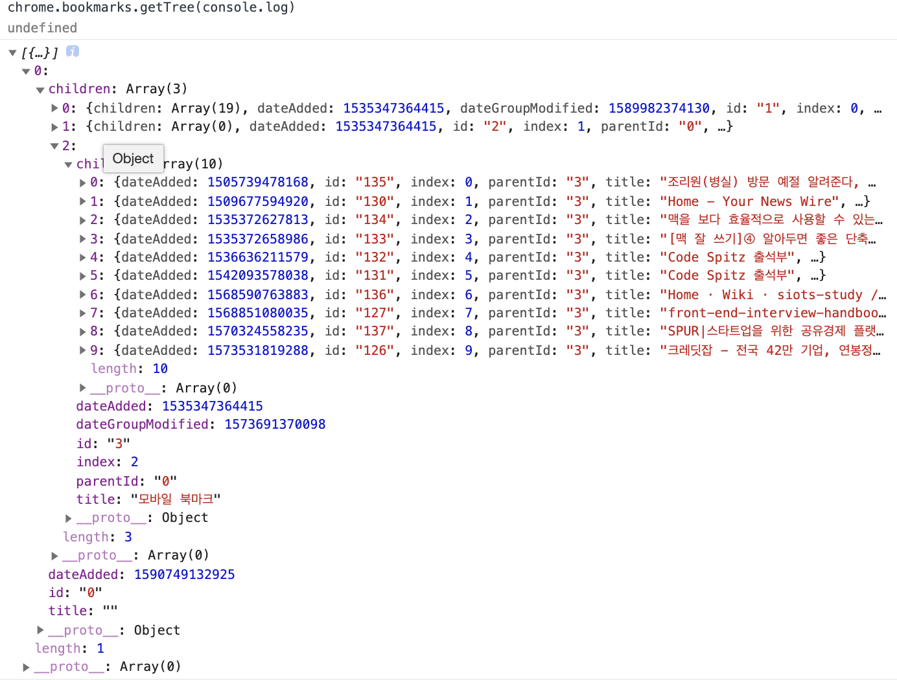

---

title: 2020년 5월 회고
description: 2020년 5월 회고 입니다.
sidebarDepth: 2
date: 2020-05-31

---

# 2020년 5월 회고

이번 달은 성인이 된 이후로 제일 열심히 공부하며 지낸 것 같다.

## 공적

- 5월은 거의 크롬 확장프로그램 개발 위주의 업무를 진행했다.
- API도 만들고 FE도 만들었다.
- 그러면서 겪은 일들을 회고한다.

### 1. API 개발

다른 회사는 어떤지 모르겠지만.. 우리 회사는 철저하게 망 분리가 된 상태로 서버를 관리하고 있다.
이것도 [IDC(Internet Data Center)](https://blog.naver.com/kinxtime/220648265067?proxyReferer=https%3A%2F%2Fwww.google.com%2F)와
[AWS(Amazon Web Service)](https://aws.amazon.com/ko/what-is-aws/)를 동시에 사용하고 있기 때문에 API를 개발할 때 신경써야 할게 한 둘이 아니다.

#### (1) Local 환경

일단 로컬 환경에서 개발할 때는 다음과 같은 프로세스를 따른다.

- 필요한 외부 API를 __일일히 수동으로__ 찔러서 JSON 파일로 저장한다.
  - 아예 외부 API가 아니라 사내에서 만든 API의 경우 개발망 -> IDC연결망 -> IDC망 으로 접속해서 찔러야 한다.
  - 이 때 IDC망에서 인바운드/아웃바운드가 되어 있지 않다면 API를 호출해도 오류만 발생한다.
  - 그러나 보안 때문에 필요한 API 망만 열어놓기 때문에 시스템 인프라팀에서 바운드 설정해줘야 한다.
  - Domain에 대한 IP도 `/etc/hosts`에서 설정해줘야 API를 호출할 수 있다.
- JSON 파일에 대한 Data Class를 만든다.
- Adapter Interface와 MockUpAdapter를 만든다.
- MockUpAdapter는 API를 직접 호출 하지 않고 직접 API를 호출하여 저장한 JSON 파일을 파싱하여 읽어온다.
- Spring의 Profile이 local이나 test일 때는 MockUpAdapter를 통해 API의 Data를 수집한다.

이렇게 눈물 겨운 과정을 거쳐 만들어진 `MockUpAdapter`를 이용하여 Service, Facade, Controller, DataClass 등을 개발한다.

#### (2) QA 환경

Local에서 충분히 기능이 만들어졌다면 이제 `RealAdapter`를 만들어야 한다.

- 팀 내에서 사용 중인 CoreRestTemplate을 이용하여 API를 호출해야 한다. 이 때 각각의 host에 대한 Bean을 등록한 다음 사용한다.
- 간간히 QA에서도 호출이 되지 않는 API들이 존재한다. 이 때는 MockUpAdapter를 사용해야한다.
  - 그래서 테스트할 때 지옥이다. 실서버 환경에서만 테스트가 가능한 아이러니..
  - 무엇보다 Profile에 대한 조건을 설정하는게 참 번거롭다.
- 위와 같은 과정을 거쳐서 RealAdapter 개발이 완료 되면 이제 QA 환경에 올린 다음 테스트한다.
- QA 배포는 젠킨스를 이용한다.
- QA 환경에서의 오류 로그를 확인하기 위해선 일단 개발망에 접근해야 한다.

_개발망과 인터넷망이 완벽하게 분리된 상태에서 겪는 번거로움은 다음과 같다._

- 키보드/모니터/마우스가 개발망 PC와 인터넷망 PC에 쌍으로 연결되어 있어서 단축키를 이용하여 전환할 수 있다.
  - 전환만 가능할 뿐, 복사/붙여넣기/인터넷 등도 이용할 수 없다.
- 개발망 PC에는 그래도 간간히 설치할 수 있는 패키지가 존재한다. 하지만 개발망 PC의 용도는 서비스 서버로 접근하기 위함이다.
  - 서비스 서버에는 패키지를 아예 설치할 수 없도록 망 분리가 되어 있다. 
  - 그래서 cat을 통해서 출력한 파일을 클립보드에 복사한다던지 하는 기능은 이용할 수 없다.
  - 즉, 일일히 vim으로 확인할 수 밖에 없는 상태이다.
  - 보통 로그 파일은 기본적으로 만줄 이상이다. 하루만 쌓여도 10만줄은 거뜬하게 넘어간다..

쉽게 말해서 __개발망에 접근하여 VIM으로 몇 만줄씩 되는 로그를 보면서 문제점을 찾아내야 한다.__
로그를 복사할 수도 없고, 다른 에디터로 열 수도 없다. 오직 터미널에서만 확인할 수 있다는 것이다.
너무 번거롭지만.. 회사에서 권장하는 정책이 이러하다. 하지만 곧 바뀔 예정이라고 하니.. 일말의 희망을 가지고 있는 상태다.

어쨌든 QA Server에 배포한 다음에 정상적으로 API가 작동한다면 괜찮겠지만, 문제가 발생했을 때 이를 해결하기 위한 과정은 정말 순탄하지가 않다.

#### (3) 망 분리와 보안 정책으로 인하여 겪는 API 호출 과정

어쨌든 이런 환경에서 API를 만들어야 한다. 그래서 API 호출은 다음과 같은 과정이 필요하다.

브라우저 -> 서비스 서버 -> Internal API -> 외부 API

- 브라우저에서 서비스 서버에 Ajax로 API를 호출한다.
- 서비스 서버는 Interal API를 호출하여 모든 데이터를 한 번에 내려받는다.
- Internal API라는 이름에 맞게, Internal API Server는 대부분의 API를 호출할 수 있도록 보안 정책이 구성되어 있다.
- Internal API는 정말 수 없이 많은 API를 호출하고, 이를 정제하여 서비스 서버에 내려준다.

따라서 브라우저에 필요한 데이터를 보기 위해선 사실 3번의 API 호출 과정을 겪는 것이다.

그렇다면.. 성능상 문제가 있지 않을까?

#### (4) 캐싱 시스템

위와 같은 API 호출 과정은 캐싱 정책을 이용하여 간략화된다.

- Internal API Server가 시작되자 마자 모든 서비스를 다 실행하여 필요한 API를 모두 호출한다.
  - Controller -> Template Facade -> Module -> Facade -> Service -> Adapter 와 같은 호출 과정을 겪는다. 
- 이 때 Service와 Module을 Caching하고, Template Facade는 캐싱된 Module을, Facade는 캐싱된 Service를 사용한다.
- 그리고 필요한 시점에 스케쥴러가 다시 한번 API를 호출하여 캐싱된 데이터를 최신화시켜준다.

결국 위와 같은 과정으로 Internal API는 항상 캐싱된 데이터만 내보낸다.
그리고 서비스 서버도 이와 똑같은 과정으로 캐싱을 한다.

- 서비스 서버에서도 마찬가지로 Internal API에서 내려보낸 데이터를 캐싱한다. 그리고 스케쥴러가 돌면서 캐싱된 데이터를 최신화 해준다.
- 서비스 서버가 브라우저에 데이터를 내려주면, 브라우저가 다시 local cache에 API의 결과물을 저장한다.

결국 브라우저에서 필요한 데이터는 이러한 캐싱 시스템을 이용하여 서비스 서버만 호출하여도 모든 데이터를 가져올 수 있도록 구성된다.

정리하자면 다음과 같다.

- 브라우저 -> 서비스 서버의 캐시 데이터 호출
- 서비스 서버 스케쥴러 -> Internal API의 캐시 데이터 호출 -> 캐시 최신화
- Internal API 스케쥴러 -> 외부 API 호출 -> 캐시 최신화

### 2. 크롬 익스텐션 개발

#### (1) 크롬 익스텐션 튜토리얼

[튜토리얼 레포지토리 바로가기](https://github.com/JunilHwang/chrome-extension-tutorial)



일단, 개발에 앞서 ~~커밋 횟수도 채울겸~~ 튜토리얼을 진행했다. 개발에 필요한 API는 History, Bookmark, Storage API였다.

##### manifest.json

먼저 확장프로그램에 꼭 필요한 파일이 바로 `manifest.json`이다.

::: tip manifest.json

[Chrome API 공식 문서](https://developer.chrome.com/extensions/manifest)에서 확인해볼 수 있긴 한데.. 설명이 좀 빈약하다.

- manifest.json 파일은 json 포맷 파일로서, 모든 웹 익스텐션이 포함하고 있어야 하는 파일이다. 
- manifest.json에 익스텐션의 이름, 버젼과 같은 기본 정보, 익스텐션의 기능 등을 명시해야 한다.
- 예를 들어 기본 스크립트, 내용 스크립트, 브라우져 활동 등과 같은 측면을 명시할 수 있다. 

[MDN Web Extension](https://developer.mozilla.org/ko/docs/Mozilla/Add-ons/WebExtensions/manifest.json)에서도 확인할 수 있다.

:::

``` js
{
  // 버전 명시.
  "manifest_version": 2, 

  // 확장 프로그램 이름
  "name": "JunilChromeExtensionTutorial", 

  // 확장 프로그램 설명
  "description": "Chrome Extension Tutorial", 

  // 확장 프로그램 버전
  "version": "1.0", 

  "browser_action": {
    // 화장 프로그램의 아이콘
    "default_icon": "icon.png" 
  },

  "permissions": [
    "activeTab", // 현재 활성중인 탭에 대한 권한
    "tabs",      // 열려 있는 탭에 대한 권한
    "storage",   // chrome.storage API 사용. localstorage와 비슷한 기능
    "bookmarks", // chrome.bookmarks API 사용. 즉, 북마크에 접근할 수 있다.
    "history"    // chrome.history에 접근할 수 있음. 즉, 방문 기록을 접근할 수 있다. 
  ], 

  // 줄여서 CSP라고 한다. 리소스에 대한 보안정책을 설정할 수 있다.
  // unsafe-eval이 있어야 vue를 사용할 수 있다. eval 함수를 사용할 수 있도록 정의하는 것이다.
  "content_security_policy": "script-src 'self' 'unsafe-eval'; object-src 'self'",

  "chrome_url_overrides": {
    // 새 탭을 열었을 때 보여지는 페이지를 설정할 수 있다.
    "newtab": "index.html"
  }
}
```

튜토리얼에선 사용하지 않았지만, chrome의 기본 설정을 덮어씌우는 것도 가능하다.

```js
{
  // 크롬의 기본적인 설정을 덮어씌울 수 있다.
  "chrome_settings_overrides": {

    // 검색 엔진에 대한 설정을 변경할 수 있다.
    "search_provider": {

      // 인코딩 설정
      "encoding": "UTF-8",

      // 검색엔진 키워드
      "keyword": "junil hwang",
     
      // 검색엔진 이름
      "name": "junil hwang blog Search",

      // 검색 엔진
      "search_url": "http://junil-hwang.com/blog/?s={searchTerms}",

      // 기본 검색 엔진으로 설정할지의 여부
      "is_default": true
    },

    // 시작페이지를 설정할 수 있따.
    "startup_pages": ["http://junil-hwang.com"]
  }
}
```

이렇게 시작페이지 / 검색엔진 등을 교체할 수도 있지만 지금 당장은 필요하지 않아서 제외했다.

##### Storage API 사용하기

[Storage API](https://developer.chrome.com/extensions/storage)는 다음과 같이 사용할 수 있다.

``` js
import { Store } from './Store.js';

export const ChromeStore = class extends Store {
  async _setter (key, value) {
    return new Promise((resolve, reject) => {
      try {
        // key에 해당하는 value를 저장한다.
        chrome.storage.local.set({ [key]: value }, resolve)
      } catch (e) {
        reject(e)
      }
    })
  }

  async _getter (key) {
    return new Promise((resolve, reject) => {
      try {
        chrome.storage.local.get(key, storage => resolve(storage[key]))
      } catch (e) {
        reject(e)
      }
    })
  }
}
```

##### Bookmark API 사용하기

[bookmarks api 공식문서](https://developer.chrome.com/extensions/bookmarks)

북마크는 트리구조로 저장이 되어 있기 때문에, 이를 flat 형태로 만들어야 한다.



```js

const bookmarks = [];

const getTree = () => new Promise(resolve => chrome.bookmarks.getTree(resolve));
const load = async () => {
  const [ tree ] = await getTree();
  // tree 구조를 array로 펴주는 과정
  let arr = tree.children.flatMap(v => v.children);
  while (arr.find(v => v.children)) {
    arr = arr.flatMap(v => v.children || [ v ])
  }
  bookmarks.push(...bookmarks.map(({ id, title, url }) => ({ id, title, url })))
}
const save = ({ id, title, url }, key) => {
  chrome.bookmarks.update(id, { title, url }, () => {
    bookmarks[key] = { id, title, url };
  })
}

window.onload = load

```

##### 자주 방문한 사이트

자주 방문한 사이트는 [history api](https://developer.chrome.com/extensions/history)를 사용하면 된다.

그리고 history에서 다시 방문 빈도를 뽑아내기 위해서는 api 스펙에 대해 잘 알아야 되는데, 다행이도 [공식 튜토리얼](https://chromium.googlesource.com/chromium/src/+/master/chrome/common/extensions/docs/examples/api/history/showHistory/typedUrls.js)이 있어서 이해하기가 수월했다.

```js

// 최근 30일 간의 방문 기록 중
const microsecondsPerWeek = 1000 * 60 * 60 * 24 * 30;
const startTime = Date.now() - microsecondsPerWeek;

// 1000 개를 가져온다.
const maxResults = 1000

const getFrequentlyVisited = () => new Promise(resolve => {
  const visited = {}
  const sorted = (a, b) => b[1].count - a[1].count;
  chrome.history.search({text: '', startTime, maxResults}, items => {
    items.forEach(({url, title}, key) => chrome.history.getVisits({url}, result => {
      result.forEach(({ transition }) => {
        if (transition === 'typed') {
          visited[url] = (visited[url] || { title, count: 0 })
          visited[url].count += 1;
        }
      })
      if (key === maxResults - 1) resolve(Object.entries(visited).sort(sorted).map(([ url, { title } ]) => ({ url, title })))
    }))
  })
});

const visited = []
window.onload = async () => {
  visited.push(...[await getFrequentlyVisited()])
}
```

##### 개발 환경에서 고려해야 할 것

크롬 확장프로그램의 경우, 따로 웹 서버가 필요한게 아니다. 하지만 Chrome API를 사용하기 위해선 크롬 확장프로그램으로 등록되어 있어야 했다.
그래서 스토리지에 대한 추상화도 필요했고, history나 bookmark대신에 localstorage를 활용해야 했다.

이에 대한 과정은 아마 6월달에 회사 기술 블로그에 더 자세하게 소개할 수 있을 것 같다. 확장프로그램에 대한 소개는 여기까지!

## 사적

이번 달은 정말 치열하게 살았다고 해도 과언이 아니다.


무려 5월에만 539개의 커밋을 했다. 하루에 20개 이상의 커밋을 한 것이다.

### 0. 일일 라이프 사이클

- `05:30 ~ 05:40` 기상 및 출근 준비
- `05:40 ~ 06:30` 수영장으로 출동(?)
- `06:30 ~ 07:20` 수영 강습(월/수/금) 및 자유 수영(화/목)
- `07:20 ~ 07:40` 회사 출근
- `07:40 ~ 08:00` 아침식사
- `08:00 ~ 12:00` 오전 근무
- `12:00 ~ 13:00` 빠르게 점심을 먹은 후 30분간 기절
- `13:00 ~ 17:00` 오후 근무
- `17:00 ~ 18:00` 퇴근
- `18:00 ~ 19:00` 저녁식사
- `19:00 ~ 20:00` 보통 저녁먹고 너무 졸려서 기절
- `20:00 ~ 25:00` Java Clean Code 미션 수행 및 알고리즘 스터디 PR 코드리뷰 및 알고리즘 풀이

문제는 오전 1시가 되었을 때 바로 잠을 잘 수 있는게 아니라는 점.. 피곤해 죽겠는데 2시 까지 뒤척이다가 기절한다.
그래서 주중에는 항상 피곤하다. ~~빨리 Java Clean Code가 끝났으면 하는 마음이..~~

그래도 하루가 참 즐겁다. 허투루 보내는 시간이 없다는 점이 만족스럽다.

### 1. 단국대학교 알고리즘 스터디

4월 말에 [여자친구](https://github.com/eyabc)가 뜬금없이 알고리즘 스터디를 같이 하자고 했다.
스터디 구성원은 먼저 에브리타임을 통해서 모집하고, 추가로 알고 지내던 후배들 중 같이 하고 싶은 의향이 있는 사람들을 초대했다.

그리고, 생각보다 잘 진행되고 있는 중이다.

#### (1) 스터디 결산


진행한지 1달이 조금 넘은 상태인데 벌써 800개의 커밋과 160개의 PR이 있다.

5월만 조금 더 상세하게 보자면,


455개의 커밋을 했으며 128개의 PR이 올라왔다. 

#### (2) 코드 리뷰

스터디를 하면서 코드 리뷰에 재미가 들렸다.
무엇보다 피드백을 잘 반영해준 스티더원들에게 고맙기도 하고, 또 이들에게 피드백을 해주기 위해서 오히려 내가 더 공부를 많이 해야 했다.

다만 아쉬운 점은, 리뷰를 거의 나만 진행하고 있다는 점. 다른 사람들끼리도 코드 리뷰를 했으면 좋겠다.

#### (3) 알고리즘 풀이

초반에는 나도 문제를 어느 정도 풀이했는데, 자바 클린 코드 수강도 같이 하고 있어서 좀 버겁다.
매일 매일 미션을 수행하기가 왜이리 힘든지.. 거기다 수영 까지 하고 있어서 참 죽을 맛이다.

#### (4) 코딩테스트

여자친구의 취업 준비를 도우면서 나도 코딩 테스트를 같이 보고 있다.

5월에는 다음과 같은 코딩테스트를 응시했다.

- 카카오 프런트엔드 인턴 : 6문제 중 2문제 풀이
- 우아한 테크코스 1차 코딩 테스트(알고리즘) : 4문제 중 3문제 풀이
- 우아한 테크코스 2차 코딩 테스트(바닐라JS) : 요구사항이 명확하지 않은 부분 빼곤 다 풀이
- 프로그래머스 여름방학 인턴 챌린지 : 5문제중 4문제 풀이
  - 10:00 ~ 12:00 시험 시간인데.. 응시 시간을 뒤늦게 알아서 11시 10분부터 시작했다...

카카오는... 항상 난이도가 최악 수준이다.. ㅠㅠ

어쨌든 항상 코딩 테스트를 응시하면서 이렇게 긴장감을 유지시킬 필요가 있는 것 같다.

### 2. 자바 클린코드 수강

7기에는 수강신청 시간을 잘못 알고 있어서 마감이 됐었다.
결과적으로 그 때 수강하지 않은건 코로나 때문에 잘 한 일이라고 생각한다.

이번에는 거의 1등으로 수강신청을 완료하지 않았나 싶다.

현재 회사에서 java를 사용하고 있긴 하지만, java의 코어를 잘 모르기 때문에 이번 기회에 제대로 익혀두자 싶어서 수강신청을 했다.
결과는 ~~죽을맛이다~~ 매우 만족스럽다.

코드 리뷰의 범위는 `객체지향 생활체조`의 범위에서 진행된다.

::: tip 객체지향 생활 체조

- 한 메서드에 오직 한 단계의 들여쓰기(indent)만 한다.
- else 예약어를 쓰지 않는다.
- 모든 원시값과 문자열을 포장한다.
- 한 줄에 점을 하나만 찍는다.
- 줄여쓰지 않는다(축약 금지).
- 모든 엔티티를 작게 유지한다.
- 3개 이상의 인스턴스 변수를 가진 클래스를 쓰지 않는다.
- 일급 콜렉션을 쓴다.
- 게터/세터/프로퍼티를 쓰지 않는다.

:::

위의 규칙들을 지키면서 프로그램을 만드는 것 자체가 굉장히 어렵고 고민이 많이 된다.
하지만 그만큼 코드 자체는 극한의 아름다움을 보이게 된다.

덕분에 잘 활용할 수 있게 된게 Stream API와 Enum이다.

#### 코드리뷰 모음

아직 3주차 밖에 되지 않았다. 수료까지는 5주가 남았지만, 개개인의 미션 진행 속도에 따라 다르다.

- Racingcar
  - [step1: String 클래스에 대한 학습](https://github.com/next-step/java-racingcar/pull/716)
  - [step2: 문자열 계산기](https://github.com/next-step/java-racingcar/pull/761)
  - [step3: 자동차 경주](https://github.com/next-step/java-racingcar/pull/826)
  - [step4: 자동차 경주 우승자](https://github.com/next-step/java-racingcar/pull/870)
  - [step5: 자동차 경주 리팩토링](https://github.com/next-step/java-racingcar/pull/984)
- Lotto
  - [step1: 문자열 덧셈 계산](https://github.com/next-step/java-lotto/pull/495)
  - [step2: 로또 (1)](https://github.com/next-step/java-lotto/pull/509)
  - [step2: 로또 (2)](https://github.com/next-step/java-lotto/pull/527)
  - [step3: 로또 2등 (2)](https://github.com/next-step/java-lotto/pull/532)
  - [step3: 로또 2등 (2)](https://github.com/next-step/java-lotto/pull/541)
  - [step4: 로또 수동](https://github.com/next-step/java-lotto/pull/550)
- ladder
  - [step1](https://github.com/next-step/java-ladder/pull/389)

[개인적으로 관리하고 있는 통합 저장소](https://github.com/JunilHwang/java-clean-code)

### 3. 코덕

이번 달은 정말 눈물 겹게 1등을 달성했다.


정말 힘들었다.. 그래도 한 번은 1등을 해놔야 좀 마음이 편할 것 같다. 다음달에는 등수에 연연하지 않고 공부에만 연연하기로!


알고리즘 스터디에도 같이 해보자 했는데, 생각보다 다들 꾸준히 해줘서 코덕 전체 그룹중에 1등을 할 수 있었다.


코덕에서 측정해준 기록을 보면 일일 평균 40회의 커밋을 했다고 한다. 


특히 최근 2주를 워낙 열심히 해서.. 당연한 결과가 아닌가 싶다.

이제 코덕에 대한 집착은 접어두자.

### 4. 기능경기대회

원래 4월에 열려야되는 지방대회가 코로나의 여파로 6월까지 연기되었다.
덕분에 바빠 죽겠는데.. 문제에 대한 솔루션을 요청해서 그냥 만들어줬다.

[솔루션](https://junilhwang.github.io/webskills2020/)

### 5. 수영

코로나의 여파로 재택근무를 하는 동안 수영을 하지 못했다. 덕분에 몸이, 특히 목이 너무 아팠다.
5월이 되자 마자 6개월치를 일시불로 등록했고, 덕분에 매일 매일 수영을 할 수 있게 되었다!

- 드디어 자유형을 제대로 할 수 있게 되었다.
- 힘들 때 그냥 누우면 저절로 뜨는 것을 깨달았다.

확실히 수영을 하니까 몸이 항상 개운하다. 다만 아직 체력이 부족하기 때문에 너무 피곤할뿐..
그런데 5월 마지막주는 어느 정도 적응해서 그런지 덜 피곤했음!

### 6. 아쉬운 점

이번 달은 사이드 프로젝트를 거의 진행하지 못했다.
6월 까지는 꼭 마무리 했으면 좋겠다. 꼭 배포 한 다음에 서비스 해봐야지!

## Summary

- 철저하게 망이 분리된 상태에서의 API 개발
- 크롬 확장프로그램 개발 및 크롬 API 응용 방법
- 코덕 1등
- 단국대 알고리즘 스터디를 어느정도 잘 유지 중
- 자바 클린코드 레이싱카 / 로또 완료. 이제 2개 남았음
- 기능대회와의 손절은 언제 가능한 것인가..
- 수영 열심히 다니는 중
- 사이드 프로젝트를 진행하지 못해서 아쉬움