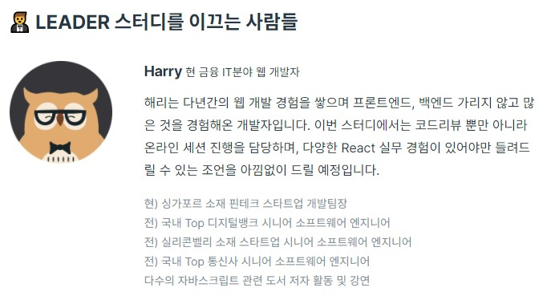

---

title: 2020년 10월 회고
description: 개발자 황준일의 2020년 10월 회고입니다.
sidebarDepth: 2
date: 2020-12-28 23:30:00

---

# 2020년 10월 회고

10월에는 바쁜듯 한가하게 살았다.

## 공적

### 1. CMS 개발

9월과 마찬가지로 10월도 CMS를 만드는데 열중했다.
다만 9월에 배포하고 나서 지속적으로 수정사항이 생기고 있었고 **이 상태로 배포했다고?**
싶을 정도로 버그도 많고 QA를 하지 않고 넘어간 부분도 무척 많았다.

제일 최악은, 이미 배포가 되어 있고 서비스 데이터까지 삽입된 상태의 DB의 설계를 건드려야 하는 부분이었다.
외래키가 무척 복잡하게 만들어진 상태에서 스키마를 변경하는 것 보단 새로 만드는게 나아보였다.

그래서 `hotissue_v2_schedule` `hotissue_v2_template` 처럼 `v2`라는 `suffix`를 붙여서 테이블을 새로 만들었고,
테이블의 변경에 따라 서비스 로직도 대폭 수정했다.

이 과정에서 드러난 제일 큰 문제는 기획쪽과 개발쪽의 커뮤니케이션 문제도 있었고,
기획과 QA를 CMS를 사용하는 실무진이 했기 때문에(개발을 사용자에게 시킨 것과 비슷하달까?) 오히려 놓친 부분이 무척 많았던 것 같다.

그래서 배포하는 도중에 수정사항이 생기기도 하고.. QA를 아예 하지 않은 부분도 있었고.. 다사다난 했다.

결과적으로 트러블이 생긴 후에 많은 문제점이 겉으로 드러났기 때문에 문제를 잘 핸들링 할 수 있었다.
2차 배포 전까지 QA도 완벽하게 끝냈고, 끊임 없이 커뮤니케이션을 했었다.
일하는 시간 보다 커뮤니케이션 하는 시간이 많았다.

만들고 나서 보니까 복잡한 로직이 너무 많이 있어서 리팩토링이 무조건 필요한 상태였다.
그런데 11월부터 바로 다른 프로젝트를 들어가야해서, 리팩토링은 시간 있을 때 틈틈이 할 예정이다.

## 사적

### 1. 프로그래머스 리액트 스터디

나는 개인적으로 [프로그래머스](https://programmers.co.kr/)를 무척 애용하는 편이고, 주변에도 많이 추천하고 있다.
프로그래머스에는 [알고리즘](https://programmers.co.kr/learn/challenges)과 관련된 서비스 뿐만 아니라 프론트와 백엔드를 포함한 여러가지 [챌린지 서비스](https://programmers.co.kr/competitions)도 있고,
[온라인 강의](https://programmers.co.kr/learn)와 스터디 형태의 강의도 존재한다.

제일 중요한게 취업 준비를 할 때 프로그래머스에 이력서를 작성했고, **현재 재직 중인 회사가 프로그래머스를 통해 오퍼**를 줬고 자연스럽게 취업이 되었다.

각설하고, 주변 사람들이 프로그래머스에서 진행하고 있는 스터디에 참여했고 만족도가 높은 것 같아서 나도 한 번 참여해볼까 둘러보다가 [React Study](https://programmers.co.kr/learn/courses/10658)를 신청했다.
결론부터 말하자면 무척 만족스러운 스터디였다.

\
~~다시 쓰기 귀찮아서~~ 프로그래머스에 올라온 후기를 첨부한다.

어쨌든 이 스터디가 더 많이 알려졌으면 하는 바람으로 상세하게 소개해 보도록 하겠다.

***

#### (1) Facebook 클론 코딩

React로 Facebook의 뉴스피드와 로그인/회원가입 등을 만드는 과정이다.


위와 같이 뉴스피드를 구성해야 하고,


로그인과 회원가입 페이지도 만들어야 한다.

***

#### (2) CRA(Create React App)을 사용하지 않고 개발환경 구성하기

여태까지 번들러는 [webpack](https://webpack.js.org/)만 사용해봤는데, 이 스터디를 통해서 처음으로 [parcel](https://ko.parceljs.org/)을 사용해봤다.
생각보다 훨씬 더 편했고, 환경 구성 또한 어렵지 않았다.

- 설치하기
```sh
# yarn
yarn add -D parcel-bundler

# npm
npm install -D parcel-bundler
```

- index.html 작성
```html
<!DOCTYPE html>
<html lang="en">
<head>
  <meta charset="UTF-8" />
  <meta name="viewport" content="width=device-width, initial-scale=1.0" />
  <title>페이스북 클론 코딩</title>
</head>
<body>
<div id="root"></div>
<script src="./src/index.js"></script>
</body>
</html>
```

- index.js 작성
```js
import React from 'react';
import ReactDOM from 'react-dom';
import App from './App';

ReactDOM.render(
  <App />,
  document.getElementById('root')
);
```

- npm script 작성
```js
// package.json
{
  /* 앞 내용 생략 */
  "scripts": {
    "dev": "parcel index.html"
  },
  /* 뒷 내용 생략 */
}
```

- 실행
```sh
# npm
> npm run dev

# yarn
> yarn dev
```

- 빌드
```sh
# build script
> parcel build ./src/entry.js

# build path 지정
> parcel build ./src/entry.js --out-dir ./dist
> parcel build ./src/entry.js -d ./dist
```

webpack보다 훨씬 단순하고 이해하기도 쉽다. 


공식문서에 따르면, `4개의 물리 CPU가 있는 2016형 MacBook Pro에서 1726개의 module을 포함한 미 압축 6.5M의 app 기준으로 빌드`를 기준으로 위와 같은 성능을 보인다고 한다.
위의 내용을 완전히 신뢰할 순 없지만 직접 사용해본 입장에서 확실히 빠른 속도가 체감된다.

어쨌든, 스터디를 통해서 CRA를 사용하지 않고 parcel을 이용하여 직접 React를 개발하는데 필요한 각종 패키지를 설치했다.
사실 `react` `react-dom`만 설치해도 무방하다.

그래도 다양한 실습을 위해 `redux` `react-redux` `redux-thunk` `redux-saga` `react-router-dom` `connected-react-router` `styled-jsx` 등을 설치했고,
각종 `babel plugin`과  `eslint` `prettier` 등을 설치했다.

***

#### (3) React Router

react-router-dom에 나와있는 내용와 보편적으로 사용하는 Router의 경우 다음과 같은 형태이다.
```jsx
export default function App() {
  return (
    <Router>
      <div>
        <nav>
          <ul>
            <li><Link to="/">Home</Link></li>
            <li><Link to="/about">about</Link></li>
            <li><Link to="/login">login</Link></li>
            <li><Link to="/join">join</Link></li>
          </ul>
        </nav>
        <Switch>
          <Route path="/about"><About /></Route>
          <Route path="/login"><Login /></Route>
          <Route path="/join"><Join /></Route>
          <Route path="/"><Home /></Route>
        </Switch>
      </div>
    </Router>
  );
}
```

그런데 각각의 라우터가 독립된 레이아웃을 가지는 것이 아니라 분명히 **공통분모**가 존재할 것이다.

예를 들자면
- 로그인/회원가입 페이지의 경우 회원은 접근할 수 없어야 하고 **비슷한 레이아웃**을 가질 것이다.
- 헤더와 푸터를 가지고 있는 페이지가 있을 것이다. 반대로, 헤더와 푸터가 없는 페이지도 있을 수 있다.
- 이 외에도 **공통분모**를 가진 여러가지 페이지 레이아웃이 있을 수 있다.

이 때 다음과 같은 형태로 Router를 표현할 수 있다. 정확히는 재사용이랄까?

```jsx
export default function App() {
  return (
    <Router>
      <div>
        <nav>
          <ul>
            <li><Link to="/">Home</Link></li>
            <li><Link to="/about">about</Link></li>
            <li><Link to="/login">login</Link></li>
            <li><Link to="/join">join</Link></li>
          </ul>
        </nav>
        <Switch>
          <PublicLayout path="/login" component={Login} />
          <PublicLayout path="/join" component={Join} />
          <DefaultLayout path="/about" component={About} />
          <DefaultLayout path="/" component={Home} />
        </Switch>
      </div>
    </Router>
  );
}
```

구현 방법은 [이 링크](https://simonsmith.io/reusing-layouts-in-react-router-4)를 참고하면 된다.(https://m.blog.naver.com/boostcamp_official/222140296542)에서 확인할 수 있다.
여기에서 다루기엔 양이 너무 많다.

***

#### (4) 원리 부터 깨우친다.

단순하게 React로 무언가를 만드는 과정이 아니라

- 어쩌다가 이러한 프레임워크가 등장했는지
- React의 철학은 무엇인지
- 타 프레임워크와 비교했을 때 React의 장점이 무엇인지
- 옳바르게 React를 사용하는 방법
- React를 공부하는데 필요한 기초 지식

등을 먼저 설명하고 그 다음에 구현에 필요한 API를 공부할 수 있도록 방향이 잡혀있다.

예를 들자면 다음과 같은 것들(도메인 지식이랄까?)에 대해 먼저 공부한다.

- `spread 연산자`와 `rest 연산자`의 차이점/공통점
- `Arrow Function`과 `this`
- `module loader` vs `module bundler`
- `ES Module`
- `Virtual DOM`
- `Element` vs `Component`
- `props`
- `propTypes`
- `state`
- `Component Life Cycle`
- `Controlled Component`
- `Uncontrolled Component`
- `Pure Component`
- `Memoization`
- `SPA(Single Page Application)`
- `Hook Motivation`
- `상태관리`
- Javascript의 `실행 컨텍스트`
  - Outer Environment
  - Lexical Environment
- 함수 생성과 호출규칙, 그리고 `클로저`
- `Currying`과 Middleware
- `StateLess` 아키텍쳐와 `JWT(Json Web Token)`
- `Iterator`, `Iterable`, `Generator`
- `promise` 그리고 `async/await`
- `Saga Pattern`

이러한 개념들 이외에도 무척 많은 것들을 배웠으나, 사실 기억 나는게 많지 않다.. 😂
어쨌든 중요한 점은 단순하게 React에 대해 공부하는 것이 아니라 어떤 과정을 통해서 React가 현재의 모습을 갖추게 되었고,
어떤 Motivatino을 통해서 디자인 되었는지 알 수 있었기 때문에 **스터디를 통해서 React에 대한 전반적인 이해도**가 좋아졌다.

***

#### (5) 스터디 리더가 작성한 코드 공유

미션이 종료된 후에 리더가 작성한 코드를 공유해주기 때문에 내가 작성한 코드와 비교하며 부족한 부분을 채울 수 있다는 점도 큰 매리트라고 생각한다.
코드에 정답은 없지만 그래도 내가 작성한 것 보단 정답에 가까운 코드를 보는 것 만으로도 굉장히 큰 도움이 된다.

그리고 내가 현업에서 접하지 못했던 유용한 라이브러리를 많이 볼 수 있었다.
무엇보다 Redux를 정말 제대로, 그리고 잘 사용할 수 있는 방법을 접할 수 있는 점도 좋았다.

***

#### (6) 유쾌한 운영진

스터디 리더와는 별개로, 스터디를 개설하고 관리하는 운영진 덕분에 매 스터디가 즐거웠다. 

크리시님 혹시 이 글을 읽고 계신가요? **당근 상모돌리기** 무척 인상 깊었습니다 😁

***

#### (7) 기술 외적 동기 부여

그리고 스터디 리더인 Harry의 경우 싱가포르 소재의 핀테크 회사에서 팀장급 Full-Stack 개발자로 근무 중이며, 
전 회사인 카카오 뱅크에서는 데이터 엔지니어로 근무했다.



여담으로, Harry는 프로그래머스에서 React Study 뿐만 아니라 다음과 같은 스터디의 리더로 활동하고 있다.

- [단순 CRUD는 그만! 웹 백엔드 시스템 구현(Spring Boot)](https://programmers.co.kr/learn/courses/11186)
- [씹고 뜯고 맛보는 Node.js with REST&GraphQL](https://programmers.co.kr/learn/courses/10617)

굉장히 화려한 이력을 가지고 있지만 Harry는 비전공자이다.
그렇기 때문에 Harry라는 개발자의 존재는 나에게 무척 강렬한 인상을 남겼다.

이렇게 다방면의 기술을 깊게 공부하고 전파할 수 있었던 이유 중 하나가 바로 `영어`라고 했다.
`영어`는 **모든 지식의 도메인 지식**이라고 할 수 있다.
특히 **개발자의 경우 영어로된 문서를 항상 마주봐야 하기 때문에** 어찌보면 개발자가 제일 먼저 공부해야 하는 것이 영어라고 할 수 있다.

`Harry`는 영어를 지속적으로 강조했고, 무척 설득력 있게 다가왔다.
그래서 내년에는 일일커밋 대신 `일일영어`를 하기로 다짐했다.

이 외에도 현업에 대한 다양한 이야기를 들을 수 있었고, 여러가지 갈증을 해소할 수 있었다.

***

#### 정리

결국 내가 하고 싶은 이야기는 한 가지이다.
React를 학습 하고 싶다면 꼭 이 스터디에 참여해보길 권한다.

***

### 2. 블랙커피 블로그 스터디 1기

[9월 회고](../09-September/)의 주된 내용이었던 [블랙커피 스터디 3기](https://edu.nextstep.camp/s/tUzCRWul)가 종료된 후 이어서 블로그 스터디 모집을 한다고 공지가 올라왔다.
망설임 없이 바로 신청했다.

::: tip 블랙커피 블로그 스터디 소개
- 나의 경험, 다른 사람의 경험에서 통찰을 얻기 위한 블로그 스터디
> 제대로 쓰려 말고, 무조건 써라 - 제임스 서버

글을 쓴다는 것은 찰나적으로 지나쳐버린 나의 시간, 생각, 행동을 조립해나가는 과정입니다.
그 과정에서 우리는 연결점을 이어가 의미를 도출할 수도 있고, 또 다른 통찰을 얻어갈 수도 있죠.
쓰지 않는다면 결코 보지 못할 나의 경험들의 깊은 의미도 있을 것입니다.
그래서 글을쓰고, 회고하고, 피드백하기 위해 이 블로그 스터디를 운영합니다.
:::

스터디 내용은 굉장히 단순하다.

- 1주에 글 1편
- 1달에 글 3편
- 애자일 프로세스에서 추천하는 20%의 일정을 버퍼기간을 두는 것을 착안하여, 1달에 총 3편의 글을 작성. _즉, 1주는 버퍼기간_
  
나는 이번 달에는 **2편의 글**을 작성했다.

- [2020년 9월 회고](https://junilhwang.github.io/TIL/Review/2020-year/09-September/)
- [Vanilla Javascript로 웹 컴포넌트 만들기](https://junilhwang.github.io/TIL/Javascript/Design/Vanilla-JS-Component/)

더 많이 쓰고 싶었지만, 10월에 생각보다 이벤트(?)가 많아서 짬내기가 힘들었다. ~~핑계는 청산유수~~

그리고 인상 깊었던 글들을 소개해본다.

- `김종완`님 의 글
  - [개발자를 위한 세금 시리즈 - 1](https://wani-coding.tistory.com/112?category=927131)
  - [개발자들이 알아야하는 세금 꿀팁 - 중소기업 취업자 소득세 감면](https://wani-coding.tistory.com/118?category=927131)
  
- `메이커준`님 의 글
  - [0. 프롤로그: 새로운 출발을 향한 우아한형제들 입사 기록](https://makerjun.com/career/woowabros/programmer-story/)
  - [1. 프로그래밍을 시작한 경위와 본격적으로 투신하고 생업으로 삼기로 결정한 이야기](https://makerjun.com/career/woowabros/why-programmer/)
  
- `eyabc`님 의 글
  - [내 글 써보기](https://eyabc.github.io/Doc/)
  
- `김경록`님 의 글
  - [어느 취준생의 2020년 늦은 상반기 회고록](https://rok93.tistory.com/entry/%EC%96%B4%EB%8A%90-%EC%B7%A8%EC%A4%80%EC%83%9D%EC%9D%98-2020%EB%85%84-%EB%8A%A6%EC%9D%80-%EC%83%81%EB%B0%98%EA%B8%B0-%ED%9A%8C%EA%B3%A0%EB%A1%9D)
  
- `DevJang`님 의 글
  - [우아한 테크러닝 3기 React & TypeScript 후기](https://devjang.github.io/2020/10/17/2020-10-17-woowahan-tech-learning-3rd/)

이렇게 블로그 스터디를 하면서 느낀 것은, 소설을 읽는 것 처럼 다른 사람의 경험을 간접적으로 체험해보는 재미를 느낄 수 있다는 것이다.
내가 겪지 못한 것들을 글로 채우는 느낌이랄까?

블로그 스터디는 11월 까지 이어질 예정이다.

***

### 3. 블랙커피 스터디 4기 리뷰어

나는 블랙커피 스터디 3기에 참여했고, 굉장히 열심히 활동했다.
그리고 이곳 저곳에 꼭 이 스터디에 참여해보라고 홍보했다.

그렇게 [블랙커피 스터디 4기](https://edu.nextstep.camp/s/QfA29i5V) 모집이 시작되었고
내가 가르치는 고등학생들도 신청하도록 유도했다.
단국대 개발자 스터디원에게도 홍보했고, 학교 커뮤니티 사이트에도 홍보했고, 주변에 취준을 하는 후배들에게도 추천했다.

그리고 나는 리뷰어로 참여했다.


덕분에 4기는 3기보다 훨씬 많은 사람들이 참여했고, 리뷰도 더 활발하게 이루어졌다.


문제는 내가 너무 바빠서 리뷰어 활동을 거의 하지 못했다는 점이다... 사실 다른 분들이 너무 열심히 해주셔서 굳이 내가 리뷰를 해주지 않아도 된다는 안도감이 있었던 것 같다.


그리고 리뷰어로 활동하면 스터디 기간 동안 페어프로그래밍을 최소 1회 진행해야 한다.
그런데 내가 진행하는 날에 참여하는 분들이 많이 없었고, 생각보다 수월하게 진행할 수 있었다.
어쩌다 보니 나도 같이 참여하게 된 것 같아서 짝 프로그래밍 보단 그룹(?) 프로그래밍이 되어버렸지만..
어쨌든 좋은 경험이었다고 생각한다.

그리고 `Virtual DOM`에 대해 찾아보다가 직접 구현해보는 내용의 포스트를 읽었고, 호기심에 한 번 따라해봤다.

- [How to write your own Virtual DOM](https://medium.com/@deathmood/how-to-write-your-own-virtual-dom-ee74acc13060)
- [Write your Virtual DOM 2: Props & Events](https://medium.com/@deathmood/write-your-virtual-dom-2-props-events-a957608f5c76)
- [가상돔 만들기 연습 - junilhwang/practice-virtual-dom](https://github.com/JunilHwang/practice-virtual-dom)

추후에 여유 있을 때 조금 더 보완해서 TodoList를 만들어 볼... 수 있을까? 😅

***

### 4. 부스트캠프 리뷰어 그리고 발표

부스트캠프 리뷰어는 8월에 신청했고, 9월 ~ 10월에 활동했다.


차례대로 9월, 10월 리뷰 현황판이다.

격주로 화요일/목요일마다 각각 6명의 캠퍼가 올린 PR을 리뷰했는데,
생각보다 시간이 많이 걸렸고 그렇다고 대충 하기에는 또 찜찜해서 어떻게든 꼼꼼하게 보려고 애썼다. ~~애쓴만큼 잘 했는지는 모르겠다~~


대체로 위와 같은 형태의 리뷰를 남겼다.

마지막주의 리뷰는 사실 리뷰할 내용이 거의 없었다.
미션이 어렵기도 했고, 캠퍼들이 어려운 미션을 진행하면서 리팩토링까지 할 여력이 없어보였다.
일단 구현 자체가 안 된 경우도 많이 있어서 어물쩡 넘어간 경우도 있었다.

***


리뷰를 해드렸던 캠퍼 한 분에게 이렇게 연락이 왔다.
감사하기도 하고, 죄송하기도 하고, 다음에 또 부스트캠프의 리뷰어로 활동하게 된다면 더 좋은 리뷰를 남기리라 다짐하는 순간이었다.

***

부스트캠프의 전반적인 과정을 지켜보면서 느낀 것은, **이 사람들은 무조건 잘 할 수 밖에 없겠다** 라는 점이다.

전반적으로 캠퍼들 간에 상호 피드백도 활발하게 이루어 지고 있고, 학습 환경 또한 온라임에도 불구하고 끈끈한 네트워크가 형성된 것이 느껴졌다.
서로가 서로에게 믿고, 신뢰하고, 의지할 수 있는 사람이 되는 것이다.

그렇다면 개발은 덤으로 따라온다. 무언가를 함께할 사람이 있다는 것은 언제나 즐거운 일이고 그 자체만으로도 활력이 된다.

여담으로 _앞서 언급한 리액트 스터디에도 부스트 캠프를 거쳐온 사람들이 있었다._ 그리고 그 분들이 스터디를 이끌어갔다고 해도 과언이 아니었다.

***

리뷰어 활동이 끝난 후에 슬랙 채널에 다음과 같은 내용의 공지가 올라왔다.


공지가 뜨자 마자 바로 신청했다.

발표자료를 만들고, 팀장님과 상의하여 내용을 조금 변경하고, 리허설도 잘 마무리했고, 발표도 잘 마무리했다.
굉장히 많은 사람들 앞에서 내 의견을 어필해야 했기 때문에 긴장도 많이 했지만 재밌었다.

발표가 끝난 후에 인지했던게 [리액트 스터디](#_1-프로그래머스-리액트-스터디)를 같이 하는 사람 중 한 분(생활 연구소의 홍태의님)이 나와 똑같은 주제로 발표했다.
_세상이 참 좁구나 👀_

저작권 때문에 발표자료를 전부 공개하기는 힘들고, **몇 가지 핵심적인 내용**만 다뤄보자면 다음과 같다.

#### (1) 좋은 직장

- 좋은 직장과 좋은 회사는 다르다.
  - 좋은 회사는 `타인`, 즉 `외부의 시선`을 기준으로 한다.
  - 좋은 직장은 `나`를 기준으로 한다.
  
- 직장 만족도에 대한 보편적인 카테고리
  - `일(업무)`, `돈(급여)`, `사람(팀원)`
  - 세 가지 중 **두 가지 이상** 겹치면 대체로 **좋은 직장**일 가능성이 높다.
  
- 나에게 있어서 좋은 직장을 판별할 때의 **우선순위*는 다음과 같다.
  - 0순위: **팀원(사람)**
  - 1순위: 자사 서비스가 있는가(일)
  - 2순위: 기술스택(일)
  - 3순위: 잡플래닛(돈/일/사람)
  - 4순위: 강남/잠실/판교
  
#### (2) 소프트웨어에 대하여

- 소프트웨어의 _특성_
  - **형체**가 없다.
  - **공장에서 찍어낼 수 없다.**
  - 무조건 **사람의 손**을 거쳐야 한다.
  - 소프트웨어의 **가치**를 측정하기가 힘들다.
  - 한 사람이 가진 기술력은 **똑같은 규격**으로 만드는게 불가능하다.
  
- **3000만원짜리 소프트웨어**를 만들어보자.
  - 개발자 2명 / 기획자 2명 / 디자이너 2명이 투입한다고 가정하자.
  - 평균 200만원의 급여라고 가정하면 1개월에 1200만원의 인건비가 필요하다.
  - 오직 인건비로만 2개월에 2400만원, 3개월이면 3600만원의 비용이 든다.
  - 따라서 3000만원짜리 제품을 만들기 위해선 2개월을 알뜰하게 투자해야한다.
  - _당신은 2개월만에 누가 봐도 3000만원의 가치를 가진 제품을 만들 수 있는가?_

- 결국 **소프트웨어를 만들 때 제일 중요한 것은 "사람(인력)" 그 자체**라고 할 수 있다.
  - 앞서 언급한 내용에서 고려해야할 것 중 하나가 커뮤니케이션 비용(=시간)이다.
  - 구성원 간의 합이 잘 맞는다면 커뮤니케이션 비용(=시간)은 절약될 것이다.
  - 반대의 경우 커뮤니케이션만 하다가 끝날 가능성도 있다.
  - 중간에 인력이 교체되는 경우에도 마찬가지이다.
  - 비슷한 사람은 있어도 똑같은 사람은 없다.
  - 한 사람이 가진 기술력과 커뮤니케이션 능력은 **똑같은 규격**으로 만드는게 불가능하다.
  - 그래서 인력(인적자원)에 투자를 많이 하는 회사일수록 제품(소프트웨어, 서비스) 또한 좋을 확률이 높다.
  - 인력을 공장의 부품처럼 생각하는 회사라면 언제 망해도 이상할게 없다.

::: tip 같이 읽으면 좋은 아티클
- [구멍가게 개발사 이야기](https://www.bsidesoft.com/8035)
- [제로부터 시작하는 개발사 창업 #1](https://steemit.com/development/@hikamaeng/re-1)
- [[개발사 생존기] 완료금편 #1 / 4](https://steemit.com/development/@hikamaeng/1-2)
- [[개발사 생존기] 완료금편 #2 / 4](https://steemit.com/development/@hikamaeng/2-4)
:::

#### (3) 내가 생각하는 개발자에게 제일 중요한 것

- 커뮤니케이션 능력
- 같이 성장하는 능력(빠른 피드백)
- 같이 만드는 능력
  - ~~분업 X~~
  - **협업 O**
- 자존감
  - 스스로를 존중하는 것, 믿는 것
  - 스스로를 존중하고 믿는 만큼 타인(팀원)을 존중하고 믿는 것
- 내가 존중받고 있다고 느끼게 해주는 팀, 그리고 회사
  - 이러한 분위기를 만드는 것
  - 의견을 말함에 있어서 거리낌이 없는 것

::: tip 함께 자라기

- 발표를 한 뒤에 뒤늦게 [함께 자라기](http://www.yes24.com/Product/Goods/67350256)라는 책을 읽었다.
- 내가 생각 했던 내용들보다 더 심오하게 그리고 논리적으로 **학습, 성장, 협업** 등에 대해 다루고 있다.
- 시간을 내서 꼭 한 번 읽어보길 권한다.

:::

[부스트캠프 공식 블로그](https://m.blog.naver.com/boostcamp_official/222140296542)에 가면 더 재미난 이야기들을 확인할 수 있다.

이러한 내용에 대해 약 10분 정도 주절주절 떠들었다. 사실 다른 분들이 좋은 내용을 무척 많이 다뤄주셔서 약간 주눅들었다 😓

어쨌든 스스로에게 좋은 경험을 만들어주었다고 생각한다.
리뷰어 활동과 더불어 이러한 경험을 만들어준 부스트캠프 운영진 분들께 많은 고마움을 느끼고 있다.

***

### 5. 인터넷 강의 영상 제작

어쩌다보니 친한 선생님(?)의 소개로 **인천금융고등학교** 학생들에게 **웹 디자인 기능사**를 주제로 **온라인 방과후 수업**을 진행하게 되었다.
사실 처음에는 웹 개발 강의인줄 알고 기대했는데 알고보니 _디자인 계열의 학과_ 학생들을 대상으로 진행해야 했기 때문에 **웹 디자인 기능사**로 강의 주제를 축소했다.
~~웹 디자인 기능사는 이제 정말 지겹다~~

#### (1) Repl.it

에디터는 어떤 것을 사용할까 고민하다가 [Repl.it](https://repl.it/) 서비스를 이용하기로 했다.
일단 에디터를 설치하고 세팅하고 교육하는데 생각보다 많은 시간이 소요된다.
무엇보다 파일 시스템 내에서 작업해야 하기 때문에 실습 코드를 항상 들고다니는 학생이 아니라면 이를 따라오기가 쉽지 않으리라 생각했다.

**repl.it**의 경우 인터넷만 된다면 어떤 플랫폼이든 상관 없이 이용할 수 있으며 무료로 호스팅까지 해주기 때문에
학생들이 결과물에 대해 흥미를 느끼는 과정이 일반적인 에디터를 사용하는 것 보다 좋아보였다.

그리고 내가 온라인으로 결과물을 바로 확인할 수 있기 때문에 틀린 부분을 교정해주는 것도 훨씬 쉬웠다.

#### (2) 강의 교재

강의 교재는 **유승렬 교수님**이 만드신 [WEB & HTML & CSS](http://webskills.kr/2018/data/WEB_HTML_CSS.pdf)를 사용했다.
사실 기초 개념에 대한 내용만 이 교재에서 찾아 설명하고, 웬만한 이론적인 내용은 그냥 스킵했다.

이론을 초반에 아무리 주절 주절 떠들어도 이해하는 학생들이 경험상 거의 없었기 때문에 일단 실습부터 한 다음에 어떤 원리로 그렇게 되는지 설명했다.
근데 CSS는 외워야 할게 너무 많아서.. 문제다.
추상화를 너무 잘 해놔서(?) 처음 접하는 사람들은 진짜 미치도록 헷갈릴 수 밖에 없다.

#### (3) Repository

예제 코드는 [이 저장소](https://github.com/JunilHwang/oneline-lecture-note)에 모아놨다.
대충 핵심적인 내용만 README.md에 작성해놨는데, CSS를 처음 접하는 사람에게 CSS를 잘 설명하기란 정말 하늘의 별따기인 것 같다.
특히 디자인을 전공하는 사람에게 설명하는 것은 배로 힘들다.

#### (4) 분량

분량은 한 개의 영상당 40분씩 총 10개를 촬영했다.


녹화는 Mac의 QuickTime Player를 이용했는데 이게 무조건 4k로 녹화되다 보니 용량을 쓸데없이 많이 차지했다.
인코딩을 다시 해도 줄어들 기미가 보이지 않아서 그냥 포기했다.

나중에 알게된 사실인데 Zoom을 이용하여 녹화하면 거의 용량을 20배 가까이 줄일 수 있는 것 같다. 이걸 왜 이제야 알았을까 🤣

일단 빠르게 10개만 촬영했는데, 11월 ~ 12월 중에 더 촬영해서 총 20개를 만들어야 한다. ~~아.. 귀찮다~~
어쨌든 앞으로도 꾸준이 이 학교와 교류가 있을 것 같다. 뭐.. 좋은게 좋은거지!

***

## Summary

- 이번 달도 CMS 때문에 고통받았다.
- 리액트 스터디가 무척 유익했다.
- 블로그 스터디를 통해서 유익한 글을 접했다.
- 부스트 캠프 리뷰어 활동을 마무리 했고, "나와 찰떡 같은 회사 찾기"를 주제로 발표했다.
- 인터넷 강의로 방과후 수업을 진행했다.

그리고 본문에 언급하진 않았지만

- 서울 디지텍 고등학교에서 강의를 진행했다.
- 단국대 개발자 스터디는 이번 달도 잘 활성화 되고 있다.
  - 11월에 첫 회식 예정이다.
- 코덕은 3위로 마무리 했다.
- 이번 달은 13개의 Repository에서 500개의 commit을 했다.
- 82개의 PR에 대해 리뷰를 남겼다.
