---

title: 2020년 11월 회고
description: 개발자 황준일의 2020년 11월 회고입니다.
sidebarDepth: 2
date: 2020-12-29 23:00:00

---

# 2020년 11월 회고

이번 달은 어떻게 지나갔는지 잘 모르겠다. 그래도 한 번 정리해보자.

## 공적

11월에는 큼직한 프로젝트를 하나 마무리했고, 신규 서비스 런칭을 위한 프로젝트를 시작했다.

### 1. CMS 마무리

몇 개월 동안 작업하던 CMS Project를 마무리했다. 정말 우여곡절이 많았지만 덕분에 공부한게 많은 프로젝트였다고 생각한다.
아무래도 회사 프로젝트라서 구체적으로 어떤 것들을 했는지 이야기하기는 조금 어렵지만, 뜻 깊은 프로젝트였다.

**그런데 한 컴포넌트에 무척 많은 기능을 구현해놨다.**

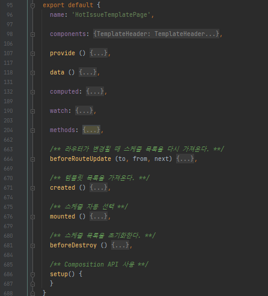

보통 API 관련 로직이나 Store를 다루는 로직은 컨테이너 컴포넌트에서 처리하고, 하위 컴포넌트가 Props나 Custom Event로 처리하도록 만든다.
어쨌든 하나의 컴포넌트가 굉장히 무거워졌다.
기능 자체가 많은 것도 있지만, 이해하기 어려운 로직도 있고 여러모로 잠재적 위험을 가진 컴포넌트가 되어버렸다.

그래서 추후에 **Vue Composition API로 리팩토링** 할 예정이다.
이를 위해 [Composition API](https://composition-api.vuejs.org/)를 개인적으로 학습했는데, 이건 [Composition API 학습 섹션](#_3-composition-api-학습)에서 상세히 다루도록 하겠다.

### 2. 신규 프로젝트

이것도 대외비라서 어떤 프로젝트인지 구체적으로 언급하긴 어렵지만,
핵심적인 내용은 **크롬 브라우저(혹은 최신 브라우저)를 전용으로 서비스하는 프로젝트**를 담당하여 진행중이다.

올 해의 마지막 프로젝트이며 입사 이후에 처음으로 신규 서비스를 처음부터 만드는 것이기 때문에 무척 재밌다.
이 프로젝트도 서비스가 런칭 되면 자세히 다뤄야겠다.

## 사적

회고 할게 있을까 싶었는데 제목을 나열하고 보니 뭘 이리 많이 했나 싶다.
~~하.. 11월 회고는 편하게 쓸 수 있을 것 같았는데!!~~

### 1. 넥스트 스텝 리뷰어

이번 달에는 [NextStep - TDD, Clean Code with Java 10기](https://edu.nextstep.camp/s/MNii0Puk) 리뷰어로 활동했다.
다음 달까지 활동할 예정이다.

***

#### (1) 미션당 7명

기존에는 미션당 5명, 총 미션이 4개라서 최대 20명을 리뷰하는 방식이었다. 그런데 이번 기수에는 굉장히 많은 사람들(최대 28명)을 리뷰하게 되었다.
> 포비(박재성님)와 슬랙으로 주고 받은 DM을 캡쳐하려고 했는데.. 무료 슬랙이라 그런지 메세지가 사라졌다 😇

10기 리뷰어 신청 과정에서 미션당 원하는 리뷰이의 수를 적는 항목이 있었다.
이 때는 아무 생각 없이(?) 자신만만하게 **인원 무관**이라고 적었다.
그리고 포비가 **미션당 7명을 배정할 예정이며 상관 없냐고 물었고** 나는 괜찮다고 했다 ~~(반성해라 과거의 나)~~.

**결과적으로, 미션이 시작되고 나서야 괜찮지 않은 것을 알게 되었다.**

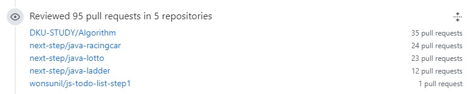

말 그대로 PR이 쏟아져나왔다 😂😂😂😂

이번 달에 NextStep과 관련 PR 갯수만 60개인데, 대체로 **한 PR 당 2번 이상의 리뷰**를 하기 때문에 대략 하루에 3~4번의 리뷰를 했다고 볼 수 있다.
알고보니 이번에 넥스트스텝과 카카오가 연계하여 **카카오 리뷰어 양성 과정**을 진행 중이었고 이에 해당하는 사람들이 이번 기수에 참여했다.
그래서 **뭔가 코드에서 심상치 않은 기운이 느껴진다 싶으면 대체로 카카오 사람들**이었다.


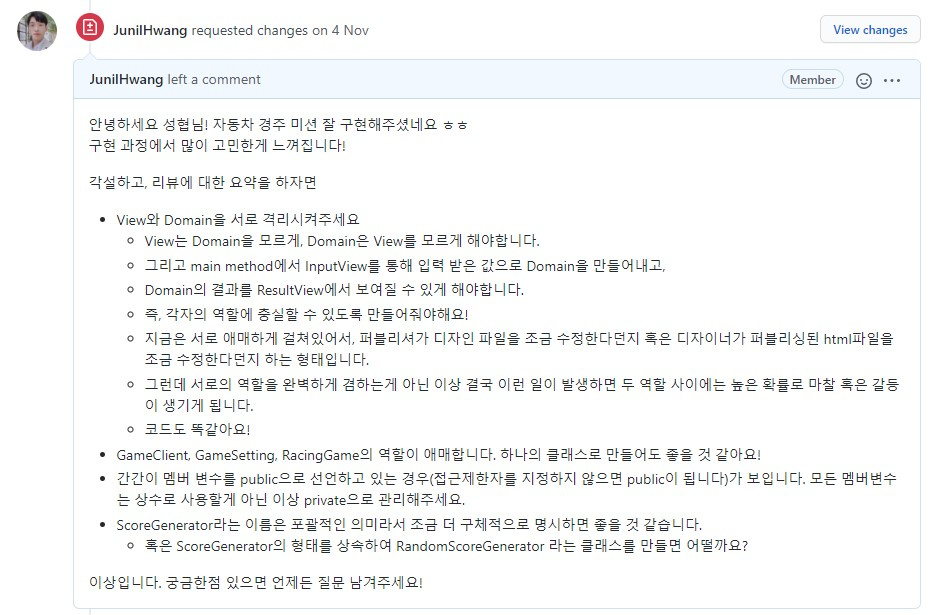

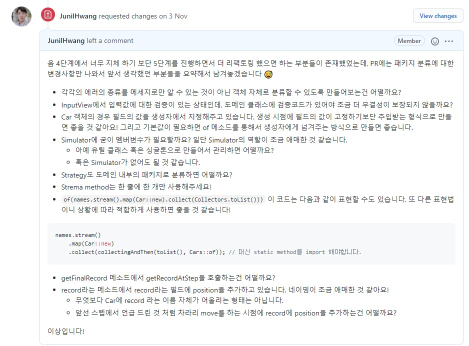

리뷰는 대체로 위와 같이 남겼다.
각각의 코드에 대해 리뷰를 하고, 마지막으로 핵심적인 내용을 정리해서 중점적으로 개선해야 하는 부분들을 피드백했다.
설계적으로 큰 문제가 없으면 바로 머지했고, 문법적으로 개선이 필요한 것들은 다음 스텝에서 진행하도록 유도했다.

***

#### (2) 나의 한계

내가 가진 현재 역량의 한계를 일깨워준 리뷰이가 있었다.

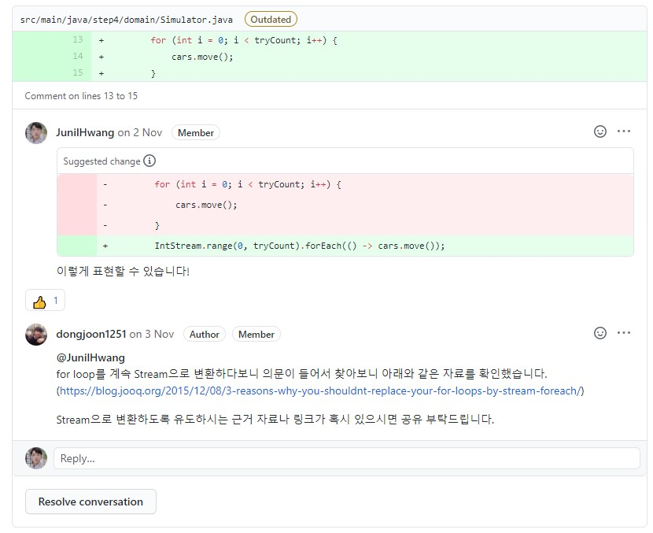

내가 남기는 피드백의 반절 이상은 뚜렷한 근거를 기반으로 하기 보단 **경험적인 측면**을 토대로 남기는 것들이 대부분이었다.
그래서 이렇게 근거를 토대로 질문을 남기면 당황스러웠다.
현재의 나는 남들은 다 한 번씩 읽어 본다는 `Clean Code`나 `Effective Java`도 안 읽어본 상태였기 때문에 명확한 근거 같은게 생각날 수가 없었다. 

그래서 또 이것 저것 자료를 찾아보다가 결국 답이 나오질 않아서 _내가 어쩌다 이런 생각을 했는지 다시 경험적인 측면을 토대로 리뷰를 남기게 된다._

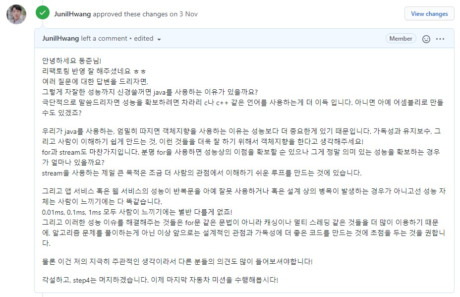

덕분에 슬랙채널에서 여러가지 논쟁이 오고 갔으며,
**Stream은 어차피 사다리 미션에서 다루기 때문에 지금의 논쟁은 큰 의미가 없으며 자동차 미션 자체에 집중 하자**는 이야기로 마무리 되었다. 
무엇보다 제일 큰 문제는 리뷰이의 **신뢰를 잃어버렸다**고 해야할까?

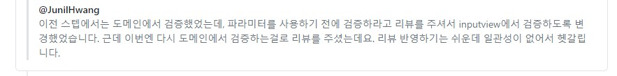

내가 정말 리뷰이가 말한 것 처럼 남겼나 확인해본 결과 **리뷰이가 피드백을 잘못 해석했고(혹은 내가 제대로 전달을 하지 못했거나 😂)** 다시 잘 설명드렸다.

이러한 과정을 통해서 스스로의 한계와 문제점을 발견했고, 이를 극복하기 위한 재정비 기간이 필요하다는 것을 깨달았다.
그래서 다음 리뷰어 활동은 접어두고 스스로의 역량 강화에 집중할 예정이다.

***

#### (3) 블랙커피 스터디의 연장

9월에 블랙커피 스터디에 참여했던 사람들에게 이 코스를 추천 했고, 세 분이 이번 기수에 신청했다.
세 분 모두 잘 완주하길 기대중이다.

다음엔 누굴 꼬드겨야하나 🤔

***

### 2. 단쿠키 리쿠르트 지원

::: tip 단쿠키

[단쿠키](https://www.dankookie.com/)는 나의 모교인 단국대학교 커뮤니티 사이트이다.
[에브리타임](https://everytime.kr/)이 등장하기 전까진 굉장히 활성화된 커뮤니티였는데, _에브리타임 덕분에 이용자수가 대폭 감소했다._

:::

나는 **에브리타임**이라는 대학교 커뮤니티를 자주 사용하는 편이다.
개발과 관련된 정보를 공유하기도 하고, 진로에 대해 고민하는 후배들과 이야기를 나누는 등의 소통 창구로 사용하고 있다.

그러던 중 눈에 띄는 글을 하나 발견했다.
> 글을 캡쳐해서 올릴라 했는데.. 지금 찾아보니 삭제됐다. 아쉬운대로 단쿠키에 올라온 글을 캡쳐해서 올려야겠다.

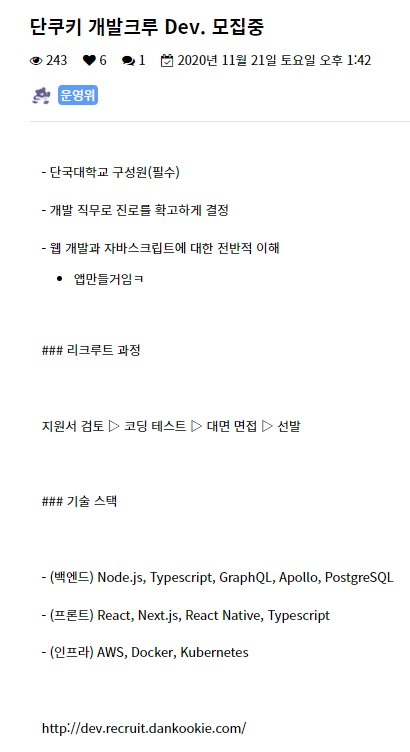

보자마자 지원하고 싶다는 생각을 했다.
그런데 나는 졸업생이다보니 이걸 지원해야하나 말아야하나 고민하다가 졸업생도 지원 가능한지 물어보는 댓글을 남겼고, 가능하다는 답변을 받았다.

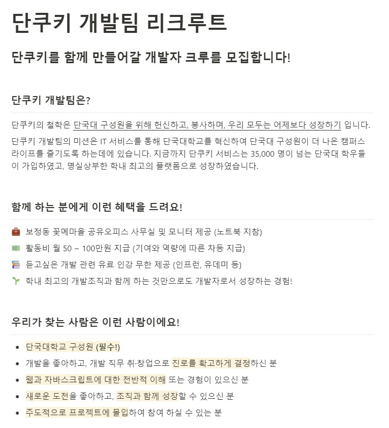

그래서 고민 끝에 지원했다.

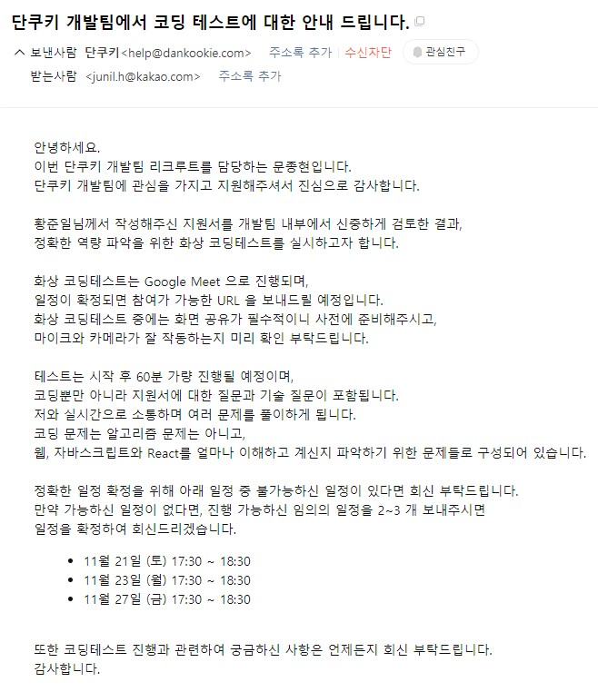

이렇게 코딩 테스트 및 온라인 면접 일정을 잡고 진행했다.
코딩 테스트 문제 자체는 어렵지 않았으나, 내가 너무 어렵게 생각해서 조금 헤맸다.

이 외에도 다양한 면접 질문을 받았는데 내가 생각하지도 못했던 부분들이 있어서 조금 당황했다.
_당황했던 질문들은 대체로 보안과 관련된 질문이었고, 내가 보안과 관련된 도메인에 약하다는 것을 인지했다._
덕분에 공부할 것들이 늘었다 😅

여담으로, 학부시절에 같이 단쿠키측에서 함께 하고 싶은 의향 있으면 연락 달라고 했었는데 그 당시에는 정말 미친듯이 바빠서 아예 연락을 하지 않았다.
당시에 작은 에이전시 회사에서 원격근무도 하고 있었고, 학부 연구생도 하고 있었고, 같은 학부 연구생들과 정부 과제도 하고 있었고, 고등학교 강사도 하고 있었다.
거기에 수업에 시험에 과제에 이것 저것 다 포함하면.. 거기서 무언가를 더 할 엄두가 나질 않았다.

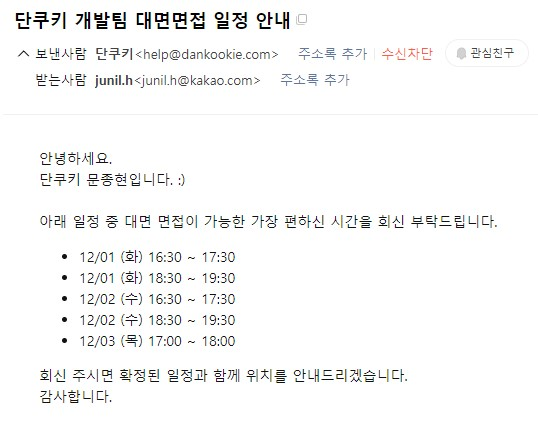

어쨌든 12월에 대면 면접을 거치면 결과를 알 수 있겠지 싶다.
내년엔 또 얼마나 바쁘려나 🤣

***

### 3. Composition API 학습

회사 프로젝트에 [Composition API](https://composition-api.vuejs.org/)를 사용할 일이 생겼다.
아직 **Composition API**를 제대로 사용해본적이 없어서 어떤 방식으로 공부해야 고민하다가,
[Black Coffee Study](https://edu.nextstep.camp/c/L1Ma1gyX/) 할 때 만들었던 **TodoList를 Composition API로** 다시 만들어보자고 생각했다.

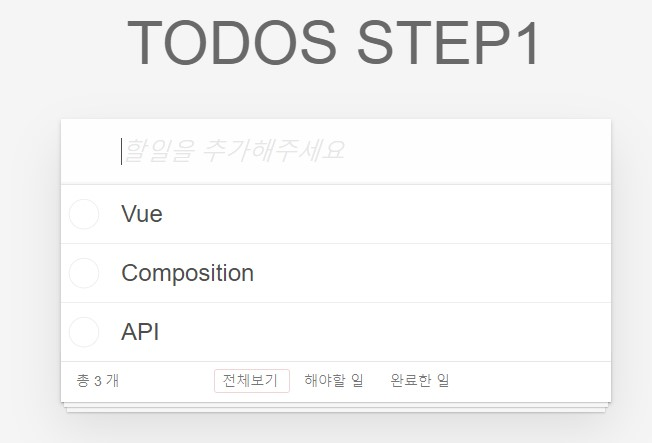

그리고 블랙커피 스터디를 통해서 알게된 [장현석님](https://github.com/devjang)님이 Composition API로 토이 프로젝트를 진행했고 꼭 사용해보길 권했던게 생각났다.
그래서 해당 [토이 프로젝트(nuxt-realworld)](https://github.com/devJang/nuxt-realworld)를 참고하여 진행 중이다.

지금은 막 시작한 단계로 접어섰기 때문에 [12월 회고](../12-December/#_3-composition-api-학습)에서 더 자세히 다룰 예정이다.

***

### 4. 블랙커피 스터디 레벨 2

[블랙커피 스터디 레벨 1 3기](https://edu.nextstep.camp/s/tUzCRWul)를 9월에 들었고, 이번 달에 [레벨 2](https://edu.nextstep.camp/s/mnUCGXab)가 열렸다.
이번 과정은 Javascript로 Unit Test와 E2E Test를 작성하는 방법에 대해 다루고 있다.

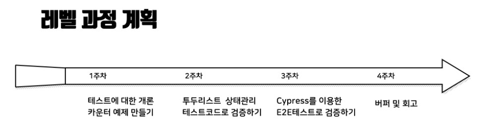

월말에 시작했기 때문에 **1주차 미션** 까지만 완료한 상태이다.
과연.. 이번 과정을 잘 마무리 할 수 있을지 걱정이다.
아무래도 리뷰어 활동과 겹치기 때문에 쉽지 않으리라 생각한다.

미션과 관련된 코드는 [이 저장소](https://github.com/JunilHwang/black-coffee-study-lv2)에 올려놨다.
레벨 1을 할 때 보다 의욕이 많이 사라진 느낌이다.

***

### 5. 블로그 스터디 2기

지난 달에 이어서 [블로그 스터디](https://edu.nextstep.camp/s/4dBdkika)를 참여했다.
이번에는 [넥스트 스텝](https://edu.nextstep.camp)에 정식으로 수강모집을 올려서 그런지 참여하는 사람이 훨씬 많았다.

원래 일정대로면 이번 달에 두 개의 글을 썼어야 했는데, 한 개의 글만 썼다.

- [유년시절 이야기 Part 03](https://junilhwang.github.io/TIL/Writing/01-%EC%9C%A0%EB%85%84%EC%8B%9C%EC%A0%88-%EC%9D%B4%EC%95%BC%EA%B8%B0-3/)

::: tip 유년 시절 이야기 모음
- [Part 01](https://junilhwang.github.io/TIL/Writing/01-%EC%9C%A0%EB%85%84%EC%8B%9C%EC%A0%88-%EC%9D%B4%EC%95%BC%EA%B8%B0-1/)
- [Part 02](https://junilhwang.github.io/TIL/Writing/01-%EC%9C%A0%EB%85%84%EC%8B%9C%EC%A0%88-%EC%9D%B4%EC%95%BC%EA%B8%B0-2/)
- [Part 03](https://junilhwang.github.io/TIL/Writing/01-%EC%9C%A0%EB%85%84%EC%8B%9C%EC%A0%88-%EC%9D%B4%EC%95%BC%EA%B8%B0-3/)
:::

해당 글을 작성하면서 2012년도에 공부했던 것들을 다시 들여다봤다. 그 때는 잘 만들었다 싶었는데 역시 과거의 코드는 보는 게 아니다. ~~나는 똥을 만들었다.~~
2012년도에 [전국대회](https://meister.hrdkorea.or.kr/sub/3/3/1/20160512111525375100_view.do)를 준비하면서 만든 [결과물 코드](https://github.com/JunilHwang/webskills-2012-national-furniture)이다.
자세한 내용은 앞서 소개한 링크를 타고 들어가면 볼 수 있다.

사실 아직 작성하지 않은 **Part 04**가 개발과 동떨어진 정말 진지한 나의 이야기일 것 같은데, 언제 쯤 작성할 수 있을지 모르겠다. ~~사실 쓰기 귀찮다.~~

이번에는 인상 깊었던 글들을 소개하기보단 그냥 [PR 링크](https://github.com/next-step/blog/pull/55)만 달아놓겠다.
사실 글을 읽을 여유도 거의 없었다..

***

### 6. 기능대회용 PHP Tutorial

기능대회 전용으로 [PHP Step By Step Tutorial](https://github.com/sdhs-webskills/php-architecture-step-by-step)을 만들었다.
데모는 [이 링크](https://stormy-coast-06452.herokuapp.com/)에서 확인할 수 있으며 따로 문서는 없고 코드만 작성해놓은 상태이다.

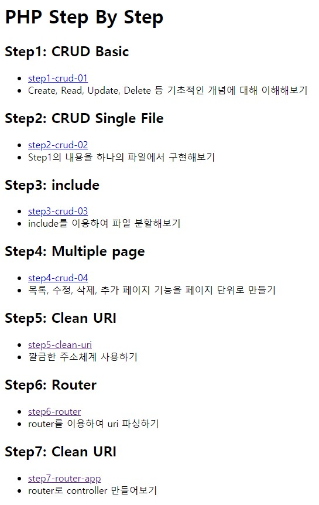

요즘에 PHP를 하다 보면 내가 PHP라는 언어를 다뤄봤다는게 낯설다.
옛날에는 Server-side 언어로 할줄 아는거라곤 PHP 밖에 없었는데 언제 이렇게 낯설어진걸까?

이 튜토리얼을 작성하면서 [heroku](https://dashboard.heroku.com/)를 처음 사용해봤다.
그리고 [Getting Started on Heroku with PHP](https://devcenter.heroku.com/articles/getting-started-with-php)를 따라해보면서 [composer](https://getcomposer.org/doc/00-intro.md)를 처음 사용해봤다.

이제 [PHP 8.0](https://www.php.net/releases/8.0/en.php)이 나오면서 한 층 더 성숙해진 언어가 된 것 같다.
여유 있을 때(대체 언제?) [Laravel](https://laravel.com/)로 토이 프로젝트를 진행해봐도 괜찮을 것 같다.

***

이대로 마무리하기는 아쉬워서 마지막 스텝에서 작성한 `Router`에 대해 소개해본다.
[express.js](https://expressjs.com/ko/)의 [router](https://expressjs.com/ko/starter/basic-routing.html)를 따라해보려고 했는데 URI Pattern을 파싱하고 매칭시키는게 귀찮아서 그냥 정규식으로 처리했다.

```php

namespace src\core;

class Router {
    private array $routes = [];
    private String $requestUri;

    function __construct($baseUri) {
        $path = preg_replace("/\?.+/", "", $_SERVER['REQUEST_URI'] ?? "/");
        $this->requestUri = str_replace($baseUri, "", $path);
    }

    public function get($uri, $callback) { $this->routes[] = ["get", $uri, $callback]; }
    public function post($uri, $callback) { $this->routes[] = ["post", $uri, $callback]; }
    public function delete($uri, $callback) { $this->routes[] = ["delete", $uri, $callback]; }
    public function put($uri, $callback) { $this->routes[] = ["put", $uri, $callback]; }

    public function run() {
        $routes = array_reduce($this->routes, function ($routes, $route) {
            [$method, $uri, $callback] = $route;
            $uri = '/^'. str_replace("/", "\/", $uri) .'$/';

            if (
                $method !== strtolower($_SERVER['REQUEST_METHOD']) ||
                !preg_match($uri, $this->requestUri)
            ) return $routes;

            preg_match_all($uri, $this->requestUri, $params, 2, 0);
            $routes[] = [$callback, $params[0]];

            return $routes;
        }, []);

        if (count($routes) === 0) {
            echo 'Not Found ' . $this->requestUri;
            return;
        }
        [$callback, $params] = current($routes);
        $callback($params);
    }
}
```

위의 코드는 다음과 같이 사용할 수 있다.

```php
class UserController {
    private Router $router;
    function __construct(Router $router) {
        $router->get('/api/users', fn($params) => $this->getUsers($params));
        $router->get('/api/user/([0-9]+)', fn($params) => $this->getUser($params));
        $router->get('/api/user', fn($params) => $this->getUserByEmail($params));
        $router->post('/api/user', fn($params) => $this->setUser($params));
    }
    private function getUsers($params) {}
    private function getUser($params) {}
    private function getUserByEmail($params) {}
    private function setUser($params) {}
}

$router = new Router(BASE_URI);
$router->get('/', function ($param) {
    include_once(VIEW . '/main.php');
});

new UserController($router);
$router->run();
```

다만 `PUT`과 `DELETE` method의 경우 `$_GET`, `$_POST` 처럼 읽어올 수 없기 때문에 귀찮아서 생략했다. ~~이정도만 있어도 하드코딩 하는데 큰 문제는 없겠지?~~

***

국제대회 금메달을 받았고 지금은 카카오에서 근무중인 친구와 함께 위키를 조금씩 만들다가 현타가 와서 포기했었는데,
그 당시에 만들었던 자료도 같이 첨부한다.

- [기능경기대회 Wiki](https://github.com/ChoDragon9/skills/wiki)
- [MySQL 기본 CRUD 명령어](https://github.com/ChoDragon9/skills/wiki/MySQL-%EA%B8%B0%EB%B3%B8-CRUD-%EB%AA%85%EB%A0%B9%EC%96%B4)
- [PHP+MySQL CRUD Tutorial](https://github.com/ChoDragon9/skills/wiki/PHP-MySQL-CRUD-Tutorial)
- PHP MySQL로 게시판 만들기 without MVC
  - Part 01
    - [문서](https://github.com/ChoDragon9/skills/wiki/PHP-MySQL%EB%A1%9C-%EA%B2%8C%EC%8B%9C%ED%8C%90-%EB%A7%8C%EB%93%A4%EA%B8%B0-without-mvc-01)
    - [유튜브 영상](https://www.youtube.com/watch?v=lv5mxcGXnaU)
  - Part 02
    - [문서](https://github.com/ChoDragon9/skills/wiki/PHP-MySQL%EB%A1%9C-%EA%B2%8C%EC%8B%9C%ED%8C%90-%EB%A7%8C%EB%93%A4%EA%B8%B0-without-mvc-02)
    - [유튜브 영상](https://www.youtube.com/watch?v=t0Q9U2VS0gQ)

이제보니 `PHP 게시판` 이라는 키워드로 유튜브에 검색하면 내가 올린 동영상이 첫 번째로 나온다. 뭐지..? 이제와서..?

***

### 7. 모각코

어쩌다보니 10월에 참여했던 [프로그래머스 리액트 스터디](http://localhost:8080/TIL/Review/2020-year/10-October/#_1-%E1%84%91%E1%85%B3%E1%84%85%E1%85%A9%E1%84%80%E1%85%B3%E1%84%85%E1%85%A2%E1%84%86%E1%85%A5%E1%84%89%E1%85%B3-%E1%84%85%E1%85%B5%E1%84%8B%E1%85%A2%E1%86%A8%E1%84%90%E1%85%B3-%E1%84%89%E1%85%B3%E1%84%90%E1%85%A5%E1%84%83%E1%85%B5)의 몇몇 스터디원과 `모각코(모여서 각자 코딩)`을 하기로 했다.

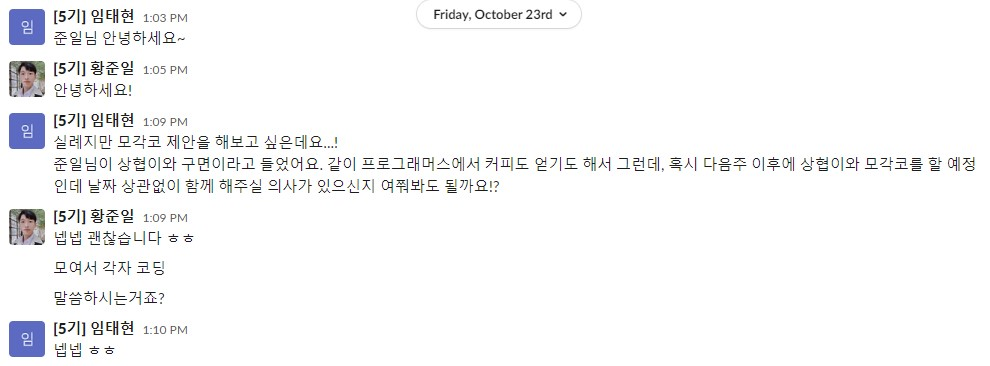

이렇게 먼저 제안을 주셨고, 둘 다 성남에 살다보니 첫 주에는 우리 집 근처에서 보기로 했다.

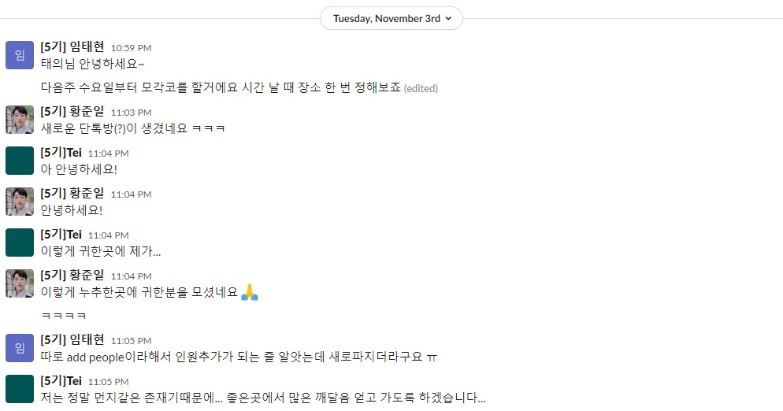

그 다음 모임에는 한 분이 더 껴서 만났다.

태의님과 태현님은 [부스트캠프](https://boostcamp.connect.or.kr/)를 통해서 이미 서로 알고 있던 사이라고 했다.
태의님의 경우 10월 말에 [부스트캠프 옥토버페스트](https://m.blog.naver.com/boostcamp_official/222140296542)에서 **나와 똑같은 주제(나와 찰떡인 회사)로 발표**했었다.

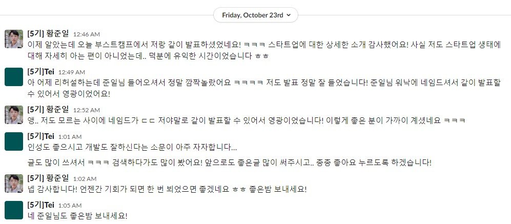

이 때 언젠가 기회가 되면 뵈었으면 좋겠다고 말했었는데, 실제로 뵙게 되니까 반가웠다.
태의님과 태현님 두 분 모두 정말 좋은 분들이고, 열심히 공부하고 살아가는 분들이라서 유독 반가웠다.
이러한 인연을 맺게 해준 [프로그래머스 리액트 스터디](https://programmers.co.kr/learn/courses/10658)에 다시 한 번 감사를 전한다.

그러나 갑자기 코로나 확진자가 많아지면서 모각코는 3회만 진행되었다. 빨리 코로나가 잠잠해지길 바랄 뿐이다 😂

***

### 8. 네이버 아폴로 면접

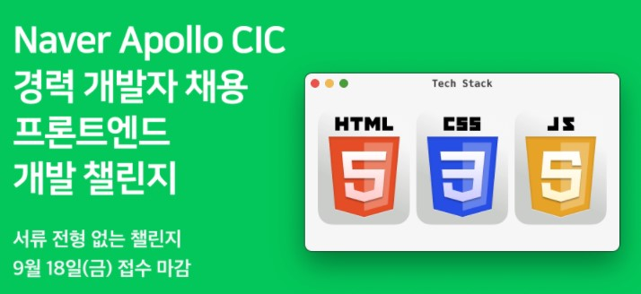

9월에 프로그래머스 네이버 아폴로 챌린지에 접수했고, 알고리즘 테스트와 프론트엔드 과제 테스트를 진행했다.
그런데 생각보다 결과가 잘 나왔다.

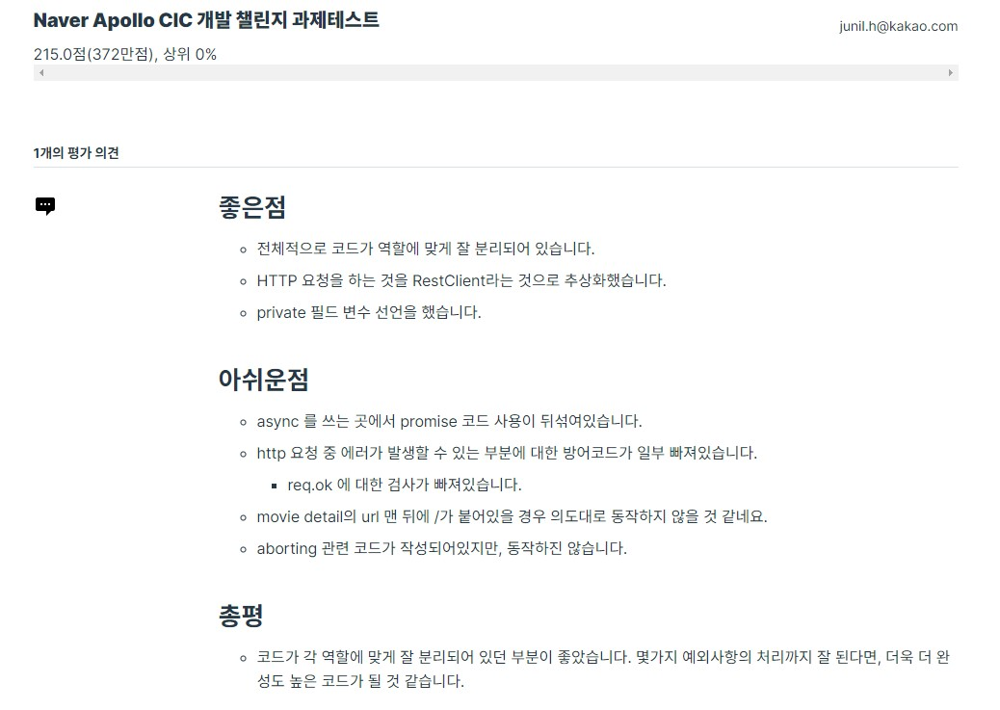

이어서 11월 중에 1차 면접을 진행했는데, 이것 저것 하는게 많다보니 너무 바빠서 면접 준비를 아예 하질 못했다.
그나마 살펴본게 `이벤트 루프` 부분인데 이게 딱 면접 질문으로 나왔다.

::: tip 이벤트 루프

여기서 설명하긴 귀찮아서 링크로 대체하겠다.

- [Toast Meetup - 자바스크립트와 이벤트 루프](https://meetup.toast.com/posts/89)
- [Velog - Event Loop (이벤트 루프)](https://velog.io/@thms200/Event-Loop-%EC%9D%B4%EB%B2%A4%ED%8A%B8-%EB%A3%A8%ED%94%84)
- [Zerocho - 호출 스택과 이벤트루프](https://www.zerocho.com/category/JavaScript/post/597f34bbb428530018e8e6e2)
- [MDN - 동시성 모델과 이벤트 루프](https://developer.mozilla.org/ko/docs/Web/JavaScript/EventLoop)
- [자바스크립트는 어떻게 작동하는가: 이벤트 루프와 비동기 프로그래밍의 부상, async/await을 이용한 코딩 팁 다섯 가지](https://engineering.huiseoul.com/%EC%9E%90%EB%B0%94%EC%8A%A4%ED%81%AC%EB%A6%BD%ED%8A%B8%EB%8A%94-%EC%96%B4%EB%96%BB%EA%B2%8C-%EC%9E%91%EB%8F%99%ED%95%98%EB%8A%94%EA%B0%80-%EC%9D%B4%EB%B2%A4%ED%8A%B8-%EB%A3%A8%ED%94%84%EC%99%80-%EB%B9%84%EB%8F%99%EA%B8%B0-%ED%94%84%EB%A1%9C%EA%B7%B8%EB%9E%98%EB%B0%8D%EC%9D%98-%EB%B6%80%EC%83%81-async-await%EC%9D%84-%EC%9D%B4%EC%9A%A9%ED%95%9C-%EC%BD%94%EB%94%A9-%ED%8C%81-%EB%8B%A4%EC%84%AF-%EA%B0%80%EC%A7%80-df65ffb4e7e)
- [Javascript.info - 이벤트 루프와 매크로·마이크로태스크](https://ko.javascript.info/event-loop)

:::

카카오 면접을 준비했던 경험 때문인지 생각보다 잘 진행되었다.
모르는 부분은 모른다고 답했고, 아는 것들은 최대한 상세하게 설명했다.
혹은 자세하게 이해하진 못하지만 이러저러하게 추측할 수 있을 것 같다는 식으로 설명한 부분도 있었다.
대체로 매우 솔직하게 답변한 것 같다.

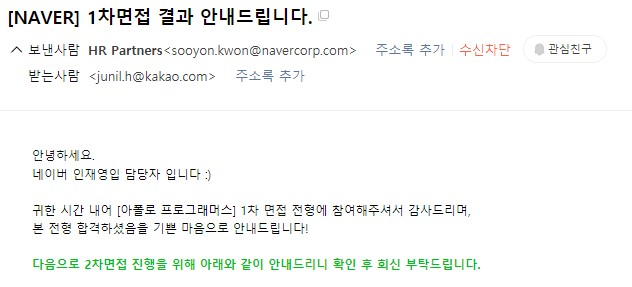

느낌적인 느낌이 맞았는지(?) 1차 면접은 통과했다.

***

이어서 2차 면접을 진행했는데, 2차 면접은 인성면접과 조금 더 심화적인 기술면접으로 진행되었다.
면접 질문에서 지원동기나 지원한 조직에 대해 얼만큼 알고 있는지에 물어보는 질문이 어려웠다. 사실 아폴로에 관심이 있어서 지원했다기 보단, 아폴로 챌린지 때문에 지원한 이유가 더 크기 때문이다.
그래서 지원동기를 정말 솔직하게 말하기가 어려웠고, 이러한 이유 때문에 2차 면접은 반 쯤 포기하고 봤다.
면접관 분들께 죄송한 마음만 한 가득이다.
그래도 언젠간 제대로 이직을 준비하는 순간을 위한 경험이랄까?
지금은 현재 회사에 머무르고 싶은 마음이 훨씬 크다.

무엇보다 면접관 한 분이 해준 말씀이 계속 기억에 남는다.

**"정말로 현재 회사에서 최선을 다했다고 말할 수 있을 만큼 무언가를 해보았는가?"**

아직 이런 경험은 없는 것 같다.
그래서 해보고 싶은 것도 많고, 아직 나는 많이 부족하다고 생각한다.

어쨌든 결과는 12월에 나올 예정이다.

***

### 9. Devears

Spring + React로 사이드 프로젝트를 해보고 싶었는데, 어떤 주제로 할까 고민하다가 현재 [운영중인 스터디](https://dku-study.github.io/)를 관리할 수 있는 사이트를 만들어보기로 했다.
항상 이런 사이드 프로젝트를 진행할 때 **프로젝트 이름**이 고민이었는데, `개발자(Developer)`와 `곰(Bear)`을 합쳐서 `Devears`라고 지었다. 

이번 달에는 Back-end 위주로 작업 했는데 사실 정확히 어떤 기능을 추가할지 정해놓질 않아서 갈팡 질팡 하는 중이다.
현재 까지 구현한 기능은 **Github 로그인**과 **토큰 발급**, 그리고 **로그아웃**이 전부이다. ~~안 한 것과 다름 없다~~

사이드 프로젝트 코드는 [여기](https://github.com/DKU-STUDY/Devears)에서 확인할 수 있다.

***

## Summary

- CMS 프로젝트를 마무리 했다.
- 신규 프로젝트를 시작했다.
- 넥스트 스텝 리뷰어로 활동했다. 너무 힘들다.
- 단쿠키 리쿠르트에 지원했다. 아직 대면 면접이 남았다.
- 블랙 커피 스터디 레벨 2를 진행했고, 첫 번째 미션까지 마무리 했다.
- 10월에 이어서 블로그 스터디를 신청했고, 현재 까지 한 개의 글만 작성했다.
- 기능대회 때문에 오랜만에 PHP 코드를 작성했다.
- Heroku와 Composer를 처음으로 사용해봤다.
- 프로그래머스 리액트 스터디를 했던 사람들과 모각코를 했다.
- 네이버 아폴로 면접을 봤다.
- 새로운 사이드 프로젝트를 시작했다.

그리고 본문에 언급하진 않았지만
- 단국대 개발자 스터디의 첫 회식이 있었다. 와인 파티!
- 오랜만에 대회 출신 친구/후배들과 모여서 이야기를 나눴다.
- 포동이 팬클럽(?)을 초대했다.

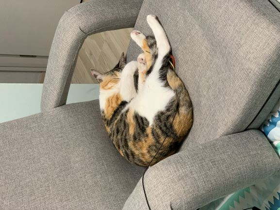

마지막은 주인님 사진으로 마무리!