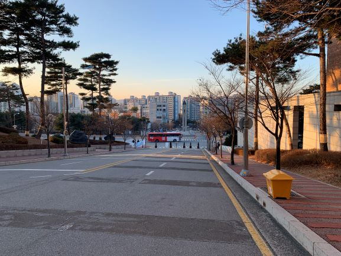
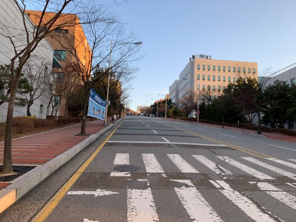
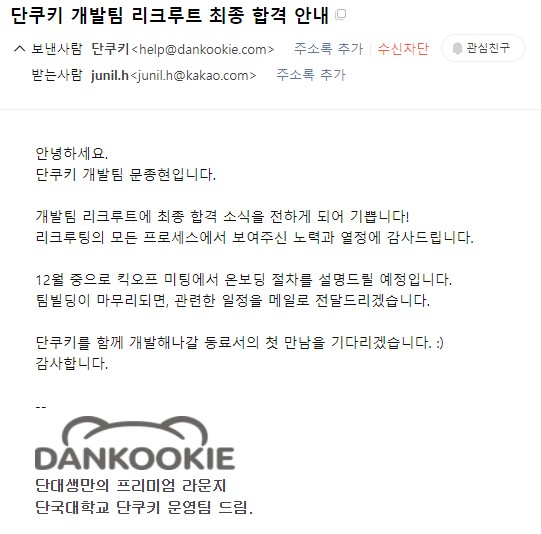

---

title: 2020년 12월 회고
description: 개발자 황준일의 2020년 12월 회고입니다.
sidebarDepth: 2
date: 2020-12-30 18:00:00

---

# 2020년 12월 회고

벌써 올 해의 마지막 월 회고를 쓰게 되었다.
아.. 2020년 회고는 언제 써야하나.. 불행인지 다행인지 쓸 내용이 너무 많다 😂

## 공적

이번 달에는 무언가 새로운걸 만들기 보다는 기존에 있는 것들을 개선하는 작업 위주로 진행했다.

### 1. Composition API로 리팩토링

[11월 회고](../11-November/)에서 [Composition API](https://composition-api.vuejs.org/)에 대해 언급했었는데,
그렇게 학습을 어느 정도 마무리 하고 사내 프로젝트에 적용했다.

기존에는 위와 같은 형태의 코드였는데, 리팩토링 작업 후에는

이렇게 간소화됐다. 각각의 로직을 `useMenus`, `useSchedule`, `useTemplateItem`, `usePreview` 처럼 **카테고리별로 묶어서** 유지보수 할 수 있게 작업했다.
다만 아쉬운 점은 변수와 메소드를 구분할 수 있는 방법이 이름 밖에 없다는 점과 직접 만든 mapper 라이브러리의 경우 IDE 추적을 지원하지 않는 다는 점이다.

지난 회고에서도 언급했지만, Vuex에 Composition API 전용의 유틸성 라이브러리가 추가 되길 기도할 뿐이다.. 😇

::: tip 작성 규칙

Compositino API를 사용하면서 여러가지 나만의 규칙을 만들었는데, 추후에 제대로 정리해서 공유할 생각이다. **회고에서 다루기에는 양이 너무 많다.**

:::

어느정도 리팩토링을 하긴 했지만, 그래도 많이 부족하다. 틈틈이 시간날 때 마다 해야겠다.

***

### 2. 마지막 프로젝트

벌써 2020년의 마지막 프로젝트를 진행했다. [11월 회고](../11-November/)에도 언급했던 **크롬 브라우저 전용 서비스**이다. 두 달동안 빠르게 거의 프로토타입 형태로 빠르게 만들었고, 월말에 사용자단에 노출될 예정이다.
그러나 아직 정식으로 공개된 서비스가 아니라서 자세한 내용을 언급하긴 어렵다.

기술스택정도만 언급해보자면,

- Java
- spring boot
- Node.js
- Vue.js
- SPA + CSR + SSR

등을 사용했다.
아마 [이 링크](https://zuminternet.github.io/ZUM-Mobile-NodeJS/)에 나온 내용과 겹치는 부분이 많을 것이다.

흠.. 무언가 더 많은 내용을 쓰고 싶지만.. 여기까지만!

***

### 3. 떠나가는 팀원들

업무적인 내용은 아니지만, 이번 달에만 팀원 두 분이 이직한다.

한 분은 [카카오 모빌리티](https://www.kakaomobility.com/)에 프론트엔드 파트로, 다른 한 분은 [토스 페이먼츠](https://www.tosspayments.com/)로 가신다.
올 해에만 **여섯 분이 이직**을 하셨고 **새로 들어온 사람은 한 명**이다. ~~드디어 막내 탈출!~~

이번에 새로 들어온 사람은 사실 **내가 추천해서 들어온 대학교 후배**다.
같은 팀에 친한 사람이 들어와서 즐겁다 😁

내년에는 과연 얼마나 많은 분들이 떠나고, 또 새로 들어올까? 기대 반, 걱정 반.. 사실 걱정이 한 80%정도 되는 것 같다.

***

## 사적

이번 달에는 뭘 했나 싶었는데.. 제목을 나열하고 보니 뭘 또 이리 많이 했나 싶다. 빈수레가 요란하다더니 😅

### 1. NextStep 리뷰어 활동

지난 달에 이어서 [TDD, Clean Code with Java 10기](https://edu.nextstep.camp/s/MNii0Puk)의 리뷰어로 활동했다.
**12월 23일**까지였는데, 과정이 종료된 이후에도 포기하지 않고 끝까지 미션을 수행하신 분이 계셔서 **12월 29일**에 비로소 리뷰어 활동을 완전히 끝낼 수 있었다.

그래도 이번 달에는 어느 정도 난이도가 있는 미션들을 수행하는 사람들만 남아서 리뷰 요청이 많이 오진 않았다.
**저번 달에 60개의 Pull Request**가 올라온 반면에, **이번 달에는 20개의 Pull Request**가 올라왔다.
1/3로 줄어든 것이다.

그리고 **블랙커피 스터디**를 함께 했던 사람들에게 이 과정을 소개해주었고,
몇 분이 이번 기수에 신청해서 참여했다.
그리고 쉽지 않은 여정임에도 불구하고 모든 미션을 잘 마무리 해주셨다.

한솔님의 경우 사다리 미션을 나와 함께 진행했고,

종완님의 경우 마지막 미션인 볼링 미션을 나와 함께 진행했다.

음.. 좋은 피드백을 많이 남기진 못한 것 같아서 조금 죄송스럽다.
이번 기수에는 내가 너무 힘들었다.

리뷰를 워낙 많이 하기도 했고, 스스로의 역량이 부족하다는 점도 많이 느꼈다.
_그래서 다음 기수에는 리뷰어로 활동하지 않고 스스로의 역량 강화에 집중할 예정이다._

***

### 2. 단쿠키 개발팀 합류

12월 초에 대면 면접을 진행했다. 면접 장소는 학교 근처였는데 오랜만에 학교 구경좀 하려고 아침 일찍 갔다.

교내에 있는 세미나실에서 근무시간 동안 일도 하고, 오랜만에 학교 근처 맛집에서 점심도 먹었다.
그토록 졸업하고 싶었고, 벗어나고 싶었던 곳인데 그래도 학교 다닐 때가 지금 보단 더 마음 편하고 즐거웠던 것 같다.

어쨌든 그렇게 근무 시간이 끝나고 대면 면접을 진행했다.
면접 분위기는 무척 좋았고, 단쿠키라는 서비스에 대한 여러가지 사정을 들을 수 있었다.
여태까지 학생 신분으로 보상도 없이 서비스를 유지하느라 많이 힘들었던 것 같고,
운영진이 얼마나 이 서비스에 애정을 가지고 있는지 느껴졌다.

이렇게 나도 단쿠키 개발팀에 합류하게 되었다.
일정이 조금 촉박한 것 같아서 걱정이지만 **걱정보단 기대가 더 앞선다.**

그렇게 월말이 되었고 다시 단쿠키에서 메일이 왔다.
슬랙 채널을 통해 커뮤니케이션이 진행되는 것 같다.

개발팀 인원은 대략 8명정도 되는 것 같은데, 아마 회의를 하게 되면 제대로 알게 되겠지 싶다.

***

### 3. Composition API 학습

### 4. 블랙커피 스터디 레벨 2

### 5. 블로그 스터디 2기

### 6. 2021년 계획 세우기

### 7. 독서

### 8. 온라인 강의 제작

### 9. Devears

### 10. 아이패드와 아이폰 구매

## Summary