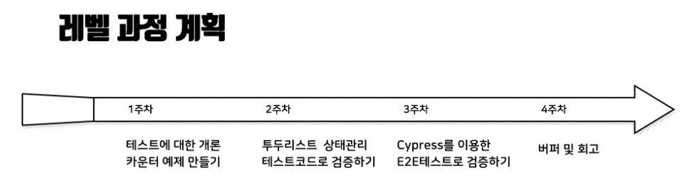

---

title: 2020년 12월 회고
description: 개발자 황준일의 2020년 12월 회고입니다.
sidebarDepth: 2
date: 2020-12-30 18:20:00

---

# 2020년 12월 회고

벌써 올 해의 마지막 월 회고를 쓰게 되었다.
아.. 2020년 회고는 언제 써야하나.. 불행인지 다행인지 쓸 내용이 너무 많다 😂

## 공적

이번 달에는 무언가 새로운걸 만들기 보다는 기존에 있는 것들을 개선하는 작업 위주로 진행했다.

### 1. Composition API로 리팩토링

[11월 회고](../11-November/)에서 [Composition API](https://composition-api.vuejs.org/)에 대해 언급했었는데,
그렇게 학습을 어느 정도 마무리 하고 사내 프로젝트에 적용했다.


기존에는 위와 같은 형태의 코드였는데, 리팩토링 작업 후에는


이렇게 간소화됐다. 각각의 로직을 `useMenus`, `useSchedule`, `useTemplateItem`, `usePreview` 처럼 **카테고리별로 묶어서** 유지보수 할 수 있게 작업했다.
다만 아쉬운 점은 변수와 메소드를 구분할 수 있는 방법이 이름 밖에 없다는 점과 직접 만든 mapper 라이브러리의 경우 IDE 추적을 지원하지 않는 다는 점이다.

Vuex에 **Composition API 전용의 유틸성 라이브러리가 추가 되길** 기도할 뿐이다.. 😇

::: tip 작성 규칙

Compositino API를 사용하면서 여러가지 나만의 규칙을 만들었는데, 추후에 제대로 정리해서 공유할 생각이다. **회고에서 다루기에는 양이 너무 많다.**

:::

어느정도 리팩토링을 하긴 했지만, 그래도 많이 부족하다. 틈틈이 시간날 때 마다 해야겠다.

***

### 2. 마지막 프로젝트

벌써 2020년의 마지막 프로젝트를 진행했다. [11월 회고](../11-November/)에도 언급했던 **크롬 브라우저 전용 서비스**이다. 두 달동안 빠르게 거의 프로토타입 형태로 빠르게 만들었고, 월말에 사용자단에 노출될 예정이다.
그러나 아직 정식으로 공개된 서비스가 아니라서 자세한 내용을 언급하긴 어렵다.

기술스택정도만 언급해보자면,

- Java
- spring boot
- Node.js
- Vue.js
- SPA + CSR + SSR

등을 사용했다.
아마 [이 링크](https://zuminternet.github.io/ZUM-Mobile-NodeJS/)에 나온 내용과 겹치는 부분이 많을 것이다.

흠.. 무언가 더 많은 내용을 쓰고 싶지만.. 여기까지만!

***

### 3. 떠나가는 팀원들

업무적인 내용은 아니지만, 이번 달에만 팀원 두 분이 이직한다.


한 분은 [카카오 모빌리티](https://www.kakaomobility.com/)에 프론트엔드 파트로, 다른 한 분은 [토스 페이먼츠](https://www.tosspayments.com/)로 가신다.
올 해에만 **여섯 분이 이직**을 하셨고 **새로 들어온 사람은 한 명**이다. ~~드디어 막내 탈출!~~


이번에 새로 들어온 사람은 사실 **내가 추천해서 들어온 대학교 후배**다.
같은 팀에 친한 사람이 들어와서 즐겁다 😁

내년에는 과연 얼마나 많은 분들이 떠나고, 또 새로 들어올까? 기대 반, 걱정 반.. 사실 걱정이 한 80%정도 되는 것 같다.

***

### 4. 사내 게임 대회

어쩌다보니 사내 게임대회(카트라이더 러쉬 플러스)에 출전하게 되었다.
각 팀마다 의무적으로 한 명이상 출전해야 하는데, 우리 팀은 아무도 지원하지 않아서 팀 합류 순서로 오름차순하여 출전했다.

**우승 상품은 닌텐도 스위치, 준우승 상품은 에어팟 프로였다.**
우여곡절 끝에 준결승까지 갔으나.. _지갑의 차이(?)를 극복하지 못하고 탈락했다._


결승까지 진출했으면 최소 에어팟 프로를 받을 수 있었는데.. ㅠㅠ 너무 아쉽다.

***

## 사적

이번 달에는 뭘 했나 싶었는데.. 제목을 나열하고 보니 뭘 또 이리 많이 했나 싶다. 빈수레가 요란하다더니 😅

### 1. NextStep 리뷰어 활동

지난 달에 이어서 [TDD, Clean Code with Java 10기](https://edu.nextstep.camp/s/MNii0Puk)의 리뷰어로 활동했다.
**12월 23일**까지였는데, 과정이 종료된 이후에도 포기하지 않고 끝까지 미션을 수행하신 분이 계셔서 **12월 29일**에 비로소 리뷰어 활동을 완전히 끝낼 수 있었다.


그래도 이번 달에는 어느 정도 난이도가 있는 미션들을 수행하는 사람들만 남아서 리뷰 요청이 많이 오진 않았다.
**저번 달에 60개의 Pull Request**가 올라온 반면에, **이번 달에는 20개의 Pull Request**가 올라왔다.
1/3로 줄어든 것이다.

그리고 **블랙커피 스터디**를 함께 했던 사람들에게 이 과정을 소개해주었고,
몇 분이 이번 기수에 신청해서 참여했다.
그리고 쉽지 않은 여정임에도 불구하고 모든 미션을 잘 마무리 해주셨다.


한솔님의 경우 사다리 미션을 나와 함께 진행했고,


종완님의 경우 마지막 미션인 볼링 미션을 나와 함께 진행했다.

음.. 좋은 피드백을 많이 남기진 못한 것 같아서 조금 죄송스럽다.
이번 기수에는 내가 너무 힘들었다.


리뷰를 워낙 많이 하기도 했고, 스스로의 역량이 부족하다는 점도 많이 느꼈다.
_그래서 다음 기수에는 리뷰어로 활동하지 않고 스스로의 역량 강화에 집중할 예정이다._

***

### 2. 단쿠키 개발팀 합류

12월 초에 대면 면접을 진행했다. 면접 장소는 학교 근처였는데 오랜만에 학교 구경좀 하려고 아침 일찍 갔다.


교내에 있는 세미나실에서 근무시간 동안 일도 하고, 오랜만에 학교 근처 맛집에서 점심도 먹었다.
그토록 졸업하고 싶었고, 벗어나고 싶었던 곳인데 그래도 학교 다닐 때가 지금 보단 더 마음 편하고 즐거웠던 것 같다.

어쨌든 그렇게 근무 시간이 끝나고 대면 면접을 진행했다.
면접 분위기는 무척 좋았고, 단쿠키라는 서비스에 대한 여러가지 사정을 들을 수 있었다.
여태까지 학생 신분으로 보상도 없이 서비스를 유지하느라 많이 힘들었던 것 같고,
운영진이 얼마나 이 서비스에 애정을 가지고 있는지 느껴졌다.


이렇게 나도 단쿠키 개발팀에 합류하게 되었다.
일정이 조금 촉박한 것 같아서 걱정이지만 **걱정보단 기대가 더 앞선다.**

그렇게 월말이 되었고 다시 단쿠키에서 메일이 왔다.
슬랙 채널을 통해 커뮤니케이션이 진행되는 것 같다.


개발팀 인원은 대략 8명정도 되는 것 같은데, 아마 회의를 하게 되면 제대로 알게 되겠지 싶다.

***

### 3. Composition API 학습

11월에 **Composition API로 TodoList 만들기**를 시작했고, 이번 달 초에 마무리 했다.


Composition API를 사용하면서 느낀 것은 [React Hook](https://ko.reactjs.org/docs/hooks-intro.html)과 굉장히 유사하다는 점이다.
그래서 처음에는 Store 없이 오직 Composition API만 이용해서 전역 상태를 관리하도록 구현했다.

```js
import { reative, toRefs } from "vue";

const useTodo = () => {
  const state = reactive({
    todoItems: []
  });
  
  const addItem = (item) => {
    state.todoItems = [ ...state.todoItems, item ];
  }
  
  return {
    ...toRefs(state),
    addItem
  }
}

const { todoItems, addItem } = useTodo();
addItem("test");
console.log(todoItems); // ["test"];
```

위와 같이 useTodo를 `Composition API`의 `reative` `todRefs` 등을 이용하여 만들었다.

그런데 이러한 방식으로 전역 상태를 관리하면 문제가 발생 가능성이 매우 높다.
이 때 문제점은 `useTodo`가 `함수`라는 것이다.
즉, **여러번 실행**할 수 있다는 것이다.

```js
const todo1 = useTodo();
const todo2 = useTodo();

todo1.addItem("test1");
console.log(todo1.todoItems); // ["test1"];

todo2.addItem("test2");
console.log(todo2.todoItems); // ["test2"];
```

이를 해결하기 위해선 다음과 같은 방식으로 작성하거나

```js
import { reative, toRefs } from "vue";

const state = reactive({
  todoItems: []
});

const addItem = (item) => {
  state.todoItems = [ ...state.todoItems, item ];
}

const useTodo = () => ({ ...toRefs(state), addItem });
export default useTodo;
```

아예 **처음부터 Store(Vuex)를 사용**하는 것이다.

결론적으로 composition api만 이용하여 전역 상태를 관리하는 것은 무척 힘들다.
하고자 한다면 못할 건 없으나.. 굳이 그렇게 해야할까 싶기도 하다.

무엇보다 store(vuex)를 쓰면 좋은 이유 중 하나가 [VueDevtools](https://chrome.google.com/webstore/detail/vuejs-devtools/nhdogjmejiglipccpnnnanhbledajbpd)을 이용하여 mutation이나 dispatch가 실행 한 시점의 데이터를 조회할 수 있다는 점이다.
뿐만아니라 현재의 state도 바로바로 조회할 수 있으니 이를 포기하기란 쉽지 않은 선택이다.


다만 Composition API와 같이 사용할 때 힘든 점은 store에 대한 **유틸성 라이브러리가 없다는 점**이다.
기본적으로 Vuex로 구성한 것들은 `createNamespaceHelper` `mapState` `mapGetters` `mapMutations` `mapActions` 등을 통해 컴포넌트에 쉽게 매핑할 수 있다.
_그러나 Composition API에 Vuex를 매핑하는 라이브러리는 존재하지 않는다._

그래서 이를 **직접 만들어 사용**해야 했다.

```js
import { computed } from "@vue/reactivity";
import { useStore } from "vuex";

export default function useStoreModuleMapper(namespace) {
  const store = useStore();

  const mapState = keys => keys.map(key => computed(() => store.state[namespace][key]));
  const mapMutations = keys => keys.map(key => (...payload) => store.commit(`${namespace}/${key}`, ...payload));
  const mapActions = keys => keys.map(key => (...payload) => store.dispatch(`${namespace}/${key}`, ...payload));
  const mapGetters = keys => keys.map(key => computed(() => store.getters[`${namespace}/${key}`]));

  return { mapState, mapMutations, mapActions, mapGetters };
}
```

짧게 구성했지만, 기존의 mapper와 유사하게 사용할 수 있게 만들었다.

```js
export default function useTodo() {
  const { mapState, mapGetters, mapActions, mapMutations } = useStoreModuleMapper("todo");
  const [listLoading, appendLoading] = mapState(["listLoading", "appendLoading"]);
  const [filteredTodoItems] = mapGetters(["filteredTodoItems"]);
  const [setTodoItems, setUser] = mapMutations([SET_TODO_ITEMS, SET_USER]);
  const [fetchItems, addItem, updateItem, toggleItem, removeItem, removeAllItem, updatePriority] = mapActions([
    FETCH_ITEMS,
    ADD_ITEM,
    UPDATE_ITEM,
    TOGGLE_ITEM,
    REMOVE_ITEM,
    REMOVE_ALL_ITEM,
    UPDATE_PRIORITY
  ]);
}
```

그러나 state나 method를 직접 문자열로 매칭해야 하기 때문에 **IDE에서 코드 추적이 쉽지 않기 때문에** 불편하긴 마찬가지이다.
제일 좋은 방법은 Vuex 측에서 만들어서 제공하는건데.. 과연 언제쯤 가능할까?


***

결과물은 코드는 [이 저장소](https://github.com/JunilHwang/vue-composition-todoapp)에서 확인해볼 수 있다.
데모는 아래의 링크에서 확인할 수 있다.

- [TodoList - Step1 : localStorage](https://junilhwang.github.io/vue-composition-todoapp/#/step1)
- [TodoList - Step2 : Rest API](https://junilhwang.github.io/vue-composition-todoapp/#/step2)
- [TodoList - Step3 : Team/Member](https://junilhwang.github.io/vue-composition-todoapp/#/step3)

그리고 다음과 같은 문서와 저장소를 참고했다.

- [Composition API RFC](https://composition-api.vuejs.org/)
- [Vue 3 공식문서 - Composition API](https://v3.vuejs.org/guide/composition-api-introduction.html#why-composition-api)
- [Composition API 경험 정리](https://chodragon9.github.io/blog/composition-api-rfc-migration/)
- [devjang/nuxt-realworld](https://github.com/devJang/nuxt-realworld)

***

### 4. 블랙커피 스터디 레벨 2

지난 달에 시작했던 [블랙커피 스터디 레벨 2](https://edu.nextstep.camp/s/mnUCGXab)를 이번 달에 마무리했다.

 

2주차는 버퍼기간으로 건너 뛰고, **3주차에 UI 테스트 미션**을 진행했고, **4주차에 E2E 테스트 미션**을 진행했다.

#### (1) UI 테스트

UI 테스트는 [Testing Library](https://testing-library.com/)를 이용하여 진행했다.
[Queries](https://testing-library.com/docs/dom-testing-library/api-queries) 문서와 [Async Utilites](https://testing-library.com/docs/dom-testing-library/api-async)문서를 보면서 삽질을 많이 했다.

특히, `wait` `waitFor` `waitForDomChange` 등의 API를 사용하는 방법이 무척 헷갈렸고,
`waitFor`의 경우 IDE 자동완성을 사용하면 `babel`을 불러와서 당황스러웠다.

그리고 비동기 테스트(API 테스트)의 경우 [axios mock adapter](https://github.com/ctimmerm/axios-mock-adapter) 혹은 [fetch mock](https://github.com/wheresrhys/fetch-mock) 등을 이용했는데 처음에 사용 방법을 착각해서 삽질을 많이 했다.

미션 자체가 삽질의 연속이었달까.. 무척 힘든 작업이었다.

mockAxios의 경우 다음과 같이 사용할 수 있다.

```js
// mockAxios 초기화
const mockAxios = new MockAdapter(axios);

// Mock Request와 Response 정의
mockAxios.onGet('/users').reply(200, {
  users: [{ id: 1, name: 'John Smith' }]
});

// API 요청시 Mock Response 를 반환함
axios.get("/users")
     .then(({ data }) => console.log(data)); // { id: 1, name: 'John Smith' }
```

그리고 다음과 같이 한 번에 표현할 수도 있다.
```js
const counter = createCounter({ min: 8, max: 12, initVal: 10 });
const response = () => ({
  value: counter.val(),
  isMax: counter.isMax(),
  isMin: counter.isMin()
});
 
mockAxios
  .onGet('/counter').reply(() => [200, response()])
  .onPut('/counter/inc').reply(() => (counter.inc(), [200, response()]))
  .onPut('/counter/dec').reply(() => (counter.dec(), [200, response()]))
```

전체적인 UI Test Code는 다음 링크에서 확인할 수 있다.

- [Only UI Counter](https://github.com/JunilHwang/js-test-basic-step2/blob/main/step2/test/uiCounter/dom.spec.js)
- [API + Ui Counter](https://github.com/JunilHwang/js-test-basic-step2/blob/main/step2/test/serverCounter.spec.js)
- [API + TodoApp](https://github.com/JunilHwang/js-test-basic-step2/blob/main/step2/test/todoapp/todoapp.spec.js)

***

#### (2) E2E 테스트

**E2E 테스트**는 [Cypress](https://www.cypress.io/)를 이용하여 진행했다.

::: tip cypress

핵심적인 내용은 다음과 같다.

- 브라우저를 다룰 수 있는 별도의 드라이버를 만들어서 사용
- E2E 뿐만 아니라, 통합, 단위 테스트까지 사용 가능
- GUI 도구를 지원. 스펙 관리 및 디버깅이 편리함.
- 브라우저 내부에서 테스트
- DashBoard: 모든 테스트 과정과 결과를 저장하고, 한 눈에 분석/관리할 수 있는 서비스 (유료)

상세한 내용은 [여기](https://docs.cypress.io/guides/overview/key-differences.html)서 확인할 수 있다.

:::

cypress를 이용하여 테스트를 진행하면 다음과 같은 처음에 다음과 같은 대시보드가 나온다.


그리고 대시보드에서 특정 테스트를 선택하여 실행하면 다음과 같이 브라우저내에서 차례대로 UI 테스트를 진행한다.


그런데 이렇게 테스트를 진행하기 위해선 먼저 앱 자체를 정상적으로 실행할 수 있도록 만들어야한다.
문제는 기존에 Level 1에서 만들었던 결과물을 가지고 테스트를 해야 하는데, 귀찮아서 그냥 건너뛴 오류들 때문에 테스트 자체를 실행할 수 없었다.


~~과거의 나는 대체 무슨 생각이었던걸까~~

어쨌든 테스트 코드를 정상적으로 실행하기 위해 3개월 전에 만든 코드를 뜯어고치고, 모든 오류를 없애버렸다.
이 과정에 반절 이상의 시간을 쓴 것 같다 😇

::: tip 고찰

cypress를 이용하면서 든 생각이, 이건 꼭 테스트를 할 때만 필요한게 아니라 무언가 브라우저의 매크로랄까?
그런걸 만들 때 사용해도 재밌을 것 같았다.

실제로 이런 도구를 이용해서 공연 예매를 하거나, 항공사 티켓을 조회하거나, 아니면 SNS에 좋아요 매크로를 만들거나 하는 등에 쓴 사람이 많다고 한다.
나의 지인 중 한 명은 [playwright](https://github.com/microsoft/playwright)를 이용하여 [육군훈련소 실시간 검색어 뉴스 전송 봇](https://github.com/minuukang/army-letter-bot/)을 만들었다.
[후기](https://medium.com/@minukang/%EC%9C%A1%EA%B5%B0%ED%9B%88%EB%A0%A8%EC%86%8C-%EC%8B%A4%EC%8B%9C%EA%B0%84-%EA%B2%80%EC%83%89%EC%96%B4-%EB%89%B4%EC%8A%A4-%EC%A0%84%EC%86%A1-%EB%B4%87-%EA%B0%9C%EB%B0%9C%ED%9B%84%EA%B8%B0-f0c178a4e4dc)도 읽어보길 권한다.

:::

우여곡절 끝에 테스트 코드를 작성했는데


위와 같이 특정 테스트 하나를 통과하지 못했다.
`dblclick` 이벤트와 관련된 문제 같은데 아무리 구글링을 해봐도 원인을 찾을 수가 없었다.


아무래도 API를 호출하고 다시 렌더링을 하는 과정에서 문제가 있는 것 같은데.. 시간이 너무 지체되어서 그냥 포기했다 😇

전체 코드는 [여기서](https://github.com/JunilHwang/js-test-basic-step3/blob/main/step3/cypress/integration/todolist.spec.js) 확인할 수 있다.

***

#### (3) 후기

프론트엔드 테스트가 어렵긴 하지만 그래도 백엔드 테스트보다 재밌었다.
눈에 보이는 것들을 코드로 정의하여 테스트하는 것 자체가 큰 매력라고 생각한다.


다음과 같은 글과 영상을 같이 봐도 좋을 것 같다.

- [Youtube - 프론트엔드에서 TDD가 가능하다는 것을 보여드립니다.](https://www.youtube.com/watch?v=L1dtkLeIz-M)
- [FeConf2020 리뷰🖊: 프론트엔드에서 TDD가 가능하다는 것을 보여드립니다.](https://velog.io/@muchogusto/FeConf2020-%EB%A6%AC%EB%B7%B0-%ED%94%84%EB%A1%A0%ED%8A%B8%EC%97%94%EB%93%9C%EC%97%90%EC%84%9C-TDD%EA%B0%80-%EA%B0%80%EB%8A%A5%ED%95%98%EB%8B%A4%EB%8A%94-%EA%B2%83%EC%9D%84-%EB%B3%B4%EC%97%AC%EB%93%9C%EB%A6%BD%EB%8B%88%EB%8B%A4)
- [FEConf2020 프론트엔드 TDD 발표 후기](https://microprotect.github.io/2020/12/16/frontend-tdd-feconf2020/)

그리고 전체 미션 코드는 [여기서](https://github.com/JunilHwang/black-coffee-study-lv2) 확인할 수 있다.

***

### 5. 블로그 스터디 2기

11월 말에 시작했던 [블로그 스터디 2기](https://edu.nextstep.camp/s/4dBdkika)가 이번 달 중순에 종료되었다.
원래 한 달 동안 3개 이상의 글을 쓰는 것이 스터디의 목표인데, 이번에는 바쁘기도 했고 ~~귀찮기도 해서~~ 여러가지 핑계(?)로 두 개의 글만 작성했다.

- [유년시절 이야기 Part 03](https://junilhwang.github.io/TIL/Writing/01-%EC%9C%A0%EB%85%84%EC%8B%9C%EC%A0%88-%EC%9D%B4%EC%95%BC%EA%B8%B0-3/)
- [2021년 새해 계획](https://junilhwang.github.io/TIL/Writing/02-2021-%EA%B3%84%ED%9A%8D/)

::: tip 유년 시절 이야기 모음
- [Part 01](https://junilhwang.github.io/TIL/Writing/01-%EC%9C%A0%EB%85%84%EC%8B%9C%EC%A0%88-%EC%9D%B4%EC%95%BC%EA%B8%B0-1/)
- [Part 02](https://junilhwang.github.io/TIL/Writing/01-%EC%9C%A0%EB%85%84%EC%8B%9C%EC%A0%88-%EC%9D%B4%EC%95%BC%EA%B8%B0-2/)
- [Part 03](https://junilhwang.github.io/TIL/Writing/01-%EC%9C%A0%EB%85%84%EC%8B%9C%EC%A0%88-%EC%9D%B4%EC%95%BC%EA%B8%B0-3/)
:::

사실상.. 거의 참여를 하지 않았다고 봐도 무방한 것 같다.

다른 스터디 참가자가 올린 글은 [여기서](https://github.com/next-step/blog/pulls) 확인할 수 있다.

그런데 스터디가 종료된 이후에 무언가를 계속 작성 중이다.
음.. 내가 좀 변덕스러운 것 같기도 하고.


***

### 6. 독서

이번 달에는 업무가 엄청 많지 않아서 회사에서 책을 읽었다.

#### (1) 그림으로 배우는 Http & Network Basic

[](http://www.yes24.com/Product/Goods/15894097)

이 책은 꽤 오래전에 출간된 네트워크 관련 서적이다.
[우아한Tech Youtube](https://www.youtube.com/channel/UC-mOekGSesms0agFntnQang)를 구독중인데  [우아한형제들 개발자에게 묻는다](https://www.youtube.com/watch?v=g5sxpi0sJc4&t=224s) 라는 영상을 보고 구매한 책이다.

내가 프론트엔드도 같이 병행하고 있기 때문에 네트워크와 관련된 내용은 꼭 익혀둘 필요가 있다고 생각했다.
그래서 구매했고, 생각보다 쉽게 그리고 상세하게 설명되어 있어서 유익한 책이었다.

다만 **HTTP2.0이 나오기 전에 출간된 책**이라서 최신 스펙을 공부하고 싶다면 다른 책을 추천한다.

#### (2) 함께 자라기

[](http://www.yes24.com/Product/Goods/67350256)

[애자일 코칭(AC2)](http://www.ac2.kr/)을 운영하고 계신 **김창준**님이 지필한 책이다.

워낙 유명한 책이고, 많은 사람들이 추천하는 책이라서 구매했다.

- 자라기(학습)
- 함께(협력)
- 애자일

등을 주제로 내용이 전개되는데 굉장히 와닿는 이야기가 많이 있었다.
시간이 된다면 전체적인 내용을 정리해보고 싶다.

개발자라면, 아니 개발자가 아니더라도 _직장에서 일하는 사람이라면 반드시 읽어야 할 책이라고 생각한다._

참고: [애자일 이야기](http://agile.egloos.com/)

#### (3) Effective Java 2판

[](http://www.yes24.com/Product/Goods/65551284?OzSrank=1)

사실 3판을 읽고 싶었는데, 회사에 2판 밖에 없어서 그냥 2판을 읽었다.
아직 전부 읽진 못했지만, 왜 사람들이 추천하고 읽으라고 하는지 충분히 이해 되는 내용의 책이다.

2판을 다 읽은 후에 3판을 구매해서 다시 읽어볼 생각이다.

이 책을 읽지 한고 리뷰어 활동을 했었다니.. 나는 대체 무슨 생각인걸까? 😇

***

### 7. Devears

저번 달에 [Devears](https://github.com/dku-study/devears/)라는 사이드 프로젝트를 시작했다.

::: tip Devears

단국대의 상징이 곰(Bear)이다.

- Developer(개발자) + Bear(곰) = Devears

즉, **단국대 개발자들**이라는 뜻을 가졌다고 볼 수 있다.

:::

이번 달에는 대충(정말 대충..) [요구사항 문서](https://dku-study.github.io/Devears/)를 작성했고, Front-end 위주의 작업을 진행했다.


로고는 [logogenie](https://www.logogenie.net/)에서 로고의 키워드를 검색하고,
여기서 나온 결과물 중에 마음에 드는 것을 참고하여 대충 급하게 만들었다.
실제로 서비스 하기 전에 외주를 맡기던가 할 생각이다.

사실 프론트가 어렵다기 보단 UI 구성이 어렵다. **어떻게 만들어도 이상하게 보이는 마법**이랄까..?
일단 죽이 되든, 밥이 되든 만들어 보고자 한다.

::: tip 프론트엔드 TIP 정리

- Create React App Custom
  - [CRA로 만든 리액트 프로젝트에서 eject하지 않고 optional chaining 사용하기](https://sustainable-dev.tistory.com/126)
    - customize-cra
    - react-app-rewired

- React Router Layout
  - [React Router](https://reactrouter.com/web/guides/quick-start)
  - [Reusing layouts in React Router 4](https://simonsmith.io/reusing-layouts-in-react-router-4)
  - [React Router v4 with multiple layouts](https://stackoverflow.com/a/46201798)

- Mock API
  - [json-mockServer - 벨로퍼트와 함께하는 모던 리액트](https://react.vlpt.us/redux-middleware/08-json-mockServer.html)
  - [github/json-mockServer](https://github.com/typicode/json-mockServer)

- Proxy
  - [CRA - Proxying API Requests in Development](https://create-react-app.dev/docs/proxying-api-requests-in-development)
  - [Create-react-app V2 릴리즈! 무슨 변경 사항이 있을까?](https://velog.io/@velopert/create-react-app-v2#5-proxy-%EC%84%A4%EC%A0%95%EC%9D%84-%EC%BB%A4%EC%8A%A4%ED%84%B0%EB%A7%88%EC%9D%B4%EC%A7%95-%EA%B0%80%EB%8A%A5)
:::

::: tip Front-end 기술스택

현재까지 진행하면서 사용한 프론트엔드 기술 스택은 다음과 같다.

- typescript
- Create React App
- react
- redux
- redux-saga
- react-router-dom
- connected-react-router
- antd
- styled-jsx
- sass
- json-server

:::

그리고 [프로그래머스 리액트 스터디](https://programmers.co.kr/learn/courses/10658) 과정에서 만든 [리액트 페이스북 클론 프로젝트](https://github.com/junilhwang/react-facebook-clone)를 참고하여 개발 중이다.
**내년 상반기**까지 완성해볼 예정이다(과연..?)

***

## Summary

- Composition API를 학습했다.
- Composition API로 사내 프로젝트를 리팩토링 했다.
- 크롬 브라우저 전용 서비스를 만드는 중이다.
- 사내 게임 대회에 출전했다. 준결승에서 탈락했다. 아쉽다.
- 팀원이 2명 퇴사했고, 지인 1명이 입사했다.
- NextStep 리뷰어 활동이 끝났다. 다음 기수에는 신청하지 않을 생각이다.
- 단쿠키 개발팀에 합류했다.
- 블랙커피 스터디 레벨 2 과정이 끝났다. 이번에는 적극적으로 참여하질 못했다.
- 블로그 스터디 2기 과정이 끝났다. 두 개의 글을 작성했다.
- 세 권의 책을 읽었다.
- 사이드 프로젝트를 진행 했다.

그리고 본문에 언급하지 않은 내용도 몇 가지 소개하자면,

- 여자친구가 생일 선물로 아이패드 프로 4를 선물해줬다.
- 그래서 나는 아이폰 12 미니를 선물해줬다.

마지막은 주인님 사진으로 마무리!


