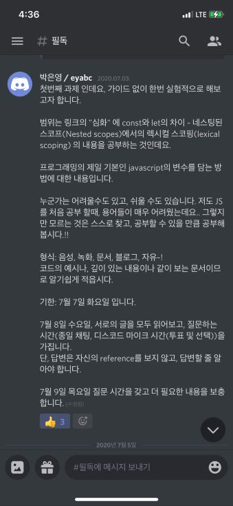
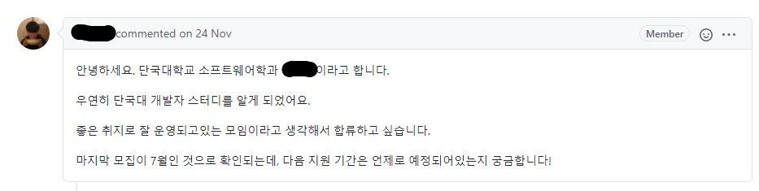

---

title: 주니어 개발자의 2020년 회고
description: 주니어 개발자의 2020년 12월 회고입니다.
sidebarDepth: 3
date: 2021-01-07 11:00:00
image: /Review/2020-year/end/thumbnail.jpg

---

# 주니어 개발자의 2020년 회고


> 6000개 Contributions을 목표로 했는데.. 아쉽게 다 채우진 못했다. 앞으로도 불가능 할 것 같다.

오늘은 2020년의 마지막 날이다.
그래서 2020년 회고로 올해를 마무리 하고자 한다.

들어가기 전에, 2019년을 마무리 하면서 썼던 글을 먼저 소개한다.

::: tip 일년 전, 후회와 다짐

2019년은 나에게는 권태기 같은 한 해였다.

- 고등학교 시절부터 올해까지 몸담았던 기능대회에 대한 회의감.
- 대학교 4년동안 만족할만한 프로젝트를 못해봤다는 후회감.
- 비교적 빨리 개발을 시작했지만 그 기간이 그렇게 의미있는 시간은 아니였구나 하는 허탈감.
- 무언가 후회해볼만한 경험조차 없던 것 같은 아쉬움만 남는 대학생활.
- 이제 사회에 내던져지는 것에 대한 기대와 불안감.
  
허둥지둥 살기만 했지 똑부러지게 현명하게 똑똑하게 살진 못한 것 같다.
남들처럼 나 이렇게 열심히 살았어요 라고 회고도 써보고 싶은데 돌이켜 보니까 올해는 그렇게 열심히 살지도 않았고, 열심히 공부를 하지도 않았다.

**2020년은 스스로에게 떳떳하고 당당한 해가 되기를!**

:::

그렇게 **기필고 2020년은 후회 없는 하루 하루를 보내기로 다짐**했다.
그래서 이 포스트는 이러한 다짐을 어떤 식으로 실천했는지 소개하는 회고라고 할 수 있다.

::: tip 월간회고

- [1분기 회고](/Review/2020-year/01-First-Quarter/)
  - [1월](/Review/2020-year/01-January/)
  - [2월](/Review/2020-year/02-February/)
  - [3월](/Review/2020-year/03-March/)
- [2분기 회고](/Review/2020-year/02-Second-Quarter/)
  - [4월](/Review/2020-year/04-April/)
  - [5월](/Review/2020-year/05-May/)
  - [6월](/Review/2020-year/06-June/)
- 3분기 회고
  - [7월](/Review/2020-year/07-July/)
  - [8월](/Review/2020-year/08-August/)
  - [9월](/Review/2020-year/09-September/)
- 4분기 회고
  - [10월](/Review/2020-year/10-October/)
  - [11월](/Review/2020-year/11-November/)
  - [12월](/Review/2020-year/12-December/)

:::

## 업무

생각보다 많은 프로젝트에 참여했다. 아마 내년에는 더 많은 일을 할 것 같은 느낌이 든다.

### 1. 파일럿 프로젝트


나는 작년 11월에 [줌인터넷](https://zuminternet.github.io/)에 입사했고, 입사 후에 바로 **파일럿 프로젝트**를 진행했다.

::: tip 파일럿 프로젝트

줌인터넷은 신규 입사자(정확히는 신입)가 팀에 안전하게 적응할 수 있도록 6 ~ 8주 정도 `파일럿 프로젝트`를 진행한다.

:::

일단 나는 학교 수업을 전부 듣고 싶어서 주 2일(12시간 근무) 출근 했고, 공강 시간에 틈틈이 파일럿 프로젝트를 진행했다.
프로젝트의 주제는 `주제별 영상 제공 웹 서비스` 이며 다음과 같은 기술 스택을 사용했다.


- **front-end**
  - Vue-cli3(Webpack 4)
  - Terser Webpack plugin
  - SCSS, Lodash, Swiper
  
- **back-end**
  - Java8 이상
  - Spring Boot + Gradle
  - Spring Data JPA (선택, DB는 H2사용)
  - Ehcache
  - Pebble Template Engine (선택)

자세한 내용은 다음 링크에서 확인할 수 있다.

- [저장소(코드)](https://github.com/junilhwang/zum_pilot)
- [파일럿 프로젝트 문서](https://junilhwang.github.io/zum_pilot)
- [줌인터넷 기술블로그 - 주제별 영상 제공 웹 서비스](https://zuminternet.github.io/ZUM-Pilot-provide-video/)

확실히 파일럿 프로젝트 덕분에 팀에 잘 적응할 수 있었고 무엇보다 이렇게 긴 시간 동안 온전히 프로젝트에 집중할 수 있던 적이 여태까지 없었기 때문에 무척 재밌었다.
사실 파일럿 프로젝트를 할 때가 **회사를 다니는 동안 제일 재밌던 시기**가 아니였을까 싶다.

***

### 2. 모바일 줌


> 모바일줌의 경우 주간 트래픽이 300만회 정도 발생한다.

입사 후 처음으로 담당하게 된 사내 프로젝트가 [모바일줌](https://m.zum.com)이다.
내가 생각했던 것 보다 프로젝트의 코드가 굉장히 많았고 딱 봐도 복잡한 설계 같았다.

그런데 천천히 프로젝트를 분석하고 이것 저것 건드려보면서 이 프로젝트가 무척 견고하고 변화에 잘 대응할 수 있도록 설계된 것이 느껴졌다.

특히 거의 모든 로직은 백엔드(Internal API)에서 관리하고, 프론트엔드는 백엔드에서 만들어준 데이터를 공용 컴포넌트로 출력 하는 형태였다.
그래서 약 1년 동안 백엔드는 수십 번 배포했으나, 프론트엔드는 10회 안팎으로 배포했다.

그래서 모바일줌의 컴포넌트를 사내 넥서스 레포에 올려놓고 사용해도 되지 않을까 논의하기도 했다.
다만 완전히 공용 컴포넌트로 사용하기엔 위험 요소가 많아서 고려 중이라고 했다.
나중에 시간적 여유가 있을 때 완전히 코어로 사용해도 좋을 것 같다.

이 외에도 내가 작업한건 아니지만, [모바일줌에 SSR을 적용](https://zuminternet.github.io/ZUM-Mobile-NodeJS/)하는 등의 공사가 있었다.

그리고 기존에 API 프로젝트에서 Mobile API를 따로 떼어나는 작업도 있었다.


::: tip 현재 모바일 줌의 기술 스택은 다음과 같다.

- Front Server
  - Server: typescript + Node.js + Express.js + Zum Core + SSR
    - 원래 Spring Boot를 사용했으나, SSR 때문에 node.js로 전환했다.
    - [모바일 줌 SpringBoot → NodeJS 전환기 (feat. VueJS SSR)](https://zuminternet.github.io/ZUM-Mobile-NodeJS/)
  - Front: typescript + javascript + Vue.js
    - 프론트 개발 환경의 경우 다음 링크에 대부분의 내용이 담겨있다.
      - [Webpack dev server를 이용한 개발 환경 구성 Part 01](https://zuminternet.github.io/ZUM-Webpack-dev-proxy-part1/)
      - [Webpack dev server를 이용한 개발 환경 구성 Part 02](https://zuminternet.github.io/ZUM-Webpack-dev-proxy-part2/)

- API Server
  - Java
  - Spring Boot

Front Server를 Node.js로 구성하여 대용량 트래픽을 더 적은 자원으로 관리할 수 있게 되었다.
심지어 SSR을 적용하기 전보다 응답 시간이 더 줄어들었다.

:::

모바일줌에 대해서 하고 싶은 이야기가 더 많지만,
이 이상은 대외비라서 언급하기가 꺼려진다.
확실한건 이 프로젝트 덕분의 자신감도 많이 생겼고,
설계에 대한 안목도 넓힐 수 있었다.


***

### 3. Open API CMS

줌인터넷에서 제공하는 [Open API](https://dev.zum.com/search/cse_intro)가 있는데,
기존에는 이를 사용하는 벤더사의 정보를 application.yml 내에서 관리하고 있었다.
벤더사가 점점 많아졌고, CMS Service로 떼어날 필요성을 느끼게 되어 진행한 프로젝트다.

이 때 [Element UI](https://element.eleme.io/#/en-US)와 [Vue-Element-Admin](https://panjiachen.github.io/vue-element-admin/#/login?redirect=%2Fdashboard)을 이용해서 만들었다.

그런데 `element-admin`에는 불필요한 컴포넌트와 기능이 많아서 정말 필요한 부분만 따로 떼어내서 사내 프로젝트에 올려놓고 사용 중이다.

이 프로젝트를 통해서 다른 팀원들과 처음으로 협업(정확히는 분업이랄까..?)을 해볼 수 있었다.
그리고 이 프로젝트에서 [AWS DynamoDB](https://aws.amazon.com/ko/dynamodb/)를 사용했는데,
다른 프로젝트에도 적용할까 하다가 흐지부지 됐다. 사용하기가 조금 애매하달까?

학습은 했는데 언제 써먹을 수 있을지..


***

### 4. 크롬 확장프로그램


5월부터 8월까지 [크롬 확장프로그램 - Zum Newtab](https://chrome.google.com/webstore/detail/zum-newtab/bghgeookcfdmkoocalbclnhofnenmhlf?hl=ko&authuser=2)을 만들었다.
실제 프로젝트를 진행하기에 앞서 간단하게 [튜토리얼](https://github.com/JunilHwang/chrome-extension-tutorial)을 진행했다.


생각보다 어렵지 않았고, 자신감이 차오른 상태에서 개발을 진행했다.
개발은 딱 한 달 정도 소요되었는데, 검수 과정에서 다양한 반려 사유가 존재했고 _완벽하게 통과하기 까지 3개월이 걸린 것이다._


확실히 확장프로그램을 만들면서 기술적으로 많은 생각을 하는 계기가 되었다.
일반적인 웹 서비스가 아니기 때문에 고려해야할 것도 많았고,
완성도에 대한 중요성 또한 다시 한 번 깨우칠 수 있었다.


~~그런데 또 하고 싶다는 생각이 들진 않는다.~~

언젠간 ~~죽기 전에~~ 확장프로그램으로 재미난 일들을 해보고 싶다.

확장프로그램에 대한 자세한 내용은 [줌인터넷 기술블로그 - 크롬 확장프로그램 개발⛏ 회고](https://zuminternet.github.io/Zum-Chrome-Extension/)에서 확인할 수 있다.


***

### 5. 핫이슈 CMS


7월 ~ 11월 사이에는 [줌프론트](https://zum.com)의 **핫이슈 영역**을 관리하는 CMS를 만들었다.

- CMS만 만들면 되는 것이 아니라 CMS에서 정제한 데이터를 응답하는 API를 새로 만들었다.
- 미리보기 기능까지 있기 때문에 미리보기와 관련된 도메인에서 페이지를 요청할 경우,
실서비스 데이터 대신 미리보기 데이터로 구성해서 보여줄 수 있게 API와 Preview Server를 구성했다.

이 과정에서 줌프론트의 소스도 분석했고 ~~지옥문을 열었다~~, 이와 엮인 다른 서비스 담당자와 커뮤니케이션을 진행했다.

어쨋든 우여곡절 끝에 8월에 개발을 완료했고, 9월초에 첫 배포를 진행했다.
다만 9월에 배포하고 나서 지속적으로 수정사항이 생기고 있었고,
`이 상태로 배포했다고?` 싶은 버그도 많고 QA를 하지 않고 넘어간 부분도 무척 많았다.

그러던 중 이미 기획측과 **수 차례 논의하여 합의된 기능에 대해 컴플레인**이 발생했고,
이미 배포가 되어 있으며 서비스 데이터까지 삽입된 데이터베이스의 설계를 건드려야 하는 일이 발생했다.

외래키가 무척 복잡하게 만들어진 상태에서 스키마를 변경하는 것 보단 새로 만드는게 나아보였다.


그래서 `hotissue_v2_schedule`, `hotissue_v2_template` 처럼 **v2라는 suffix를 붙여서 테이블을 새로 만들었고,**
테이블의 변경에 따라 **서비스 로직도 대폭 수정**했다.

결과적으로 트러블이 생긴 후에 많은 문제점이 겉으로 드러났기 때문에 문제를 잘 핸들링 할 수 있었다고 생각한다.
앞선 경험을 토대로 2차 배포 전까지 QA를 꼼꼼하게 진행함은 물론 작은 기능에 대해서도 후에 문제가 발생하지 않도록 커뮤니케이션을 진행했다.
덕분에 일하는 시간 보다 커뮤니케이션 하는 시간이 많았다.


그렇게 성공적으로 배포를 진행했고, 뒤탈없이 마무리 되는 듯 싶었다.
사실 아직까지 큰 문제는 없는 상태인데, 코드가 너무 복잡해졌다.
정확히는 한 개의 컴포넌트에 너무 많은 기능이 들어가있다.

보통 API 관련 로직이나 Store를 다루는 로직은 컨테이너 컴포넌트에서 처리하고,
하위 컴포넌트가 Props를 전달하거나 혹은 Custom Event로 처리하도록 만드는 편이다.
이와 같은 방식으로 만들다 보니, 특정 컴포넌트 하나가 폭탄이 되었다.


> 고작 몇 백줄 정도의 코드지만, 팀 내에서 적극적으로 프론트엔드를 공부하는 사람이 나를 포함하여 두 명이다.
그래서 다른 팀원이 이 코드를 보게 될 경우 무척 혼란스러울 수 있다. 

그래서 이걸 어떻게 해결할까 고민하다가 최근에 [Vue 3](https://v3.vuejs.org/)에 도입된 [Composition API](https://composition-api.vuejs.org/)를 사용하기로 했다.
이를 위해 [Vue3 + Composition API + TodoList](https://github.com/JunilHwang/vue-composition-todoapp)을 먼저 만들었고,
어느 정도 사용 방법을 익힌 후에 리팩토링을 진행했다.


각각의 로직을 `useMenus`, `useSchedule`, `useTemplateItem`, `usePreview` 처럼 **카테고리별로 묶어서** 유지보수 할 수 있게 작업했다.
그리고 `mapState`, `mapGetters`, `mapMutations`, `mapActions`, `craeteNamespaceHelper` 같은 API를 이용하여 컴포넌트에 Vuex를 결합하여 사용했는데, Composition API에는 이런게 없다.
그래서 직접 만들어서 사용했다.

```js
import { computed } from "vue";
import { useStore } from "vuex";

export default function useStoreModuleMapper(namespace) {
  const store = useStore();

  const mapState = keys => keys.map(key => computed(() => store.state[namespace][key]));
  const mapMutations = keys => keys.map(key => (...payload) => store.commit(`${namespace}/${key}`, ...payload));
  const mapActions = keys => keys.map(key => (...payload) => store.dispatch(`${namespace}/${key}`, ...payload));
  const mapGetters = keys => keys.map(key => computed(() => store.getters[`${namespace}/${key}`]));

  return { mapState, mapMutations, mapActions, mapGetters };
}
```

위의 코드는 다음과 같이 사용할 수 있다.

```js
export default function useTodo() {
  const { mapState, mapGetters, mapActions, mapMutations } = useStoreModuleMapper("todo");
  const [listLoading, appendLoading] = mapState(["listLoading", "appendLoading"]);
  const [filteredTodoItems] = mapGetters(["filteredTodoItems"]);
  const [setTodoItems, setUser] = mapMutations([SET_TODO_ITEMS, SET_USER]);
  const [fetchItems, addItem, updateItem, toggleItem, removeItem, removeAllItem, updatePriority] = mapActions([
    FETCH_ITEMS,
    ADD_ITEM,
    UPDATE_ITEM,
    TOGGLE_ITEM,
    REMOVE_ITEM,
    REMOVE_ALL_ITEM,
    UPDATE_PRIORITY
  ]);
}
```

사용하는데 큰 무리는 없으나, _IDE 추적을 지원하지 않기 때문에_ 오히려 코드를 유지보수할 때 힘들 수 있다.
_Vuex에 Composition API 전용의 유틸성 라이브러리가 추가 되길 기도할 뿐이다.. 😇_

그리고 Composition API를 사용하면 변수와 메소드를 구분할 수 있는 방법이 변수명 밖에 없기 때문에 네이밍을 더 잘 해야 하거나 혹은 사내 전용 컨벤션을 만들어야 한다.
그래서 더 많이 고민해봐야 할 것 같다.

***

### 6. 크롬 브라우저 전용 서비스

> 제일 최근에 진행한 프로젝트고, 아직 정식으로 사용자에게 공개된 서비스가 아니라서 많은 정보를 언급할 수 없는 상태이다.

11월 ~ 12월에는 **크롬 브라우저(혹은 최신 브라우저)를 전용으로 서비스**하는 프로젝트를 담당하여 진행했다.
올해의 마지막 프로젝트이며 입사 이후에 처음으로 신규 서비스를 처음부터 만드는 것이기 때문에 무척 재밌었다.

모바일줌과 똑같은 기술 스택을 사용 중이며

- Typescript
- Javascript
- Node.js
- Vue.js
- Server Side Rendering
- Java
- Spring

아마 조만간 사용자단에 정식으로 공개하고 홍보할 것 같다.
지금은 내가 생각하기에 불만족스러운 부분이 있어서 조금만 더 공개가 늦춰졌으면 하는 바람도 있다.

***

### 7. 팀원, 그리고 협업

올해에 총 4명, 조직개편 전 팀원까지 합하면 7명의 팀원이 이직했다.


특히 내가 입사했을 때 **무척 존경하고 자극이 되어주시던 분들**이 가셔서 참 아쉽기도 하고, 더 좋은 곳으로 가셨으니 기쁘기도 하다.
이제 다른 회사로 가셨지만, 이 분들과 인연을 맺었음에 감사할 따름이다.
나도 누군가에게 **긍정적인 영향**을 줄 수 있는 사람이 되기 위해서 부단히 노력해야겠다 😁

그래도 원래 **가깝게 지내던 지인이 내 추천을 통해 팀에 합류**하게 되었고,
앞으로 새로운 사람들도 계속 들어올 예정(과연..?)이기 때문에 새로운 인연을 기대하는 중이다.

그리고 현재 나의 사수이자 대부분의 업무를 같이 수행 중이며 **항상 나에게 큰 가르침을 선사해 주시는 효준 선임님이 아직 계시기 때문에** 든든하다!
이분 까지 가시면.. 😱.. 그래도 천천히 마음의 준비를 해야지 싶다. 그럴라면 지금 보다 더 깊은 수준의 지식을 쌓아야겠지만, 이게 이 업계의 숙명이 아닐까?

***

## 개발 역량 강화

이제부터가 본격적인 회고라고 할 수 있다. 쓰는 나도 지루한데, 읽는 사람도 지루하지 않을까 싶은 걱정이 앞서고 있다.

*** 

### 1. 일일커밋

올해의 제일 큰 목표중 하나이자 착실하게 이뤄낸 목표가 바로 **일일커밋**이다.


처음에는 그냥 매일 매일 꾸준히만 하자고 생각했었는데, 하다보니 너무 많이 해버렸다..


- 1분기
   - `1월` **7개의 Repository**에서 **357개의 Commit**을 남겼다.
   - `2월` **4개의 Repository**에서 **152개의 Commit**을 남겼다.
   - `3월` **3개의 Repository**에서 **168개의 Commit**을 남겼다.
  
- 2분기
   - `4월` **20개의 Repository**에서 **475개의 Commit**을 남겼다.
   - `5월` **11개의 Repository**에서 **665개의 Commit**을 남겼다.
   - `6월` **12개의 Repository**에서 **436개의 Commit**을 남겼다.
  
- 3분기
  - `7월` **8개의 Repository**에서 **357개의 Commit**을 남겼다.
  - `8월` **19개의 Repository**에서 **397개의 Commit**을 남겼다.
  - `9월` **18개의 Repository**에서 **770개의 Commit**을 남겼다.
  
- 4분기
  - `10월` **13개의 Repository**에서 **503개의 Commit**을 남겼다.
  - `11월` **10개의 Repository**에서 **198개의 Commit**을 남겼다.
  - `12월` **8개의 Repository**에서 **326개의 Commit**을 남겼다.
  
그리고 이에 대한 양분으로 사용된 주된 Repository 들이다.

- [TIL](https://github.com/junilhwang/TIL)
  - 매일매일 공부한 것들을 기록하기 위해서 만든 저장소인데, 월간 회고 때만 사용 중이다. ~~이럴꺼면 왜 만들었냐~~
- [java-clean-code](https://github.com/junilhwang/java-clean-code)
  - NextStep의 Java TDD CC 8기 과정에서 산출된 코드를 모아놨다. 
- [black-coffee-study](https://github.com/junilhwang/black-coffee-study)
  - NextStep의 블랙커피 스터디 미션 수행 과정에서 산출된 코드를 모아놨다.
- [DKU-Software-Engineering-Logging-Service](https://github.com/junilhwang/DKU-Software-Engineering-Logging-Service)
  - 올해 초에 진행했던 사이드 프로젝트인데, 미완성으로 남겨둔 상태이다. 언제 다시 시작해야 할까..? 이제 내가 뭘 하려고 했는지도 가물가물 하다.
- [react-facebook-clone](https://github.com/junilhwang/DKU-Software-Engineering-Logging-Service)
  - 프로그래머스 리액트 스터디를 진행하면서 산출된 코드를 모아놨다.
- [postman-clone](https://github.com/est-react-study/postman-junil)
  - 사내 리액트 스터디에서 산출된 코드를 모아놨다.
- [Algorithm](https://github.com/DKU-STUDY/Algorithm)
  - 단국대 알고리즘 스터디인데 사실 내가 기여한 부분이 어느 정도인지 잘 모르겠다. 아마 별로 없을 것 같다.
- [discord-study-bot](https://github.com/JunilHwang/discord-study-bot)
  - github DKU-STUDY 그룹에서 이벤트가 발생하면 디스코드로 알림을 보내주는 프로젝트이다.
- [pilot](https://github.com/JunilHwang/zum_pilot)
  - 파일럿 프로젝트 코드와 문서를 모아놨다.

그리고 겸사겸사 [코딩덕후](https://co-duck.com) 서비스를 이용하면서 의욕을 불태웠다.


6월, 7월 집계는 무슨 문제인지는 모르겠으나 각각 하루씩 커밋에 대한 집계가 되지 않았다 😂

어쨌든 **1위를 세 번**, 2위와 3위는 각각 한 번씩 했다.
아직 12월이 마무리되지 않아서 12월 뱃지는 없는 상태이다.


아마 12월 일일커미터 뱃지와 TOP 10 뱃지를 받지 않을까 싶다.

일일커밋을 하면서 느낀 것은, 배보다 배꼽이 더 커져버린 다는 것이다.
내년에는 커밋에 집착하기 보단 실제로 지식을 쌓는 것에 집중할 예정이다.

막상 잔디밭이 전부 채워진 것을 보고 있으니 많이는 하지 않더라도 한 개 씩은 하는 게 좋지 않을까? 하는 생각도 든다.

***

### 2. 사이드 프로젝트

개인적으로 진행한 사이드 프로젝트에 대해 정리해본다.
덕분에 공부는 많이 했으나 제대로 마무리 하질 않아서 아쉬움이 많이 남는다.

#### (1) DKU-Software-Loggging-Service

[프로젝트 레포지토리 바로가기](https://github.com/junilhwang/DKU-Software-Engineering-Logging-Service)

파일럿 프로젝트가 끝난 후에 사이드 프로젝트를 진행 해보고 싶어서 뭘 만들까 고민하다가 **Github와 관련된 서비스**를 만들기로 했다. 
자신의 Github에 올린 **Markdown 파일**을 읽어올 수 있고,
**Webhooks**를 이용하여 자동으로 포스트가 업데이트되도록 만들었다.
물론 수동으로 갱신할 수도 있다.

일단 위에 언급한 기능을 만드는 것은 어렵지 않았으나 **디자인도 구리고 퀄리티가 낮았다.**
그래서 이것저것 서브 기능을 넣어야 하는데 그것마저 쉽지가 않았다.
_혼자서 사이드 프로젝트를 하는 게 이럴 때 버겁구나 느꼈다._

그래서 만족할 때 까지 리팩토링을 하거나 ~~벌써 리팩토링만 몇 번 한 것인지...~~
기술 스택을 최대한 많이 공부하는 등의 목표를 가지고 진행 했는데 사실 그 마저도 쉽지 않았다.

기술이 워낙 다양하기도 하고, 그 중에 무엇을 골라서 얼만큼 공부해야 좋을지 감이 잡히지 않았기 때문이다.

- *첫 번째 성과: Open API 습득* 
  - 사이드 프로젝트를 하면서 얻은 첫 번째 성과는 **Open API를 사용하는 방법**을 완전히 터득한 것이다.
이전에는 API를 연동할 때 문서를 봐도 모르겠고,
다른 사람들이 작성한 글들을 봐도 감이 오질 않았는데 정말 어떤 API를 사용하더라도 큰 문제가 없을 정도로 이해한 상태다. 
  - 사실 사이드 프로젝트 덕분이라기보단 입사 직후에 진행했던 파일럿 프로젝트의 영향이 더 큰 것 같다.

- *두 번째 성과, NestJS 습득*
  ::: tip NestJS 소개
  NestJS는 **Google**에서 만든 **Server Side Framework**이다.
  - **Java의 Spring과 매우 비슷한 방식**으로 작동한다.
  - **DI(Dependency Injection)** 방식으로 구성한다.
  - **DDD** 형태의 프로젝트 구조를 권장한다.
  - **Typescript**를 사용한다.
  - **express** 기반이다.
  :::
  ::: tip NestJS의 철학
  NestJS는 Angular의 영향을 받아 다음과 같은 철학 기반을 만들어졌습니다.
  - 고도의 테스트 지원
  - 효율적인 확장
  - 느슨한 결합
  - 유지 관리가 용이한 애플리케이션
  :::
  - 대학교 재학 중에 [NestJS](https://nestjs.com/)가 뭔가 좋아보여서 공부했었는데, 너무 어려워서 포기했다. 
    국내 자료를 아무리 찾아봐도 NestJS에 대한 내용은 거의 볼 수 없었다. 대부분 해외에서 사용하고 있는데, 영어에 너무 취약하다 보니.. 이해가 너무 어려웠다.
  - 그런데 이번에 무심코 다시 적용을 시도했고, 결과적으로 좋은 선택이 되었다.
  - 하지만 Spring을 많이 사용해봤고 **Spring에 사용된 기본적은 디자인패턴이나 철학을 이해하고 있다면**, NestJS를 이해하는 데 큰 무리가 없는 것 같다. 
  - 그래서 사이드 프로젝트의 제일 큰 수확은 사실 **NestJS 사용법 숙지**가 아닐까 싶다.

- *세 번째 성과: Server Side Rendering*
  - 진짜 SSR 때문에 한 동안 고생을 너무 많이 했다.
  - _Vue에서 제공하는 가이드라인이 너무 빈약하다.
  - API 문서도 잘못 되었거나 반영되지 않은 것들이 많았다.
  - 각설하고 문제점과 약간의 해결과정을 나열해보자면 다음과 같다.
    - `첫 번째 문제` SSR과 CSR을 같이 하기 위한 가이드라인이 없다.
      - [Vue의 공식문서](https://ssr.vuejs.org/), 각종 커뮤니티 사이트, 
        기술 블로그 등을 폼하여 눈씻고 찾아봐도 SSR과 CSR을 같이 사용하는 방법에 대한 가이드라인은 없었다.
        _있다면 누가 좀 알려주길.._
      - 어쨌든 SSR에 CSR을 연동하기 위해선 다음과 같은 과정이 필요하다.
      - CSR의 Template에 SSR의 Template을 합쳐야 한다.
      - CSR 코드를 번들링(빌드) 한다. _이 때 Template도 Bundling 코드에 포함된다._
      - CSR에서 Build된 Template를 SSR에서 사용한다.
      - 이와 관련 내용도 추후에 상세하게 정리해서 올릴 예정이다.
      
    - `두 번째 문제` window와 document를 사용하는 코드들*
      - SSR은 CSR의 코드를 Server에서 실행하여 HTML 코드를 만들고 바로 렌더링한다. 
      - 이 때 발생하는 문제가 _window와 document는 Server Side에서 사용할 수 없다는 것이다._
      - 그래서 직접 window와 document를 만들어주거나 Render와 관련된 코드에는 window와 document를 사용하지 않는 것이다.
      - **그런데 이게 말이 쉽지 직접 해보면 욕나온다.**
      - 어쨌든 어떤 방법이 제일 좋을까 고민하다가 찾아난 해결책이 JSDOM을 사용하는 것이다.
        ::: tip JSDOM
        가상의 window와 document를 만들어준다.
        :::
        ```js{26-35}
        import { Injectable } from '@nestjs/common'
        import { join } from 'path'
        import { BundleRenderer, createBundleRenderer } from 'vue-server-renderer'
        import { DOMWindow, JSDOM } from 'jsdom'
        
        const port = process.env.NODE_ENV === 'development' ? 3000 : 8080
        const baseURL = `http://localhost:${port}`
        const bundlePath = join(__dirname, '../../../resources/vue-ssr-server-bundle.json');
        const htmlStr = `<!DOCTYPE html><html><head><title></title></head><body></body></html>`
        
        @Injectable()
        export class SSRService {
        
          public getRenderer (): BundleRenderer {
            try {
              return createBundleRenderer(bundlePath, {
                runInNewContext: false,
                template: (result, context) => `${result}${context.renderState()}${context.renderScripts()}`
              } as any)
            } catch (e) {
              console.log(e)
              throw 'Renderer Error'
            }
          }
        
          public getDom (contextURL: string): [ DOMWindow, Document ] {
            try {
              const url: string = `${baseURL}${contextURL}`
              const {window} = new JSDOM(htmlStr, {url})
              return [window, window.document]
            } catch (e) {
              console.log(e)
              throw 'JSDOM Error'
            }
          }
        }
        ```
        
    - `세 번째 문제` 제대로된 Tutorial을 찾을 수 없다. 
      - SSR의 가장 큰 문제점 중 하나가 바로 제대로된 튜토리얼이 없다는 것이다. 
      - github를 찾아봐도 구글링을 해봐도 _이것만 보면 이해할 수 있다 싶은 튜토리얼은 존재하지 않았다._
      - 그래서 내가 만들었다 --> [Vue SSR Tutorial](https://github.com/JunilHwang/vue-ssr-tutorial)
      - 일단 설명은 없고 소스코드만 존재한다. ~~뭐.. 이해할 사람은 이해하겠지.~~

- *네 번째 성과: Mono Repo 적용*
  - Client와 Server에 Typescript를 적용하면서 생긴 고민이 _공통 타입을 잘 활용할 수 있는 방법이 없을까?_ 였다. 
  - 예를들어 Server에서 Github API를 이용하여 `Repository` 정보에 대한 타입을 `GithubRepository`로 정의했다.
    **그런데 이 타입은 Client에서도 필요하다.**
  - 그래서 처음엔 Client가 프로젝트의 코드상으로 Server에 접근할 수 있도록 만들어야 했다. 
    만들면서 계속 찜찜했다. _Type이 Server에 종속되어있는게 맞을까?_ 라는 생각 때문이다. 
    그래서 Mono Repository에 대해 찾아봤고, 두 가지 방법이 존재했다.
    - Yarn Workspace
      - [[Node] yarn workspaces (프로젝트 참조)](https://musma.github.io/2019/04/02/yarn-workspaces.html)
      - [🌸 모노레포. Lerna? Yarn Worksapce!](https://medium.com/@deptno/monorepo-yarn-workspace-e81e3e078100)
      
    - Lerna
      - [Mono Repo 를 위한 Lerna 간단 정리하기](https://medium.com/@pks2974/mono-repo-%EB%A5%BC-%EC%9C%84%ED%95%9C-lerna-%EA%B0%84%EB%8B%A8-%EC%A0%95%EB%A6%AC%ED%95%98%EA%B8%B0-65c22029988)
      - [Lerna 훑어보기](https://www.awesomezero.com/development/lerna/)
    
  - 권장하는 것은, 두 가지를 같이 사용하는 것이다. 그래서 나도 두 가지 모두 사용했다.
    - [yarn workspace와 Lerna.js로 모노레포 만들기 - 심심재](https://simsimjae.tistory.com/384)

이렇게 일을 벌려놨는데, 5월에 넥스트 스텝 Java TDD CC 8기 과정을 신청했고 그렇게 6월까지 해당 과정에만 집중해야 했다.

***

#### (2) 디스코드 봇


6월에 [DKU-STUDY](https://github.com/DKU-STUDY/) 채팅방을 디스코드로 옮기면서 [디스코드 봇](https://github.com/JunilHwang/discord-study-bot)을 만들었다.

_Pull Request, Push, Issue, Review 등이 발생하면 디스코드 봇이 디스코드 채널에 메시지를 보내도록_ 만들어놨다.

처음에는 `express.js`로 만들었고, 추후에 `nest.js`로 리팩토링했다.

- 기술스택
  - node.js
  - nestjs
  - vue.js => CMS를 만들려고 추가했는데 만들다 말았다.
  - [Discord API](https://discord.com/developers/docs/intro)
  - [Discord Bot](https://discord.com/developers/docs/topics/oauth2#bots)
  - [Github Webhooks](https://docs.github.com/en/free-pro-team@latest/developers/webhooks-and-events/about-webhooks)

봇을 만든 후에 다음과 같은 추가 기능을 CMS 페이지를 통해 구축하려고 했다.

- **Github 관련**
  - Github 로그인
  - Github Repository 불러오기
  - Github Repository를 선택하면 관련된 Hooks 불러오기
  - Hooks를 추가/수정/삭제하기
  - Hooks와 관련된 템플릿 작성하기
- **Discord 관련**
  - Discord 로그인
  - Discord 채널 목록 불러오기
  - Discord의 채널 ID 복사하기
- **Discord와 Github 연동 관련**
  - Github Hooks에 Discord Channel ID 연결하기

그런데 곰곰이 생각해보니 굳이 만들 필요가 없었고, 추후에 **channel ID만 parmeter를 받아오는 형태로 수정**했다.

몇 개월 동안 유용하게 잘 사용 중이다.

***

#### (3) Devears

Discrod Bot을 만든 후에 블랙커피 스터디와 리액트 스터디, 그리고 넥스트 스텝 리뷰어 활동 때문에 따로 사이드 프로젝트를 수행할 틈이 없었다.
그렇게 연말이 되었고, 기존에 이어서 하기보단 아예 새로 사이드 프로젝트를 진행하고 싶었다.

기술 스택은 Spring과 React을 사용하기로 결정했고,
어떤 주제로 할까 고민하다가 현재 [운영중인 스터디](https://github.com/dku-study)를 관리할 수 있는 서비스를 만들어보기로 했다.

::: tip Devears
- 단국대의 상징이 곰(Bear)이다.
- Developer(개발자) + Bear(곰) = Devears
- 즉, 단국대 개발자들이라는 뜻을 가졌다고 볼 수 있다.
:::

11월에는 Back-end 위주로 작업 했는데 사실 정확히 어떤 기능을 추가할지 정해놓질 않아서 갈팡 질팡 하는 중이다.
현재 까지 구현한 기능은 Github 로그인과 토큰 발급, 그리고 로그아웃이 전부이다.
뭐.. 거의 안 한 것과 다름 없다

12월에는 대충(정말 대충..) [요구사항 문서](https://dku-study.github.io/Devears/)를 작성했고, Front-end 위주의 작업을 진행했다.


로고는 [logogenie](https://www.logogenie.net/)에서 검색하여 나온 결과물 중에 마음에 드는 것을 참고하여 대충 급하게 만들었다.
실제로 서비스 하기 전에 외주를 맡기던가 할 생각이다.

이렇게 혼자서 무언가를 만들 때면 항상 UI 구성이 때문에 고민이다.
어떻게 만들어도 이상하게 보이는 마법이랄까..?
일단 죽이 되든, 밥이 되든 만들어 보고자 한다.

::: tip Front-end 기술 스택
현재까지 진행하면서 사용한 **프론트엔드 기술 스택**은 다음과 같다.

- typescript
- Create React App
- react
- redux
- redux-saga
- react-router-dom
- connected-react-router
- antd
- styled-jsx
- sass
- json-server
:::

::: tip  위의 기술을 사용하면 정리한 팁들이다.

- Create React App Custom
  - [CRA로 만든 리액트 프로젝트에서 eject하지 않고 optional chaining 사용하기](https://sustainable-dev.tistory.com/126)
    - customize-cra
    - react-app-rewired

- React Router Layout
  - [React Router](https://reactrouter.com/web/guides/quick-start)
  - [Reusing layouts in React Router 4](https://simonsmith.io/reusing-layouts-in-react-router-4)
  - [React Router v4 with multiple layouts](https://stackoverflow.com/a/46201798)

- Mock API
  - [json-mockServer - 벨로퍼트와 함께하는 모던 리액트](https://react.vlpt.us/redux-middleware/08-json-mockServer.html)
  - [github/json-mockServer](https://github.com/typicode/json-mockServer)

- Proxy
  - [CRA - Proxying API Requests in Development](https://create-react-app.dev/docs/proxying-api-requests-in-development)
  - [Create-react-app V2 릴리즈! 무슨 변경 사항이 있을까?](https://velog.io/@velopert/create-react-app-v2#5-proxy-%EC%84%A4%EC%A0%95%EC%9D%84-%EC%BB%A4%EC%8A%A4%ED%84%B0%EB%A7%88%EC%9D%B4%EC%A7%95-%EA%B0%80%EB%8A%A5)

:::

이번에는 사용한 기술에 대해서 제대로 정리해볼 생각이다.

***

#### (4) 단쿠키 개발팀 합류

::: tip 단쿠키

- [단쿠키](https://www.dankookie.com/)는 나의 모교인 단국대학교 커뮤니티 사이트이다.
- [에브리타임](https://everytime.kr/)이 등장하기 전까진 굉장히 활성화된 커뮤니티였는데, _에브리타임 덕분에 이용자수가 대폭 감소했다._

:::

나는 **에브리타임**이라는 대학교 커뮤니티를 자주 사용하는 편이다.
개발과 관련된 정보를 공유하기도 하고, 진로에 대해 고민하는 후배들과 이야기를 나누는 등의 소통 창구로 사용하고 있다.

그러던 중 눈에 띄는 글을 하나 발견했다.
> 글을 캡쳐해서 올릴라 했는데.. 지금 찾아보니 삭제됐다. 아쉬운대로 단쿠키에 올라온 글을 캡쳐해서 올린다.


보자마자 지원하고 싶다는 생각을 했다.
그런데 나는 졸업생이다보니 이걸 지원해야하나 말아야하나 고민하다가 졸업생도 지원 가능한지 물어보는 댓글을 남겼고, 가능하다는 답변을 받았다.


그래서 고민 끝에 지원했다.


이렇게 코딩 테스트 및 온라인 면접 일정을 잡고 진행했다.
코딩 테스트 문제 자체는 어렵지 않았으나, _내가 너무 어렵게 생각해서 조금..이 아니라 많이 헤맸다._

이 외에도 다양한 면접 질문을 받았는데 내가 생각하지도 못했던 부분들이 있어서 조금 당황했다.
_당황했던 질문들은 대체로 보안과 관련된 질문이었고, 내가 보안과 관련된 도메인에 약하다는 것을 인지했다._
덕분에 공부할 것들이 늘었다 😅

여담으로, 학부시절에 같이 단쿠키측에서 함께 하고 싶은 의향 있으면 연락 달라고 했었는데 그 당시에는 정말 미친듯이 바빠서 아예 연락을 하지 않았다.
당시에 작은 에이전시 회사에서 원격근무도 하고 있었고, 학부 연구생도 하고 있었고, 같은 학부 연구생들과 정부 과제도 하고 있었고, 고등학교 강사도 하고 있었다.
거기에 수업에 시험에 과제에 이것 저것 다 포함하면.. 거기서 무언가를 더 할 엄두가 나질 않았다.


어쨌든 12월에 대면 면접을 거치면 결과를 알 수 있겠지 싶다.

그렇게 12월 초에 일정을 잡고 대면 면접을 진행했다.
면접 장소는 학교 근처였는데 오랜만에 학교 구경좀 하려고 아침 일찍 갔다.


> 그토록 졸업하고 싶었고, 벗어나고 싶었던 곳인데 그래도 학교 다닐 때가 지금 보단 더 마음 편하고 즐거웠던 것 같다.

교내에 있는 세미나실에서 작업좀 하다가 오랜만에 학교 근처 맛집에서 점심 식사를 했다.
그렇게 시간 맞춰서 대면 면접 장소로 이동했다.
면접 분위기는 무척 좋았고, 단쿠키라는 서비스에 대한 여러가지 사정을 들을 수 있었다.
여태까지 학생 신분으로 보상도 없이 서비스를 유지하느라 많이 힘들었던 것 같고,
운영진이 얼마나 이 서비스에 애정을 가지고 있는지 느껴졌다.


이렇게 나도 단쿠키 개발팀에 합류하게 되었다.
일정이 조금 촉박한 것 같아서 걱정이지만 **걱정보단 기대가 더 앞선다.**
아직 결정된게 많진 않지만 재밌을 것 같다.

***

### 3. 인터넷 강의

나는 인터넷 강의를 좋아하는 편이 아니다.
사실 여태까지 인터넷 강의의 필요성을 크게 느끼지 못했달까?
그런데 입사 후에는 아무리 생각해도 혼자서 공부하기엔 벅찬 부분이 많아서 꽤 많은 인터넷 강의를 들었다.

사실 다른 사람들에 비하면 많이 듣진 않았으나 그냥 내 기준으로 올해는 많이 본 편이다.

- [코드스피츠](https://www.youtube.com/channel/UCKXBpFPbho1tp-Ntlfc25kA)
  - [85기 - 거침없는 자바스크립트](https://www.youtube.com/watch?v=0NsJsBdYVHI&t=2900s)
  - [86기 - 객체지향 자바스크립트](https://www.youtube.com/watch?v=E9NZ0YEZrYU&t=4031s)
  - [88기 - async/await](https://www.youtube.com/watch?v=H_Hb9IF7sfc)
  
- [인프런](https://www.inflearn.com/)
  - [예제로 배우는 스프링 입문 (개정판)](https://www.inflearn.com/course/spring_revised_edition/dashboard)
  - [스프링 부트 개념과 활용](https://www.inflearn.com/course/%EC%8A%A4%ED%94%84%EB%A7%81%EB%B6%80%ED%8A%B8/dashboard)
  - [더 자바, 코드를 조작하는 다양한 방법](https://www.inflearn.com/course/the-java-code-manipulation/dashboard)
  - [함수형 프로그래밍과 javascript ES6+](https://www.inflearn.com/course/functional-es6/dashboard)

- [패스트 캠퍼스](https://auth.fastcampus.co.kr/sign-in?client_id=fc%3Aclient%3Awww&response_type=token&redirect_uri=https%3A%2F%2Fwww.fastcampus.co.kr%2Fonline_category%2F%3Fgclid%3DCjwKCAiA57D_BRAZEiwAZcfCxaJChqY6DQLK2hwE1ZOTg-kZ-OJe3mPLbEU81L5O4yLUQbpA8EceCBoCNMgQAvD_BwE&scope=www)
  - [React와 Redux로 구현하는 아키텍쳐와 리스크 관리](https://www.fastcampus.co.kr/dev_red_kmt)

제일 유용했던 강의는 [더 자바, 코드를 조작하는 다양한 방법](https://www.inflearn.com/course/the-java-code-manipulation/dashboard)와 [코드스피츠](https://www.youtube.com/channel/UCKXBpFPbho1tp-Ntlfc25kA) 시리즈다.

강의 내용을 보고 정리를 하고 싶었는데, 일단 코드스피츠의 내용의 일부만 정리했다.

_86기 객체지향 자바스크립트(Object Oriented Javascript)_

- [1회차 - 객체지향 프로그래밍의 목적과 원칙](/CodeSpitz/Object-Oriented-Javascript/01-Intro/)
- [2회차 - MVVM System 구축](/CodeSpitz/Object-Oriented-Javascript/02-MVVM/)
- [3회차 - MVVM System 개선 (1)](/CodeSpitz/Object-Oriented-Javascript/03-Strategy-Observer/)
- [4회차 - MVVM System 개선 (2)](/CodeSpitz/Object-Oriented-Javascript/04-ISP-Visitor/)
- [5회차 - MVVM System 개선 (3)](/CodeSpitz/Object-Oriented-Javascript/05-Extension/)

코드스피츠는 유튜브에서 무료로 볼 수 있으며, 내용 또한 쉽지 않다. 더불어 [Bsidesoft 블로그](https://www.bsidesoft.com/)에 올라온 글을 같이 보면 더욱 도움이 많이 된다.

***

### 4. 스터디

#### (1) DKU-STUDY


4월 말에 취업 준비 중이던 [여자친구(같은과 후배)](https://github.com/eyabc)가 뜬금없이 [알고리즘 스터디](https://dku-study.github.io)를 같이 하자고 했다.
스터디 구성원은 먼저 에브리타임을 통해서 모집하고, 추가로 알고 지내던 후배들 중 같이 하고 싶은 의향이 있는 사람들을 초대했다.


> 이렇게 무척 대충(?) 모집 공고를 올렸는데 지원해준 사람이 있어서 신기했다.

스터디를 하면서 느낀점은,

- 알고리즘을 풀이할 때 다른 사람들의 생각을 직간접적으로 알 수 있다는 것 자체가 큰 도움이 된다.
- 보편적인 솔루션을 만드는 사람도 있고, 기상천외(?)한 방법으로 문제를 해결하는 사람도 있다.
- 같이 하는 공부라서 생각보다 외롭지 않고 의지를 갖게 해준다.
- 같이할 수 있는 다양한 것들을 시도해볼 수 있다.
- 다양한 정보를 빠르게 모을 수도 있고, 전파할 수도 있다.

그렇게 3개월 정도 운영을 하다가 인원이 더 있어도 좋을 것 같아서 스터디원을 더 모집했다.


그리고 알고리즘 이외에도 javascript 면접 스터디가 한 학기 정도 진행했다.
사실 내가 주도한 것도, 참여한건 아니지만 _구성원들간에 규칙을 세우고 꾸준히 하는 모습이 무척 인상깊었다._ 




- 한 주에 한 개의 주제에 대해 정리하고 공유하며 피드백을 남기도록 했다.
- 7월에 시작했고, 12월까지 계속 진행 중이다.

7월 이후에 스터디 모집을 하고 있다는 글을 올려놓진 않았지만 _이메일, 깃허브, 그리고 구성원의 소개 등으로 계속 유입 중이다._




그렇게 8개월 동안 약 20명 이상의 사람들이 모였다.
내년에 잘 굴려보면 최소 50명에서 최대 100명 정도의 사람이 모일 수 있지 않을까?

***

그리고 타 학교 사람들과 스터디 운영에 대해서 궁금한 점을 메일로 주고 받기도 했다. 


이렇게 연락을 주시는 분들 덕분에 더 열심히 잘 운영해야겠다는 생각이 든다.

올해는 이제 다 지나갔으니, 내년에는 스터디를 조금 더 체계적으로 관리할 생각이다.

지금은 알고리즘 위주의 스터디를 진행하고 있지만, 취업이나 면접 스터디 혹은 Java나 Javascript, 혹은 영어 스터디 등으로 영역을 조금씩 넓혀갈 예정이다.

***

#### (2) 블랙커피 스터디

매달 `NextStep`에서 메일로 뉴스레터를 보내주고 있다. 그런데 눈에 띄는 항목이 보였다.


**처음으로 Javascript Study가 진행되고 있다는 내용**이다.
**무료로 신청**할 수 있었기 때문에 고민 없이 바로 신청했다.

::: tip 블랙 커피 스터디

- **훌륭한 의사소통은 블랙커피처럼 자극적이며, 후에 잠들기가 어렵다** 라는 문장에 감명 받아 `블랙 커피 스터디`라고 짓게 되었다고 한다.
- 이름의 유래에서 유추할 수 있듯 함께 좋은 커뮤니케이션으로 통찰을 이끌어내고, 그 통찰과 함께 성장하고, **소프트웨어 장인으로 거듭나기가 목표**인 스터디이다.
  
  - 소프트웨어 장인이란?
    - 동작하는 소프트웨어를 정교하고 솜씨있게 만들 수 있는 것
    - 변화에 대응하는것 뿐만이 아니라, 계속해서 가치를 더하는 것
    - 개별적으로 협력하는 것 뿐만이 아니라, 프로페셔널 커뮤니티를 조성하는 것
    - 고객과 협업하는 것 뿐만 아니라, 생산적인 동반자 관계를 추구하는 것
  
- 이 스터디는 위와 같은 목표를 달성하기 위해서 `페어 프로그래밍`과 `코드리뷰`라는 수단을 이용한다.

:::

#### 1) lv1. TodoList

9월에 블랙커피 스터디의 존재를 인지하고 `Level 01`을 신청했다.


스터디 진행은 다음과 같이 진행 된다.


요약하자면 다음과 같다.

::: tip 미션 요약

- 주 1회 온라인 세션을 통한 미션 소개 및 회고
- 주 2회 페어프로그래밍
- 코드리뷰

:::

미션이 어렵진 않았고, 시간적 여유도 충분히 있었기 때문에 첫 주에 1~3주 미션을 모두 수행했다.

- `1주차` Todo App 만들기
  - [Document Object Model](https://www.youtube.com/watch?v=1yADBI27NCg)
  - [Browser Object Model](https://www.youtube.com/watch?v=BYRTKmPAr8c)
  - [Event](https://www.youtube.com/watch?v=u49E4_4hyeI)
- `2주차` API 연동
- `3주차` SPA 만들기 (Router 사용하기)

이 정도의 난이도가 수준 높은 코드를 만들기 위한 적합한 미션이라고 생각한다.
현재 보다 더 어렵거나 쉬웠다면 설계에 집중하기가 힘들었을 것 같다.

그리고 페어 프로그래밍은 총 3회를 참여했으며 같이 미션을 구현하거나, 혹은 미션 진행에 필요한 라이브러리를 구현하는 방향으로 진행했다.
이러한 과정을 통해서 혼자 고민하던 것들에 대해 즉각적으로 피드백을 주고 받으며 잘못된 점이나 개선 점을 찾아낼 수 있었고,
고스란히 내 코드에 녹였다.

다만 페어와의 실력차이가 심할 경우에는 페어프로그래밍 보단 실시간 강의(?)가 될 수 있으니 어느 정도 운도 따라야한다.

이 과정에서 도출한 코드는 다음 링크에서 확인해볼 수 있다.

- [전체 내용 정리](https://github.com/junilhwang/black-coffee-study)
- Step 01
  - [소스코드](https://github.com/junilhwang/js-todo-list-step1)
  - [데모](https://junilhwang.github.io/black-coffee-study/step1)
- Step 02
  - [소스코드](https://github.com/junilhwang/js-todo-list-step2)
  - [데모](https://junilhwang.github.io/black-coffee-study/step2)
- Step 02
  - [소스코드](https://github.com/junilhwang/js-todo-list-step3)
  - [데모](https://junilhwang.github.io/black-coffee-study/step3)
  
더 상세한 내용은 [9월 회고](https://junilhwang.github.io/TIL/Review/2020-year/09-September/#_1-black-coffee-study)에서 확인할 수 있다.

***

#### 2) Lv2. 프론트엔드 테스트


> `lv2`는 `lv1`에서 만든 코드로 테스트하기 때문에 `lv1`를 꼭 먼저 수료해야한다.  

부끄럽게도 나는 프론트엔드 테스트를 제대로 공부해본적이 없다. 아직 테스트의 중요성을 제대로 인식하지 못한 것도 있고, 귀찮음도 한 몫 하고 있다.
그래서 이번 기회에 테스트를 공부해보고 싶어서 바로 신청했다.


`lv2`는 다음과 같은 것들에 대해 학습한다.

- unit test
  - [학습 내용(Pull Request) 확인](https://github.com/next-step/js-test-basic-step1/pull/1)
  - [jest](https://jestjs.io/)를 이용한다.
    ::: tip jest
    jest는 페이스북에서 만든 자바스크립트 테스팅 라이브러리이며  오픈소스(MIT)이다.
    - 현재 페이스북 내의 모든 자바스크립트 테스트에 사용됨
    - 테스트 러너 / 구조화 / 단언 / 테스트 더블 등의 기능을 모두 포함
    - Node 환경에서 JSDom을 이용해 테스트 (브라우저 테스트 불가)
    - 테스트를 병렬로 수행해서 속도를 높임
    - Zero Configuration : 설정 없이 간단하게 실행할 수 있음
    
    등의 장점을 가지고 있다.
    :::
  - Counter Test를 구현하는 것이 미션이었다.
  - 테스트코드를 먼저 작성하고, 이에 적합한 Counter를 구현했다.
  
- ui test
  - [학습 내용(Pull Reqest) 확인](https://github.com/next-step/js-test-basic-step2/pull/3)
  - [jest-dom](https://testing-library.com/)을 이용한다.
  - [Queries](https://testing-library.com/docs/dom-testing-library/api-queries/)와 [Async Utilites](https://testing-library.com/docs/dom-testing-library/api-async/) 문서를 많이 참고했다.
  - 특히, `wait` `waitFor` `waitForDomChange` 등의 API를 사용하는 방법이 무척 헷갈렸고, `waitFor`의 경우 IDE 자동완성을 사용하면 `babel`을 불러와서 당황스러웠다.
  - 비동기 테스트(API 테스트)의 경우 [axios mock adapter](https://github.com/ctimmerm/axios-mock-adapter) 혹은 [fetch mock](https://github.com/wheresrhys/fetch-mock) 등을 이용했는데 처음에 사용 방법을 착각해서 삽질을 많이 했다.
    ```js
    // mockAxios 초기화
    const mockAxios = new MockAdapter(axios);
    
    // Mock Request와 Response 정의
    mockAxios.onGet('/users').reply(200, {
    users: [{ id: 1, name: 'John Smith' }]
    });
    
    // API 요청시 Mock Response 를 반환함
    axios.get("/users")
    .then(({ data }) => console.log(data)); // { id: 1, name: 'John Smith' }    
    ```
    그리고 다음과 같이 한 번에 표현할 수도 있다.
    ```js
    const counter = createCounter({ min: 8, max: 12, initVal: 10 });
    const response = () => ({
      value: counter.val(),
      isMax: counter.isMax(),
      isMin: counter.isMin()
    });
    
    mockAxios
      .onGet('/counter').reply(() => [200, response()])
      .onPut('/counter/inc').reply(() => (counter.inc(), [200, response()]))
      .onPut('/counter/dec').reply(() => (counter.dec(), [200, response()]))
    ```
  - 확실히 UI Test는 쉽지 않음을 느꼈다. 미션 자체가 삽질의 연속이었다.
  
- e2e test
  - [학습 내용(Pull Reqest) 확인](https://github.com/next-step/js-test-basic-step3/pull/7)
  - [Cypress](https://www.cypress.io/)를 이용하여 진행했다.
    ::: tip Cypress
    Cypress는 브라우저에서 실행되는 모든 것에 대해 빠르고 쉽고 신뢰할 수있는 테스팅 도구다.
    - 브라우저를 다룰 수 있는 별도의 드라이버를 만들어서 사용
    - E2E, 통합, 단위 테스트 가능
    - GUI 도구를 지원
    - 스펙 관리 및 디버깅 용이
    
    이 [링크](https://docs.cypress.io/guides/overview/key-differences.html)에서 더욱 자세한 내용을 확인할 수 있다.
    :::
  - 테스트를 진행하기 위해선 먼저 앱 자체를 정상적으로 실행할 수 있도록 만들어야한다.
  - 문제는 기존에 Level 1에서 만들었던 결과물을 가지고 테스트를 해야 하는데,
    귀찮아서 그냥 건너뛴 오류들 때문에 테스트 자체를 실행할 수 없었다.
    ~~과거의 나는 대체 무슨 생각이었던걸까~~
  - 어쨌든 테스트 코드를 정상적으로 실행하기 위해 3개월 전에 만든 코드를 뜯어고치고, 모든 오류를 없애버렸다. 이 과정에 반절 이상의 시간을 쓴 것 같다 😇
  - 우여곡절 끝에 테스트 코드를 작성했는데 `dblclick`과 관련된 테스트를 통과하지 못했다.\
    \
    원인은 별 짓을 다 해봐도 파악 불가.. 😂

프론트엔드 테스트가 어렵긴 하지만 그래도 백엔드 테스트보다 재밌었다.
눈에 보이는 것들을 코드로 정의하여 테스트하는 것 자체가 큰 매력라고 생각한다.

다음과 같은 글과 영상을 같이 봐도 좋을 것 같다.

- [Youtube - 프론트엔드에서 TDD가 가능하다는 것을 보여드립니다.](https://www.youtube.com/watch?v=L1dtkLeIz-M)
- [FeConf2020 리뷰🖊: 프론트엔드에서 TDD가 가능하다는 것을 보여드립니다.](https://velog.io/@muchogusto/FeConf2020-%EB%A6%AC%EB%B7%B0-%ED%94%84%EB%A1%A0%ED%8A%B8%EC%97%94%EB%93%9C%EC%97%90%EC%84%9C-TDD%EA%B0%80-%EA%B0%80%EB%8A%A5%ED%95%98%EB%8B%A4%EB%8A%94-%EA%B2%83%EC%9D%84-%EB%B3%B4%EC%97%AC%EB%93%9C%EB%A6%BD%EB%8B%88%EB%8B%A4)
- [FEConf2020 프론트엔드 TDD 발표 후기](https://microprotect.github.io/2020/12/16/frontend-tdd-feconf2020/)

그리고 전체 미션 코드는 [여기서](https://github.com/JunilHwang/black-coffee-study-lv2) 확인할 수 있다.

***

#### (3) 블로그 스터디


9월에 블랙커피 스터디 3기가 종료된 후, 이어서 블로그 스터디 모집 공고가 올라왔다. 망설임 없이 바로 신청했다.
스터디 내용은 굉장히 단순하다.

- 1주에 글 1편
- 4주에 글 3편 (1주는 버퍼 기간)

나는 1기 ~ 2기를 참여하면서 총 6편의 글을 썼다.

- [2020년 9월 회고](../09-September/)
- [Vanilla Javascript로 웹 컴포넌트 만들기](../../../Javascript/Design/Vanilla-JS-Component/)
- [유년시절 이야기 Part 01](../../../Writing/01-유년시절-이야기-1/)
- [유년시절 이야기 Part 02](../../../Writing/01-유년시절-이야기-2/)
- [유년시절 이야기 Part 03](../../../Writing/01-유년시절-이야기-3/)
- [2021년 새해 계획](../../../Writing/02-2021-계획/)

더 많이 쓰고 싶었지만, 귀찮기도 하고 생각보다 할 일이 많아서 많이 쓰진 못했다.

그리고 인상 깊었던 글들을 소개해본다.

- `메이커준`님 의 글
  - [0. 프롤로그: 새로운 출발을 향한 우아한형제들 입사 기록](https://makerjun.com/career/woowabros/programmer-story/)
  - [1. 프로그래밍을 시작한 경위와 본격적으로 투신하고 생업으로 삼기로 결정한 이야기](https://makerjun.com/career/woowabros/why-programmer/)
  - [2. 좋은 개발자가 되기 위해 갖추어야 한다고 생각하는 덕목 셋을 고르고 그 이유를 말해주세요.](https://makerjun.com/career/woowabros/good-programmer/)
  - [3. 지금까지 읽었던 개발서 중 가장 중요하다고 생각하는 책 3 권을 골라 선정한 이유를 말해주세요.](https://makerjun.com/career/woowabros/best-books/)
  - [4. 기술 경향을 파악하고 업무 역량을 강화하기 위한 본인의 학습 방법을 구체적으로 설명해주세요.](https://makerjun.com/career/woowabros/learning-method/)
  - [5. '좋아하는 시나 소설, 노래 중심으로' 자신을 자유롭게 소개해 주세요. (지원동기/이직사유, 장/단점 등)](https://makerjun.com/career/woowabros/my-story/)

- `eyabc`님 의 글
  - [내 글 써보기](https://eyabc.github.io/Doc/)

- `김경록`님 의 글
  - [어느 취준생의 2020년 늦은 상반기 회고록](https://rok93.tistory.com/entry/%EC%96%B4%EB%8A%90-%EC%B7%A8%EC%A4%80%EC%83%9D%EC%9D%98-2020%EB%85%84-%EB%8A%A6%EC%9D%80-%EC%83%81%EB%B0%98%EA%B8%B0-%ED%9A%8C%EA%B3%A0%EB%A1%9D)

- `DevJang`님 의 글
  - [우아한 테크러닝 3기 React & TypeScript 후기](https://devjang.github.io/2020/10/17/2020-10-17-woowahan-tech-learning-3rd/)

이렇게 블로그 스터디를 하면서 느낀 것은, 소설을 읽는 것 처럼 다른 사람의 경험을 간접적으로 체험해보는 재미를 느낄 수 있다는 것이다.
내가 겪지 못한 것들을 글로 채우는 느낌이랄까?

내년에는 조금 더 적극적으로 참여해볼 생각이다.

***

#### (4) 프로그래머스 리액트 스터디


나는 개인적으로 [프로그래머스](https://programmers.co.kr/)를 무척 애용하는 편이고, 주변에도 많이 추천하고 있다.
프로그래머스에는 [알고리즘](https://programmers.co.kr/learn/challenges)과 관련된 서비스 뿐만 아니라 프론트와 백엔드를 포함한 여러가지 [챌린지 서비스](https://programmers.co.kr/competitions)도 있고,
[온라인 강의](https://programmers.co.kr/learn)와 스터디 형태의 강의도 존재한다. 
주변 사람들이 프로그래머스에서 진행하고 있는 스터디에 참여했고, 만족도가 높은 것 같아서 나도 한 번 참여해볼까 둘러보다가 [React Study](https://programmers.co.kr/learn/courses/10658)를 신청했다.
**무척 만족스러운 스터디였다.**

#### 1) Facebook 클론 코딩


React + Redux로 Facebook의 뉴스피드와 로그인/회원가입 등을 만들어야 한다.

***

#### 2) CRA(Create React App)을 사용하지 않고 개발환경 구성하기

여태까지 번들러는 [webpack](https://webpack.js.org/)만 사용해봤는데, 이 스터디를 통해서 처음으로 [parcel](https://ko.parceljs.org/)을 사용해봤다.
생각보다 훨씬 더 편했고, 환경 구성 또한 어렵지 않았다.

- 설치하기
  ```sh
  # yarn
  yarn add -D parcel-bundler
  
  # npm
  npm install -D parcel-bundler
  ```
- index.html 작성
  ```html
  <!DOCTYPE html>
  <html lang="en">
  <head>
    <meta charset="UTF-8" />
    <meta name="viewport" content="width=device-width, initial-scale=1.0" />
    <title>페이스북 클론 코딩</title>
  </head>
  <body>
  <div id="root"></div>
  <script src="./src/index.js"></script>
  </body>
  </html>
  ```
- index.js 작성
  ```js
  import React from 'react';
  import ReactDOM from 'react-dom';
  import App from './App';
  
  ReactDOM.render(
    <App />,
    document.getElementById('root')
  );
  ```
- npm script 작성
  ```js
  // package.json
  {
    /* 앞 내용 생략 */
    "scripts": {
      "dev": "parcel index.html"
    },
    /* 뒷 내용 생략 */
  }
  ```
- 실행
  ```sh
  # npm
  > npm run dev
  
  # yarn
  > yarn dev
  ```
- 빌드
  ```sh
  # build script
  > parcel build ./src/entry.js
  
  # build path 지정
  > parcel build ./src/entry.js --out-dir ./dist
  > parcel build ./src/entry.js -d ./dist
  ```

webpack보다 훨씬 단순하고 이해하기도 쉽다.


공식문서에 따르면, `4개의 물리 CPU가 있는 2016형 MacBook Pro에서 1726개의 module을 포함한 미 압축 6.5M의 app 기준으로 빌드`를 기준으로 위와 같은 성능을 보인다고 한다.
위의 내용을 완전히 신뢰할 순 없지만 직접 사용해본 입장에서 확실히 빠른 속도가 체감된다.

어쨌든, 스터디를 통해서 CRA를 사용하지 않고 parcel을 이용하여 직접 React를 개발하는데 필요한 각종 패키지를 설치했다.
사실 `react` `react-dom`만 설치해도 무방하다.

그래도 다양한 실습을 위해 `redux` `react-redux` `redux-thunk` `redux-saga` `react-router-dom` `connected-react-router` `styled-jsx` 등을 설치했고,
각종 `babel plugin`과  `eslint` `prettier` 등을 설치했다.

***

#### 3) React Router 재활용

react-router-dom에 나와있는 내용와 보편적으로 사용하는 Router의 경우 다음과 같은 형태이다.
```jsx
export default function App() {
  return (
    <Router>
      <div>
        <nav>
          <ul>
            <li><Link to="/">Home</Link></li>
            <li><Link to="/about">about</Link></li>
            <li><Link to="/login">login</Link></li>
            <li><Link to="/join">join</Link></li>
          </ul>
        </nav>
        <Switch>
          <Route path="/about"><About /></Route>
          <Route path="/login"><Login /></Route>
          <Route path="/join"><Join /></Route>
          <Route path="/"><Home /></Route>
        </Switch>
      </div>
    </Router>
  );
}
```

그런데 각각의 라우터가 독립된 레이아웃을 가지는 것이 아니라 분명히 **공통분모**가 존재할 것이다.

예를 들자면
- 로그인/회원가입 페이지의 경우 회원은 접근할 수 없어야 하고 **비슷한 레이아웃**을 가질 것이다.
- 헤더와 푸터를 가지고 있는 페이지가 있을 것이다. 반대로, 헤더와 푸터가 없는 페이지도 있을 수 있다.
- 이 외에도 **공통분모**를 가진 여러가지 페이지 레이아웃이 있을 수 있다.

이 때 다음과 같은 형태로 Router를 표현할 수 있다. 정확히는 재사용이랄까?

```jsx
export default function App() {
  return (
    <Router>
      <div>
        <nav>
          <ul>
            <li><Link to="/">Home</Link></li>
            <li><Link to="/about">about</Link></li>
            <li><Link to="/login">login</Link></li>
            <li><Link to="/join">join</Link></li>
          </ul>
        </nav>
        <Switch>
          <PublicLayout path="/login" component={Login} />
          <PublicLayout path="/join" component={Join} />
          <DefaultLayout path="/about" component={About} />
          <DefaultLayout path="/" component={Home} />
        </Switch>
      </div>
    </Router>
  );
}
```

구현 방법은 [이 링크](https://simonsmith.io/reusing-layouts-in-react-router-4)를 참고하면 된다.(https://m.blog.naver.com/boostcamp_official/222140296542)에서 확인할 수 있다.
여기에서 다루기엔 양이 너무 많다.

***

#### 4) 원리 부터 깨우친다.

단순하게 React로 무언가를 만드는 과정이 아니라

- 어쩌다가 이러한 프레임워크가 등장했는지
- React의 철학은 무엇인지
- 타 프레임워크와 비교했을 때 React의 장점이 무엇인지
- 옳바르게 React를 사용하는 방법
- React를 공부하는데 필요한 기초 지식

등을 먼저 설명하고 그 다음에 구현에 필요한 API를 공부할 수 있도록 방향이 잡혀있다.

예를 들자면 다음과 같은 것들(도메인 지식이랄까?)에 대해 먼저 공부한다.

- `spread 연산자`와 `rest 연산자`의 차이점/공통점
- `Arrow Function`과 `this`
- `module loader` vs `module bundler`
- `ES Module`
- `Virtual DOM`
- `Element` vs `Component`
- `props`
- `propTypes`
- `state`
- `Component Life Cycle`
- `Controlled Component`
- `Uncontrolled Component`
- `Pure Component`
- `Memoization`
- `SPA(Single Page Application)`
- `Hook Motivation`
- `상태관리`
- Javascript의 `실행 컨텍스트`
  - Outer Environment
  - Lexical Environment
- 함수 생성과 호출규칙, 그리고 `클로저`
- `Currying`과 Middleware
- `StateLess` 아키텍쳐와 `JWT(Json Web Token)`
- `Iterator`, `Iterable`, `Generator`
- `promise` 그리고 `async/await`
- `Saga Pattern`

이러한 개념들 이외에도 무척 많은 것들을 배웠으나, 사실 기억 나는게 많지 않다.. 😂
어쨌든 중요한 점은 단순하게 React에 대해 공부하는 것이 아니라 어떤 과정을 통해서 React가 현재의 모습을 갖추게 되었고,
어떤 Motivatino을 통해서 디자인 되었는지 알 수 있었기 때문에 **스터디를 통해서 React에 대한 전반적인 이해도**가 좋아졌다.

***

#### 5) 스터디 리더가 작성한 코드 공유

미션이 종료된 후에 리더가 작성한 코드를 공유해주기 때문에 내가 작성한 코드와 비교하며 부족한 부분을 채울 수 있다는 점도 큰 매리트라고 생각한다.
코드에 정답은 없지만 그래도 내가 작성한 것 보단 정답에 가까운 코드를 보는 것 만으로도 굉장히 큰 도움이 된다.

그리고 내가 현업에서 접하지 못했던 유용한 라이브러리를 많이 볼 수 있었다.
무엇보다 Redux를 정말 제대로, 그리고 잘 사용할 수 있는 방법을 접할 수 있는 점도 좋았다.

***

#### 6) 유쾌한 운영진

스터디 리더와는 별개로, 스터디를 개설하고 관리하는 운영진 덕분에 매 스터디가 즐거웠다.

크리시님 혹시 이 글을 읽고 계신가요? **당근 상모돌리기** 무척 인상 깊었습니다 😁

***

#### 7) 기술 외적 동기 부여

그리고 스터디 리더인 Harry의 경우 싱가포르 소재의 핀테크 회사에서 팀장급 Full-Stack 개발자로 근무 중이며,
전 회사인 카카오 뱅크에서는 데이터 엔지니어로 근무했다.


여담으로, Harry는 프로그래머스에서 React Study 뿐만 아니라 다음과 같은 스터디의 리더로 활동하고 있다.

- [단순 CRUD는 그만! 웹 백엔드 시스템 구현(Spring Boot)](https://programmers.co.kr/learn/courses/11186)
- [씹고 뜯고 맛보는 Node.js with REST&GraphQL](https://programmers.co.kr/learn/courses/10617)

굉장히 화려한 이력을 가지고 있지만 Harry는 비전공자이다.
그렇기 때문에 Harry라는 개발자의 존재는 나에게 무척 강렬한 인상을 남겼다.

이렇게 다방면의 기술을 깊게 공부하고 전파할 수 있었던 이유 중 하나가 바로 `영어`라고 했다.
`영어`는 **모든 지식의 도메인 지식**이라고 할 수 있다.
특히 **개발자의 경우 영어로된 문서를 항상 마주봐야 하기 때문에** 어찌보면 개발자가 제일 먼저 공부해야 하는 것이 영어라고 할 수 있다.

`Harry`는 영어를 지속적으로 강조했고, 무척 설득력 있게 다가왔다.
그래서 내년에는 일일커밋 대신 `일일영어`를 하기로 다짐했다.

이 외에도 현업에 대한 다양한 이야기를 들을 수 있었고, 여러가지 갈증을 해소할 수 있었다.

***

#### 정리


결국 내가 하고 싶은 이야기는 한 가지이다.
_React를 학습 하고 싶다면 꼭 이 스터디에 참여해보길 권한다._

***

### 5. 리뷰어 활동

올해는 다양한 리뷰어 활동을 했다.
사실 작년까지만 해도 코드리뷰라는 개념 자체를 잘 몰랐다.
하는 방법 뿐만 아니라 굳이 할 필요가 있을까 하는 생각도 했었다.
그러다가 [DKU-STUDY](https://github.com/DKU-SUTDY)를 운영하게 되었고 이 과정에서 코드리뷰를 적극적으로 하게 되었다.

#### (1) 넥스트 스텝

NextStep의 **Java TDD, Refactoring, Clean Code** 8기 수료 후 _9기와 10기는 리뷰어로 활동했다._


9기 활동에서 큰 이슈는 없었고, 무척 재밌게 리뷰를 했던 것 같다.
리뷰를 하면서 내가 작성했던 코드들에 대해 한 번 더 생각해보게 되었고, 리뷰이에게 배우는 부분도 무척 많았다.
쉽지 않은 과정을 함께 하는 것 자체가 어찌보면 큰 행운이라고 생각했다.


그렇게 10기에도 리뷰어를 신청했고, 이번에는 무척 힘들었다. 일단 미션 현황판을 보면 리뷰이가 늘어난게 눈에 보인다.
기존에는 최대 20명(4개의 미션, 미션당 5명)리뷰해야 했는데 이번 기수에는 미션당 7명을 배정받아서 최대 28명을 리뷰해야 했다.
> 그런데 미션을 아예 수행하지 않는 사람도 있어서 9기에는 15명을 리뷰했고, 10기에는 22명을 리뷰했다.

리뷰이가 많아진 이유는 [카카오 리뷰어 양성과정](https://edu.nextstep.camp/c/DANlbea1/)에 참여하는 사람들이 Java CC 과정의 일부를 참여했기 때문이다.
그래서 **코드에서 뭔가 심상치 않은 기운이 느껴진다 싶으면 대체로 카카오 사람들**이었다.


리뷰는 대체로 위와 같이 남겼다.
각각의 코드에 대해 리뷰를 하고, 마지막으로 핵심적인 내용을 정리해서 중점적으로 개선해야 하는 부분들을 피드백했다.
설계적으로 큰 문제가 없으면 바로 머지했고, 문법적으로 개선이 필요한 것들은 다음 스텝에서 진행하도록 유도했다.

***

그리고 10기에는 현재 내 역량의 한계를 일깨워준 분이 있었다.


내가 남기는 피드백의 반절 이상은 뚜렷한 근거를 기반으로 하기 보단 **경험적인 측면**을 토대로 남기는 것들이 대부분이었다.
그래서 이렇게 근거를 토대로 질문을 남기면 당황스러웠다.
현재의 나는 남들은 다 한 번씩 읽어 본다는 `Clean Code`나 `Effective Java`도 안 읽어본 상태였기 때문에 명확한 근거 같은게 생각날 수가 없었다.

그래서 또 이것 저것 자료를 찾아보다가 결국 답이 나오질 않아서 _내가 어쩌다 이런 생각을 했는지 다시 경험적인 측면을 토대로 리뷰를 남기게 된다._
결국 리뷰이는 다시 불만족스러운 답변을 받아야했다.


덕분에 슬랙채널에서 여러가지 논쟁이 오고 갔으며,
**Stream은 어차피 사다리 미션에서 다루기 때문에 지금의 논쟁은 큰 의미가 없으며 자동차 미션 자체에 집중 하자**는 이야기로 마무리 되었다.
무엇보다 제일 큰 문제는 리뷰이의 **신뢰를 잃어버렸다**고 해야할까?


이 부분은 리뷰이가 피드백을 잘못 해석했던(혹은 내가 제대로 전달을 하지 못했거나 😂) 부분이어서 다시 잘 설명드렸다.

결국 이러한 과정을 통해서 현재 내가 가진 문제점이 뚜렷하게 드러났고 이를 꼭 매꿔야겠다고 생각하는 계기가 되었다.
11기가 언제 시작될지 모르겠으나 시작하기 전에 java와 관련된 서적도 많이 읽고 다양한 방식으로 역량 강화를 진행할 예정이다.
혹은 아직 부족하다고 생각된다면 만족할만한 수준이 될 때까지 리뷰어 활동은 신청하지 않을 생각이다.

***

#### (2) 부스트캠프

8월 초에 페이스북 생활코딩 페이지를 보다가 [네이버 커넥트재단](https://connect.or.kr/)에서 운영하는 [부스트캠프](https://boostcamp.connect.or.kr/)에서 리뷰어를 구한다는 소식을 접했다.


NextStep 리뷰어는 java로 작성한 코드에 대해 리뷰를 남기는 것이기 때문에 조금 아쉬운 점이 있었다.
_나의 주력 언어는 javascript이고, java보다 javascript를 더 좋아하기 때문이다._
그래서 부스트캠프 리뷰어 모집 공고가 무척 반가웠으며 빠르게 지원했다.


github에 올라온 링크를 통해서 지원할 수 있었으며, 리뷰어의 역량 확인을 위해 코드리뷰를 하나 남겨야했다.
그런데 리뷰를 남겨야 하는 코드가 React로 작성되어 있어서 당황했다.
React는 취업 준비를 할 때 잠깐 공부했고 Hooks도 제대로 사용해본적이 없었기 때문이다.
그래서 일단 **코드 스타일, 네이밍, 코딩컨벤션 위주의 리뷰**를 남겼다.

[](https://github.com/connectfoundation/review_2020/pull/3)

며칠 후에 [코드스쿼드](https://codesquad.kr/page/masters/fe.html)를 운영하고 있으며 부스트캠프 마스터로 참여 중이신 [크롱](https://github.com/crongro)님께서 피드백을 남겨주셨다.


이렇게 부스트캠프 리뷰어로 합류하게 되었다. 


::: tip 부스트캠프 웹 프론트 리뷰어
- 웹 과정의 경우 백엔드/프론트엔드를 격주로 하기 때문에 총 3주 동안 활동하게 된다.
- 매주 월요일, 온라인 세션에서 리뷰어 회고를 진행했다. 웹 프론트 리뷰어의 경우 격주로 참여했다.
- 리뷰어마다 6명의 캠퍼(리뷰이)를 배정한다.
- 3주간 주 2회의 리뷰를 한다.
- 따라서 6명의 캠퍼에게 각각 6회, **총 36회의 리뷰**를 해야한다.
:::


격주로 **화요일/목요일에 올라오는 PR에 리뷰**를 했으며 대체로 위와 같은 내용으로 피드백을 남겼다.
6명이 올린 PR을 하루만에 리뷰를 남겨야해서 생각보다 시간이 많이 소요됐다.
대충 하기에는 또 찜찜해서 어떻게든 꼼꼼하게 보려고 애썼다.
~~애쓴만큼 잘 했는지는 모르겠다~~


그렇게 9 ~ 10월, 두 달 동안 리뷰어로 활동했다.


리뷰어 활동이 끝난 후에 캠퍼 한 분에게 이렇게 연락이 왔다.


감사하기도 하고, 죄송하기도 하고, 다음에 또 부스트캠프의 리뷰어로 활동하게 된다면 더 좋은 리뷰를 남기리라 다짐하는 순간이었다.

***

부스트캠프의 전반적인 과정을 지켜보면서 느낀 것은, **이 사람들은 무조건 잘 할 수 밖에 없겠다** 라는 점이다.

전반적으로 캠퍼들 간에 상호 피드백도 활발하게 이루어 지고 있고, 학습 환경 또한 온라임에도 불구하고 끈끈한 네트워크가 형성된 것이 느껴졌다.
서로가 서로에게 믿고, 신뢰하고, 의지할 수 있는 사람이 되는 것이다.

그렇다면 개발은 덤으로 따라온다. 무언가를 함께할 사람이 있다는 것은 언제나 즐거운 일이고 그 자체만으로도 활력이 된다.

여담으로 _앞서 언급한 [리액트 스터디](#_4-프로그래머스-리액트-스터디)에도 부스트 캠프를 거쳐온 사람들이 있었다._ 그리고 그 분들이 스터디를 이끌어갔다고 해도 과언이 아니었다.

***

리뷰어 활동이 끝난 후에 슬랙 채널에 다음과 같은 내용의 공지가 올라왔다.


공지가 뜨자 마자 바로 신청했다.

발표자료를 만들고, 팀장님과 상의하여 내용을 조금 변경하고, 리허설도 잘 마무리했고, 발표도 잘 마무리했다.
굉장히 많은 사람들 앞에서 내 의견을 어필해야 했기 때문에 긴장도 많이 했지만 재밌었다.

발표가 끝난 후에 인지했던게 [리액트 스터디](#_1-프로그래머스-리액트-스터디)를 같이 하는 사람 중 한 분(생활 연구소의 홍태의님)이 나와 똑같은 주제로 발표했다.
_세상이 참 좁구나 👀_

저작권 때문에 발표자료를 전부 공개하기는 힘들고, **몇 가지 핵심적인 내용**만 다뤄보자면 다음과 같다.

- *1) 좋은 직장*
  
  - 좋은 직장과 좋은 회사는 다르다.
    - 좋은 회사는 `타인`, 즉 `외부의 시선`을 기준으로 한다.
    - 좋은 직장은 `나`를 기준으로 한다.
  
  - 직장 만족도에 대한 보편적인 카테고리
    - `일(업무)`, `돈(급여)`, `사람(팀원)`
    - 세 가지 중 **두 가지 이상** 겹치면 대체로 **좋은 직장**일 가능성이 높다.
  
  - 나에게 있어서 좋은 직장을 판별할 때의 **우선순위*는 다음과 같다.
    - 0순위: **팀원(사람)**
    - 1순위: 자사 서비스가 있는가(일)
    - 2순위: 기술스택(일)
    - 3순위: 잡플래닛(돈/일/사람)
    - 4순위: 강남/잠실/판교

- *2) 소프트웨어에 대하여*
  
  - 소프트웨어의 _특성_
    - **형체**가 없다.
    - **공장에서 찍어낼 수 없다.**
    - 무조건 **사람의 손**을 거쳐야 한다.
    - 소프트웨어의 **가치**를 측정하기가 힘들다.
    - 한 사람이 가진 기술력은 **똑같은 규격**으로 만드는게 불가능하다.
  
  - **3000만원짜리 소프트웨어**를 만들어보자.
    - 개발자 2명 / 기획자 2명 / 디자이너 2명이 투입한다고 가정하자.
    - 평균 200만원의 급여라고 가정하면 1개월에 1200만원의 인건비가 필요하다.
    - 오직 인건비로만 2개월에 2400만원, 3개월이면 3600만원의 비용이 든다.
    - 따라서 3000만원짜리 제품을 만들기 위해선 2개월을 알뜰하게 투자해야한다.
    - _당신은 2개월만에 누가 봐도 3000만원의 가치를 가진 제품을 만들 수 있는가?_
  
  - 결국 **소프트웨어를 만들 때 제일 중요한 것은 "사람(인력)" 그 자체**라고 할 수 있다.
    - 앞서 언급한 내용에서 고려해야할 것 중 하나가 커뮤니케이션 비용(=시간)이다.
    - 구성원 간의 합이 잘 맞는다면 커뮤니케이션 비용(=시간)은 절약될 것이다.
    - 반대의 경우 커뮤니케이션만 하다가 끝날 가능성도 있다.
    - 중간에 인력이 교체되는 경우에도 마찬가지이다.
    - 비슷한 사람은 있어도 똑같은 사람은 없다.
    - 한 사람이 가진 기술력과 커뮤니케이션 능력은 **똑같은 규격**으로 만드는게 불가능하다.
    - 그래서 인력(인적자원)에 투자를 많이 하는 회사일수록 제품(소프트웨어, 서비스) 또한 좋을 확률이 높다.
    - 인력을 공장의 부품처럼 생각하는 회사라면 언제 망해도 이상할게 없다.
    - 같이 읽으면 좋은 아티클
      - [구멍가게 개발사 이야기](https://www.bsidesoft.com/8035)
      - [제로부터 시작하는 개발사 창업 #1](https://steemit.com/development/@hikamaeng/re-1)
      - [[개발사 생존기] 완료금편 #1 / 4](https://steemit.com/development/@hikamaeng/1-2)
      - [[개발사 생존기] 완료금편 #2 / 4](https://steemit.com/development/@hikamaeng/2-4)

- *3) 내가 생각하는 개발자에게 제일 중요한 것*
  
  - 커뮤니케이션 능력
  - 같이 성장하는 능력(빠른 피드백)
  - 같이 만드는 능력
    - ~~분업 X~~
    - **협업 O**
  - 자존감
    - 스스로를 존중하는 것, 믿는 것
    - 스스로를 존중하고 믿는 만큼 타인(팀원)을 존중하고 믿는 것
  - 내가 존중받고 있다고 느끼게 해주는 팀, 그리고 회사
    - 이러한 분위기를 만드는 것
    - 의견을 말함에 있어서 거리낌이 없는 것
  
::: tip 함께 자라기
발표를 한 뒤에 뒤늦게 [함께 자라기](http://www.yes24.com/Product/Goods/67350256)라는 책을 읽었다
내가 생각 했던 내용들보다 더 심오하게 그리고 논리적으로 **학습, 성장, 협업** 등에 대해 다루고 있다.
시간을 내서 꼭 한 번 읽어보길 권한다.
:::

[부스트캠프 공식 블로그](https://m.blog.naver.com/boostcamp_official/222140296542)에 가면 더 재미난 이야기들을 확인할 수 있다.

이러한 내용에 대해 약 10분 정도 주절주절 떠들었다. 사실 다른 분들이 좋은 내용을 무척 많이 다뤄주셔서 약간 주눅들었다 😓

어쨌든 스스로에게 좋은 경험을 만들어주었다고 생각한다.
리뷰어 활동과 더불어 이러한 경험을 만들어준 부스트캠프 운영진 분들께 많은 고마움을 느끼고 있다.


***

### 6. 강사

나는 고등학교 때 **기능경기대회**에 참가했고 지방대회와 전국대회에서 입상했고, 이를 계기로 개발에 관심을 가지게 되어 현재의 길을 걷고 있는 중이다.


::: tip 기능경기대회
- 정식 명칭은 기능올림픽이다.
- 기능경기대회는 특성화고등학교의 수능이며 축제라고 할 수 있다.
- 지방대회 - 전국대회 - 국가대표 선발전 - 세계대회 등의 과정이 있다.
- 자세한 내용은 [마이스터넷](https://meister.hrdkorea.or.kr/main/main.do)참고
:::
  
그리고 2013년도부터 현재까지 이 대회를 준비하는 다양한 학교의 학생들을 가르쳤다.


_2019년(작년)에는 지도교사로 참가했는데 부담감 때문에 스트레스를 많이 받았다._ 그래서 정말 하기 싫었지만 어쩌다보니 또 학생들을 가르치게 되었다.
> 사실 제일 큰 이유는 돈 때문이다. 시급 5만원!

#### (1) 서울디지텍고등학교

이번에는 코로나의 여파도 있고,
여러모로 관리가 되지 않은 상태였기 때문에 학생들의 상태가 심상치 않았다.
대회도 코앞이고 기술적으로 알려줄 시간적 여유도 많지 않기 때문에 코드리뷰를 통해서 문법 교정을 하고 유용한 API를 알려주는 위주로 진행했다.

- [광주 문제 코드리뷰](https://github.com/sdhs-webskills/GJ-2020-MS/pull/1)
- [서울 문제 코드리뷰](https://github.com/sdhs-webskills/Seoul-2020/pull/1)

일단 깃허브를 최대한 활용해보려고 했으나,
학생들이 깃허브에 익숙해지기엔 시간이 매우 촉박했다.

사실 문제를 풀이할 여유도 없는 상태였기 때문에 그냥 물어보는 것들에 대해서 답변해주는 식으로 지도했다.
다음 기수의 학생들에게는 조금 더 개발 자체에 집중할 수 있는 형태로 가르쳐볼 계획이다.
여기에 언급할 내용이 많진 않지만, 8월은 기능반 학생들을 가르치는데 시간을 많이 썼다.

그렇게 **9월 14일** 부터 전국대회가 시작되었다. 올해는 개최지가 전북이라서 전주까지 내려갔다.


경기장은 전북 하이텍 고등학교인데 코로나 때문에 선수들만 입장 가능했다. ~~덕분에 무척 편했다.~~


나는 학생들이 경기가 끝나고 숙소에 돌아오면, 문제 풀이를 옆에서 도와주었다.
**며칠 동안 새벽 3시에 자거나 혹은 새벽 5시에 일어났다.**
회사 일도 원격근무로 병행하고 있던 상태라서 정말 **미친듯이 피곤했다.**


_어쨌든 내가 가르친 학생들(서울디지텍고등학교)이 올해에도 입상했다._
학생 한 명이 제출을 잘못해서 대략 30점 정도를 채점도 못하고 통으로 날려보냈다.
그래도 입상은 했으니.. 이걸 다행이라고 해야할지..
이 때 실수한 기억은 경험상 평생 가기 때문에 괜히 안쓰럽다.

전국대회가 끝난 뒤에 다음 기수의 학생들을 주 1회씩 학교로 방문하여 직접 가르쳤는데,
대체로 대회 위주의 내용 보단 실무 위주로 교육 중이다.

기능대회 문제가 워낙 이상하게 나오고 너무 옛날 기술을 사용하고 있기 때문에 학생들이 대회를 준비할 때 무척 힘들어 하는 편이고,
가르치는 입장에서 즐겁지가 않은 상황이다.

대회의 취지 자체가 나쁘지 않기 때문에 제발 개선 되길 바라곤 있지만.. 언제쯤 개선이 될지 미지수다.

***

그리고 11월에 오직 기능대회를 위한 [PHP Step By Step Tutorial](https://github.com/sdhs-webskills/php-architecture-step-by-step)을 만들었다.
데모는 [이 링크](https://stormy-coast-06452.herokuapp.com/)에서 확인할 수 있으며 따로 문서는 없고 코드만 작성해놓은 상태이다.


요즘에 PHP를 하다 보면 내가 PHP라는 언어를 다뤄봤다는게 낯설다.
옛날엔 Server-Side로 다룰줄 아는 언어가 PHP 밖에 없었는데 언제 이렇게 낯설어진걸까?

이 튜토리얼을 작성하면서 [heroku](https://dashboard.heroku.com/)를 처음 사용해봤다.
그리고 [Getting Started on Heroku with PHP](https://devcenter.heroku.com/articles/getting-started-with-php)를 따라해보면서 [composer](https://getcomposer.org/doc/00-intro.md)를 처음 사용해봤다.

이제 [PHP 8.0](https://www.php.net/releases/8.0/en.php)이 나오면서 한 층 더 성숙해진 언어가 된 것 같다.
여유 있을 때(대체 언제?) [Laravel](https://laravel.com/)로 토이 프로젝트를 진행해봐도 괜찮을 것 같다.

[국제대회 금메달을 받았으며 지금은 카카오에서 근무중인 친구](https://github.com/chodragon9)와 함께 위키를 조금씩 만들다가 현타가 와서 포기했었는데,
그 당시에 만들었던 자료도 같이 첨부한다.

- [기능경기대회 Wiki](https://github.com/ChoDragon9/skills/wiki)
- [MySQL 기본 CRUD 명령어](https://github.com/ChoDragon9/skills/wiki/MySQL-%EA%B8%B0%EB%B3%B8-CRUD-%EB%AA%85%EB%A0%B9%EC%96%B4)
- [PHP+MySQL CRUD Tutorial](https://github.com/ChoDragon9/skills/wiki/PHP-MySQL-CRUD-Tutorial)
- PHP MySQL로 게시판 만들기 without MVC
  - Part 01
    - [문서](https://github.com/ChoDragon9/skills/wiki/PHP-MySQL%EB%A1%9C-%EA%B2%8C%EC%8B%9C%ED%8C%90-%EB%A7%8C%EB%93%A4%EA%B8%B0-without-mvc-01)
    - [유튜브 영상](https://www.youtube.com/watch?v=lv5mxcGXnaU)
  - Part 02
    - [문서](https://github.com/ChoDragon9/skills/wiki/PHP-MySQL%EB%A1%9C-%EA%B2%8C%EC%8B%9C%ED%8C%90-%EB%A7%8C%EB%93%A4%EA%B8%B0-without-mvc-02)
    - [유튜브 영상](https://www.youtube.com/watch?v=t0Q9U2VS0gQ)

이제보니 `PHP 게시판` 이라는 키워드로 유튜브에 검색하면 내가 올린 동영상이 첫 번째로 나온다. 뭐지..? 이제와서..?

***

#### (2) 인천금융고등학교

어쩌다보니 친한 선생님(?)의 소개로 **인천금융고등학교** 학생들에게 **웹 디자인 기능사**를 주제로 **온라인 방과후 수업**을 진행하게 되었다.
사실 처음에는 웹 개발 강의인줄 알고 기대했는데 알고보니 _디자인 계열의 학과_ 학생들을 대상으로 진행해야 했기 때문에 **웹 디자인 기능사**로 강의 주제를 축소했다.
~~웹 디자인 기능사는 이제 정말 지겹다~~

#### 1) Repl.it

에디터는 어떤 것을 사용할까 고민하다가 [Repl.it](https://repl.it/) 서비스를 이용하기로 했다.
일단 에디터를 설치하고 세팅하고 교육하는데 생각보다 많은 시간이 소요된다.
무엇보다 파일 시스템 내에서 작업해야 하기 때문에 실습 코드를 항상 들고다니는 학생이 아니라면 이를 따라오기가 쉽지 않으리라 생각했다.

**repl.it**의 경우 인터넷만 된다면 어떤 플랫폼이든 상관 없이 이용할 수 있으며 무료로 호스팅까지 해주기 때문에
학생들이 결과물에 대해 흥미를 느끼는 과정이 일반적인 에디터를 사용하는 것 보다 좋아보였다.

그리고 내가 온라인으로 결과물을 바로 확인할 수 있기 때문에 틀린 부분을 교정해주는 것도 훨씬 쉬웠다.

#### 2) 강의 교재

강의 교재는 **유승렬 교수님**이 만드신 [WEB & HTML & CSS](http://webskills.kr/2018/data/WEB_HTML_CSS.pdf)를 사용했다.
사실 기초 개념에 대한 내용만 이 교재에서 찾아 설명하고, 웬만한 이론적인 내용은 그냥 스킵했다.

이론을 초반에 아무리 주절 주절 떠들어도 이해하는 학생들이 경험상 거의 없었기 때문에 일단 실습부터 한 다음에 어떤 원리로 그렇게 되는지 설명했다.
근데 CSS는 외워야 할게 너무 많아서.. 문제다.
추상화를 너무 잘 해놔서(?) 처음 접하는 사람들은 진짜 미치도록 헷갈릴 수 밖에 없다.

#### 3) Repository

예제 코드는 [이 저장소](https://github.com/JunilHwang/oneline-lecture-note)에 모아놨다.
대충 핵심적인 내용만 README.md에 작성해놨는데, CSS를 처음 접하는 사람에게 CSS를 잘 설명하기란 정말 하늘의 별따기인 것 같다.
특히 디자인을 전공하는 사람에게 설명하는 것은 배로 힘들다.

#### 4) 분량

분량은 한 개의 영상당 40분씩 총 16개를 촬영했다.


녹화는 Mac의 QuickTime Player를 이용했는데 이게 무조건 4k로 녹화되다 보니 용량을 쓸데없이 많이 차지했다.
인코딩을 다시 해도 줄어들 기미가 보이지 않아서 그냥 포기했다.

_나중에 알게된 사실인데 Zoom을 이용하여 녹화하면 거의 용량을 20배 가까이 줄일 수 있는 것 같다. 이걸 왜 이제야 알았을까 🤣_

*** 

### 7. 프로그래머스 챌린지


5월에 재미로 친구들과 같이 [카카오 경력 개발자 영입 - 프론트엔드 개발 챌린지](https://programmers.co.kr/competitions/151/2020-kakao-fe-recruitment)에 지원했다.

- 6월 첫째 주에 **알고리즘 테스트**를 봤다.
  
  - 3문제 중에 2문제를 풀었고, 무조건 탈락이구나 생각했는데 통과해버렸다.
  - 같이 응시한 친구들 중에서 혼자 합격했다. 쓸쓸했다.. 😂
  
- 6월 둘째 주에 **프런트엔드 테스트**를 봤다. 필수 요구사항은 다 해결했고, 추가 요구사항에서 고전했다.
  
- 7월 첫째 주에 프런트엔드 테스트에 대한 코드리뷰 및 결과 발표를 안내받았다. 상위 13% 성적을 받았다.\
  

얼떨결에 최종면접까지 보게 되었는데, 이 과정에서 공부를 꽤 많이 했다.
그렇게 폭풍 같던 7월이 지나갔다.

***


9월에 앞서 언급한 [블랙커피 스터디](#_2-블랙커피-스터디)를 참여하면서 **바닐라JS로 SPA 만드는 연습**을 했다. ~~자신감 뿜뿜!~~
그리고 때마침 네이버 아폴로 프론트엔드 챌린지가 올라왔고, 바로 신청했다.

- 이번에도 지인들과 함께 신청했다.
  
- **알고리즘은 3문제**가 출제되었고 다 풀이했다. 다만 마지막 문제에서 정확성 테스트를 통과하지 못했다.
  하지만 카카오 챌린지때도 두 문제만 풀었는데 통과했기 때문에 이번에도 알고리즘에서 떨어지진 않을 것이라고 생각했다.
  실제로 같이 응시한 사람이 1문제만 풀었는데 알고리즘 테스트는 통과했다.
  
- 프론트엔드 테스트는 **바닐라 JS로 영화 리뷰와 관련된 SPA(Single Page APP)를 만드는 내용의 과제**였다.

- 원래 프로그래머스에서 프론트엔드 챌린지를 볼 때 어느 정도 기본 컴포넌트 설계가 된 코드를 제공해줬는데 **이번에는 아예 처음부터** 만들어야 했다. 
  _덕분에 블랙커피 스터디를 진행하면서 공부한 내용을 정말 알차게 써먹었다._
  
- `Component` `Router` `RestClient` `Observer` `debounce` 등을 포함한 모든 코어를 적용했고, 결과적으로 완성도 있게 만들 수 있었다.

- 예상보다 결과가 더 좋게 나왔다.\
  

경험을 목적으로 면접에 응시했고, 최종면접에서 떨어졌다. 사실 떨어질 수 밖에 없었다. 뚜렷한 이직 의사가 없었으니까.
전체적으로 모든 질문이 인상 깊었지만, 이 질문이 계속 머릿속을 맴돌았다.

**"정말로 현재 회사에서 최선을 다했다고 말할 수 있을 만큼 무언가를 해보았는가?"**

이 한 문장으로 현재 내 상태를 정의해주었다. 지금의 이 자리에서 후회가 없도록 최선을 다하기를 다짐했다.

***

## 일상

***

### 1. 학자금 대출 상환과 졸업


**대학교 졸업 직전에 학자금 대출을 모두 갚았다.**
대학교를 다니는 동안 한 달 평균 100만원 정도를 사용했는데(월세, 교통비, 밥값, 통신비 및 기타 생활비),
학비와 생활비를 스스로 벌어서 해결한 것이다.
정말 눈물 겨운 여정이었다.

학교 한 번 잘 다녀보겠다고 몇 년을 아등바등 애쓴게 아이러니 하게도
학교 생활을 제대로 못하게 하지 않았나 싶다.

불평불만도 많았지만 대부분의 수업이 재밌었다.
다니다 보면 등산하는 기분이 들었지만 캠퍼스도 좋았다.
엄청나게 많은 것들을 해보진 못했지만 하나씩 되새김질 해보면 나름 적지 않은 경험들 쌓인 것 같다.


때로는 길게, 때로는 짧게 느껴졌던 대학생활의 종지부를 찍었다.

그냥 이렇게 내게는 조금 버거웠던 학교생활을 잘 마무리 한 것 자체가 만족스럽다!

***

### 2. 수영


입사를 하고 나서 운동을 해야겠다고 마음 먹었는데, 어떤 운동을 할까 고민하다가 수영을 하기로 마음먹었다.
물에 빠져 죽을 고비를 넘긴 경험도 많이 있었고, 무엇보다 잘못된 자세를 교정하는데 좋은 운동이 수영이라고 하기에 나에게 적합한 운동이라고 생각했다.

그래서 2월초에 회사 앞에 있는 [평화 스포 웰빙](http://www.phspo.com/cmm/main/mainPage.do)에 맛보기로 1개월치를 등록하고 다녔다.
그 후에 마음에 들어서 6개월을 더 등록하고 다녔다.

_오전 6시 30분 ~ 7시 20분 강습이라서 월/수/금에는 최소 오전 5시 30분에 집에서 출발해야 했다._
문제는 코로나의 여파로 수영장에 등록한 7개월 중 제대로 다닌건 3개월도 안 되는 것 같다.

일찍 일어나서 운동을, 다름아닌 수영을 하고 출근하니까 오전에 너무 피곤해서 힘들었다.


빨리 코로나가 끝나고 다시 수영을 할 수 있기를 기대하고 있으나.. 대체 언제 끝날지

***

### 3. 고양이


나에게 있어서 2020년이 무척 뜻 깊은 이유 중 하나가 바로 지금 모시고 있는(?) **주인님(포동이)과의 만남** 때문이다.


지금 살고 있는 집에 이사온 직후에 집 근처에 길냥이 가족이 살고 있었다.
왼쪽에 보이는 큰 고양이가 포동이 어미 고양이인 **나비**다.
오른쪽에 보이는 새끼 고양이들이 포동이보다 먼저 태어난 형제 들인데, 가운데 고양이가 **코코**라고 불렸고, 오른쪽에 검정색 고양이는 어느 순간 보이지 않았다.
소문으로는 어떤 아주머니가 냥줍을 했다고 한다. 


> 작고 소중한 아기 고양이

그렇게 몇 개월의 시간이 흐른 후에, 포동이가 태어났고 이 당시만 해도 포동이가 내 가족이 되리라곤 상상하지 못했다.


사실 포동이보다 포동이의 언니인 **코코**와 먼저 친해졌는데, 계속 놀아주다 보니 나중엔 집까지 찾아왔다.


낮에 가서 보면 이렇게 다섯 가족이 광합성을 하고 있는 모습을 자주 볼 수 있었다.


영하 10도 밑으로 떨어지는 날이 있었는데, 이 고양이 가족들을 그냥 지나칠 수가 없었다.
그래서 저 주황색 고양이 집을 들고 우리 집으로 직행했다.


누추한 곳에 귀하신 분들이 오셨다.
고양이들의 포지션만 봐도 성격이 보인다.

- **코코**: 동생들을 정말 잘 챙긴다. 거의 대리 육아 수준 
  - 놀랍게도 저 때 나비(어미고양이)는 다시 임신 중이었다.
  - 1년 동안 나비가 애기를 낳은 것만 3번 봤다.
- **나비**: 타고난 길냥이다. 집보다 밖이 좋다.

그리고 구석에 있는 아기 고양이들은 정말 겁이 많았다. 그래서 **쫄보**를 쪼개어 `쫄이(검은무늬)`와 `보리(힌무늬+검은무늬)`로 이름을 지어줬다.
삼색 고양이의 이름은 쫄보들에 비해 포동포동해서 **포동이**로 지어줬다.  

- **쫄이**: 사람을 매우 경계한다. 츄르를 줄 때 빼곤 먼저 다가오는 일이 없다.
- **보리**: 사람에 대한 호기심이 강하다. 어느 정도 친해지면 먼저 다가온다.
- **포동이**: 사람에 대한 경계가 아예 없다. 인싸냥이다.


포동이가 워낙 사람을 좋아하고 낯을 가리지 않아서 잘 놀아줬다. 


여튼 하룻 밤만 고양이 가족을 재워줬는데, 그 이후로 자꾸 우리 집에 찾아왔다. 겨울이라서 추워죽겠는데 고양이들 때문에 계속 문을 열어 놔야했다.


집 앞에다 상자를 놓으면 애기들이 이러고 놀았다.


포동이가 자꾸 집으로 찾아와서 그냥 아예 키우기로 마음먹었는데, 그렇게 집 안으로 아예 들여보낸 후 이러고 잠들었다.


이 때 재택근무 기간이라서 계속 집에 있었는데 포동이 때문에 집중이 잘 되질 않았다 😓\


어떻게 이러고 잘 수 있지?


가끔은 토끼 같기도 하고


사람 같기도 하고


내가 유튜브를 보고 있으면 이렇게 따라 본다.


왜 낮잠을 이렇게 자는건데?


어쨌든 포동이와 함께한 2020년을 잘 마무리할 수 있었다.

- [이 링크](https://www.youtube.com/channel/UCAzEvXGnwNis5akOJMwvn9w)로 가면 포동이 동영상을 볼 수 있다.
- [인스타그램](https://www.instagram.com/stories/highlights/17969932924305597/)에서도 확인할 수 있다.

***

## 마무리하며

올해는 정말 열심히 살았다고 자부할 수 있다.
2021년은 양보단 질로, 급하게 하기보단 천천히 음미하는 공부를 해볼 생각이다.

그리고 TMI가 가득한 긴 글 읽어주신 모든 분들께 압도적 감사를 전합니다.


