---

title: 주니어 개발자의 2021년 상반기 회고
description: 주니어 개발자의 2021년 상반기 회고
sidebarDepth: 3
date: 2021-07-12 02:30:00
image: /Review/2020-year/end/thumbnail.jpg

feed:
  enable: true

---

# 주니어 개발자의 2021년 상반기 회고

<div style="text-align: right">
  
</div>


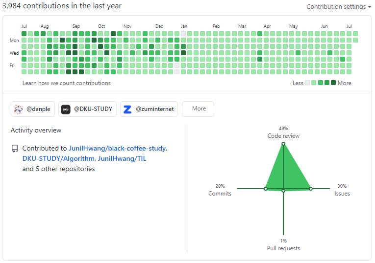

`와.. 벌써 2021년이구나, 시간 참 빠르다` 라고 말한지 얼마 안 된 것 같은데 벌써 2021년의 반이 지났다. 작년에는 한 달 마다 회고를 작성했는데, ~~너무 귀찮아서~~ 올 해는 상반기, 하반기 회고만 작성해야겠다.

## 1. 2021년 목표에 대한 회고

작년 12월에 [2021년 계획](https://junilhwang.github.io/TIL/Writing/02-2021-%EA%B3%84%ED%9A%8D/)을 세웠다. 과연 얼마나 잘 지켜지고 있는지 검토해보자.

### (1) 올해 초 목표들

- 1순위
  - [ ]  일일 영어
    - 1월 한 달 동안은 열심히 했다.
    - 그리고.. 아무 일도 없었다.
  - [ ]  개발 서적 공부
    - 못 읽었다. 아니 안 읽었다.. 😂
- 2순위
  - [x]  저축
    - 생각보다 열심히 했다.
  - [x]  사이드 프로젝트
    - 4월까진 열심히 했다.
- 3순위
  - [x]  스터디 운영
    - 사실 6월 부터 제대로 운영하기 시작했다.
    - 그런데 지금 꽤 잘 되고 있는 것 같다.
  - [x]  운동
    - 이사를 온 뒤에 거의 매일 자전거를 타고 있다.
  - [ ]  집밥 먹기
    - 매우 실패!
  - [x]  이사
    - 나름 잘 했다.

### (2) 문제점 탐색

사실 올 해의 주된 목표는 영어였다. 1월 한 달은 열심히 했는데 그 이후에는 제대로 하질 못했다. 핑곗거리를 늘어놓자면, 회사에 크고 작은 변화들이 생기면서 너무 바빠진 탓도 있고, 제일 큰 이유는 본질적으로 **내가 개발 공부에 더 큰 재미를 느끼고 있기 때문**이다. 4월까지 단쿠키 사이드 프로젝트를 하면서 거의 대부분의 시간을 사이드 프로젝트에 투자했다.

비슷한 이유로 **개발 서적을 보는 것 보단 코드를 치는 것에 더 재미를 느껴서**인지 공부를 할 때도 서적 보단 코드 위주의 공부를 하고 있다.

일단.. 영어는 지금 당장 손에 잡히지 않고 있다. 사실 별 생각이 없는걸지도..

그래서 그냥 본능에 충실하기로 했다 ~~(동물도 아니고.. 니가 정녕 인간이냐?).~~ 스트레스를 받으며 공부하기보단, 재미를 느끼며 공부하는게 건강에 더 좋지 않을까? ~~(이게 뭔 🐶소리야!)~~

## 2. 업무 회고

사실 작년에는 일이 막 엄청 많진 않았다. 적당히 워라벨을 즐길 수 있는 수준의 업무량이었고, 야근도 하지 않았다. 그런데 올해에 새로운 대표님이 오시면서 회사에 큰 변화의 폭풍이 몰아쳤고, 이러한 과정에서 많은 인력이 나가고, 그 와중에 서비스를 개편을 하고, 테크핀 서비스를 시작하면서 미친듯이 바빠졌다.

### (1) 스타트줌

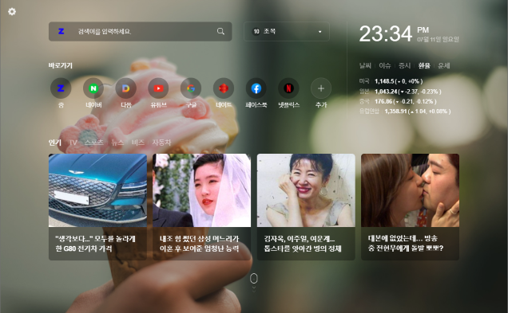

작년 말 [스타트줌](https://start.zum.com)이 기획되어 개발을 시작했고, 올해 초에 오픈했다. 트래픽은 어느정도 있는데 광고도 없고 **서버 유지비만 소모되고 있어서 계륵 같은 서비스**가 되어 버렸다. API도 직접 만들고, 프론트도 직접 만들었지만.. 사실 애정하는 서비스는 아니다. 다만 크롬 전용으로 기획된 서비스라서 IE를 신경쓰지 않아도 된다는 점!

지금은 다른 개편 서비스 때문에 방치된 상태지만.. 언젠간 더 좋은 서비스로 발돋움 할 날이 있겠지 싶다. 지금은 기능이 없어도 너무 없다.

### (2) 크롬 확장프로그램

> 확장프로그램 개발 과정은 [이 링크](https://zuminternet.github.io/Zum-Chrome-Extension/)에서 확인할 수 있습니다.

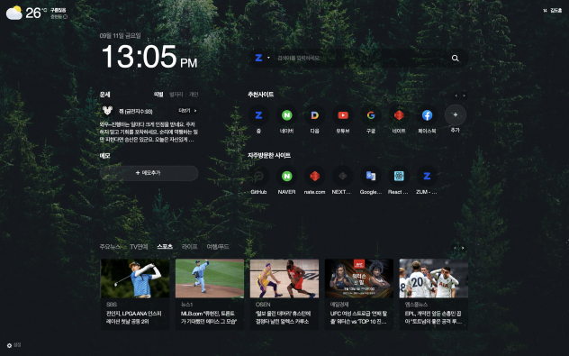

사실 스타트줌이 기획된 이유가 확장프로그램 퀄리티가 나쁘지 않아서(?) 였다고 하는데.. 나는 확장프로그램이 더 좋다. 나름 잘 사용하고 있기도 하고. 기획에서 마음만 먹으면 이것 저것 기능을 붙일 수 있을텐데 지금 기획자 분들도 너무 정신없어서 확장프로그램도 기억 저 편으로 사라진 것 같다.

나름 [줌닷컴](https://zum.com)과 [스타트줌](http://start.zum.com)을 통해 홍보하면서 사용자가 많이 늘었다. 그 과정에서 자잘한 버그도 많이 발생했고, 유지보수를 진행했다.

제일 유의미한 유지보수는 확장프로그램의 게시 검토 시간을 단축한 부분인데, 기존에는 전체 도메인에 대한 policy를 정의했다.

```json
// manifest.json의 일부
{
  // ...불필요한 내용 생략
  "permissions": [ "bookmarks", "topSites", "*://*", "chrome://favicon/*"],
}
```

이렇게 `*://*` 를 사용하면 모든 도메인에 대한 권한을 허용하게 되는데, 이럴 경우 게시 요청이 승인되는데 4~5일 정도 소요된다.

그래서 정말 필요한 API 권한만 허용하도록 변경했다.

```json
// manifest.json의 일부
{
  // ...불필요한 내용 생략
  "permissions": [ "bookmarks", "topSites", "https://appapi.zum.com/*", "chrome://favicon/*" ],
}
```

그래서 이제 게시 요청을 하면 1~2일만에 승인된다.

### (3) 줌닷컴 개편

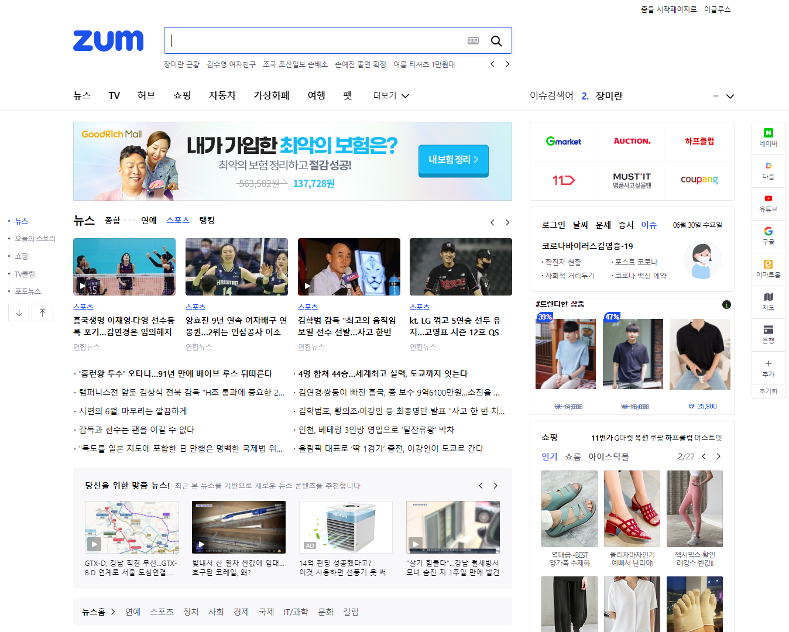

이런 날이 올 줄 몰랐는데, [줌 닷컴](http://zum.com)의 레거시 코드를 청산하고 `NodeJS + Vue.js`로 다시 만들었다. 내 사수가 프론트를 담당했고, **나는 프론트에서 사용되는 API와 Admin을 만들었다.** 3월 초에 개발을 시작하여 5월 1일에 배포했고, 약 한 달 정도 자잘한 버그를 수정하며 유지보수를 진행했다.

두 달 동안 어드민 지옥에 빠져 살았다. 그렇게 많은 기능을.. 그 짧은 시간 동안 만들었다니.. 덕분에 어드민에도 버그가 많아서 지금까지 자잘한 핫픽스 배포를 하고 있다.

이 외에도 크고 작은 이슈들이 있었는데 여기에 늘어놓기엔 내용이 많아서 나중에 기회가 된다면 기술 블로그에 작성할 예정이다.

### (4) 신입 개발자 채용

> 이에 대한 내용은 [회사 기술블로그](https://zuminternet.github.io/)에 올린 [주니어 프론트엔드 개발자의 채용 프로세스 참여 후기](https://zuminternet.github.io/zum-front-recurit-review/)로 대체하겠다.

그래도 개인적인 이야기를 조금 해보자면, 채용을 진행하면서 일단 이전에 있던 **자잘한 이직 욕구들이 많이 해소**되었다. 좋은 팀을 만들어가기 위해선 먼저 스스로가 변화해야 한다는 점도 알았다. 그리고 좋은 팀원을 채용하기 위해선 일단 나 스스로가 괜찮은 사람이여야 한다는 점도 알았다. 채용 과정에서 실무진의 기술적, 인간적인 매력을 보여줄 수 있어야 뛰어난 역량을 가진 사람들을 붙잡을 수 있는게 아닐까?

사실 **네카라쿠배야당토** 같은 메이저 기업은 인력에 대한 아쉬움이 크지 않으리라 생각한다. 지원자가 넘쳐나니까!

그러나 우리 회사는 그렇지 못하다. 이미 뛰어난 역량을 가진 사람은 메이저 기업에 다 들어갔고, 우리 회사는 남은 사람들 중에서 보석을 찾아야 하는 입장이다. 그래서 내세울 수 있는 것은 **사람과 팀**이라고 생각한다. 그런 매력을 어필하기 위해서 꽤 많이 노력했고, 덕분에 정말 좋은 분들과 함께 일할 수 있게 되었다.

그리고 아직 확정은 아니지만, 저번 주에 기술 면접까지 통과한 분이 있다. 부디 꼭 함께 하길 기도하는 중이다.

### (5) 신규 테크핀 서비스 진행

새로 합류한 팀원들과 함께 테크핀 서비스를 만드는 중이다. 기획서도 100페이지가 넘고, 줌인터넷에서 제일 큰 몸집도 크고, 도메인도 복잡한 서비스인 것 같다.

그래도 팀원들이 생각보다 빠르게 업무에 적응하고 있어서 잘 마무리할 수 있을 것 같은 느낌이 든다. 다만.. 마감 기간이 너무 촉박해서 걱정이다.

빠르게 잘 만들기... 참 어렵다. ~~그게 가능하면 다른 회사에 갔겠지!~~ 는 푸념이고.. 뭐 잘 해야지 별 수 있나.

### (6) 조직 개편

6월 말에 조직 개편이 있었고, 아예 프론트엔드 파트가 신설되는 과정에서 내가 파트 리더가 되었다. 이미 시니어 프론트엔드 개발자는 **네카라쿠배야당토** 같은 메이저 기업에 다 들어가서.. 나 처럼 회사에 남아있는 주니어 개발자가 리더가 되는 사태가 벌어진 것이다.

그래도 프로젝트를 보는 시각도 넓어지고 팀원들과 이것 저것 해볼 수 있는 권한이 작게 나마 생긴 것 같아서 좋다.

신설 팀이라서 지금은 특별한 문화가 없는 상태다. 그래서 다른 회사들이 가지고 있는 좋은 문화들을 벤치마크 할 생각이다.

**혹시 좋은 문화가 있다면 공유 부탁드립니다!**

## 3. 개발 역량 강화

올 해는 대체 뭘 했나 하면서 목차를 만들어봤는데.. 어라..? 생각보다 많이 했다.

### (1) 방과후 수업 강사

[인천금융고등학교](http://finance.icehs.kr/main.do)에서 **웹디자인 기능사 실기** 방과후수업 강의를 하는 중이다. 대면으로 하진 않고, 계속 온라인으로 진행 중이다.

략 20개의 동영상을 녹화해서 올려놓고, 방과후수업을 신청한 학생들이 온라인 강의를 보는 형태로 진행했다. 자잘한 질문은 카카오톡을 통해서 주고 받았다.

생각보다 수입이 나쁘지 않았다. 무엇보다 시간을 많이 투자하지 않아도 되서 좋았다.

### (2) 단쿠키

> **단쿠키**는 내 모교에 재학/졸업중인 사람들이 학교 구성원을 위한 커뮤니티를 만들기 위해 진행한 사이드 프로젝트이다. 나는 1월 ~ 4월까지 4개월 정도 참여했고, 회사일 때문에 참여가 어려울 것 같아서 중도 하차했다.

단쿠키 프로젝트에 참여하면서 생각보다 공부를 많이 했고, 처음 접해보는 기술 스택도 많았다.

1. [NestJS](https://nestjs.com/)
  - 사실 NestJS는 작년에도 사이드 프로젝트를 하면서 어느 정도 익숙해진 상태였다. 그런데 이번에 조금 더 deep하게 써볼 수 있었다.
  - Spring 처럼 필요에 따라서 Standard App으로 구성하기도 했고, NestJS에 포함된 다양한 기능들을 많이 써볼 수 있었다.
2. graphql
  - 사실 나는 graphql을 사용할 생각은 없었는데 개발 팀장인 [도비](https://github.com/dobest27)의 의견으로 graphql을 사용하게 되었다.
  - 생각보다 사용 방법이 무척 쉬웠고, 사용성도 매우 좋았다.
  - 다만 시중에 나와있는 자료가 많지 않아서 정보에 대한 탐색이 무척 어려웠다.
  - 특히 실무에서는 많이 사용되지 않는 편인 것 같다.
  - 회사에서 사용된다고 하더라도 대체로 내부 서비스 용도로 사용되고 있고, 사용자 단에서 사용되는 경우는 매우 드물어보인다.
3. unit test, e2e test
  - 작년에 열심히 TDD 관련 공부를 했으니, 이젠 적용할 때도 되었지! 하며 혼자서 열심히 테스트 코드를 작성했다.
  - Spring보다는 테스트 코드 작성이 무척 쉬웠고 괜찮았다.
  - 다만 e2e 테스트에 대한 만족도가 낮았다.
  - 성능 테스트도 해봤으면 어땠을까? 하는 아쉬움이 조금 있다.
4. playwright
  - playwright을 이용해서 학교의 시간표를 전부 읽어들였다.
  - 시간표 때문에 무수히 많은 삽질을 했다.
  - 그래도 재밌는 툴을 알게 되어서 좋았다.
5. typeorm
  - Java 진영의 JPA 같은 느낌이랄까?
  - 그런데 JPA와 다른 점이 너무 많아서 다루기가 조금 힘들었다.
  - 확실히 RDB를 다룰 때는 java가 node보단 확실히 기술적인 성숙도가 높은 편이라고 생각한다.
  - 아쉬움이 많은 기술스택이다.
6. react native
  - 웹과 앱은 결이 다르다는 것을 다시 한 번 깨달았다.
  - 코드 작성은 그렇다 치고.. 디버깅이 무척 힘들었다.
  - 그래서.. 뭐랄까.. 경험하고 싶지 않은 영역이 되어 버렸다.
7. [jira](https://www.atlassian.com/software/jira?&aceid=&adposition=&adgroup=95003645449&campaign=9124878702&creative=415542752365&device=c&keyword=jira&matchtype=e&network=g&placement=&ds_kids=p51242189318&ds_e=GOOGLE&ds_eid=700000001558501&ds_e1=GOOGLE&gclid=Cj0KCQjwraqHBhDsARIsAKuGZeGegz5pA0Tm-PewV5Ej1jCPs9rPAlc5BCYYI63zB1BEQImjZiKrBukaAn0DEALw_wcB&gclsrc=aw.ds)
  - 프로젝트 관리 툴로 사용해볼 수 있었다.
  - deep하게 써보진 않았지만, 확실히 기능도 많고 편리했다.
  - 회사에서도 사용하면 좋을 것 같은데.. 팀장님이 추진하다가 아쉽게도 무산되었다.

프로젝트를 진행하면서 계속 정리를 했으면 좋았을텐데.. 지금은 어떤 것들을 했는지 자세히 기억나지 않고 있다. 너무 개발에만 집중해서 그런가?

앞으로는 프로젝트를 진행할 때 계속 정리할 수 있도록 습관을 만들어야겠다.

### (3) ATDD 3기

[nextstep](http://edu.nextstep.camp)에 [ATDD강의](https://edu.nextstep.camp/s/b7KHeSY2)가 열려서 바로 신청했다. 이 과정에서 JPA에 대해 몰랐던 부분도 많이 공부했고, TDD 강의 보다 더 실무적으로 유용했다. 그래서 회사에서 사용 중인 모바일 API에도 적용해놨다.

다만 아쉬운 점은 단쿠키 + Java CC 11기 리뷰어 활동이랑 겹쳐서 3월 ~ 4월은 매일 새벽까지 작업했다. 덕분에 꼼꼼하게 체크하지 못한 부분도 있었고, 공부를 덜 한 부분도 있어서 아쉬움이 남았다.

최종 과제 이후의 보너스 과제도 해보고 싶었지만 도저히 할 수 있는 물리적인 시간이 부족해서 포기했다.

- 1주차: [https://github.com/JunilHwang/atdd-subway-map](https://github.com/JunilHwang/atdd-subway-map)
- 2주차: [https://github.com/JunilHwang/atdd-subway-path](https://github.com/JunilHwang/atdd-subway-path)
- 3주차: [https://github.com/JunilHwang/atdd-subway-favorite](https://github.com/JunilHwang/atdd-subway-favorite)
- 4주차: [https://github.com/JunilHwang/atdd-subway-fare](https://github.com/JunilHwang/atdd-subway-fare)

### (4) Java CC 11기 리뷰어

ATDD와 거의 동시에 [Java CC 11기](https://edu.nextstep.camp/s/ApJ4Ca71)가 시작되었다. 리뷰어로 활동하면서 미션까지 진행하다보니 말도 못하게 힘들었다. 거기에 회사 일도 겹쳐서 3월은 나에게 있어서 최악의 한 달이나 다름 없었다.

그래서 본의 아니게 [코덕](https://co-duck.com) 에서 3월에 1등을 달성했다.

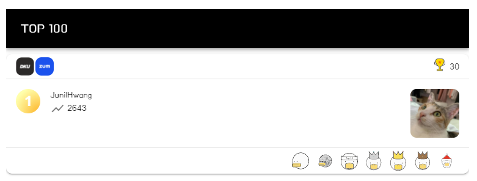

어쨌든 이렇게 매번 리뷰어로 신청하다보니 이제 리뷰어 활동이 크게 부담 되진 않고 있다.

### (5) 우아한 테크코스 Pro2 리뷰어

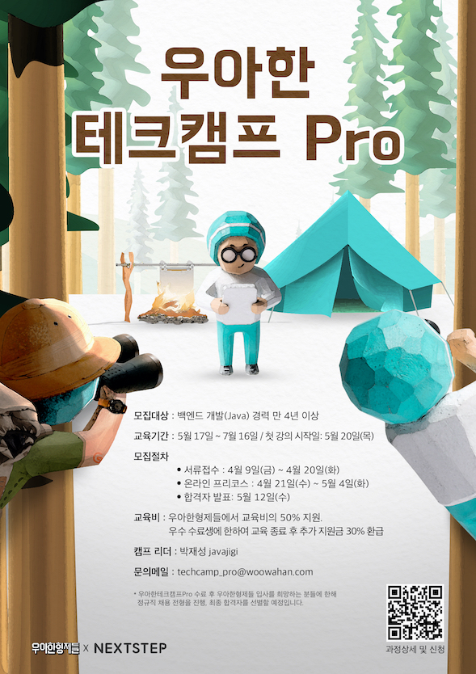

ATDD까지 수강을 완료한 덕분인지 [우하한 테크코스 Pro 2기](https://edu.nextstep.camp/s/ffeVDScX) 리뷰어로 활동할 수 있는 기회를 얻을 수 있었다. 사실 내가 리뷰어로 활동하는게 맞는건가? 싶은 의문을 지금도 가지고 있다.

- 나는 백엔드 전문 개발자도 아니고,
- 지금은 회사에서 아예 프론트엔드 파트 소속이고
  (하지만 아직 담당하고 있는 백엔드 프로젝트가 3개 있다..)
- 무엇보다 경력이 무척 부족하다. 같이 리뷰하는 분들과 많이 비교된달까?

그럼에도 불구하고 놓칠 수 없는 기회인 것 같아서 리뷰어로 활동하겠다고 수락했다. 덕분에 미션을 진행하는 분들과 더불어 스스로도 많이 성장할 수 있었다고 생각한다. 다만 이렇게 공부하고 배운 것들을 프론트 업무에 잘 녹여낼 수 있어야겠지만..

그냥 요즘 얼떨떨 하다. 공부를 더 많이 해야겠지 싶다.

### (6) 블랙커피 스터디 Level 3

6월에 기다리고 기다리던 [블랙커피 스터디 Level 3](https://edu.nextstep.camp/s/595ySo7M) 과정이 생겼다. 그래서 바로 신청했다.

올 해에 가장 재밌게, 그리고 열심히 코딩을 하던 순간이 아닌가 싶다.

이 스터디를 하기 전에 [프레임워크 없는 프론트엔드 개발](http://www.yes24.com/Product/Goods/96639825) 이라는 책을 읽었다. 단순히 가상 DOM 까진 아니여도 DIFF 알고리즘을 적용하는 과정이 무척 흥미로웠는데, 이 부분을 스터디를 진행하면서 녹여냈다.

- step1: [나만의 유튜브 강의실](https://github.com/next-step/js-youtube-classroom/pull/1)
  - iframe을 무한 스크롤로 불러올 때 다시 렌더링 되는 부분 때문에 성능이 많이 떨어져서 아쉬웠다.
  - 다음에 진행할 땐 성능 최적화좀 해야지..
- step2: [지하철 노선도 SPA](https://github.com/next-step/js-subway-admin/pull/1)
  - 이 때 DIFF 알고리즘을 적용했다.
  - 이 과정에서 삽질을 좀 많이 했으나, 어쨌든 렌더링 최적화를 할 수 있어서 만족!
- step3: [지하철 노선도 SPA + API](https://github.com/next-step/js-subway-admin/pull/6)
  - 특히 3주차 미션이 절정이었는데, API를 직접 NestJS 처럼 만들어봤다. 이 때 **나는 정말 코딩을 즐기고 있다는 것** 을 알게 되었다.

무엇보다 스터디를 진행하는 과정에서 보석 같은 분을 뵐 수 있었고, 사내 추천으로 우리 회사에 지원했다. 지금은 기술 면접까지 합격한 상태이다. 부디 같이 일할 수 있기를 🙏

그런데 스터디가 제대로 끝나지 않았다. Step3 회고 때 사람들이 많이 불참해서 아예 과정을 리팩토링하여 이월하기로 결정되었다. 그래서 7월에 다시 진행할 예정이다.

이번에는 아예 새로운 코드로 만들어볼 계획이다. 여태까지와는 다른 방식으로, 완전히 React 스럽게 구성해봐야지

### (7) 독서

음.. 글을 쓰고 있는 지금은 어떤 책을 읽었는지 정확하게 기억나지 않고 있다. 다음엔 책을 읽자 마자 바로 리뷰를 작성하던가 해야지.. 😂

그냥 기억나는 책 하나만 손에 꼽자면 앞서 언급한  [프레임워크 없는 프론트엔드 개발](http://www.yes24.com/Product/Goods/96639825) 이다. 내용도 크게 어렵지 않고, 가볍게 읽기 좋은 책이었다. ~~일 하기 싫을 때 읽었다.~~

이 책을 통해서 `replaceWith` 라는 DOM API를 처음 알게 되었는데, 직접 사용해보니까 그렇게 편리한(?) API는 아닌 것 같았다. 그래도 `outerHTML` 의 찝찝함을 해결해줄 수 있어서 좋았다.

책을 통해서 얻은 수확은 단순히 가상 돔을 사용하는 게 아니라 diff 알고리즘을 통해서 렌더링을 최적화 하는 부분이다. 이 외에도 router나 store의 경우 직접 구현해본 적이 있어서 사실 크게 흥미롭진 않았다.

하반기에는 제발 독서 좀 하자!

### (8) 단국대 Javascript Study

몇 달 전부터 스터디 만들어서 진행해보자고 마음만 먹고 실행에 옮기지 않고 있었는데, 무슨 바람이 불어서인지 6월에 급하게 커리큘럼을 만들고 [스터디 모집](https://github.com/DKU-STUDY/recruit/issues/1)을 진행했다. 일단 가볍게 10명만 모집해서 마루타(?)를 해보기로 했다.

스터디는 다음과 같이 진행된다.

- 1주차: Todo List 만들기
- 2주차: Webpack + TodoList 리팩토링
- 3주차: ExpressJS로 API 서버 만들기
- 4주차: API 연동
- 5주차: 배포하기

생각보다 구성원들이 잘 참여중이고, 다들 열정이 넘쳐서 탈이다. 아마 잘 마무리 될 것 같다. 8월이 되면 똑같은 과정을 조금 보수해서 2기를 모집하고, level 2도 만들어서 진행해볼 생각이다.

지금은 계속 내가 리뷰하고 있지만, 2기 부터는 1기를 잘 수행한 분들이 리뷰해주는 형태로 진행해볼 생각이다. 잘 되면 좋겠지만... 잘 될까..?

## 4. 이사

- 5월 말에 이사했다.
  - 경기도 성남 → 서울시 서초구 반포동
  - 11평 → 14평
  - 월 이자 10만원 → 약 40만원
  - 회사까지 대중교통 1시간 → 걸어서 25분, 자전거 10분
- 이 과정에서 처음으로 은행 대출을 받았다.
  - 보증금 2억 중에 1.8억을 대출 받았다.
  - 대출 상품은 [허그안심전세대출](https://www.khug.or.kr/hug/web/ig/dl/igdl000001.jsp)
    - 최대 90%까지 대출 된다.
    - 국민은행에서 받았고, 최저 금리 2.5% 인데.. 말 그대로 최저금리다. 모든 혜택을 다 받아야 한다.
- 가구를 많이 샀다.
  - 모션 데스크 + 모니터 암
  - 워시타워(세탁기 + 건조기)
  - 로봇 청소기
  - 침대 프레임
  - 에어컨
  - 주인님 물품
    - 캣타워
    - 캣휠
- 덕분에 일시적으로 모든 현금을 다 소진했다.. 지금은 다시 모으는 중!

이사를 오면서 제일 아쉬운 점은.. 옥상 풍경이다.

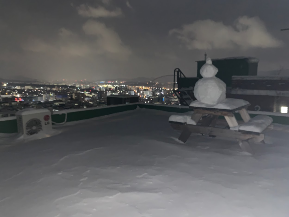

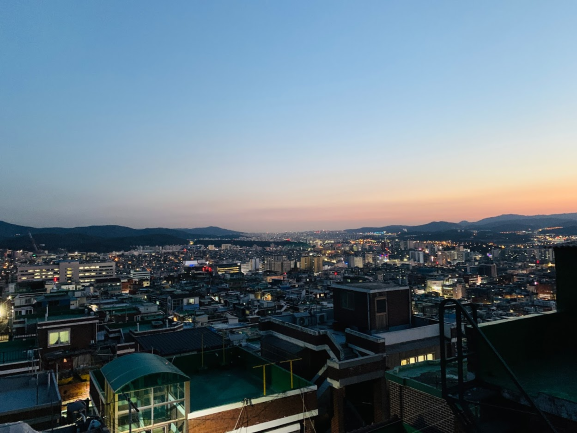

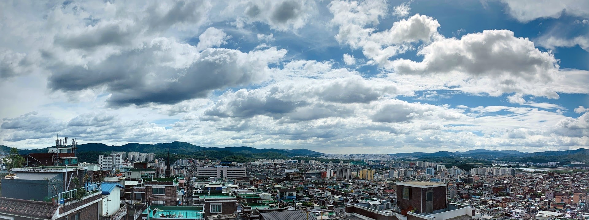

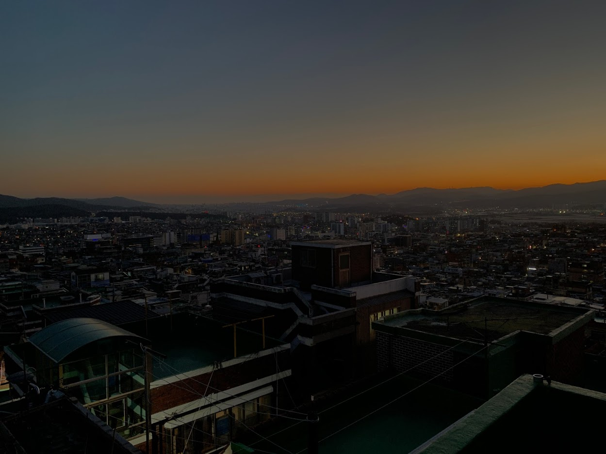

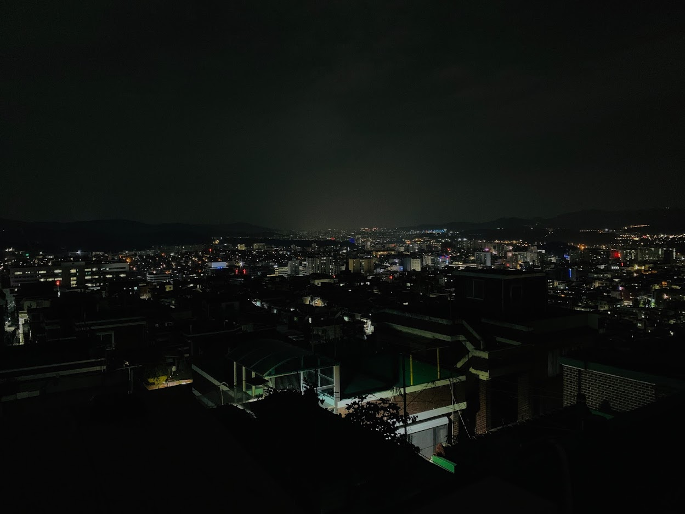

이런 풍경을 매일 볼 수 있었는데.. 그럴 수 없다는 점이 참 아쉽다. 이 동네에서 만난 고양이들도 좋았는데, 지금 키우고 있는 포동이의 어미도 이제 볼 수 없다는 점도 아쉽다.

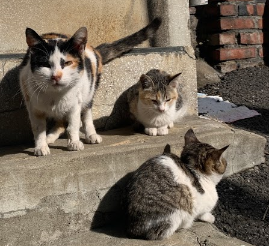

이렇게 작은 고양이였는데!

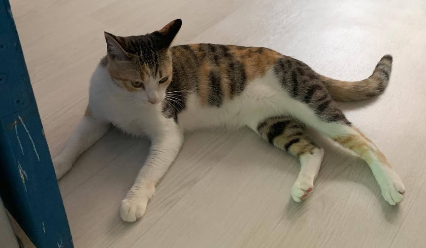

지금은 어엿한 성묘가 되었다.

어쨌든 이제 이사를 왔고, 이사를 온 날 바로 걸어서 한강에 갔다.

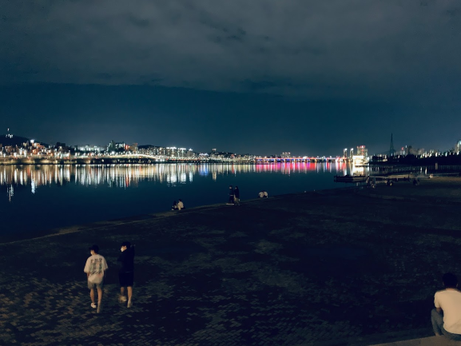

걸어서 2km 정도면 갈 수 있어서 가볍게 산책하는 겸 갔다오기 좋은 거리다.

회사에서 집까지도 2km면 갈 수 있어서 요즘에는 매일 자전거를 타고 출퇴근 하고 있다.

이제 대중교통을 이용하지 않아서 그런지 회사를 갔다 왔을 때 피곤하지 않아서 좋다.

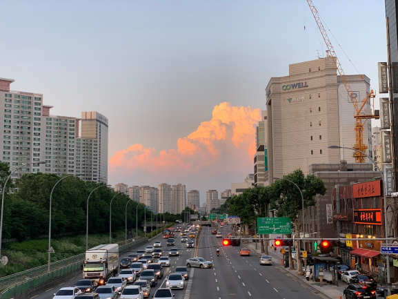

마지막은 최근에 찍은 사진으로 마무리!

## 5. 하반기 계획

- 일단 영어공부는 포기했다.
- 하반기에 어느 정도 한가해지면 수영을 다시 시작할 생각이다. ~~(대체 언제..?)~~
- 이제 독서 위주의 공부를 좀 해보자.
- 블로그 포스팅도 꾸준히 해보자.
  - 노션에서 초안을 작성하니까 포스팅 하기가 더 수월하다.
- 좋은 팀(파트)을 만들어가자.
  - 새하얀 도화지에 그림을 그리듯, 수려한 팀을 만들어보자.
  - 사실 모 아니면 도 아닌가..?
- 단국대 스터디 꾸준히 운영하기
  - 우리 학교도 커뮤니티 구성이 필요하다.
  - 밑 바닥부터 천천히 쌓아올려보자.
  - 급하게 하지 말고, 천천히 차곡차곡!
  