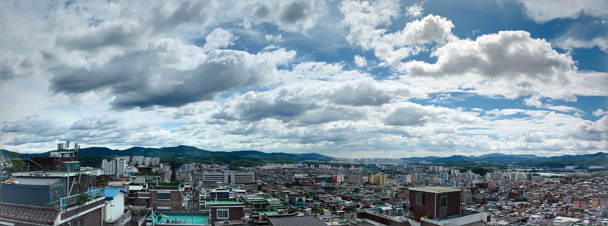
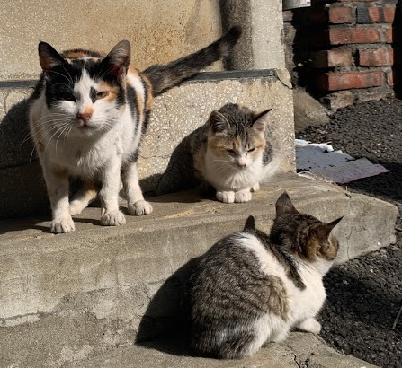

---

title: 주니어 개발자의 2021년 상반기 회고
description: 주니어 개발자의 2021년 상반기 회고
sidebarDepth: 2
date: 2021-07-12 02:30:00
image: /Review/2021-year/end/thumbnail.jpg
hitUrl: https://hits.seeyoufarm.com/api/count/incr/badge.svg?url=https%3A%2F%2Fjunilhwang.github.io%2FTIL%2FReview%2F2021-year%2Fend%2F&count_bg=%230099FF&title_bg=%23555555&icon=&icon_color=%23E7E7E7&title=%EC%A1%B0%ED%9A%8C%EC%88%98&edge_flat=true

feed:
  enable: true

---

# 주니어 개발자의 2021년 상반기 회고


끝날 것 같지 않던 2021년이 끝났다. 보인다.
올해는 작년보다 더 바빴고, 더 힘들었고, 더 많이 성장했다고 자부할 수 있을 것 같다.
그래서 내년이 더 기대되기도 하고 동시에 부담도 된다.

올해를 잘 정리하기 위해, 잘 마무리하기 위해 회고를 쓴다.

## 1. 회사 프로젝트 회고

올해 초에 새로운 대표님이 오시면서 정말 공격적으로 다양한 서비스를 개편하고, 오픈했고, 앞으로도 오픈할 예정이다.

### (1) 줌프론트(zum.com) 개편


올 해에 제일 먼저 진행한 큰 규모의 프로젝트는 **[줌프론트](http://zum.com) 개편**이다. 기존의 줌프론트는 `SpringBoot + Template Engine` 으로 구성되어 있었다. 이 때의 문제점은 다음과 같다.

- 개발 퍼포먼스가 좋지 않다.
  - SpringBoot 환경에서 작업하기 때문에 수정하고 빌드하는 과정을 계속 거쳐야한다.
- UI 모듈화가 어렵다.
  - 기본적으로 Template Engine을 사용하게 되면 모듈화 하는 것 자체가 무척 어렵다.
  - 모듈화를 한다고 해도 javascript가 아니기 때문에 이를 재활용하기가 쉽지 않다.
- 앞선 내용의 연장선으로, **불필요하게 Ajax 요청을 남발하게 된다**
  - 컴포넌트를 다시 보여줘야할 경우, 혹은 데이터를 갱신해야 되는 경우 불필요한 ajax 요청을 남발하게 된다.
  - 무엇보다 ajax로 단순하게 데이터만 가져오는 것이 아니라 아예 html template을 가져오는 것이다.
  - 이에 따라 호출 횟수 자체도 많아지고, 네트워크 통신량도 많아진다.
  - 그렇기 때문에 서버에 부하가 불필요하게 생기게 되며, instance를 추가적으로 붙여야 하는 경우도 생긴다.

그리고 근본적인 문제는 바로 `10년이 넘은 레거시의 집약체` 라는 것이다.

- 정말 수없이 많은 작업자들이 이 프로젝트를 거쳐갔다.
- 알 수 없는 코드, 사용하지 않는 코드가 무척 많이 존재한다.

그래서 아예 `NodeJS + VueJS` 로 프로젝트를 처음부터 구성하여 다시 만드는 작업이 필요했다.


필자는 이 때 프론트 프로젝트에는 관여하지 않았고, Backend와 Admin을 만들었다.

특히, 어드민의 경우 마찬가지로 jQuery + Angular로 구성된 이상한(?) 프로젝트였으며 기능도 무척 많았는데, 이를 전부 신규 어드민으로 옮기는 작업을 진행했다.


이 때 처음으로 Spring Batch도 사용해보고, Vue Composition API도 만져보고, 운영팀이 원하는 각종 편리한 기능을 추가하기 위해서 자잘한 작업을 많이 한 것 같다.

어드민 뿐만 아니라 백엔드(Internal API)도 작업했다. 어드민에서 생성된 데이터를 [줌프론트](http://zum.com)에서 필요한 형태로 정제하여 내려보내는 과정이 필요하기 때문이다.


프론트에서는 15초마다 Internal API를 호출하여 캐싱하고 있었고, Internal API는 다시 각각의 property에 적합한 스케쥴 시간을 정하여 데이터를 캐싱했다.

가볍게 정리하자면 다음과 같은 과정을 거친다.

1. 배치에서 통계를 기반으로 인기 콘텐츠 생성 + 어드민에서 데이터 생성
2. Internal API에서 DB 및 외부 API에 접근하여 필요한 데이터를 조합
3. 데이터 성격에 따라 30초, 60초, 180초 단위로 스케쥴링
4. 한 개의 endpoint에 모든 데이터를 출력 → 줌프론트에서 Internal API를 15초 단위로 호출하고 캐싱

정말 많은 이슈들이 있었는데, 기억나는 한 가지를 뽑자면,

스케쥴을 하는 과정에서 DTO(Data Transfer Object)를 적합하게 사용하지 않을 경우 JPA의 연관관계 맵핑 때문에 불필요하게 DB에 접근하는 일이 발생했다.

- service layer에서 repository에 접근하여 데이터를 가져온 다음에 캐싱한다.
- facade layer에서 service 로직을 호출한 다음에 데이터를 정제한다.
- 그런데 아무리 캐싱된 데이터라고 하더라도 JPA 객체이기 때문에 연관관계 매핑으로 정의된 프로퍼티에 접근할 경우 DB에 요청을 날리게 된다.

그래서 한 번 장애가 난 적이 있었고, 위와 같은 내용을 인지한 다음에 바로 수정했다.

배치와 관련된 작업도 있었는데 지금은 잘 기억이 가물가물 하다.

이 당시에는 회사에 프론트엔드 파트가 없었고, 전부 `풀스택 서비스 개발자`의 역할로 프로젝트에 참여했기 때문에 필자 또한 Java 공부를 좀 했는데, 이제는 프론트엔드 파트 소속이라서 마음 편하게 프론트엔드만 공부하고 있다.

필자는 Java라는 언어를 그렇게 막 싫어하진 않는다. 다만, 똑같은 기능을 만들더라도 개발 퍼포먼스가 무척 좋지 않아서 싫어할 뿐.. 수정된 기능 한 번 확인하려고 하면 너무 많은 과정을 거쳐야한다 🥲

### (2) 투자 서브도메인(invest.zum.com)


투자 서브도메인은 두 차례의 오픈 과정을 거쳤다.

- 1차 오픈: `9월 초` (정확한 시점은 가물가물 하다.. 🥲)
  - [메인페이지](http://invest.zum.com)
  - [투자노트](http://invest.zum.com/investment)
    - 메인페이지
    - 필진 목록
    - 필진 상세페이지
    - 투자노트 상세페이지
    - 최신글 페이지
  - 종목 상세페이지
  - 뉴스 상세페이지
  - 국내지수 상세페이지
  - 해외지수 상세페이지

5월에 기획을 시작했고, 7월 초에 오픈을 목적으로 작업을 진행했다. 그런데 중간에 기획이 엎어졌고, 다시 8월말 오픈을 목적으로 작업하다가 내부적으로 계속 이슈가 있어서 9월 초에 오픈했다.

- 2차 오픈: `12월 24일`
  - [국내증시](http://invest.zum.com/internal)
    - 국내증시 메인페이지
    - 전체 업종 페이지
    - 업종 상세페이지
    - 카테고리별 랭킹 페이지
    - 큐레이션(리포트 PICK, 급등주 PICK) 페이지
  - [해외증시](http://invest.zum.com/world)
    - 해외증시 메인페이지
    - 해외 증시 실시간 토론바

다시 2차 오픈을 위한 기획이 9월에 시작되었다. 2차 오픈의 핵심은 바로 `메코차트`인데, [TradingView](https://kr.tradingview.com/heatmap/stock/?color=change&dataset=SPX500&group=sector&size=market_cap_basic)와 [finviz](https://finviz.com/map.ashx?t=sec_all)를 벤치마킹 하였다.

아직 국내에는 이를 제대로 활용하는 서비스가 없었기 때문에 최대한 빠르게 이를 구축하고 오픈 하는 것을 목표로 했다.

사실 메코차트를 제외한 나머지는 프론트엔드 개발이 2주 정도 소요되었고, 백엔드 쪽에 퇴사자가 무척 많고 인수인계가 제대로 되지 않다보니 일정이 계속 지연됐다. 어쨌든 우여곡절 끝에 12월에 오픈할 수 있었다.

사실 이 프로젝트에 대한 기술적인 이슈는 다루고자 한다면 정말 끝이 없다.

- 프로젝트 구축
- 코어 프로젝트 개선
- 빌드 시간 개선
- 컴포넌트 재활용
- Server Side Rendering
- 렌더링 최적화
- 초기 렌더링 시간 단축
- 메모리 누수 해결
- iframe 정교하게 다루기
- IE 호환성 해결
- SPA를 고려하지 않고 만들어진 사내 라이브러리 사용하기
- 부하 테스트

그리고 기술 외적인 이슈도 있다.

- 초기 기획자 퇴사
- 초기 디자이너 퇴사
- 거의 모든 초기 개발자 퇴사
- 대부분의 인프라 개발자 퇴사
  - 인프라 개발자의 업무 부하가 거의 150%
  - 각종 인프라 이슈에 대한 해결이 무척 느리게 진행됨
- 수 없이 많은 슬랙 메시지와 정돈 되지 않는 각종 업무들
  - 사실 이것 때문에 너무 스트레스를 많이 받았다
  - 업무가 계속 슬랙으로 요청이 오고
  - 기록도 슬랙으로 되는데
  - 아무래도 신규 프로젝트고 회사에서 제일 중요하게 생각하는 프로젝트다보니 각종 의견이 지속적으로 올라왔다.
  - 도저히 업무 파악을 할 수 없는 지경..
  -


어느 날 갑자기 계속 슬랙으로 오는 업무 요청 때문에 급발진 해서 남긴 내용들이다.

결과적으로 저렇게 슬랙을 남긴 다음에 대부분의 업무와 관련된 내용은 노션을 통해서 진행되었다. 덕분에 일하기가 한결 편해졌다.

어쨌든, `투자 서브도메인`에 대한 내용은 따로 정리해볼 예정이다. 아마 기술블로그에 정리해서 올릴 것 같다.

### (3) 모바일줌(m.zum.com)


[모바일줌](http://m.zum.com)의 경우 특별한 기능이 추가되거나 하진 않았다. 다만 리팩토링 작업을 진행했다.

먼저 백엔드의 경우 인수테스트를 추가했다. DB가 엮여있는게 아니라서 쉽게 작업할 수 있었다. 덕분에 작업 시간이 많이 단축 되었다.

프론트엔드의 경우 신규 core 프로젝트를 적용하면서 배포 시간도 단축 했고, 복잡한 캐싱 로직도 제거했다.


얼추 이런 느낌이랄까?

모바일줌에 처음 SSR을 적용할 땐 `vue-server-renderer@2.2` 이였고, client manifest를 제공하지 않았다. 덕분에 SSR과 CSR을 동시에 하기 위해선 server의 template engine을 덧붙여서 사용해야 했다. 덕분에 SSR을 온전히 이해하기가 무척 어려웠다. 필자 뿐만 아니라 프론트엔드 파트의 모든 구성원이 이를 힘들어했다.

그런데 `vue-server-renderer@2.3` 부터 `client manifest`를 제공하면서 SSR에 대한 난이도가 무척 낮아졌다. 이에 대한 자세한 내용은 **[Vue SSR 제대로 적용하기 (feat. Vanilla SSR)](https://zuminternet.github.io/vue-ssr/)** 포스트에서 확인할 수 있다.

### (4) zum-portal-core-js


zum-portal-core-js는 줌인터넷 프론트엔드파트에서만 사용하는 표준화 패키지다. 처음에는 가볍게 시작한 프로젝트인데 점점 기능이 비대해져서 지금은 계속해서 기능별로 분할하고 있다.

자세한 내용은 **[Zum Portal Core JS 소개](https://zuminternet.github.io/zum-portal-core-js/)** 포스트와 **[NestJS Custom Caching Decorator 만들기](https://zuminternet.github.io/nestjs-custom-decorator/)** 포스트에서 다루고 있다.

핵심적인 내용만 요약하자면 다음과 같다.

- 백엔드는 express.js, 프론트엔드는 각종 웹팩 설정이 버무려진 표준화 패키지로 만들었다.
- 1년 정도 잘 사용하다가 기능이 점점 많아지고 있는게 느껴졌고, 예측 하지 못한 에러들이 발생하여 장애도 몇 번 발생했다.
- 그러다 NestJS를 도입했다.
- 배포 시간이 너무 오래 걸렸다.
- 프론트엔드 패키지와 백엔드 패키지를 분리했다.
- 모노레포로 관리하기 시작했다.
- 불필요한 패키지를 설치하지 않는 방식을 통해서 배포 시간을 단축했다.
- eslint도 추가했다.
- 테스트코드도 추가했다.
- 더 리팩토링해서 github에 공개할 예정이다.

언제 공개할진 모르겠으나, 빠르면 올해 안에, 늦어도 내년 1분기 안에 github에 올려놓을 예정이다.

### (5) 기타 프로젝트들

이외에도 정말 많은 프로젝트 회의에 참여했고, 추진중에 있다. 사실 2021년 한 해 동안 제일 많이 시간을 투자한 `투자 서브도메인` 프로젝트보다 앞으로 오픈하게 될 프로젝트들에 더 관심이 간다.

왜냐면 IE를 고려하지 않는 서비스를 추진하고 있기 때문이다!

어떻게 될지는 아직 미지수지만, IE를 지원하지 않는 다는 사실 하나 만으로도 무척 설렌다.

## 2. 어쩌다보니 파트리더

필자는 이제 경력이 만 2년을 조금 넘은 주니어 개발자다. 그런데 올해 7월에 프론트엔드 파트가 신설 되었고, 어쩌다보니(?) 파트리더 직책을 수행하게 되었다. 파트리더 직책을 수행하면서 했던 고민들이 무척 많았다. 이참에 정리해보려고 한다.

### (1) 채용

프론트엔드 파트가 신설 되기 이전에 프론트엔드 개발자 채용을 먼저 진행했다. 사실 이 때 까지만 해도 프론트엔드 파트가 신설되리라고 생각을 하지 못했었다.

**[주니어 프론트엔드 개발자의 채용 프로세스 참여 후기](https://zuminternet.github.io/zum-front-recurit-review/)**

채용 과정에서 정말 많이 신경 썼던 부분은 `줌인터넷에 지원하길 잘했다` 라는 생각이 들도록 하는 것이였다. 단순하게 신규 인력을 채용한다는 생각이 아니라 `줌인터넷이 지원자에게 신경을 많이 쓰고 있다`는 인상을 주고 싶었다. 그리고 정말 실력 있는, 근본이 있는 개발자 분들을 모시고 싶었다.

어떻게 해야 좋을까 고민하다가 `채용 과제를 만들어보자`는 결론에 도달했고, 어느 정도 수준의 채용 과제가 좋을까 고민하다가 일단 단순하게 **프레임워크를 사용하는 게 아니라, 프레임워크를 만들 수 있는 수준의 과제**를 만들어보자고 생각했다.

채용 과제는 [여기](https://www.notion.so/c4c70fbaa3cd4e43a299abb0824d93a9)서 확인할 수 있다. 원래는 대외비인데, 내년 부터는 채용 과제의 내용을 개편할 예정이라서 공개 되어도 사실 상관 없다. 채점표는 다음과 같다.


채용과제의 대략적인 커트라인은 60점이다. 만약 본인이 취업을 준비하는 프론트엔드 개발자라면 꼭 한 번 풀어보길 권유한다.  과제의 내용을 완벽히 이해하고 구현할 수 있다면, 즉, 90점 이상의 점수 확보가 가능하다면 어떤 회사든 취업할 수 있으리라 장담한다.

큼직한 기능은 다음과 같다.

- 컴포넌트 설계가 가능하다.
  - 객체지향이든 함수지향이든 어느정도 확장성 있는 형태로 만들 수 있어야 한다.
- 타입스크립트를 사용할 수 있어야 한다.
- 웹팩을 설정에 대해 깊게 이해하고 있다.
- 렌더링을 할 때 가상돔 혹은 DIFF 알고리즘을 적용할 수 있다.
- 전역 상태관리 라이브러리를 직접 구현할 수 있다.
- 이벤트 최적화를 할 수 있다.

과제가 어렵기 때문에 그냥 풀라고 제시한게 아니라, **제출한 모든 사람에 대한 코드리뷰**를 진행했다.


덕분에 채용을 한 번 시작하면 다른 업무가 거의 마비될 지경에 이르렀다. 이력서도 너무 많았고, 제출한 과제에 대해 리뷰하는 과정이 무척 힘들었다.

면접까지 확정된 분들에게는 바로 채점결과 및 코드리뷰 링크를 공유드렸다. 이 때 참고하면 좋은 포스트와 앞으로의 공부방향 같은 것들도 같이 정리해서 보내드렸다. 최대한 상세하게 피드백을 하려고 노력했고, 많은 분들이 다음과 같은 답장을 주셨다.


시간이 많이 소모되긴 하지만, 이러한 과정을 통해서 전체적으로 개발자의 역량이 좋아진다면 그것 또한 이 업계를 위한 일이 아닐까? 그리고 다시 나에게 더 좋은 일로 찾아 오지 않을까? 하는 작은 바람이 있다.

### (2) 파트리더가 되다

그렇게 새로운 분들이 팀에 합류하였고 바로 프론트엔드 파트가 신설되었다. 사실 회사에서 프론트엔드를 전문으로 하는 인력이 나와 내 사수 밖에 없었는데 사수도 이직을 앞둔 상태라서 내가 파트리더 역할을 수행하게 되었다. 이번에는 월별로 어떤 일들이 있었는지 다뤄보겠다.

- 5월
  - 프론트엔드 개발자 세 분이 팀에 합류했으며 프론트엔드 파트가 신설되었다.
  - 6월 까지는 사실 파일럿프로젝트 때문에 터치를 거의 하지 않고 기술적인 부분에 대해서만 도움을 드렸다.
- 6월
  - 정식으로 파트리더가 되었다.
- 7월
  - 신규 프로젝트에 다같이 투입했다.
  - 코드리뷰도 생각보다 활발하게 진행 되었으며 사실 이 때 분위기가 제일 좋았던 것 같다.
  - 그리고 다시 채용을 진행했다.
- 8월
  - 프로젝트가 한 번 엎어지면서 침울한(?) 분위기가 되었다. 그러다 월 말에 일이 몰리면서 무척 힘들었다.
  - 채용을 진행하다가 TO가 사라지기도 하고, 합격하신 분이 입사를 거절하기도 하면서 현타가 좀 왔었다.
  - 내가 무슨 부귀영화를 누리고자 이 고생을 했을까..? 하는 심정이었다.
- 9월
  - 투자 1차 오픈이 이뤄졌고, 다시 채용을 진행했으며, 사수가 이직했다.
  - 사수 덕분에 정말 많은 것들을 배울 수 있었기 때문에 무척 아쉬웠다.
- 10월
  - TO가 2개 생겨서 다시 채용을 진행했다.
  - 채용 때문에 업무가 거의 마비 됐었다.
  - 역대급으로 신경을 많이 썼다.
  - 모든 이력서를 정말 꼼꼼하게 검토했다.
  - 채용 과제에 대한 코드리뷰도 무척 많이 했다.
- 11월
  - 원래 두 분을 모시려고 했는데, 최종합격이 되었으나 입사를 거절하시는 분이 많아서 결국 한 분만 모시게 되었다.
  - 그래도 새로운 분이 오셔서 무척 좋았다.
- 12월
  - 투자 2차 오픈 때문에 거의 일만 게속 했다.

처음에는 와.. 내가 벌써 리더가 되었구나 하며 좋아했는데, 그 기쁨도 잠시.. 각종 회의와 업무가 말 그대로 파도처럼 밀려왔다. 특히 월요일의 경우 하루 종일 회의가 있어서 거의 업무를 못했고, 화요일과 수요일에도 각각 1시간 30분 ~ 2시간 짜리 회의가 있어서 내가 회사를 회의하러 오는건지 일하러 오는건지 의문이 들때가 많았다.

일은 퇴근하고 나서 하는 날들이 많았고, 앞선 프로젝트 회고에서 다룬 것 처럼 슬랙으로 오는 업무 요청 때문에 돌아버릴 지경이었다. 그래서 한 동안 신경이 무척 날카로워졌었다.

특히 9월에는 언제 이직을 해도 이상하지 않았던, 내 입장에서는 정말 최고의 프론트엔드 개발자라고 생각했던 내 사수가 드디어(?) 이직했다. 첫 회사에서 이런 사수 일을 할 수 있어서 무척 감사했다.

### (4) 좋은 조직에 대한 고민

파트 리더가 되면서 자연스럽게 어떻게 해야 좋은 조직으로, 일을 잘 하는 조직으로, 행복한 조직으로 만들 수 있을지 고민했다.

- 내가 생각하는 `행복한 조직`

  일단 내가 어떤 조직에 있을 때 행복할지 고민해봤다. 이미 기존에 정리된 많은 자료들이 있겠지만, 일단 내 기준에 부합해야 한다고 생각했다.

  - 적절한 소속감과 유대감
    - 지나치게 친해도 안 되고, 너무 딱딱해도 안 되는 것 같다.
      - 너무 친하면 갈등이 생겼을 때 오히려 문제가 되는 경우를 많이 봤다.
      - 가족이나 연인사이도 너무 편해지고 친해져서 발생하는 문제들이 많이 있는 것 같다.
      - 하지만 적정 수준의 선을 지킨다면 친해져서 좋으면 좋았지 나쁠건 없지 않을까?
    - 그 다음으로 중요한건 어딘가에 소속되어 있다는 안정감과 서로를 묶어주는 유대감이라고 생각한다.
      - 내가 생각하는 것 보다 소속감과 유대감은 심리적 안정감을 높여주는 것 같다.
      - 내가 믿고 의지할 수 있는, 등을 기댈 수 있는 동료가 있다는 것.
      - 그게 사회를 살아가는 방법이 아닐까?
  - 의견을 쉽게 표출하고 잘 들어주는 조직
    - 어떤 의견을 말하든 귀를 귀울여주는 자세가 필요하다.
    - 그리고 이게 당연하게 받아들여지는 문화라면 어떨까?
    - 내가 경험해보진 못했지만, 올해 초에 `클럽 하우스`를 통해서 접한 `토스`와 `쿠팡` 의 문화가 그러한 것 같다.
    - 일이 아무리 많고 힘들어도 내 의견을 들어주는 사람들이 있고, 이를 같이 실천해주는 사람들이 있다는 사실만으로도 무척 힘이되고 또 행복할 것 같다.
  - 공부를 장려하는 조직
    - 회사에서, 조직에서 개개인의 조직원에게 충분히 투자하는 느낌이랄까?
    - 사실 대부분의 회사가 교육비, 인강비 등을 많이 지원해주고 있다.
    - 우리 회사는 교육비에 대한 지원이 무척 빈약하다.. ㅠㅠ
    - 그래서 입사 1년차에는 고액의 교육비를 사비로 감당했다.
    - 스스로에게 투자하는 것이라서 아까운건 아니지만 내심 교육비를 지원받는 회사를 보면 무척 부럽다.

- 일을 잘 하는 조직

  필자를 포함하여 대부분의 개발자라를 업으로 하는 사람들이라면 대체로 `비효율적`인 것을 무척 싫어한다. 그래서 요즘 대부분의 조직에서는 `애자일` 문화를 도입하고 있는 것 같다.

  - 애자일?
    - 사실 필자는 아직도 애자일이 뭐냐고, 무엇을 하는거냐고 물어보면 이에 대해서 정확하게 말하기가 어렵다.
    - 사전적인 의미로 `날렵한` `민첩한` `재빠른` `기민한` 등의 뜻이 있다.
    - 조금 찾아보면 핵심적인 것은 **변화**에 잘 대응 하는 것, **유연**하게 일을 진행하는 것 이라고 한다.
  - 그래서 그냥 `애자일` 이라는 단어에 집중하기보단, 어떻게 해야 우리가 일을 잘 할 수 있을까? 에 대해 고민하기로 했다.
  - 어떤 도구를 도입하는 것에 집중하기보단, 현재 가진 도구들을 최대한 활용하는 것을 목표로 했다.
    - 회사에서는 `노션`을 적극적으로 사용하는 것을 권하고 있다.
    - 그래서 노션으로 간단하게 task를 만들어서 활용하게 되었다.

      

      - 처음에는 파트내에서만 사용하다가 아예 프로젝트 단위로 사용할 수 있도록 구성했다.
      - 같이 일하는 분들에게 계속해서 강조하고 전파했더니 이제 꽤 많은 분들이 사용하고 있다.
      - 물론.. 아직 갈 길이 너무 멀다.
    - 대부분의 문서를 올해부터는 노션에 정리하고 있다. ~~하지만 정리한 문서가 몇 개 없다~~
  - 데일리 스크럼
    - 파트가 신설 되면서 데일리스크럼을 도입했다.
    - 원래 이런게 있는 줄도 몰랐는데, 신규 입사자분들이 팀원 분들이 파일럿 프로젝트를 하면서 데일리스크럼을 하는 것을 보고 아예 파트 내에서 데일리스크럼을 진행할 수 있도록 확장했다.

    

    - 양식은 대충 다음과 같다.

      

    - 더 좋은 양식이나 방법이 있다면 언제든 소개 부탁드립니다 🙇‍♂️
  - 월간 KPT 회고
    - 다른 회사에서는 어떤 것들을 하나 리서치를 해봤는데 많이 하는게 바로 `KPT 회고` 였다.
      - `Keep`: 현재 잘 하고 있는 것. 유지해야 하는 것
      - `Problem`: 현재 가지고 있는 문제들
      - `Try`: 문제 해결을 위하여 시도해볼만한 것들
    - 매일 하거나 주 단위로 하긴 조금 부담스러웠고, 한 달에 한 번 정도는 부담없이 할 수 있을 것 같아서 바로 도입했다.
    - 일단 Try를 하는 것에 초점을 두기 보단, Problem을 산출 하는 것에 초점을 뒀다.
    - 문제를 인지하고 있어야 해결도 가능하다고 생각했기 때문이다.
    - Try의 경우.. 물리적으로 시간이 부족한 경우가 무척 많았다.

- 프로젝트 리뷰
  - 원래는 코드리뷰를 해야 맞지만, 한 사람이 맡고 있는 프로젝트가 너무 많다보니 현실적으로 무척 힘든 상황이다.
    - 필자가 맡은 프로젝트만 하더라도
      - 모바일줌 프론트 + 백엔드
      - 스타트줌 프론트 + 백엔드
      - 줌프론트 백엔드(Batch, API) + 어드민
      - 크롬 확장프로그램
      - 금융 프론트

      등의 프로젝트가 있다. ~~누가 내 코드좀 리뷰해주세요..~~

  - 그래서 어떻게 해야 누군가의 부재가 있을 때도 백업을 할 수 있을까 고민하다가 수요일마다 프로젝트 하나를 정해서 리뷰를 하기로 했다.
    - 대략 3달 정도에 걸쳐서 파트에 있는 모든 프로젝트에 대해 리뷰를 진행했다.
    - 원래 문서정리도 같이 하기로 했는데.. 쉽지 않다.

이 외에도 고민한 내용이 무척 많았는데, 연말이 되니까 생각나는게 딱히 없다. 내년에는 수시로 정리를 해두자!

### (5) Effectuation Process

10월 쯤에 어떤 식으로 내가 가진 역량을 발견하고 키울 수 있을까 고민하다가 [AC2(Agile Coach Squared)](http://www.ac2.kr/)라는 강의에 대해 알게되었고, 다음 과정이 열리기를 기다리고 있었다.

그리고 AC2를 운영하고 김창준님이 발표한 영상을 유튜브에서 몰아보고 있던 와중에,

- [김창준 정성영 ac2 인터뷰](https://www.youtube.com/watch?v=8DXUDe-YNP0)
- [Agile Korea 2012 - 개인이 조직을 바꾸는 법 by 김창준](https://www.youtube.com/watch?v=eDtuLZ3nskc)
- [[2018 체인지온] 새롭게 시작하는 기술- 김창준 애자일 컨설팅 대표](https://www.youtube.com/watch?v=iR9gjvBiUMk&t=6s)
- [[OKKYCON: 2017] 김창준 - 협업의 미신 5가지](https://www.youtube.com/watch?v=I4xkw_0XqAs&t=4s)
- [애자일 키워드](https://www.podbbang.com/channels/14757)

정확히 몰아보고 있는 그 날, 다음과 같은 메일을 한 통 받았다. (우연이라고 하기엔 정말로 기가막힌..)


2022년까진 AC2 과정이 개설되지 않는 다는 내용있고, 대신에 Effectuation 을 주제로 세미나를 진행한다고 했다. 특별한 고민을 하지 않고 바로 신청했다.

먼저 Effectuation에 대한 연구를 소개해보자면, 버지니아 대학교 경영대학원의 Saras sarasvathy 교수가  약 30명의 탁월한 창업가에 대해 분석을 하고 [논문](https://www.effectuation.org/)을 작성했다. 아마 예상할 수 있겠지만, 탁월한 창업가들은 일반적인 경영학을 배운 사람들(ex: MBA)과 비교했을 때 무척 다른 전략을 가지고 있었다. 요약해보자면, 탁월한 창업가들에게 중요한 것은 목표가 아니라 **목표를 향해 나아가는 프로세스(=Effectuation Process) 였다.**

Effectuation에 대한 개념을 간단하게 살펴보자면 다음과 같다.

- Effect

    ```markdown
    1. [명사] 영향; 결과, 효과 (→greenhouse effect, knock-on, side effect)
    2. [명사] (화가·작가 등이 만들어 내는) 느낌[인상] (→special effects, sound effect)
    3. [동사][격식] (어떤 결과를) 가져오다
    ```

- Effectuation은 불확실한 상황에서 어떻게든 Effect를 발생시키는 것을 의미한다.

그리고 Effectutation과 상반되는 개념이 있다.

- Cause

    ```markdown
    1. 원인
    2. (특정한 감정이나 행동의) 이유
    3. …을 야기하다
    ```

- Causation은 인과관계에 따른 예측을 하는 것을 의미한다.

즉, Effectuation은 불확실한 상황에서 적용할 때 좋은 개념이고, Causation은 확실한 상황, 예측이 가능한 상황에 적용할 때 좋은 개념이다.

그래서 `effecutation vs`를 구글 검색창에 입력해보면 연관 검색어로 `causation` 이 뜨는 것을 볼 수 있다.

보통 일반적인 대기업의 경우 안정적인 자본과 인력을 가지고 있기 때문에 굳이 불확실한 상황에 도전할 필요가 없을 것이다. 그렇기 때문에 예측 가능한 상황에 대한 전략을 세워야 한다. 반대로 창업의 과정은 결과를 알 수 없는, 불확실한 상황의 연속일 것이다.

따라서 Effectuation process를 이용하면 불확실한 상황들, 가령 창업을 할 때 특히 효과적이라고 할 수 있다. 그래서 탁월한 창업가들은 이러한 불확실한 상황에 대한 예측을 불필요하다고 생각했으며 리스크한 상황도 만들지 않는, 크게 구분하자면 5가지의 전략을 가지고 있다.

1. Bird in Hand

   > 손 안의 새가 손 밖의 새보다 낫다
   >

   손 안의 새는 내가 가지고 있는 자원이라고 할 수 있다.

  - **방법(Means based)** 중심 vs **목표(goals based)** 중심
    - 보통 MBA 졸업한 사람들은 목표(Goals)를 먼저 선정하고, 이에 대한 방법(Means)를 찾음
      - 안정화된, 미래가 예측이 되는 경우에는 목표를 먼저 선정하는 것이 좋다.
      - TDD를 도입하자 → 목표를 먼저 선정하는 경우라고 볼 수 있다.
    - 반대로, 성공한 창업가들은 자기가 가지고 있는 Means(방법/수단/자원)에 대해 먼저 생각하고 이를 토대로 어떤 목표를 가질 수 있는지 나열해보고, 선택한다.
  - Means
    - `What I know?` = 내가 아는게 무엇인가 ( 지식 )
    - `Whom I know?` = 내가 누굴 알고 있는가 ( 네트워크 )
    - `Whom I am?` = 내가 누구인가
  - What Can I Do?
    - 앞서 언급한 3가지의 Means를 통해서 무엇을 할 수 있는지 **목표를 정해볼 것**
    - 이렇게 이미 있는 자원을 이용하여 목표를 설정할 경우, **컨트롤**이 가능함
    - 즉, 예측을 하지 않아도 됨
2. Crazy-Quilt

   > 조각보를 붙여나가자
   >
  - 이것의 반대는 **경쟁 분석**
  - 상황이 불리할수록 내 편을 만들어 가는 것이 중요함
    - TDD를 도입하려면, 스터디를 처음부터, 밑바닥 부터 같이 해야됨
    - 모두가 모르는 상태에서 시작해야함
    - 본인이 TDD를 이미 알고 있고, 이를 팀내에 적용하려고 할 때, 본인이 TDD 라는 주제를 이끌어야 함. 같이 한다기 보단 혼자서 하는 경우가 되는 것임
    - 즉, 변화를 이끌기 위해선 함께 해야함
  - 보통 성공한 창업가들의 경우 경쟁사가 있어도 크게 신경쓰지 않았음
  - 자신이 가지고 있는 **인적/물적 자원을 이용하여 할 수 있는 것들의 범위**를 좁혀감
  - 일이 잘 풀리지 않더라도 오랫동안 생존하는 함
    - 실패를 하더라도 크게 실패하는 경우가 없음
3. Affordable Loss

   > 감당할 수 있는 범위를 정하자.
   >
  - 잃어도 되는 돈/시간의 양을 정하고 배팅함
    - 즉, 모든 것을 걸지 않음
      - 가령, 퇴직금과 집을 담보로 가게를 차리는 등의 행위는 절대 하지 않음
      - 어떻게 해서든 생존할 수 있는 수단을 만들어놓음
      - 리스크를 만들지 않는 다는 것과 동일함
    - 이렇게 할 경우 최대한 많(경험)은 일을 할 수 있음
    - 경험을 많이 할 수 있다는 것은, 인사이트를 많이 받을 수 있다는 것
    - 리스크를 관리할게 아니라 리스크한 상황을 아예 만들지 않아야 함
  - 랜덤하게 벌어지는 상황에서는 최대한 오래 살아남아야함
    - 감당할 수 있는 손실을 정해야함.
    - 그래야 불필요한 예측을 하지 않아도 됨
4. Lemonade

   > 삶이 너에게 레몬을 주거든, 너는 레몬에이드를 만들어라
   >
  - 생각하지 못한 상황이 펼쳐질 때, 이를 이용해야 함
  - 자신에게 타격이 되는 것들도 이용할 수 있어야 함
  - 현재 놓여진 상황에서 나에게 득이 되는 것을 계속 해서 찾아야 함

5. Pilot in the Plane

> 예측할 것인가, 통제할 것인가.
>
- 제일 추상적인 이론이며, 보통 **앞의 네 가지를 모두 무의식적으로 실천할 수 있을 때** 가능함
- 현실에는 예측할 수 없는 일들이 많이 발생함
- 이러한 일들에 대해 모든 경우를 예상을 하는 것이 아닌, 상황을 컨트롤을 할 수 있어야 함
- 컨트롤할 수 있는 범위에서는 **예상을 하지 않아도 됨**
- **예상이 필요없는 범위에서** 전략을 수립해야함
- 이를 위해서 좋아하고 잘 하는 일을 해야 함
- 잘할 수 없는 일을 하려고 할 땐 통제할 수 없는 상황이 있을 확률이 높음

- 참고영상
  - [https://www.youtube.com/watch?v=eDtuLZ3nskc](https://www.youtube.com/watch?v=eDtuLZ3nskc) (개인이 조직을 바꾸는 법)
  - [https://www.facebook.com/daumfoundation/videos/193480981588344](https://www.facebook.com/daumfoundation/videos/193480981588344) (새롭게 시작하는 기술 1:44:00부터)
- 참고링크
  - [https://www.effectuation.org/?page_id=207](https://www.effectuation.org/?page_id=207)
  - [https://m.blog.naver.com/PostView.naver?isHttpsRedirect=true&blogId=stewart7&logNo=221328550693](https://m.blog.naver.com/PostView.naver?isHttpsRedirect=true&blogId=stewart7&logNo=221328550693)
- 논문
  - [https://www.researchgate.net/publication/228786046_Effectuation_Elements_of_Entrepreneurial_Expertise](https://www.researchgate.net/publication/228786046_Effectuation_Elements_of_Entrepreneurial_Expertise)

이러한 내용을 업무에 적용하려고 했으나 쉽지 않았다. 무엇보다 그냥 일을 하느라 너무 정신이 없었다. 그리고 우리 조직에 어떤 식으로 적용을 해야 좋을까 고민을 했는데 일단 내가 할 수 있는 것은 `내 편` 을 많이 만드는 것이라고 생각했다.


위와 같은 노력(?) 때문인지는 모르겠으나, 회사의 핵심 가치에 부합하는 직원으로 뽑히게 되었다. 결과적으로 `헛발질은 하지 않았구나` 라는 생각이 들었다.

앞으로는 어떤 것들을 할 수 있을까? 다시 한 번 고민해봐야겠다.

### (6) 앞으로의 과제

앞으로 할게 무척 많이 있다.

- 코드리뷰
  - 사내에서는 gitlab을 사용 중인데, gitlab 업그레이드를 할 수 없는 상황이다보니 github에서는 되는데 현재 사내 gitlab에서는 지원하지 않는 기능이 무척 많다. 가령 멀티라인 코드리뷰가 그렇다.
  - 그래서 어떻게 하면 좋을까 찾아보다가 `jetbrains upsource` 라는 것을 발견했다.
  - 코드리뷰 전용 툴이라서 지원하는 기능이 무척 많이 있다.
  - 대체로 EC2에 올려놓고 사용하는데, 문제는 사내 망에 gitlab을 구축해서 사용해야 한다는 것이다.
  - 일단 그러기 위해선 인프라팀의 지원이 필요한데.. 인프라팀의 부하가 무척 심하다.
  - 어떻게 할까 고민하다가 일단 필자의 컴퓨터에 설치한 다음에 사용했었는데.. 속도가 심각하게 느렸다.
  - 그냥 내년에 IDC 서버 한 대 받아서 환경을 구축해볼 생각이다.
  - 일단 부딪혀봐야지!
- 페어 프로그래밍
  - 원래 매주 수요일마다 `프로젝트 리뷰` 를 했었는데, 모든 프로젝트에 대한 리뷰가 끝났다.
  - 그래서 무엇을 할 까 고민하다가 `페어프로그래밍`으로 서로 담당중인 프로젝트에 대해 진행해보면 어떨까? 하는 의견이 나왔다.
  - 그냥 기능을 추가하기보단 테스트 코드 위주 진행해보면 더 좋을 것 같다는 의견도 나왔다.
  - 원래 12월에 해볼 예정이었는데, 투자 플랫폼 오픈 때문에 제대로 진행하지 못했다.
  - 그래서 1월 부터는 제대로 진행해볼 생각이다.
- 업무 인수 인계
  - 지금은 내가 파트에서 제일 많은 프로젝트를 담당하고 있는 상태이다.
  - 덕분에 파트를 위해서 해야 하는 일을 못 하고 있으며, 제일 큰 문제는 본의 아니게 파트원들이 역량을 제대로 발휘하지 못하고 있는 것 같다.
  - 그래서 1월부터는 서서히 실무를 많이 내려놓을 예정이다.
  - 그리고 실무에 치중하기 보다는 파트원을 위한 일들을 많이 할 예정이다.
    - 가령 코어 프로젝트를 유지보수 하거나
    - 문서를 정리하거나
    - 테스트 코드 가이드를 작성하거나
    - 프로젝트 검수를 하거나
    - 혹은 구현이 어려운 기능에 대해 고민하거나
    - 파트 내에 필요한 개발 환경을 자동화하거나
    - 같이 페어를 하거나
  - 그래서 2022년에는 파트원들에게 더 많은 기회를 주고, 모두가 회사에서 꼭 필요로 하는 키맨(key man)이 될 수 있도록 서포트할 생각이다.
- 문서화
  - 앞선 내용의 연장선이다.
  - 프로젝트에 대한 문서를 많이 남겨놓을 생각이다.
  - 혹은 문서가 필요 없을 정도로 각각의 프로젝트에 대한 퀄리티를 높이거나

## 3. 개발 역량 강화

올해는 사적으로 공부한게 많지 않은 것 같다. 상반기에는 사이드 프로젝트도 하고, 다양한 교육과정에도 참여했는데 하반기에는 일 외에는 거의 아무 것도 하지 못했다.

### (1) 사이드 프로젝트 - 캠퍼스 프렌즈

처음에는 `캠퍼스 프렌즈`는 내 모교에 재학/졸업중인 사람들이 학교 구성원을 위한 커뮤니티를 만들기 위해 진행한 사이드 프로젝트다. 나는 1월 ~ 4월까지 4개월 정도 참여했고, 회사일 때문에 참여가 어려울 것 같아서 중도 하차했다.

단쿠키 프로젝트에 참여하면서 생각보다 공부를 많이 했고, 처음 접해보는 기술 스택도 많았다.

`NestJS`

- 사실 NestJS는 작년에도 사이드 프로젝트를 하면서 어느 정도 익숙해진 상태였다. 그런데 이번에 조금 더 deep하게 써볼 수 있었다.
- Spring 처럼 필요에 따라서 Standard App으로 구성하기도 했고, NestJS에 포함된 다양한 기능들을 많이 써볼 수 있었다.
- 덕분에 회사에서 NestJS를 도입할 때 부담이 없었따.

`graphql`

- 사실 나는 graphql을 사용할 생각은 없었는데 개발 팀장인 **[도비](https://github.com/dobest27)**의 의견으로 graphql을 사용하게 되었다.
- 생각보다 사용 방법이 무척 쉬웠고, 사용성도 매우 좋았다.
- 다만 시중에 나와있는 자료가 많지 않아서 정보에 대한 탐색이 무척 어려웠다.
- 특히 실무에서는 많이 사용되지 않는 편인 것 같다.
- 회사에서 사용된다고 하더라도 대체로 내부 서비스 용도로 사용되고 있고, 사용자 단에서 사용되는 경우는 매우 드물어보인다.

`unit test, e2e test`

- 작년에 열심히 TDD 관련 공부를 했으니, 이젠 적용할 때도 되었지! 하며 혼자서 열심히 테스트 코드를 작성했다.
- Spring보다는 테스트 코드 작성이 무척 쉬웠고 괜찮았다.
- 다만 e2e 테스트에 대한 만족도가 낮았다.
- 성능 테스트도 해봤으면 어땠을까? 하는 아쉬움이 조금 있다.

`playwright`

- playwright을 이용해서 학교의 시간표를 전부 읽어들였다.
- 시간표 때문에 무수히 많은 삽질을 했다.
- 그래도 재밌는 툴을 알게 되어서 좋았다.

`typeorm`

- Java 진영의 JPA 같은 느낌이랄까?
- 그런데 JPA와 다른 점이 너무 많아서 다루기가 조금 힘들었다.
- 확실히 RDB를 다룰 때는 java가 node보단 확실히 기술적인 성숙도가 높은 편이라고 생각한다.
- 아쉬움이 많은 기술스택이다.

`react native`

- 웹과 앱은 결이 다르다는 것을 다시 한 번 깨달았다.
- 코드 작성은 그렇다 치고.. 디버깅이 무척 힘들었다.
- 그래서.. 뭐랄까.. 경험하고 싶지 않은 영역이 되어 버렸다.

`jira(opens new window)`

- 프로젝트 관리 툴로 사용해볼 수 있었다.
- deep하게 써보진 않았지만, 확실히 기능도 많고 편리했다.
- 회사에서도 사용하면 좋을 것 같은데.. 팀장님이 추진하다가 아쉽게도 무산되었다.

프로젝트를 진행하면서 계속 정리를 했으면 좋았을텐데.. 지금은 어떤 것들을 했는지 자세히 기억나지 않고 있다. 사이드 프로젝트를 진행할 때 의식적으로 사용하는 기술스택에 정리하도록 신경써야 할 것 같다.

`커뮤니케이션`

내가 학교에서 팀프로젝트를 할 때 제일 불만이었던 점은, `커뮤니케이션`이었다. 거의 95% 이상의 학우들이 무소통으로 팀프로젝트에 참여했다. 모르면 모른다, 알면 안다, 힘들면 힘들다, 어려우면 어렵다, 불만이 있으면 불만이 있다 말을 하면 되는데 그냥 대체로 다 아무 말도 하지 않고 넘어가는 경우가 많았다. 사이드 프로젝트를 할 때도 마찬가지였다. 다들 어려우면 어렵다, 도움이 필요하면 도움이 필요하다고 이야기를 하면 좋을 것 같은데 그런 이야기를 하지 않으니 너무 답답했다.

다만, 경영학과 학우들은 대체로 커뮤니케이션이 원활했다. 더 넓게 보자면 사회과학 계열의 학우들은 커뮤니케이션 능력이 대체로 좋았던 것 같다. 본의아니게 전공생에 대한 약간의 편견(?) 같은게 생겼다. 나만 그렇게 느끼고 있는건가 싶어서 꽤 많은 사람들한테 컴공 사람들이 어떤지 물어보면 대체로 커뮤니케이션 능력이 부족한 것 같다고 이야기를 들었다. 그냥 학과 특징인 것 같기도 하고..

### (2) NextStep ATDD

지금은 `우아한형제들`로 이직하신 같은 팀에 있던 **남준님**이 강력 추천한 강의라서 개설 알림이 오자 마자 바로 신청했다. 그렇게 3월 한 달 동안 NextStep에 있는 [ATDD](https://edu.nextstep.camp/c/R89PYi5H) 를 수강했다.


- 3월은.. 나에게 눈물겨운 한 달이었다.
  - 앞서 언급한 사이드 프로젝트도 진행하면서
  - NextStep ATDD도 하면서
  - NextStep Java CC 리뷰어도 했다.

수료한게 신기할 지경이다. 사실 수료하려고 정말.. 많이 애썼다. 맨날 새벽 1시 ~ 2시 쯤에 잠들었다.

- 퇴근하면 일단 Java CC 리뷰어 활동을 하고
- 사이드 프로젝트에서 목표로한 기능을 구현하고,
- 다시 2~3시간 정도 ATDD에 투자했다.

Java CC 보다 훨씬 실무에 가까워서 무척 유익했다. ~~문제는 지금은 Java를 거의 하고 있지 않을 뿐..~~

그래서 회사 사람들에게 꼭 들으라고 추천 중이다. ~~언제 정식으로 개설 될지 모를 뿐..~~

### (3) 블랙커피 스터디 Level 3

6월에 기다리고 기다리던(?) 블랙커피 스터디 Level 3 과정이 오픈 되었다. 개설 알림이 오자 마자 바로 신청했다. 이번에는 원래 생각했던 것 보다 훨씬 더 다양한 시도를 했다.

- frontend
  - 가상돔.. 까진 아니고 DOM에 Diff 알고리즘을 적용해봤다.
  - router를 깊게 추상화해보기
  - vuex, redux 직접 구현
  - useState 직접 구현
  - singleton container 직접 구현
  - 그리고 이러한 과정에서 산출된 포스트를 작성했다.
    - **[Vanilla Javascript로 상태관리 시스템 만들기](https://junilhwang.github.io/TIL/Javascript/Design/Vanilla-JS-Store/)**
    - **[Vanilla Javascript로 가상돔(VirtualDOM) 만들기](https://junilhwang.github.io/TIL/Javascript/Design/Vanilla-JS-Virtual-DOM/)**
    - **[Vanilla Javascript로 React UseState Hook 만들기](https://junilhwang.github.io/TIL/Javascript/Design/Vanilla-JS-Make-useSate-hook/)**
- backend
  - 갑자기 API를 직접 만들어보고 싶다는 생각이 들었다.
  - 어떻게 만들까 고민하다가 Decorator를 이용해서 직접 Singleton Container를 이용해서 의존성을 주입할 수 있는 형태로 만들었다.
  - 뿐만아니라 Controller를 Spring의 Controller Annotation 처럼 사용할 수 있도록 구성했다.

```tsx
@RestController('/api/auth')
export class AuthController {

  constructor(
    @Inject(AuthService) private readonly authService: AuthService,
  ) {}

  @PostMapping('/login')
  public async login({ body }: Request, res: Response): Promise<AuthResponse> {
    return await this.authService.login(body as AuthRequest);
  }

  @PostMapping('/signup')
  public signup({ body }: Request, res: Response) {
    this.authService.signup(body as UserRequest);
    res.status(201);
  }

}
```

관련 코드는 [이 저장소](https://github.com/JunilHwang/black-coffee-study-lv3/tree/main/step3)에서 확인해볼 수 있다.

덕분에 무척 공부를 많이 할 수 있었다. 이를 통해서 작성한 포스트 때문에 내가 생각했던 것 보다, 특히 부스트캠프의 캠퍼들에게 꽤 이슈가 많이 되었던 것 같다.

무엇보다 네카라 같은 기업에서 오퍼가 와서 무척 당황했다. 글 하나의 파급력(?)이 이렇게 클줄 몰랐다.

### (4) 포스팅

작성한 글이 생각보다 많진 않다. 초안만 작성해놓고 투고하지 않은 글이 좀 있다.

- 개인 블로그
  - [Vanilla Javascript로 상태관리 시스템 만들기](https://junilhwang.github.io/TIL/Javascript/Design/Vanilla-JS-Store/)
  - [Vanilla Javascript로 가상돔(VirtualDOM) 만들기](https://junilhwang.github.io/TIL/Javascript/Design/Vanilla-JS-Virtual-DOM/)
  - [Vanilla Javascript로 React useState Hook 만들기](https://junilhwang.github.io/TIL/Javascript/Design/Vanilla-JS-Make-useSate-hook/)
- 회사 기술 블로그
  - [Zum Portal Core JS 소개](https://zuminternet.github.io/zum-portal-core-js/)
  - [NestJS Custom Caching Decorator 만들기](https://zuminternet.github.io/nestjs-custom-decorator/)
  - [Vue SSR 제대로 적용하기 (feat. Vanilla SSR)](https://zuminternet.github.io/vue-ssr/)
  - [주니어 프론트엔드 개발자의 채용 프로세스 참여 후기](https://zuminternet.github.io/zum-front-recurit-review/)

그래도 글 하나 하나에 정말 많은 애정을 담아서 썼기 때문에 만족한다.

## 4. 대외 활동

### (1) NextStep Java Clean Code 리뷰어

- Java CC 11기 리뷰어
  - 3월 ~ 5월까지 활동했다.
  - 3월에는 사이드 프로젝트와 ATDD도 같이 병행하고 있어서 정말 죽을맛이었다..
- Java CC 12기 리뷰어
  - 원래 한 미션당 5명을 배정받는게 정석인데, 이번에는 무슨 생각인진 모르겠으나 9명을 배정받았다.
  - 그래도 1년의 내공(?)이 쌓여서 무탈하게 리뷰어 활동을 마무리할 수 있었다.

본격적으로 프론트엔드를 전문으로 하는 사람이 되었기 때문에 13기부터는 리뷰어로 신청하지 않았다. 다만 javascript 관련 강의가 열린다면 일단 신청해서 수료하고, 기회가 주어진다면 꼭 리뷰어로 활동하고 싶다.

### (2) 우아한 테크코스 Pro 2 리뷰어


Java CC 리뷰어로 꽤 성실하게 활동해서인지 박재성(자비지기)님한테 우아한테크캠프 Pro 2기 리뷰어로 활동할 의사가 있냐는 메세지를 받았다. 조금의 고민이 있었으나 다시 오지 않을 기회라고 생각해서 바로 하겠다고 승락했다.

리뷰어의 입장이었으나 사실 내가 Pro 과정의 리뷰어로 활동할 깜냥은 아니라고 생각했기 때문에 활동하는 기간 동안 무척 공부를 열심히 했다. 직접 미션을 혼자 수행해보기도 하고, 다른 리뷰어 분들이 리뷰하는 방식도 많이 참고했다.

오히려 내가 테크캠프를 들어야 하지 않을까? 하는 마음으로 임했던 것 같다. 나에게는 좋은 일이지만.. 사실 나에게 리뷰를 받는 분들에게는 조금 죄송한 마음이 있었다. 경력도 부족하고, 실력도 부족하고, 무엇보다 리뷰어로 활동할 당시에 백엔드보다는 프론트를 조금 더 많이 하는 상태였기 때문에 자괴감이 들기도 하고.. 조금 복합적인 심정이었다.

어찌저찌 리뷰어 활동을 마무리할 수 있었으나, 반대로 더이상 Java 리뷰어를 하면 안 되겠다고 다짐하는 계기가 되기도 했다.

### (3) 부스트캠프

8월에 부스트캠프 리뷰어 모집 공고가 올라왔다. 회사에 부스트캠프 출신의 팀원을 두 분이나 모셔오기도 했기 때문에 이번에도 꼭 참여하자고 다짐했다.

1) 리뷰어

작년에 리뷰어 활동을 해봤기 때문에, 올해의 리뷰어 활동은 크게 어렵진 않았다. 노션에 기본적으로 지켜져야 하는 코딩 가이드를 작성해서 공유했고, 참고하는 글이나 저장소 또한 공유했다.

다만 이번에는 2주마다 담당하는 캠퍼들이 달라져서 더 신선했다. 프로젝트의 난이도는 더 높아져서 캠퍼들이 무척 힘들어하는게 느껴졌다.

다만, 내가 작성한 Vanilla Javascript 관련 글들이 캠퍼들에게 거의 교과서(?) 처럼 읽히고 있어서 무척 신기했다. 덕분에 리뷰 하기가 한결 더 수월했다.

이를 계기로 마스터인 크롱님이 캠퍼들과 1시간의 티타임을 가지면 좋을 것 같다고 하셔서 흔쾌히 승락했다. 굉장히 다양한 질문들이 있었는데, 제일 기억에 남는건 매번 주어지는 미션 난이도에 대한 질문이었다.

나는 `여기서 더 어려워도 좋을 것 같다`고 이야기했다. 덕분에 캠퍼들의 반응이 무척 뜨거웠다. ~~아마 나를 미친놈이라고 생각하지 않았을까?~~

그래도 인생에서 지금처럼 몰입할 수 있는 시간이 앞으로 없을 수도 있다고 생각하고 있었기 때문에, 아직 수료하지 않은 캠퍼들이 우리 회사에 지원했을 때 정중하게 거절 의사를 밝히고 부스트캠프 수료에 집중하면 좋겠다고 전달했었다.

2) 멘토링

리뷰어 활동이 끝나고, 이어서 멘토링 활동을 할 사람을 모집하길래 다시 바로 지원했다. 오히려 리뷰어 활동보다 더 편하고(?) 재밌었다. 경력자를 위한 이런 캠프가 있으면 좋겠다고 생각 중이다. 나는 너무 급하게(?) 취업을 해서 제대로된 개발자 네트워크가 구성되지 않은 상태다.

그런데 이렇게 힘들고 재밌는 과정을 같이 수료한 동료들이 있다면 얼마나 좋을까? 하고 생각해보곤 한다.

어쨌든, 멘토링 활동은 6주간 진행되었으며 나는 두 조를 담당했다.

31조와 32조였는데, 31조는 정말 텐션이 높아서 같이 참여하는 나도 텐션이 꽤 높아졌고, 32조는 기술적인 챌린지를 많이 해서 그런지 매번 지쳐보였다. 멘토링 활동이 끝나고 각 조원들과 회식을 했었는데 무척 재밌었다. 사진이라도 찍어둘껄..!

31조의 경우 두 분은 아직 학교를 재학중인 분들이었는데, 이렇게 젊은 나이에 이런 경험들을 했다는게 무척 부러웠다. 무엇보다 우리 포동이를 무척 좋아해주셔서 감사했다.


32조의 경우 내가 첫날 멘토링을 하면서 늘어놓았던 이야기들을 면접때 잘 활용했다는 이야기를 듣고 무척 놀랐다. 사실 짧은 시간 동안 굉장히 많은 이야기를 했고, 녹화를 한 것도 아닌데 그렇게 경청하고 기억해서 면접때 이야기할 수 있는 사람이 얼마나 될까? 싹이 다른 사람들이라는게 느껴졌다.

> 이 자리를 빌어서 캠퍼분들 모두 좋은 회사에 꼭 입사하기를 간절하게 바랍니다! 도움이 필요하면 언제든 DM 주세요 😁
>

### (4) 항해 99

어쩌다보니(?) 부스트캠프 팀프로젝트 멘토리를 하면서 동시에 스파르타 코딩클럽의 항해99 실전 프로젝트 멘토링도 하게 되었다.


1) 실전 프로젝트

총 3팀을 맡아서, 매주 한 팀당 30분씩 멘토링을 진행했다. 대체로 백엔드를 하시는 분들은 실력도 뛰어나고 고민을 많이 하는게 눈여 보였는데 프론트를 하시는 분들은 거의 기능 구현에만 집중하는게 느껴져서 아쉬웠다. react를 사용하지만 javascript는 잘 모르는 느낌도 있어서 더 아쉬웠다.

다들 프로젝트 일정이 촉박하다보니 따로 공부할 시간이 없어보여서 추가적으로 공부해야 하는 것들을 던져주기에도 조금 애매했다.

2) 미니 프로젝트

미니프로젝트의 사정도 크게 다르지 않았다. 조금 우려스러웠던 부분은 많은 분들이 cors 사용을 당연시 하는 것이었다. 덕분에 proxy 전도사(?)가 되어서 왜 proxy를 써야 하고, 어떻게 사용해야 하는지 굉장히 많이 설명했다. 시간이 된다면 아예 포스트를 하나 작성해야지 싶다.

### (5) 고등학교 방과후 수업 강의

올해는 비대면으로 `인천금융고등학교` 학생들을 대상으로 방과후수업을 진행했다. 대체로 녹화본을 공유하는거라서 힘들진 않았다. 다만 하반기에 인강을 다시 처음부터 만들어서 올려야했기 때문에 꽤 번거로웠다.

녹화해서 공유하는게 편하긴 했지만, 학생들을 직접 보지 못하는 부분은 내심 아쉬웠다. 그래도 꽤 괜찮은 부수입이었기 때문에 만족한다.

내년에는 어떻게 진행될지 잘 모르겠다.

### (6) 단국대 스터디

올해는 알고리즘 스터디를 전혀 진행하지 않았고, javascript study를 진행했다. level1 부터 시작해서 level2 까지 진행했는데, 처음 스터디를 진행할때는 생각보다 여유롭게 진행해서 좋았으나 나중에 Level1 2랑 level2 1기를 진행할 땐 너무 바빠서 힘들었다.

부스트캠프 리뷰어/멘토링 + 항해 99 멘토링 + 스터디 + 인강제작 + 그냥 많은 회사일 등.. 어떻게 버텼는지 신기할정도.

- level1 커리큘럼
  - 1주차: 웹에 대한 기본이론 + 간단한 Todo List 만들기
  - 2주차: 번들러 조사 및 적용(webpack, parcel)
  - 3주차: ExpressJS로 API 서버 만들고 연동하기
  - 4주차: 배포하기
- level2 커리큘럼
  - 1주차: React, Vue로 TodoList 만들기
  - 2주차: Web Component 구성
  - 3주차: 옵저버 패턴 적용
  - 4주차: Store 구성

위와 같은 형태로 진행했고, 매주 월요일에 온라인 세션을 하면서 피드백을 주고 받았다. 스터디 퀄리티가 내가 생각해도 만족스럽지 않았다. 내년엔 제대로 정비해서 다시 모집할 생각이다.

12월 초에 시간 되는 사람들끼리만 모였는데, 생각보다 재밌었다. 내년에는.. 내가 백신 미접종자여서 모일 수 있을지 미지수.. 모이려고 해도 집에서만 봐야할 것 같다.. ㅠㅠ

### (7) 블로그 스터디

[https://github.com/zum-study/zum-blog-study](https://github.com/zum-study/zum-blog-study)

회사 사람들과 어떻게 해야 조금이라도 친해질 수 있을까 고민하다가 `블로그 스터디`를 진행해보자 의견이 나왔고, 팀원 중에 한 분이 직접 스터디를 운영하기로 해서 같이 참여했다.

처음에는 한 주에 한 편의 글을 작성하기로 했는데, 다들 너무 힘들어하는게 보여서 격 주에 한 편의 글을 작성하는 방식으로 변경했다.

나도 처음에는 꽤 꾸준하게 글을 작성했는데, 시간이 흐를수록 작성하는게 무척 힘들었다. 무엇보다 어떤 주제로 글을 써야 좋을지 결정하는게 제일 어려웠다.

어쨌든 결과적으로 블로그 스터디를 하면서 좋은 일들이 많이 있었기 때문에 만족한다.

원래는 다른 팀원 분들과의 교류를 목적으로 하는 것이 제일 컸는데 생각보다 참여율이 저조해서 아쉬웠다. 내년에는 부디 많이 참여하기를!

## 5. 이직에 대한 고민

우리 [실장겸 이사겸 팀장](https://www.facebook.com/beyondj2ee)님이 입사 초부터 꾸준히 나에게 `너는 꼭 직접 다른 회사에 지원하지 말고 오퍼(스카웃)가 오면 그때 이직해`라고 이야기 하셨다. 그런데 오퍼가 생각보다 빨리왔다.

### (1) 이직 제의

처음에는 [Vanilla Javascript로 상태관리 시스템 만들기](https://junilhwang.github.io/TIL/Javascript/Design/Vanilla-JS-Store/) 글을 작성한지 얼마 되지 않았을 때 K 계열사에서 연락이 왔다. 사실 회사에서 연락을 받았다기 보단, 그 회사의 시니어 개발자분이 직접 연락을 주셔서 메일을 받았을 때 눈위 말 그대로 휘등그레졌다.

만약 그 때 바로 `얼씨구 좋구나~` 하고 갔으면 어땠을까.. 하는 부질없는 고민을 많이 해본다. 곧 상장 예정인 회사였고, 복지도 무척 좋았고, 극혐하는 IE도 사용하지 않았고, 정말 하나부터 열까지 다 좋은 회사였다.

어쨌든 그러고 나서 블로그 글이 생각보다 여파(?)가 좀 있구나 하는 생각에 조금 더 열심히 써야겠다고 생각했다.

그 후에  N사에서 [Vanilla Javascript로 가상돔(VirtualDOM) 만들기](https://junilhwang.github.io/TIL/Javascript/Design/Vanilla-JS-Virtual-DOM/)를 작성했고, 얼마 후에 다시 N사에서 이메일이 왔다. 어찌저찌 해서 30분정도 온라인으로 네트워킹 하는 시간을 가졌다.

해당 팀의 팀장님도 마침 팀을 꾸린지 얼마 되지 않은 상태였고, 처음에는 [주니어 프론트엔드 개발자의 채용 프로세스 참여 후기](https://zuminternet.github.io/zum-front-recurit-review/)를 보고 인상 깊었다는 이야기를 해주셨고, 그 후에 올린 글들을 보고 연락을 주게 되었다고 이야기해주셨다.

그 후에 또 몇 편의 글을 작성했는데 무척 존경하는 개발자 중 한 분이 직접 연락을 주셨고 집 근처에서 뵙게 되었다. 직접 찾아와주셨기 때문에 감사한 마음과 죄송한 마음, 그리고 설레는 마음(?)이 뒤섞인 상태로 뵈었다.

무척 재미있고 흥미로운 이야기를 많이 해주셨고, 마음 같아선 지금이라도 당장 줌인터넷을 때려치우고 싶었으나(?) 이성의 끈을 간신히 부여잡은 것 같다.. ㅎㅎ

그 후에도 여러 스타트업과 메이저 기업에서 연락이 왔었으나 어쨌든 결론적으로는 모든 오퍼를 거절했다. 지금은 이직할 때가 아니라고 생각했다. 내년이 되면 또 다르겠지 싶지만,

아직은 파트가 안정되지 않은 상태이고, 내가 여기서 할 수 있는, 하고 싶은 일들이 무척 많이 남은 상태이다. 시기가 언제가 되었든 나는 내가 할 수 있는 모든 일을 다 한 다음에 이제 이직을 해도 후회가 없다고 느끼는 시점에 홀가분하게 정말 내가 원하는 회사로 잘 준비해서 가고 싶다.

물론 말은 이렇게 하지만 인생은 어떻게 될지 모르기 때문에.. 마침 그걸 너무나 잘 느낀 한 해였기 때문에, 일단은 하루 하루를 열심히 살아가는 걸로!

### (2) 떠나게 된다면?

그래도 한 번 어떤 회사에서 일하고 싶은, 혹은 내가 일하는 환경을 어떤 식으로 바꿔볼지 고민해보면 좋을 것 같다.

1) 다양한 대비가 필요한 것 같다.

올해 들어서 회사에 퇴사자가 무척 많이 생겼다. 아직까지 우리 파트원중에 이직한 사람은 없지만 사실 언제 나가도 이상하지 않다고 생각한다. 혹은 언제 나가더라도 대비를 할 수 있도록 해야한다고 생각한다.

그게 내가 될 수도 있고, 다른 사람이 될 수도 있을 것이다. 이탈자가 생겼을 때 어쨌든 빠르게 이탈자의 업무에 적응할 수 있는 방안이 필요하다. 처음에는 그게 `코드리뷰` 라고 생각했다. 그런데 현실적으로 지금 당장은 `코드리뷰`를 할 수 있는 환경이 아니다. 그럼 어떻게 해야 좋을까? 고민을 하다가, 일단 테스트코드가 필요하다는 결론을 내렸다.

단위테스트로 작성해도 상관 없고, 인수테스트로 작성해도 상관 없을 것이다. 중요한건 어떤 로직을 어떤 목적으로 왜 작성했는지 설명할 수 있는 코드가 있어야 한다는 것이다.

어떤 다른 파트의 팀원 분은 사수에게 주석을 작성하지 말라는 이야기를 들었다고 한다. 나는 이게 반은 맞고 반은 틀렸다고 생각한다. 분명 읽기 쉬운 코드로 작성할 수 있다면 주석을 작성하지 않아도 된다.

그런데 읽기 쉬운 코드와는 별개로, 이 코드가 어떤 연유 때문에 생겼는지는 주석이든 문서든 어떤식으로든 히스토리를 남겨야한다고 생각한다. 그리고 그 히스토리가 문서여도 상관 없고, 테스트코드여도 상관없다고 생각한다.

테스트 코드를 작성한다면 문서를 작성했을 때 보다 더 많은 일을 할 수 있지 않을까? 배포 자동화를 할 수도 있고, 문서를 작성할 때 보다 업무에 대한 동기(Motivation)를 부여할 수 있으리라 생각한다.

이와 더불어서 페어프로그램을 겸하면 어떨까? 일단 시도해볼 예정이다.

이 외에도 내가 앞서 언급했던 `행복한 조직`, `일을 잘하는 조직` 을 만들 수 있도록 노력해볼 생각이다. 안 되면.. 별 수 없고!

사실 나 혼자서 한다고 되는게 아니기 때문이다. 결국 개인이 조직을 변화시키기 위해서는 동조하고 공감하는 사람이 필요하다. 내 편을, 내 의견을 잘 들어주는 사람들이 많아지도록 애쓰는게 우선일 것 같다.

2) 그래서 내가 일하고 싶은 회사는?

간단하게 나열해보겠다.

- 재택근무

  사실 요즘 수도권에서 사는게 부담스럽다. 가능하면 아예 원격으로만 일하는 회사가 좋을 것 같다. 그래서 지방에서 살아도 일을 할 수 있는 회사라면 제일 좋을 것 같다.

- 자율성, 그리고 책임

  회사가 직원을 100% 신뢰한다면 꽤 많은 제약이 없어진다. 하고 싶은 것은 다 해줄테니 대신 모든 일에 책임을 지게 한다고 해야하나? 지금의 나에게는 그런 회사가 더 좋을 것 같다.

- 비포괄

  포괄임금제로 급여를 주는 회사에 다녀보니, 더이상 포괄임금제를 책정한 회사는 다니고 싶지 않다. 퇴직금이나 기본급 등을 포함해서 여러모로 손해보는게 많이 있다.

- HR

  적어도 제대로된 HR이 있는 회사면 좋겠다. 어쩌다보니 회사에 HR이 1년 정도 부재였는데, 말 그대로 최악이었다. 지금은 다시 생겨서 이것 저것 많은 시도를 하는 것 같은데... 이하 생략..


이 외에도 많은 것들이 있겠지만, 지금 당장 생각나는 것은 저정도인 것 같다.

## 6. 일상

### (1) 이사

- 5월 말에 이사했다.
  - 경기도 성남 → 서울시 서초구 반포동
  - 11평 → 14평
  - 월 이자 10만원 → 약 40만원
  - 회사까지 대중교통 1시간 → 걸어서 25분, 자전거 10분
- 이 과정에서 처음으로 은행 대출을 받았다.
  - 보증금 2억 중에 1.8억을 대출 받았다.
  - 대출 상품은 **[허그안심전세대출](https://www.khug.or.kr/hug/web/ig/dl/igdl000001.jsp)**
    - 최대 90%까지 대출 된다.
    - 국민은행에서 받았고, 최저 금리 2.5% 인데.. 말 그대로 최저금리다. 모든 혜택을 다 받아야 한다.
  - 그런데 요즘에 대출도 많이 막히고 금리도 오르면서 전세 구하기가 무척 힘들어진 것 같다. 예정보다 조금 더 빠르게 이사하기를 잘한듯!
- 가구를 많이 샀다.
  - 모션 데스크 + 모니터 암
  - 워시타워(세탁기 + 건조기)
  - 로봇 청소기
  - 침대 프레임
  - 에어컨
  - 주인님 물품
    - 캣타워
    - 캣휠
  - 덕분에 일시적으로 모든 현금을 다 소진했지만, 부업을 많이 해서 그런지 생각보다 현금이 빠르게 모였다.

이사를 오면서 제일 아쉬운 점은.. 옥상 풍경이다.





이런 풍경을 매일 볼 수 있었는데.. 그럴 수 없다는 점이 참 아쉽다. 이 동네에서 만난 고양이들도 좋았는데, 지금 키우고 있는 포동이의 어미도 이제 볼 수 없다는 점도 아쉽다.



이렇게 작은 고양이였는데!


지금은 어엿한 성묘가 되었다.

어쨌든 이제 이사를 왔고, 이사를 온 날 바로 걸어서 한강에 갔다.


- 걸어서 2km 정도면 갈 수 있어서 가볍게 산책하는 겸 갔다오기 좋은 거리다.
- 회사에서 집까지도 2km면 갈 수 있어서 한 동안 자전거를 타다가 날씨가 추워지면서 걸어다니거나, 비가오면 택시를 타고 있다.
- 이제 대중교통을 이용하지 않아서 그런지 회사를 갔다 왔을 때 피곤하지 않아서 좋다.

특히 서울로 오니까 대중교통을 이용하는 일이 거의 없어졌다. 강남도 걸어서 20~30분 정도면 갈 수 있고, 대중교통을 타더라도 대체로 30분, 느려도 1시간 정도면 웬만한 곳은 다 갈 수 있다. 어차피 서울 시내니까!

확실히 서울이 좋긴 좋다. 다만 미친듯이 올라버린 집값을 보자면.. 한숨이 나온다.

그래서 한 동안 차올랐던 서울 뽕이 빠지고, 다시 지방에 눈을 돌리는 중이다.

### (2) 새로운 가족


약 1주일 전에 새로운 가족이 생겼다. 집에서 대부분의 시간을 혼자 보내는 우리 주인님이 계속 신경쓰여서 애기 주인님을 모셔왔다. 처음에는 엄청 으르렁(?) 거렸지만 금세 친해져서 다행이구나 싶다 ㅎㅎ

## Summary

정리하자면

- 새로운 대표님이 오시면서 일이 무척 많아졌다.
- 어쩌다 보니 파트장이 되었다.
  - 파트장이 되면서 좋은 조직에 대한 다양한 고민을 했다.
  - 좋은 조직을 만들기 위해서 계속 고민 중이다.
- 생각보다 많은 대외활동을 했다.
  - 주로 리뷰어, 멘토링 활동 등을 했다.
  - 다양한 분들을 만났고, 덕분에 나 또한 많이 성장했다.
  - 내년도 기대된다.
- 이직 제의를 많이 받았다.
  - 지금 당장은 이직할 생각이 없다.
  - 일단은 지금의 자리에서 내가 할 수 있는 모든 것들을 하는 것이 중요하다.
- 서울로 이사했다.
  - 그런데 다시 지방에 가면 어떨까.. 매일 매일 고민 중이다.
- 새로운 가족이 생겼다.
