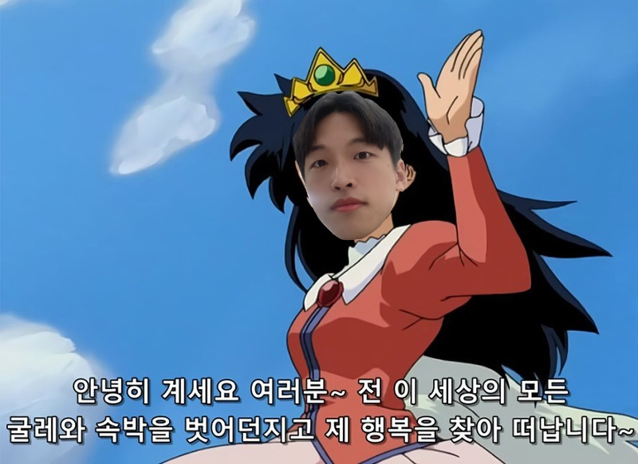
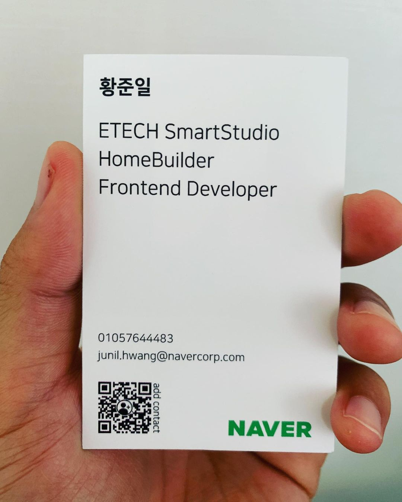
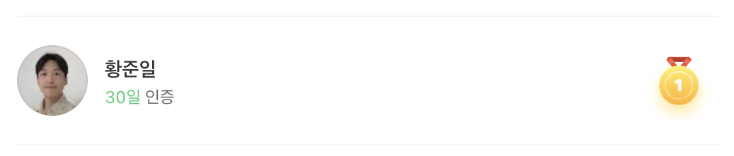
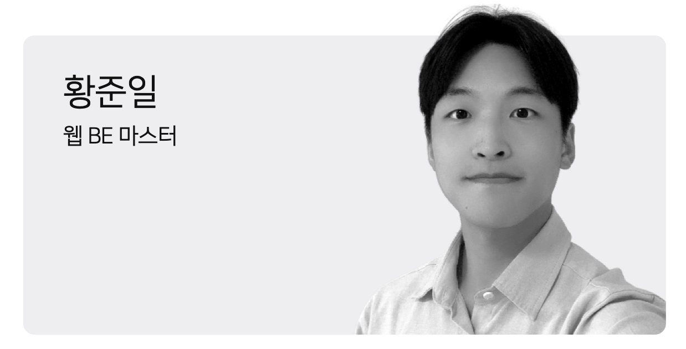
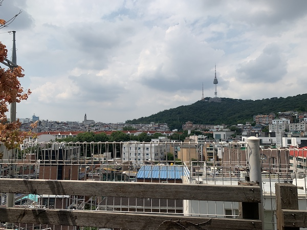

---

title: 주니어 개발자의 2022년 회고
description: 줌인터넷과의 작별, 네이버 입사, 그리고 부스트캠프
sidebarDepth: 2
date: 2023-01-01 23:00:00
thumbnail: https://user-images.githubusercontent.com/18749057/210173339-3986e61a-5645-4bfc-be71-119d51842809.jpg
tag: 회고

feed:
  enable: true

---

# 주니어 개발자의 2022년 회고

벌써 2022년이 저물었다.
올해는 생각보다 많이 버거웠다고 느끼는 중이다.
긴 글이 될까? 짧은 글이 될까? 일단 한 번 써보자.

여태까지 썼던 회고들은 나를 위한 글이라기보단 다른 사람들에게 보여주기 위한 성격의 글이었다.
이번에는 온전히 나 스스로를 위한 글을 써보고자 한다.

## 1. 안녕, 줌인터넷

2019년에 줌인터넷에 입사했고, **2022년 5월에 퇴사**했다.
퇴사를 하면서 기술블로그에 회고를 작성했는데, 그 후에 한 동안 다른 글이 안 올라와서 그런지 없어졌다.
~~아디오스..~~

### 백엔드 개발

줌인터넷에서는 프론트엔드 개발보단 백엔드 개발을 한 시간이 더 많았다.
처음에 프로젝트 코드를 보면서 정말 많이 감탄했다.
신세계가 펼쳐진 기분이었달까… 좋은 사수와 좋은 코드가 있었기에 빠르게 성장할 수 있었다.
개인적인 노력도 꽤 많이 했지만, **좋은 환경이 뒷받침 되었기 때문에 노력의 효과를 볼 수 있었다고** 생각한다.

### 프론트엔드 개발

2021년 하반기에 프론트엔드 개발파트가 신설되었고, 이 때 부터 아예 프론트엔드 개발을 전담했다.
돌이켜 생각해보면 자동화에 굉장히 신경을 안 쓰고 있었다.
CI/CD, 정적분석, 테스트 및 기타 등등 리스크를 관리할 수 있는 수단이 많이 있었을텐데 이 당시에는 **코드 자체에 대한 고민**을 무척 많이했다.
뭐랄까… 고민의 방향이 엉뚱했나 싶기도 하다.
반대로 그런 고민이 있었기의 **나만의 컨텐츠**를 만들어낼 수 있었던 것 같기도 하고.

그래서 요즘 부트캠프를 거쳐 오시는 분들을 보면서 스스로에 대한 아쉬움을 많이 느낀다.
개발을 위한 도구와 수단이 이렇게 많은데 왜 나는 그런 것들에 관심을 갖지 않았을까 하는.

반대로 **나는 야생학습에 특화된 사람이 아닐까?** 공부하고자 한다면, 공부할 수 있고, 실천할 수 있고, 몰입할 수 있다.
내가 가진 것들을 통해서 가지지 못한 것을 흡수해보자.

### 파트리더

지금 돌이켜 생각해보면 나는 좋은 파트리더가 아니였다.
체계를 만드려고 했으나, 좋은 체계를 만들지 못했다.
팀원들이 성장할 수 있는 환경, 같이 일할 수 있는 환경, 팀 단위로 일할 수 있는 환경을 만들지 못했다.

나는 줌인터넷에서 큰 폭으로 성장했으나, **나는 팀원을 성장시킨 사람이었나 물어본다면 당당하게 No! 라고 말할 수 있다.**

앞으로 어딘가에서 리더를 하게 된다면, 나의 성장 보다는 팀원 혹은 구성원을 성장할 수 있는 방법에 더 많이 투자하고 싶다.
근데 그게 가능하기 위해선 일단 내 경험의 폭이 깊고 넓어야할 것 같다.

### 퇴사

어쨌든 퇴사를 했다.
많은 것을 배울 수 있는 동료들이 무척 많았으며(다 떠났고..?), 생각보다 더 밀도 있는 경험을 했다.
줌인터넷이라는 회사가 정말 간절하게 잘 되길 바란다.

## 2. 안녕, 네이버

우여곡절 끝에 네이버라는, 나에게 참 과분한 기업에 그리고 [뛰어난 동료들이 있는 팀(HomeBuilder)](https://smartstudio.tech/homebuilder/)에 합류하게 되었다.

### 합류하기 까지

이직을 하겠다고 마음 먹은 후에 모든 헤드헌터와 리쿠르터의 제안을 수락했다.
아마 한 달 동안 지원한 곳이 정확히는 모르겠으나 10개 이상 되는 것 같다.
하필 면접이 포진해있는 기간에 코로나에 걸려서 컨디션이 최악이었던게 아쉽다면 아쉬운 일이다.

꽤 많은 면접 경험에서 느낀 점은 기술면접까진 내가 노력하면 어느 정도는 커버가 가능 하지만 그 이후는 천운이다.
팀의 핏에, 더 상위 조직의 핏에, 네이버의 핏에 내가 맞아야 하는 것이다.
이건 조직마다 다르고, 면접에 들어오는 면접관의 가치관마다 다르다.
그래서 기술면저 말고는 대부분 마음 편하게 면접을 봤다.

**나를 온전히 드러내야 하고, 그렇게 드러낸 나의 모습과 회사와 조직이 맞지 않다고 생각하면 담담하게 받아들여야 한다.
맞지 않는 조직에서 일하는 것은 나에게도 조직에게도 해가될 뿐이다.**

네이버의 면접은 나의 역량을 최대한 끌어내기 위한 질문들이었고, 그게 정말 너무 좋았다.
코로나에 걸렸을 때 며칠 밤을 제대로 못 잤는데, 밤새도록 네이버에 아니 이 팀에 정말 꼭 합류하고 싶다는 생각을 했다.
그렇게 총 세 번의 면접을 봤고, 합격 메일을 받았고, 이 때가 2022년 최고의 순간이었다.

### 함께 일하기

내가 생각하는 우리 팀의 최고 강점은 “함께 일하기” 그리고 “집단 지성” 이다.

같은 팀의 [훈민님께서 작성한 회고](https://huns.me/2022-12-29-44-%EB%84%A4%EC%9D%B4%EB%B2%84%EC%97%90%EC%84%9C%20%EB%B3%B4%EB%82%B8%202%EB%85%84%EA%B3%BC%202023%EB%85%84) 일부를 발췌해보자면,

> 팀의 변화를 가장 잘 보여주는 상징은 ‘와인바 미팅’이다.
> 와인바는 게더타운에 만든 회의 공간이다.
> 문제가 잘 안 풀리면 슬랙에 도움을 요청한다.
> 조금 기다리면 하나둘 와인바로 사람이 모이고 문제를 같이 논의한다.
> 규칙이나 장치를 만들지 않았다.
> 누가 하자고 한 적도 없다.
> 그냥 자연스레 문화가 생겼다.
> 와인바는 우리 팀의 문화를 보여주는 상징이다.
> 동료들은 이제 우리 팀의 장점으로 ‘집단 지성’을 꼽는다.

내가 합류한 시점에 집단 지성으로 문제를 해결하는 문화가 자리잡혀있는 상태였다.
자연스럽게 의견을 이야기하고, 같이 고민하고, 같이 해결하는 것이 제일 인상 깊었다.

단순히 이런 문화가 신기한게 아니라, **이런 문화를 만들어 가는 역량을 가진 팀**이라서 좋았다.
네이버니까 기술은 당연히 뒷받침 될 것이고, 제품을 잘 만들기 위해 더 좋은 수단, 더 좋은 문화를 찾아서 적응한다는 것이 시사하는 바가 무척 큰 것이다.

그래서 나는 **훈민님과 일하게 된 것이 2022년의 제일 큰 행운**이라고 생각한다.

사실 훈민님 외에도 모든 팀원의 역량이 너무 뛰어나서 나같은 찌끄레기는 따라가기가 벅찬 수준이다.
누군가에겐 이게 부담일 수 있겠지만, 난 이 상황이 참 좋다.
내가 딱 원하던 상황이랄까..!? 돌이켜 생각해보면 이런 분들과 일하고 싶어서 네이버라는 기업에 오고 싶었던 것 같다.

### 오글오글

내가 입사한지 얼마 되지 않았을 때 `Club Greeny` 라는게 생겼다.
쉽게 말해서 사내 동아리인데, 어떤 동아리를 해볼까 고민하다가 오글오글(오늘의 글쓰기 x 2)이라는 동아리에 가입했다.

꽤 버거운 회사 생활의 한 줄기 빚이랄까? 고민을 늘어놓고, 들어주고, 공감할 수 있는 공간이 생겼고 꽤 적극적으로 활용했다.

9월 ~ 11월까지는 활동을 적극적으로 했는데, 12월은 거의 하지 않았다.
연말이라서 마음이 허한 것도 있었고, 매일 매일 글을 쓰다보니 소재도 많이 떨어졌다.

2023년에는 더 적극적으로 활동할 예정!

### MBTI

새로운 조직에 합류하고, 새로운 사람들을 만나면서 MBTI에 대해 과몰입했다.
사실 지금도 과몰입 중이다.
빨리 적응하기 위해선 주변 환경, 주변 사람에 대한 이해가 필요했는데 MBTI가 좋은 지표가 된다고 생각했다.
그리고 우리 조직에 어울리는 MBTI는 뭘까도 많이 고민했다.

결론은… 난 계획형 인간이 아니고, 적어도 우리 조직에 잘 적응하기 위해선 어느 정도의 잘 정리된 계획이 필요하다.
그래서 **2023년의 목표는 의식적인 계획형 인간이 되는 것**이다.
~~안 되면 별 수 없고?~~

약 3년 동안 나름 ESFJ로 살아왔는데, 글을 작성하는 시점에는 ENFP와 ESFP를 왔다갔다 하고 있다.
~~계획형을 한참 벗어났다.~~ 아마 9일 동안의 휴식을 거쳐오니 이런게 아닌가 싶다.
나는 일을 할 때는 그나마 J가 되는 것 같은데… 쉴 때, 놀 때는 아무리 봐도 P가 된다.
무계획으로 노는 것을 좋아한달까? 생각하면서 놀고 싶지 않다.
생각 없이 놀고 싶다.

### 개발이 아닌, 일을 잘 하기

결국 개발이라는 행위는 돈을 벌기 위한 수단이고 도구이다.
개발을 잘 하는 것은 일을 하기 위한 필요 충분 조건이다.
이제 “일을 잘 하기 위한” 필요 충분 조건들에 대해 고민을 해야 하고, 이걸 잘 하는 사람이 기업에 더 많은 이윤을 가져오고 성과를 내는 것이 아닐까?

일을 잘 하기 위해선 일을 왜 하는지 알아야하고, 왜 하는지 알 수 없다면 할 필요가 없다.
개발자들은 꽤 많은 연봉을 받는다.
내가, 우리가 쓰는 시간이 사실 다 돈덩어리인 것이다.

근데 이게 머릿속에는 콕 박혀있는데, 자연스럽게 하기가 참 어렵다.

2022년의 나는 일을 잘 했을까? 아니면 그냥 했을까? 지금은 그냥 한 것에 가깝지 않을까?

**2023년에는 일을 “잘” 하기 위한 고민들을 하고, 실천 할 수 있기를 바란다.**

## 3. 부스트캠프

부스트캠프에 5기(2020)에는 리뷰어로, 6기(2021)에는 리뷰어와 멘토로 참여했는데, 어쩌다보니(?) 7기에는 마스터로 참여하게 되었다.

부스트캠프는 챌린지 → 멤버쉽 → 팀프로젝트 등 3개의 과정이 존재하고, 나는 마스터로서 멤버쉽과 팀프로젝트에 기여할 수 있었다.

2시간씩 총 14번의 온라인 강의를 했는데, 이게 참… 많이 버거웠다.
내가 경험한 도메인의 폭이 좁았고(포털 서비스에 국한된 도메인…), 정답을 최대한 제시하지 않는 방식으로 내용을 전달 하는 것이 부스트캠프 운영 목표였기 때문에 전달하고 싶은 내용이 많아도 이를 전달하기가 쉽지 않았다.
떡밥만 계속 던져줘야 하는데 이게 강의를 하는 나도, 강의를 듣는 캠퍼들도 참 많이 답답했다.

멤버쉽 교육 과정을 설계할 때도, 새로운 시도를 많이 하고 싶었는데 결국 대부분 전 기수의 콘텐츠를 많이 활용했다.
돌이켜 생각해보면, 조금 무리를 해서라도 콘텐츠를 엎어버리고 새로운 시도를 했으면 어땠을까 하는 아쉬움이 있다.
이번 기수의 콘텐츠는… 깊은 몰입이 쉽지 않았을 것 같다.
너무 많은 기술이 있고, 풀스택으로 해야 하고, 리뷰어에게 리뷰를 받기도 쉽지 않은 콘텐츠였다.
그래서 주제를 작은 단위로 쪼개서 더 깊게 몰입할 수 있도록 했으면 더 좋았으리라 생각한다.
사실 캠퍼들의 역량이 뛰어나기 때문에 어떤 콘텐츠를 던져줘도 어떻게해서든 잘 흡수해서 성장했을 것 같다.

내년에도 나에게 기회가 있을지 모르겠으나, 기회가 있다면 더 적극적으로 개선해보고 싶다.
사실 끝나서 이런 생각을 하는거지 아마 다시 하라고 하면 힘들어서 못할 것 같기도..?

내가 가진 역량에 비해 너무 많은 관심을 받았고, 그게 참 부담스러우면서도 감사했다.
그래도 나라는 존재가 이들에게 조금이나마 도움이 되었다는 것에, 도움을 줄 수 있었다는 것에, 이런 기회가 생겼다는 것에 깊은 감사함을 느낀다.

::: tip To. 부스트캠프 캠퍼여러분

부스트캠프라는 이 힘든 과정을 끝까지 완수한 여러분을 마음 깊이 존경하고 있어요! 아마 여러분이 기대한 마스터의 모습보다 경험도 역량도 많이 부족했으리라 생각합니다.
그럼에도 불구하고 과분한 관심을 주셔서 감사하고, 함께할 수 있어서 즐거웠고, 행복했습니다.

수료식 때 이야기했던 것 처럼, 이 과정은 여러분의 시작입니다.
개발자로 살아남기 위한 코어 근육을 만들어준 시간들이었습니다.
여러분이 지쳐 쓰러져도, 이 시간들이 다시 일으켜 세워줄 수 있으리라 생각합니다.
아마 앞으로 보낼 대부분의 시간들은 부스트캠프의 과정보단 덜 힘들지 않을까요!?

2023년은 여러분의 노력이 결실을 맺는 해가 되길 바랍니다!

:::

## 4. 넥스트스텝

2022년에는 자바스크립트 클린코드 과정에 총 3번 리뷰어로 참여했다.
자바 클린코드 과정의 리뷰어로 참여할 때 보단 부담은 줄었고, 재미는 늘었다.
2023년에는 리액트 과정이 열린다고 하니 기대 중이다.

그리고 교육자 양성과정에 참여했는데, 어떤 교육이 좋은 교육인지 꽤 많이 고민할 수 있었다.
고민의 기회가 된 것 자체가 소중한 경험이었다.
다만 강사로서의 내 모습은… 만족스럽지 못했다.
~~재능이 없는 것 같기도~~

<iframe width="560" height="315" src="https://www.youtube.com/embed/t40dyHxJVPY" title="YouTube video player" frameborder="0" allow="accelerometer; autoplay; clipboard-write; encrypted-media; gyroscope; picture-in-picture" allowfullscreen></iframe>

**어떤 서비스는 고객이 좋은 가치를 제공해주기도 한다.**
나는 넥스트스텝이라는 교육 플랫폼이 이에 해당한다고 생각한다.
단순히 교육을 받는 수동적인 고객이 아니라, 교육에 기여할 수 있는 능동적인 고객들이 넥스트스텝에 많이 있다.
어떻게보면 양질의 교육에 비해 규모가 작다고 생각할 수도 있지만 그만큼 **넥스트스텝의 수강생들은 굉장히 많은 가치를 만들고 있다.**
교육자와 수강생의 시너지가 좋다고 해야할까?

그래서 나는 넥스트스텝이라는 이 플랫폼이 너무 마음에 들고, 여기에 기여할 수 있다는 사실에 감사함을 느낀다.

## 5. 기능경기대회

매년 여름에 보는 서울디지텍고등학교의 풍경

2022년에도 어김없이 대회가 열렸고, 학생들을 가르쳤고, 기대한 것 이상으로 학생들이 잘 해주었다.
특히 이번에 가르쳤던 학생들은 성장에 대한 욕심을 많이 보여서 좋았다.

2023년에는 이 친구들을 활용해서 체계적인 대회 교육 시스템을 만들어 보고 싶은데… 나에게 그럴 여유가 있을지 모르겠다.
없으면 만들어야지? ~~계획형 인간이 된다면 가능할꺼야!~~

반은 농담, 반은 진담이다.
이게 가능해진다면, 시스템을 만들 수 있다면, **정말 많은 학생들에게 양질의 기회를 제공할 수 있을 것 같다.**

## 6. 개인적인 생각

### 아무말 대잔치

2022년은 꽤 버거웠고 힘들었다.
심신이 2021년과 비교해보면 많이 지치고 망가진 것 같다.

이직이라는게 생각보다 더 에너지를 많이 쓰는 일이었고, 부스트캠프는 즐거움과 부담감이 정비례했다.

이 나이가 되어서 그런걸까? 어쩌보니 장례식에 많이 갔고, 그럴 때 마다 어떻게 살아가야, 혹은 어떻게 죽어가야 잘 살았다고 이야기 할 수 있는지에 대해 생각했다.

- 내가 개발자이기 때문에 개발을 열심히 하는게 잘 살아가는걸까?
- 회사에, 팀에 기여하는게 잘 살아가는걸까?
- 돈을 잘 버는게 잘 살아가는걸까?
- 친구들, 연인, 가족 등 다양한 인간관계 속에서 좋은 관계를 만드는게 그런걸까?
- 무언가를 열심히 한다는 것이 그만큼의 의미가 있는 일일까?
- 이렇게 애쓰는 이유가 뭘까?
- 무엇을 위해서 살아가는걸까?

나는
- 의도치않게 웹 개발을 시작했고,
- 다른 것들에는 더 큰 재미를 느끼지 못해서 이 길을 택했고,
- 어쩌다보니 개발 열풍이 불었고,
- 이에 대한 사이드 이펙트로 많은 기회가 내 앞에 놓여졌다.

**그래서 내가 손에 쥔 것들이(많은 것들을 쥐었다고 할 순 없겠지만) 가끔은 비현실적으로 느껴진다.**

이 시대의 청년들이 했던 노력과 비교해보면, 내가 했던 노력은 노력이라고 하기에 우수운 수준이다.

그래서 나는 내 인생이 내 예상보다 잘 풀리는 만큼 다른 사람들의 인생도 잘 풀렸으면 하고, 이를 위해서 내가 할 수 있는 것들은 최대한 해보려고 한다.

나만의 방식으로 다른 사람들을 도울 수 있다면, 그것 만으로도 꽤 만족스러운 인생이지 않을까? 아마 앞으로는 이런 생각들과, 생각을 구체화하려는 시도를 많이 할 것 같다.

그리고 2022년에는 정말 다양한 사람들을 만났다.
그러면서 인사이트도 많이 생겼는데, 이런 인사이트를 내 것으로 온전히 융화하지 못했고 그게 참 아쉽다.

지금 내가 무언가를 받아들이기엔 안정적인 상태가 아닌 것 같다.
그래서 꾸준히 나를 표현하고, 털어내고, 채워넣고 싶다.

**버리자, 버려야 채울 수 있다.
그게 물건이 될 수도 있고, 마음이 될 수도 있고.**

### 나의 강점과 단점

여자친구와 대화하다가 생각해본 나의 최대 장점은 **실행력**이다.
무언가 하고자 마음 먹었을 때 어떻게든 실행한다.

내가 계획을 세우진 않지만, 남이 세워 놓은 계획을 잘 따르는 편이랄까? 그리고 이를 실현하기 위해 무던히 애쓴다.

또 다른 강점은, 감정 기복이 많이 없는 편인데 감성적이다.
~~말이야 방구야~~

긍정적인 생각을 많이 하고, 긍정적인 상태를 꽤 오래 유지한다.
이런 점은 교육이나 멘토링을 할 때 효과가 좋은 편이다.

그리고 장점이다 단점은 과하게 몰입한다는 것.
현재 컨텍스트에 몰입을 잘 하는 편인데, 문제는… 그 외의 것을 몰입하는 순간 많이 못 보는 편이다.

그래서 일을 하다가 회의가 있으면 회의에 잘 몰입하지 못할 때가 많고,
나의 일에 몰입하다보면 다른 사람의 일을 잘 파악하지 못할 때가 많다.

이를 잘 조절하기 위해 어떻게 해야 좋을까? 에 대한 생각을 많이 했었는데, 주변의 계획형인 사람들의 이야기를 들어보니 몰입을 계획적으로 한다고… (그게 가능한거야!?)

잘 될지 모르겠으나 시도는 해봐야할 것 같다.

그냥 단점이라고 부를 수 있는 것은, 창의력이 부족하다는 것..

무언가를 만들거나 개선할 때 이게 큰 걸림돌이 된다.
틀을 잘 깨지 못한달까?

그래서 나같은 사람은 최대한 많은 것들을 읽도 봐야 한다.
책좀 읽고, 아티클좀 읽고, 오픈소스좀 보자.

## 7. 계묘년

### 2023년의 목표

- 인강 촬영
    - 올해는 꼭!!
    - 가능하면 1분기 이내로

- 미라클 모닝
    - 5시에 일어나서 12시 이전에 잠들기
    - 오후 시간은 내가 아닌 주변을 더 신경 쓰기
    - 오전 시간에 나를 위한 일을 하기
        - 독서/운동/사이드잡

- 유튜브와 SNS 적당히 하기
    - 빈 틈이 생기면 인스타를 키는 내 모습… 좋지 않아.
    - 대신 스트레칭이라도 해보면 어떨까?

- 항상 청소하기
    - 2023년은 재택근무를 해야 하기 때문에 항상 깔끔한 상태를 유지해보기

- 바른자세 유지하기
    - 이미 거북목이라서, 더 이상 악화되지 않게끔..

- 운동하기
    - 출퇴근 시간이 없어지는 만큼 나머지는 운동에 시간을 투자해보면 어떨까?

- 계획적으로 살기 ★★
    - 2022년에 절실히 깨달은 한 가지가 나는 무계획형 인간이라는 것
    - 나에게 주어진 시간을 조금 효과적으로 사용할 수 있는 것은 계획을 세우는 것
    - 계획은 논리와 근거를 만들어준다.
        - 계획을 세우는 것에 스트레스 받지 않을 수 있을까?
        - 계획을 시간을 세우는 계획을 계획해보자 (이게 뭔소린지)
            - 하루에 30분 정도는 투자할 수 있지 않을까?
    - 노션을 최대한 활용해보자

- 웹툰 대신 독서
    - 당당하게 말하던 나의 취미… 웹툰, 웹소설…
    - 대신 독서를 해보면 어떨까?
    - ~~오늘부터 취미는 독서!!~~

- 이사 준비
    - 과연… 어디로 갈 것인가! ~~(나에게 선택권이 없을 뿐)~~

### 목표를 달성을 위한 액션 플랜

- 평일
    - 필수로 써야하는 시간 = 16시간
        - 수면 6시간
        - 회사일 8시간
        - 식사 2시간 (점심/저녁)

    - 자유 시간 = 2시간
        - 뭘 하든 자유

    - 남는 시간 = 6시간
        - 운동 1시간
        - 독서 1시간 (23:00 ~ 24:00)
        - 오글오글 30분
        - 사이드잡 ( 글쓰기, 멘토링, 코드리뷰, 인강 및 기타 등등 ) 2시간

- 주말
    - 가능하면 온전한 휴식을 추구하기..?

- 매월
    - 월 초 → 이번 달 목표 세우기
    - 월 말 → 목표 달성 여부 확인 및 회고

- 1분기
    - 남는 시간은 인강 촬영에 최대한 투자해보기

- 2분기 ~
    - 사실 뭘 할지 모르겠음..
    - 아마 기능대회 관련 콘텐츠를 만들어야 하지 않을까?

## 8. 더 장기적인, 더 이상적인 목표

- 우리는 일을 왜 할까? 결국엔 행복해지려고, 잘 살려고 하는게 아닐까?
- 회사에 종속된 상태에서는 얼마나 행복해질 수 있을까?
- 얼마나 자유로운 인생을 살 수 있을까?
- 나는 회사에, 그리고 일에 종속적인 삶만 살 수 있는걸까?
- 일에 종속적인 인생을 살아야 한다면, 정말 내가 좋아하는 사랑하는 일을 해야 하지 않을까?
- 그렇다면 나는 개발자라는 직업을 얼마나 좋아하고 있을까?
- 그냥 관성 때문에 개발자가 된게 아닐까?

그래서 나의 최종 목표는, **의존성 역전을 하는 것.**
- 회사라는 거대한 컨텍스트에, 개발자라는 인스턴스에 나를 주입하지 않는 것.
- 내가 가진 인터페이스를 많이 찾아내는 것.
- 내가 협력할 수 있는 사람들을 더 많이 찾아내는 것.

지금은 스케치만 해놓은 상태다.
**2023년 회고에서는 청사진이 되어 있기를.**

## Summary 
- 2022년, 꽤 힘들었다.
- 2023년, 더 잘 해보고 싶다.
