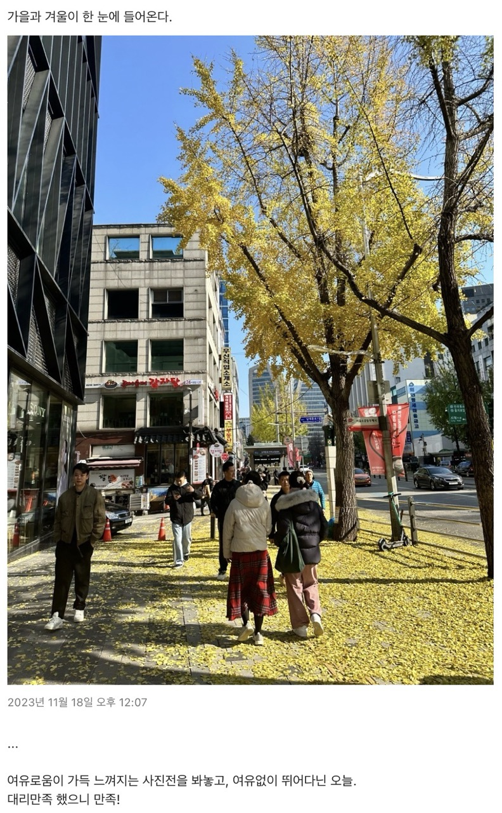

---

title: 2023년 회고
description: 나 자신에 대해 참 많은 것들을 알 수 있었던 1년
sidebarDepth: 2
date: 2024-01-09 10:00:00
thumbnail: https://raw.githubusercontent.com/JunilHwang/TIL/master/Review/2023-year/end/thumbnail.jpg
tag: 회고

feed:
  enable: true

---

# 2023년 회고

2022년 회고를 쓴게 정말 엊그제 같은데 벌써 1년이 지났다. 더닝크루거 곡선이 생각나는 일년이었달까?

올해는 개발자로서의 성장 폭이 크지 않았던 것 같다.
개발 외에 해야할 것도 생각해야 할 것도 해결해야할 것도 너무 많았다.
인생은 정말 한치 앞도 알 수 없다는걸 참 많이 생각하게된 일년이다.

작년까지는 회고를 작성할 때 타인에게 어필하고 싶은 내용들을 많이 담았다.
앞으로는 못난 점들을 많이 담고 싶다.
난 이전에도 못났고 지금도 못났고 앞으로도 못날 것 같지만, 느리고 더디고 힘들어도 성장 중이다.

그래서 다른 사람에게 보여주기 위해서 작성하는게 아닌 내가 기록하고 싶은 내가 간직하고 싶은 나의 모습들을 덤덤하게 작성하고 싶다.

## 2023년 목표 달성 점검

- [ ]  미라클 모닝
  - 대실패
- [x]  운동
  - 특별하게 많은 운동을 했던건 아니지만, 광교로 이사온 이후에 하루에 한 번 산책을 했다.
  - 가을까지는 하루 평균 11km 정도 걸어다녔고, 날이 추워지면서 조금 뜸하지만.. 결론적으로 하루 평균 9km 정도 걸어다녔다.
  - 산책이 심신의 건강을 유지하는데 지대한 역할을 했다.
- [ ]  ~~인강촬영~~
  - 시도는 했으나… 결론적으론 실패
- [x]  청소하기
  - 복잡한 생각을 하고 있을 때 집안일을 하면 마음이 편해진다. 주변을 정돈하면서 마음도 정돈한달까?
  - 이 글을 작성하고 있는 시점에도 아침에 2시간 정도 청소를 했다.
- [x]  SNS 줄이기
  - 숏츠 같은 무의미한(?) 것들은 많이 줄인 것 같다.
  - 인스타그램에는 대체로 고양이를 올리거나 산책할 때 찍은 것들을 올리거나?
  - 유튜브는 MBTI + 자기계발 영상으로 도배됐다. 그만큼 올해는 인간으로서의 성장에 대해 고민을 많이 했다는 점
- [x]  바른자세 유지하기
  - 몸이 펴졌다
  - 목, 어깨, 허리에 통증이 거의 없어졌다.
  - 자세는 원래도 바르게 유지하려고 했으나.. 운동(산책)의 영향이 컸달까
- [x]  계획적으로 살기
  - 1개월, 1년 단위의 계획을 설정하진 않았고 매일매일 해야할 일에 대한 계획을 설정했다.
  - 작은 것부터 시도해보니 어쨌든 계획을 하긴 하더라.
- [x]  독서
  - 엄~~청 많은 책을 읽었다곤 할 수 없지만, 작년과 비교하면 장족의 발전이다.
  - 대략 10권 이상의 책을 읽은 것 같다.
- [x]  이사
  - 우여곡절이 조금 있었찌만, 결론적으로 10년 전부터 살고 싶었던 동네(광교)로 이사왔다.
  - 대만족!
- [x]  어떻게 돈을 벌어야 좋을까 고민해보기
  - 말 그대로 고민만 했다.
  - 다른 일들을 할 여력이 없었다.

사실 별 생각 없었는데, 돌이켜보니 달성이 된게 많았다. 일단 계획을 세우고 목표를 설정하면 시도를 하게 되고, 뭐라도 하게 되는게 아닐까?

## 1. nBilly

 

### (1) 간단한 소개

nBilly는 팀 이름이면서 동시에 제품 이름이다.

- 팀으로서의 nBilly: 웹 UI 제작 기술을 연구·개발 → 비즈니스의 성장을 돕는 **기술 조직**
- 제품으로서의 nBilly: WYSIWYG 으로 웹 UI 를 만들고 배포할 수 있는 도구

우리 팀이 추구하는 가치나 목표나 전략 등 다루고 싶은 내용이 참 많지만, 이곳에 언급할 내용은 아닌 것 같다. 내가 제일 중요하게 생각하는 부분은 팀과 팀원의 성장을 무척 중요하게 생각하고 있으며 이를 달성하기 위한 다양한 시스템이 구축되어 있으며 항상 고민을 하는 부분이라는 것. 이런 조직에서 일할 수 있다는게 참 행운이라고 생각한다.

[https://www.youtube.com/watch?v=zncmO90s0sk](https://www.youtube.com/watch?v=zncmO90s0sk)

올해 초에 같은 팀의 훈민님께서 우리 팀이 어떤식으로 아키텍쳐를 정의하고 개선했는지 deview에서 발표하셨다.  (팀에 대한 구구절절한 내용을 다루기보단 위의 영상으로 대체해도 되지 않을까!?)

영상에 대한 후속으로 [https://smartstudio.tech/bringing-consistency-to-broken-ui-layer/](https://smartstudio.tech/bringing-consistency-to-broken-ui-layer/) 이런 글도 있다.

제품으로서의 nBilly는 아직 계속 발전중이며, 소수의 인원으로 고군분투를 하고 있기 때문에 성장 방향에 따라 제품의 모습이 많이 달라질 것 같다.

올해에 nBilly로 만들어진 사이트는 이런 것들이 있다.

- [https://campaign.nbilly.naver.com/nwec2023](https://campaign.nbilly.naver.com/nwec2023)
- [https://campaign.nbilly.naver.com/navergenerativeai](https://campaign.nbilly.naver.com/navergenerativeai)
- [https://campaign.nbilly.naver.com/whatsonyournetflix](https://campaign.nbilly.naver.com/whatsonyournetflix)
- [https://campaign.nbilly.naver.com/clova-for-writing-with-smarteditor](https://campaign.nbilly.naver.com/clova-for-writing-with-smarteditor)
- [https://campaign.nbilly.naver.com/ncfd23](https://campaign.nbilly.naver.com/ncfd23)

여기에는 다룰 수 없지만 지금도 nBilly로 만들어지고 있는 사이트가 무척 많이 있고, 많이 오픈될 예정이다.

nBilly에 대한 자세한 내용은 뒤로 미루고 (별도의 포스트로 작성하는게 더 좋겠다는 판단을 했다), 이 포스트에서는 개인적으로 했던 것들을 짤막하게 다뤄보고 싶다.

 

### (2) 기술적 성장, 시도, 난관.

길게 이야기 하면 끝이 없기 때문에, 최대한 간단하게 정리해보고자 한다.

 

#### **<모델 마이그레이션 자동화 + 모델 검증 자동화>**

제품의 스펙이 변할 때 모델도 같이 변하는 경우가 무척 빈번했다. 모델이 변하면 DB에 있는 것들도 같이 변경해야 하고 모델에 대한 검증 코드도 같이 변경되어야 한다. 당연하지만 모델을 변경했을 때의 사이드 이펙트가 무척 크고 이를 해결하기 위해 사람이 하나하나 다 작업하는 것이 매우 비효율적이다.

그래서 모델 변경에 최대한 자동으로 대응할 수 있는 방법에 대해 고민했고 적용했다.

- 모델 마이그레이션
  - PR을 올릴 때, github actions로 현재 코드에 대한 모델 정합성을 검사한다.
  - 모델 정합성을 통과하지 못하면, 마이그레이션 스크립트를 작성해서 푸시해야 한다. 혹은 미리 해당 PR에 포함되어 있어야 한다.
  - PR이 머지되면 일단 개발용 DB에 마이그레이션이 적용되고, 작성된 마이그레이션 스크립트는 별도의 폴더에 차곡차곡 쌓인다.
  - 릴리즈를 하는 시점에 마이그레이션이 완료된 스크립트를 기준으로 다시 리얼 DB에 적용한다.
- 모델 검증
  - typescript를 json schema로 바꿔주는 도구 → `ts-json-schema-generator`
  - json을 json schema로 validation 하는 도구 → `ajv`
  - 모델(typescript)이 변경될 때 json schema를 만들어주고, 이를 토대로 사이트를 저장하거나 발행할 때 검증할 수 있도록 한다.

이러한 작업들은 github actions에 의존적인 작업이 많았고 덕분에 github actions에 대해 다방면으로 학습할 수 있었다. 다만… 마이그레이션이 잘못되었을 경우에 대한 조치가 현재 되어있지 않아서 이를 보완해야 한다. 마이그레이션을 실행하기 전에 DB를 백업하고 있지만, 실패하는 경우에만 복원하고 있기 때문에 실패를 하지 않더라도 의도한대로 마이그레이션이 되지 않았을 때에도 복원할 수 있도록 만들어 놓아야 한다.

github actions에서 백업해놓은걸 어떻게 해야 다운 받을 수 있을지 고민이다. 찾으면 나오겠지만…? 짜투리 시간에 미리 찾아놓으면 되겠지?

 

#### **<애니메이션 기능 추가>**

사용자가 각각의 개체(페이지/섹션/컨테이너/블록)에 애니메이션을 적용할 수 있도록 만들었다. 애니메이션을 적용하는 부분은 사실 큰 문제가 아니었다. 제일 고민이 많이 되는 부분은 "어플리케이션 계층에서 주입" 하는 것. 애니메이션의 트리거가 다양하게 존재하고, 애니메이션의 형태도 다양하게 존재할 때 이를 잘 관리할 수 있는 방법을 생각하는게 무척 힘들었다.

어떻게 할까 고민하다가, 어플리케이션의 설정 파일에서 애니메이션에 대한 keyframe과 trigger 함수를 정의하도록 했다.

이러한 고민 덕분에 어플리케이션 계층에서 주입하거나 제거하거나 수정할 수 있기 때문에 손쉽게 애니메이션을 제어할 수 있게 되었다. 다만 이벤트 트리거에서 오류나 버그가 있을 때 이를 깔끔하게 해결하기가 어려웠다.

그래도 이러한 작업을 하면서 이벤트에 대해 딥다이브 할 수 있었달까? 사실 이렇게 에디터를 만드는 작업 자체가 이벤트에 대한 딥다이브를 할 수 밖에 없다고 생각한다.

또 갑자기 생각난건 에디터에서 애니메이션을 리플레이 하는 것. 에디터와 인스펙터가 코드상으로 멀리 있기 때문에, 인스펙터가 애니메이션을 의도적으로 재생시킬 때 어떤 방법을 사용해야 좋을지 무척 고민이 많았다. 결론만 이야기 하자면, 일종의 커스텀 이벤트 매니저를 이용하여 해결했다.

다만 이런 도구를 남용할 경우 나중에 문제가 발생했을 때 트래킹을 하는게 무척 어렵고 힘들 수 있기 때문에 최대한 사용을 지양하고 있다.

 

#### **<와이드 영역 대응>**

개체가 화면을 꽉 채울 수 있는 기능을 만들었다. 꽉 채우는 방법은 여러가지가 있지만, 어떤 방식이 제일 효과적일지 찾아보고 적용하는 과정이 필요했다.

이럴 때 밑바닥부터 어떻게 만들지 고민하기보단 이미 잘 만들어진 것들을 모방하는게 효과적이라는 것! 그래서 여러 웹 빌더를 찾아보다가 SqureSpace를 모방하여 와이드 영역의 1/2 만큼 진입하면 확장이 되도록 했다.

이 때 `display: grid` 의 속성을 이용해서 와이드 영역의 너비를 지정하고, 와이드 영역에 진입시 [grid-area](https://developer.mozilla.org/en-US/docs/Web/CSS/grid-area)값을 변경하면 자동으로 반영되도록 만들었다. (예시: `grid-area: 1 / 2 / 1 / 2`)

다만, 이 기능을 만들고 적용했을 때 사이드 이펙트가 정말 어마어마했다. 전부다 나열하기는 손가락이 아프기 때문에 스킵.

기능을 작성한 다음에 테스트 코드로 어느 정도 보완할 수 있었을텐데, 기존에 테스트 케이스가 많이 부족했다.

지금 돌이켜 생각해보면, QA에서 문제가 발견될 때 마다 테스트 케이스를 추가 및 보완해야 할 것 같은데… 참 안일하게 생각했다. ~~언젠간 업보로 돌아오겠지~~

항상 기능을 개발할 때는 데드라인 때문에 급하게 만들고, 결국 QA에 더 많은 시간을 쓰게 된다. 투입되는 총 시간은 오히려 테스트 케이스를 작성하여 보완하는게 더 적을텐데… 물론 모든 케이스를 테스트로 잡기는 힘들겠지만, 항상 테스트 코드를 작성할 때 이런 점들을 고려해야겠구나 싶다.

일년을 돌이켜보면 개발할 때 영혼이 좀 없었나 싶기도 하고?

 

#### **<캐로셀 컨테이너>**

기존의 `페이지 → 섹션 → 블록` 계층에서 `페이지 → 섹션 → 컨테이너 → 블록` 처럼 "컨테이너" 계층을 새로 만들고, "캐로셀 컨테이너" 라는 개체를 만들었다. 컨테이너는 블록보다 더 복잡한 UX/UI를 표현할 수 있으며 블록을 가질 수 있는 계층이다.

일단 컨테이너라는 계층을 너무 급하게 만들어서 지금도 사이드 이펙트가 크게 남아있다. ~~손봐야 할 곳이 참 많은 친구다~~. 처음에는 swiper.js로 캐로셀을 구현했는데… swiper에 자잘한 버그가 많고, 인스펙터 영역에서 캐로셀을 컨트롤할 때 의도대로 되지 않는 것들이 참 많았다.

어떻게 할까 고민하다가 사내에서 만든 eg-js의 flicking을 이용해서 구현했는데, 해당 라이브러리가 처음부터 리액트 기반으로 만들어진게 아니기 때문에 캐로셀의 상태를 관리할 때 무척 힘들었다. 사실 단순하게 사용하면 큰 문제가 없으나… 인스펙터에서 캐로셀을 컨트롤 할 때 발생하는 무수히 많은 사이드 이펙트가 존재했다.

결국 고심 끝에 직접 캐로셀을 구현했고 스와이프 기능은 `react-swipeable` 을 이용해서 적용했다.

이 작업을 하면서 "어렵고 귀찮아서 시도하지 않는 것"에 대한 생각이 많았다. 내가 어떤 일을 할 때 "어렵고 귀찮다"는 판단이 들면서 망설이게 된다는 것. 이걸 깨기 위해 의식적인 노력을 많이 했는데, 여전히 내가 재미를 느끼고 관심이 가는 일이 아니면 하기 망설여지는 마음이 있다.

더 근본적인 문제는, 내가 가진 시야가 참 편협하다. 작고 자잘한 것들은 잘 살펴보려고 하지만, 크고 넓은 것들에 대해서는 생각하기가 힘들고 생각만 해도 스트레스를 참 많이 받는다.

 

#### **<스냅 그리드 좌표계 → 절대 좌표계 전환>**

처음에 nBilly를 출시할 때는 grid-area를 이용하여 8px, 6px, 4px 단위로 이동 및 크기 조절을 할 수 있도록 만들었다. 다만, 이렇게 했을 때 사용자의 다양한 요구사항을 충족시키기가 어려웠고, 억지로 요구사항을 맞추려고 하다보니 복잡한 코드들이 만들어졌다. 그래서 고심 끝에 절대 좌표계로 편집 시스템을 전환했다.

편집의 기저를 변경하는 과정이였기 때문에 무척 오래 걸렸고, 사이드 이펙트도 굉장히 많았다. 하고 싶은 말도, 담고 싶은 내용도 정말 너무 많지만… 결과적으로 2달 가까이 QA를 하는 사태가 발생했다.

제일 이슈가 되었던 부분은 멀티 디바이스 대응이었던 것 같다. Desktop 모드에서는 편집이 잘 되거나 해도 Tablet이나 Mobile 모드에서는 잘 안 되거나, 일관성이 없거나, 좌표가 이상하거나, 기타 등등…. 정말…. 너무 많은 문제가 있었다.

 

#### **<에디터 편집 성능 최적화>**

제일 몰입을 많이 했던 일이 성능 최적화였다. 성능 최적화 작업을 할 때는 하루 종일 일 생각만 하지 않았나 싶다.

일어났을 때, 씻을 때, 밥먹을 때, 산책할 때, 자기 직전 등 거의 모든 순간을 "어떻게 해야 성능이 좋아질까?" 에 대해 고민했다. 그만큼 재미도 있었고 보람도 있었고 힘들기도 했고.

기존에 Context와 Store를 모든 영역에서 남발하여 사용하고 있었다. 덕분에 편집 인터랙션이 발생하면, 모든 컴포넌트가 리렌더링 되는 현상이 발생했다. 프로파일을 해보면 모든 영역에서 렌더링이 발생하는걸 확인할 수 있었다.

각각의 컴포넌트가 알아야 하는 Context의 Scope를 제한하고, Store의 경우 필요한 값만 가져와 사용하는 방식으로 이를 개선했다.

편집 중(개체가 이동 중이거나 리사이즈 중)일 때는 context만 변경되기 때문에, 렌더링 비용이 조금 더 낮았고

편집이 완료되는 시점에 store에 업데이트를 하는데, 이 때에도 store를 참조하는 컴포넌트들이 정말 꼭 필요한 값만 가져다 사용하도록 하고, 값이 변경되지 않았을 경우 렌더링이 되지 않도록 하여 최적화를 했다.

이 외에 뷰어 성능 최적화도 했는데, 크게 기여하진 않았기 때문에 일단 생략. ~~(쓰기 귀찮아서 그런건 절대 아니다)~~

 

#### **<테스트코드 보완>**

앞에서 언급한 편집 좌표계 전환 + 성능 최적화 작업을 하면서 테스트 코드의 커버리지를 50%에서 65% 정도로 끌어올렸다.

이전에는 테스트 코드를 작성할 때 막연한 두려움이 있었는데 (일종의 어렵고 귀찮은…?), 계속 작성하다보니까 생각보다 재밌기도 하고, 숙련도가 높아지니까 속도가 붙었다. 이쁘게 잘 작성하는건 둘째치고 일단 만들어놔야 뭐라도 되지 않을까 하는 생각으로 작성했던 것 같다.

::: tip 무언가를 잘 하기 위해선 일단 익숙해져야한다.

- 몸을 잘 쓰기 위해선, 몸을 쓰는게 익숙해야 한다.
- 머리를 잘 쓰기 위해선, 머리를 쓰는게 익숙해야 한다.
- 코딩을 잘 하기 위해선, 코딩을 하는게 익숙해야 한다.
- 설계를 잘 하기 위해선, 설계를 하는게 익숙해야 한다.
- 테스트를 잘 짜기 위해선, 테스트 코드를 작성하는게 일단 익숙해야 한다.

:::

마음만 조급해선 안 된다는걸, 요즘들어 참 많이 느끼고 있다.
빨리 가는 길이 있을 수 있지만, **결국 밑바닥부터 차곡차곡 쌓아가지 않으면 안 되는 영역이 존재한다.**
다른 사람은 어떨지 몰라도 일단 나는 그런 사람이다.

타고난 재능도 없고, 특출나게 잘하는 것도 없고, 그저 남들에게 지금은 "잘 하는 것 처럼 보일 수 있는 영역"은 무수히 많은 시간을 투자해서 조금이나마 그럴듯해 보이는 것들이다.

어려운 일도, 힘든 일도, 일단 부딪혀보고 익숙해져야 한다.

24년의 목표이기도 하고, 다짐이기도 하고?

 

#### **<비디오 업로드 추가 + 모듈화>**

단순해보이는 이 기능을 만들기 위해 생각보다 많은 삽질을 했다. 온전히 모든 기능을 직접 구현하는게 아니라 외부 의존이 존재했기 때문에, 관련 자료들을 꼼꼼하게 수집해야 했으나 그러질 못했다.

다른 티켓을 작업할 때도 그렇지만, 이 티켓을 작업하면서 나의 단점과 나의 부족한 부분이 너무 많이 보였다.

나는 시야가 좁다. 정확히는, 멀리 봐야 되는데 멀리 보질 못한다. 생각이 거기까지 뻗어나가질 못한달까..

다른 사람들에게는 커뮤니케이션의 중요성을 이야기 하곤 하지만, 정작 내가 이걸 제대로 못하고 있었다. 내 상태와 내가 하고 있는 일의 상태를 주기적으로 팀 내에 공유하는 것이 매우 중요하다는 것. 문제 해결을 주도하는 사람, 리딩하는 사람에게는 "예측"이 중요하다. 그게 일이든 사람이든 어느 정도는 예측이 되거나 관리가 되어야 하는데, 그걸 위해선 직접 확인을 하거나 혹은 보고가 오거나.

나의 경우 이 일을 진행하면서 확인을 하지도 않았고, 관리자에게 이야기를 하지도 않았다. ~~최악이다~~

나는 사람 활용을 잘 못하는 편이다. 일단 잘 안 풀릴 때, "도와주세요!" 라고 쉽게 이야기를 할 수 있어야 하는데 그게 참 어렵다. 주변에 나를 도와줄 수 있는 사람이 참 많은데, 혼자서 끙끙 앓는걸 참 오래 한다. ~~사실 어릴 때부터 그렇게 살아온게 익숙한게 제일 크다.~~

어쨌든, 더 적극적으로 나에게 주어진 모든 자원을 활용해보고 싶다.

 

#### **<생애 첫 TF>**

어쩌다보니 23년 하반기에 어쩌다보니 TF 팀에 착출(?)이 되었다. 자세한 내용을 이야기할 수는 없지만, 입사 후에 nBilly 팀이 아닌 다른 사람들과 같이 일을 해본게 처음이라 무척 신선한 경험이었다.

어떻게 목표를 설정해야 하고, 내가 가진 생각을 어떤식으로 정제해서 전달해야 효과적인지에 대해 매일 생각했던 것 같다.

이런 고민을 할 당시에 팀 내에서 "사용자 스토리" "예제를 활용한 명세" 등의 책으로 스터디를 하고 있었다. 커뮤니케이션을 할 때 전문용어로 이야기를 하기보단, 예제나 사용자 스토리는 그 자체가 목표 혹은 목적이 되고, 이를 달성하기 위해 필요한 것들로 연결지어 설명했을 때 효과가 좋은 것 같다.

그래서 "우리가 만드는 서비스 혹은 도구를 사람들은 어떻게 사용할까?" 를 기준으로 자료를 만들고, 이를 기반으로 우리가 해야되는 것들에 대해 이야기를 하고자 했다.

이 외에도 초기 개발환경 구성, 인프라 구성, 배포환경 구성, 피그마 플러그인 프로토타입 개발 등 자잘한 것들을 했었는데 꽤 재밌었다.

하지만 nBilly 지원이 더 급했기 때문에 TF에서는 두 달 정도만 참여하고 복귀했다.

 

### (3) 무수히 많은 아쉬운 점들

팀에서의 내 모습을 생각해보면 전체적으로 불만족스럽다. 올해는 거의 매일 산책을 하면서 내가 하는 일에 대해서, 우리 팀에 대해서 고민을 꽤 많이 했다. **일을 잘 하고 싶어서 고민을 많이 했으나 잘하긴 개뿔… 맨날 털린다.**

우리 팀은 좋은 문화를 성숙한 문화를 만들어왔고, 앞으로도 더 좋아질 것이다. **하지만 팀이 아니라 황준일이라는 개인을 놓고 보면 참 문제 투성이다.**

23년에는 팀의 목표가 회사의 방향성에 맞춰서 유기적으로 변했으나, 팀의 목표에 맞춰서 나의 목표가 변하지 못했고, 큰 흐름을 쫓아가지 못했다. 못한게 참 많다. 못한걸까 안한걸까 생각해보면 안 한 것에 가깝지 않을까?

앞으로 어떻게 해야 좋을지 연말 연휴 때 꽤 깊게 생각했고 결론을 내렸고 방향성도 정했다고 생각했는데, 글을 쓰는 지금 시점에는 또 모호해진 것 같다. 사실 방향성이라는게 나 혼자 정한다고 끝이 아니라 팀에 align이 되어야 한다. 그래서 내가 생각한 방향성이 맞는지 1월 중으로 확인해보고 싶다. ~~일단 급한불부터 끄고~~

그리고 또 한 가지 내가 크게 잘못한 점을 생각해보면, **"일"이 아니라 "사람"에 대해 너무 많이 고민을 했다는 것.** 일을 잘 하고 싶으면 일 자체에 대해 고민을 하는게 맞을텐데 그러질 않았다.

각각의 사람들이 어떤 행동을 했을 때 그런 행동을 하는 이유들이 궁금했고, 다른 사람들이 가지고 있는 장점과 단점에 대해 생각하는게 재밌었고, 나와 비교해보면서 나는 또 어떤 사람인지 알아가는게 재밌었다.

팀에 대해 생각하고 → 개개인에 대해 생각하고 → **다시 나에 대해 생각하고.**

이게 꼭 팀에 국한된게 아니라, 올해에 내가 만났던 모든 사람들에 대해 꽤 깊게 생각했다.

가족, 친구, 동료, 후배, 제자, 그리고 짧게 스쳐간 다양한 인연들.

올해는 내가 "황준일" 이라는 존재를 다방면에서 잃어버렸었다. 난 왜 이모양일까, 왜 이런 사람일까, 왜 이런 생각을할까 궁금했다. 나를 둘러싸고 있는 사람들과 그 속에서의 내 모습을 조립해보며 **나를 찾아가는 시간들**이었다.

아마 이건 해가 바뀌어도 달라지지 않을 것 같다. 오늘도 그랬고, 어제도 그랬다. 사실 진작에 했어야 하는 생각들이 아니었을까?

삼천포로 빠진 것 같은데, 어쨌든 23년의 nBilly에서의 내 모습을 정리해보면 아래와 같다.

- 커뮤니케이션을 잘 하지 못했고
- 생각만 많았고
- 주저한 행동이 많았고
- 기술적인 성장이 더디고
- 주도성이 부족했고
- 많은 사람들을 답답하게 했고
- 나를 잘 드러내지 못했고
- 기대에 부응하지 못했고
- 문제 정의를 잘 하지 못했고
- 목표 설정을 잘 하지 못했고
- 큰 그림을 보질 못했고
- 멀리 보질 못했고
- 프로 의식이 부족했고
- 팀원을 잘 활용하질 못했고

내년엔 조금 더 나아질 수 있기를 🙏

 

### (4) 24년에 대한 짧은 다짐

- 제일 하고 싶은건 제품의 퀄리티를 높이는 것.
  - 팀의 목표와는 별개로, 그냥 내가 참 하고 싶은 일이다.
  - 그러기 위해선 더 분주하게 움직여야 하고, 해야 하는 일을 잘 마무리를 하고, 내가 하고 싶은 일을 틈틈이 해야되겠지?
- **가파른 성장은 결국 단단하게 쌓아올리는 것들 위에서 이루어진다.** 제일 효율적으로 성장하는 방법은 결국 "시도"하는 것. 빠른 길은 정직하게 가는 길.
- 사람에 대해 고민하는게 아니라 그 사람이 하는 고민에 대해 같이 고민을 해야한다는 것. 팀원들이 하는 고민을 나도 같이 해보고 그걸 습관화 해보자.
- 내 상태와 내가 하는 일의 상태를 주기적으로 공유하는 것.
  - "힘들어요! 도와주세요!"
  - "제가 도울 일이 없을까요?"
  - "이러저러한 것들에 대해 고민을 해봤어요."
- 목표에 대해 매일매일 점검하기.
  - 23년에는 KPI가 그냥 무조건 싫었는데, 이제는 왜 중요한지 왜 필요한지 인지했고 이걸 잘 활용해보고 싶다.
  - 습관화가 되어야 한다.
  - 어렵다고 힘들다고 회피하는게 아니라 부딪혀야 한다.

  

## 2. 활동

### (1) 오글오글(오글거려도, 오늘의 글쓰기)

네이버에 입사해서 제일 잘한 일 중에 하나가 바로 "오글오글(오늘의 글쓰기)" 이라는 사내동아리에 가입한 것이다. 어떤 주제든 상관 없이, 분량도 상관 없이, 일단 작성을 하면 된다. 덕분에 이전에는 항상 "남들에게 보여주기 위한 글"을 작성했다면, 이제는 **"내가 쓰고 싶은 글"** 을 작성하고 있다.

더불어서 다른 사람이 작성한 글을 보며 느끼는게 참 많이 있다. 다양한 간접 경험을 할 수 있달까? 인생에 대해, 삶에 대해, 일에 대해, 같은 회사 사람들이 남기는 글들을 보고 있으면 **그냥 이 자체가 삶이구나** 생각이 든다.

 

#### **<수치로 보자>**

| 1월 - 23글 | 2월 - 22글 | 3월 - 8글 | 4월 - 21글 | 5월 - 23글 | 6월 - 23글 |
| --- | --- | --- | --- | --- | --- |
| 7월 - 25글 | 8월 - 28글 | 9월 - 23글 | 10월 - 23글 | 11월 - 23글 | 12월 - 24글 |

다 합쳐서 266개의 글을 작성했다. ~~성실성 합격!!~~

부유하는 생각이 많아서 이걸 어떻게든 적고 싶었는데, 오글오글 말고 개인 다이어리에 쓴게 좀 많이 있다.

 

#### **<오글오글 리워드>**

3월 빼고는 미션을 다 달성했다. 주로 책을 샀으니, 11권의 책을 오글오글 리워드로 받았던 것 같다.

리워드로 구매하고 읽은 책들은 다음과 같다.

- [x]  _당신이 옳다_ → 완독
- [x]  _물고기는 존재하지 않는다_ → 완독
- [x]  _회복 탄력성_ → 완독
- [ ]  처음 사는 인생, 누구나 서툴지
- [x]  _최고의 팀은 무엇이 다른가_ → 완독
- [x]  _박태웅의 AI 강의_ → 완독
- [x]  _만일 내가 인생을 다시 산다면_ → 완독
- [x]  _혁신에 대한 모든 것_ → 반독
- [ ]  세상이 끝날때까지 아직 10억년
- [ ]  사이코패스 뇌과학자
- [ ]  돈, 뜨겁게 사랑하고 차갑게 다루어라 (아직 미수령)

독서는 뒤에 등장할 **북클럽**의 영향이 꽤 크다. 역시… 무언가를 시도하기 위해선 **환경 세팅**이 참 중요하다고 느꼈다.

 

#### **<생각, 일, 산책>**

참 감사하게도 현재 운영진분께서 각 구성원이 어떤 단어를 제일 많이 사용했고, 눈에 띄는 단어도 정리해주셨다.

나의 경우 `산책` `생각` `일` 등의 단어가 글에 많이 등장했는데, 그걸 보고 한 분께서 말씀해주시길 **"준일님은 산책을 하면서 일 생각을 하시는군요!"** 라고 하셨다. 뜨끔…

생각만 하면 뭐하나, 만족스러운 결과로 이어지지 못했는걸… 그렇기 때문에 더 고민이 많았던 것 같다.

 

#### **<나만의 픽>**

올해에 작성했던 글 중에 몇 개(?)를 공유해보고자 한다.

  

    
    
    
  

  
  

    
    
    
  

  
  

    
    
    
  

  
  

    
    
    
  

  
  

    
    
    
  

  
  

    
    
    
  

  
  

    
    
    
  

  
  

    
    
    
  

  
  

    
    
    
  

  
  

    
    
    
  

  
  

    
    
  

덕분에 올해 작성했던 글들을 다 읽어봤다. 내가 작성했지만 참 재밌단말이지!?

 

#### **<야글야글>**

올해는 다양한 야외활동도 했다.

탄천에서 꽃가루와 함께(?) 피자를 먹기도 했고

모래바람과 함께하는 한강 치맥도 있었고

사진 전시회를 즐기는 우리들의 사진을 출력하기도 했다.

**그냥, 오글오글이 있어서 2023년은 참 행복했다.**

 

### (2) 인생경영클럽

__글과 책은 항상 붙어다니는 관심사가 아닐까?__ 올해 하반기에는 "북클럽" 이라는 사내동아리에 가입했고, 다시 북클럽 내에 있는 "인생경영클럽"에 참여했다.

1달에 1권의 책을 읽고, 해당 책을 추천한 사람이 토론하고 싶은 내용을 미리 공유하고, 정해진 날짜에 2시간 정도 토론을 진행하는 방식으로 클럽이 운영되었다.

7월 ~ 12월까지 총 6권의 책을 읽었고, 각각의 책이 다루는 내용들은 모두 유익했다.

 

#### **<도둑맞은 집중력>**

제일 첫 번째로 읽은 책이라 기억이 조금 가물가물하다. ~~미리미리 정리좀 해둘껄~~

현대인들은 점점 집중력을 잃어가고 있다. 개개인이 가진 문제점도 분명 있겠지만 SNS의 영향이 제일 크고 서비스 기업들의 목표가 **"사용자가 우리 서비스에 머무르도록 하는 것"** 이기 때문에 사용자의 시선을 붙잡아둘 수 있는 다양한 장치들을 만들고 있고, 지금도 계속 만들고 있다는 것.

이런 세상에서 집중력을 잘 유지하기 위해선… 결국 개인의 노력이 제일 중요하지 않을까 싶다.

책의 내용에 대해 이야기 하다가, 어차피 사람들의 집중력을 뺏어야 한다면 내가 만든 서비스로 빼앗아가는게 낫지 않을까? 라는 이야기를 듣고 합리적이라는 생각이 들었다.

웃긴건 이 책을 산책하면서 eBook 으로 읽었다. 확실히 종이책으로 보는 것 보단 집중이 덜 되는 느낌.

제일 와닿았던 내용은 컨텍스트 스위칭에 대한 것. 오랜만에 본 친구가 "너 명사치매가 있는 것 같아" 라고 했다. 요즘의 나는 단어들이 기억나질 않고 있다. 근데 동종업계에서 3년차 이상 일한 분들을 보면 나랑 엇비슷하다. 일을 하면서 컨텍스트 스위칭이 너무 많이 발생되고, 집중력이 흐려지고, 점점 무언가를 잊어간달까? 단어들이 잘 기억나질 않는다.

이건 대학생때 여러 교수님들을 보면서 많이 느꼈다. 똑똑한 분들이 사소한 단어들을 잊어버리거나 기억해내지 못하는 모습을 많이 목격했다. 이젠 내가 그러고 있다.

하지만 현실적으로 컨텍스트 스위칭을 하지 않는 방법이 있을까? 일을 그만두지 않는 이상 불가능하지 않을까?

요즘 내가 집중력을 유지하는 방법은 매일매일 산책을 하는 것. 나는 항상 한 박자 느린 사람이다. 그래서 처음 접하는 일은 항상 실수하고, 사람들과 있을 때 눈치가 좀 없는 편이다. 이걸 지나고 나서 곱씹어보며 "아, 그랬구나!" 를 알아가는 사람이다. 하루를 정리하는 시간을 가지니까 집중력이 지금보다 떨어지진 않는 느낌…. (느낌만 그럴수도)

 

#### **<최고의 팀은 무엇이 다른가>**

_"머리는 차갑게, 가슴은 뜨겁게"_

이 책을 보고 난 한 줄 소감이랄까. 사람을 대할 때는 항상 진심을 다해야 하며, 나의 메세지는 논리적이고 객관적으로 전달해야 한다.

개인이 조직에 속해 있을 때, 공동체에 속해 있을 때 "안정감"을 느껴야 한다. 내가 속한 조직 내에서 내가 보호받지 못하고 있다는 느낌이 들면 조직의 목표를 달성하기 위해 고민하는게 아니라 생존을 위해 고민을 해야한다. 그러면 자연스럽게 성과로 이어지기는 힘들 수 있다.

반대로 내가 속한 조직이 안정감을 주면 나를 보호하고 있다는 느낌이 들면 그 때 부터 조직의 목표를 달성하기 위한 고민들이 시작된다고 한다.

그러면 어떻게 조직에서 안정감, 소속감 등을 느낄 수 있을까? 나는 책을 읽으면서 "대화"에 있다고 생각했다. 내가 어떤 이야기를 해도 들어줄 수 있는 사람들. 나의 말을 경청해주는 사람들. 그리고 나 또한 그들을 경청할 수 있도록.

책에서는 특히 포포비치 감독의 사례를 많이 다루고 있는데, 포포비치는 팀원 한 명 한 명에 대해 진심으로 존중하고, 살뜰하게 챙기고, 그들이 "팀" 이라는 생각이 들 수 있도록 대화를 이끌어간다.

그렇게 구성원 개개인은 개개인이 아닌 팀을 위해 움직이고 생각하기 시작했다. 내가 성과를 잘 내는 것이 중요한게 아닌 팀이 성과를 잘 내도록.

 

#### **<박태웅의 AI 강의>**

내용이 쉽고 양도 많지 않아서 카페에 앉은 자리에서 한 호흡에 다 읽었다.

사실 책의 내용보단 클럽 사람들과 이야기를 나눈게 훨씬 인상적이고 기억에 많이 남았다.

- 인공지능이 많은 일을 할 순 있어도 **판단, 결정, 책임은 사람의 몫**이다. 그렇기 때문에 사람은 인공지능이 이야기 하는 것에 대해 판단할 수 있는 기반 지식이 필요하고 무수히 많은 공부를 해야한다고 생각한다.
- 언젠간 인간을 인공지능이 완전히 대체할 수 있을까? 라고 했을때 그렇다고 생각하는 사람이 많았다.
- 확실히 인공지능이 나와서 일하는게 무척 편해졌다.
- 오히려 인공지능이 창의성이 필요한 일을 도와주고 있다. **단순 노동자들보다 창의성이 필요한 노동자들이 더 빠르게 대체될 수 있다**는게 무섭기도 하고 신기하기도 하고.
- 사람들은 생산성이 좋아지면 일을 덜 하게 될까? 역사를 보면 그렇진 않고 일을 더 많이 찾아서 결국 더 많이 하게 된다. 인공지능 때문에 일자리가 없어진다기보단, 또 다른 일자리가 더 많이 생길 것 같다.
- 인간 본연의 가치를 갈고 닦은 사람들이 점점 더 주목받지 않을까? 마치 올림픽 처럼.

난 인공지능을 좋아하지 않는다. 남들보다 큰 관심도 없는 것 같고, 인공지능에 대해 공부하는 것도 따분하다고 생각하는 사람이다. 그래도 인공지능 자체에 대해 이야기를 나누는 것은 언제나 재밌다.

 

#### **<만약 내가 인생을 다시 산다면>**

책에는 참 많은 내용이 나온다. 마찬가지로 기억이 나질 않지만 이 책을 읽고 느낀 점들은

- 하고 싶은 것들을 하면서 살아가자.
- 완벽해지려고 하지 말자. 불완전함을 인정하고 조금씩 조금씩 나아가자.
- 최선이 최선이 아닐 수도 있고, 차선이 차선이 아닐 수도 있다. 차선이 최선이 되기도 한다. 그건 겪어봐야 알 수 있다.
- 인생의 주도성을 갖자.
- 일단 시도하자. 일단 지금 할 수 있는 일을 하자.
- 내 말을 잘 들어주는 사람이 한 명 쯤은 있어야 한다. 누군가에게 그걸 바라기보단, 일단 내가 그런 사람이 되어야 한다.

그리고 책을 읽을 당시에는 그냥 끄덕이기만 했던 내용이지만 요즘 제일 와닿는 내용이 있다.

30년지기 부부, 20년지기 부부, 10년지기 부부, 5년지기 부부, 3년지기 부부, 1년지기 부부, 1달지기 부부를 대상으로 어떤 부부가 서로에 대해 제일 잘 알고 있는지 실험을 했는데, 결혼한지 얼마 안 된 부부일수록 서로에대해 잘 알고 있다고 했다.

이건 꼭 부부에만 해당하는 내용은 아니다. 친구일 수도 있고, 가족일 수도 있고, 연인일 수도 있고, 팀원일 수도 있다.

사람은 매일매일 변한다. 매일매일 무언가를 느낀다. 하지만 이건 상대방이 나에게 알려주거나 혹은 내가 상대방에게 알려주지 않으면 서로 얼만큼 변했는지 어떤 생각을 했는지 모를 수 밖에 없다.

잘 알고 있다고 생각했고 익숙한 사람이지만 이미 저 멀리 갔을 수도 있다.

나는 나 자신을 가족에게, 친구에게, 연인에게, 팀원에게 잘 알려주는 사람이었을까 생각해보면 그렇지 않았던 것 같다. 그냥 말하지 않아도 알아주길 바라는 사람이었다. **하지만 말하지 않으면 알 수 없다.**

 

#### **<혁신에 대한 모든 것>**

이 책은… 완독을 못했다.

다만 혁신은 한 순간에 일어나지 않는 다는 것과 혁신의 방향이 얼마나 생산적이고 사회적으로 이득을 가져오는지가 중요하다고 했다.

서사가 없는 혁신은 없다. 그게 참 위안이 된다.

뜬금없지만 어제 HTML/CSS 과외를 해주던 학생과 만들었던게 생각난다. 이미 알고 있는 작은 재료들을 조립해서 무언가 새로운걸 만들어낸다. **중요한건 "이미 알고 있는 것들"을 토대로 만들었다는 것**이다.

"이미 알고 있는 것들"을 잘 사용하기 위해선 익숙해지는게 중요하지 않을까? 근데 주변에 톡톡 튀는 아이디어로 무언가를 시도하는 사람들을 보면 이게 꼭 익숙해서가 아니라 활용하는 방법이 바로 머릿속에 떠오르는 사람들인 것 같았다.

나같이 맹한 사람들은 그게 잘 안 된다. 일단 익숙해져야 한다. 그래야 혁신까진 아니더라도 무언가 의미있는 시도들을 할 수 있는 것 같다.

이렇게 태어난걸 어쩌겠어, 그렇게 살아야지.

 

#### **<피터드러커 자기경영노트>**

마지막 책인데, 읽진 않았고 들었다. 12월에는 너무 바빠서(?) 책을 읽을 틈이 없어서 생각해낸 방법이 산책을 하면서 음성으로 책의 내용을 듣는 것.

어차피 나는 책의 모든 내용을 기억하지 못하고 (위에서 쓴것만 봐도 그렇다), 그 책을 읽었을 때의 다양한 생각들을 하는 방식으로 흡수하는 편이다. 그래서 그럴꺼면 그냥 산책하면서 들어도 괜찮겠는데? 라는 생각으로 이어졌다.

어쨌든, 제일 인상 깊은 내용은 **"시간은 한정적이다"** 라는 것.

내가 사용할 수 있는 자원 중에 **제일 한정적이고 제일 가치있는게 시간이라는 것**이다. 그래서 시간을 잘 활용하고 절약하기 위해 시도해야 하는 것들에 대해 책에서 다루고 있다.

- 목표를 잘 관리해야 한다.
- 우선순위를 잘 정리해야 한다.
- 나만이 할 수 있는 일과, 내가 꼭 하지 않아도 되는 일을 구분하자.
- 경영의 핵심은 의사결정이다. 그게 기업 경영이 아니더라도, 나를 경영하고, 가족을 경영하고, 팀을 경영할 때 의사결정은 매우 중요하다. 어렵고 힘들어도 의사결정 하는 것에 익숙해야 한다.

이 책을 읽고(?) KPI에 대해 고민을 참 많이했다.

인생에 대한 TDD가 필요하다.

목표를 설정하고, 목표 달성을 검증할 수 있는 "상태"를 정의하고, 이를 달성하기 위한 계획(함수)을 만드는 것.

덕분에 휴가를 몰아쓰면서 내년에 달성해야 하는 것들에 대해 참 많이 생각하고 정리했다. 처음 하는 시도라도 완벽하진 않겠지만, 일단 중요성에 대해 인지를 했고, 매일매일 그 인지를 곱씹어보고 있다.

30년 인생, 큰 목표 없이 "하루하루만 열심히 살면 되지!" 라고 생각했고 그게 나 자신이라고 생각했는데 조금 더 주도적으로 인생을 즐기려면 이런 자세부터 고쳐먹어야겠다고 느꼈다.

**지금보다 더 즐겁게, 더 주도적으로, 더 능동적으로, 더 행복하게 살아가고 싶다. 그럴 수 있을 것 같다.**

 

### (3) 부스트캠프 8기

올해는 부스트캠프 8기에 FE 마스터로 참여했으나… 작년에 내가 부스트캠프에 투자했던 시간과 비교해보면 부스트캠프에 거의 신경을 못썼다고 해도 무방하다. 그게 참… 참 아쉽다.

초기에 나 스스로 캠퍼들과 소통할 수 있는 다양한 장치를 마련해서 접점을 많이 많이 만들었으면 어땠을까 하는 생각을 많이 한다. 그렇게 하지 않았던 이유는… 어찌보면 귀찮아서도 있고 그만큼 다른 일에 몰두하고 있었기 때문이겠지?

총 14번의 마스터클래스를 진행했고, 주된 내용은 질의응답과 코드/프로젝트에 대한 피드백이었다. 맨 처음에 마스터 클래스를 할 때는 2시간이 참 길어보였는데 ~~3시간으로 늘리면 어떨까 싶을 정도로~~ 시간이 참 부족한 것 간다. 그만큼 하고 싶은 이야기도 많고, 전달하고 싶은 지식도 많지만… 내가 떠먹여주는 것 보다 더 의미있는건 스스로 떠먹는 방법을 알아가는거겠지…?

우리 FE 캠퍼들이 만든 저장소와 프로젝트를 한 번 나열해보자. 정말 다 너무 잘해서 뿌듯하고 기특하고 대견하다.

 

#### **<프로젝트 모음>**

::: tip web01

- [https://github.com/boostcampwm2023/web01-GitChallenge](https://github.com/boostcampwm2023/web01-GitChallenge)
- [https://git-challenge.com](https://git-challenge.com/)
- 다시 한 번 사죄를 드립니다…. 그렇게 서버가 터져버릴 줄 몰랐어요… 🥲

:::

::: tip web02

- [https://github.com/boostcampwm2023/web02-fancamp](https://github.com/boostcampwm2023/web02-fancamp)
- [https://www.fancamp.site](http://www.fancamp.site/)

:::

::: tip web03

- [https://github.com/boostcampwm2023/web03-LockFestival](https://github.com/boostcampwm2023/web03-LockFestival)
- [https://www.lockfestival.com/](http://www.lockfestival.com/)

:::

::: tip web04

- [https://github.com/boostcampwm2023/web04-ALGOCEAN](https://github.com/boostcampwm2023/web04-ALGOCEAN)
- [https://www.algocean.site/](https://www.algocean.site/)

:::

::: tip web05

- [https://github.com/boostcampwm2023/web05-AlgoITNi](https://github.com/boostcampwm2023/web05-AlgoITNi)
- [https://algoitni.site/](https://algoitni.site/)

:::

::: tip web06

- [https://github.com/boostcampwm2023/web06-CodeClash](https://github.com/boostcampwm2023/web06-CodeClash)
- [https://codeclash.site/](https://codeclash.site/) → 지금 닫은 것 같다.. ㅠ

:::

::: tip web07

- [https://github.com/boostcampwm2023/web07-GBS](https://github.com/boostcampwm2023/web07-GBS)
- [https://gbs-live.site/](https://gbs-live.site/) → 방송 플랫폼인데 방송이 없어서 경험하기가 애매한 상태다.

:::

::: tip web08

- [https://github.com/boostcampwm2023/web08-ByeolSoop](https://github.com/boostcampwm2023/web08-ByeolSoop)
- [https://www.byeolsoop.site/](https://www.byeolsoop.site/)

:::

::: tip web09

- [https://github.com/boostcampwm2023/web09-MagicConch](https://github.com/boostcampwm2023/web09-MagicConch)
- [http://web09-magicconch.pages.dev/](http://web09-magicconch.pages.dev/)

:::

::: tip web10

- [https://github.com/boostcampwm2023/web10-Lesser](https://github.com/boostcampwm2023/web10-Lesser)
- [https://lesser-project.site/login](https://lesser-project.site/login)

:::

::: tip web11

- [https://github.com/boostcampwm2023/web11-SSOCK](https://github.com/boostcampwm2023/web11-SSOCK)
- [https://www.mysnowball.kr/](https://www.mysnowball.kr/)
- 이 서비스로 수료할 때 [롤링페이퍼](https://www.mysnowball.kr/visit/3204866863)로 사용했다. 귀엽고 아기자기하게 잘 만든 것 같다. ~~취향저격~~

:::

::: tip web12

- [https://github.com/boostcampwm2023/web12-algo-with-me](https://github.com/boostcampwm2023/web12-algo-with-me)
- [https://www.algo-with-me.site/](https://www.algo-with-me.site/)

:::

::: tip web13

- [https://github.com/boostcampwm2023/web13_Boarlog](https://github.com/boostcampwm2023/web13_Boarlog)
- [https://boarlog.netlify.app/](https://boarlog.netlify.app/)

:::

::: tip web14

- [https://github.com/boostcampwm2023/web14-gomterview](https://github.com/boostcampwm2023/web14-gomterview)
- [https://www.gomterview.com/](https://www.gomterview.com/)
- 기술을 떠나서, 개인적으로 곰터뷰팀의 팀워크가 제일 인상적이었다. 6주라는 짧은 시간 동안 이정도 퀄리티의 서비스를 만들어낼 수 있는 원동력은 그만큼 서로를 신뢰하고 의지했기 때문이 아닐까? 수료식 때 회식을 하면서 곰터뷰 팀과 나눴던 대화들이 다 기억에 새록새록 남았다. 그래서 앞으로가 더 기대되는 팀이다.
- 무엇보다 서비스를 참 잘 만들었다. 취준생들을 위한 취향저격 서비스가 아닐까?

:::

::: tip web15

- [https://github.com/boostcampwm2023/web15-BaekjoonRooms](https://github.com/boostcampwm2023/web15-BaekjoonRooms)
- [https://baekjoonrooms.com/intro](https://baekjoonrooms.com/intro)
- 크롬 확장 프로그램을 만든 팀은 처음인 것 같다. 얼마나 많은 우여곡절이 있었을지…. 🥲

:::

::: tip web16

- [https://github.com/boostcampwm2023/web16-B1G1](https://github.com/boostcampwm2023/web16-B1G1)
- [https://www.별글.site/](https://www.xn--bj0b03z.site/)

:::

::: tip web17

- [https://github.com/boostcampwm2023/web17_morak](https://github.com/boostcampwm2023/web17_morak)
- [https://morak.io/](https://morak.io/)

:::

::: tip web18

- [https://github.com/boostcampwm2023/web18_Dandi](https://github.com/boostcampwm2023/web18_Dandi)
- [https://dandi-ary.site/](https://dandi-ary.site/)
- 수료식 때 종현님의 사랑고백(?)을 몇 번을 들었는지.. 나중에 맨정신으로 같이 식사해요 종현님!

:::

 

#### **<인상 깊은 피드백>**

프로그래머스 데브코스에서는 **따듯한 사람이라는 피드백**을 받았고, **부스트캠프에서는 냉철하다는 피드백**을 들었다. 아마 1:1 관계와 1:N 관계에서 오는 차이인 것 같다. 무엇보다 객관적으로 이야기하려고 무척 신경썼는데 그게 잘(?) 먹힌게 아닐까?

아마 앞에서 언급한 "최고의 팀은 무엇이 다른가" 를 읽고 생긴 변화 같다.

 

#### **<약간의 고찰>**

작년에도 부스트캠프에서 나는 아쉬운 사람이었고, 올해는 더 아쉬운 사람이었다.

이런 나의 모습과는 별개로, 올해 무척 뛰어난 분들이 많이 보였다. **기술 하나하나에 딥다이브하고 기록하고 공유하는 문화가 돋보였다.**

부스트캠프의 시스템이 캠퍼들을 그렇게 만드는걸까? 아니면 그런 캠퍼들을 뽑아서 자연스럽게 그런 모습으로 흘러가는걸까?

"부스트캠프" 라는 타이틀을 제거하고 새로운 이름으로 교육과정을 만들어서 운영할 때 모이는 사람들은 어떤 결과를 만들어낼지가 궁금하다.

 

### (4) NextStep

::: tip 내가 생각하는 NextStep

[NextStep](https://edu.nextstep.camp/)은 "좋은 고객이 더 좋은 가치를 만든다" 에 딱 맞아떨어지는 교육 플랫폼이다. 수강생과 리뷰어가 함께 성장할 수 있는 구조이며, 수강생이 다시 리뷰어가 되기도 하는게, 이런 시스템이 구축된게 보면 볼수록 놀랍다.

:::

- [TDD, 클린 코드 with React](https://edu.nextstep.camp/c/QoTvUh4y)
- [TDD, 클린 코드 with JavaScript](https://edu.nextstep.camp/c/BRaNdTQx)

어쨌든, 올해는 `javascript clean code` 와 `react clean code` 과정을 각각 한 번씩 진행했다.

특히 react의 경우 무지한 부분이 많았는데 리뷰어를 하면서 스스로 교정을 많이 할 수 있었다. 짧은 기간이었지만 미션을 수행하며 몰입하는 것도 즐거웠다.

리뷰어로 무언가를 하는 것 보다, 미션을 수행할 때 더 재미를 많이 느끼는 것 같기도 하고…?

그리고 열정 가득한 리뷰이 분들이 많아서 즐거웠다. 열정적인 사람들과 있으면 자연스럽게 동화된다. ~~너무 힘들었다는건 안비밀~~

난 왜 이렇게까지 할까 생각해보면…

코드스피츠를 통해서 알게된 맹사부님이 작성한 이 내용이 참 와닿았다. 나 또한 많이 읽고, 많이 보고, 많이 생각하는 과정이 필요하다고 생각한다. 그래서 다른 사람의 코드를 볼 때 마다 참 새롭고, 느끼는게 많달까.

나도 인지하지 못한 사이에 처음보는 코드의 컨텍스트를 파악하는게 상당히 빨라졌다. 이 코드가 어디서 왔는지 흐름을 추적하는 것도 빨라졌다. 자연스럽게 그렇게 된 것 같다.

 

### (5) 프로그래머스 데브코스

 

#### **<나의 성장>**

올해는 데브코스 덕분에 스스로에 대해 굉장히 많이 알게 된 것 같다.

- 내가 사람들에게 지식을 어떤 방식으로 전달하는지
- 내가 지식을 전할 때 중요하게 생각하는 부분은 어떤건지
- 나는 어떤 방식으로 학습을 하고 있는지
- 나는 어떤 방식으로 성장을 하고 있는지

멘토링을 하면서 자신에 대해 돌아볼 수 있었달까?

무엇보다 소피아 매니저님 덕분에 내가 지향하는 리더쉽에 대해 고민해볼 수 있었다. 나도 저런 방식으로 사람들을 이끌어가고싶다는 생각을 무척 많이했다.
앞에서 언급한 **"최고의 팀은 무엇이 다른가"의 표본이 소피아 매니저님**이라고 느꼈다.

사람들과 대화하면서 내 생각을 정리하고, 다양한 질문을 주고 받고, 팀에서 신뢰와 친밀도가 얼마나 중요한지 참 많이 알게된 시간이었다.

 

#### **<프롱이들>**

**준일1팀** 사람들은 다같이 무언가를 하진 않았지만, 오히려 그래서 더 친밀한 관계를 맺을 수 있던게 아닐까 싶다. 모두 열정 가득한 사람들이었고, 뚜벅뚜벅 성장하는 모습이 참 좋았다. 무엇보다 한 명 한 명이 성숙한 대화를 나눌 수 있는 사람들이었다는게 제일 큰 행운이 아니었을까? 이 분들 덕분에 나 자신도 많이 돌아볼 수 있었고, 많이 알게 되었고, 많이 성장했다.

**준일2팀** 사람들은 프로젝트를 진행할 때 팀 문화를 만들고 개선하는 방식이 참 좋았다. 감정에 치우치지 않고, 각자가 가진 논리에 대해 이야기하고 우선순위를 정하고 이를 끊임없이 조정해나가는 과정이랄까?
내가 막 개발자로 취업을 준비할 때 이렇게 성숙한 커뮤니케이션을 할 수 있었으면 얼마나 좋았을까 하는… 뭔가 후회 아닌 후회가 되기도 하고 그래서 더 멋있어보였다.

**준일3팀** 사람들의 경우 팀원들 간의 친밀도가 프로젝트를 진행할 때 얼마나 중요한지 느낄 수 있었다. 서로를 신뢰하고, 서로를 믿고, 서로가 울타리가 되어주고. 그러면서 서로 부족한 부분을 채워나가는 모습들.
일을 잘 하기 위해선, 성과를 잘 내기 위해선 확실히 친밀감과 신뢰가 무척 중요하구나 느끼게 해준 사람들이었다. 각자가 가진 강점이 뚜렷하고 이를 조화롭게 이뤄나가는 모습이 좋았다.

돌이켜보면 배울점이 많은, 닮고 싶은게 많은 멘티들이었다.

- 무섭도록 빠르게 흡수하고 성장하는 분들도 있었고
- 개인의 성장 뿐만 아니라 팀이 성장하도록 설계하는 분들도 있었고
- 커뮤니케이션의 정석을 보여주신 분들도 있었고
- 루틴을 잘 설계해서 자기관리를 잘 하는 분들도 있었고
- 아무리 어렵고 힘들어도 절대 굴하지 않는 분들도 있었고

직접적으로 언급하진 않았지만 모든 분들이 눈에 밟힌다. 모두 다 잘 됐으면 좋겠다!!

::: tip 감사인사

지현님(비록 중도이탈 했지만.. 행복하게 잘 살고 계시죠?), 지성님, 혜성님, 세진님, 찬욱님  
종길님, 효리님, 건우님, 진경님, 지호님  
찬님, 민재님, 원지님, 진욱님

모두 잘 따라와주시고, 믿어주시고, 신뢰해주셔서 감사했습니다!!
언제든 도움이 필요하면 이야기해주세요 😄

:::

 

#### **<기억에 남는 프로젝트>**

::: tip 앙골라

여러가지 프로젝트가 있었는데 제일 인상 깊었던건 "앙골라" 밸런스 게임!

모든 팀이 똑같은 API를 사용해서 서비스를 만들어야 하는 프로젝트인데, 한정된 자원으로 이렇게 재밌는 서비스를 만들었다는게 놀랍기도 하고 멋있기도 하고!

- [github](https://github.com/prgrms-fe-devcourse/FEDC4_Angola_NaYoung)
- [demo](https://fedc4-angola.vercel.app/)

:::

::: tip 리뷰레인저

지금 당장 효과적으로 해결 가능한 문제를 정의하고 풀어나가는 팀도 있어서 좋았다. 데브코스 내에서 많이 많이 이용 되었으면 하는 마음.

- [github](https://github.com/prgrms-web-devcourse/Team-12-ReviewRanger-FE)
- [demo](https://www.review-ranger.shop/)

:::

  

## 3. 사생활

### (1) 이사

서울(서초)에서 수원(광교)으로 이사왔다. 10년 전부터 항상 이런 동네에서 살고싶다고 생각했는데 마침 이사 시기가 다가왔고, 회사도 재택근무고, 여러가지 개인사들이 겹쳐서 결국 이 동네로 오게 되었다.

원래 보려고 했던 집은 아니였는데 공인중개사분의 손에 이끌려 속전속결로 계약을 하고 입주했다.

집에 대한 만족도도 높지만, **제일 좋은건 바로 앞에 호수공원이 있다는 것!** 덕분에 매일매일 행복하게 산책을 하고 있다. 

어릴 때부터 너무 이사를 많이 다녀서 어딘가에 정착하고 싶다는 생각을 많이 했는데, 그게 이 동네였으면 하는 바람이 있다.

단골 카페와 단골 밥집이 있다는 것. 매일매일 지나다니며 인사를 나눈 다는 것. 주거에 대한 행복을 이제서야 느끼는 중이랄까?

집에서 일을 하는 날에는 점심먹기 전까지 집에 있고, 점심을 먹은 후에는 카페로 이동해서 작업하다가 다시 집으로 온다. 그렇게 해야 하루를 잘 마무리 한 것 같은 기분이 든다.

 

#### **<산책>**

**5월부터 지금까지 거의 매일 산책을 하고 있다.** 정말 마감이 급해서 하루 종일 일을 해야 한다거나, 혹은 부득이하게 집에 들어가지 못하거나 너무 늦게 들어가는 날을 빼면?
목표는 매일 10km 였는데… 10월 ~ 12월에는 일이 너무 많다보니 매일매일 하진 못했다. 잡다구리한 생각이 많았던 6월 ~ 8월에 유독 산책을 많이 했던 것 같다.  

일년을 정리하면서 생각이 제일 많았던 연말에는… 거의 하루 종일 공원을 돌아다녔다. ~~다음날 아파서 몸져 누운건 안 비밀~~

이런 시간들이 없었으면, 말라비틀어진 마음을 가지고 연말연초를 보내고 있지 않았을까?

이 시기에 이 동네에 이사와서 참 다행이라고 생각한다.

이렇게 원천호수와 신대호수를 각각 한 바퀴씩 도는 코스다.

 

### (2) 커뮤니케이션

올해는 무엇보다 많이 고민한게 대화하는 방식이다. 어떤식으로 대화를 해야 좋을까? 질문을 해야 좋을까? 전달을 해야 좋을까? 하는 것들이다.

::: tip

1. "상대방"이 아닌 "나"를 기준으로 이야기하기.
    - 넌 왜 말을 그렇게 기분나쁘게해? → 그런 말을 들으면 나는 기분이 안 좋아.

2. "질문"을 잘 하기.
    - 그렇게 생각하게 된 이유 혹은 계기가 있을까요?
    - 제가 이해를 못한 것 같아요. 다시 한 번 말씀해주실 수 있을까요?

3. "좋은 질문"에 대해 생각하기.
    - 이번 주에 생긴 변화가 있나요? 작은 것도 좋으니 이야기해보면 어떨까요?

깊은 대화를 하기 위해선 진심과 이성이 필요하다. **이성적으로 진심을 다해 이야기하는 것.**

:::

난 왜 이 모양일까 생각하는 부분이 "한 단어로 표현하는 것" 인데 어휘의 한계도 있고 **여러 재료를 모아서 어떤 한 가지로 표현하는 게 무척 어렵다.**
리더 분께 항상 듣는 피드백이기도 하고, 나 스스로 답답한 부분이기도 하다. 어떻게 극복할 수 있을까 고민을 해봐도 잘 모르겠달까…. 관련 책들을 읽어보면 나아질까?

그리고 나는 항상 숲이 아니라 나무에 관해 이야기한다. 자꾸 나무에 시선이 간다.
그러면 숲은 아니라도 **나무 두세 그루 정도는 보다 보면 숲 언저리까지는 볼 수 있지 않을까?**

 

#### **<계기>**

10년동안 잊고 살았던 고등학교 친구에게 갑자기 전화가 왔다. 알고보니 실수로 한거라고..

어쨌든 반가움 마음에 안부 인사를 묻다가 약속을 잡고 만났다(B라고 칭하겠다)

B도 돌고 돌아 개발자를 하고 있었는데, B가 가지고 있는 가치관과 살아온 방식이 나와 무척 유사했다. 관심 분야나 생각하는 방식이 유사하달까?

그보다 더 신선한 충격은 **B가 대화를 하는 방식**이었다. 대화를 이끌어가는 방식과 시기 적절하게 던지는 질문들 덕분에 참 많은 이야기를 나눌 수 있었다. 오랫동안 알고 지냈던 친구를 만난 느낌이랄까? 실제로는 10년만에 보는 사람인데 어떻게 그렇게 느낄 수 있었을까?

그 후 집에 돌아온 후 산책을 하면서 B와 했던 대화들을 곱씹어봤고 **나도 이런 화법을 구사하고 싶었다.**

 

#### **<적용>**

B를 보고 배운 점을 멘티들과 이야기를 하면서 적용해나갔다. 팀원들과 스크럼을 할 때에도, 혹은 면담을 할 때에도 질문을 최대한 많이 하려고 했다.

어떤 이야기들에 대해 단순히 넘어가는게 아니라 "왜 그렇게 생각을 하게 되었나요?" "어떤점 때문에 그렇게 느꼈나요?" 같은 식으로 대화를 더 이어나간달까.

그래서 멘티들과 더 풍부한 이야기를 나눌 수 있었고, 각자가 잘 흡수할 수 있는 방식으로 지식이나 생각을 전달하기 위해 노력했던 것 같다.

그리고 가족들과 이야기를 할 때에도 똑같이 시도했다. 사실 가족들을 많이 만나질 않는게 제일 큰 문제지만… 아마 이렇게 대화를 하다보면 조금 더 의미 있는 시간을 보낼 수 있으리라 생각한다.

 

### (3) 당신이 옳다

올해 1월에 구매해서 2월에 읽은 책이다. 제일 많이 와 닿았던 책이고 내 인생에 적극적으로 녹여내는 중이다. **항상 생각하는 거지만 심리학은 제일 실용적인 학문이 아닐까?**

 

#### **<감정은 진짜다>**

사람마다 느끼는 감정이 있다. 그리고 그 사람이 겪은 사건이 있다. 해당 사건에 대한 객관적인 시야는 일단 접어두고, **이 사건을 통해서 느끼는 감정 자체는 진짜**라는 이야기.

가령, 어떤 사람은 어릴 때 부모님의 사랑을 많이 못받았다고 생각하지만 부모님은 "내가 너를 얼마나 많이 사랑해줬는데!" 라고 이야기할 수 있다.

여기서 실제로 어떤 일이 일어났든, **"어릴 때 부모님의 사랑을 많이 못받았다" 라고 느끼는 감정은 진짜라는 것**이다. 그리고 이 감정을 알아주는게 제일 중요하다. 객관적인 이야기는 그 다음이다.

이 책의 "당신이 옳다"는 그런 의미다. 당신이 느끼는 모든 감정은 어쨌든 진짜이며 다른 사람이 느끼는 감정들 또한 어쨌든 진짜다.

그리고 이런 감정을 제일 먼저 알아야 하는 것은 나 자신이다. **내가 나에 대해 인정해주고 공감해줘야 하는 것**이다.

 

#### **<공감>**

::: tip 공감의 의미

"공감은 똑같이 느끼는 상태가 아니라, 상대가 가지는 감정이나 느낌이 그럴 수 있겠다고 기꺼이 수용되고 이해되는 상태다." p268

:::

사람들이 흔히 하는 생각하는 공감과 진짜 공감은 약간의 차이가 있다. 공감이란 **감정을 이해하는 것**이다. 책을 읽고 적절한 사례가 뭐가 있을까 생각해봤는데, 주변 사람에게 제일 많이 하는 이야기가 드라마 **"또 오해영"** 이다.

결혼식 당일에 파혼을 당한 남자와 결혼식 전날에 파혼을 당한 여자. 이들의 감정을 공감할 수 있는 사람이 누가 있을까?

그런 시기에 파혼을 당한 심정은 당사자들 밖에 없을 것이다. 누가 함부로 이 사람들에게 공감을 할 수 있을까? 어떻게 이 사람들의 마음을 알아줄 수 있을까?

여기서 중요한 포인트는 "감정을 알고 있다" 라는 것.

감정의 리액션과 공감은 엄연히 다르고, 많은 사람들은 감정의 리액션을 공감이라고 생각하고 있다. 사람마다 즐거움과 슬픔과 분노를 느끼는 상황과 시기가 다 다를 수 있다. 하지만 그건 무척 당연한 것이고 내가 남들과 다르다고 해서, 남들이 나와 다르다고 해서 이상한게 아니다.

::: tip T와 F의 공감

보통 MBTI의 F인 사람이 공감을 잘한다고 한다. 보통 F가 T를 보면서 공감능력이 떨어진다고 하는데, 이런 이야기를 하는 것 자체가 공감능력이 없는 것일 수도 있다. T가 어떤 마음인지 F가 "이해" 해보려고 했다면 모를까.. 그런 시도조차 하지 않고 공감능력이 결여되었다 라고 이야기를 하는건 어불성설이다.

:::

공감을 잘 하기 위해선 감정을 물어봐야 한다. 그 당시에 어떤 기분이었는지, 어떤 심정이었는지, 어떻게 하고 싶었는지, 또 어떤 감정을 느꼈는지 그리고 또 어떤 감정을 느꼈는지, **계속 물어봐야 이해할 수 있고 알 수 있다.**

제일 하지 말아야 하는 것은 충조평판(충고/조언/평가/판단)인데, 다른 사람의 감정에 대해 함부로 충조평판을 하면 안 된다는 것.

- "그런 생각은 잊어. 너한테 좋을게 하나도 없어" - 충조
- "그럴수록 네가 더 열심히 하고 배우려는 자세를 가져야지" - 충조
- "긍정적으로 마음을 먹어봐" - 충조
- "그건 너를 너무 사랑해서 한 말일거야" - 평판
- "네가 너무 예민해서 그런 거 아니니?" - 평판
- "남자는 다 거기서 거기야, 별다른 사람 있는 줄 아니?" - 충조평판

충조평판을 하는 이유는, **이걸 빼면 달리 할말이 없어서인 경우가 대부분**이다.
충조평판이 도움이 될 거라 믿어서라기보다 아는 게 그것밖에 없어서일 때가 더 많다.
무언가 해줘야 한다는 조바심을 내려놓고 지금 그의 마음이 어떤지 물어봐야 한다.
사실 지금 그의 상태를 내가 잘 모르지 않는가.
물어보는 게 당연하다.
내가 잘 모르고 있다는 것을 자각하고 인정한다면 그에게 물어볼말이 자연히 떠오른다.

 

#### **<발표>**

[https://drive.google.com/file/d/19FFxOshild8E0YC6yOrXB8UBOaNvEoyf/view?usp=sharing](https://drive.google.com/file/d/19FFxOshild8E0YC6yOrXB8UBOaNvEoyf/view?usp=sharing)

어쩌다보니 회사에서 이 주제로 발표도 하게 되었다. 사실 매달 한 명씩 돌아가며 자유주제로 발표하는 자리가 있어서 공감에 대한 내용으로 발표를 했다.

이 책을 읽었을 때에는 참 좋은 책이구나 하며 넘겼는데, 여러가지 사건 때문에 우울증에 대해 깊게 알고 싶은 생각이 들었고 연초에 봤던 이 책이 생각나서 영상과 책을 같이 찾아봤다. 덕분에 "공감"과 "우울증" 자체에 대해 더 많이 알게 되어 좋았다.

 

### (4) 이제야 인지하게 된 내 모습

올해 초에 재밌게 본 드라마, "안녕? 나야!"가 생각난다.

23년에는 참 많은 사람들을 만났고, 혼자서 있는 시간도 많았고, 생각을 정말 많이 했다. 특히 사람에 대한 생각을 무척 많이 했다. 다른 사람에 대해 생각을 하다보면 자연스럽게 나에 대한 생각으로 이어진다. 매일 산책을 하면서 참 많은 나의 모습을 발견했다.

- 외향적이지만 혼자 있는 시간이 매우매우 많이 필요하다. 사람들을 만나는걸 좋아하지만, 그 만남을 통해서 인사이트를 받아야 한다고 생각한다. 그러다보니 자꾸 새로운 사람들을 만나게 된달까? 혹은 항상 나에게 인사이트를 주는 사람들을 찾게된다.
- 호기심이 무척 많은 편이다. 아니 이런것까지 궁금해한다고? 싶을 정도로… 요즘 "왜?" 가 입에 붙었다. 궁금한건 못 참는다. 바로 구글이나 네이버에 검색하는 내 모습…

- 멀리 보질 못 한다. 인생의 거창한 목표가 없다. 하루하루를 충실하게 살아왔다. 하지만 이제는 그러면 안 된다는 걸 인지하는 중이다. 완벽함과는 거리가 멀어도 아주 멀고, 장기적인 목표와도 거리가 멀고, 욕심도 딱히 없다.
  - 고등학교 때에도 좋은 대학을 목표로 한게 아니라, "대학교를 가야지"라고만 생각했다.
  - 대학교를 다닐 때에도 학점은 딱히 중요하게 생각하지 않았다. 다만 수업은 열심히 들었고, 과제들이 재밌어서 열심히 했을 뿐..
  - 취업을 할 때도 비슷했다.
  - 다만 하루하루에 충실했다.

- 세상을 바꾼다는 거창한 생각은 하지 않는다. 하지만 "한 사람의 변화에 티끌만큼의 기여는 할 수 있지 않을까?" 라는 생각을 한다.
- 성격이 무척 급하지만, 잘 참는 편이다. 말을 상당히 부드럽게 하는 편이다.
- 대화에 대한 욕구가 상당히 많은 편이다.
- 왜 내가 J인지 인지를 했다. 예측이 되어야 마음이 편하다. 그래서 알고 싶은게 많고, 아는 것들을 토대로 추론하고 인지하고 예상이 되어야 한다. 그렇지 않으면 생각을 정돈해서 이야기 하기가 힘들 때가 많다.
- 추진력이 좋은 편이다. 그래서 P라고 오해를 받지만, 예측되는 범위 내에서의 일은 빨리 빨리 해버리고 싶다.
- 생각이 느리고 눈치가 참 없다. 내가 경험한 상황을 지나고 나야 온전히 이해할 수 있는 편이다. 그래서 어떤 상황을 겪은 후에 곱씹어 생각해보고 "아!" 하고 깨는 편이다.
- 항상 처음하는 일에는 실수를 한다. 늘 조심한다고 해도… 실수를 하게 된다. 위에서 언급한 "완벽주의"와 거리가 멀고 "생각이 멀리 닿지 않는" 습성 때문에 그런 것 같다. 경험이 없는 영역에 대해서는 아예 상상이 미치질 못한달까?
- 나는 찾아다니는 사람이 아닌 찾아오게 하는 사람이다. 혹은 그걸 의도한다.
  - 고등학교 졸업 후에 후배들을 가르치는게 좋아서 매번 모교에 찾아가서 후배 교육을 했더니 다른 고등학교 선생님이 "우리학교 학생들도 좀 봐줘!" 라며 외부 강사로 초빙해주셨다. 그랬더니 또 다른 선생님들의 소개로 계속 다른 학교의 외부강사로 활동할 수 있었다.
  - 첫 회사에 입사할 때에도, 이직을 할 때에도 내가 지원한 곳은 다 떨어지고 먼저 제안이 온 곳들만 간신히(?) 붙었다.
  - 회사 생활을 하면서 병행했던 멘토링과 강사 활동도 마찬가지로 일이 나를 찾아오더라는..
- 내가 여러가지 일을 할 수 있는 이유는 하나의 일을 할 때 완벽하게 해야겠다는 생각을 아예 안 하기 때문이다.
  - 가령 어딘가에서 발표를 해야 할 때에도 완벽하게 모든 내용을 전달시킨다는 목적이 아니라 단 한 가지라도 제대로 전달되었으면 하는 마음으로 이야기를 한다. 그러다보니 전달하고 싶은 내용을 반복적으로 언급하는 경우들이 있다.
  - 글을 작성할 때도 완벽함을 추구한다기보단, 그냥 내 생각을 잘 담는 것 하나가 목적이다.
  - 즉, 어떤 일들을 할 때 에너지를 참 적게 사용한다. 대신 적게 사용할 때 제일 중요한 한 가지가 뭘까 생각하는 편이었다.
- 위에서 언급한 것들을 종합해보면 "회복 탄력성"이 꽤 좋은 편이다. 안 좋은 일이 있어도 금방 털고 일어난다.
- 생각을 깊게 하지만, 그 생각이 안 좋은 방향으로 흘러가는게 아니라 항상 좋은 방향으로 흘러간다. 더 좋은 방향으로 나아가기 위한 생각들을 한다.
- 무언가를 잘 하기 위한 조급함이 거의 없는 편이다. 처음부터 "너무 잘하고 싶어!" 라고 생각하는게 아니라 "나는 바보 멍청이 천치야!" 라고 생각하고 작은 것부터 하나하나 시도해보려고 한다. 반복학습을 중요하게 생각한다.
- 피곤하면 둔해진다. 많은 입력이 손실(?)된다.
- 살면서 참 많은 행운이 찾아왔다고 느낀다.
- 자연을 많이 좋아한다. 매일 산책을 할 때 "운동하자!"가 아니라 "놀러가자!" 라고 생각한다. 이쁜 공원을 보고 있으면 마음이 참 차분해지고 눈에 보이는 모든 것들이 아름답다고 느낀다.
- 말은 따듯하게 하지만 마음은 차가운 사람이다.
- 익숙한걸 참 좋아한다. 항상 먹는 음식을 먹고, 다니던 길을 다니고, 갔던 곳을 간다. 그런데 웹툰, 드라마, 영화, 소설 같은 콘텐츠는 한 번만 본다. 똑같은걸 다시 보고 싶은 생각이 딱히 없다. 똑같은걸 다시 보게 된다면 그건 내가 보고 싶어서라기보단, 다른 사람에게 보여주고 싶어서 같이 보는 것.
- 잠이 많이 없지만 수면의 질이 좋은 편이다. 1년 평균 5시간 30분 정도…?

이 외에도 참 많지만, 이정도만 소개해도 충분할 것 같다.

 

### (5) 갑자기 떠나는 여행

많지는 않지만, 혼자서 번개로 여행을 다녀왔다.

 

#### **<강릉>**

3월에는 주말에 뭐할까 하다가 렌트해서 강릉에 당일치기로 다녀오기도 했고(사실 게스트하우스 예약을 했는데, 집에 가고 싶어서 바로 왔다)

바로 집에 오기는 아쉬워서 경기도 여기저기 돌아다녔던 것 같다.

이 때 운전을 정말 오랫동안 했는데 하필 집 앞에 주차할 때 옆에 있던 차의 백미러를 뽀개는(?) 불상사가 발생했다.
중소 렌트카에서 빌린거라(레이를 빌렸고, 렌트비가 5만원 정도…?) 보험료와 수리비 다 합쳐서 80만원 정도 나왔다. 마무리가 뭐 이래..?

 

#### **<제주도>**

4월에는 퇴근 후에 집에 가기 싫어서 김포공항으로 간 다음에 제주도행 티켓을 끊고, 비행기에 내린 다음에 공항에서 제일 가까운 게스트하우스 예약을 한 후에 카카오 바이크를 타고 갔다. 거의 오후 11시쯤이였다.

  

    
    
  

아마 이호테우 해수욕장이였던 것 같다. 대충 자고 일어나서(?) 점심은 홍게라면을 먹었다.

다음 날에는 협재해수욕장에 있는 "동행" 이라는 게스트하우스에서 머물렀다. 여기에 있던 고양이가 참 귀여웠고, 이 게스트하우스에서 만난 사람들에게 참 많은 감사함을 느꼈다. 약간 숨을 트이게 해줬달까?

  

    
    
    
  

돌아 가는 날에 너무 아쉬웠지만 갑자기 집에 있던 고양이들이 보고싶었고, 도착하자마자 폭풍 잔소리를 들을 수 있었다.

 

#### **<정동진>**

  

    
    
  

6월에는 회사 입사동기들과 짧은 만남을 가진 뒤에 바다가 보고 싶어서 정동진행 기차를 탔다. 기차에서 내리자마자 바로 바다를 볼 수 있는 곳이 정동진이었다. 옛날부터 해변에서 책 한 권을 앉은 자리에서 다 읽는게 나만의 로망이었는데, 밤바다라서 책을 읽기는 어려웠다. 뭘 할까 하다가 하늘을 봤는데 별이 하늘에 콕콕콕 박혀 있었고, 이걸 카메라에 담고 싶었다.

  

    
    
  

거의 2시간 동안 계속 별 사진만 찍은 것 같다.

그 다음에 정동진의 썬크루즈 리조트 근처에서 노숙아닌 노숙을 하다가 해돋이를 봤다.

서울에 가는 첫 차가 9시 쯤에 있길래 6시부터 8시까지 역 바로 앞에 있는 바닷가 모래사장에서 가방을 베고 잤다.

 

#### **<삼척>**

8월에는 우리 집에 놀러왔던 멘티 한 명이 자기 에어팟인줄 알고 내 에어팟을 들고 튀었다. ~~보고 있나요 지성님?~~

  

    
    
  

에어팟도 가지러 갈겸, 운전연습도 할겸, 겸사겸사 렌트해서 서울로 갔다. 그런데 집에 가기는 뭔가 아쉬워서 어디를 갈까 하다가 갑자기 삼척에 인생 카페가 있다고 했던 말이 생각나서, 홀린듯 다녀왔다.

  

    
    
  

가서 또 바닷가에 좀 누워있다가 바로 집으로 복귀했다.

 

## ETC

- 연초에 글또(글쓰는 또라이가 세상을 바꾼다)에 지원했고 어찌저찌 활동을 하게 되었으나... 많은 글은 작성하지 못했다.
  - 지원할 때 작성했던 [삶의 지도](https://www.notion.so/junilhwang/8-4f845ae31c7d4b46b5120ccee3690693?pvs=4)

- 회사에서 추첨해서 갈 수 있는 휴양시설에 두 번이나 다녀왔다. 행복한 가족여행 + 입사 1주년 + 엄마 생일
- 쪼랭이가 죽다 살아났다. 조금만 더 잘 해줄껄, 더 놀아줄껄 하는 후회를 얼마나 많이 했던지… 지금은 건강해져서 참 다행이다.
- 기억에 남는 사진을 뽑아서 벽에 걸어놓는 취미가 생겼다.
- 난생 처음 콘서트 표를 직접 예매해서 다녀왔다. 내가 원해서 간 적은 처음이랄까? 한 동안 최유리에 깊게 빠져있었는데 요즘에는 최유리, 김나영, 선우정아 같은 가수들의 노래를 많이 듣고있다.
- MBTI에 아주 깊이 몰입했다. MBTI에 대해서만 몇 시간 정도 떠들 수 있을 것 같다.
  - 올해는 MBTI가 ESFJ → ENFJ → INFJ → ENFJ 순으로 변했다.
  - 아무리 생각해도 나는 S 성향이 더 강한 것 같은데, N 이 자꾸 나온다. 아마 S 성향은 그대로 있고, 숨어 있던 N 이 튀어나온 것 같다.
  - 한 동안 사람을 만나는게 귀찮아서 I 로 변했던 적이 있었다. 근데 정말 찰나(?)였던 것 같다.
  - F와 T의 차이에 대해서 이야기를 해보자면, 결정을 할 때 좋다/나쁘다가 기준이면 F, `맞다/틀리다` 혹은 `옳다/옳지않다` 를 기준으로 결정하면 T 일 확률이 높다.

- 연초에 단국대 개발자 단톡방을 만들었다. 처음에는 스터디도 이것저것 만들어서 진행했는데, 바빠지다보니 자연스럽게 스터디는 사라지게 되었으나… 단톡방은 나름(?) 잘 운영되고 있는 것 같다.
  - 이를 계기로 현업에 있는 다양한 후배 개발자들을 만날 수 있었다.
  - 유능한 사람들이 너무 많아서 놀랍달까!?
- 회사에서 AI 스터디를 했었는데, 생각보다 재밌었다. 다만 스터디 자체는 무척 힘들었다는 점…
- 팀원 한 분이 퇴사했는데, 퇴사할 때 인수인계 할게 아무것도 없었다. 어떻게 이런 팀이 있을까? 팀이 잘 굴러가고 있다는걸 이 때 느꼈다.
- 연말에 오글오글 마지막 회식 때  오글오글과 인생경영클럽에서 같이 활동하고 있는 도희님이 "만약에 100억이 있다면 무엇을 하고 싶은가요?" 라는 질문을 했고, 이에 대한 각자의 답변이 "하고 싶은 일"로 귀결됐다. 이 때 도희님이 "이미 하고 싶은 일을 하고 있는 사람은 100억을 깔고 앉아 있는게 아닐까요?" 라는 이야기를 했었고, 여기에 매우 매우 매우 공감이 됐다.
  - 사람들은 보통 "성공"을 하기 위해 많은 것들을 한다. 그런데 "성공"을 하고자 하는 목적이 뭘까?
  - 아마 많은 사람들이 "행복"을 위한 수단으로 "성공"을 생각하는 것 같다. 하지만 "성공"을 해야 "행복"한걸까?
  - 나는 행복하기 위해 성공을 하려고 하지 말자고 생각했다. 항상 행복해야 하고, 그러다보면 자연스럽게 성공이 따라오지 않을까?
  - 사실 이미 그렇게 살고 있는 것 같다.
  - 하고 싶은 것들이 있으면 미루지 말고 지금 하자. 아마 거의 대부분은 지금 해도 될 것이다.

 

## 2024년 목표

올해 마지막에 읽은 책, "피터드러커의 자기경영노트" 때문에 목표에 대한 중요성을 더 크게 인지했다. 근데 대부분의 목표가 지극히 사적인 목표라서 너무 공개된 곳에다 작성하기가 꺼려진다.

그래도 작성할수 있는 것들을 언급해보자면,

- 의식적으로 변화 하기 위한 노력을 하기
  - 변화는 어렵다. 그걸 23년에 참 많이 느꼈다.
  - 그렇다면 변화하기 위한 "의식적인" 노력을 정말 많이 해야한다.
  - 이를 위한 수단으로 "루틴" 혹은 "습관"이 있을 것이다. 한 번에 많은 것들을 하는게 아니라 작은 것부터 차근차근 하나씩 하다보면 변해있으리라 생각한다.
  - 정직한 길이 빨리 가는 길이다.

- 기록할 수 있는 것들은 다 기록하기 (잘 정리할 필요는 없다. 일단 습관화를 하자)
  - 하루 일과
  - 스쳐 지나가는 다양한 생각들
  - 업무적인 것
  - 블로그

- 이사하기 (또?)
  - 웬만하면 이 동네에서 살고 싶지만… 하긴 해야된다.
  - 내년엔 이에 대한 에피소드를 다룰 수 있기를.

- KPI 를 의식적으로 관리하기
  - 이전에는 KPI에 대한 막연한 거부감이 있었는데, 그건 KPI를 어렵고 귀찮다고 느꼈기 때문.
  - 항상 목표를 의식적으로 생각하고, 목표 달성을 검증할 수 있는 상태에 대해 고민해보면 좋지않을까?
  - 이게 꼭 업무적인게 아니더라도, 개인적인 KPI 를 만들고 관리할 수 있으면 좋을 것 같다.

- 1년, 1달, 1주, 1일 목표 설정 및 실행
  - 특정 기간 동안 달성해야 하는 것들을 정리해보고 어느 시점에 달성할 수 있을지 정리해보는 것.
  - 벌써 나름 큰 목표(?)를 여러개 달성했다.
  - 하지만 아직 갈 길이 멀다.

- 매일매일 뭐가 되었든 공부하자.
  - 23년에는 공부를 지독히 안했다. 잘(?) 쉬었으니 이제 공부좀 하자.
  - 공부도 습관인 것 같다. 일단 "공부하는 습관" 부터 만드는게 제일 중요.

- 금전 계획 세우고 달성하기
  - 1년동안 모을 수 있는 최대치
  - 1년동안 모을 수 있는 최소치
  - 이제 돈을 어떻게 하면 덜 쓸 수 있을까 고민해보는 것.
  - 그리고 어떤 자산을 만들 수 있을지 고민해보는 것.

- 건강관리
  - 매일매일 아침에 사과 한 개
  - 매일매일 산책
  - 주 2~3회 정도는 근력운동 + 유산소
  - 생각날 때 마다 스트레칭
  - 쉬는 날에는 수영도 가끔 하기.

- 고양이들 건강관리
  - 동물병원과 친해지기 (어쨌든 자주 갈 필요가 있지 않을까?)
  - 중성화 수술 → 포동이의 자궁이 기형이라 어차피 불임이다. 미리 알았으면 더 빨리 중성화를 했을텐데… 에휴
  - 치아 관리
  - 반기 단위 건강검진

- 더 디테일한 심리검사 받아보기
  - MBTI (인터넷에 돌아다니는 야매가 아닌 전문가에게 받아보기)
  - TCI
  - 애착유형
  - 버프만 강점 검사
  - 기타 등등

- 주기적으로 회고 작성하기
  - 1년차 때 1달, 분기, 반기 단위로 회고를 작성했었다.
  - 그렇게는 못하더라도… 자주 하면 좋지 않을까?

- 초보운전 탈출
  - 이제 운전 자체는 어느정도 익숙해진 것 같다. 더 자주 하면 좋을 듯.
  - 일단 중고차부터 구매를 해야겠지?

- 아주 작은 단위 스터디를 자주 해보기.
  - 스터디를 거창하게 할 생각을 하니까 하기가 힘든 것 같다.
  - 한 번에 많은 것들을 공부하려고 할게 아니라, 한 번에 한 가지만 제대로 익혀보자는 마인드로 스터디를 진행해보면 어떨까 싶다.

- 생산성을 높일 수 있는 방법 생각해보기.
  - 적게 일하고 많이 벌고 싶다.

## Summary

- 2023년 한 줄 요약: 나 자신에 대해 참 많은 것들을 알 수 있었던 1년.
- 2024년 핵심 목표: "목표 설정, 그리고 달성" = "하고 싶은 것들 다 하자"
