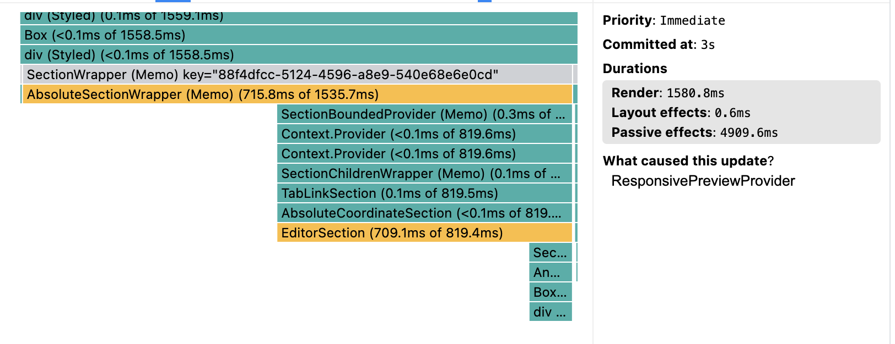
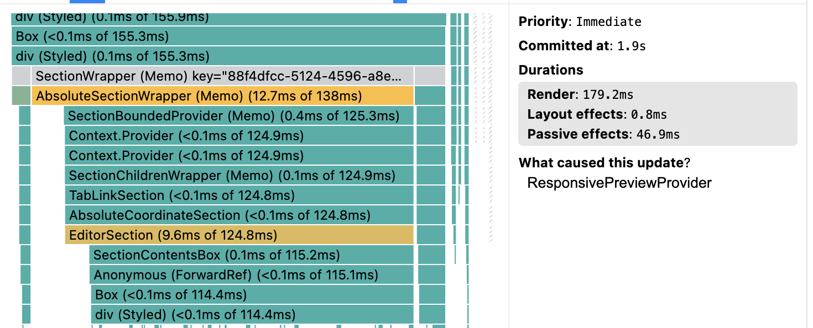
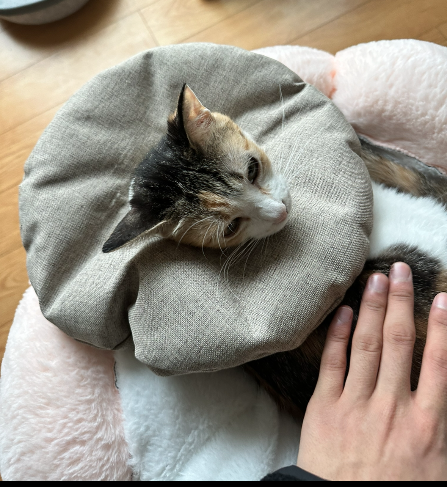
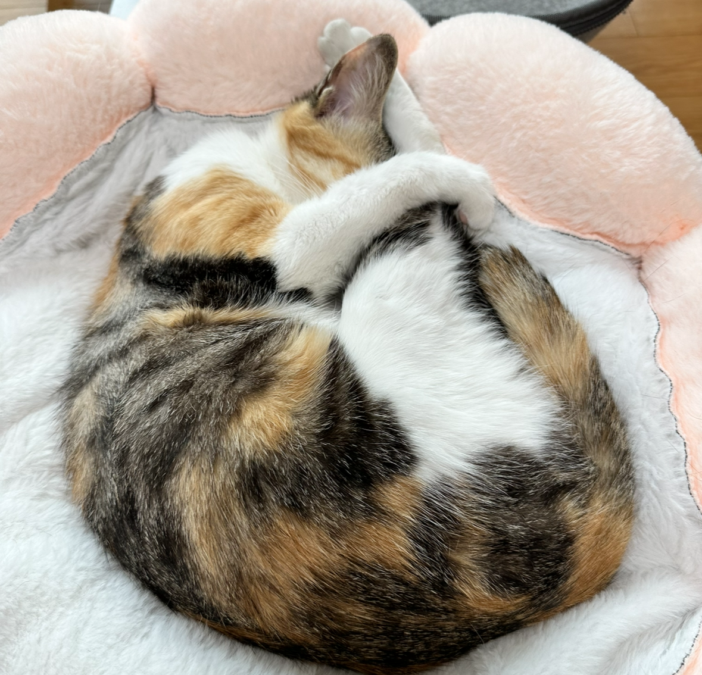
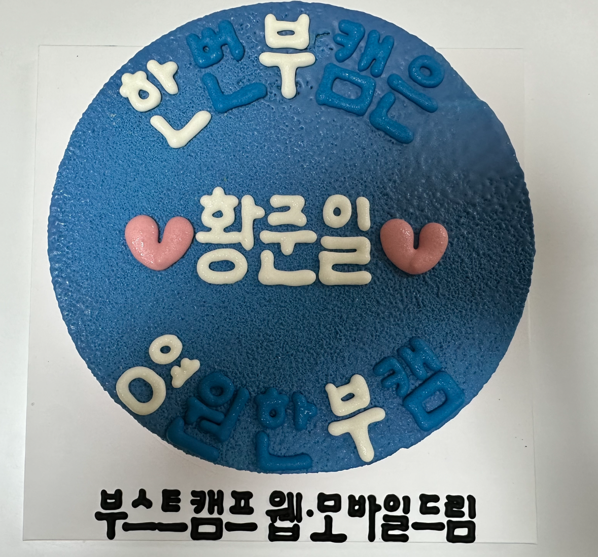

---

title: 2024년 1월 회고
description: 1년치 목표를 정하는건 너무 어려운 일이다. 내가 되고 싶은 모습과, 그 모습이 되었음을 증명하는 것, 참 어렵다.
sidebarDepth: 2
date: 2024-02-03 18:30:00
thumbnail: https://raw.githubusercontent.com/JunilHwang/TIL/master/Review/2024-year/01/img/5.png
tag: 회고

feed:
  enable: true

---

# 2023년 1월 회고

> 나름 만족스러운 한 달이었다.

- 팀 내에서는 주로 목표 설계에 힘을 많이 썼다. 하지만 1년치 목표를 정하는건 너무 어려운 일이다. 내가 되고 싶은 모습과, 그 모습이 되었음을 증명하는 것. 참 어렵다.
- 1월 초에 폭풍 같은 결정(?)을 많이 했다. 무엇을 해야할지 정리하다보면 지금 당장 할 수 있는 것들이 눈에 보인다. 그것들을 하면 된다.
- 아키텍트는 뭘까 생각해봤다. 될 수 있을까?

> 2월에는 뭘 하면 좋을까?

- 회고가 아니라, **2월 TIL 이라는 포스트를 만들어서 올린 다음에 매일매일 업데이트 하면 어떨까?** 블로그를 조금 더 잘 활용해보고 싶다.
- 리팩토링에 대한 글을 하나 올리면 어떨까?
- 시간을 정해서 책을 읽어보자. 일단 읽는 것 부터 시작하기.

 

## (1) nBilly

### 1) 모듈화

- nBilly에서 만들어진 것들 중에 공용화 할 수 있는 것들을 모듈화 하는 작업을 진행했다.
- 지금은 이미지, 동영상 업로더와 렌더러에 대해서만 모듈화를 진행했는데 생각보다 고려할게 많아서 이게 진자로 쓰일 수 있을지는 앞으로 어떻게 하냐에 달렸다.
  - 호환성도 신경써야 하고, 인터페이스도 다양하게 뚫어줘야 하고, 업데이트도 주기적으로 해야 하고, 이슈도 주기적으로 대응해야 하고.
  - 신경써야 할게 참 많다.
- 그런데 이 과정이 나름(?) 재밌다.
  - 똑같은 관심사를 다루는 코드 조각을 모아서 응집도 있게 만들고
  - 이 과정에서 코드를 리팩토링 하고 테스트 코드를 작성하고.
  - 문서도.. 작성하고..?

 

### 2) 문서 작업

- 팀에서 관리하는 문서들이 꽤 오랫동안 방치되어서 모듈화 관련 문서를 작성하면서 어느 정도 업데이트를 했는데 해도 해도 끝이 없다.
- 이 때 리더님이 문서화에 대한 가이드를 해주셨는데 내용이 좋았다.

  [Introduction - Documentation System](https://documentation.divio.com/introduction.html)

  | - | [tutorial](https://documentation.divio.com/tutorials.html#tutorials) | [How to](https://documentation.divio.com/how-to-guides.html#how-to) | [Reference](https://documentation.divio.com/reference.html#reference) | [Explanation](https://documentation.divio.com/explanation.html#explanation) |
  | --- |----------------------------------------------------------------------|---------------------------------------------------------------------|-------------------------------------------------------------------|-----------------------------------------------------------------------------|
  | oriented to | learning                                                             | a goal                                                              | information                                                       | understanding                                                               |
  | must | allow the newcomer to get started                                    | show how to solve a specific problem                                | describe the machinery                                            | explain                                                                     |
  | its form | a lesson                                                             | a series of steps                                                   | dry description                                                   | discursive explanation                                                      |
  | analogy | teaching a small child how to cook                                   | a recipe in a cookery book                                          | a reference encyclopedia article                                  | an article on culinary social history                                       |
- 처음에는 한 문서에 모든 내용을 담았는데, 크게 혼나고(?) 다음과 같이 분류해서 만들었다.
  - 미디어 모듈을 사용에 대한 튜토리얼 (특정 미디어 모듈로 목표를 달성하기 위해 해야되는 과정들)
  - 미디어 모듈을 사용할 때 필요한 레퍼런스 (팀 내 위키로 이관)
  - 미디어 모듈의 목적과 설명 (핵심개념)

개인적으로, 피드백을 주기적으로 받을 수 있으면 좋긴 하지만 어쨌든 처음부터 끝까지 일단 다 진행해보는 것도 중요하다고 생각한다. 정석으로 목표를 향해 달려가는 방법도 좋지만, 조금 돌아가더라도 이것 저것 경험해보는
것도 좋지 않을까? 비효율적이라는게 문제지만… 비효율적인 경험도 해봐야 뭐가 효율적인지 알 수 있는 것 같다.

**쓰다가 든 생각은, 난 똥인지 된장인지 먹어봐야 아는 사람인가보다... 된장… ~~과연 나는 이 험난한 세상을 잘 살아갈 수 있을까?~~**

 

### 3) KPI 작성

::: tip goals-signals-metrics 프레임워크
리더님이 [링크드인이 개발한 goals-signals-metrics 프레임워크](https://linkedin.github.io/dph-framework/goals-signals-metrics.html)를 소개해주셨고, 이를 기반으로 2024년의 목표에 대해 생각해보는 시간을 가졌다.

- 개념
  - Goals: 구체적인 목표를 작성해야 한다. 그리고 목표는 측정할 수 있어야 한다.
  - Signals: 목표를 달성하고 있다는 것을 알 수 있는 신호에 대해 정의하는 것.
  - Metrics: 목표를 측정할 수 있는 숫자.

- 작성해보기
  - Goals: 팀의 허리 역할을 할 수 있는 `아키텍트` 가 되고 싶다. (지금 생각해보면 이게 측정 가능한 목표는 아닌 것 같다.)
  - Signals: 팀원들이 나에게 아키텍쳐 설계에 대한 질문을 많이 할 때. 내가 제시한 설계가 수용될 때
  - Metrics: 아키텍처 설계 관련 질문 빈도, 질문 유형, 답변의 유용성을 수집하고 기록해서 점수를 부여하고 변경 요청 건수, 수용률을 추적하기
:::

- 팀 KPI에 대해 리뷰하는 시간을 가지고, 여기에 정렬된 나의 역할/목표/성과지표 등을 작성하는 시간을 많이 가졌다. ~~많이 가지면 뭐하나, 잘 작성해야지.~~
- 제일 많이 들은 피드백은 목표를 구체적으로 작성하라는 것. 누구나 상상하기 쉬운 목표가 좋다는 것.  
  **[X]** 아키텍트가 되자.  
  **[O]** 아키텍트가 뭐하는 사람이야? 에 대해 1시간 정도는 거뜬하게(?) 설명할 수 있는 상태가 되자.  
  **[X]** 영어 공부를 하자.  
  **[O]** 영어로 1시간 정도는 대화할 수 있는 상태가 되자.  

- 그 다음은 목표를 잘 달성했는지를 점검할 수 있는 지표를 산출하는 것.  
  **[목표]** 백오피스 제작에 필요한 기술적난제를 해결하는 아키텍처를 리서치하여 팀에 방향성을 제시하고, 아키텍처를 실현하여 문제를 주도적으로 해결한다 
  **[지표]** 에픽 단위의 기술적 난제에 대해 문제 식별부터 해결책 리서치, 제시, 문제해결까지 기여한 사례를 3건 이상의 사례 만들기

- KPI를 작성할 때 GPT의 도움을 많이 받았다. 확실히 GPT가 생겨서 생각을 표현하기가 수월하달까? 나처럼 추상적인걸 구체적인걸로 표현하는 능력이 부족한 사람에게 너무나 좋은 친구다.

아키텍트가 되고자 하는 목표 자체가... 너무 높은 난이도인 것 같기도 하고. ~~일단 지금 하는 일 부터 잘 해야 하지 않을까?~~

나는 산을 오르고자 할 때 꼭대기를 바라보며 걸어가기 보단, 중간 지점이나 바로 위의
계단을 보면서 올라가는 편이다. 그러다보니 이런 장기 목표와 되고 싶은 모습을 상상하고 설계하고 나아가는게 너무 어색하고 어려운 것 같다.

 

### 4) 디바이스 모드 전환시 성능 최적화

| before                   | after                    |
|--------------------------|--------------------------|
|  |  |
| 총 6초 이상이 걸렸다.            | 0.2초 정도의 수준으로 개선했다.      | 

1월 마지막 주에 진행한 일인데, 생각 이상으로 만족도가 높았다. 물론 부족한 부분도 분명 있었지만..?

이 티켓은 다음과 같이 진행했다.

1. 목표를 점검하기.
2. 작업 목록 및 일정 추정 후 피드백 받고 반영하기.
3. 이슈 원인 파악하고 공유하기
4. 문제 해결 수준 결정하기
5. 문제 해결을 위한 아키텍쳐 설계 후 공유한 다음 피드백 받기
6. 문제 해결 (코드 작성, 테스트 코드 작성, 코드리뷰)
7. 트러블 슈팅 문서 작성

그리고 올 해부터 리더님이 0%, 20%, 80% 리뷰를 하기로 해서 중간중간 이 티켓에 대해 이야기 하는 시간을 가졌다. 작업이 크게 어려운 부분은 없어서 무난하게(?) 지나간 것 같다.

이번에는 아예 처음부터 트러블 슈팅 문서를 작성했는데, 덕분에 자연스럽게 설계에 집중하게 되고 이걸 다른 사람에게 잘 보여주고 전달하기 위한 고민들을 할 수 있었다.

모든 티켓을 이렇게 진행하면 어떨까 싶기도 하고..?

2월에는 정말 꼭 성능 최적화와 관련된 내용을 회사 기술 블로그에 올려보고 싶다. ~~좀 하자 이녀석아~~

 

### 5) 2023년 성과 면담

회사의 정책이 변경되면서 성과를 측정하는 방식도 많이 달라졌다.

- 성과: KPI를 얼마나 잘 달성 했는지
- 과정: 개인이 그 일을 할 때 얼마나 집중하고, 노력하고, 치열하게 기술적인 고민을 하면서 올라갔는지.
- 영향: 조직 내에 내가 얼마나 큰 영향을 주고 있는지 ( 조직을 변화시키고 시너지를 이끌어내는 수준 )

면담 과정에서 나의 단점에 대한 이야기들을 많이 해주셨다. 사실 이미 너무나 잘 인지하고 있는 모습이라서 별다른 타격이 없었다.

- 커뮤니케이션
  - 두괄식으로 말했으면 좋겠다.
  - 내가 하는 일에 대해 예측이 되도록 했으면 좋겠다.
  - 자주 공유했으면 좋겠다.
  - 이야기를 하다가 딴 길로 새지 않았으면 좋겠다.
- 인사이트
  - 팀원들에게 인사이트를 줬으면 좋겠다. 지금은 뚜렷한 모습이 없다.
- 디테일과 완성도
  - 일을 진행할 때 꼼꼼하게 진행했으면 좋겠다.
  - 가끔 중간중간 챙기지 못하거나 빼먹는 일들이 보여서 아쉽다.
  - 일을 멀리 봐야 되는데 당장 눈 앞에 보이는 것만 해결하려고 하다보니 문제가 되는 경우들이 많이 보인다.
- 자기어필
  - 기술적인 어필을 해야 되는데 가끔 보면 철학자스러운 이야기를 한다.
  - 기술적인 성장에 대해 고민을 해보면 좋겠다.

**다 적극적으로 인정하는 내용들이라 딱히 할 말이 없었다.** 흠… 내가 보완을 잘할 수 있을까? 노력으로 해결할 수 있는 부분과 해결할 수 없는 부분들이 몇 가지 보이지만, 일단 해보는 수 밖에!

 

## (2) 사생활

### 1) 가족과의 대화

문득 **“나에 대해 제일 모르는 사람은 가족들이 아닐까?”** 라는 생각이 들었다. 마찬가지로, 우리 가족 개개인에 대해 제일 잘 모르는 사람도 내가 아닌가? 라는 생각도 같이 들었다.

꼭 가족이 아니여도, 사람을 만나고 관계를 유지할 때 점점 내가 아는 모습에서 많이 달라지는 경우들이 있을텐데 **그 간극을 매꾸지 않으면 내가 아는 사람은 내가 아는 사람이 아니게 된다.**

1월 초에 가족 모임이 있었고, 대화카드를 구매해서 처음에는 가볍게 이야기를 시작하다가 점점 진지한 이야기를 하기 시작했다. 우리는 서로에 대해 모르는 모습이 너무도 많았고, 할 이야기도 너무 많았다.

매번 이러기는 쉽지 않겠지만, 어떤 관계든 건강하게 잘 유지하기 위해선 어느 정도의 노력이 필요하지 않을까? 특히 가까운 관계일수록 더 그런 것 같다.

 

### 2) 포동이 중성화

미루고 미루던 포동이 중성화 수술을 드디어 했다.

이번에 알게된 사실은 포동이는 태어날 때 부터 자궁이 기형이라서 에초에 불임이라고… 이럴줄 알았으면 진작에 중성화 수술을 해줬으면 좋았을텐데… 😭

수의사분이 수술을 하면서 포동이의 자궁이 기형인걸 알게 되었고, 포동이의 난소가 서로 이어져있지 않아서 일단 한 개만 제거한 다음에 수술을 마무리 했다고 해주셨다. 나머지 하나는 다음에 충분히 회복한 다음에 수술을
진행해야 할 것 같다고..

어쨌든, 지금은 잘 회복했다. 수술을 한 번 더 해야 된다는 사실이 마음이 아플뿐…

 

### 3) 부스트캠프

운영진, 마스터가 모여서 8기를 회고하는 자리가 있었다. 여러모로 느낀게 참 많았는데 지금은 느낀점이 다 휘발됐다. 그냥 스스로에게 아쉬운 점들이 무척 많았다는 것 정도..?

올해에 또 하게 된다면 다른걸 다 떠나서 **미리미리 캠퍼들과 소통할 수 있는 장치**들을 고민하여 만들고 운영해보고 싶다. 더 늙기 전에 열심히 해야할 것 같다.

 

### 4) 의미 있는 만남

1월에는 행복하게 살아가는 사람들을 많이 만났다. 좋은 영향을 주는 사람들을 보면서 느낀건, 결국 행복하게 살아가는 것은 참 많은 노력이 필요하구나 싶다.

나 스스로를 배려하고, 그만큼 주변 사람들을 배려하고, 예의를 갖추는 것.

성장과 행복에 대해 깊이 고민하는 것.

무엇 하나 쉬운 일은 없어보이지만 그럼에도 불구하고 참 보기 좋다.

**나를 만나는 사람들도 비슷한 감정들을 느꼈으면 좋겠다.**

 

### 5) 멀리 생각하자

공적이든 사적이든 생각이 짧은 내 모습 때문에 이래저래 많이 혼났다.

생각을 멀리 하고 싶어도 거기까지 도달하지 못할 때가 많다.

생각을 멀리 보낼 수 있는 방법은 뭘까? 아무리 노력 해도 타고난 사람들과 비교해보면 난 숲 전체를 보는게 안 되는 사람이다. 내 눈 앞에 있는 나무들을 챙기는 것도 벅차다.

이게 장점으로 작용할 때가 더 많은 것 같긴 한데, 단점으로 작용할 때는 수 많은 장점을 한 번에 덮어버린다. 스스로에게 타격이 너무 크달까..

그래도 시야가 정말 조금씩, 조금씩, 조금씩, 늘어나는게 느껴진다. 일단 이 정도에 만족해야지. 별 수 있나?

웬만하면 내가 할 수 있는걸 하자. 지금 당장 해결할 수 없는 일들에 고민하는건 참 힘들고 어렵고 답답하다.

~~그래도 좀 해주면 안되겠니?~~

 

### 6) 밥은 벌크로

1월에는 약속이 있는 날을 제외하곤 외식을 안 하려고 무척 애썼다. 카페도 거의 안 갔다.

밥도 벌크로 해놓고, 파스타 소스도 벌크로 만들고, 커피도 믹스커피를 많이 구매해서 먹고, 간식이나 디저트도 최대한 집에 있는 것들을 먹으려고 애썼다.

지금 당장 내가 줄일 수 있는 소비는 식비 정도 밖에 없는 것 같다.

돈을 막 쓰는 편은 아닌데… 왜 통장을 스쳐가는걸까? ~~서럽다.~~

 

### 7) 무협소설을 보면서 느낀 것들

너무 답답해서 뭘 해야 좋을지 모르겠고, 시간은 죽여야겠고, 그러다가 [절대회귀](https://series.naver.com/novel/detail.series?productNo=8981942)라는 무협소설을 봤다.

무협지긴 하지만, 싸우는 내용보단 **대화와 관계에 대한 내용이 무척 많아서** 더 재밌게 읽었다.

읽으면서 느낀 것들이다.

- 사람도 현상도 제대로 보기 위해선 한 걸음 떨어져서 봐야 한다.
- 감사한 마음과 미안한 마음을 묵혀두는 것은 좋지 않다. 감사한 사람에게 있는 그대로의 감사함을, 미안한 사람에게는 있는 그대로의 미안함을 전해야 한다. 이런 경험이 쌓이면서 신뢰할 수 있게 된다.
- 조급해지지 말자. 산을 오를 때 꼭대기를 보며 쭉 나아가는 것도 좋지만, 뒤를 돌아보면 세상이 한 눈에 보인다. 주변도 자주 둘러보고, 뒤도 돌아보고, 그러면서 세상을 눈에 담자. 그렇게 나를 넓혀야 한다.
- 신뢰하기 때문에, 신뢰를 받기 때문에, 그렇기 때문에 상대방에게 더 잘 해야 하고 배려해야 한다. 세상에 당연한 것은 없으며 꾸준한 노력이 동반되어야 한다.
- 어떤 사람과 친해지기 위해선 “친해지는 것” 자체를 목표로 하기 보단, 상대방을 “알아가는 것”을 목표로 해야 한다. 상대방의 세상을 들여다보고 이해하고 공감할 수 있을 때 진정으로 “친해졌다” 라고 이야기할 수
  있다.

그러다보니 작가가 “무협지” 라는 카테고리를 통해 결국 “인생”에 대해 이야기 하고 있다는 생각이 들었다. “어떻게 살아갈 것인가?”에 대한 이야기랄까.

재미를 넘어서 배움이 참 많았다.

 

## 회고에 대한 회고

회고를 작성하다보니, 회고라기보단 있었던 일들을 쭉 나열한 것 같다.

목표를 잘 달성하고 있는지에 대해 점검하는 것도 물론 좋지만… 이렇게 그냥 일상을 정리하는게 나에게는 더 소중한 시간이지 않을까?

목표에 대해 생각한다는 것은 앞을 보는 것, 그리고 더 멀리 보는 것이라고 생각한다. 그런데 나는 내가 겪은 경험들을 곱씹어보고 잘 소화시키고 싶은 욕망이 더 큰 것 같다.

그러다보면 자연스럽게 내가 가진 욕망들에 대해 더 잘 인지할 수 있고, 내가 의도하지 않아도 그런 욕망을 채우기 위한 일들을 하게 된다. ~~이정도면 나는 인간보단 본능에 충실한 동물의 범주에 더 가까운게 아닐까
싶기도..~~
