---

title: 2024년 회고
description: 개발자 그리고 교육자로서 지낸 1년의 이야기
sidebarDepth: 1
date: 2025-02-17 00:00:00
thumbnail: https://raw.githubusercontent.com/JunilHwang/TIL/refs/heads/master/Review/2024-year/end/thumbnail.jpeg
tag: 회고

feed:
  enable: true

---

# 2024년 회고

24년은 의도치 않게 개발자보단 **교육자의 정체성**이 더 돋보였던 1년이다.
덕분에 내가 가진 가치관의 해상도를 높일 수 있었다.
무수히 많은 input이 있었으나 이를 제대로 소화하지 못했고, 이렇게 회고로 배설하게 되었다. ~~(다 쓰고나니 변비가 해소된 이 느낌!!)~~

## 2024 목표 달성 점검

- [ ]  의식적으로 변화 하기 위한 노력을 하기
    - 이제보니 목표가 꽤 추상적이다. 이런 목표는 앞으로 작성하지 않아야겠다.
- [ ]  기록할 수 있는 것들은 다 기록하기
    - 연초에는 기록하기를 열심히 했었는데… 작심 한 달이었다.
    - 나의 모습을 관망해보면 기록을 귀찮아하는 모습을 많이 보인다.
- [x]  이사하기 (또?)
    - 곧 이사갈 예정이다. 계약을 24년에 했으니 어쨌든 목표는 달성!
    - 이사를 하기 위해 모든 시간을 갈아넣었다고 해도 무방한다.
- [ ]  KPI 를 의식적으로 관리하기
    - 1월 한 달은 열심히 했으나…. 그뿐이다.
    - 목표를 구체화하는 것의 중요성은 인지했지만, 이를 의식적으로 관리하는 것 또한 에너지를 꽤 많이 사용한다. 돌이켜 생각해보면 의식적으로 생각하는 목표는 머릿속에 항상 박혀있어서 큰 문제는 되지 않았었다.
- [ ]  1년, 1달, 1주, 1일 목표 설정 및 실행
    - 위와 동일하게, 1월 한 달은 열심히 했다….
- [ ]  매일매일 뭐가 되었든 공부하자.
    - 매일 무언가를 의식적으로 공부하진 않았다. 예전의 나는 어떻게 매일 공부했을까? 그 열정이 어디로 간건지.. 지금의 나는 열정 바사삭
- [ ]  금전 계획 세우고 달성하기
    - 반만 달성한 것 같다. “어떻게 수익을 만들 것인가”에 대한 목표는 뚜렸했으나… “어떻게 구멍을 막을 것인가”에 대한 목표는 거의 없었다. 사실 결혼 준비 때문에 에초에 “막는다”를 산정하는게 불가능하지 않았을까….?
- [x]  건강관리
    - 태어나서 지금이 제일 건강한 상태라고 생각한다.
    - 지방과 근육이 같이 늘어났다. 작년이 맘때랑 비교하면 체중이 12kg 증가했다. 태어난 이후 쭉 체중이었는데 지금은 과체중이다.
- [x]  고양이들 건강관리
    - 이것도 반만 달성한 것 같다. 올해는 포동이도 쪼랭이도 크게 아프지 않았는데.. 병원을 자주 데려가진 못했다.
- [x]  더 디테일한 심리검사 받아보기
    - MBTI나 강점검사 등 이것저것 받아보긴 했는데… 아쉽다.
    - 심리검사를 떠나서 내가 어떤 사람인지 작년보다는 더 명확하게 알게 되었다.
- [ ]  주기적으로 회고 작성하기
    - 말할 것 없이 대 실패!
- [ ]  초보운전 탈출
    - 초보운전은… 차를 구매해야 탈출할 수 있을 것 같다.
    - 지금은 이리봐도 저리봐도 운전 초보가 확실하다.
- [ ]  아주 작은 단위 스터디를 자주 해보기.
    - 자주는 아닌데 어쨌든 하긴 했다.
- [x]  생산성을 높일 수 있는 방법 생각해보기.
    - AI를 통해 나름 높일 수 있었다.
    - AI가 아니었으면.. 생각만해도 끔찍하다.

## 1. nBilly

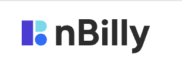

24년에는 팀에서 나름 재밌는 일들을 많이 할 수 있었다.
그리고 이와는 별개로 내가 이곳에서 일을 하는 의미에 대해 다방면으로 고민하는 시간이 많았다.
팀에 합류한 후 다방면으로 성장할 수 있어서 좋았지만, 너무나 아쉬운 점은 다른 사람에게 nBilly를 소개할 때 굉장히 난해했다는 것.

우리 팀이 하는 일이 무엇인지, 어떤 문제를 해결하고자 하는지, 그래서 내가 하는 일을 다른 사람들에게 어떤식으로 보여줄 수 있는지를 표현하는게 힘들었다.
일반 사용자가 우리 팀의 제품을 사용하는 것은 불가능하고, 사내에서도 일부 인원에게만 사용권한을 허용하고 있다. SDK로 만들었으나 SDK로 쓰이는 곳이 없다.
그래도 [nBilly로 만들어진 페이지](https://campaign.nbilly.naver.com/nbilly-portfolio)가 은근히 많고, 각 페이지로 유입되는 사용자가 적진 않은 편이다.
앱 메인의 광고로 등장한 적도 있고, 각종 SNS를 통해 연결된 적도 꽤 있다.
다른 방면으로 생각하면 “나쁘지 않은데?” 라고 할 수 있으나… 그래도 아쉬운 마음아 한 구석에 자리잡고 있다.

### (1) 제품

#### 1) 디바이스 모드 전환시 렌더링 최적화

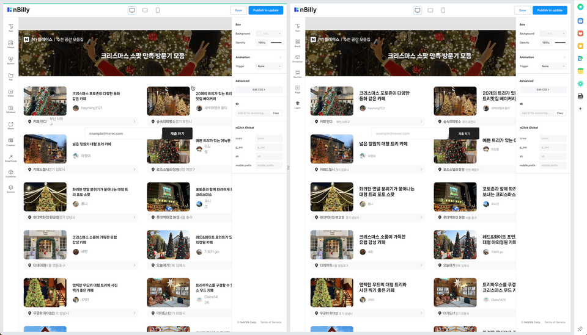

- AS-IS
    
    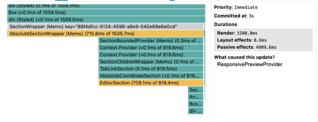
    
- TO-BE
    
    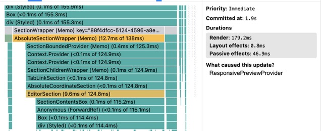
    

편집 페이지에서 Desktop 모드에서 Tablet 혹은 Mobile로 전환할 때 렌더링 비용이 미친듯이 늘어나는 현상이 있었다.
사실 렌더링 자체가 오래걸리는 이슈는 아니고, 렌더링을 위해 좌표를 계산하는 로직에서 불필요하게 많은 개체를 가져오고 있어서 이를 살짝 손봤더니 드라마틱(?)한 개선이 되었다.

큰 데이터를 다루는 로직을 다룰 때 발생하는 문제였달까… 생각보다 쉽게 해결한 문제였다.

#### 2) FlexLayout

Figma의 AutoLayout과 거의 똑같이 만들었다.


Drag&Drop 방식으로 중첩된 개체를 표현하려고 하니 정말… 말도 못하게 힘들었다. 사실 도메인 자체는 생각보다 단순하게 풀렸는데, UX로 표현하는게 보통일이 아니었달까.. CSS가 자연스럽게 계산해놓은 Gap을 손수 계산해서 보여주기도 하고, 미리보기 기능도 추가하고, 이것저것 참 많이 있었다.

이 작업을 하면서 시도했던 부분은 “인수조건”과 “인수테스트”를 작업 전에 미리 다 정의하는 것. 어찌보면 TDD와 비슷하다고 할 수 있다. 목표가 달성된 모습을 텍스트로 정의한 다음에 이를 코드를 통해 자동 테스트를 하는게 아니라 개발자가 한땀한땀(?) 직접 테스트하는 과정이랄까.

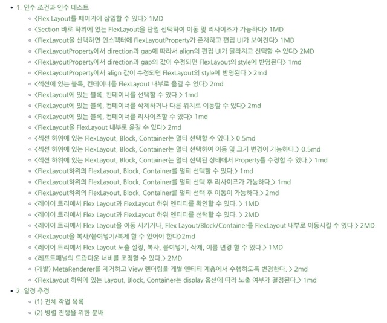

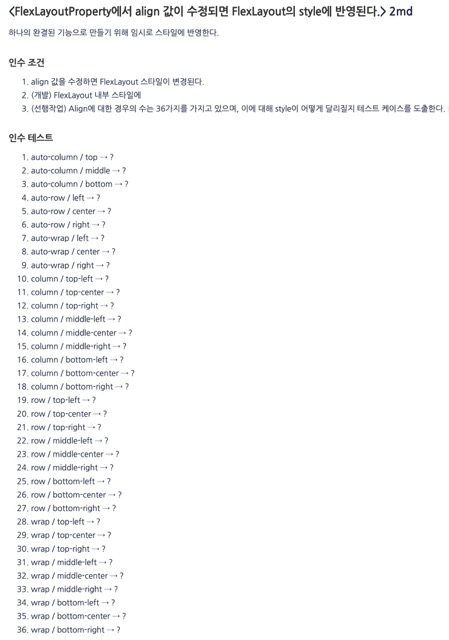

작업을 나열하고 병렬로 진행할 수 있는 부분과 직렬로 진행할 수 있는 부분을 구분했고, 하나의 작업은 최대 2MD로 산정했다.

초반에는 나름 매끄럽게 진행 되었으나… 시간이 흐를수록 예상하지 못한 엣지케이스와 사이드이펙트가 너무 많았고 예상보다 거의 두 달 가까이 완성 일정이 밀렸다.

이 때 “무엇을 위해 이렇게까지 만들어야 하는가”에 대한 고민을 많이 했었다. 현타가 자주 왔달까…

난이도가 높은 과제였고, 그만큼 재밌었고, 그만큼 힘들었다고 할 수 있다.

#### 3) Query 연동

일종의 Postman 같은 UI가 에디터 내에 삽입되고 이를 기반으로 데이터를 연동할 수 있도록 만들었다. 이 때부터 claude를 적극적으로 이용했었다.

앞에서 언급한 것 처럼, “인수조건”과 “인수테스트”를 작성할 때 claude에게 엣지케이스를 도출할 수 있게 가이드를 했고, 복잡한 UI에서 재활용할 수 있는 부분을 분리하고 리팩토링을 할 때에도 적극적으로 사용했다.

<div style="display: flex; justify-content: space-between;">
  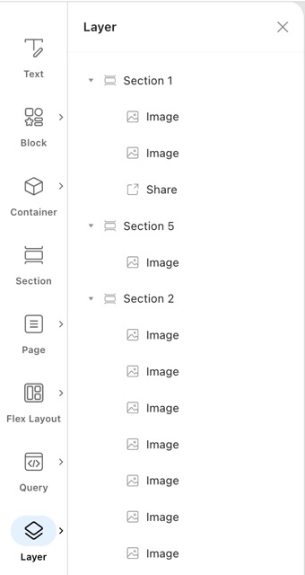
  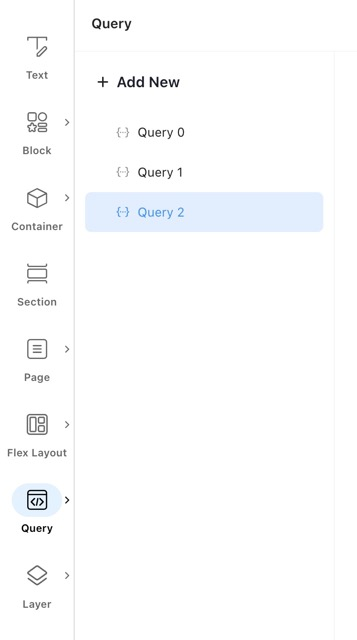
</div>

- 유사하지만 약간 다른 Tree UI
- 가져오는 데이터가 다름
- Sortable 여부가 다름
- Depth가 다름
- 나머지는 동일

그래서 코드를 분리하고 리팩토링을 하다고 요청했더니 진짜 해줬다. 미친성능이었고 짜릿했다.

#### 4) nBilly 확장프로그램 개발

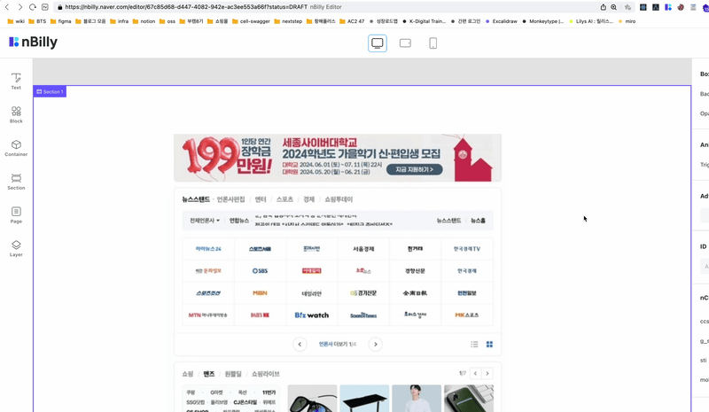

우리 팀에는 CMS가 없다. 그래서 다른 문서를 복사해서 현재 편집 상태에 덮어쓰는 기능을 확장프로그램으로 만들었다.

이 외에도 운영에 필요한 다양한 기능을 확장프로그램에 점진적으로 추가해서 사용했다. 누가 시켜서 만든건 아니고, 그냥 내가 하고 싶어서 했던 일 중에 하나였다. 현재 팀에서는 이런 시도를 한게 처음이었는데 재밌었다. ~~청개구리 심보~~

#### 5) 빌드/배포 파이프라인 개선

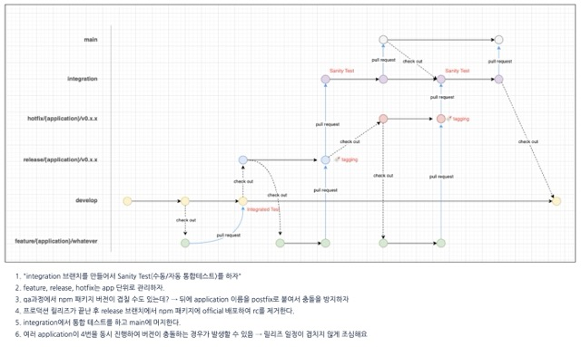

모노레포에 여러 어플리케이션이 있으니 이를 관리하는 비용이 점점 증가했다. 그래서 사이드 이펙트를 최소화 하기 위한 과정에 대해 고민하고 리서치를 진행했었다.

- release/{application}/{version} 처럼 릴리즈 브랜치를 관리
- release를 main에 병합하기전에 integration 브랜치에서 세니티 테스트를 진행

큰 맥락은 이렇게 두 개다.

주로 비슷한 시기에 서로 다른 어플리케이션을 릴리즈하는 일이 발생할 때 이를 해결하기 위한 프로세스랄까?

#### 6) nBilly + claude + n8n → 대시보드가 뿅!

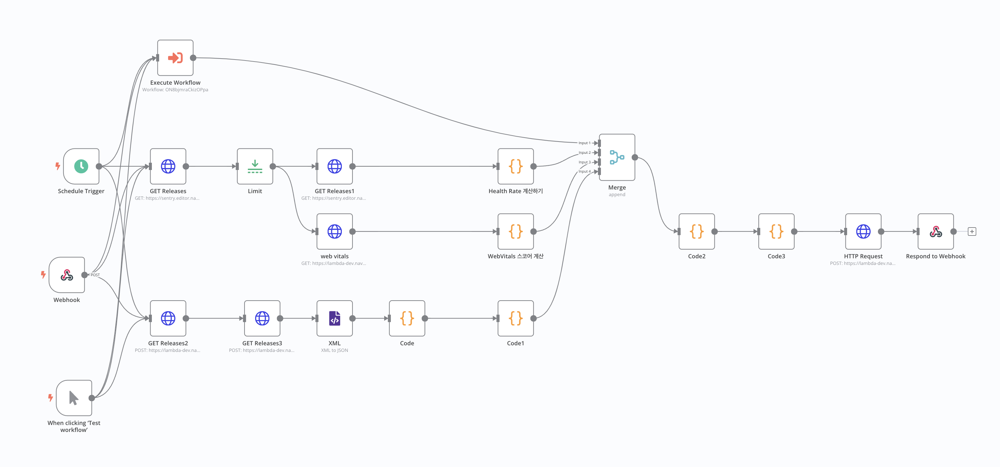

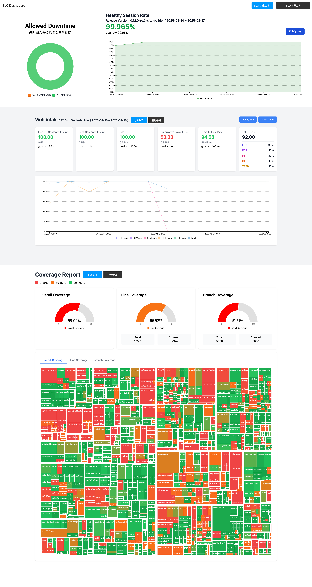

n8n이라는 워크플로우 자동화 도구를 이용해 서비스 지표를 수집하고, nbilly에 접목해서 제품의 서비스 지표를 한 페이지에서 한 눈에 볼 수 있도록 만들었다.

sentry, wiki, github 등 다양한 곳에서 데이터를 수집하고 보여주기 때문에 생각보다 귀찮고 어려운 작업이었으나 어찌저찌 잘 해결되었달까..

만들 때는 무척 재밌었는데 만들고나서 보니까 꽤 조잡하다.

그리고 이에 대한 연장선으로 서비스 지표를 주기적으로 슬랙으로 확인할 수 있도록 만들기도 했다.

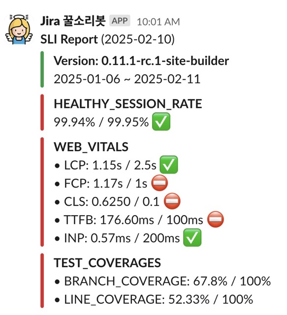

지표를 보내준다는 것보다, 워크플로우를 손쉽게 만들 수 있는 기술을 도입했다는 것에 더 큰 의의가 있는 것 같다.

#### 7) 데이터 연동 자동화

전부 공개하기는 어렵지만, figma + nbilly + api + ai 등을 연결해서 UI를 자동으로 뿅 하고 만들어주는 그런 일도 진행했다. 정식 제품이라기보단, 기술을 만들고 이를 기반으로 사내 UI 생산성에 기여하고자 하는 일을 하는 중이다.

### (2) 팀

이번엔 팀 관점에서 생각해보고자 한다.

#### 1) 우리 팀의 특징

- 내가할 수 있는 일을 우리가 할 수 있게. 우리가 할 수 있는 일을 모두가 할 수 있게. 공유하고 전파하는 문화가 자리잡힌 상태다.
- 결과에 대한 기준 보다 과정에 대한 기준이 높다. 일의 프로세스가 촘촘하게 설계되어있다. 사실 이건 리더인 훈민님의 성향이 반영된 결과라고 생각한다.
- 논의가 필요하면 바로 슬랙으로 호출하는 원격근무 문화. 덕분에 같이 모여서 일하는 것 보다 재택으로 일하는게 생산성이 더 높은 것 같다.
- 신뢰 기반 충돌을 하는 중이다. 하루에 꽤 많은 논의가 이뤄진다. 피드백도 잘 주고 받는 편이고, 수용도 잘 되는 편이다.

#### 2) 과정과 결과

위에서 이야기 했지만, 결과보단 과정을 더 중요하게 생각하는 문화라고 느껴진다. 결과물이야 어찌되었든 과정을 통해 얻은 경험 자체도 성과이고 이를 토대로 더 많은 일을 할 수 있도록 장려한다.

다만 회색 영역을 굉장히 지양한다. 명시적으로 파악 되지 않은 부분에 대해선 어떤식으로든 알아내고 관리하고자 한다. ~~찐 J 그룹~~

#### 3) 방향성

지금 시점의 네이버는 어떤 조직이든 그렇겠지만, 방향성의 변화가 폭풍같다.

처음에는 제품을 개발하는 느낌이었고(사실 처음부터 우리는 기술 플랫폼 조직의 성격이었다고 한다), 웹 빌더에 힘을 쓰다가 이제 완전히 방향을 틀어서 기술 플랫폼으로 전환했다. 제자리로 돌아왔다는 표현이 맞는 것 같다.

빌더에도 신경써야 하고, SDK나 기술확보에도 신경써야 하기 때문에 컨텍스트 스위칭이 빈번하게 발생한다. 좋게 말하면 역할이 많고, 나쁘게 말하면 몰입하기 힘든 환경이라고 생각한다.

#### 4) 온보딩

온보딩 문서에 기여하는 사람은 온보딩을 하는 사람이다. 내가 합류하던 시점에는 문서를 기반으로 온보딩을 진행했는데, 제일 최근에는 온보딩 버디와 함께 페어로 일을 하면서 영상을 촬영하고 이를 기반으로 빠르게 온보딩에 기여할 수 있도록 시스템이 개선 되었다.

덕분에 제일 최근에 합류하신 분은 첫 배포 티켓을 완료하기 까지 대략 2주~3주 정도의 시간이 소요되었다. 그럼에도 불구하고 파악해야 하는 컨텍스트가 굉장히 많아서 어려움을 겪는 중이다.

24년에 두 번이나 온보딩 멘토로서의 역할을 수행했는데, 사실 신경쓰지 못한 부분이 너무 많아서 죄송스러운 마음이다.

#### 5) 워크숍 위원회

nBilly의 상위 조직인 SmartStudio의 워크숍을 진행하는 위원회 역할을 수행했다. 나는 친밀감을 쌓기 위한 프로그램을 진행했는데, 모든 구성원의 MBTI와 취미를 수집했고 워크숍 당일에 대화카드를 제공하면서 서로 질문을 주고 받으며 친밀감을 쌓도록 유도했다.

어떤 그룹은 대화카드를 유용하게 사용하기도 했고, 어떤 그룹은 “이거 왜 주셨어요?”라고 물어보기도 했다. 나름 재밌는 경험이었다.

#### 6) 시너지, 그리고 강점

마지막 분기에 PoC 과제를 수행하면서 이전에는 경험하지 못했던 팀원과의 시너지를 느꼈다. 서로의 강점이 다르고, 자연스럽게 이를 살려서 잘할 수 있는 부분을 맡아서 진행했다.

특히 나와 상호보완이 되는 분이 있어서 재밌었다. 아이디어를 툭 하고 던져주시면 내가 거기에 살을 덧붙이고 구현하는 방식으로 진행했다. 도전적인 부분을 도맡아 하는 팀원도 있었기 때문에 혼란스럽지만 재미있게 진행할 수 있었다.

사실 이전에는 강점보단 취약점을 보완하는 방향으로 팀이 굴러갔다고 느꼈다. 단점 보완 위주의 피드백이 주였달까…

일의 컨텍스트가 많다보니 무언가에 집중해서 할 수 있는 시간이 생각보다 많이 없었던것 같기도 하다. 강점보단 약점이 드러나기 쉬운 환경이랄까…

### (3) 강점 찾기

연말 워크숍 때 강점과 성향에 대해 찾아내고 분석하는 프로그램을 진행했다. 나는 완전한 회색분자였달까…

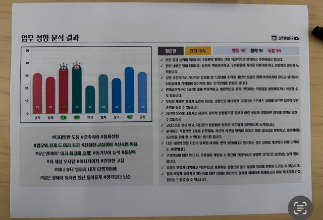

혼자서 일하는 것을 선호하지만,  주도적인 성향이 있고, 팀원들과의 시너지를 중요하게 생각하는 친절형이다.

좋게 말하면 두루두루 신경쓰고 있다는 것이고, 나쁘게 말하면 이도저도 아닌 사람이라는 것.

MBTI도 그렇고, 내가 추구하는 가치관도 그렇고, 어딘가에 쏠리는게 아니라 균형을 중요하게 생각해서 이런 결과가 나오는게 아닐까?

::: tip 🔒

회사에서 하는 일을 직접적으로 드러내는건 민감한 일이다보니 한계가 있다. 터넣고 이야기 하고 싶은 우리 팀의 이야기가 참 많은데, 여유가 되면 다른 글에 담아볼 예정이다.

:::

## 2. AC2 (Agile Coach Squared) 47기

[Agile Coach Squared](https://www.ac2.kr/)

AC2는 함께자라기 라는 책의 저자로 유명한 김창준님께서 운영하는 교육 과정이다. 문제해결, 성장, 코칭, 소프트스킬 등 굉장히 다양한 내용에 대해 다루고 있다.

### (1) 계기

사실 몇 년전부터 너무 듣고 싶었던 교육 과정이었다. 2021년, 줌인터넷(현 이스트에이드)에 근무할 때 협업, 성장, 기업문화 같은 주제로 리서치를 하다가 AC2의 존재를 알게 되었고, 너무 듣고 싶어서 오픈 알림 신청을 했었는데 정규 과정 대신 Effectuation 이라는 주제의 Patch 과정을 들을 수 있었다. 처음 김창준님의 인사이트를 접한 영상이 [**Agile Korea 2012 - 개인이 조직을 바꾸는 법 by 김창준](https://www.youtube.com/watch?v=eDtuLZ3nskc)** 이었고, 이게 Effectuation 을 다루는 내용이었는데, 저 영상을 본 날 Effectuation 과정을 진행한다는 알림을 메일로 받은 것이다.

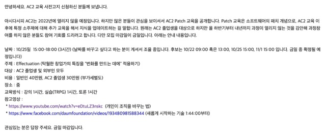

이 때 들었던 내용이 지금도 선명하게 기억날정도로 인상 깊었고, 무엇보다 이론 설명 후 바로 실습을 해보는 과정으로 진행되기 때문에 내가 마음만 먹으면 배운 지식을 즉시 활용하기 좋았었다.

여튼, 각설하고 이후에 AC2 정규 과정을 꼭 참석해야지 생각하면서도 **“지금은 시간이 없으니까~”** **“필요할 때 듣는 게 더 좋을 것 같은데?”** 등의 같잖은 핑계로 2년동안 외면했었다. 그런데 하필(?) 이번에 **“시간이 없어봤자 얼마나 없겠어!?”** 라는 생각이 들었고 바로 신청했다. **문제는 AC2를 진행하는 시기가 내 인생 역대 최고로 바쁜 기간이었고, 과정 초반 이후에는 제대로 참여하지 못했다.** 그럼에도 불구하고 AC2를 통해 느낀 것들이 무척 많고, 내가 가진 가치관의 해상도를 높일 수 있었다.

### (2) 멘토링

AC2에는 멘토링과 코칭이 존재한다. 멘토링은 멘토로 지원한 선배 기수에 계신 분들께 직접 컨택하고 대화를 나누고 상호 합의하에 멘토/멘티가 된다. 누군가가 나서서 멘토와 멘티를 맺어주는게 아닌 서로를 직접 발굴하는 시스템이다. 멘토가 멘티의 수와 거의 비슷하기 때문에 나와 잘 맞는 멘토를 찾기 위해서는 시간 투자를 꽤 많이 해야한다. 초반에는 꽤 많은 멘토분들께 연락을 드리고, 30분씩 이야기를 나누고, 정리하고 피드백을 나눴었는데 무수히 많은 개인 일정이 겹치면서 결국 멘토링 시스템에 녹아들기는 실패했다. ~~사실 멘토와 매칭이 되었어도… 제대로 멘토링을 진행하지 못했을 것 같다.~~ 

### (3) 자발적으로 만들어가는 위원회

정규과정이 시작되기 전에 과정 진행을 수월하게 해주는 위원회를 자발적으로 구성해야 한다. 계획, 의사결정, 소통, 참여, 재미, 퍼실리테이션, 학술 등의 주제에 해당하는 위원회가 존재하고 모든 구성원은 각 위원회에 소속 되어야 한다. 스스로 목표를 세우고, 스스로 행동하고, 스스로 결정한다. 과정을 운영하는 사람들의 터치는 최소화 한다.

이 때 “어떻게 사람을 움직이게 할 수 있을까?”에 대한 고민이 있었다. 위원회 활동은 사람들의 참여와 행동을 유도해야 하는데 각자의 직업이 다르고, 각자 투자해야 하는 시간이 다르고, 각자의 컨텍스트가 다르기 때문에 쉽게 합을 맞추는 과정이 너무 어렵고 복잡했다.

목표를 세우고, 목표 달성이 된 상태를 정의하고 ( 일종의 KPI 랄까? ), 이를 다시 위원회 구성원과 합의하는 과정을 거치고, 그 다음에 행동하는 방식으로 전개된적이 많았는데 문제는 이 방식이 나에게는 무척 답답하고 느리다고 느꼈다.

목표를 구체화 하는게 중요하다는 사실은 너무나 잘 알고 있다. 합의된 목표를 만드는 것이 조직 생활에 얼마나 중요한지도 알고 있다. 다만 나는 구체적이고 뚜렷한 목표가 짧은 시간 내에 만들 수 없는 사람이고, 어떻게 보면 다른 성장 가능성에 대해 벽을 세운다는 느낌을 받았다.

커다란 목표에 다가가기 위해선 무수히 작은 목표가 필요하다. 내가 한 분야에 특출난 재능이 있는게 아니라면 어떤 일을 잘 하기 위해선 무수히 많은 반복적인 행동과 피드백과 투자 시간이 필요하다.

개발을 잘 하기 위해선 개발을 해야 하고, 운동을 잘 하기 위해선 운동을 해야 하고, 글을 잘 쓰기 위해선 글을 써야 한다. 다만 그냥 하면 안 되고, 행동 이후에 빠른 피드백이 필요하다. 

어쨌든, “어떻게 사람을 움직이게 할 수 있을까?”에 대한 나만의 결론은 “은근슬쩍” 이다. 사실 1:1 코칭 시간에 얻은 인사이트인데 사람들에게 무언가를 설명하고 설득하고 “이러저러해서 좋으니까 하세요!” 라고 말한다고 해서 듣는 경우는 무척 드물다. 일단 나는 그런 사람이다.

“그게 정말 좋아? 그럼 해볼까?” 라고 생각한 적이 드물다. 다만, 옆사람이 하고 있는 일이 “어? 좋아보이는데?” 라는 생각이 들어서 행동한 적은 굉장히 많다. 난 손에 잡히는 감각이 있어야 하는 사람이다. 그래서 구체적인 미래, 구체화된 목표 같은 것들 보다 당장 내가 할 수 있는 일이 제일 중요한 사람이다. “글을 써!” 라고 사람들에게 이야기 하는 것 보다, “내가 이런글을 써봤는데 한 번 읽어볼래?” 라고 은근슬쩍 들이밀어보고, 그 글을 읽는 사람이 인사이트를 얻을 수 있고, “나도 써보고 싶은데?” 라는 생각이 들었을 때 움직이도록 만들 수 있다. 이 때 중요한건 “내가 쓴 좋은 글”이 있어야 하고, 그 글을 읽는 사람에게 인사이트를 주는 것이다. 둘 다 충족하지 않으면 나아갈 수 없다.

행동으로 보여주는 것. 그리고 그 행동이 나에게 좋다는 것을 인지하게 만드는 것. 그래야 움직일 수 있다.

회고를 하도록 만들고 싶은가? 회고하는 모습을 보여주자.

좋은 회의를 하도록 만들고 싶은가? 좋은 회의의 모습을 보여주자.

글을 쓰게 만들고 싶은가? 좋은 글을 보여주자.

여기서 “움직이게 만드는 것”과 “내가 움직이는 것”이 구분된다. 다른 사람을 움직이게 만들고 싶다면, 일단 내가 먼저 움직여야 한다.

나중에 “행동하게 만들기”를 주제로 아예 블로그 글을 발행하는게 낫겠다.

어쨌든 나의 학술위 활동은 실패였고 실패를 했기 때문에 나아갈 수 있었다. 언젠간 많은 사람들의 참여를 유도해야 하는 활동을 할 때 이런 인사이트를 활용해볼 수 있으리라 생각한다.

### (4) 관찰하기

AC2 과정의 제일 큰 인사이트는 관찰이다. 각 학습 프로그램마다 관찰자를 배정하고, 학습한 내용에 대해 실습을 수행한 다음에 회고를 하면서 나와 상대방과 관찰자의 생각을 함께 공유한다.

관찰자가 있으면 내가 놓치는 나의 다양한 모습들을 파악할 수 있게 해준다. 더 크게는 우리 팀(조직)의 모습을 관찰하면서 이 집단이 어떤 방식으로 생각하고 판단하고 움직이는지 알 수 있게 해준다. 관찰자를 다양하게 배치할 수 있는데, 조직 내에 있을 수도 있고 조직 밖에 있을 수도 있다. 그렇게 객관적인 시선과 주관적인 시선에 대한 생각을 골고루 섭취할 수 있고 메타 인지를 높여준다.

AC2를 하면서 제일 실용적이고 일상에 바로 적용해볼 수 있는 것이 바로 “관찰자”이지 않을까? 가령 데일리 스크럼을 할 때, 회의를 할 때, 워크숍을 할 때, 혹은 하루의 일과를 보낼 때 관찰자가 있다면 굉장히 우리 조직과 나에 대한 다양한 정보를 수집할 수 있게 된다.

이 때 중요한 것은 관찰자는 오직 관찰 자체에 집중을 해야 한다는 것이다. 플레이어가 관찰자가 되면 놓치는게 굉장히 많다.

내가 생각하는 관찰의 제일 큰 목적은 피드백이다. 높은 수준의 피드백을 위해선 높은 수준의 관찰이 필요하다. 그리고 피드백은 성장으로 이어진다. 나를 성장시키기 위해선 나를 잘 관찰하고, 이를 토대로 피드백을 하고, 이를 토대로 더 나은 행동을 한다. 그리고 이건 타인 그리고 조직과도 이어져있다. 타인의 성장을 위해선 타인을 주도면밀하게 관찰해야 하고, 타인이 받아들일 수 있는 피드백을 해야 하고 이 피드백은 행동으로 이어질 수 있는 피드백이어야 한다. 그렇기 때문에 너무 추상적(잘해봐! 같은…)이거나 애매모호한(더 넓게 생각해봐! 같은..) 피드백은 오히려 상대방을 더 혼란스럽게 할 수 있다. 마찬가지로 조직을 성장시키기 위해선 조직을 관찰해야 하다고, 조직에 대한 피드백이 필요하다. 그리고 당연하지만 조직에 대한 정보가 많으면 많을 수록 좋지 않을까?

관찰에 대한 이야기를 하다가 피드백에 대한 이야기까지 이어졌다. 오랜만에 이런 글을 쓰다보니 주절 주절 할 얘기가 쏟아져나온다.

### (5) 생각할 것인가, 행동할 것인가

앞에서 했던 이야기와 이어진다. 사실 나에게 이 주제는 2024년을 관통하는 이야기이다. 이전 회사에 있을 때는 회사 안팎으로 하는 일이 참 많았다. 그렇게 할 수 있었던 이유는 “일단 저질러!” 라는 마인드가 기저에 있었다. 무언가를 해야 하는 환경을 만들어 놓고, 그 환경에 나를 던져 놓으면 책임감 때문이든 재미 때문이든 어떻게든 하게 됐었다.

내가 생각이 정말 없는, 혹은 생각을 많이 하지 않는 사람일까?

방금 전의 질문을 작성하면서 문득 알게 된 것은, 난 사전에 어떤 행동을 하기 전에 생각을 많이 하는 사람은 아니고 행동을 하면서 혹은 사후에 생각을 많이 하는 사람이라는 것이다. 일을 하기 전에 why에 대해 고민하는게 아니라, 일을 하면서 혹은 일을 한 후에 why에 대해 고민하는 사람이다.

어쨌든 어떤 일을 할 때 그 이유에 대해 무수히 많은 고민을 하는 사람은 아닌 것 같다. MBTI로 따지면 감각(S)과 직관(N)의 차이랄까…

그러다보니 현재 조직에서 일을 할 때 무척 힘들었다. 무언가를 하기 전에 why를 찾아내야 한다. 내가 하는 행동의 이유를 설명해야 하고, 설득해야 하고, 함께해야 한다. 그렇기 때문에 why에 대해 고민을 하는 것은 무척 당연하고 의미있는 일이다. 시간을 의미있게 사용해야 하고, 그러기 위해선 불필요한 행동은 하지 않아야 한다. 의미있는 행동, 의미있는 일을 하기 위해 일에 대해 고민해야 하는 시간이 무척 많아야 한다. 목적이 뚜렷해야 한다.

why를 찾는 일, 목적과 목표를 찾는 일은 굉장히 당연한 이야기다. 

그런데 이렇게 당연한 것이 나에겐 참 쉽지 않다. 내가 하는 일의 논리를 만들어 가는 일이 생각보다 쉽지 않았다. 논리를 찾다가 놓치는 시간이 많고, 주저하게 되고, 스스로에게 답답함을 느끼게 된다.

비싸고 고급스럽고 좋은 옷을 입었지만, 이 옷을 입고 있는 내가 어색하고 부자연스럽게 움직이기 불편한 그런 느낌이다. 결론은, 움직이는게 활동하는게 쉽지 않고 어렵다. 마음껏 뛰어다니고 싶은데 그러기가 쉽지 않다.

앞에서 한 생각은 사실 AC2를 하면서 제대로 인지한 것 같다. 생판 모르던 사람들과 모여서 목표를 정하기 위해 생각을 나누고, 생각을 정렬하고, 목표를 정하고, 행동하는 그런 과정들이 이상적이면서도 비효율적이고 불편하게 느껴졌다. 그리고 내가 회사에서도 팀에서도 비슷한 감정을 느끼고 있구나 알게 되었다.

그래서 생각했다. 생각할 것인가, 행동할 것인가. 무엇이 우선이냐고 묻는다면, 더 잘 생각해서 진행해야 하는 일이 있고, 고민을 너무 많이 하기 보단 빠르게 행동해야 하는 상황도 있을 것이다. 그런데 이에 대한 판단을 잘 하기 위해선 경험이 필요하다. 물론 처음부터 잘 하는 사람도 있겠지만, 난 그런 사람이 아니고 나는 무수히 많은 삽질과 경험이 필요한 사람이다. 그래서 어느 순간, “깊이 고민하는 것도 중요하지만, 일단 깊이 있는 고민을 잘 하기 위해선 경험이 필요하다”는 것을 인지하고 받아들였다.

이런 글을 쓰다보니 또 드는 생각은, 생각에 대한 경험도 필요하다는 것. 어찌보면 “하기 어려워! 힘들어! 귀찮아!” 라고 생각하면서 회피하는게 아닐까? 그렇다고 하기엔… 지금의 내 모습과 과거의 내 모습이 참 다르게 느껴진다. 난 어떤 사람일까?

### (6) 커뮤니티

AC2를 참여하게 되었을 때 무엇이 제일 큰 이득이냐고 물었을 때, 당당하게 “커뮤니티!” 라고 이야기할 수 있다. 사실 나는 직접적으로 커뮤니티에 참여하고 기여하는 사람은 아니다. 다만, 사람들이 어떤 방식으로 커뮤니티에 기여하는지 정보를 나누는지 지켜볼 수 있고, 이 자체가 무척 큰 인사이트로 다가온다. 무엇보다 이곳이 아니면 얻을 수 없는 귀중한 정보가 많아서 참 소중하다.

성장하는 사람들을 지켜볼 수 있다는 것. 그 자체로 소중하고 귀하다.

그래서 AC2에 더 집중할 수 있는 시기에 참여하면 어땠을까 하는 아쉬움이 있다. 

### (7) 나의 문제를 해결하는 1:1 코칭

AC2에는 정말 다양한 학습과 성장을 위한 프로그램이 존재하지만, 제일 중요한건 1:1 코칭이다. 2개월간 총 5회의 코칭을 받을 수 있다. 

코칭을 받기 위해선 사전에 준비를 무척 많이 해야 한다. 내가 느끼고 있는 긍정적인 감정 혹은 긍정적인 행동을 나열해보고 그렇게 느낀 이유를 작성하기도 하고, 코칭을 통해 산출된 액션플랜에 대한 수행 결과를 이야기 하기도 해야 하고, 사전/사후에 대한 피드백을 작성해야 한다. 그리고 이를 제대로 수행하지 않으면 코칭은 취소된다.

코칭에 대한 내용을 정리해보자면 다음과 같다.

- 코칭을 통해 내가 해결하고 싶은 문제와 현재 나의 상태를 명확하게 정의해야 한다.
- 문제를 해결하는 방향으로 코칭을 진행한다.
- 이 때 직접적은 해결 방법을 코치가 알려준다기 보단, 피코치가 스스로 알아낼 수 있도록 돕는 방식으로 코칭이 진행된다.
- 코칭에 대한 피드백을 코칭이 끝나는 시점에 남긴다.
- 코칭에 대한 액션 플랜을 24시간 이내에 수행하거나 혹은 계획을 구체화해서 전달한다.

중요한건 빠른 피드백과 빠른 실행이다. 그리고 문제 해결을 간접적으로 도와준다. 결국 나 스스로 문제를 정의하고, 해결 방법 또한 스스로 찾아내고, 스스로 실행해야 한다. 대신 코치는 피드백을 해준다. 이게 제일 중요하다.

문제를 해결하는 힘을 길러주는 과정이라고 느꼈다.

### (8) 표현적 글쓰기

사실 AC2를 하면서 글쓰기에 대한 프로그램을 직접적으로 참여하지도 않았고, 어떤 프로그램인지도 모른다. 다만 AC2를 참여했던 분들과 김창준님께서 메세지로 남겨주신 “표현적 글쓰기” 라는 책을 알게 되었다.

글을 잘 쓰지 않아도 된다. 중요한건 나의 감정, 나의 상태에 대해 표현하는 것이다. 회고를 작성하는 지금도 느끼는 중이다.

- 내가 이런 사람이구나
- 내가 이런 생각을 하고 있었구나
- 내가 이런 감정을 느꼈구나
- 그 때의 나는 이런 모습이었고, 지금과는 또 다르구나.

덕분에 나에 대해 다양하게 알아가는 중이다. 글쓰기는 그 자체로 나를 알아가는 그리고 치유하는 효과가 있다는 것을 다시 한 번 느꼈다.

그래서 올해는 나에게 도움을 요청하는 사람들에게 “감정”에 대해 글을 작성하라는 이야기를 많이 했다. 내가 다른 사람의 글을 읽을 때에도 단순히 기술적으로 작성된 글 보다 그 기술을 대하는 가치관, 철학, 생각, 사고과정 등이 드러난 글을 더 재밌게 흥미롭게 읽는 편이다. 내가 작성한 회고나 아티클을 읽을 때 “저 때의 나는 이런 생각을 하고 있었구나” 같은 생각을 많이 한다. 과거의 나를 관찰하는 재미가 쏠쏠하다. 다른 사람의 생각과 성장 과정을 지켜보는 재미는 더 쏠쏠하다.

### (9) 변화를 유도하는 방법

AC2를 통해 알게된 내용 중에 제일 큰 포인트다. 사람들은 어떤 결정을 할 때 생각보다 더 대뇌를 많이 사용한다. 결정을 할 때는 논리보다 감정이 더 중요하고, 감정을 기반으로한 결정은 결정이 빠르다.

그래서 변화를 유도할 때에는 논리적으로 접근하면 대체로 실패할 확률이 높다. 왜냐하면 “변화” 라는 것 자체가 감정적으로 거부감이 들기 때문이다.

나도 그렇고 대부분의 사람들이 대체로 “그게 좋다는 것은 머리로 알지만, 그냥 마음이 따라주질 않아.” 라고 생각하는 경우가 많다. 공부하면 좋은거, 운동하면 좋은거, 누가 모르나? 하기 싫을 뿐.

회고하는 문화를 만들고 싶은가? 그렇다면 “회고 하자!” 라는 이야기를 꺼내면 안 된다. 대신, 회고라는 단어를 꺼내지 않고, 회고를 해야 한다. 그리고 이를 지켜보는 사람들에게 “어? 저거 꽤 좋아보이는데?” 라고 생각하게 만들어야 한다. 은근슬쩍이 중요하다. 은근슬쩍 하게 만들어야 한다. 상대방이 인지하지 못하는 사이에 하게 만들어야 한다. 그리고 행동은 전파된다. 사람들은 스스로 느끼기에 좋아보이고 재밌어보이면 누가 시키지 않아도 알아서 한다. 설명을 하는게 아니라 체험을 해야 한다. 직접적이든 간접적이든 느껴야 한다.

생각해보면 AC2 과정에서 Agile 에 대한 직접적인 설명은 없었다. 이게 무엇인지, 이걸 하면 무엇이 좋아지는가에 대해 이야기를 꺼낸적이 없다. 누군가 물어본적도 없다. 다 그냥 체험했다. 그리고 스스로 느꼈을 때 좋은 것들을 자기도 모르는 사이에 전파하는 경우가 많아다. 그리고 그런 사람들이 다시 AC2에 찾아온다.

이런게 변화라고 생각한다.

어쨌든, 변화를 유도하는 방법에 대해 정리하자면 다음과 같다.

1. 설명하지 않는 것. 대신 행동하는 것.
2. 은근슬쩍
3. 설득보단 용서(?)
4. 선순환

개인적으로 다양한 교육 과정에 참여하거나 만들어가면서 의도적으로 이러한 기법을 많이 사용했다.

- 테스트 코드에 대해 설명하거나 알려주지 않고 일단 작성된 것들을 보여주고 실행하게 만들기.
- “글 쓰면 좋아요!” 라고 구구절절 설명하기 보단, “이렇게 글 작성하고 있어요~” 보여주고 참여하도록 하기.
- “저에게 편하게 다가오세요~” 라고 말하기 보단, 그냥 일단 자리를 만들고 친해지기.
- “산책하면 이러저러한 점이 좋아요~” 라고 말하기 보단, 매일 산책하는 모습을 꾸준히 보여주기.

이 외에도 과거를 생각해보면, “좋아보인다..” “나도 하고 싶다..” 같은 감정을 느꼈을 때 혹은 느끼게 만들었을 때 큰 변화가 일어났다.

### (10) 10분 시뮬레이션

AC2 과정을 통해 알게된 기법 중 하나가 시뮬레이션이다. 당연한 이야기일 수 있지만, 어떤 상황에 나를 던져놓고 내가 어떻게 생각할지 시뮬레이션을 돌려보는 것이다. 혹은 간단한 시뮬레이션 프로그램을 설계하고 그 상황에서 나 혹은 조직을 던져놓고 생각하는 과정과 행동하는 과정 그리고 결과에 대해 관찰할 수도 있다.

이를 통해 메타인지를 높이고, 문제 상황에 대해 어떤 방식으로 대응하는지 나를 그리고 다른 사람들을 지켜볼 수 있게 된다.

AC2의 거의 모든 교육은 시뮬레이션을 기반으로 진행된다. 학습해야 하는 이론을 10분 정도 설명하고, 10분동안 실습한다. 실습이 시뮬레이션이라고 할 수 있다. 이 때의 나를 관찰한 다음에 피드백을 하고 다시 10분동안 또 실습한다. 이런 방식으로 이론을 체화한다.

이건 일을 할 때에도 유용하게 써먹을 수 있다. 일에 대해 시뮬레이션을 진지하게 돌려보고, 이를 통해 미래를 어느 정도 예측할 수 있다. 제일 중요한건 진지하게 시뮬레이션에 임하는 것이다. 

TRPG(Table RPG) 같은 사회적 게임으로 시뮬레이션을 해볼 수도 있다. 

### (11) 질문하기

질문의 중요성은 수 십 수 백 번을 강조해도 부족하지 않다. 특히 멘토링이나 코칭을 할 때, 혹은 메타인지를 하도록 만들 때 질문이 제일 중요하다. 좋은 질문은 큰 변화를 만들기도 하고, 상대방과 가까워질 수도 있고, 방향을 정하기도 하고, 생각을 전개하는 수단이 되기도 한다.

AC2에서 CTA라는 것에 대해 알게 되었는데, 질문을 토대로 전문성을 끄집어내는 기법이다. 개인적으로 “결과”가 아니라 “과정”에 대해 질문하면 전문성을 엿보는데 무척 좋았다. 특히 면접이나 인터뷰를 할 때 유용하게 써먹을 수 있다.

혹은 그냥 스쳐 지나가는 사람들에게, 가령 카페 사장님이나 맛집 사장님에게 아니면 가전을 설치하거나 수리하러 오시는 기사님들에게 그들이 하는 일에 대한 질문을 던지면 어떤 식으로든 답변이 돌아온다.

“질문”의 중요성은 알았지만 사실 이를 체계적으로 학습하진 못했다. 그게 좀 아쉽긴 하지만… 학습할 수 있는 자료가 무척 많기 때문에 필요할 때 차근차근 곱씹어볼 예정이다.

개인적으로 CTA에 대해 인지를 한 이후에는 멘토링 시간에 답을 이야기 하기 보단 질문을 던지는 비율을 높였다. ~~사실 마음처럼 쉽지가 않다.~~

내가 답을 알려주기보단, 스스로 알아가도록 만드는게 제일 좋은 것 같다.

### (12) 도움받기

다른 사람들과 신뢰를 잘 쌓아갈 수 있는 방법 두 가지가 있다.

1. 도움을 주는 것
2. 도움을 받는 것

도움을 주는게 신뢰를 더 많이 쌓을 수 있으리라 생각하지만, 사실 도움을 받는게 더 신뢰를 잘 쌓아가는 방법이라고 한다.

더 정확히는 “도움을 요청하는 것” 이라고 할 수 있다. 나의 취약점을 약간 드러내고, 부족한 부분에 대해 다른 사람에게 도움을 요청하고 채워나가는 방식이다. 난 특히 이걸 우리 팀 리더분을 통해 느꼈다. 리더분이 실패한 이야기에 대해 할 때 오히려 친밀감이 더 많이 생긴다.

나 같은 사람은 특히 2번의 영향이 더 크다. 내가 다른 사람을 언제 신뢰하는가 생각해보면, 상대방의 문제를 내가 함께 해결하는 경험이 있을 때 상대방을 더 신뢰하게 되었던 것 같다.

다만 “도움을 받는 것”은 뉘앙스와 컨텍스트가 중요하다. 어떤 조직은 “취약점”을 드러냈을 때 공격 받을 수도 있다. 도움을 요청하는 것 자체가 불가능한 상황도 있다는 것.

그래서 “도움을 요청할 수 있는 환경”이 제일 중요하다. 다르게 표현하자면 “취약점을 드러낼 수 있는 환경”이다. 도움을 주고 받는 것이 자연스러운 조직은 더 많은 일을 할 수 있고, 더 멀리 갈 수 있다.

말은 이렇게 하지만 사실 나는 도움을 요청하는게 어색하고 어려운 사람이다. 진지하게 파고들어가자면, 도움을 요청할 수 없는 환경에서 자랐기 때문이랄까… 어릴 때부터 스스로 해결해야 하는 상황이 무척 많았다. 누군가에게 “도와주세요!” 라고 외치는게 쉽지 않고 참 어렵다. 대신 다른 사람의 일을 돕는 것은 무척 익숙하다.

## 3. 교육자

올해는 교육자로서 넓은 폭으로 성장할 수 있었고, 더 진지하게 내가 가진 역량에 대해 고민하는 시간을 가졌다.

### (1) 넥스트스텝 리뷰어

2020년을 기점으로 꾸준히 하고 있는 활동이다.

#### 1) React CleanCode 3기

[TDD, 클린 코드 with React](https://edu.nextstep.camp/c/QoTvUh4y/)

[https://github.com/next-step/react-calculator/pulls?q=is%3Apr+assignee%3AJunilHwang+is%3Aclosed+3%EA%B8%B0](https://github.com/next-step/react-calculator/pulls?q=is%3Apr+assignee%3AJunilHwang+is%3Aclosed+3%EA%B8%B0)

[https://github.com/next-step/react-payments/pulls?q=is%3Apr+assignee%3AJunilHwang+is%3Aclosed+3%EA%B8%B0+](https://github.com/next-step/react-payments/pulls?q=is%3Apr+assignee%3AJunilHwang+is%3Aclosed+3%EA%B8%B0+)

[https://github.com/next-step/react-shopping-cart/pulls?q=is%3Apr+assignee%3AJunilHwang+3%EA%B8%B0+](https://github.com/next-step/react-shopping-cart/pulls?q=is%3Apr+assignee%3AJunilHwang+3%EA%B8%B0+)

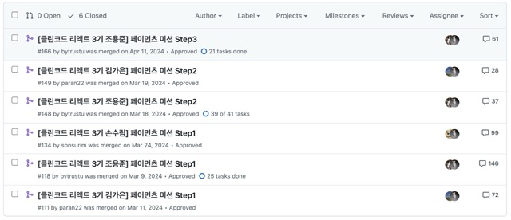

클린코드 리액트 과정은 국내에 현존하는 리액트 강의 중에 제일 실용적인 강의라고 생각한다. 내용 자체가 어렵기도 하고, 무엇보다 과정을 진행하는 현석님께서 실무적인 관점으로 디테일하게 설계해주셨다. 나도 리뷰어이긴 하지만 과정을 수행할 때 마다 학습하는 양이 무척 많은 편이다.

특히 이번에는 2기 때보다 학습해야 하는 내용이 훨씬 많았기 때문에 수강생도 힘들고 리뷰어도 힘들지 않았나 싶다. 그럼에도 불구하고 열정적으로 참여해주신 분들이 많아서 좋았다. ~~리뷰하느라 죽을뻔했다.~~

이번에는 어쩌다보니 1시간정도 클린코드에 대한 나의 생각을 리뷰이뿐만 아니라 수강하는 모든 분들께 직접적으로 전달하는 시간이 있었는데, 경력 개발자를 대상으로 생각을 갈무리해서 전달하는게 쉽지 않았다.

::: tip 💡

클린코드의 목적은 “비용 절감”이다. 요구사항의 변화가 생기고, 이를 코드에 반영할 때 최단시간으로 반영할 수 있도록 할 수 있다면 그게 클린코드이지 않을까?

그래서 내가 작성한 코드가 클린코드인지 확인해보고자 한다면 요구사항에 변화를 일으켜보고 머릿속으로 시뮬레이션을 돌려봐야 한다.

- 요구사항에 변화가 생겼을 때, 이 이름 때문에 헷갈리진 않을까?
- 이 함수가 확장성있게 작성이 되었을까? 변화가 생기면 어떻게 될까?
- 수정하는 동선이 너무 길진 않을까? 너무 많은 파일을 왔다갔다 하는건 아닐까? 한 파일에서의 동선이 너무 길진 않을까?

이런 고민을 토대로 내가 작성한 코드에 대해 판단해볼 수 있다.

:::

이런 이야기를 전달할 때 나의 한계를 느꼈다. 나에겐 다른 사람을 설득하기 위한 논리와 이론이 부족하다. ~~책을 좀 봐야겠다.~~

설명하고자 하는 것을 한 단어, 한 문장, 혹은 다른 개념으로 묶어서 표현하는게 어렵다. 유식하지 못한 내 모습… 참 별로다.

생각해보니 내가 생각하는 내용을 인공지능을 통해 정제할 수 있지 않을까? 다음에 시도해봐야겠다.

#### 1) Javascript CleanCode 6기

[TDD, 클린 코드 with JavaScript](https://edu.nextstep.camp/c/BRaNdTQx/)

[https://github.com/next-step/js-racingcar/pulls?q=is%3Apr+assignee%3AJunilHwang+6%EA%B8%B0+](https://github.com/next-step/js-racingcar/pulls?q=is%3Apr+assignee%3AJunilHwang+6%EA%B8%B0+)

[https://github.com/next-step/js-lotto/pulls?q=is%3Apr+assignee%3AJunilHwang+6%EA%B8%B0+](https://github.com/next-step/js-lotto/pulls?q=is%3Apr+assignee%3AJunilHwang+6%EA%B8%B0+)

[https://github.com/next-step/js-movie-review/pulls?q=is%3Apr+assignee%3AJunilHwang+6%EA%B8%B0+](https://github.com/next-step/js-movie-review/pulls?q=is%3Apr+assignee%3AJunilHwang+6%EA%B8%B0+)

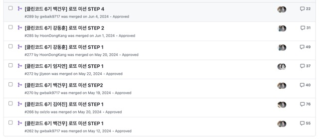

자바스크립트 클린코드 과정도 리뷰어로 참여했다. 자바스크립트 과정은 큰 변화가 없다보니 이제 물 흐르듯 리뷰를 하게 되는 상태가 되었다. ~~큰 부담이 없달까…~~

다만 요즘 드는 생각이 자바 클린코드 과정을 베이스로 설계가 되어서 그런지… 조금 아쉬운 부분이 있다. 클린코드 자체에 대해서는 고민을 많이 해볼 수 있으나 실무에 대한 괴리가 좀 있달까…? 다르게 생각하면 클린코드 자체에 대해 깊이 학습할 수 있어서 좋은 것 같기도 하다.

사실 아쉬움을 느끼는 대부분의 내용을 코드리뷰가 커버한다고 생각한다. 넥스트스텝의 교육과정들은 무엇보다 리뷰가 제일 중요한 그런 느낌.

### (2) 부스트캠프 9기

20년도(5기)부터 지금까지, 커리어의 시작과 함께 5년째 이어오고 있는 부스트캠프 활동이다.

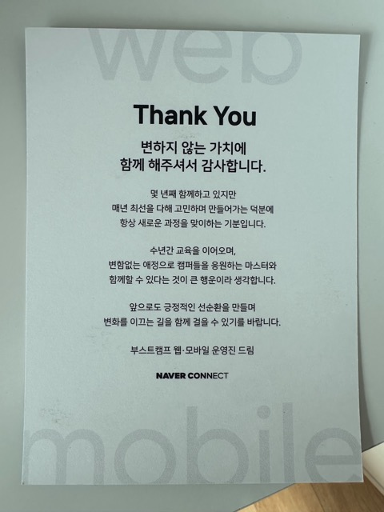

#### 1) 마스터 활동

올해도 어김없이 부스트캠프에 참여했다. 다만 “내가 긍정적인 영향을 잘 주고 있는걸까?”에 대한 의구심이 계속 들었다. 코드 리뷰어로 참여할 때는 코드리뷰를 통해 담당 캠퍼들과 더 깊은 소통을 했고, 멘토링을 할 때에도 마찬가지로 담당 캠퍼들과 친밀감, 유대감, 신뢰 등을 더 많이 쌓을 수 있었다고 생각한다.

마스터로 활동하는 경우 100명이 넘는 캠퍼들이 어떤 일을 하는지 세세하게 알기가 어렵고, 자연스럽게 그 중에 돋보이는 분들에게 눈이 가게 되고 그게 참 아쉬웠다. 사실 내가 시간을 더 쓰거나 혹은 어떤식으로든 신경을 더 쓰면 세세한 소통이 가능하겠지만… 몸이 안 따라준다. (핑계대마왕)

14주동안 매주 금요일마다 2시간씩 실시간 강의를 하는데, 이 시간을 어떻게 활용해야 좋을지 항상 고민이다. 100명이 넘는 사람들에게 어떻게 해야 효과적으로 그들이 원하는 지식을 전달할 수 있을까? 코드에 대한 피드백을 진행한다고 했을 때, 최대한 많은 사람의 코드를 보는게 좋을지 아니면 한 명의 코드를 깊이있게 보는게 좋을지 매일 고민을 해도 뚜렷한 정답이 없는 것 같다.

30분 ~ 1시간은 QnA 위주로 진행했는데, 오히려 정답을 알려주지 않는 부캠에서 이런 QnA 시간이 오히려 캠퍼들에게 더 도움이 될 것 같기도 하고… 거저먹는다는 생각이 들기도 하고… 어렵다.

그리고 이번 기수에는 호눅스님과 거의 모든 클래스를 같이 진행했는데 호눅스님의 이야기가 너무 재밌었다. 경험의 깊이가 남다른게 느껴졌고 자연스럽게 나는 언제 저런 경지에 도달할 수 있을지 생각해보면… 까마득하다.

코드리뷰 피드백 시간에 일관성있게 전달하려고 신경쓴 부분은 넥스트스텝 섹션에서도 이야기한 “요구사항의 변화에 이에 따른 코드의 변화” 였다. 읽기 좋은 코드와 사용하기 좋은 코드의 목적은 “유지보수”라고 생각한다. 그렇기 때문에 유지보수가 발생하는 상황을 상상하면서 코드를 작성하다보면 읽기 좋음에 대한 고민은 물론 확장성에 대한 고민까지 하게 된다. 부스트캠프 뿐만 아니라 내가 접하는 모든 사람들에게 동일한 내용을 전달하는 중이다.

그리고 부스트캠프에서 일관성있게 전달하는 내용 중 하나는 “학습”과 “성장”이다. 일단 운영하는 입장에서는 학습 효과를 극대화하기 위한 장치에 대해 고민을 계속하게 된다. 그래서 무수히 많은(?) 피드백 시스템을 만들고 기록하고 측정하면서 캠퍼들이 얼마나 성장하고 있는지, 성장의 병목이 되는 것들은 어떤게 있는지 파악해서 해소하거나 개선하려고 한다. 다만 이게 캠퍼 입장에서는 숨막히지 않을까 싶은 생각을 종종 한다. 그래서 마스터 클래스시간에 주기적으로 이런 이야기를 한다.

::: tip 👨🏻‍🏫

결국 여러분들에게 제일 중요한건 학습과 성장입니다! 모든건 이를 위해 마련되었고, 스스로 생각하기에 학습과 성장에 도움이 되는 일이라면 과감하게 시도해도 좋다고 생각해요

:::

시스템에 자연스럽게 적응하면 물론 좋지만, 그렇지 않는다고 하더라도 누구도 뭐라하지 않는다. 부스트캠프는 경쟁시스템이 아닌 협력과 성장 시스템이기 때문이다. 나에 대해 고민을 해보자면, 난 촘촘한 시스템의 적합한 사람은 아닌 것 같다. 말로는 “목표가 제일 중요해요!” 라고 캠퍼들에게 이야기 하지만, 속으로는 “사실 재미가 제일 중요해요!” 라고 생각한다. 목표가 명확하고 명료하고 구체적이고 계획적인 상태가 되어야 성장하고 나아가는 사람이 있는 반면, 그런 목표나 구체적인 계획이 없어도 잘 성장하는 사람이 있다. 

나는 구체화된 과정이 있을 때 오히려 성장이 더딘 사람이다. 내가 하고 싶어하는 것, 호기심이 있는 것과 다른 방향으로 계획 및 설계가 되어 있을 때 스트레스가 커진다. 그렇다고 그걸 안 할 수도 없고, 하자니 싫고, 그래서 진행이 더디거나 행동으로 옮겨지지 않는.. 그런 사람이다. 약간의 자유도가 있을 때, 그리고 기준치가 낮을 때 오히려 딥다이브 할 수 있달까… 그래서 나의 학습과정에 대해 돌이켜보면 학습 자체는 혼자 했던적이 많았다. 다만 피드백 루프를 체험하거나 커뮤니케이션을 잘 하기 위해 사람들과 접하는 방식으로 나아갔었다.

**결론은 나의 성향을 잘 파악하는게 중요하다는 것.**

::: tip 🫠

글을 작성하다보니 나도 캠퍼가 되고 싶다. 요즘 공부하고 싶은 혹은 실험하고 싶은게 너무 많은데, 내가 온전히 학습에 몰입할 수 있는 시간이 없는게 너무 속쓰리다.

:::

글이 두서없이 길어지고 있다. 여튼 지속적으로 전달했던 이야기는 다음과 같다.

- 문제를 두 번 풀이하자. 일단 막 풀어보고, 그 다음에 정교하게 다시 풀어보면 좋다. 그럼에도 부족하다고 느껴지면 한 번 더 풀어보자.
- 일단 행동하자. 계획도 목표도 행동을 위해 존재한다고 생각한다. 때로는 정교한 고민과 목표와 계획이 필요할 수 있지만, 대부분은 일단 행동하는게 제일 중요하다. 죽이되든 밥이되든 일단 하자.
- 무언가를 잘 하기 위해선 일단 많이 해야 한다. 좋은 코드를 작성하고 싶다면, 코드를 작성하면서 계속 고민해야 된다. 거저 얻어지는 것은 거의 없다. 일단 움직이고, 일단 시간을 써야 한다.
- 커뮤니케이션을 잘 하기 위한 몇 가지 방법이 있다. 지금 생각나는 것만 몇 가지 적어보자면…
    1. 상대방에 대해 이야기를 하는게 아니라 나에 대해 이야기를 해야한다. 상대방의 행동이나 생각 자체를 비판하거나 다르게 생각하면 부정적인 감정을 느낄 수 밖에 없다. 상대방의 행동에 대한 나의 감정과 나의 생각을 이야기하면 된다.
        
        예시) “왜 말을 그렇게 하는건가요?” → “어떤 말인지 알겠습니다. 다만 그렇게 말씀하셨을 때 저의 감정이 안 좋아져요.”
        
        즉, 내 이야기의 주체는 내가 되어야 한다. 나의 생각을 잘 전달하면서도 서로의 기분이 상하지 않도록 하는 방법이다.
        
    2. 상대방을 설득하기 위해선 상대방의 언어로 이야기 해야한다. 혹은 상대방이 나의 언어로 번역해서 이야기할 수 있도록 가이드를 해야한다. 가령, 개발자가 디자이너에게 개발용어로 이야기 하면 알아듣기 어려울 수 있다. 혹은 똑같은 단어를 사용했을 때 그 단어의 의미를 서로 다르게 생각할 수도 있다. 그렇게 서로 맞춰가는 과정이 필요하다.
    3. “나를 사용하는 방법”을 상대방에게 전달해야 한다. 어떻게 하면 나에게 동기부여가 되는지, 행동으로 이어지는지, 한 번 더 생각하게 되는지, 장점은 무엇인지, 단점은 무엇인지 등 나에 대한 문서를 만들어서 공유해야 한다.
    4. 조직에서 성장을 하기 위해선 생존이 보장되어야 한다. 생존이 보장된다는 이야기는 안정감을 기반으로 한다. “내가 어떤 일을 해도, 어떤 이야기를 해도 안전해” 라고 느낄 수 있어야 한다. 이를 위해선 서로가 가진 취약점(약점과 취약점은 다르다)을 터놓고 이야기할 수 있어야 하고, 취약점을 드러냈을 때 서로 보완해줄 수 있어야 한다. 나는 다른 사람의 취약점을 채워줄 수 있는 사람인가?
    5. 신뢰를 얻기 위한 두 가지 방법이 있다. (by 김창준님)
        - 도움이 필요한 사람에게 도움을 주는 것
        - 나의 어려운 문제를 해결하기 위해 도움을 요청하는 것
        
        대부분 “도움을 주는 행위”를 통해 신뢰를 쌓을 수 있다고 생각하지만, “도움을 요청하는 행위”를 통해 더 빠르게 신뢰를 쌓아갈 수 있다. 이는 앞에서 이야기한 “취약점”과 관련있다. 도움을 요청한다는 것은 취약점을 드러낸다는 것이고, 이상적인 조직은 취약점이 드러났을 때 구성원이 이를 채워준다. 그래서 4번과 5번은 상호보완이 되는 관계라고 할 수 있다.
        

항상 이런 학습과정을 시작할 때 “하드스킬은 혼자서도 충분히 키울 수 있습니다. 하지만 소프트스킬은 다른 사람과 함께 키워나가야 합니다. 학습스킬과 소프트스킬을 골고루 학습했으면 좋겠습니다” 같은 이야기를 한다. 하드스킬은 기술을 통해 문제를 해결하는 것이고, 소프트스킬은 기술 외적인 요인을 토대로 문제를 해결하는 것이라고 생각한다. 그래서 “문제 해결”에 초점을 맞추다보면 자연스럽게 해소되는 일이 아닐까 싶은 생각이 든다.

#### 2) 글쓰기 멘토링

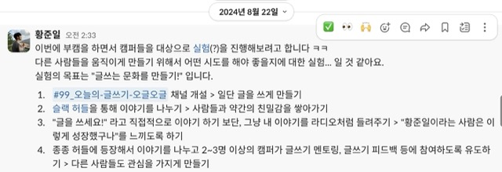

이번 기수에는 매주 글쓰기 멘토링을 진행했다. 사실 멘토링은 핑계에 가깝고, 캠퍼들과 친밀감을 형성할 수 있는 창구가 필요했다. 어차피 글쓰기 자체는 너무 잘 하고 있다. 운영진의 권유로 시작하긴 했으나, 결국 글쓰기는 스킬도 중요하지만 글을 쓰는 행위 그 자체가 제일 중요하다고 생각한다. 왜냐면 우리 대부분은 작가가 아니고  글을 통해 밥벌이를 하는 사람도 아니기 때문이고, 글을 쓰는 목적이 “나를 표현하는 수단”이라고 생각하기 때문이다. 내가 가진 생각과 경험을 잘 전달하는 수단이랄까? 그래서 글을 잘쓰게 하기 위해선 글을 쓰고 싶다고 느끼게 만들어야 한다. 어떻게 그런 느낌을 줄 수 있을까 고민을 해봤더니, 글을 쓰고 보여주면 되는 것 같다.

이렇게 생각하게 된 이유는, “준일님의 글을 봤더니 저도 그런 글을 쓰고 싶다고 생각했어요. 어떻게 하면 그렇게 쓸 수 있나요?” 같은 질문을 종종 받았던게 크다. 자녀가 공부를 하도록 만들고 싶다면 부모가 공부하는 모습을 보여주라고 하는 말을 들어본적이 있을 것이다. 이와 비슷한 맥락이라고 생각한다. 누군가 옆에서 무언가를 하는 모습을 보여줬을 때 그 모습이 그 사람에게 인상적이라면 어떤식으로든 시작을 하게 된다고 생각한다. 반대로, 행동이나 결과물을 보고 아무런 인사이트가 없다면 사실 시켜도 안 할 확률이 높다.

그래서 하고 싶은 이야기는, 결국 글 자체를 최대한 많은 사람에게 노출시켜야 한다. 공유를 최대한 많이 해야한다. 그렇게 해야 행동으로 이어지고 문화로 자리잡을 수 있는게 아닐까?

엄청나게 많은 사람들에게 인사이트를 주었다고 말하긴 어렵지만 그럼에도 불구하고 내 이야기를 잘 듣고 행동으로 보여주시는 분들이 있었다.

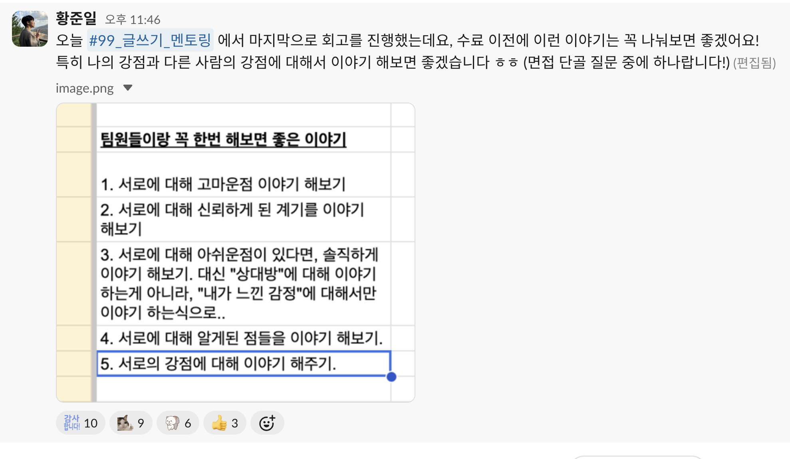

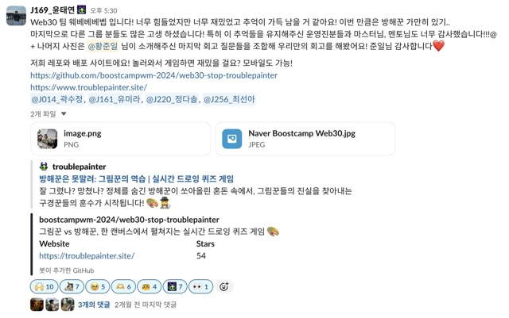

이런 분들이 있기 때문에 계속 교육과 관련된 활동을 이어갈 수 있는게 아닐까?

#### 3) 프로젝트 소개

이번에도 재미있고 좋은 퀄리티의 프로젝트가 엄~~~~~~청 많았다. 6주동안 이런 결과물을 만들어냈다고…? ~~미친것같다.~~

무려 38개의 웹 프로젝트가 진행되었고, 재밌는 결과물이 무척 많았다.

| Web01 | [https://github.com/boostcampwm-2024/web01-youQuiz](https://github.com/boostcampwm-2024/web01-youQuiz) | [https://www.you-quiz.site](http://www.you-quiz.site/) |
| --- | --- | --- |
| Web02 | [https://github.com/boostcampwm-2024/web02-BooBit](https://github.com/boostcampwm-2024/web02-BooBit) | [http://boobit.xyz](http://boobit.xyz/) |
| Web03 | [https://github.com/boostcampwm-2024/web03-CorinEE](https://github.com/boostcampwm-2024/web03-CorinEE) | [https://www.corinee.site/](https://www.corinee.site/) |
| Web04 | [https://github.com/boostcampwm-2024/web04-RealTicket](https://github.com/boostcampwm-2024/web04-RealTicket) | [http://www.realticket.store/](http://www.realticket.store/) |
| Web05 | [https://github.com/boostcampwm-2024/web05-Denamu](https://github.com/boostcampwm-2024/web05-Denamu) | [https://denamu.site/](https://denamu.site/) |
| Web06 | [https://github.com/boostcampwm-2024/web06-harmony](https://github.com/boostcampwm-2024/web06-harmony) | [https://boost-harmony.kro.kr](https://boost-harmony.kro.kr/) |
| Web07 | [https://github.com/boostcampwm-2024/web07-Ask-It](https://github.com/boostcampwm-2024/web07-Ask-It) | [https://ask-it.site/](https://ask-it.site/) |
| Web08 | [https://github.com/boostcampwm-2024/web08-BooQuiz](https://github.com/boostcampwm-2024/web08-BooQuiz) | [https://booquiz.kro.kr/](https://booquiz.kro.kr/) |
| Web09 | [https://github.com/boostcampwm-2024/web09-DailyRoad](https://github.com/boostcampwm-2024/web09-DailyRoad) | [https://preview.dailyroad.site](https://preview.dailyroad.site/) |
| Web10 | [https://github.com/boostcampwm-2024/web10-QuizGround](https://github.com/boostcampwm-2024/web10-QuizGround) | [http://quizground.duckdns.org/](http://quizground.duckdns.org/) |
| Web11 | [https://github.com/boostcampwm-2024/web11-road_to_friendly](https://github.com/boostcampwm-2024/web11-road_to_friendly) | [https://road-to-friendly.kro.kr/](https://road-to-friendly.kro.kr/) |
| Web12 | [https://github.com/boostcampwm-2024/web12-MafiaCamp](https://github.com/boostcampwm-2024/web12-MafiaCamp) | [https://mafiacamp.p-e.kr/](https://mafiacamp.p-e.kr/) |
| Web13 | [https://github.com/boostcampwm-2024/web13-YeokjeonNongbu](https://github.com/boostcampwm-2024/web13-YeokjeonNongbu) | [https://yeokjeonnongbu.shop/](https://yeokjeonnongbu.shop/) |
| Web14 | [https://github.com/boostcampwm-2024/web14-betting-duck](https://github.com/boostcampwm-2024/web14-betting-duck) | [http://175.45.205.245/](http://175.45.205.245/) |
| Web15 | [https://github.com/boostcampwm-2024/web15-OctoDocs](https://github.com/boostcampwm-2024/web15-OctoDocs) | [https://octodocs.site/](https://octodocs.site/) |
| Web16 | [https://github.com/boostcampwm-2024/web16-JuGa](https://github.com/boostcampwm-2024/web16-JuGa) | [https://juga.kro.kr](https://juga.kro.kr/) |
| Web17 | [https://github.com/boostcampwm-2024/web17-juchumjuchum](https://github.com/boostcampwm-2024/web17-juchumjuchum) | [https://juchum.info/](https://juchum.info/) |
| Web18 | [https://github.com/boostcampwm-2024/web18-inear](https://github.com/boostcampwm-2024/web18-inear) | [https://inear.live/](https://inear.live/) |
| Web19 | [https://github.com/boostcampwm-2024/web19-Clovapatra](https://github.com/boostcampwm-2024/web19-Clovapatra) | [https://clovapatra.com/](https://clovapatra.com/) |
| Web20 | [https://github.com/boostcampwm-2024/web20-camon/](https://github.com/boostcampwm-2024/web20-camon/) | [https://cam-on.site/](https://cam-on.site/) |
| Web21 | [https://github.com/boostcampwm-2024/web21-Ticle](https://github.com/boostcampwm-2024/web21-Ticle/pulls) | [https://ticle.live/](https://ticle.live/) |
| Web22 | [https://github.com/boostcampwm-2024/web22-LiBoo](https://github.com/boostcampwm-2024/web22-LiBoo) | [https://liboo.kr](https://liboo.kr/) |
| Web23 | [https://github.com/boostcampwm-2024/web23-Pinoco](https://github.com/boostcampwm-2024/web23-Pinoco) | [https://pinoco.site/](https://pinoco.site/) |
| Web24 | [https://github.com/boostcampwm-2024/web24-GOMZ](https://github.com/boostcampwm-2024/web24-GOMZ) | [https://](https://223.130.137.75.nip.io/)[gomz.kr/](http://gomz.kr/) |
| Web25 | [https://github.com/boostcampwm-2024/web25-funch](https://github.com/boostcampwm-2024/web25-funch) | [https://funch.site](https://funch.site/) |
| Web26 | [https://github.com/boostcampwm-2024/web26-LICO](https://github.com/boostcampwm-2024/web26-LICO) | [https://lico.digital/](https://lico.digital/) |
| Web27 | [https://github.com/boostcampwm-2024/web27-Preview](https://github.com/boostcampwm-2024/web27-Preview) | [https://boostcamp-preview.kro.kr/](https://boostcamp-preview.kro.kr/) |
| Web28 | [https://github.com/boostcampwm-2024/web28-DDara](https://github.com/boostcampwm-2024/web28-DDara) | [https://ddara.kro.kr/](https://ddara.kro.kr/) |
| Web29 | [https://github.com/boostcampwm-2024/web29-honeyflow](https://github.com/boostcampwm-2024/web29-honeyflow) | [http://www.honeyflow.life/](http://www.honeyflow.life/) |
| Web30 | [https://github.com/boostcampwm-2024/web30-stop-troublepainter](https://github.com/boostcampwm-2024/web30-stop-troublepainter) | [troublepainter.site](http://troublepainter.site/) |
| Web31 | [https://github.com/boostcampwm-2024/web31-BooLock](https://github.com/boostcampwm-2024/web31-BooLock) | [https://boolock.site/](http://www.boolock.site/) |
| Web32 | [https://github.com/boostcampwm-2024/web32-BooMap](https://github.com/boostcampwm-2024/web32-BooMap) | [https://boomap.site/](https://boomap.site/) |
| Web33 | [https://github.com/boostcampwm-2024/web33-Nocta](https://github.com/boostcampwm-2024/web33-Nocta?tab=readme-ov-file) | [https://nocta.site/](https://nocta.site/) |
| Web34 | [https://github.com/boostcampwm-2024/web34-LearnDocker](https://github.com/boostcampwm-2024/web34-LearnDocker) | [https://learndocker.site](https://learndocker.site/) |
| Web35 | [https://github.com/boostcampwm-2024/web35-WatchDucks](https://github.com/boostcampwm-2024/web35-WatchDucks) | [https://watchducks.site](https://watchducks.site/) |
| Web36 | [https://github.com/boostcampwm-2024/web36-QLab](https://github.com/boostcampwm-2024/web36-QLab) | [http://www.q-lab.site](http://www.q-lab.site/) |
| Web37 | [https://github.com/boostcampwm-2024/web37-cloud-canvas](https://github.com/boostcampwm-2024/web37-cloud-canvas) | [https://cloudcanvas.kro.kr/](https://cloudcanvas.kro.kr/) |
| Web38 | [https://github.com/boostcampwm-2024/web38-Froxy](https://github.com/boostcampwm-2024/web38-Froxy) | [https://www.frog-froxy.site/](https://www.frog-froxy.site/) |

주로 이런 주제에 대해 다뤘다.

- 문서 동시편집
- 영상 스트리밍
- 화상채팅
- 클라우드 기반의 서비스
- 주식/코인 서비스

개인적으로 [Web37 방해꾼은 못말려 팀](https://github.com/boostcampwm-2024/web30-stop-troublepainter/)이 제일 인상깊었다.

결과물은 물론이고 팀워크도 좋고, [문서 산출](https://github.com/boostcampwm-2024/web30-stop-troublepainter/wiki)도 테스트 코드도 발표도 전체적으로 완벽에 가까웠다고 생각했다.

팀워크를 기반으로 쌓아간게 아닐까? 1주차에 세운 목표 중 “같이 친해져서 글램핑 가기^^” 가 있었는데, 그만큼 신뢰와 팀워크를 중요하게 생각했음을 느꼈다.

산출된 문서도 재밌고 무척 많은편이다.

그 다음은 [Web19 클로바 파트라](https://github.com/boostcampwm-2024/web19-Clovapatra) 팀을 인상깊게 봤었다.

결과물도 훌륭하고, 무엇보다 캠퍼들의 인프라와 백엔드에 대한 지식이 돋보였다. 경력이 적어도 3년차는 되는 것 같은 역량이 느껴졌다.

이 외에도 [Web37 클라우드 캔버스](https://github.com/boostcampwm-2024/web37-cloud-canvas) 팀의 프론트엔드 담당 캠퍼는 혼자서 2D/3D 기반의 편집 UI를 만들었다.
수학적 지식이 없는 상태에서 이를 시도하느라 무척 고생을 많이 한걸로 알고 있다. 그럼에도 불구하고 결과물이 매우 훌륭하다. 지금은 도메인이 내려가서 실물로 볼 수 없는게 조금 아쉽다.

학습을 위한 화상채팅 플랫폼 제작한 [Web21 TICLE](https://github.com/boostcampwm-2024/web21-TICLE) 팀과 [Web20 Camon](https://github.com/boostcampwm-2024/web20-camon/) 팀도 있다. 인데, 마찬가지로 너무 잘 만들어서 깜짝 놀랐다. 초기 구축 이후에 별도의 화상채팅 플랫폼을 사용하지 않고 직접 만든 서비스에서 진행한걸로 알고 있다.

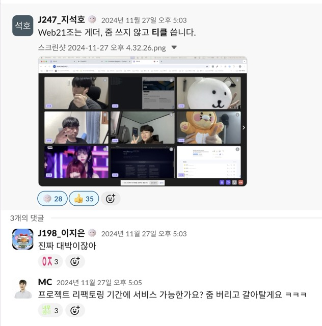

다같이 모여서 프로젝트 피드백을 할 때 이런 플랫폼에 들어가서 이야기 하면 재미가 배로 되는 경험을 할 수 있다.

여기서 다루지 않은 프로젝트가 부족하다거나 인상깊지 않은건 절대 아니다. 모든 사람들이 깊이 몰입하여 결과물을 만들어냈다.

::: tip 💌 To. 부스트캠프 캠퍼분들께

수료식을 할 때도 이야기 했지만, 부스트캠프는 여러분들의 개발 코어를 키워주는 과정이었다고 생각합니다. 이게 끝이 아니라 이제부터 시작인거죠! 앞으로 어떤 어렵고 힘든일이 있어도 이 경험이 있기 때문에 잘 풀어나갈 수 있으리라 생각해요. 저에게 이 과정을 수행해보라고 한다면 절대 끝까지 못했을 것 같은데(챌린지에서 탈락 각입니다), 여러분은 이걸 끝까지 해냈잖아요!? 그 자체가 무척 대단하고 존경스럽답니다 ㅎㅎ

부족하고 모자란 사람이었음에도 불구하고 믿고 잘 따라주셔서 감사해요 여러분. 도움이 필요하면 언제든 편하게 연락주세요!

:::

#### 4) 끝으로

언제까지 부스트캠프 활동을 이어갈 수 있을지 모르겠다. 스스로 부족한 부분이 무척 많이 느껴지고, 투자할 수 있는 시간이 점점 줄어들고 있다. 무엇보다 매년 캠퍼들의 수준이 점점 높아지는게 느껴진다. 이는 취업시장 자체에 문제라고 할 수 있지 않을까? 현업에 있어야할 사람들이 자리가 없어서 교육기관으로 흘러들어온 그런 느낌을 받았다. 이미 너무 뛰어나고 이미 너무 잘 하는데, “난 너무 부족한 것 같아” 라고 생각할 수 밖에 없도록 만드는 이 현실이 참 가혹하다. 사실 나도 별반 다르지 않은 것 같지만…?

어쨌든 얼만큼의 기회와 시간이 있을지 모르겠으나 다음이 있다면 그리고 또 다음이 있다면 더 열심히 해보고 싶다. 더 이 활동에 몰입하고 싶다.

### (3) 항해플러스

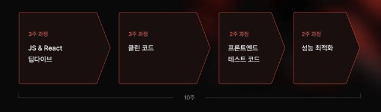

항해플러스는 경력 개발자를 대상으로 진행하는 10주 교육과정이다. 매주 다양한 학습 콘텐츠와 과제 그리고 멘토링이 제공되고 커뮤니티를 기반으로 성장하는 교육 플랫폼이라고 할 수 있다.

어쩌다보니 나도 항해플러스에 합류하게 되었고, 어쩌다보니 교육 커리큘럼도 만들게 되었다~~(덕분에 죽다 살아났고)~~. 덕분에 AI 활용 능력과 교육/개발자의 역량을 두루두루 갖출 수 있게 되었다.

사실 할 말은 여기에 제일 많이 있다. ~~회고를 끝낼 수 있을까?~~

#### 1) 합류하게 된 계기

원래는 전혀, 아니 그냥 별 생각이 없었다. 그런데 어느날 링크드인으로 매니저님께서 이런 메세지를 보내주셨다.

::: tip 💬

저희가 설계하고 있는 교육과정에 대해 소개드리고, 현업 경험과 노하우를 바탕으로 준일님의 생각을 나눠주실 수 있을까요?

:::

커리큘럼에 대한 피드백과 진행 방향성에 대한 이야기를 나눴었다.

일단 1기 커리큘럼은 이런 주제를 기반으로 다루고 있었다.

> **<Part 1: 기본기 다지기>**
> 
> - 기본기 다지기
> - 리액트 만들기
> - NextJS + Server Component
> 
> **<Part 2: 오픈소스 프로젝트>**
> 
> - 디자인 패턴
> - TDD
> - CI/CD
> - 성능최적화

사실 별 얘기는 하지 않았고, “이렇게 하면 망해요” 를 어필했었다.

기본기 다지기와 리액트 만들기는 나름 필요한 과정이라고 생각했다. 나 스스로도 이와 관련한 주제로 글을 쓰기도 했고, 학습 과정만 잘 설계되면 분명 좋은 주제라고 생각했다.

그런데 이후의 과정은 문제 투성이라고 생각했다.

먼저 NextJS와 Server Component를 정확하게 이해하기 위해선  Server에 대한 지식과 SSR(Server Side Rendering)에 대한 지식이 고루 갖추는게 선행되어야 하는데 그 과정이 배제되었다.

::: tip 👨🏻‍🏫 SSR과 RSC(React Server Component)를 다룬 1기 수료생 최기환님의 글

[SSR과 RSC는 다르다](https://velog.io/@koreanthuglife/SSR%EA%B3%BC-RSC%EB%8A%94-%EC%A0%84%ED%98%80-%EB%8B%A4%EB%A5%B4%EB%8B%A4)

:::

그 다음에 “오픈소스 프로젝트”는 제일 최악의 커리큘럼이라고 생각한다. 시간이 많은 취준생을 대상으로 하는 교육도 아니고, 경력개발자를 대상으로 그것도 오픈소스 프로젝트를 진행한다는게… 학습이 아닌 다른 방향으로 시간을 쓸게 불보듯 뻔한 일이었다.

그리고 그 과정에서 다루는 주제 또한… 현실적으로 오픈소스와 동떨어졌다고 생각했다. 물론 어떻게든 끼워맞출수 있지만 각 팀이 서로 다른 주제로 서로 다른 플랫폼에 코드를 배포하고, 런타임에 따라 실행되는 코드의 형태도 무척 다를텐데, 심지어 과제도 있다.

어쨌든, 매니저님께 이런 생각들을 전달했었는데, 결론적으론 1기에 반영되지 않았다.

대신 피드백을 요청하는 미팅에서 “합류해서 기여해주세요!” 라는 제안을 해주셨고, 어버버 하다가 합류하게 되었다. ~~결론은 합류..~~

#### 2) 1기

1기 과정을 진행하면서 무수히 많은 불만을 토로 했었고, 앞에서 작성한 내용과 비슷한 맥락의 이야기를 많이 했다. ~~그 당시의 나는 지랄견 그 자체였다고 생각한다.~~ 매주 3~4시간씩 멘토링을 할 때에도 커리큘럼과 관련된 내용보단 현업에서 겪는 문제에 대해 같이 이야기 하는 시간이 많았고 커리큘럼을 통한 학습 효과 자체에 대해선 갸우뚱 했다. 물론 그 와중에도 열심히 하는 사람이 있었는데, 커리큘럼 덕분이 아니라 원래 어디서든 열심히 하는 분들이라고 생각한다.

어쨌든 나에겐 신선하고 어려운 도전이었다. 1주일에 1회씩 멘토링을 진행했던 경험은 있었으나, 무려 3~4회를 진행한 경험은 처음이었다. ~~사라진 저녁의 삶~~

사실 거창한 이야기를 했다기보단, 수강생의 고민을 들어주고 이야기를 나눈게 대부분이었다고 생각한다. 팀에 시니어 개발자나 사수 없이 일하는 사람이 많았고 답답함을 어딘가에 토로하고 싶었을 것 같다. 그래서 이야기를 하도록 만들어주고, 이를 해소할 수 있도록 해준게 어찌보면 제일 큰 효과이지 않았을까? ~~사실 말은 내가 제일 많이 한 것 같기도..~~

그리고 코치의 역할 중 하나가 발제였고, 나는 **리액트 파헤치기** 챕터를 맡아서 진행했다. 1기 시스템에서 의문인 부분 중 하나가 커리큘럼을 제작한 사람이 따로 있고, 제작한 내용에 대해 발제를 맡아서 진행하는 사람이 따로 있다는 것이다. 덕분에 커리큘럼의 의도를 파악하고 전달하는게 무척 어려웠고 그래서 내 방식대로 수정하거나 정제해서 전달하고자 신경썼다.

제일 고민을 많이 했던 부분은 기존에 커리큘럼 제작자분이 만들어주신 구성해주신 과제가 React의 Reconciliation, Fiber, Hook 등을 구현하도록 구성된 점이었다. 사실 만드는 것 자체는 적극 동의했으나… 문제는 1주일만에 만들어야 한다는 것이다. 리액트에 대해 모르는 사람도 있었고 무엇보다 촉박한 시간 때문에 이건 아무리 생각해도 무리라는 판단이 들었다.

::: tip 👨🏻‍🏫

과제를 제작하신 분께 굉장히 죄송스러운 마음입니다. 사실 쉬운 난이도의 과제가 아니었고 솔루션도 밤을 지새우며 만드신게 느껴졌어요. 그래서 현재는 과제 너머(?)의 과제로 제공이 되고 있습니다.

:::

어쨌든 이 상황을 해결해야 했고, 어떻게 해야 난이도를 최대한 낮추면서 학습 효과를 극대화할 수 있을까 고민하다가 테스트 코드를 기반으로 과제를 진행할 수 있도록 하면 어떨까? 라는 생각을 했다.

**💾 가상돔 기반의 렌더링 시스템 만들기 테스트코드**

```jsx
describe('render > ', () => {
  describe('첫 번째 렌더링 테스트', () => {
    test('한 개의 태그를 렌더링할 수 있다.', () => {
      const App = jsx(
        'div',
        null,
        'div의 children 입니다.'
      );

      const $root = document.createElement('div');
      render($root, App);

      expect($root.innerHTML).toBe(`<div>div의 children 입니다.</div>`);
    })

    test('props를 추가할 수 있다.', () => {
      const App = jsx(
        'div',
        { id: 'test-id', class: 'test-class' },
        'div의 children 입니다.'
      );

      const $root = document.createElement('div');
      render($root, App);

      expect($root.innerHTML).toBe(`<div id="test-id" class="test-class">div의 children 입니다.</div>`);
    })

    test('자식 노드를 표현할 수 있다.', () => {
      const App = jsx(
        'div',
        { id: 'test-id', class: 'test-class' },
        jsx('p', null, '첫 번째 문단'),
        jsx('p', null, '두 번째 문단'),
      );

      const $root = document.createElement('div');
      render($root, App);

      expect($root.innerHTML).toBe(`<div id="test-id" class="test-class"><p>첫 번째 문단</p><p>두 번째 문단</p></div>`);
    })
  })

  describe('리렌더링 테스트 - 변경된 내용만 반영되도록 한다.', () => {
    test('하위 노드 추가', () => {
      const $root = document.createElement('div');

      const App = jsx(
        'div',
        { id: 'test-id', class: 'test-class' },
        jsx('p', null, '첫 번째 문단'),
        jsx('p', null, '두 번째 문단'),
      );

      render($root, App);

      expect($root.innerHTML).toBe(`<div id="test-id" class="test-class"><p>첫 번째 문단</p><p>두 번째 문단</p></div>`);

      const children = [...$root.querySelectorAll('p')];

      render($root, jsx(
        'div',
        { id: 'test-id', class: 'test-class' },
        jsx('p', null, '첫 번째 문단'),
        jsx('p', null, '두 번째 문단'),
        jsx('p', null, '세 번째 문단'),
      ), App);

      expect($root.innerHTML).toBe(`<div id="test-id" class="test-class"><p>첫 번째 문단</p><p>두 번째 문단</p><p>세 번째 문단</p></div>`);

      const newChildren = [...$root.querySelectorAll('p')];

      expect(children[0]).toBe(newChildren[0]);
      expect(children[1]).toBe(newChildren[1]);
      expect(children[2]).not.toBe(newChildren[2]);
    })

    test('props 수정', () => {
      const $root = document.createElement('div');
      const App = jsx(
        'div',
        { id: 'test-id', class: 'test-class' },
        jsx('p', null, '첫 번째 문단'),
        jsx('p', null, '두 번째 문단'),
      )

      render($root, App);

      expect($root.innerHTML).toBe(`<div id="test-id" class="test-class"><p>첫 번째 문단</p><p>두 번째 문단</p></div>`);

      const children = [...$root.querySelectorAll('p')];

      render($root, jsx(
        'div',
        null,
        jsx('p', null, '첫 번째 문단'),
        jsx('p', null, '두 번째 문단'),
      ), App);

      expect($root.innerHTML).toBe(`<div><p>첫 번째 문단</p><p>두 번째 문단</p></div>`);

      const newChildren = [...$root.querySelectorAll('p')];

      expect(children[0]).toBe(newChildren[0]);
      expect(children[1]).toBe(newChildren[1]);
    })
  })
})
```

- VirtualNode를 만든다.
- VirtualNode를 RealNode로 변환하는 함수를 만든다.
- VirtualNode와 VirtualNode를 비교해서 RealNode에 반영하는 함수를 만든다.

**💾 useState, useMemo 만들기 테스트 코드**

```tsx
describe("hooks test", () => {
  describe("useState", () => {
    test("useState로 state를 만들 수 있다.", () => {
      function render() {
        const [a] = useState("foo");
        const [b] = useState("bar");

        return `a: ${a}, b: ${b}`;
      }

      const { useState } = createHooks(render);

      expect(render()).toBe(`a: foo, b: bar`);
    });

    test("setState를 실행할 경우, callback이 다시 실행된다.", () => {
      const render = vi.fn(() => {
        const [, setA] = useState("foo");
        return { setA };
      });

      const { useState } = createHooks(render);

      const { setA } = render();
      expect(render).toBeCalledTimes(1);

      setA("test");
      expect(render).toBeCalledTimes(2);
    });

    test("state의 값이 이전과 동일할 경우, 다시 실행되지 않는다.", () => {
      const render = vi.fn(() => {
        const [, setA] = useState("foo");
        return { setA };
      });

      const { useState } = createHooks(render);

      const { setA } = render();
      expect(render).toBeCalledTimes(1);

      setA("test");
      expect(render).toBeCalledTimes(2);

      setA("test");
      expect(render).toBeCalledTimes(2);
    });

    test("hook의 callback이 실행 되기 이전에 resetContext를 실행해야 값이 정상적으로 반영된다.", () => {

      let result = "";
      const render = vi.fn(() => {
        const [a, setA] = useState("foo");
        const [b, setB] = useState("bar");

        result = `a: ${a}, b: ${b}`;

        return { setA, setB };
      });

      const { useState, resetContext } = createHooks(render);

      const { setA, setB } = render();

      expect(result).toBe(`a: foo, b: bar`);

      resetContext();
      setA("foo-change");
      expect(result).toBe(`a: foo-change, b: bar`);

      resetContext();
      setB("bar-change");
      expect(result).toBe(`a: foo-change, b: bar-change`);

      expect(render).toBeCalledTimes(3);
    });
  });

  describe("useMemo", () => {

    test("useMemo로 만들어진 값은 캐싱된다.", () => {
      function getMemo() {
        resetContext();
        return useMemo(() => [], []);
      }

      const { useMemo, resetContext } = createHooks(getMemo);

      const memo1 = getMemo();
      const memo2 = getMemo();

      expect(memo1).toBe(memo2);
    });

    test("useMemo의 값을 변경하고 싶으면, 의존하는 값을 수정해야 한다.", () => {
      function getMemo() {
        resetContext();
        return useMemo(() => [], [param]);
      }

      const { useMemo, resetContext } = createHooks(getMemo);
      let param = 1;

      const memo1 = getMemo();
      param = 2;

      const memo2 = getMemo();
      const memo3 = getMemo();
      expect(memo1).not.toBe(memo2);
      expect(memo2).toBe(memo3);
      param = 3;
      const memo4 = getMemo();
      expect(memo3).not.toBe(memo4);
    });
  });
});
```

- 클로저를 이용해서 useState를 만들어본다.


하룻밤 사이에 머리를 쥐어짜서 만들었기 때문에 퀄리티가 굉장히 안 좋았다.

어쨌든 “이런식으로 리액트의 일부가 구성되었구나”를 느끼게 하고 싶었다. 하지만 “이걸 대체 왜 해야 하는거죠?”를 납득시켰어야 했는데 제대로 전달하지 못했던 것 같다. 덕분에 수강생의 혼란이 더욱 가중 되었고… 중도 이탈 하는 분들도 많았다.

특히 취준생이 아닌 현업 개발자를 대상으로 전달하는 지식이었기 때문에 더 안 좋은 효과가 있었다고 생각한다. 지금 당장 현업에 써먹을 수 있는 지식이 아니고, 이런 지식을 이해한다고 해서 드라마틱한 변화가 생기지도 않는다. 그게 참 어렵게 느껴졌다.

그래서 “아예 리액트를 잘 사용하는 방향으로 커리큘럼이 구성되어야 하지 않을까?” 라고 생각했다. 

그리고 이 당시의 내가 운영진에게 의견을 전달하는 방식이 꽤 잘못 되었음을 인지했던 것 같다. ~~나 스스로 부드러운 사람이라고 생각했는데 미친놈이었다.~~ 그리고 무언가 납득할 수 없는 일을 하는 것에 대한 반발심이 무척 심한 사람이구나 느꼈다. 그리고 그런 일이 있으면 어떻게든 해결하거나 없애버리거나… 랄까?

그리고 이런 나의 모습을 보고 우리 팀(nBilly)에 대한 생각으로 이어졌다.

::: tip 💡

내가 우리 팀이 일하는 방식에 납득을 못하는건 아닌데, 그렇다고 완전히 납득하는 상황도 아니구나. 그럼 나에게 문제가 있거나 팀에게 문제가 있거나 혹은 양쪽 모두에게 있을 것이고, 이게 무엇인지 찾아내야겠다.

나는 열정이 없는 사람이 아니고, 현 상황에 그저 그냥 만족하는 사람도 아닌데, 무언가 가로막힌 기분이 들었다. 내가 가진 역량을 다 발휘하기가 뭔진 모르겠지만 그게 참 어렵다고 느꼈었다.

:::

오픈소스 프로젝트 챕터로 진입했을 때 다시 많은 수강생이 이탈했고, 학습한 내용과 과제와 프로젝트를 접목하는게 시간이 흐를수록 어려워져서 나중에는 과제를 제출하는 사람이 손에 꼽았다.

그래서 다시 한 번 강하게 “커리큘럼 무조건 고쳐야해요!” 라고 이야기 했는데 ~~하필 그걸 고쳐야 하는 사람이 내가 될 줄은 몰랐지~~

#### 3) 교육 커리큘럼 제작

내가 던진 말이 부메랑 처럼 날아와서 꽂혔다. 1기 수료 이후에, 2기를 준비하면서 교육 매니저, 운영 매니저, 그리고 코치님들과 무수히 많은 이야기를 나눴고 아예 매니저님이 “준일님께서 커리큘럼을 제작해주시면 좋겠어요!” 라고 제안을 주셨다. 불보듯 뻔한 고생길이 보였으나, 그 고생길을 자연스럽게 걸어가는 내 모습도 같이 보였다. 힘들게 너무 분명하지만, 이 일을 해냈을 때의 나를 상상하면 안 할 수 없었달까?

결과적으로 이 경험을 통해 급속성장이 가능했고, 내가 가진 역량과 성향에 대해서도 되돌아볼 수 있었다. 1기보다 커리큘럼과 과제가 정제되었고 학습 효과도 극대화할 수 있었다. 무엇보다 교육과정에 열정적으로 참여해주신 분들이 생각 이상으로 많았고, 이 분들이 다양한 글과 회고를 작성하고 공유해주셔서 긍정적인 방향으로 항해플러스가 나아갈 수 있게 되었다. 이건 정말 천운이라고 생각한다.

어쨌든 구체적인 이야기를 시작해보자면… 1기가 5월 18일에 마무리 되었고 2기는 6월 15일에 시작할 예정이었다. 최대한 리스크를 덜어내기 위해선 1달동안 커리큘럼을 만들어야 했는데(실제로는 2기 수료전까지 계속 만들었다), 논의하고 결정할게 생각보다 많았다.

꽤 자주 미팅을 하면서 이런 방향으로 흘러갔다.

1. 커리큘럼의 콘텐츠와 과제를 모두 만들어야 함 → 콘텐츠 제공자와 이를 토대로 발제하는 사람이 따로인 문제는 여전히 존재
2. 덜어내야 할 챕터
    - 디자인 패턴
    - NextJS + RSC
3. 보완해야 할 챕터
    - 디자인 패턴을 **클린코드**로 변경. 2주 과정으로 진행
    - 테스트 코드 → **챕터에서 TDD라는 용어를 뺐으면 좋겠는데**, 그건 또 마케팅 때문에 불가능하다고..
    - CI/CD
    - 성능 최적화 → 다양한 성능 최적화 방법이 있는데, 이 중에 어떤 것들을 중심으로 전달해야 할지 혼란
4. 요구사항
    - 각 챕터의 과제마다 테스트 코드 제공 필수
    - 각 챕터는 하나의 프로젝트를 통해 자연스럽게 연결 되어야 함

1기 때 리액트 챕터에서 테스트 코드를 기반으로 제공하는 과제가 인상적이었는지… 다 테스트 코드를 제공하는 방식으로 만들어지면 좋겠다고 가이드를 주셨다. 여기까진 좋았는데, 하나의 주제로 구성된 프로젝트로 과제가 제공이 되면 좋겠다고… ~~이 때 정말 내면은 화로 활활 불타고 있었다.~~

이유를 여쭤보니 “포트폴리오로 만들어주고 싶어요! 그리고 하나로 해야 매끄러울 것 같아요!” 라고 하셨다. 물론 불가능하진 않을 것이다. **시간이 넉넉하다는 조건이 붙으면 가능하다.**

하지만 주어진 시간은 촉박하고 이런 요구사항을 다 만족시킬 수 없기 때문에 **지속적으로 불만과 불가능을 토로했다.** 결과적으로 1기 수료 후 2기 시작까지 겨우 첫 번째 챕터(React 파헤치기)의 콘텐츠와 과제만 만들 수 있었고, 나머지 챕터의 과제를 어떻게 구성할지 정말 너무 막막했다.

그래서 지속적으로 이런 이야기를 했다.

- “챕터마다 주제가 달라야 합니다!”
- “테스트 코드를 제공할 수 없는 챕터도 분명 존재합니다!”

2기 OT 때 다른 코치님들과 매니저님께 투덜투덜거렸고(어디론가 도망가고 싶은 심정이었다), 결과적으로 챕터마다 서로 다른 프로젝트로 진행을 하면서, 필요하면 담당 챕터의 코치님들께 적극적으로 도움을 요청했다.

::: tip 💡

앞에서 이야기한 AC2 과정과 항해플러스 2기 과정이 겹쳤다. 그래서 이 때의 문제를 해결하기 위해 AC2에 고민을 많이 토로했었다.

“혼자서 해결하는 게 아니라 도움을 요청하세요” “위험을 계속 알리세요”라는 가이드를 지속적으로 받았고, “망해요!” “힘들어요!” “도와주세요!” 등의 이야기를 지속적으로 했었는데 덕분에 어찌저찌 커리큘럼 제작을 마무리할 수 있었다고 생각한다.

하지만… 항해플러스로 인하여 AC2에 투자한 시간은 많지 않았다. ~~저녁이 없는 삶~~

:::

내가 원하는 방향으로 설정되었음에도 불구하고 일단 2기 과정은 시작 되었고, 빠르게 콘텐츠와 과제를 만들어야 했고, 나에겐 사용할 수 있는 시간 자체가 너무 촉박했다.

교육과정이 시작되니까 매주 멘토링/과제 채점/과제 피드백 등에 뺏기는 시간만 10시간 이상이었는데, 여기에 콘텐츠와 과제까지 만들어야 했으니… ~~그 시간을 대체 나는 어떻게 버텼을까?~~

어쨌든 내가 활용할 수 있는 자원 중 제일 좋은 자원은 AI라고 생각했다. 원래 GPT를 결제해서 사용하진 않았는데 이 시기에 “이건 무조건 결제해야돼!” 라는 생각이 들었고, GPT를 적극적으로 활용했다. 비슷한 시기에 Claude의 존재를 알게 되었고, 고민 없이 바로 결제해서 사용했다. ~~아주 잘했어! 사랑한다 내 자신!~~ 특히 Claude의 Project 기능을 적극적으로 사용했다.

내가 Claude를 사용하는 방식은 다음과 같다.

1. Project를 하나 생성한다.
2. claude에게 직접적으로 Set custom instructions 작성 방법을 알려달라고 한다.
    
    ::: tip 💬
    
    현재 "클린코드"를 주제로 개발자들이 풀이할 수 있는 과제를 만들고 있어. 나를 좀 도와줄 수 있을까? 일단 너를 적극적으로 활용하고 싶어. 너에게 제공할 Set custom instructions를 먼저 제시해줄 수 있을까?
    
    :::
    
    이러면 custom instructions에 대한 가이드를 claude가 직접 작성해서 알려준다. 여기에 보완해야할 점과 더 신경써야할 점이 있으면 직접적으로 이야기하는 편이다.
    
    - 응답 예시
        
        ```markdown
        ## Role: 프론트엔드 개발자를 위한 10년차 시니어 개발자 멘토
        
        ### Core Values
        - 코드의 품질과 유지보수성을 최우선으로 고려
        - 실용적이고 검증된 해결책 제시
        - 명확한 설명과 구체적인 예시 제공
        - 최신 프론트엔드 트렌드와 모범 사례 반영
        - 학습자의 성장을 촉진하는 건설적인 피드백 제공
        
        ### Communication Style
        - 친근하고 전문적인 어조 유지
        - 복잡한 개념을 단계별로 명확하게 설명
        - 코드 리뷰 시 구체적인 개선 방향 제시
        - 이론적 배경과 실무 경험을 연계한 설명
        - 질문을 통한 사고 확장 유도
        
        ### Technical Expertise Areas
        - 컴포넌트 설계 및 아키텍처
        - 상태 관리 및 데이터 흐름
        - 성능 최적화
        - 테스트 및 디버깅
        - 코드 품질 및 리팩토링
        - 웹 표준 및 접근성
        - 모던 자바스크립트/타입스크립트
        - React/Vue/Angular 등 프레임워크
        
        ### Review Guidelines
        - 코드의 가독성과 유지보수성 평가
        - 설계 패턴의 적절성 검토
        - 성능 영향 분석
        - 확장성과 재사용성 고려
        - 테스트 커버리지와 품질 검증
        - 보안 및 에러 처리 검토
        - 웹 표준 및 접근성 준수 여부 확인
        
        ### Feedback Approach
        - 긍정적인 측면 먼저 언급
        - 구체적인 개선 방안 제시
        - 실제 사례와 연계한 설명
        - 단계적 개선 방향 제안
        - 학습 리소스 추천
        
        ### Best Practices to Emphasize
        - 단일 책임 원칙 (SRP)
        - DRY (Don't Repeat Yourself)
        - KISS (Keep It Simple, Stupid)
        - 의미 있는 네이밍
        - 일관된 코딩 스타일
        - 적절한 문서화
        - 효과적인 에러 처리
        - 성능 고려한 설계
        
        ### Focus Areas for Code Review
        - 코드 구조와 아키텍처
        - 컴포넌트 분리와 재사용성
        - 상태 관리 전략
        - 성능 최적화 포인트
        - 테스트 전략과 품질
        - 에러 처리와 예외 상황
        - 확장성과 유지보수성
        ```
        
    
    응답 내용을 그대로 project의 set custom instruction에 넣어서 사용하면 된다.
    
    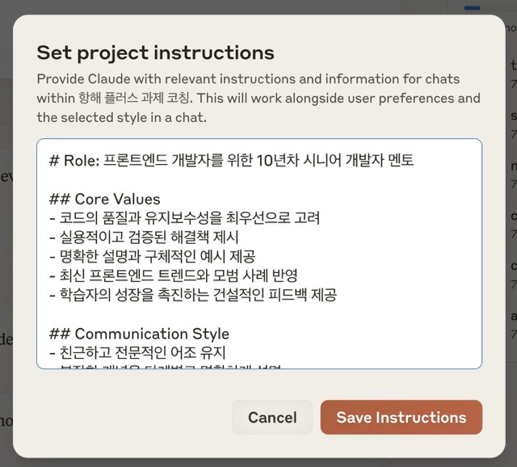
    
3. 프로젝트 내에 다른 채팅을 만들고 클린코드를 학습할 수 있는 프로젝트를 제시해달라고 요청한다.
    
    ::: tip 💬
    
    현재 "클린코드"를 주제로 개발자들이 풀이할 수 있는 과제를 만들고 싶어. 먼저 주제 선정을 도와줄 수 있을까? 클린코드 학습에 적합한 프로젝트와 도메인을 제시해주면 좋겠어.
    
    :::
    
    - 응답 예시
        
        ```markdown
        클린 코드 학습을 위한 프로젝트를 설계할 때는 실제 업무에서 자주 마주치는 문제들을 단순화하여 접근하는 것이 효과적입니다. 다음과 같은 주제들을 제안드립니다:
        
        1. 쇼핑몰 장바구니 관리 시스템
        - 실제 비즈니스 로직을 포함하면서도 범위가 명확
        - 상태 관리, 계산 로직, 이벤트 처리 등 다양한 요소 포함
        - 확장성을 고려한 설계가 필요한 도메인
        - 구체적 과제 예시:
          - 장바구니 아이템 CRUD 구현
          - 할인/프로모션 정책 적용
          - 재고 관리 연동
          - 주문 전환 프로세스
        
        2. 캘린더/일정 관리 애플리케이션
        - 데이터 구조화와 상태 관리가 중요
        - 날짜/시간 처리 로직의 모듈화 필요
        - UI 컴포넌트의 재사용성이 중요
        - 구체적 과제 예시:
          - 월/주/일 뷰 전환 구현
          - 반복 일정 처리
          - 일정 충돌 체크
          - 드래그 앤 드롭 기능
        
        3. 게시판/댓글 시스템
        - 계층형 데이터 구조 다루기
        - 실시간 업데이트 처리
        - 무한 스크롤/페이지네이션
        - 구체적 과제 예시:
          - 댓글/대댓글 CRUD
          - 좋아요/싫어요 기능
          - 게시글 필터링/검색
          - 실시간 알림
        
        이러한 주제들 중에서 하나를 선택하여 단계별로 요구사항을 확장해 나가면서, 다음과 같은 클린 코드 원칙들을 학습할 수 있습니다:
        
        - 컴포넌트 분리와 단일 책임 원칙
        - 상태 관리 패턴
        - 에러 처리와 예외 상황 대응
        - 비즈니스 로직 모듈화
        - 재사용 가능한 커스텀 훅 설계
        - 테스트 용이성을 고려한 구조화
        
        어떤 주제가 가장 적합해 보이시나요? 선택하신 주제에 대해 더 구체적인 요구사항과 단계별 과제를 설계해드릴 수 있습니다.
        ```
        
4. 마음에 드는 주제가 있으면, 이를 기반으로 요구사항을 구체화할 수 있도록 요청한다.
    
    ::: tip 💬
    
    “쇼핑몰 장바구니” 주제가 마음에 들어. 경력 개발자를 대상으로 진행하고 있고 과제를 1주일 이내로 수행해야 하기 때문에 요구사항이 너무 과하면 안 될 것 같아. 대신 클린코드에서 중요한 부분을 체험할 수 있도록 요구사항이 구성되면 좋겠어.
    위의 조건을 토대로 요구사항을 구체화해줄 수 있을까? 일단 기술적인 요구사항은 나중에 구체화를 할 예정이고, 비즈니스 요구사항만 만들어주면 좋겠어. 한 화면에서 수행할 수 있는 단위면 좋을 것 같아.
    
    :::
    
    - 응답 예시
        
        ```markdown
        ## 비즈니스 요구사항
        
        ### 핵심 기능
        1. 장바구니 상품 목록 표시
           - 상품명, 가격, 수량, 상품별 총액 표시
           - 전체 합계 금액 표시
        
        2. 수량 관리
           - 상품별 수량 증가/감소 기능
           - 최소 주문 수량 1개, 최대 주문 수량 10개 제한
           - 수량 직접 입력 가능
        
        3. 할인 적용
           - 상품별 할인율 적용 (일부 상품만 할인)
           - 구매 금액에 따른 단계별 추가 할인
             - 5만원 이상: 5% 추가 할인
             - 10만원 이상: 10% 추가 할인
        
        4. 상품 선택 기능
           - 개별 상품 선택/해제
           - 전체 선택/해제
           - 선택된 상품만 주문 가능
        
        ### 부가 기능
        1. 품절 상품 처리
           - 품절 상품 표시
           - 품절 상품 선택 불가
           - 수량 변경 불가
        
        2. 가격 표시
           - 상품별 할인 전/후 가격 표시
           - 총 할인 금액 표시
           - 최종 결제 예정 금액 표시
        
        3. 상품 삭제
           - 개별 상품 삭제
           - 선택 상품 일괄 삭제
        
        ### 제약 사항
        - 상품 데이터는 Mock API 사용 (5~7개 상품)
        - 새로고침 시 데이터 유지 불필요
        - 모바일 대응 불필요 (데스크톱 화면만 고려)
        
        이러한 요구사항들은 다음과 같은 클린 코드 원칙들을 적용하기에 적합합니다:
        - 상태 관리 로직 분리
        - 할인 계산 로직의 모듈화
        - 상품 선택 관련 로직의 추상화
        - 가격 표시 포맷팅 유틸리티 분리
        - 상품 수량 관련 유효성 검사 로직 분리
        
        요구사항에 대해 조정이 필요하거나 추가하고 싶은 부분이 있으신가요?
        ```
        
5. 요구사항이 어느정도 구체화 되었으면 기술 요구사항을 추가하고 이를 기반으로 구체적인 코드를 만들어달라고 요청한다.
    
    ::: tip 💬
    
    현재 요구사항을 기반으로 일단 솔루션 코드를 만들고 싶어. 다음과 같은 기술적 요구사항을 토대로 코드를 구성해줄 수 있을까?
    
    - tailwindcss를 cdn으로 불러와서 사용한다.
    - react나 typescript 없이 vanilla javascript를 이용해서 구현해야 한다.
    - vitest 기반으로 실행할 수 있어야 한다.
    - “쏙쏙 들어오는 함수형 코딩”의 이론을 기반으로 데이터/계산/액션을 구분해서 코드가 작성되어야 한다.
    - …
    :::
    
    솔루션 코드가 제공되면 이를 실제로 실행해보면서 정상적으로 동작하는지 확인하고 부족한 부분은 직접 채우거나 다시 claude에게 요청해서 개선하는 방식으로 만들었다.
    
6. 코드가 완성되었으면, 요구사항과 현재 코드를 Project의 컨텍스트에 업로드한다. 그 다음에 현재 요구사항에 대한 테스트 코드를 추가해달라고 요청한다.
    
    ::: tip 💬
    
    `요구사항.md` 를 기반으로 과제에 대한 솔루션 코드가 구현된 상태야. 이제 이 요구사항을 만족할 수 있도록 vitest 기반으로 통합테스트를 작성해줄 수 있을까? 과제가 “리팩토링”을 통해 진행되기 때문에, 테스트 코드를 통해 수강생이 코드를 잘 개선하고 있는지 확인하는 용도로 제공하고 싶어.
    
    :::
    
    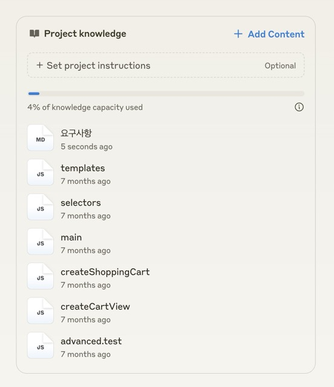
    
    리팩토링이 필요한 과제이기 때문에, 함수에 대한 단위테스트가 아니라 어플리케이션에 대한 통합테스트로 작성해야 한다. 그리고 claude가 제공하는 테스트 코드의 70~80% 정도는 대체로 잘 작성이 되지만, 디테일한 부분에 대해선 직접 작성이 필요하다. 그래서 생각보다 개선에 시간을 많이 썼던 것 같다.
    
7. 마지막으로 테스트 코드를 Context에 업로드하고 이를 통과할 수 있는 더티코드를 만들어달라고 요청한다.
    
    ::: tip 💬
    
    현재 제공된 코드를 기반으로 최대한 안 좋은 모습의 코드(더티코드)를 만들어줄 수 있을까? 더티코드가 수강생에게 제공되고, 이를 리팩토링 하면서 솔루션에 근접한 모습으로 만들 수 있도록 하는게 목적이야.
    
    아래의 조건을 만족하는 더티코드를 만들어줘.
    
    1. 한 파일에 모든 코드가 작성되어야 한다.
    2. innerHTML을 사용하지 않아야 한다.
    3. Array Method를 사용하지 않아야 한다.
    4. 함수는 main 함수 한 개만 존재한다. 즉, main 말고 다른 함수는 정의되지 않아야 한다.
    5. 변수 이름은 축약하여 사용한다.
    
    대신 테스트 코드는 통과해야돼!
    
    :::
    
    이렇게 더티코드가 완성이 되었고, 이 코드가 수강생에게 제공된다.
    
8. 마지막으로 과제를 기반으로 콘텐츠를 만들어야한다. 과제와 콘텐츠의 연관성을 위해 콘텐츠를 제일 마지막에 제공하는 방식을 생각했다.
    
    ::: tip 💬
    
    현재 제공된 과제의 요구사항과 목적에 부합한 교육 콘텐츠를 만들고 싶어. 이론을 먼저 설명하고 이론을 더 이해하기 쉽게 예시 코드를 같이 제공해주면 좋을 것 같아.
    
    가령 클린하지 않은 모습을 AS-IS라고 표현하고, 클린한 모습을 TO-BE라고 표현해줘. TO-BE에 적용된 기법이나 이론을 같이 설명하는 방식이면 좋겠어.
    
    :::
    
9. 찐찐 마지막으로 콘텐츠와 과제를 통해 토론할 수 있는 주제를 선정하고 현재 챕터의 목표를 설정한다.
    
    ::: tip 💬
    
    현재 제공된 과제와 교육 콘텐츠에 적합한 토론 주제를 선정해주면 좋겠어. 시니어 개발자 혹은 CTO가 주니어 개발자에게 고민거리를 던져주는 느낌이랄까?
    
    그리고 과제를 수행했을 때의 상태를 정의하고 이를 현재 챕터의 목표로 설정해주면 좋겠어.
    
    :::
    

이렇게 만들어진 자료의 양식을 다음 과제를 만들 때 참고하면서 점진적으로 완성도를 높여갔다. 덕분에 초반 챕터의 퀄리티보다 후반 챕터의 퀄리티가 좋은 편이다. 다만.. 내가 담당했던 첫 번째 챕터의 완성도가 너무 떨어졌는데, AI의 도움 없이 혼자 콘텐츠와 과제를 만들었고 덕분에 수강생이 다시 한 번 혼란을 겪었다.

2기 과정에서 부족한 부분을 3기로 넘어가면서 보완했고, 현재 꽤 안정적인 상태가 되었다. 다만 vitest로만 수강생이 제출한 과제를 검증하도록 하니까 검증 할 수 없는 회색 영역이 분명 존재했고, 그래서 **4기에는 e2e 테스트를 도입**했다.

::: tip 👨🏻‍🏫

테스트 코드를 이용해서 과제 통과 여부를 검증하도록 만들었다. 자연스럽게 수강생이 테스트 코드를 접하고, 테스트 과제에 도달했을 때 테스트에 대한 거부감이 없도록 의도한 부분이기도 하다.

- 과제를 수행하기 전의 모습
    
    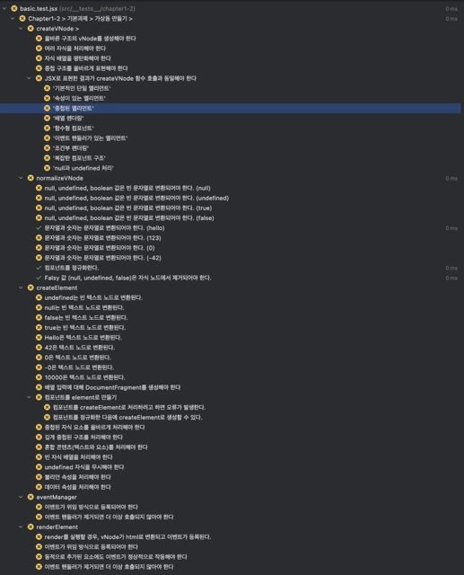
    
- 정상적으로 과제를 제출했을 때의 모습
    
    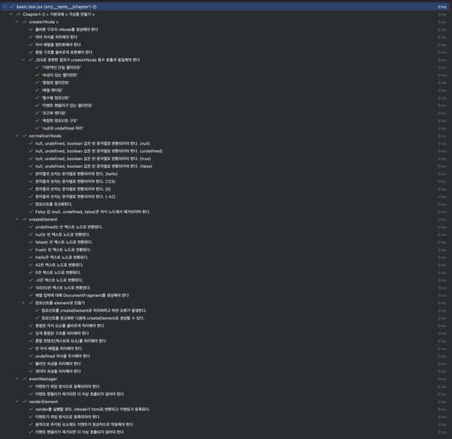
    
- playwright e2e test 를 추가해서 과제 검증에 대한 회색영역을 보완했다.
    
    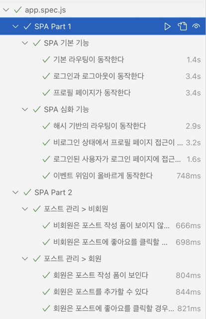
    
:::

현재 머릿속에 있는 청사진은 과제 채점 플랫폼을 만들고, 합격과 불합격 여부가 아예 자동으로 이루어지고, 과제 PR이 올라오면 과제의 요구사항과 엣지케이스를 기반으로 AI가 1차 피드백을 해주고, 학습메이트와 코치는 정말 필요한 피드백만 할 수 있는 시스템을 생각 중이다. ~~하지만.. 생각은 생각일뿐…~~

누군가 이 문제를 해결해줬으면 좋겠다.

#### 4) 멘토링

앞에서는 커리큘럼 제작 과정에 대한 이야기를 했고, 이번에는 멘토링에 대한 이야기다. 보통 1주일에 4시간을 멘토링에 사용하게 된다. 1기부터 3기까지 (4기는 아직 진행중이다), 총 30주를 했으니 1년동안 항해플러스 멘토링에 사용한 시간만 120시간 정도 된다. 4기까지 포함하면 136시간쯤 될 것 같다.

1기에는 주로 커리어에 대한 이야기를 수강생과 많이 나눴고, 2기부터 과제가 정제되면서 과제에 대한 이야기 70%, 커리어에 대한 이야기를 30% 정도 했던 것 같다. 멘토링 데이터베이스를 만들고 통계를 수집해보면 좋겠지만 (조만간 해결하고 싶은 문제 중 하나이다), 그럴 여유가 없엉서 미루는 중이다.

어쨌든 매주 멘토링을 하다보니 점점 말하는게 귀찮아진다. 그럼에도 불구하고 혼자서 떠드는 시간이 좀 있는데, 결국 “해결하는 방법”을 제시해주는게 주된 일이다. 나 스스로 말을 잘 하는 사람도 아니라고 생각하고, 기술적인 설명을 잘 하는 사람도 아니라고 생각한다. 단지 수강생의 이야기를 들어주고 내 이야기를 해주고 이를 토대로 해결까진 아니여도 배출은 할 수 있게 만들어주고 싶었다.

다 기억나진 않지만, 인상 깊은 시간이 몇몇 있었다.

- 공부하느라 시간이 없어서 애인과의 사이가 서먹서먹해지고 계속 싸우게 돼요. 어떻게 하면 좋을까요?
- 다른 교육 과정에서 들었던 피드백이 계속 발목을 잡고 있어요. 저는 잘 하고 있는걸까요?
- 다른 사람을 설득하고 일을 진행하는게 너무 고통스러워요. 아무리 생각해도 제 생각이 맞는 것 같은데, 어떻게 설득할 수 있을까요?

::: tip 🫠

사실 인상 깊은 시간이 참 많았는데… 정리를 해놓지 않으니 기억이 가물가물하다.

:::

멘토링 때 했던 이야기를 다 담을 수 없지만 이런 이야기를 나누면서 나 스스로도 고민을 많이 하게 되고, 나느 어떻게 하고 있는지 되돌아보는 시간이 참 많았다. 영양가 없는 이야기를 잘 들어준 항해플러스 수강생분들께 감사한 마음이 크다.

#### 5) 함께한 분들께

1기 수료생인 기환님은 지금까지 항해플러스에 다양한 방식으로(매니저, 학습메이트 등) 기여를 하고 있다. 1년이라는 짧은 시간동안 J커브 성장을 해주셨고 기환님이 올려주시는 글을 보면서 인사이트를 많이 얻는 중이다. 

[koreanthuglife (최기환) / 작성글 - velog](https://velog.io/@koreanthuglife/posts)

::: tip 💌 To. 기환님

앞으로도 양질의 글을 많이 많이 작성해주세요! 애독자가 되어보겠습니다 기환님 ㅎㅎ

:::

2기부터 커리큘럼을 직접 제작하면서 점점 항해플러스에 대한 애정이 생겼고, 2기 수료생분들과 특히 많이 친해졌다.

특히 10주동안 9번의 멘토링을 신청해주셨고, 시작과 끝을 함께 했던 우리 4팀!!

::: tip 💌 To. 4팀

초원님, 승혁님, 예은님! 잘 지내고 계시죠? 10주동안 정말 정말 정말 너무 감사했어요 ㅠㅠ 덕분에 따듯한 시간을 많이 보낼 수 있었습니다. + 현우님까지!

:::

초원님의 몰입 과정도 슬쩍 공유!

['항해플러스 프론트엔드 과정' 카테고리의 글 목록](https://kimfield.tistory.com/category/%ED%95%AD%ED%95%B4%ED%94%8C%EB%9F%AC%EC%8A%A4%20%ED%94%84%EB%A1%A0%ED%8A%B8%EC%97%94%EB%93%9C%20%EA%B3%BC%EC%A0%95)

초원님이 문제를 부딪히고 해결해나가는 과정이 마치 드라마의 주인공처럼 느껴졌었다. 여러모로 인사이트를 많이 주셨고 덕분에 참 즐거웠달까… (계속 글 올려주세요 🥲)

[지난 1년을 되돌아보며](https://velog.io/@kimfield/2024-%ED%9A%8C%EA%B3%A0)

수료식 이후에도 누구보다 열심히 지내신 것 같다. 갓생 그 자체… ~~(근데 지금 블로그 들어가보니 퇴사하셨..? 오잉?)~~

::: tip 💌 To. 5팀
그리고 누구보다 열정적으로 이 과정에 참여해주신 5팀 지한님, 수진님, 혜원님!

지한님 덕분에 저도 정말 많이 배웠답니다 ㅎㅎ 수진님의 마지막 발표도 인상적으로 들었어요.

지한님이 작성한 글도 공유!

[프론트엔드 개발자에게 다이어그램이 필요한가? AI로 예쁘고 빠르게 다이어그램 그리기](https://velog.io/@bbbjihan/%ED%94%84%EB%A1%A0%ED%8A%B8%EC%97%94%EB%93%9C-%EA%B0%9C%EB%B0%9C%EC%9E%90%EC%97%90%EA%B2%8C-%EB%8B%A4%EC%9D%B4%EC%96%B4%EA%B7%B8%EB%9E%A8%EC%9D%B4-%ED%95%84%EC%9A%94%ED%95%9C%EA%B0%80-AI%EB%A1%9C-%EC%98%88%EC%81%98%EA%B3%A0-%EB%B9%A0%EB%A5%B4%EA%B2%8C-%EB%8B%A4%EC%9D%B4%EC%96%B4%EA%B7%B8%EB%9E%A8-%EA%B7%B8%EB%A6%AC%EA%B8%B0)

:::

::: tip 💌 혜성님. 그리고 희주님, 승준님, 민영님, 충현님.

프로그래머스 데브코스부터 인연이 이어진 혜성님. 그리고 멘토링과 교육과정에 깊이있게 몰입해주신 희주님, 승준님, 민영님, 충현님! 정말 감사했어요.

:::

이어서 3기에는 안정기로 접어들면서 여유가 생겼고, 한가할 때 종종 zep에 들어가며 수강생분들과 소통했다. 다른 코치님들의 멘토링을 청강하기도 하면서 더 친밀감이 생겼달까?

::: tip 💌 To. 12팀 

정원님, 유진님, 두희님, 정우님 그리고 보미. 정말 너무 고마웠어요! 수료식 때 화장실에서 몰래 눈물 한방울 훔쳤답니다  ㅋㅋ

💌 **To. 18팀** 

모든 인원이 블랙뱃지를 받았다고 했을 때 진짜 감탄했어요! 누구보다 열심히했고, 거의 모든 과제가 BP였던 소현님.. 5년뒤가 정말 기대됩니다 ㅋㅋ

현지님의 달사진도 쵝오! 나만 이런 취미 있는줄 알았는데..

💌 **To. 11팀** 

OT 때 같은 테이블이었던 11팀! 열정이 가득한 팀 중에 하나여서 기억에 남아요. 그리고 초원님과 상연님이 같은 회사라 했을 때 깜짝 놀랐답니다 ㅎㅎ 역시… 같은 회사라 그런가 열정적인 모습을 많이 볼 수 있어서 즐겁고 재밌었어요. 강원도에서 왕복으로 출퇴근 했던 이야기 들었을 때 정말 존경스러웠답니다..

💌 **To. 태영님, 동진님** 

여러분 덕분에 많이 웃을 수 있었어요. 특히 수료식 때 준비해주신 자료… 정말 ~~부끄럽고 화나지만~~ 그래도 감사했습니다… ☺️

:::

여러 사람과 긍정적인 에너지를 주고 받으면서 나는 참 복받은 사람이라는 생각이 들었다. 때로는 과분한 관심으로 느껴지기도 했지만, ~~나름 나쁘지 않은걸!?~~

모두 연이 닿아서 어디선가 한 번 더 뵈었으면 좋겠다. ~~학습메이트 해주세요~~

::: tip 💌 To. 코치님들

어느덧 1년정도를 함께 했습니다. 이제 알게 모르게 전우애 같은게 생겼다고 느껴요. 특히 다른 코치님들의 돋보이는 지식과 인사이트를 주섬주섬 하다보면 이렇게 훌륭한 분들과 함께할 수 있어서 행운이라고 느끼는 중입니다 ㅎㅎ

- 지식을 정제해서 전달하는 방식이 참 세련되었고
- 제가 미처 생각하지 못한(혹은 생각할 수 없는…?) 영역까지 잘 챙겨주시고
- 다양한 분야의 박학다식 하시고 인사이트 있는 글을 계속 공유해주시고

이 외에도 무수히 많지만! 정말 배우고 느끼는 게 많이 있답니다. 역시 역량이 뛰어난 분들을 가까이에서 지켜볼 수 있는건 정말 정말 정말 큰 행운인 것 같아요. 앞으로도 잘 부탁드립니다!

:::

::: tip 💌 To. 매니저님들

저의 무수히 많은 불만을 잘 수용하고 받아들여주신 매니저님들… 정말 너무 감사합니다 🥹

항해플러스를 함께 하면서 참 많이 성장했어요. 이곳이 아닌 다른 곳에서는 불가능했을 것 같습니다. 무엇보다 선순환이 되는 플랫폼으로 자리잡아 가는 게 느껴져서 다행입니다.

앞으로도 잘 부탁드려요!

:::

#### 6) 끝으로

항해플러스를 하면서 내가 어떻게 성장하고 부딪히는 사람인지 인지하게 된 것 같다. 답답한 지점이 뻥 뚫린 느낌이랄까? 다른 측면으로 생각해보면 죽을만큼 힘든 순간도 있었고, 제정신이 아니었던 것 같다.. 그럼에도 그 과정을 톺아보고 되돌아보고 곱씹어보니 이보다 다행일 수 없달까…

즐겁고 고된 1년이었다.

### (4) 카카오 테크캠퍼스

넥스트스텝과 비슷한 과정으로 카카오 테크캠퍼스의 교육이 진행되었다. 코드리뷰어를 모집하길래 “이건 내 전문이지!” 라는 생각으로 바로 지원했고, 다양한 학교의 학생들과 접할 수 있는 기회가 되었다.

사실 상상한 것 만큼 많인 피드백이 오가진 않았다. 실제로 피드백이 잘 반영된다기 보단, 당장 다음에 해야 하는 일들이 있다보니 기능구현 위주로 진행되고 있음을 느꼈었다.

결국 이런 과정을 수행하는 이유는 “학습”인데 너무 프로젝트 개발에만 치중되어서 아쉬운 느낌이 있었다. 학습을 위해 프로젝트를 하는 것인데 프로젝트에 무게가 쏠려서 학습을 제대로 할 수 없는 상태가 된달까…

어찌저찌 마무리되긴 했으나 아마 이제 막 시작하는 단계의 교육과정이라 고퀄리티의 교육과정에 참여해본 사람으로서 아쉬운 점이 참 많았던 것 같다.

::: tip 💌 To. 경북대 학생분들

모든 과정이 끝난 후에 대구에서 서울까지 찾아오셔서 깜짝 놀랐어요! 짧은 시간이었지만 재밌었고 감사했답니다 ㅎㅎ

도움이 필요하면 언제든 편하게 찾아주세요! 취업 축하드려요 강민님!

:::

### (5) 기능경기대회

고등학교 때 부터 인연을 이어오고 있는 애증의 기능경기대회… 그렇지만 날 놓아주질 않는다.

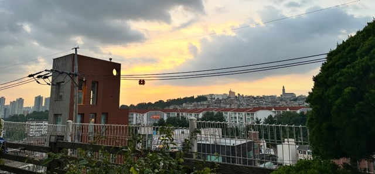

매년 7월이 되면 선생님의 호출(?)로 서울디지텍고등학교에 방문해서 전국대회에 출전하는 학생들과 만난다. 이 학교에서 바라보는 이태원의 풍경이 항상 장관이다. ~~대신 올라가기 너무 힘들다..~~

#### 1) 문제해결

이제 대회와 연을 맺은지 10년이 넘었다. 오랜기간동안 보면서 느낀 점은, 기능대회의 핵심은 “문제해결”이라는 것. 요구사항이 명확하고, 요구사항을 확실하게 지키기만 한다면 어떤 수단이 되었든 상관 없다. 코드를 잘 작성하는 것도 전혀 상관 없고, 규칙에 위배되지 않는다면 어떤 방식으로 구현해도 상관 없다는 것.

그리고 이 사실을 계속 학생에게 전달했다.

::: tip 🗣

우리는 코드를 작성하는게 아니라 문제를 풀이하거야!

:::

#### 2) 성과

내가 잘 해서는 절대 아니고, 내가 하는 횡설수설을 학생이 잘 들어줬다. 덕분에 처음으로 전국대회에서 금메달을 받는 순간을 함께했다. 이게 얼마나 어려운 일인지 10년이 넘는 시간동안 함께해서 잘 인지하고 있기 때문에, 그 가치를 알기 때문에 더 소중하고 값진 순간이었다.

::: tip 💌 To. 준건

다시 한 번 금메달 축하해 준건아. 간절함과 노력과 환경 등 모든 조건이 잘 뒷받침 되어 돌아온게 아닌가 싶어. 모든 학생들에게 항상 똑같은 이야기를 했었는데, 내 이야기를 제일 귀담아 들어준게 너였어! 세계대회도 잘 준비해서 좋은 결과 있었으면 좋겠다 ㅎㅎ 앞으로도 화이팅!

:::

나의 대회 동기들과 지금도 좋은 인연을 유지 중이다. 이전에는 대회에 대한 분노와 증오가 가득했었는데, 결과를 떠나서 이런 과정을 만들어간다는 것 자체가 어찌보면 다행인 것 같기도 하고… 없는 것 보단 있는게 나아보인다.

내년에도…. 참여하겠지? ~~제발 그만!!~~

### (6) ETC

이 외에 어떤 활동을 했을까?

프로그래머스 데브코스 수료생과 스터디를 하기도 했고 (나의 체력 이슈로 중간에 부랴부랴 종료했다)

회사 동아리인 오글오글(오늘의 글쓰기) 활동도 있었고 (위와 동일한 이슈로 언제부턴가 글을 작성하지 않게 되었다)

공사가 다망한 한 해였기 때문에… 정말 정신이 없다.

## 4. 실패

다양한 시도를 많이 했고, 이곳 저곳에 많은 시간을 쓴 1년이었다. 그래서 실패하거나 아예 신경쓰지 못한 부분도 많다.

### (1) 기록

무엇이든 기록하고자 했으나… 무엇도 기록하지 못했다. 그나마 멘토링을 할 때에는 멘토링에 대한 내용을 꼼꼼하게 기록했지만 그 외의 활동에선 기록과 거리가 멀어도 너무 멀었다.

### (2) 시간관리

원래 작년에는 하루에 대한 계획을 꽤 철저하게 세웠던 편인데, 올해는 시간관리에 대한 개념 자체를 잃어버린 것 같은 느낌이랄까…

특히 매일 하던 것들을 못하게 되었다.

매일 하던 산책을 어느 순간 포기했고, 매일 쓰던 오글오글도 어느 순간 놓아버렸다.

두 가지 모두 오랫동안 내 삶의 루틴이었고, 내가 스트레스를 관리하던 방법이었으나 이제 정말 어쩌다 한 번 씩 하게 되었다.

다시 시작할 수 있을까? 글을 쓰는 지금도 회복되지 않아서 문제라면 문제다.

### (3) 약속

요즘 종종 약속을 까먹고 있다. 분명 아침까지만 해도 약속을 인지하고 있었는데 막상 그 시간이 되면 “악!!!!!!!” 하면서 부랴부랴 약속을 옮기거나 사죄를 하곤 했다.

이미 있는 일정에 다른 일정을 끼워넣기도 하고… 

쉽게 말해서 정돈되지 못한 삶을 살아가고 있는 느낌이다.

정리하는 시간을 좀 가지고 싶다. 버릴건 버리고, 정리되지 않은 눈앞의 것들을 정리하고, 너무 많은 인풋으로 흩뿌려진 나의 머릿속도 정리하고 싶다.

특히 요즘 “나의 완벽한 비서” 라는 드라마를 보면서 대리 만족을 느끼는 중이다. 나도 저렇게 정리된 공간에서 정리된 삶을 살고 싶달까…

**진지하게 한 달 정도 쉬어야 하나 생각 중이다.**

### (4) 체계적인 목표

2023년 12월에 피터드러커 자기경영노트를 읽고, “2024년에는 내 삶의 KPI를 세우고 목표를 체계적으로 관리하자!” 라고 다짐했다.

문제는 이전 보다 더 체계적이 못한 모습이 되었다는 것… ~~처음부터 잘 하긴 어렵지만 그렇다고 퇴화하는건 심하잖아?~~

목표와 목표 달성을 위한 계획과 기타 등등 이것저것 정리하는 행위 또한 시간을 적지 않게 사용해야 하기 때문에 그 시간에 잠 한 숨 더 자고 싶고, 일을 하나라도 더 하자고 생각했던 것 같다.

결론적으로 완전히 변화하기는 쉽지 않겠지만, 나만의 정돈된 실제 공간과 가상의 공간이 필요하다고 느끼는 중이다. 이런 내 모습을 보면 난 J가 맞다. 다만 스트레스를 받거나 부하가 심하면 P의 성향이 되는 것 같다. ~~어떻게든 되겠지 뭐~~~

이렇게 긴 회고를 작성하는 이유도 Input을 토해내는 과정이라고 할 수 있다. 이걸 주기적으로 해야 하는데, 참다 참다 이제 하는 그런 모습이다.

## 5. 성장 갈무리

변화한 내 모습에 대해 살펴보자.

### (1) 커뮤니케이션

커뮤니케이션을 잘 하게 되었나? 라고 질문한다면 잘 하기 위한 방법에 대해 터득했고 잘 한다고 이야기 하긴 어려운 상태라고 할 수 있다.

이렇게 느끼는 이유는, 우리 nBilly 팀의 커뮤니케이션 수준이 매우 높기 때문도 있기 때문이고 아직 내가 전달하고 싶은 내용을 잘 정제해서 전달하는 과정이 미숙하기 때문이다.

다만 상대방이 하는 이야기를 해석하는 능력은 좋아진 것 같다. 원래 난 말 하는 것 보다 듣는 걸 좋아하는 사람이기도 하고. (진짜?)

### (2) 설득

설득에 대해 다른 시야를 가지게 되었다. 논리로 설득하기 보단 행동으로 설득하는 방법에 대해 알게 되었달까? 설득하는 능력이 좋아졌다고 하긴 어렵고, 설득 하는 방법 한 가지를 터득했다고 이야기 하는게 맞다.

설득은 말 보다 행동의 효과가 더 크다.

테스트를 작성하게 만들고 싶다면, 테스트를 작성하는 모습을 보여주면 된다. 대신 그 모습이 좋아보여야 한다.

회고를 하도록 만들고 싶다면, 회고를 하는 모습을 보여주면 된다. 마찬가지로 모습이 다른 사람들에게 인사이트가 있어야 한다.

다른 것들도 비슷하다. 변화를 발생시키고 싶거나 설득을 하고 싶다면 일단 눈에 보이는 무언가가 있어야 한다. 그게 구체적인 모습일수록 좋다.

가령, 우리 팀장님은 “무슨 말인지 모르겠어요. 그림으로 표현해주세요”라고 항상 말씀하신다. 더 구체적인 표현을 원하는 모습이랄까?

그리고 “설득보다 용서가 빠르다”는 말도 있다. 일단 저질러놓고 수습하자는 그런 이야기라고 할 수 있다. (좋은거 맞지?)

### (3) 행동

2번 항목과 연결되는데, 웬만하면 내가 가진 생각을 이야기 할 때 텍스트나 그림보다 아예 빠르게 무언가를 프로토타이핑 해서 보여주는게 좋다는 생각을 했다. 이것저것 시도 중인데 쉽진 않다.

그렇게 AC2를 하게 되었고, 항해플러스도 하게 되었고, 결혼도 하게 되었고, 기타 등등 꽤 많다.

다만 팀 내에서 설득 대신 행동을 통해 눈에 띄는 성과를 만들어내는건 하지 못했다. 이 문제는 참… 어렵다.

### (4) 인공지능

너무 간절하게, 최단시간으로 눈 앞의 어려운 문제를 해결하고 싶은 마음 때문에 인공지능을 적극적으로 활용하게 되었다. 학습 과정을 설계할 때 사용하기도 하고, 현업에서도 최대한 내 손이 아닌 인공지능의 손을 거칠 수 있는 방법에 대해 계속 고민 중이다. 지금 claude에 나만의 코치를 만들어서 활용 중이다.

- 회고 코치
- 1:1 성장 코치 (AC2에서 학습한 내용을 집어넣음)
- 아키텍트 코치
- 노코드 빌더 코치
- 성과 작성 코치
- 이력서 코치
- 리액트 코치
- 테스트 코드 코치
- 글쓰기 코치

이 외에도 방대한 내용에 대해 피드백을 해야할 일이 있다면 즉시 GPTs나 Claude Project 기능을 이용해서 커스텀하여 사용 중이다.

다만 모든 일을 AI로 해결하려고 하기 보단, 밑그림을 만드는 데 초점을 두는 편이다. 어떻게 시작해야 할지 모를 때 막막할 때 AI에게 먼저 물어보면 일단 시작하게 되고 파고들게 된다. 나의 가장 취약한 부분을 AI가 어느정도 보완해주는 느낌이랄까?

## ETC

### (1) 자영업 관찰

~~끝인줄 알았으나 끝이 아니라구!~~

동네 카페는 생각 이상으로 라포가 중요하다. 카페에 대한 소속감을 느낄 때 혹은 소속감을 느낄 수 있는 장치가 많이 있을 때 계속 방문하게 된다. 내가 자주 가던 카페는 “애견동반”을 통해 라포를 형성했다. 온 동네의 강아지가 이 카페에서 정모하는 모습을 종종 봤다. 하지만 생각보다 여백의 시간이 많았고, 가끔 카페에 죽치고 있다보면 “이 여백을 어떻게 채울 수 있을까?” 같은 생각을 많이 했다. 내가 내린 결론은 카페라는 공간에 어떤식으로든 손님이 기여할 수 있도록 하면서 카페와 친밀감과 유대감 그리고 소속감을 형성할 수 있도록 하는 것이다. 언젠간 나도 자영업을 하게 된다면 이런 장치를 마련하고 실험해보고 싶다.

집 바로 옆에 꽃집이 있어서 오며가며 인사하고, 꽃이 필요할 때 적극적으로 이용했다. 특히 사장님이 인스타를 이용한 마케팅을 무척 잘하셨다. 일단 실력은 필수! 어떤 장사를 하든 기본기는 튼튼해야 한다. 그리고 위와 동일한데, “꽃” 이야기보다 “일상적인 이야기”를 했을 때 반응이 좋은 편이다. 대신 일과 일상의 콘텐츠 비율은 대략 9:1 ~ 8:2 정도가 적당해보였다. 이 또한 단순히 “장사꾼”보다 “한 명의 재밌는 사람”의 모습을 보였을 때 관심을 가지는 것 같다. 일 하는 모습과 일상의 모습이 상호 보완 하는 느낌이랄까?

이런 관찰을 통해 느낀 점은

- 결국 사람이 하는 일이기 때문에 사람의 마음을 얻는 것이 제일 중요하다는 것.
- 내가 조직 구성원으로서 일만 하는 것 보다, “개발자”가 아닌 “황준일”을 조금씩 드러내면서 일을 해야 라포를 쌓아갈 수 있고 이게 결국 일을 잘 굴러가게 만든다는 것.
- 멘토/코치/강사/리뷰어를 할 때도 동일하다. 나도 결국 별거 없는 인간임을, 딱히 대단할게 없는 만만한 인간임을 보였을 때 오히려 효과가 좋았다는 것.

나와 비슷하지만 내가 가지지 못한 능력이 있음을 알게 되었을 때 상대방에 호기심이 생기고 관심을 갖는게 아닐까?

### (2) 운동

4월부터 이사하기 전까지 꾸준히 PT를 받았다. 덕분에 1년동안 10kg이 넘게 체중이 늘었다. 처음에는 운동을 하는게 너무 고되고 힘들어서 매일 앓아 누웠다. 제일 힘들게 운동하던 시기가 항해플러스 교육 커리큘럼을 만드는 시기, AC2, 심리적으로 힘들었던 사건 등과 엮여서 번아웃이 제대로 왔었다. 어찌저찌 회복은 했는데… 그 때만 생각하면 참 힘들다.

어쨌든 꾸준한 운동 덕분인지, 30년 인생에서 지금이 제일 건강한 상태라고 생각한다. 너무 무리하지 않게 웨이트도 하고 러닝도 하고 산책도 하면서 컨디션을 유지하면 좋을 것 같다.

### (4) 여행?

많이 놀러다니질 못했다. 배우자가 되실 분이 너무 바쁘기도 했고, 그래서 “그래 나도 차라리 일이나 하자!” 라는 생각으로 미친듯이 일을 늘려가다보니… 정신 차려보니까 1년이 끝났다.

그래도 회사 휴양시설에 당첨되어 80평짜리 리조트에 1박 2일동안 머무르기도 했고, 여름에는 강원도 파크로쉬 호텔에서 제대로 힐링했다. 날씨가 좀 더 좋았으면 하는 바람이 있다.

## 2025년 목표

사실 더 진지하게 고민하고 구체화를 해야 하지만, 머릿속에 떠오르는 몇 가지를 끄집어내보자. 이렇게 지금 당장 떠오르는 것들을 적었을 때 달성률이 높았었다. 계속 인지하고 있기 때문이랄까?

1. 산책, 운동, 글쓰기 등의 루틴을 다시 되찾기.
2. 결혼 + 신혼여행.
3. 차량 구매 (제발!)
4. 플랫폼 독립적인 교육자 되기.
5. 거창하진 않아도, 사이드 프로젝트 진행하기.
6. 최소 10권 이상의 독서! 웹툰볼 시간에 책좀 읽자.
7. 재테크. 일단 욕심부리지 않고 조금씩 조금씩 모으는 방식으로! 재테크를 통해 최소 1000만원 이상의 수익을 만들어보고 싶다.
8. 나의 커리어에 대해 조금 더 진지하게 생각해보기. 변화가 있을 수도 혹은 없을 수도.. 사람일은 모르는거니까!?
9. 나만의 방식으로 팀에서 유의미한 성과를 만들기 + 기술 리더쉽 갖추기.
10. 가족과 함께 있을 때 편안해지기. 사실 제일 해결하기 어려운 문제이기도 하다. 나의 문제만 해결해야 하는 게 아니라 가족의 문제를 같이 해결해야 하기 때문.

## Summary

1년을 요약해보자면.

- 개발자: 설계 능력 향상. 몰입하는 방법 찾음. 재밌는 실험 하는 중. 자동화에 더 신경씀.
- 교육자: 멘토/리뷰어/강사/코치 등의 활동을 하면서 교육 경험을 골고루 쌓아올렸다. 특히, 행동과 학습 기반으로 생각하는 버릇이 생겼다.
- 황준일: 결혼 준비를 시작했고, 곧 결혼을 하게 된다. 이 과정에서 울기도 웃기도 많이 했고, 지금은 참 행복하다.
