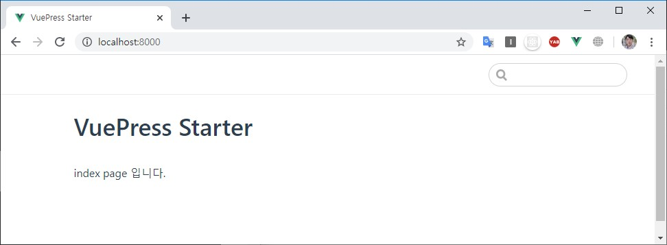
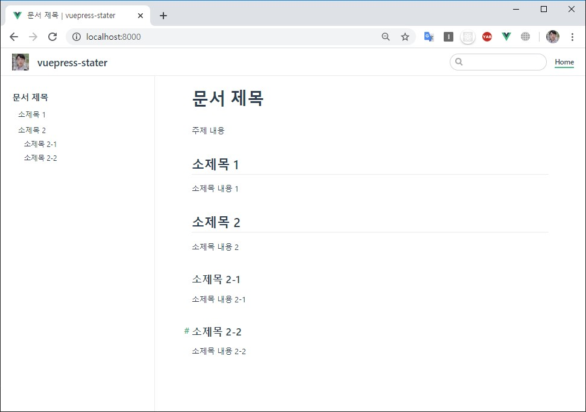

---

title: Vuepress 시작하기
description: 현재 페이지에서 다루고 있는 내용은 vuepress로 TIL 문서를 만들면서 알게된 내용들을 정리한 것이다.
prev: false
sidebarDepth: 2

---

# Vuepress 시작하기

현재 페이지에서 다루고 있는 내용은 vuepress로 TIL 문서를 만들면서 알게된 내용들을 정리한 것이다.

## Static Site Generator
먼저 vuepress 이전에 `SSG(Static Site Generator)` 에 대한 이해가 필요하다. SSG는 한국말로 `정적 사이트 생성기` 이며, 말 그대로 html, js, css 로만 만들어진 사이트를 의미한다. 감이 잘 안잡힌다면 `동적 사이트` 라는 개념을 생각해보자.

### 동적 사이트(Dynamic Site)
아마 다음과 같은 기술(혹은 프로그래밍 언어, 프레임워크)은 익숙할 것이다.

- `java` Spring framework, jsp
- `php` Laravel, Codeigniter framework, Wordpress
- `python` Django, Flask framework
- `node.js` Express.js, Coa.js, Nest.js
- `C#` .NET framework

위와 같은 기술스택으로 만들어진 사이트를 '동적 사이트' 라고 생각하면 된다.
예를 들어 `게시판` 이라는 시스템이 그렇다.
게시판에는 글작성, 글수정, 글삭제, 글조회 등이 존재한다.
그리고 `조회 페이지`의 경우 __하나의 페이지를 프로그래밍 하여 만들어 놓으면 그 페이지에 게시물 정보가 매칭되어 여러 개의 페이지가 만들어지는 것이다.__

### 정적 사이트(Static Site)
정적 사이트는 오직 HTML, CSS, Javascript 만 사용하여 만들어진 것이다.
Server Side 에서 DB를 처리하거나 Request로 Data를 받아서 처리하는 게 아니기 때문에 작성/수정/삭제 같은 기능은 존재할 수 없다.
오직 페이지를 조회하는 것만 가능하다.

대표적으로 `Github Page` 가 정적 사이트라고 생각하면 된다. Github Page는 github에 올라온 파일(HTML, CSS, Javascript)을 기반으로 작동한다.

### 정적 사이트 생성기(SSG, Static Site Generator)

`SSG`는 정적 사이트를 만들어주는 도구 혹은 프레임워크다. 다음과 같은 SSG들이 존재한다.

- __Jekyll__: `Ruby 기반` 테마, 플러그인 등이 제일 풍부하며 Github Page에 내장
- __Hugo__: `Go 기반` build 속도가 제일 빠름
- __Hexo__: `Node.js 기반` 공식 한글 문서 지원
- __Gatsby__: `React 기반` 정적 컨텐츠 + GraphQL
- __VuePress__: `Vue 기반` 대표적으로 Vue 공식 문서에 사용됨. `필자가 사용하는 SSG`

최신 동향은 [StaticGen](https://www.staticgen.com/) 에서 확인할 수 있다.

::: tip Nuxt와 Next

StaticGen에서 Nuxt와 Next에 대한 정보도 확인할 수 있다. 개인적으로 Nuxt와 Next는 SSG보단 SSR을 위한 도구라고 생각하기 때문에 위의 목록에서 제외했다. 

:::

## VuePress 시작하기
VuePress는 앞서 언급한 SSG 중 하나이며, 정말로 간단하게 시작할 수 있다.
시작하기 전에 먼저 npm(혹은 yarn)이 설치되어 있어야 한다.

[VuePress 공식문서](https://vuepress.vuejs.org/)에 있는 내용을 기반으로 서술할 것이다.

VuePress를 시작하기 위해선 Npm이나 Yarn 같은 Pacakge Manager 가 필요하다. 

- [npm 설치하기](https://nodejs.org/ko/) (Node.js를 설치하면 됨)
- [yarn 설치하기](https://heropy.blog/2017/11/25/yarn/) (링크의 포스팅 참고)

### install
필자는 yarn을 기준으로 설명할 것이다.

``` sh
# project directory 만들기
mkdir vuepress-stater
cd vuepress-starter

# package.json 생성
yarn init -y

# vuepress를 devDependency로 추가
yarn add -D vuepress
```

그리고 pacakge.json 파일에 `scripts`를 추가해야 한다. 추가하기 전에 vuepress cli에 대한 이해가 필요하다. 

::: tip vuepress cli 

- vuepress \<command\> [targetDir] [options]
- targetDir와 options은 생략 가능하다.
- [vuepress cli 명령어 확인하기](https://vuepress.vuejs.org/api/cli.html)

::: 

``` json {8,9,10,11}
// pacakge.json
{
  "name": "TIL",
  "version": "1.0.0",
  "main": "index.js",
  "repository": "https://github.com/JunilHwang/TIL", // github repository 정보. 굳이 없어도 됨.
  "author": "junil-hwang <tjsdlf4261@naver.com>", // github author 정보. 굳이 없어도 됨.
  "scripts": {
    "docs:dev": "vuepress dev --port 8000",
    "docs:build": "vuepress build"
  },
  "license": "MIT",
  "devDependencies": {
    "vuepress": "^1.2.0"
  }
}
```

필자는 root directory에 문서를 생성할 것이기 땜누에 targetDir를 생략했다.

만약 진행중인 프로젝트가 존재하고, root에 `docs라는 하위 폴더`를 만들고 docs에 문서를 생성할 것이라면 다음과 같이 수정하면 된다.

``` json
// package.json
{
  // ... 앞 내용 생략
  "scripts": {
    "docs:dev": "vuepress dev docs --port 8000",
    "docs:build": "vuepress build docs"
  },
  // ... 뒷 내용 생략
}
```

`scripts` 작성이 완료 후에 이제 `README.md`를 만들어야 한다.
``` md
# VuePress Starter

index page 입니다.
```

여기까지 완료 되었을 때 Project 구조는 다음과 같다.

```
. (vuepress-starter)
  ├─ node_modules
  ├─ README.md
  └─ package.json
```

이제 작성한 `README.md` 를 vuepress로 확인해보자.

``` sh
# pacakge.json에서 작성한 scripts 명령어를 실행하면 된다.
yarn docs:dev
```



이렇게 매우 간단하게 문서를 만들 수 있다.

## config
이제 config를 이용하여 문서를 꾸며보자. 먼저 다음과 같이 `.vuepress` 폴더와 `config.js` 파일을 만들어야 한다.

``` {3,4}
. (vuepress-starter)
  ├─ node_modules
  ├─ .vuepress
  │  └─ config.js
  ├─ README.md
  └─ package.json
``` 

``` js
// config.js
module.exports = {
  title: 'vuepress-stater', // 사이트 타이틀
  description: 'vuepress로 만든 문서입니다.',
  themeConfig: {
    logo: 'https://avatars1.githubusercontent.com/u/18749057?s=460&v=4', // 로고 이미지
    nav: [
      { text: 'Home', link: '/' }
    ],
    sidebar: 'auto' // h1~h6 같은 heading tag를 기준으로 sidebar를 만들어줌
  }
}
```

__\* config.js의 내용은 [Config Reference](https://vuepress.vuejs.org/config/)를 참고하면 된다.__

`README.md` 에 대한 내용도 약간 보충해보자.

``` md
# 문서 제목
주제 내용

## 소제목 1
소제목 내용 1

## 소제목 2
소제목 내용 2

### 소제목 2-1
소제목 내용 2-1

### 소제목 2-2
소제목 내용 2-2
```

다시 `yarn docs:dev` 를 실행하여 확인해보자.



`logo`와 `navigation`, 그리고 `sidebar` 가 생긴것을 확인할 수 있다. 마치 [vue.js 공식문서](https://kr.vuejs.org/v2/guide/) 처럼 생겼다. 공식문서도 vuepress로 만들어졌기 때문이다.

## Reference
- [VuePress 공식문서](https://vuepress.vuejs.org/)
- [Config Reference](https://vuepress.vuejs.org/config/)
- [정적 사이트 생성기란](https://62che.com/blog/vuepress/%EC%A0%95%EC%A0%81-%EC%82%AC%EC%9D%B4%ED%8A%B8-%EC%83%9D%EC%84%B1%EA%B8%B0%EB%9E%80.html#%EC%B5%9C%EC%8B%A0-%EB%8F%99%ED%96%A5)
