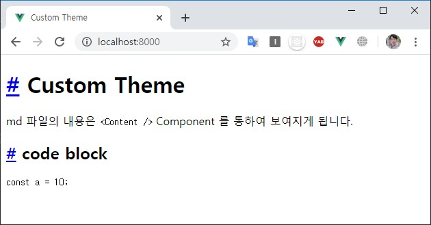

---

sidebarDepth: 2

---

# VuePress 테마 설정 
현재 페이지는 VuePress에서 Theme를 다루는 방법에 대해 기술한 내용이다.

## Using Theme
테마는 직접 만들 수도 있고, 다른 사람이 만든 테마를 다운받아 사용할 수도 있다.

테마와 관련된 설정은 기본적으로 `.vuepress/config.js` 에 입력하면 된다.

```js
// .vuepress/config.js
module.exports = {
  theme: 'vuepress-theme-테마이름'
}
```

`prefix`가 __vuepress-theme-__ 일 경우, 생략할 수 있다.

```js{3}
// .vuepress/config.js
module.exports = {
  theme: '테마이름' // 'vuepress-theme-테마이름' 을 가져온다.
}
```

참고로, vuepress의 기본 테마는 `node_modules/@vuepress/theme-default` 에 들어있으며, 

config.js에 theme를 지정하지 않으면, default는 `@vuepress/theme-default` 이다.

## Vuepress Theme 직접 만들기

테마를 직접 만드는 방법은 매우 간단하다. `.vuepress/theme` 폴더를 만들고, 가이드라인대로 파일 및 폴더를 구성하면 된다.

```{3,4}
.
└─ .vuepress
│  └─ theme
│     └─ Layout.vue
└─ README.md
```

그리고 `Layout.vue` 에 `<Content />` 라는 component를 사용하면, `*.md` 파일의 내용이 보여지게 된다.  

``` html
<template>
  <div class="theme-container">
    <header>Custom Theme Header</header>
    <Content/>
    <footer>Custom Theme Footer</footer>
  </div>
</template>
```

`README.md`에 있는 내용이 다음과 같다고 했을 때
``` md
# Custom Theme
md 파일의 내용은 `<Content />` Component 를 통하여 보여지게 됩니다. 
```

결과 화면은 이렇게 나온다.


모든 `*.md` 파일은 `<Content />` Component에 mapping 된다.

### Theme를 직접 만들 때의 문제점

Theme를 직접 만들면 `default theme`에서 제공하는 style과 plugin을 사용할 수 없기 때문에 `code block` 이나 `markdown` 등을 새롭게 꾸며줘야 한다.

예를들어 `code block`을 입력하면 다음과 같이 날 것(?) 으로 출력된다.

~~~
# Custom Theme
md 파일의 내용은 `<Content />` Component 를 통하여 보여지게 됩니다.

## code block

``` js
const a = 10;
```
~~~



그래서 Theme를 처음부터 만드는 것 보단 `default theme`를 __extend__ 하여 사용하거나 __eject__ 사용 하는 것이 좋다.

## Reference
- [공식문서](https://vuepress.vuejs.org/theme/)
- [vuepress로 블로그 만들기](https://blog.g40n.xyz/posts/2019-01-01-vuepress-blog.html)  
