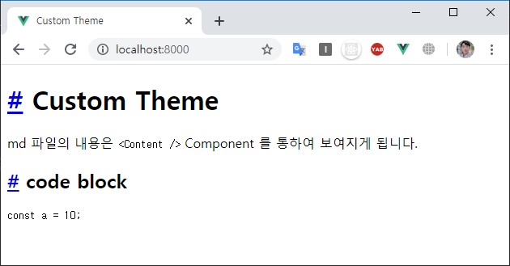
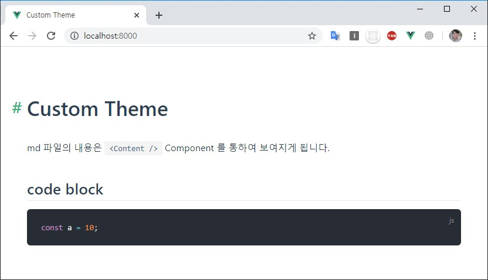
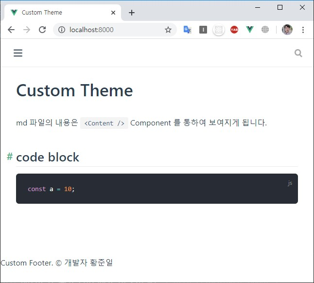
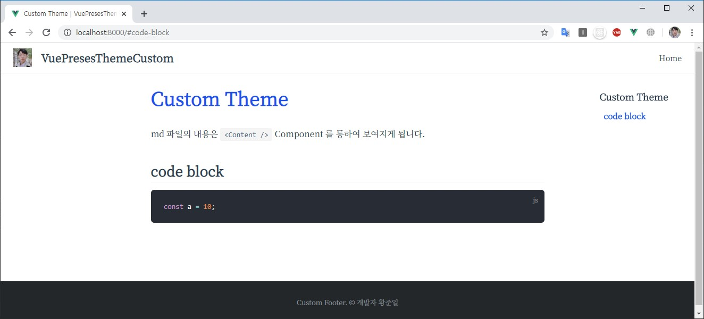

---

title: VuePress 테마 설정
description: 현재 페이지는 VuePress에서 Theme를 다루는 방법에 대해 기술한 내용이다.
sidebarDepth: 2

---

# VuePress 테마 설정 

현재 페이지는 VuePress에서 Theme를 다루는 방법에 대해 기술한 내용이다.

## Using Theme
테마는 직접 만들 수도 있고, 다른 사람이 만든 테마를 다운받아 사용할 수도 있다.

테마와 관련된 설정은 기본적으로 `.vuepress/config.js` 에 입력하면 된다.

```js
// .vuepress/config.js
module.exports = {
  theme: 'vuepress-theme-테마이름'
}
```

`prefix`가 __vuepress-theme-__ 일 경우, 생략할 수 있다.

```js{3}
// .vuepress/config.js
module.exports = {
  theme: '테마이름' // 'vuepress-theme-테마이름' 을 가져온다.
}
```

참고로, vuepress의 기본 테마는 `node_modules/@vuepress/theme-default` 에 들어있으며, 

config.js에 theme를 지정하지 않으면, default는 `@vuepress/theme-default` 이다.

## Vuepress Theme 직접 만들기

테마를 직접 만드는 방법은 매우 간단하다. `.vuepress/theme` 폴더를 만들고, 가이드라인대로 파일 및 폴더를 구성하면 된다.

```{3,4}
.
└─ .vuepress
│  └─ theme
│     └─ Layout.vue
└─ README.md
```

그리고 `Layout.vue` 에 `<Content />` 라는 component를 사용하면, `*.md` 파일의 내용이 보여지게 된다.  

``` html
<template>
  <div class="theme-container">
    <Content/>
  </div>
</template>
```

`README.md`에 있는 내용이 다음과 같다고 했을 때
``` md
# Custom Theme
md 파일의 내용은 `<Content />` Component 를 통하여 보여지게 됩니다. 
```

결과 화면은 이렇게 나온다.


모든 `*.md` 파일은 `<Content />` Component에 mapping 된다.

### Theme Directory Structure

```
theme
├─ global-components
│   └─ xxx.vue
├─ components
│   └─ xxx.vue
├─ layouts
│   ├─ Layout.vue (Mandatory)
│   └─ 404.vue
├─ styles
│   ├─ index.styl
│   └─ palette.styl
├─ templates
│   ├─ dev.html
│   └─ ssr.html
├─ index.js
└─ enhanceApp.js
```

::: tip 상세 설명
- `theme/global-components` 이 디렉토리의 component는 자동으로 global component로 등록됨. <br />[* 참고링크](https://github.com/vuejs/vuepress/tree/master/packages/@vuepress/plugin-register-components)
- `theme/components` component 등록
- `theme/layouts` Layout.vue가 기본 component 가 되고, 404.vue는 404 page에 대한 component 가 됨
- `theme/styles` index.styl과 palette.styl을 기본으로 불러옴. 나머지는 작성하기 나름
- `theme/templates` 기본 템플릿
- `theme/index.js` 테마 구성의 entry 파일
- `theme/enhanceApp.js` Vue plugin을 설치하거나 전역 구성 요소를 등록하거나 라우터 후크 추가 가능
:::

`Layout.vue` 는 항상 필요하지만, 다른 것들은 필요할 때 추가하면 된다.

### VuePress 관련 computed 변수

VuePress에는 default theme 또는 custom theme에 사용하기 위해 `global computed`가 내장되어 있습니다.

자세한 내용은 [공식문서](https://vuepress.vuejs.org/guide/global-computed.html) 에서 확인할 수 있고, 일단 핵심적으로 사용되는 변수만 나열하면 다음과 같다.

#### $site

site의 `title` `description` `base` `pages` 등을 가져온다.

``` json
{
  "title": "VuePress",
  "description": "Vue-powered static site generator",
  "base": "/",
  "pages": [
    {
      "lastUpdated": 1524027677000,
      "path": "/",
      "title": "VuePress",
      "frontmatter": {}
    },
    ...
  ]
}
```

#### $page

현재 페이지에 대한 정보를 가져온다.

``` json
{
  "title": "Global Computed",
  "frontmatter": {},
  "regularPath": "/guide/global-computed.html",
  "key": "v-d4cbeb69eff3d",
  "path": "/guide/global-computed.html",
  "headers": [
    { "level": 2, "title": "$site", "slug": "site" },
    { "level": 2, "title": "$page", "slug": "$page" },
    ...
  ]
}
```

#### $themeconfig

`config.js`의 `themeConfig`를 가져온다.


### Theme를 직접 만들 때의 문제점

Theme를 직접 만들면 `default theme`에서 제공하는 style과 plugin을 사용할 수 없기 때문에 `code block` 이나 `markdown` 등을 새롭게 꾸며줘야 한다.

예를들어 `code block`을 입력하면 다음과 같이 **날 것(?) 으로 출력**된다.

~~~
# Custom Theme
md 파일의 내용은 `<Content />` Component 를 통하여 보여지게 됩니다.

## code block

``` js
const a = 10;
```
~~~



이에 대한 방안 중 하나는 **default-theme의 style을 가져다 사용하는 것**이다.


``` html{3,6}
<template>
  <div class="theme-container">
    <Content class="theme-default-content" />
  </div>
</template>
<style lang="stylus" src="@vuepress/theme-default/styles/index.styl"></style>
```



하지만 default-theme에서 지원하지 않는 것들을 일일히 찾아서 수정하는 것은 번거롭기 때문에, Theme를 처음부터 만드는 것 보단 `default theme`를 __extend__ 하여 사용하거나 __eject__ 사용 하는 것이 좋다.

## Theme Extend

theme를 extend 하는 방법도 매우 간단하다. `.vuepress/theme/index.js` 에 다음과 같이 작성하면 된다.

```js{4}
// theme/index.js
module.exports = {
  extend: '@vuepress/theme-default',
  globalLayout: '/layouts/GlobalLayout'
}
```

`GlobalLayout.vue` 도 만들어줘야 한다.

``` html{3}
<template>
  <div id="global-layout">
    <component :is="$page.path ? 'Layout' : 'NotFound'" />
    <footer class="siteFooter">
      &copy; 개발자 황준일
    </footer>
  </div>
</template>
```

위와 같이 구성했을 때, 폴더 구조는 다음과 같다.
```{4,5,6}
.
└─ .vuepress
│  └─ theme
│     ├─ layouts
│     │ └─ GlobalLayout.vue
│     └─ index.js
└─ README.md
```

결과를 확인해보면, footer가 추가된 것을 볼 수 있다.



여기서 `.vuepress/styles/index.styl` `.vuepress/styles/palette.styl` `.vuepress/config.js` 등의 파일을 만들고 약간의 입력을 통하여 조금 더 세련되게 꾸밀 수 있다.

::: tip

`index.styl`은 **전역에서 사용**되는 stylesheet 이며,
`pallete.styl`은 vuepress에서 사용하는 **color들의 변수**들을 담고 있다.

다음은 `default`로 입력되어있는 pallete.styl 의 내용이다.

``` stylus
// showing default values
$accentColor = #3eaf7c
$textColor = #2c3e50
$borderColor = #eaecef
$codeBgColor = #282c34
$badgeTipColor = #42b983
$badgeWarningColor = darken(#ffe564, 35%)
$badgeErrorColor = #DA5961
```

:::

**변경될 구조**

```{3,4,5,6}
.
└─ .vuepress
│  ├─ config.js
│  ├─ styles
│  │  ├─ index.styl
│  │  └─ palette.styl
│  └─ theme
│     ├─ layouts
│     │ └─ GlobalLayout.vue
│     └─ index.js
└─ README.md
```

`config.js` `index.styl` `palette.styl` 추가

**.vuepress/config.js**

``` js
module.exports = {
  title: 'VuePresesThemeCustom',
  description: '테마 커스텀하기',
  themeConfig: {
    search: false, // 검색은 사용하지 않는다.
    logo: 'https://avatars0.githubusercontent.com/u/18749057?s=120&v=4', // logo 이미지
    nav: [
      { text: 'Home', link: '/' }, // 상단 메뉴
    ],
    sidebar: 'auto', // 사이드바 사용 여부. auto로 하면 content의 내용이 반영된다.
    smoothScroll: true // 부드러운 스크롤 사용 여부
  }
}
```

config에 대한 내용은 [공식문서](https://vuepress.vuejs.org/theme/default-theme-config.html)를 참고하면 된다.

**.vuepress/styles/index.styl**

``` stylus
// font는 noto serif kr 을 기본으로 사용하도록 한다.
@import url('https://fonts.googleapis.com/css?family=Noto+Serif+KR&display=swap');
body
  font-family 'Noto Serif KR', serif, Nanum Gothic, Malgun Gothic, -apple-system, BlinkMacSystemFont, 'Segoe UI', Roboto, Oxygen, Ubuntu, Cantarell, 'Open Sans', 'Helvetica Neue';

h1
  color $accentColor

// 직접 만든 footer를 꾸미자
.siteFooter
  background #242729
  padding 30px 0
  font-size 13px
  color #848d95
  text-align center

// sidebar를 꾸며보자
.sidebar
  background none
  border-right none
  bottom none
  left calc(50% + 450px)
  &-link
    &.active
      border-left none

.page
  padding-left 0
```

**.vuepress/styles/palette.styl**

``` stylus
$accentColor = #1b52eb
```

accentColor는 기본 point 이다. 기본에는 초록색이였음.

**결과화면**



조금만 손봤을 뿐인데 깔끔하게 만들어진 것을 확인할 수 있다.

## Theme Eject

아예 Default Theme를 가져와서 직접 수정할 수도 있다.

`package.json` 에서 npm scripts로 eject 명령을 추가해보자.

``` json{10}
// pacakge.json
{
  "name": "vuepress-stater",
  "version": "1.0.0",
  "main": "index.js",
  "license": "MIT",
  "scripts": {
    "docs:dev": "vuepress dev --port 8000",
    "docs:build": "vuepress build",
    "docs:eject": "vuepress eject"
  },
  "devDependencies": {
    "vuepress": "^1.0.0-rc.1"
  }
}
```

그 다음에 terminal에서 `yarn docs:eject` 를 실행하면 된다.

``` sh
yarn docs:eject
```

그러면 `.vuepress/theme` 폴더에 `@vuepress/theme-default`의 있는 파일들이 복사된 것을 확인할 수 있다.

```
theme
├─ components
│  ├─ Home.vue
│  ├─ Navbar.vue
│  └─ ...(기타 components)
├─ global-components
│  └─ Badge.vue
├─ layouts
│  ├─ Layout.vue
│  └─ 404.vue
├─ styles
│  ├─ index.vue
│  └─ ...(기타 styles)
├─ util
│  └─ index.js
├─ index.js
├─ LICENSE
└─ noopModule.js
```

이제 이 `theme-default` 의 내용을 기반으로 직접 수정하면 된다.

## Reference
- [공식문서](https://vuepress.vuejs.org/theme/)
- [vuepress로 블로그 만들기](https://blog.g40n.xyz/posts/2019-01-01-vuepress-blog.html)  
