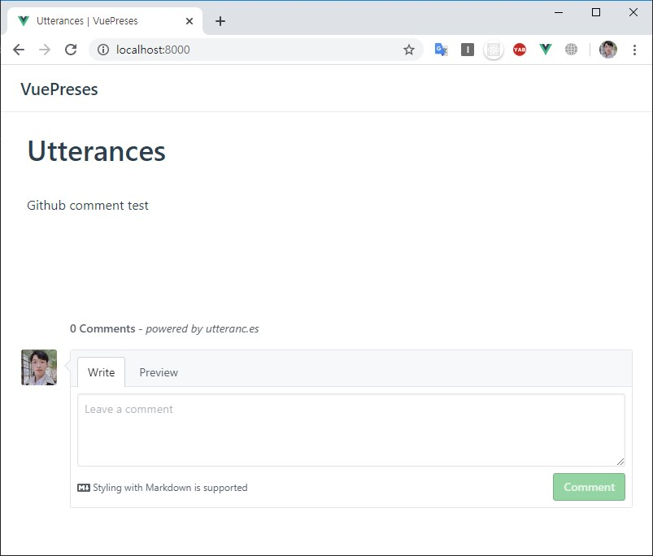

---

title: Vuepress + Utterances
description: Vuepress에 Utterances(GitHub Issue를 이용한 댓글)를 적용하는 방법에 대해 기술합니다.
sidebarDepth: 2

---

# Vuepress + Utterances

Vuepress에 Utterances(GitHub Issue를 이용한 댓글)를 적용하는 방법에 대해 기술합니다.

## 1. Utterances Install

[Utterances](https://utteranc.es/)는 **GitHub Issue 기반**으로 댓글(Comment)를 작성할 수 있게 해주는 플러그인이다.

기존에 워드프레스로 만든 나의 개인 사이트는 `Disqus`를 이용하여 댓글을 관리하고 있는데, 개인적으로 Disqus보단 Utterances가 더 좋은 것 같다.

Utterances를 사용하는 방법은 매우 간단하다. 사실 공식 사이트에 있는 내용을 그대로 따라하면 된다.

### Repository

먼저 GitHub에 Public Repository를 만들어야 한다. 필자는 [blog-comment](https://github.com/JunilHwang/blog-comment) 라는 이름으로 만들었다.

그리고 해당 Repository에 `Utterances App`을 설치해야한다. [이 링크](https://github.com/apps/utterances)에서 설치하면 된다.

그 다음에 이 `script tag`를 적용할 page에 붙이면 된다.

``` html{3,5,6}
<script
  src="https://utteranc.es/client.js"
  repo="junilhwang/blog-comment" <!-- 댓글(Comment)로 사용할 Repository -->
  <!--
    댓글 등록시 Issue가 등록되는데, 이 때 등록될 Issue의 title 형태
    pathname|title|og:title|url 중 택 1
  -->
  issue-term="pathname"
  theme="github-light" <!-- 적용할 테마 -->
  crossorigin="anonymous"
  async>
</script>
```

**그런데 문제는 Vuepress Post에 직접적으로 script tag를 추가할 수 없다는 것이다**

## 2. VuePress에 적용하기

`global-components`를 이용하면 VuePress에 Utterances를 적용할 수 있다.

일단 `.vuepress/theme/Comment.vue` 파일을 만들고, 다음과 같이 입력하자.

``` html{14,15,16}
<template>
  <div ref="comment"></div>
</template>
<script>
export default {
  mounted() {
    // script tag 생성
    const utterances = document.createElement('script');
    utterances.type = 'text/javascript';
    utterances.async = true;
    utterances.crossorigin = 'anonymous';
    utterances.src = 'https://utteranc.es/client.js';
    
    utterances.setAttribute('issue-term', 'pathname'); // pathname|url|title|og:title 중 택 1
    utterances.setAttribute('theme','github-light'); // theme 설정
    utterances.setAttribute('repo',`junilhwang/blog-comment`); // 사용할 repository

    // script tag 삽입
    this.$refs.comment.appendChild(utterances);
  }
}
</script>
```  

그런데 `global-components`는 **theme에서 사용하는 기능**이기 때문에 theme에 따라 적용 방법이 다르다.


### 현재 Theme에 Extend하여 적용하기

theme를 custom 하지 않았다면, 즉, default theme를 그대로 사용중이라면 default theme를 extend 해서 적용하면 된다. 

먼저 `.vuepress/theme/index.js` 파일을 만들어야 한다.

``` js
// .vuepress/theme/index.js
module.exports = {
  extend: '@vuepress/theme-default',
  globalLayout: '/layouts/GlobalLayout'
}
``` 

그리고 `.vuepress/layouts/GlobalLayout.vue` 에 다음과 같이 입력하면 된다.

``` html
<template>
  <div id="global-layout">
    <component :is="$page.path ? 'Layout' : 'NotFound'" />
    <Comment />
  </div>
</template>
```

여기서 `<Comment />`는 `global-components` 에서 저절로 가져와진다.

그러면 이런식으로 적용된다.



### 직접 만든 Theme에 적용하기

Theme를 직접 만들었다면 `.vuepress/theme/layouts/Layout.vue`에서 원하는 부분에 `<Comment />`를 삽입하면 된다.

필자의 경우엔 다음과 같이 했다.

``` html{5}
<template>
  <div ...>
    <Home v-if="$page.frontmatter.home"/>
    <Page v-else :sidebar-items="sidebarItems" />
    <Comment />
    <Navbar v-if="shouldShowNavbar" @toggle-sidebar="toggleSidebar" />
    <div class="sidebar-mask" @click="toggleSidebar(false)" />
    <Sidebar ... />
    <Footer />
  </div>
</template>
<script>
// 생략
</script>
```

이렇게 말 그대로 **원하는 위치**에 `<Comment />`를 넣어주기만 하면 된다.

### md 파일에 직접 넣기

VuePress에서는 `*.md` 파일에 있는 `VueComponent`를 **html로 변환**하여 출력한다.

그래서 그냥 markdown에 `<Comment />`를 그대로 사용해도 된다.


``` md
# Utterances

github issue를 comment로 사용하기

<Comment />
```

## Reference

- [Utterances 공식문서](https://utteranc.es/)
- [Using Vue in Markdown](https://vuepress.vuejs.org/guide/using-vue.html)
- [Vuepress Theme Write](https://vuepress.vuejs.org/theme/writing-a-theme.html#directory-structure)
- [Vuepress Global Layouts](https://vuepress.vuejs.org/theme/option-api.html#globallayout)
