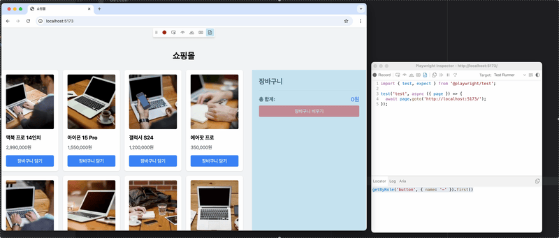

---

title: 요구사항의 변화로 알아가는 클린코드
description: 클린코드를 요구사항을 떼어놓고 클린코드를 이야기할 수 있을까?
sidebarDepth: 2
date: 2025-06-19
tag: javascript, 클린코드
thumbnail: https://github.com/JunilHwang/TIL/blob/master/clean-code/as-requirements-change/diagram1.png

---

# 요구사항의 변화로 알아가는 클린코드

요즘 머릿속에 있는 지식들을 어떻게 매끄럽게 연결할 수 있을까 고민하다가 오랜만에 글을 작성한다.
다만 한 번에 너무 많은 내용을 다루는 것 같아서 걱정이다.
~~글을 쓰는 나 자신에 대한 걱정이랄까… 완성할 수 있겠지?~~

나는 클린코드를 주제로 다룰 때 제일 중요한 게 요구사항이라고 생각한다.
요구사항을 떼어놓고 클린코드를 이야기할 수 있을까?

클린코드의 존재 이유는 유지보수이고, 이를 위해 무수히 많은 “읽기 좋은” 것에 대한 고민을 한다.
반대로, 유지보수를 할 일이 없다면 변경을 고려해서 코드를 작성할 필요가 없다.
가령 프로토타입을 만든다거나, PoC 를 위해 코드를 작성한다거나, 빠르게 만들어 배포하고 버릴 페이지 같은 것들을 만들때는 “읽기 좋은”이 아닌 “빠른 구현”에 더 초점을 낮추는 게 좋다.

어쨌든 클린코드는 유지보수와 한 몸이다.
그렇다면 클린코드를 공부하고 적용할 때 혹은 나의 코드가 좋은 코드인지 판단할 때 유지보수 상황에 대해 시뮬레이션을 해보면 좋다.
더 나아가서, 직접 유지보수 상황을 만들어서 코드를 통해 확인해보면 더 좋다.
그래서 클린코드를 다양한 요구사항의 변화를 토대로 학습하는 과정을 다뤄볼 것이다.

프론트엔드 영역에서 경험할 수 있는 복잡한 요구사항은 쇼핑몰이다.
CMS 와 연결하기도 좋고, 유지보수를 하는 상황도 무척 많이 발생한다.
쇼핑몰의 일부 기능을 정의하고 구현하는 방식으로 진행해보자.

## 초기 요구사항

학습을 위한 과정이기 때문에 최대한 간단하게 정의해보자.

1. 메인 페이지
    - 상품 목록을 조회할 수 있다.
    - 장바구니를 확인하고 관리할 수 있다.
2. 상품 목록
    - 이름, 가격, 상품 이미지 등이 보여진다.
    - 장바구니에 담을 수 있다.
3. 장바구니
    - 수량 변경 (+/- 버튼)
    - 개별 상품 삭제
    - 장바구니 비우기
    - 개별 상품 소계
    - 전체 총합계

## 1단계: Vanilla Javascript 로 구현하기

일단 이 글의 목적은 처음부터 좋은 코드를 작성하는 게 아닌 좋은 코드를 판단하기 위한 기준을 만들어가는 것이다. 그래서 일단 대충 작성한 코드가 필요하고, 코드의 문제를 정의하고 개선하는 과정으로 전개해보자.

### (1) 프로젝트 세팅 (생략해도 무방)

- vite + typescript 기반으로 간단하게 프로젝트를 세팅해보자.
    
    ```bash
    # vanilla ts 기준으로 설치
    $ pnpm create vite simple-clean-code-project --template vue
    
    # 패키지 설치
    $ cd simple-clean-code-project
    $ pnpm install
    
    # eslint, prettier 설치
    ## 글을 작성하는 시점에 eslint는 9버전이 최신버전이다.
    $ pnpm create @eslint/config@latest
    $ pnpm add --save-dev --save-exact prettier
    $ pnpm add -D eslint-config-prettier
    
    # 커밋을 하기 전에 eslint, tsc, prettier 등을 실행하기 위해 husky 설치 
    $ pnpm add --save-dev husky
    $ npm exec husky init
    ```
    
  - eslint 설정
    
      ```tsx
      import js from "@eslint/js";
      import globals from "globals";
      import tseslint from "typescript-eslint";
      import { defineConfig } from "eslint/config";
    
      // eslint config가 추가되어야한다.
      import eslintConfigPrettier from "eslint-config-prettier/flat";
    
      export default defineConfig([
        {
          files: ["**/*.{js,mjs,cjs,ts,mts,cts}"],
          plugins: { js },
          extends: ["js/recommended"],
        },
        {
          files: ["**/*.{js,mjs,cjs,ts,mts,cts}"],
          languageOptions: { globals: globals.browser },
        },
        tseslint.configs.recommended,
      
        // config 배열 맨 뒤에 추가해주면 된다.
        eslintConfigPrettier,
      ]);
      ```
    
- package.json에 npm scripts를 추가하자.
    
    ```tsx
    "scripts": {
      "dev": "vite",
      "tsc": "tsc --noEmit", // type 검사
      "lint": "eslint ./src --fix", // eslint 로 정적 검사
      "prettier": "prettier ./src --write", // prettier 로 포맷팅
      "build": "tsc && vite build",
      "preview": "vite preview",
      "prepare": "husky"
    },
    ```
    
- .husky/pre-commit 에 commit 시점에 실행할 명령어 추가해보자.
    
    ```bash
    pnpm tsc
    pnpm lint
    pnpm prettier
    ```
    
- 초기 폴더 구조
    
    ```bash
    .
    ├── .gitignore
    ├── .husky
    │   └── pre-commit
    ├── .prettierignore
    ├── .prettierrc
    ├── eslint.config.js
    ├── index.html
    ├── package.json
    ├── pnpm-lock.yaml
    ├── public
    │   └── vite.svg
    ├── src
    │   ├── main.ts
    │   └── vite-env.d.ts
    └── tsconfig.json
    ```
    

### (2) 일단 구현하기

#### 1) index.html

처음에 UI 가 html 에 만들어져있다고 가정해보자. css는 cdn tailwind 를 통해 구성되었다.

```html
<!DOCTYPE html>
<html lang="ko">
<head>
  <meta charset="UTF-8">
  <meta name="viewport" content="width=device-width, initial-scale=1.0">
  <title>쇼핑몰</title>
  <script src="https://cdn.tailwindcss.com"></script>
</head>
<body class="bg-gray-100">
<div class="container mx-auto py-20">
  <h1 class="text-3xl font-bold mb-8 text-center">쇼핑몰</h1>

  <div class="flex gap-8">
    <!-- 상품 목록 -->
    <div class="flex-1">
      <div id="product-list" class="grid grid-cols-1 md:grid-cols-2 lg:grid-cols-4 gap-4">
        <div class="bg-white p-4 rounded-lg shadow">
          
          <h3 class="text-lg font-bold mb-2">맥북 프로 14인치</h3>
          <p class="text-gray-600 mb-4">2,990,000원</p>
          <button class="w-full bg-blue-500 text-white py-2 px-4 rounded hover:bg-blue-600 add-to-cart-btn"
                  data-product-id="1">
            장바구니 담기
          </button>
        </div>
        <!-- ... 대략 10개의 상품이 존재 ... -->
        <div class="bg-white p-4 rounded-lg shadow">
          
          <h3 class="text-lg font-bold mb-2">스피커</h3>
          <p class="text-gray-600 mb-4">250,000원</p>
          <button class="w-full bg-blue-500 text-white py-2 px-4 rounded hover:bg-blue-600 add-to-cart-btn"
                  data-product-id="10">
            장바구니 담기
          </button>
        </div>
      </div>
    </div>

    <!-- 장바구니 -->
    <div class="bg-white p-6 rounded-lg shadow w-[400px]">
      <h2 class="text-2xl font-bold mb-4">장바구니</h2>
      <div id="cart-items">
        <!-- 장바구니 아이템들이 여기에 동적으로 추가됨 -->
      </div>
      <div class="mt-4 pt-4 border-t">
        <div class="flex justify-between items-center mb-2">
          <span class="text-lg font-bold">총 합계:</span>
          <span id="total-price" class="text-xl font-bold text-blue-600">0원</span>
        </div>
        <button id="clear-cart" class="w-full bg-red-500 text-white py-2 px-4 rounded hover:bg-red-600">
          장바구니 비우기
        </button>
      </div>
    </div>
  </div>
</div>

<script type="module" src="/src/main.ts"></script>
</body>
</html>
```

#### 2) main.ts

```tsx
// 장바구니의 가격을 업데이트 하는 함수
function updateTotalPrice() {
  let total = 0;
  const cartItems = document.getElementById('cart-items');
  const cartItemElements = cartItems?.querySelectorAll('.cart-item');

  if (cartItemElements) {
    for (const element of cartItemElements) {
      const subtotalText = element.querySelector('.subtotal')?.textContent;
      const subtotal = parseInt(subtotalText?.replace(/\D/g, '') ?? '0');
      total += subtotal;
    }
  }

  const totalPriceEl = document.getElementById('total-price');
  if (totalPriceEl) {
    totalPriceEl.textContent = total.toLocaleString() + '원';
  }
}

function main() {
  const addToCartBtns = document.querySelectorAll('.add-to-cart-btn');

  for (const element of addToCartBtns) {
    element.addEventListener('click', function (e) {
      const target = e.target as HTMLButtonElement;
      const productId = target.getAttribute('data-product-id');
      const productEl = target.closest('.bg-white');
      const productName = productEl?.querySelector('h3')?.textContent;
      const productPriceText = productEl?.querySelector('p')?.textContent;
      const productPrice = parseInt(
        productPriceText?.replace(/\D/g, '') ?? '0'
      );
      const productImg = productEl?.querySelector('img')?.getAttribute('src');

      // 장바구니에서 같은 상품 찾기
      const cartItems = document.getElementById('cart-items');
      let existingItem = null;
      const cartItemElements = cartItems?.querySelectorAll('.cart-item');
      if (cartItemElements) {
        for (const element of cartItemElements) {
          const itemEl = element;
          if (itemEl.getAttribute('data-product-id') === productId) {
            existingItem = itemEl;
            break;
          }
        }
      }

      if (existingItem) {
        // 기존 아이템 수량 증가
        const quantityEl = existingItem.querySelector(
          '.quantity'
        ) as HTMLSpanElement;
        let currentQuantity = parseInt(quantityEl.textContent ?? '0');
        currentQuantity++;
        quantityEl.textContent = currentQuantity.toString();

        // 소계 업데이트
        const subtotalEl = existingItem.querySelector(
          '.subtotal'
        ) as HTMLSpanElement;
        const newSubtotal = currentQuantity * productPrice;
        console.log('newSubtotal', newSubtotal);
        subtotalEl.textContent = newSubtotal.toLocaleString() + '원';
      } else {
        // 새 아이템 추가
        const cartItemHTML = `
      <div class="cart-item flex items-center gap-3 p-3 border-t" data-product-id="${productId}">
        
        <div class="flex-1">
          <h4 class="font-bold text-sm">${productName}</h4>
          <p class="text-gray-600 text-sm">${productPrice.toLocaleString()}원</p>
          <div class="flex items-center gap-2 mt-2">
            <button class="decrease-btn bg-gray-300 text-gray-700 w-6 h-6 rounded text-sm">-</button>
            <span class="quantity">1</span>
            <button class="increase-btn bg-gray-300 text-gray-700 w-6 h-6 rounded text-sm">+</button>
            <button class="remove-btn bg-red-500 text-white px-2 py-1 rounded text-xs ml-2">삭제</button>
          </div>
        </div>
        <div class="text-right">
          <span class="subtotal font-bold">${productPrice.toLocaleString()}원</span>
        </div>
      </div>
    `;
        cartItems?.insertAdjacentHTML('beforeend', cartItemHTML);
      }

      updateTotalPrice();
    });
  }

  // 장바구니 비우기 버튼
  document.getElementById('clear-cart')?.addEventListener('click', () => {
    const cartItems = document.getElementById('cart-items');
    if (cartItems) {
      cartItems.innerHTML = '';
    }
    updateTotalPrice();
  });

  // 장바구니 아이템 이벤트 위임
  document.getElementById('cart-items')?.addEventListener('click', (e) => {
    const target = e.target as HTMLElement;
    const cartItem = target.closest('.cart-item');
    
    // 수량 증가 버튼 클릭시
    if (target.classList.contains('increase-btn')) {
      const quantityEl = cartItem?.querySelector(
        '.quantity'
      ) as HTMLSpanElement;
      let currentQuantity = parseInt(quantityEl.textContent ?? '0');
      currentQuantity++;
      quantityEl.textContent = currentQuantity.toString();

      // 가격 정보 가져오기
      const priceText = cartItem?.querySelector('p')?.textContent;
      const price = parseInt(priceText?.replace(/\D/g, '') ?? '0');

      // 소계 업데이트
      const subtotalEl = cartItem?.querySelector(
        '.subtotal'
      ) as HTMLSpanElement;
      const newSubtotal = currentQuantity * price;
      subtotalEl.textContent = newSubtotal.toLocaleString() + '원';

      updateTotalPrice();
    }
    
    // 수량 감소 버튼 클릭시
    if (target.classList.contains('decrease-btn')) {
      const quantityEl = cartItem?.querySelector(
        '.quantity'
      ) as HTMLSpanElement;
      let currentQuantity = parseInt(quantityEl.textContent ?? '0');
      if (currentQuantity > 1) {
        currentQuantity--;
        quantityEl.textContent = currentQuantity.toString();

        // 가격 정보 가져오기
        const priceText = cartItem?.querySelector('p')?.textContent;
        const price = parseInt(priceText?.replace(/\D/g, '') ?? '0');

        // 소계 업데이트
        const subtotalEl = cartItem?.querySelector(
          '.subtotal'
        ) as HTMLSpanElement;
        const newSubtotal = currentQuantity * price;
        subtotalEl.textContent = newSubtotal.toLocaleString() + '원';

        updateTotalPrice();
      }
    }

    // 삭제 버튼 클릭시
    if (target.classList.contains('remove-btn')) {
      cartItem?.remove();
      updateTotalPrice();
    }
  });
}

main();
```

### (3) 1단계 데모 

- 링크: [https://junilhwang.github.io/simple-clean-code-project/step1.html](https://junilhwang.github.io/simple-clean-code-project/step1.html)
- 전체코드: [https://github.com/JunilHwang/simple-clean-code-project/tree/main/src/step1](https://github.com/JunilHwang/simple-clean-code-project/tree/main/src/step1)

<div class="iframe-container">
  <iframe src="https://junilhwang.github.io/simple-clean-code-project/step1.html"></iframe>
</div>

### (4) 새로운 요구사항을 토대로 문제 분석하기

현재 요구사항은 굉장히 단순하다. 여기에 아래의 요구사항이 추가된다고 가정해보자.

::: tip 📝 새로운 요구사항

1. 상품목록 UI 변화
    - 상품 검색 가능
    - 상품 이름과 가격으로 정렬 가능
2. 상품에 새로운 속성 추가
    - 재고가 추가되고, 남은 재고만큼만 장바구니에 추가 가능
    - 재고가 0일 때 품절 상태가 되고 이를 UI에 반영
3. UI 기능 추가
    - 상품에서 다중 선택 후 장바구니 추가 가능

:::

각각의 요구사항을 반영한다고 했을 때 어떤 어려움이 있는지 분석해보자.

#### 1) 상품목록 UI 변화

- **상품 검색 기능**
    
    ```tsx
    // ❌ 현재 문제: 상품 데이터가 HTML에 분산되어 있음
    const productName = productEl?.querySelector('h3')?.textContent;
    const productPrice = parseInt(productPriceText?.replace(/\\D/g, '') ?? '0');
    ```
    
    - 데이터 접근의 어려움: 검색을 위해 매번 DOM을 순회하며 텍스트를 파싱해야 함
    - 성능 문제: 검색할 때마다 모든 DOM 요소를 탐색해야 함
    - 검색 로직의 복잡성: 가격은 문자열에서 숫자를 추출해야 하고, 이름은 DOM에서 가져와야 함

- **상품 정렬 기능**
    
    ```html
    <!-- ❌ 현재: 상품들이 정적 HTML로 고정 -->
    <div id="product-list" class="grid grid-cols-1 md:grid-cols-2 lg:grid-cols-4 gap-4">
      <div class="bg-white p-4 rounded-lg shadow">...</div>
      <div class="bg-white p-4 rounded-lg shadow">...</div>
    </div>
    ```
    
    - DOM 재정렬의 복잡성: 정렬 시 DOM 요소들을 직접 제거했다가 다시 삽입해야 함
    - 정렬 기준 데이터 추출: 매번 DOM에서 이름/가격을 파싱해서 정렬 로직을 수행해야 함
    - 렌더링 상태 관리: 정렬 후 기존 이벤트 리스너들이 제대로 동작하는지 보장하기 어려움

#### 2) 상품에 새로운 속성 추가

- **재고 관리**
    
    ```tsx
    // ❌ 현재: 재고 정보를 저장할 구조가 없음
    element.addEventListener('click', function (e) {
      // 재고 체크 로직이 불가능
      // 상품별 재고 데이터가 어디에도 없음
    });
    ```
    
    - 재고 데이터 저장소 부재: 상품별 재고 정보를 관리할 중앙화된 데이터 구조가 없음
    - 재고 차감 로직의 어려움: 장바구니 추가 시 재고를 체크하고 차감하는 로직을 구현할 방법이 없음
    - 실시간 재고 동기화: 여러 곳에서 같은 상품을 참조할 때 재고 상태 동기화가 어려움
- **품절 상태 UI 반영**
    
    ```html
    <!-- ❌ 현재: 버튼 상태를 동적으로 관리할 구조가 없음 -->
    <button class="w-full bg-blue-500 text-white py-2 px-4 rounded hover:bg-blue-600 add-to-cart-btn">
      장바구니 담기
    </button>
    ```
    
    - 동적 UI 업데이트의 어려움: 재고 변화에 따라 버튼 상태(활성/비활성)와 텍스트를 업데이트하는 구조가 없음
    - UI 상태와 데이터 동기화: 재고 데이터 변경 시 관련된 모든 UI 요소들을 찾아서 업데이트해야 하는 복잡성
    - 조건부 렌더링: 품절 시 다른 스타일이나 메시지를 보여주려면 DOM 조작 코드가 복잡해짐

#### 3) UI 기능 추가

- **상품 다중 선택 기능**
    
    ```tsx
    // ❌ 현재: 개별 상품 선택 상태를 관리할 구조가 없음
    const addToCartBtns = document.querySelectorAll('.add-to-cart-btn');
    for (const element of addToCartBtns) {
      element.addEventListener('click', function (e) {
        // 단일 상품만 처리 가능
      });
    }
    ```
    
    - 선택 상태 추적의 어려움: 체크박스 UI를 추가하더라도 어떤 상품들이 선택되었는지 추적할 중앙화된 방법이 없음
    - 일괄 처리 로직의 복잡성: 선택된 여러 상품을 한 번에 장바구니에 추가할 때 재고 체크와 UI 업데이트를 동기화하기 어려움
    - UI 상태 관리: 전체선택/해제 기능 구현 시 모든 체크박스 상태를 개별적으로 관리해야 함
- **장바구니 다중 선택 삭제**
    
    ```tsx
    // ❌ 현재: 장바구니 아이템들이 개별 DOM 요소로만 관리됨
    document.getElementById('cart-items')?.addEventListener('click', (e) => {
      if (target.classList.contains('remove-btn')) {
        cartItem?.remove(); // 개별 삭제만 가능
      }
    });
    ```
    
    - 다중 선택 상태 관리: 장바구니 아이템들의 선택 상태를 추적하고 관리할 구조가 없음
    - 일괄 삭제 로직: 선택된 여러 아이템을 찾아서 동시에 삭제하고 총합계를 다시 계산하는 로직이 복잡함
    - 전체선택 동기화: 전체선택 체크박스와 개별 아이템 체크박스들 간의 상태 동기화가 어려움

#### 문제 정리하기

앞에서 분석한 문제들을 종합해서 정리해보면 다음과 같다.


1. **데이터와 UI의 강결합**: 모든 데이터가 DOM에 직접 저장되어 있어 데이터 조작이 어렵다.
2. **상태 관리 부재**: 상품 목록, 장바구니, 선택 상태 등을 추적할 중앙화된 구조가 없다. 
3. **이벤트 처리의 한계**: 현재의 이벤트 위임 구조로는 복잡한 상호작용을 처리하기 어려움
4. **렌더링 로직 부재**: 데이터 변경 시 UI를 일관되게 업데이트할 체계적인 방법이 없음

### (4) 어떻게 개선할 수 있을까?

나는 앞에서 언급한 1~4의 문제들이 **명령형 프로그래밍으로 코드로 작성되어 문제가 발생했다**고 생각한다.

::: tip ❗ 명령형 vs 선언형

**명령형 프로그래밍**

- "어떻게(How)" 해야 하는지에 집중
- 단계별로 명령을 나열
- 상태 변경을 직접 관리
- DOM을 직접 조작

**선언형 프로그래밍**

- "무엇을(What)" 원하는지에 집중
- 원하는 결과를 선언
- 상태에 따른 자동 렌더링
- 데이터 중심의 UI
:::

지금 작성된 코드는 "무엇을 보여줄지"가 아니라 "어떻게 업데이트할지"에 초점이 맞춰져있다.

```tsx
// "어떻게(How)" 해야 하는지 단계별로 기술
const quantityEl = existingItem.querySelector('.quantity') as HTMLSpanElement;
let currentQuantity = parseInt(quantityEl.textContent ?? '0');

// 1단계: 수량 증가
currentQuantity++;

// 2단계: DOM 업데이트
quantityEl.textContent = currentQuantity.toString();
const subtotalEl = existingItem.querySelector('.subtotal') as HTMLSpanElement;

// 3단계: 소계 계산
const newSubtotal = currentQuantity * productPrice;

// 4단계: 소계 업데이트
subtotalEl.textContent = newSubtotal.toLocaleString() + '원';

// 5단계: 총계 업데이트
updateTotalPrice();                                   
```

앞에서 정의한 새로운 요구사항을 추가한다고 가정해보면 이런 모습일 것이다.

```tsx
// 검색/정렬 기능 >  이런 복잡한 단계가 필요
function sortProducts(sortBy: 'name' | 'price') {
  // 1. 모든 DOM 요소에서 데이터 추출
  // 2. 추출한 데이터로 정렬 로직 수행  
  // 3. DOM 요소들을 제거
  // 4. 정렬된 순서로 DOM 요소들을 다시 생성
  // 5. 이벤트 리스너 다시 연결
}

// 재고관리 > 재고 변경 시 모든 UI를 수동으로 찾아서 업데이트
function updateStock(productId: string, newStock: number) {
  // 1. 상품 목록에서 해당 상품 버튼 찾기
  // 2. 버튼 상태 변경 (활성/비활성)
  // 3. 장바구니에서 해당 상품 찾기
  // 4. 수량 조절 버튼 상태 변경
  // 5. 품절 메시지 표시/숨김
}
```

그렇다면 선언형 프로그래밍은 어떤 모습일까? 아마 이 글을 읽는 대부분의 사람들은 React 혹은 Vue를 사용한 경험이 있을 것이다. (아마도!?)

**Vue나 React의 경우 라이브러리 혹은 프레임워크 계층에서 코드를 자연스럽게 “선언형” 기반으로 작성하도록 유도하고 있다.**

```tsx
// 선언형은 "무엇을(What)" 보여줄지만 정의한다.
function ProductList({ products, onAddToCart }) {
  // 필터링 된 값을 토대로
  const filteredProducts = products
    .filter(p => p.name.includes(searchQuery))
    .sort((a, b) => sortBy === 'name' ? a.name.localeCompare(b.name) : a.price - b.price);
    
  // 상품 목록을 보여준다.   
  return (
    <>
      {filteredProducts.map(product => (
		    <ProductCard 
		      {...product} 
		      disabled={product.stock === 0} {/*사실 컴포넌트 내부에서 계산해줘도 됨*/}
		      // 이벤트가 발생하면 상태가 변경되어 컴포넌트 렌더링시에 ui에 반영된다.
		      onAddToCart={onAddToCart}
		    />
      ))}
    </>
  )
}
```

위의 코드는 UI를 명령을 토대로 만들어 가는 것이 아닌, **UI의 모습을 선언**하고 데이터가 변경되면 자연스럽게 UI에 반영되는 구조다.

1. 상태를 정의하고, 상태를 변경하는 함수가 있어야 한다.
2. 상태를 반영한 모습의 UI를 선언한다.
3. UI에서 발생하는 이벤트를 통해 함수를 실행한다.
4. 함수가 실행되면 데이터가 변경되고, 데이터가 변경되면 UI에 반영된다.
5. 결과적으로 UI와 상태를 깔끔하게 분리할 수 있다.

::: tip 🤔 프론트엔드 개발자가 접할 수 있는 선언형 프로그래밍으로 작성하도록 유도하는 코드들은 어떤게 있을까?

1. CSS
    
    ```css
    /* ✅ 선언형: "무엇을" 보여줄지 선언 */
    .product-card {
      display: flex;
      justify-content: space-between;
      background: white;
      border-radius: 8px;
      padding: 16px;
    }
    
    .product-card.sold-out {
      opacity: 0.5;
      background: #f5f5f5;
    }
    
    .product-card.sold-out button {
      background: #ccc;
      cursor: not-allowed;
    }
    ```
    
    ```tsx
    // ❌ 명령형이라면 이렇게 했을 것
    function updateProductCardStyle(element, isSoldOut) {
      element.style.display = 'flex';
      element.style.justifyContent = 'space-between';
      element.style.background = 'white';
      element.style.borderRadius = '8px';
      element.style.padding = '16px';
    
      if (isSoldOut) {
        element.style.opacity = '0.5';
        element.style.background = '#f5f5f5';
        const button = element.querySelector('button');
        button.style.background = '#ccc';
        button.style.cursor = 'not-allowed';
      }
    }
    ```
    
2. Array 메서드 (함수형 프로그래밍)
    
    ```tsx
    // ✅ 선언형: "무엇을" 원하는지 선언
    const productData = [
      { id: 1, name: '맥북', price: 2990000, stock: 5 },
      { id: 2, name: '아이폰', price: 1550000, stock: 0 },
      { id: 3, name: '갤럭시', price: 1200000, stock: 3 }
    ];
    
    const availableProducts = productData
      .filter(product => product.stock > 0)
      .map(product => ({
        ...product,
        displayPrice: product.price.toLocaleString() + '원',
        status: product.stock > 0 ? 'available' : 'sold-out'
      }))
      .sort((a, b) => a.price - b.price);
    ```
    
    ```tsx
    // ❌ 명령형이라면 이렇게 했을 것
    function getAvailableProducts(productData) {
      const result = [];
    
      // 1단계: 재고가 있는 상품만 필터링
      for (let i = 0; i < productData.length; i++) {
        if (productData[i].stock > 0) {
          // 2단계: 데이터 변환
          const product = {
            id: productData[i].id,
            name: productData[i].name,
            price: productData[i].price,
            stock: productData[i].stock,
            displayPrice: productData[i].price.toLocaleString() + '원',
            status: productData[i].stock > 0 ? 'available' : 'sold-out'
          };
          result.push(product);
        }
      }
    
      // 3단계: 가격순 정렬
      for (let i = 0; i < result.length - 1; i++) {
        for (let j = 0; j < result.length - i - 1; j++) {
          if (result[j].price > result[j + 1].price) {
            const temp = result[j];
            result[j] = result[j + 1];
            result[j + 1] = temp;
          }
        }
      }
    
      return result;
    }
    ```
    
3. HTML (선언적 구조)
    
    ```html
    <!-- ✅ 선언형: 구조와 의미를 선언 -->
    <form class="search-form">
      <input type="search" placeholder="상품 검색..." class="search-input">
      <select class="sort-select">
        <option value="name">이름순</option>
        <option value="price">가격순</option>
      </select>
    </form>
    
    <div class="product-grid">
      <!-- 상품들이 표시될 곳 -->
    </div>
    ```
    
    ```tsx
    // ❌ 명령형이라면 이렇게 했을 것
    function createSearchForm() {
      const form = document.createElement('form');
      form.className = 'search-form';
    
      const input = document.createElement('input');
      input.type = 'search';
      input.placeholder = '상품 검색...';
      input.className = 'search-input';
    
      const select = document.createElement('select');
      select.className = 'sort-select';
    
      const option1 = document.createElement('option');
      option1.value = 'name';
      option1.textContent = '이름순';
    
      const option2 = document.createElement('option');
      option2.value = 'price';
      option2.textContent = '가격순';
    
      select.appendChild(option1);
      select.appendChild(option2);
      form.appendChild(input);
      form.appendChild(select);
    
      return form;
    }
    ```
    
4. 📝 SQL (데이터 조회)
    
    ```sql
    -- ✅ 선언형: "무엇을" 원하는지 선언
    SELECT
      name,
      price,
      CASE
        WHEN stock > 0 THEN 'available'
        ELSE 'sold-out'
      END as status
    FROM products
    WHERE stock > 0
    ORDER BY price ASC;
    ```
    
    ```tsx
    // ❌ 명령형이라면 이렇게 했을 것
    function getAvailableProductsData(products) {
      const result = [];
    
      // 1. 모든 상품을 순회
      for (const product of products) {
        // 2. 재고가 있는지 확인
        if (product.stock > 0) {
          // 3. 상태 결정
          let status;
          if (product.stock > 0) {
            status = 'available';
          } else {
            status = 'sold-out';
          }
    
          // 4. 결과에 추가
          result.push({
            name: product.name,
            price: product.price,
            status: status
          });
        }
      }
    
      // 5. 가격순으로 정렬
      result.sort((a, b) => a.price - b.price);
      return result;
    }
    ```
    
:::

그리고 프론트엔드에서 어플리케이션을 선언형 방식으로 만들어 가는 대표적인 방법은 **MVC 패턴 혹은 MVVM 패턴**을 적용하는 것이다. 

- MVC(Model + View + Controller)
    - 개념
        - **Model**: 어플리케이션의 핵심이 되는 데이터와 데이터를 조작하는 함수
        - **View**: HTML
        - **Controller**: HTML과 Model을 연결해주는 것. 가령, 이벤트 같은게 될 수 있음
    - Controller를 무엇이라고 정의할 수 있을지는 생각하기 나름이기 때문에 헷갈리는 경우가 무척 많다. 그래서 나는 Backend와 비교해보고자 한다. 
        - backend의 MVC
            ```tsx
            // backend에서 사용하는 express.js의 router이다.
            // 사용자의 요청이 오면 이를 핸들링(controller)하고
            // 다양한 비즈니스 로직을 수행(model) 후 응답(view) 한다.
            app.get('/', async (req, res) => {
              const data = await homeService.getData();
              res.json(data)
            })
            ```
        - frontend의 mvc
            ```tsx
            // 어플리케이션에서 사용되는 model이 정의되어있고
            const counter = {
              value: 1,
              increase() {
                this.value += 1;
              }
            }
            
            const counterService = {
              getIncrementValue() {
                counter.increase();
                return counter.value
              }
            }
            
            // 사용자 요청(이벤트 발생)을 통해
            addEvent('click', '#main button.increase', (e) => {
              // model의 값을 가져온 다음
              const newValue = counterService.getIncrementValue();
              
              // view(html)에 model을 반영한다.
              document.querySelector('#count').innerHTML = newValue;
            });
            ```
- MVVM(Model + View + ViewModel): MVC의 Controller 대신 ViewModel 이 유사한 역할을 수행한다.
    - 개념
        - **Model**: 어플리케이션의 상태와 이를 변경하는 함수의 묶음. 가령, 리액트로 따지면 state와 setState 가 될 것이다.
        - **View**: MVC와 똑같이 HTML 이다.
        - **ViewModel**: View의 형상을 하고 있는 데이터 객체이다. R
    - React나 Vue에서는 ViewModel 가상돔이다. jsx를 이용하여 html과 유사한 문법으로 사용한다.
      ```tsx
      // 보통 이렇게 jsx 문법으로 정의해서 사용한다.
      function Counter() {
        const [count, setCount] = useState(1);
        const increment = () => setCount(count + 1));
        return (
          <div>
            <span>{count}</span>
            <button onClick={increment}>증가</button>
          </div>
        )
      }
        
      // 실제로는 이렇게 표현된다.
      function Counter() {
        const [count, setCount] = useState(1);
        const increment = () => setCount(count + 1));
          
        return createElement(
          'div',
          null, 
          createElement('span', null, count),
          createElement('button', { onClick: increment }, "증가")
        )
      }
        
      // createElement를 통해 만들어진 객체는 이런 모습일 것이다.
      {
        type: 'div',
        props: null,
        children: [
          { type: 'span', props: null, children: [count] },
          { type: 'button', props: { onClick: increment }, children: ['증가'] },
        ]
      }
      ```
      즉, ViewModel은 View(HTML)의 형태를 유사하게 본따서 만든 데이터(Model)이다. 그리고 ViewModel을 View로 변환하는 과정이 필요하다.

명령형 프로그래밍에 대한 이야기를 하다가 삼천포를 다녀왔다. 다시 본론으로 돌아오자면, 현재 구현된 내용에서 **관심사(UI, Data, Function)를 분리하고 이를 연결하는 과정이 필요**하다.

리팩토링 과정을 계획해보자.


1. 어플리케이션에서 사용되는 데이터(상태)를 정의하기
2. 상태를 변경하는 함수를 정의하기
3. 상태를 기반으로 UI를 표현하기 (선언형 UI)
4. 상태를 변경하는 함수와 UI의 이벤트를 연결하기

사실, 이렇게 리팩토링 이전에 제일 먼저 해야 하는 것은 **테스트 작성** 이다.
지금은 테스트를 할 수 있는 함수가 마땅치 않기 때문에 playwright + codegen 을 통해 간단하게 e2e 테스트를 추가하여 진행할 수 있다.

## 2단계: 현재 코드 리팩토링

앞에서 이야기한 순서대로 진행해보도록 하자.

### (1) 테스트 작성

[https://playwright.dev/docs/intro](https://playwright.dev/docs/intro)

playwright을 이용하면 간단하게 e2e 테스트를 작성할 수 있다.

- playwright 설치하기
    
    ```bash
    # playwright 설치
    $ pnpm create playwright
    
    # 설치하면 이런 파일과 폴더가 추가됨
    .
    ├── playwright.config.ts
    ├── tests
    │   └── example.spec.ts
    └── tests-examples
        └── demo-todo-app.spec.ts
    
    # tests-examples 제거
    $ rm -r tests-examples
    ```
    
- npm scripts 수정하기
    
    ```json
    "scripts": {
      // e2e 테스트 관련 스크립트를 추가	
      "test:e2e": "playwright test", // headless browser로 실행
      "test:e2e:ui": "playwright test --ui" // browser를 실제로 보면서 실행
    }
    ```
    
- codegen 으로 test 만들기
    
    참고링크: [https://playwright.dev/docs/codegen-intro](https://playwright.dev/docs/codegen-intro)
    
    ```bash
    # 먼저 개발 서버를 실행해야 한다.
    $ pnpm run dev
    
    # playwright codegen 실행
    $ pnpm exec playwright codegen localhost:5173
    ```
    
    
    
- codegen으로 만들어진 결과물
    
    ```tsx
    import { test, expect } from '@playwright/test';
    
    test('쇼핑몰 장바구니 테스트', async ({ page }) => {
      await page.goto('http://localhost:5173/');
      await expect(page.locator('body')).toMatchAriaSnapshot(`
        - img /맥북 프로 \\d+인치/
        - heading /맥북 프로 \\d+인치/ [level=3]
        - paragraph: /\\d+,\\d+,\\d+원/
        - button "장바구니 담기"
        - img /아이폰 \\d+ Pro/
        - heading /아이폰 \\d+ Pro/ [level=3]
        - paragraph: /\\d+,\\d+,\\d+원/
        - button "장바구니 담기"
        - img "갤럭시 S24"
        - heading "갤럭시 S24" [level=3]
        - paragraph: /\\d+,\\d+,\\d+원/
        - button "장바구니 담기"
        - img "에어팟 프로"
        - heading "에어팟 프로" [level=3]
        - paragraph: /\\d+,\\d+원/
        - button "장바구니 담기"
        - img "맥북 에어"
        - heading "맥북 에어" [level=3]
        - paragraph: /\\d+,\\d+,\\d+원/
        - button "장바구니 담기"
        - img "아이패드 프로"
        - heading "아이패드 프로" [level=3]
        - paragraph: /\\d+,\\d+,\\d+원/
        - button "장바구니 담기"
        - img "삼성 모니터"
        - heading "삼성 모니터" [level=3]
        - paragraph: /\\d+,\\d+원/
        - button "장바구니 담기"
        - img "무선 키보드"
        - heading "무선 키보드" [level=3]
        - paragraph: /\\d+,\\d+원/
        - button "장바구니 담기"
        - img "무선 마우스"
        - heading "무선 마우스" [level=3]
        - paragraph: /\\d+,\\d+원/
        - button "장바구니 담기"
        - img "스피커"
        - heading "스피커" [level=3]
        - paragraph: /\\d+,\\d+원/
        - button "장바구니 담기"
        - heading "장바구니" [level=2]
        - text: "총 합계: 0원"
        - button "장바구니 비우기"
        `);
      await page.locator('#product-list div').filter({ hasText: '맥북 프로 14인치 2,990,000원 장바구니 담기' }).getByRole('button').click();
      await page.locator('#product-list div').filter({ hasText: '아이폰 15 Pro 1,550,000원 장바구니 담기' }).getByRole('button').click();
      await page.locator('#product-list div').filter({ hasText: '갤럭시 S24 1,200,000원 장바구니 담기' }).getByRole('button').click();
      await page.locator('#product-list div').filter({ hasText: '에어팟 프로 350,000원 장바구니 담기' }).getByRole('button').click();
      await page.getByRole('button', { name: '+' }).first().click();
      await page.getByRole('button', { name: '+' }).nth(1).click();
      await page.getByRole('button', { name: '+' }).nth(1).click();
      await page.getByRole('button', { name: '+' }).nth(2).click();
      await page.getByRole('button', { name: '+' }).nth(2).click();
      await expect(page.locator('body')).toMatchAriaSnapshot(`
        - heading "장바구니" [level=2]
        - img /맥북 프로 \\d+인치/
        - heading /맥북 프로 \\d+인치/ [level=4]
        - paragraph: /\\d+,\\d+,\\d+원/
        - button "-"
        - text: "2"
        - button "+"
        - button "삭제"
        - text: /\\d+,\\d+,\\d+원/
        - img /아이폰 \\d+ Pro/
        - heading /아이폰 \\d+ Pro/ [level=4]
        - paragraph: /\\d+,\\d+,\\d+원/
        - button "-"
        - text: "3"
        - button "+"
        - button "삭제"
        - text: /\\d+,\\d+,\\d+원/
        - img "갤럭시 S24"
        - heading "갤럭시 S24" [level=4]
        - paragraph: /\\d+,\\d+,\\d+원/
        - button "-"
        - text: "3"
        - button "+"
        - button "삭제"
        - text: /\\d+,\\d+,\\d+원/
        - img "에어팟 프로"
        - heading "에어팟 프로" [level=4]
        - paragraph: /\\d+,\\d+원/
        - button "-"
        - text: "1"
        - button "+"
        - button "삭제"
        - text: "/\\\\d+,\\\\d+원 총 합계: \\\\d+,\\\\d+,\\\\d+원/"
        - button "장바구니 비우기"
        `);
      await page.getByRole('button', { name: '-' }).nth(2).click();
      await page.getByRole('button', { name: '삭제' }).nth(1).click();
      await expect(page.locator('body')).toMatchAriaSnapshot(`
        - heading "장바구니" [level=2]
        - img /맥북 프로 \\d+인치/
        - heading /맥북 프로 \\d+인치/ [level=4]
        - paragraph: /\\d+,\\d+,\\d+원/
        - button "-"
        - text: "2"
        - button "+"
        - button "삭제"
        - text: /\\d+,\\d+,\\d+원/
        - img "갤럭시 S24"
        - heading "갤럭시 S24" [level=4]
        - paragraph: /\\d+,\\d+,\\d+원/
        - button "-"
        - text: "2"
        - button "+"
        - button "삭제"
        - text: /\\d+,\\d+,\\d+원/
        - img "에어팟 프로"
        - heading "에어팟 프로" [level=4]
        - paragraph: /\\d+,\\d+원/
        - button "-"
        - text: "1"
        - button "+"
        - button "삭제"
        - text: "/\\\\d+,\\\\d+원 총 합계: \\\\d+,\\\\d+,\\\\d+원/"
        - button "장바구니 비우기"
        `);
      await page.getByRole('button', { name: '장바구니 비우기' }).click();
      await expect(page.locator('body')).toMatchAriaSnapshot(`
        - heading "장바구니" [level=2]
        - text: "총 합계: 0원"
        - button "장바구니 비우기"
        `);
    });
    ```
    
- playwright.config.ts 수정
    
    ```tsx
    import { defineConfig, devices } from '@playwright/test';
    
    export default defineConfig({
      testDir: './tests',
      fullyParallel: true,
      forbidOnly: !!process.env.CI,
      retries: process.env.CI ? 2 : 0,
      workers: process.env.CI ? 1 : undefined,
      reporter: 'html',
      use: {
        trace: 'on-first-retry',
      },
      
      // 처음에는 chromium, webkit, firefox 등의 브라우저에 대해 동시에 테스트 하도록 설정 됨
      // 지금 테스트를 정교하게 할 필요는 없어서 일단 chromium 만 남기고 제거
      projects: [
        {
          name: 'chromium',
          use: { ...devices['Desktop Chrome'] },
        },
      ],
      
      // 테스트를 실행하기 전에 미리 개발서버를 실행하기 위해 필요함
      webServer: {
        command: 'pnpm run dev',
        url: 'http://localhost:5173',
        reuseExistingServer: !process.env.CI,
      },
    });
    
    ```
    
- 테스트를 실행해서 확인해보기
    
    ```bash
    $ pnpm run test:e2e:ui
    ```
    
    
    
    - 테스트가 통과되는걸 확인했다.
    - 각각의 단계에 대해 playwright이 스냅샷을 찍어준다.
    - 마우스로 각 단계를 클릭하거나 키보드 방향키로 움직이면서 스냅샷을 확인해볼 수 있다.
    

설치부터 테스트 작성 및 실행까지 빠르면 5분 이내로 끝낼 수 있다.

### (2) 상태와 상태를 변경하는 함수 정의하기

기존 main은 step1/main.ts 로 이름을 변경하고, step2/main.ts 를 새로 추가하여 진행하자.

```bash
./src
├── ./step1/main.ts  # 기존 코드는 step1 폴더로 분리해서 유지하자.
└── ./step2/main.ts  # 리팩토링을 위한 코드는 step2 폴더에 새로 만들자.
```

그리고 기존의 index.html을 step1.html으로 변경하고, step2.html을 새로 만들자.
```bash
./
├── ./step1.html
└── ./step2.html
```

`step2.html`은 다음과 같이 작성한다.
```html
<!DOCTYPE html>
<html lang="ko">
<head>
  <meta charset="UTF-8">
  <meta name="viewport" content="width=device-width, initial-scale=1.0">
  <title>쇼핑몰</title>
  <script src="https://cdn.tailwindcss.com"></script>
</head>
<body class="bg-gray-100">
  <div id="root"></div>
  <script type="module" src="/src/step2/main.ts"></script>
</body>
</html>
```

#### 1) 타입 및 상태 정의

현재 어플리케이션에 필요한 상태는 상품목록(products)와 장바구니(carts) 등이 있다. 먼저 이에 대한 타입과 상태를 추가하자.

```tsx
interface Product {
  id: string;
  name: string;
  price: number;
  image: string;
}

interface Cart {
  productId: string;
  quantity: number;
}

// 초기 상품 데이터
const INITIAL_PRODUCTS: Product[] = [
  { id: '1', name: '맥북 프로 14인치', price: 2_990_000, image: 'https://picsum.photos/id/1/200.webp' },
  { id: '2', name: '아이폰 15 Pro', price: 1_550_000, image: 'https://picsum.photos/id/2/200.webp' },
  { id: '3', name: '갤럭시 S24', price: 1_200_000, image: 'https://picsum.photos/id/3/200.webp' },
  { id: '4', name: '에어팟 프로', price: 350_000, image: 'https://picsum.photos/id/4/200.webp' },
  { id: '5', name: '맥북 에어', price: 1_590_000, image: 'https://picsum.photos/id/5/200.webp' },
  { id: '6', name: '아이패드 프로', price: 1_490_000, image: 'https://picsum.photos/id/6/200.webp' },
  { id: '7', name: '삼성 모니터', price: 450_000, image: 'https://picsum.photos/id/7/200.webp' },
  { id: '8', name: '무선 키보드', price: 120_000, image: 'https://picsum.photos/id/8/200.webp' },
  { id: '9', name: '무선 마우스', price: 80_000, image: 'https://picsum.photos/id/9/200.webp' },
  { id: '10', name: '스피커', price: 250_000, image: 'https://picsum.photos/id/10/200.webp' },
];

const carts: Cart[] = [];
```

#### 2) 상태를 변경하는 함수 정의

현재 요구사항은 장바구니에 대한 변화가 주된 내용이다.

- 장바구니에 추가하기
- 장바구니에서 삭제하기
- 장바구니의 수량 변경하기
- 장바구니 비우기

이렇게 네 가지를 함수로 구현하면 된다.

```tsx
const carts = {
  value: [] as CartItem[],
  
  // 장바구니에 추가하기
  add(productId: string) {
    const cartItems = this.value;
    const existingItem = cartItems.find((item) => item.productId === productId);

    this.value = existingItem
      ? cartItems.map((item) =>
          item.productId === productId
            ? { ...item, quantity: item.quantity + 1 }
            : item
        )
      : [...cartItems, { productId, quantity: 1 }];
  },
  
  // 장바구니의 수량 변경하기
  update(productId: string, quantity: number) {
    const target = this.value.find((item) => item.productId === productId);
    if (target) {
      target.quantity = Math.min(quantity, 1)
    }
  },
  
  // 장바구니에서 삭제하기
  remove(productId: string) {
    this.value = this.value.filter((item) => item.productId !== productId);
  },
  
  // 장바구니 삭제하기
  clear() {
    this.value = [];
  },
};
```

여기서 잠시 고민을 할 필요가 있다.
지금은 carts가 배열로 표현 되는데, 주로 쓰이는 로직을 보면 productId를 기반으로 변경이 발생하는 것을 알 수 있다.
그렇다면 **productId에 대한 Map 형태로 상태를 구성**해주면 더 편리하게 함수를 구성할 수 있지 않을까?

```tsx
const carts = {
  // ProductId에 대한 Map으로 정의한다.
  value: {} as Record<Product['id'], CartItem>,
  
  // 배열 구조로 쓰임이 필요할 땐 `carts.items` 를 통해 호출할 수 있도록 getter를 만든다.
  get items() {
    return Object.values(this.value);
  },
  
  // 값을 변경하는 메소드들이 무척 간략해졌다.
  add(productId: string) {
    const quantity = this.value[productId]?.quantity ?? 0
    this.value[productId] = { productId, quantity: quantity + 1 };
  },
  update(productId: string, quantity: number) {
    this.value[productId].quantity = Math.max(quantity, 1);
  },
  remove(productId: string) {
    delete this.value[productId];
  },
  clear() {
    this.value = {};
  },
};
```

이 때 `this` 라는 키워드가 노출되는게 그닥 보기 좋진 않다. 이럴 때 취할 수 있는 방법이 하나 있다.
리액트의 커스텀훅을 만드는 것 처럼, **함수로 내부 값을 추상화해서 관리**하는 것이다.

```tsx
const createCarts = (initValue: Record<Product['id'], CartItem> = {}) => {
  let value = initValue;

  return {
    // value를 값으로 반환하는 경우, 참조가 달라질 수 있다.
    // 그래서 getter를 통해 정의하여 함수 내부의 value를 계속 참조하도록 해야 한다.
    // getter로 반환할 경우, carts.value = 1234 처럼 밖에서 할당하는게 불가능해서 안전하다.
    // 단, carts.value[1] = 1; 처럼 value 객체의 값은 수정이 가능해서 Object.freeze 로
    // 객체내부의 변화를 방지할 수 있다.
    get value() {
      return value;
    },
    get items(): CartItem[] {
      // this.value를 사용하면 getter로 정의된 value를 사용하게 된다. 즉, 변경이 불가능한 value를 사용하게 된다.
      return Object.values(this.value);
    },
    add(productId: string) {
      const quantity = value[productId]?.quantity ?? 0
      value[productId] = { productId, quantity: quantity + 1 };
    },
    update(productId: string, quantity: number) {
      value[productId] = { productId, quantity: Math.max(quantity, 1) };
    },
    remove(productId: string) {
      delete value[productId];
    },
    clear() {
      value = {};
    },
  }
}
```

products와 carts를 합쳐서 store 라고 정의해보자. products에 몇 가지 함수도 추가해서 사용하면 좋을 것 같다. 

```tsx
const createProducts = (initValue = INITIAL_PRODUCTS) => {
  // product도 valueMap 형태로 관리하면 편할 것 같다.
  const value = initValue.reduce((acc, product) => ({
    ...acc,
    [product.id]: product
  }), {});
  
  return {
    get value() { return value },
    get items() { return Object.values(this.value); },
    
    // productId를 통해 가져오는 함수를 하나 만들었다.
    getProduct: (id) => value[id],
  }
}

const store = {
  // carts와 인터페이스를 동일하게 유지하기 위해 value를 통해 참조하도록 했다.
  products: createProducts(),
  carts: createCarts(),

  // products와 carts를 조합하여 사용하는 경우도 있을 것이다.
  // 이럴 때는 store를 통해 참조하도록 만들면 좋다.
  get totalCartPrice() {
    return this.carts.items.reduce((total, item) => {
      const product = this.products.get(item.productId);
      return total + (product ? product.price * item.quantity : 0);
    }, 0);
  },

  // products와 carts를 합친 데이터도 만들어서 관리할 수 있다.
  get cartsWithProduct() {
    return this.carts.items.map(({ productId, quantity }) => {
      const product = this.products.value[productId];
      return {
        ...product,
        quantity,
        subtotal: product.price * quantity,
      };
    });
  }
};
```

이렇게 코드를 작성하면 모든 비즈니스 로직이 store에 응집된다.
지금처럼 객체의 덩어리로 만들어서 관리할 수도 있고, 혹은 함수 뭉치의 조합으로 사용할 수도 있다.
개인적으로 지금과 같은 모습을 선호한다.

**중요한건 상태와 상태를 변화시키는 함수가 응집되어 있어야 관리하기가 수월하다는 점이다.**

이런걸 reducer 같은걸로 정의할 수도 있을 것이다.

### (3) 상태를 기반으로 UI를 표현하기

#### 1) 템플릿 

먼저 index.html에 있는 html 태그를 템플릿으로 만들어서 관리하는 방식을 상상하면 좋다.

```html
<!-- 상품 아이템 템플릿 -->
<div class="bg-white p-4 rounded-lg shadow">
  
  <h3 class="text-lg font-bold mb-2">맥북 프로 14인치</h3>
  <p class="text-gray-600 mb-4">2,990,000원</p>
  <button class="w-full bg-blue-500 text-white py-2 px-4 rounded hover:bg-blue-600 add-to-cart-btn"
          data-product-id="1">
    장바구니 담기
  </button>
</div>

<!-- 상품 목록 템플릿 -->
<div id="product-list" class="grid grid-cols-1 md:grid-cols-2 lg:grid-cols-4 gap-4">
  <!-- 상품 아이템들이 여기 들어가야함 -->
</div>
```

이런 방식으로 html 템플릿을 가져다 사용할 수 있다. 한 번 전체 UI를 template literal로 정의해보자.

```tsx
function ProductItem({ image, name, price, id }: Product) {
  return `
    <div class="bg-white p-4 rounded-lg shadow">
      
      <h3 class="text-lg font-bold mb-2">${name}</h3>
      <p class="text-gray-600 mb-4">${price.toLocaleString()}원</p>
      <button class="w-full bg-blue-500 text-white py-2 px-4 rounded hover:bg-blue-600 add-to-cart-btn" data-product-id="${id}">
        장바구니 담기
      </button>
    </div>
  `;
}

function CartItem({ id, quantity, image, name, price }: typeof store.cartsWithProduct[number]) {
  return `
    <div class="cart-item flex items-center gap-3 p-3 border-t" data-product-id="${id}">
      
      <div class="flex-1">
        <h4 class="font-bold text-sm">${name}</h4>
        <p class="text-gray-600 text-sm">${price.toLocaleString()}원</p>
        <div class="flex items-center gap-2 mt-2">
          <button class="decrease-btn bg-gray-300 text-gray-700 w-6 h-6 rounded text-sm">-</button>
          <span class="quantity">${quantity}</span>
          <button class="increase-btn bg-gray-300 text-gray-700 w-6 h-6 rounded text-sm">+</button>
          <button class="remove-btn bg-red-500 text-white px-2 py-1 rounded text-xs ml-2">삭제</button>
        </div>
      </div>
      <div class="text-right">
        <span class="subtotal font-bold">${price.toLocaleString()}원</span>
      </div>
    </div>
  `;
}

function CartSummary({ totalPrice }: { totalPrice: number }) {
  return `
    <div class="mt-4 pt-4 border-t">
      <div class="flex justify-between items-center mb-2">
        <span class="text-lg font-bold">총 합계:</span>
        <span id="total-price" class="text-xl font-bold text-blue-600">
	        ${totalPrice.toLocaleString()}원
        </span>
      </div>
      <button id="clear-cart" class="w-full bg-red-500 text-white py-2 px-4 rounded hover:bg-red-600">
        장바구니 비우기
      </button>
    </div>
  `
}

function App() {
  return `
	  <div class="container mx-auto py-20">
		  <h1 class="text-3xl font-bold mb-8 text-center">쇼핑몰</h1>
		
		  <div class="flex gap-8">
		    <div class="flex-1">
		      <div id="product-list" class="grid grid-cols-1 md:grid-cols-2 lg:grid-cols-4 gap-4">
		        ${store.products.items.map(ProductItem).join('')}
		      </div>
		    </div>
		
		    <!-- 장바구니 -->
		    <div class="bg-white p-6 rounded-lg shadow w-[400px]">
		      <h2 class="text-2xl font-bold mb-4">장바구니</h2>
		      <div id="cart-items">
		        ${store.cartsWithProduct.map(CartItem).join('')}
		      </div>
		      ${CartSummary({ totalPrice: store.totalCartPrice })}
		    </div>
		  </div>
		</div>
  `
}
```

마지막으로, App을 이용해 어플리케이션에 렌더링 하는 함수가 필요하다.

```tsx
function render() {
  const $root = document.getElementById('root');
  if ($root) {
    $root.innerHTML = App();
  }
}

render();
```

### (4) 함수와 UI를 이벤트로 연결하기

store(model)과 ui(view)를 선언했으니, 이제 store와 ui를 연결해주는 이벤트(controller)를 선언하고 관리해야 한다.

어떤 상호작용이 필요한지 고민해보자.

1. 상품목록에서 “장바구니 담기” 버튼을 클릭할 때
2. 장바구니에서 +, - 버튼을 클릭할 때
3. 장바구니에서 ‘삭제” 버튼을 클리할 때
4. 장바구니에서 “장바구니 비우기” 버튼을 클릭할 때

이를 토대로 이벤트를 선언해보자.

먼저 이벤트와 관련된 유틸 함수를 만들어야 한다.

```tsx
// 이벤트를 추가해주는 유틸 함수를 하나 선언하자. 이게 일종의 controller 역할을 수행한다.
// 이벤트를 직접 등록하는 것이 아닌 이벤트 위임 방식으로 등록하도록 만든다.
// 직관적인 컨트롤러의 역할을 하기 위함이다.
function addEvent(eventType, selector, callback, parent = document) {
  parent.addEventListener(eventType, event => {
    if (event.target.closest(selector)) {
      callback(event)
    }
  })
}

// 이벤트 위임 방식으로 등록할 경우, 중복 등록이 될 수 있기 때문에
// setupEvents 함수를 이용하여 내부에서만 최초에 한 번 등록하는 장치를 만들어준다.
const setupEvents = (() => {
  let initialized = false;
  return (setup: () => void) => {
    if (!initialized) {
      setup();
      initialized = true;
    }
  }
})();

```

이제 렌더링 시점에 이벤트를 등록해보자.

```tsx
function render() {
  const $root = document.getElementById('root');
  if ($root) {
    $root.innerHTML = App();
  }

  setupEvents(() => {
    // 1. 상품목록에서 “장바구니 담기” 버튼을 클릭할 때
    addEvent('click', '.add-to-cart-btn', (event) => {});

    // 2. 장바구니에서 +, - 버튼을 클릭할 때
    addEvent('click', '.increase-btn, .decrease-btn', (event) => {});

    // 3. 장바구니에서 ‘삭제” 버튼을 클리할 때
    addEvent('click', '.remove-btn', (event) => {});

    // 4. 장바구니에서 “장바구니 비우기” 버튼을 클릭할 때
    addEvent('click', '#clear-cart', () => {});
  })
}

render();
```

이벤트 함수 내부를 채워보자.

```tsx
function render() {
  const $root = document.getElementById('root');
  if ($root) {
    $root.innerHTML = App();
  }

  setupEvents(() => {
    // 1. 상품목록에서 “장바구니 담기” 버튼을 클릭할 때
    addEvent('click', '.add-to-cart-btn', (event) => {
      const target = event.target as HTMLElement;
      const productId = target.getAttribute('data-product-id');
      if (productId) {
        store.carts.add(productId);
        render();
      }
    });

    // 2. 장바구니에서 +, - 버튼을 클릭할 때
    addEvent('click', '.increase-btn, .decrease-btn', (event) => {
      const target = event.target as HTMLElement;
      const cartItemEl = target.closest('.cart-item');
      const productId = cartItemEl?.getAttribute('data-product-id');
      if (!productId || !cartItemEl) {
        return;
      }

      const quantity = store.carts.value[productId]?.quantity || 0;
      const nextQuantity = quantity + (target.classList.contains('increase-btn') ? 1 : -1);

      store.carts.update(productId, nextQuantity);
      render();
    });

    // 3. 장바구니에서 ‘삭제” 버튼을 클리할 때
    addEvent('click', '.remove-btn', (event) => {
      const target = event.target as HTMLElement;
      const cartItemEl = target.closest('.cart-item');
      if (cartItemEl) {
        const productId = cartItemEl.getAttribute('data-product-id');
        if (productId) {
          store.carts.remove(productId);
          render();
        }
      }
    });

    // 4. 장바구니에서 “장바구니 비우기” 버튼을 클릭할 때
    addEvent('click', '#clear-cart', () => {
      store.carts.clear();
      render();
    });
  })
}

render();
```

### (5) 파일 분할

일단은 역할별로 구분해서 파일을 분할해보자.

```bash
./src/step2
├── apps.ts         # addEvent, setupEvents 등 어플리케이션 종속적인 로직
├── components.ts   # ProductItem, CartItem, CartSummary 등 UI 선언 로직
├── domains.ts      # carts, products 와 관련된 도메인 로직
└── main.ts         # components, apps, domains 등을 엮어서 어플리케이션을 실행
```
    
- domains.ts
    
    ```tsx
    export interface Product {
      id: string;
      name: string;
      price: number;
      image: string;
    }
    
    export interface Cart {
      productId: string;
      quantity: number;
    }
    
    export type CartWithProduct = Product
      & Pick<Cart, 'quantity'>
      & { subtotal: number };
    
    // 초기 상품 데이터
    const INITIAL_PRODUCTS: Product[] = [ /* 생략 */ ];
    const createCarts = (initValue: Record<Product['id'], Cart> = {}) => { /* 생략 */ };
    const createProducts = (initValue = INITIAL_PRODUCTS) => { /* 생략 */ };
    
    // 애플리케이션 상태
    export const createStore = ({
      products = INITIAL_PRODUCTS,
      carts = {},
    }: {
      products?: Product[];
      carts?: Record<Product['id'], Cart>;
    }) => ({
      products: createProducts(products),
      carts: createCarts(carts),
    
      get totalCartPrice() { /* 생략 */ },
    
      get cartsWithProduct(): CartWithProduct[] { /* 생략 */ },
    });
    ```
    
    기존에는 store의 기본값을 고정시켰는데, 이걸 **기본값을 바깥에서 주입받는 방식**으로 변경했다. 
    
- components.ts
    
    ```tsx
    import { type CartWithProduct, type Product } from './domains';
    
    export function ProductItem({ ... }: Product) { /* 생략 */ }
    export function CartItem({ ... }: CartWithProduct) { /* 생략 */ }
    export function CartSummary({ totalPrice }: { totalPrice: number }) { /* 생략 */ }
    
    // App의 인자를 호출할 때 넘겨주는 방식으로 변경
    export function App({
      products,
      carts,
      totalCartPrice,
    }: {
      products: Product[];
      carts: CartWithProduct[];
      totalCartPrice: number;
    }) {
      return `
    	  <div class="container mx-auto py-20">
    		  <h1 class="text-3xl font-bold mb-8 text-center">쇼핑몰</h1>
    		
    		  <div class="flex gap-8">
    		    <div class="flex-1">
    		      <div id="product-list" class="grid grid-cols-1 md:grid-cols-2 lg:grid-cols-4 gap-4">
    		        ${products.map(ProductItem).join('')}
    		      </div>
    		    </div>
    		
    		    <div class="bg-white p-6 rounded-lg shadow w-[400px]">
    		      <h2 class="text-2xl fon t-bold mb-4">장바구니</h2>
    		      <div id="cart-items">
    		        ${carts.map(CartItem).join('')}
    		      </div>
    		      ${CartSummary({ totalPrice: totalCartPrice })}
    		    </div>
    		  </div>
    		</div>
      `;
    }
    ```
    
    기존에는 App 내부에서 store를 호출하는 방식으로 만들었는데, 바깥에서 인자를 넘겨주는 방식으로 변경했다.
    
- apps.ts
    
    ```tsx
    export function addEvent(
      eventType: string,
      selector: string,
      callback: (event: Event) => void,
      parent = document
    ) {
      parent.addEventListener(eventType, (event) => {
        const target = event.target as HTMLElement;
        if (target.closest(selector)) callback(event);
      });
    }
    
    export const setupEvents = (() => {
      let initialized = false;
      return (setup: () => void) => {
        if (!initialized) {
          setup();
          initialized = true;
        }
      };
    })();
    ```
    
- main.ts
    
    ```tsx
    import { addEvent, setupEvents } from './apps';
    import { App } from './components';
    import { store } from './domains';
    
    // 스토어를 main에서 생성해주고
    const store = createStore({});
    
    function render() {
      const $root = document.getElementById('root');
      if ($root) {
        // App 컴포넌트에 store의 인자를 정제해서 넘겨준다.
        $root.innerHTML = App({
          products: store.products.items,
          carts: store.cartsWithProduct,
          totalCartPrice: store.totalCartPrice,
        });
      }
    
      setupEvents(() => {
        // 1. 상품목록에서 “장바구니 담기” 버튼을 클릭할 때
        addEvent('click', '.add-to-cart-btn', (event) => { /* 생략 */ });
    
        // 2. 장바구니에서 +, - 버튼을 클릭할 때
        addEvent('click', '.increase-btn, .decrease-btn', (event) => { /* 생략 */ });
    
        // 3. 장바구니에서 ‘삭제” 버튼을 클리할 때
        addEvent('click', '.remove-btn', (event) => { /* 생략 */ });
    
        // 4. 장바구니에서 “장바구니 비우기” 버튼을 클릭할 때
        addEvent('click', '#clear-cart', () => { /* 생략 */ });
      });
    }
    
    render();
    
    ```
    
    components 가 직접적으로 store 의존하고 있었는데 이걸 간접적으로 의존하게 하여 더 유연한 상태로 만들었다.
    

현재 구조에서 주목해야할 부분은 **의존성의 흐름**이다.

@startuml
skinparam linetype polyline
skinparam linetype ortho
left to right direction

rectangle domains {
  rectangle Product
  rectangle Cart
  rectangle CartWithProduct
  rectangle createStore

  Product -[hidden]> Cart
  Cart -[hidden]> CartWithProduct
  CartWithProduct -[hidden]> createStore
}

rectangle components {
  rectangle ProductItem
  rectangle CartItem
  rectangle CartSummary
  rectangle App

  ProductItem -[hidden]> CartItem
  CartItem -[hidden]> CartSummary
  CartSummary -[hidden]> App
}

rectangle apps {
  rectangle addEvent
  rectangle setupEvents

  addEvent -[hidden]> setupEvents
}

rectangle main {
  rectangle render
  rectangle store

  render -[hidden]> store
}

domains -down-> components
components -down-> apps
apps -down-> main

@enduml

이런 방향으로 함수를 호출하고 있다.

의존성이 단방향으로 흘러야 요구사항에 민첩하게 대응할 수 있다.

마지막으로 기존에 작성된 e2e 테스트를 조금 다듬어보자.

```tsx
import { expect, type Page, test } from '@playwright/test';

// 기존에 작성된 테스트 코드를 함수로 분리했다.
// 그리고 테스트를 수행하는 페이지를 다르게 할 수 있도록 지정했다.
async function testFirstAssignmentAtPage(page: Page, path: string) {
  await page.goto(`http://localhost:5173/${path}.html`);

  await expect(page.locator('body')).toMatchAriaSnapshot(`
    /* ... 길어서 생략. 기존 코드 참고. ... */
  `);
  await page
    .locator('#product-list div')
    .filter({ hasText: '맥북 프로 14인치 2,990,000원 장바구니 담기' })
    .getByRole('button')
    .click();
  await page
    .locator('#product-list div')
    .filter({ hasText: '아이폰 15 Pro 1,550,000원 장바구니 담기' })
    .getByRole('button')
    .click();
  await page
    .locator('#product-list div')
    .filter({ hasText: '갤럭시 S24 1,200,000원 장바구니 담기' })
    .getByRole('button')
    .click();
  await page
    .locator('#product-list div')
    .filter({ hasText: '에어팟 프로 350,000원 장바구니 담기' })
    .getByRole('button')
    .click();
  await page.getByRole('button', { name: '+' }).first().click();
  await page.getByRole('button', { name: '+' }).nth(1).click();
  await page.getByRole('button', { name: '+' }).nth(1).click();
  await page.getByRole('button', { name: '+' }).nth(2).click();
  await page.getByRole('button', { name: '+' }).nth(2).click();
  await expect(page.locator('body')).toMatchAriaSnapshot(`
    /* ... 길어서 생략. 기존 코드 참고. ... */
  `);
  await page.getByRole('button', { name: '-' }).nth(2).click();
  await page.getByRole('button', { name: '삭제' }).nth(1).click();
  await expect(page.locator('body')).toMatchAriaSnapshot(`
    /* ... 길어서 생략. 기존 코드 참고. ... */
  `);
  await page.getByRole('button', { name: '장바구니 비우기' }).click();
  await expect(page.locator('body')).toMatchAriaSnapshot(`
    /* ... 길어서 생략. 기존 코드 참고. ... */
  `);
}

// step1, step2 에 대해 동시에 테스트할 수 있어야 한다.
test.describe('첫 번째 요구사항에 대한 테스트 > ', () => {
  test('step1 > ', async ({ page }) => {
    await testFirstAssignmentAtPage(page, 'step1');
  });
  test('step2 > ', async ({ page }) => {
    await testFirstAssignmentAtPage(page, 'step2');
  });
});
```

테스트 코드를 실행한 다음에 정상적으로 동작하는지 확인해보자.

```bash
$ pnpm run test:e2e
```


이렇게 학습을 위해 리팩토링을 할 때에는 기존 코드를 보존하고 테스트를 통해 내가 작성한 코드에 문제가 없는지 계속 검증을 해보면 좋다.

### (6) 간단한 단위 테스트 작성

앞서 파일을 분할했으니, 이제 간단하게 단위 테스트를 작성해보자. [vitest](https://vitest.dev/guide/)는 설정도 쉬워서 금방 진행할 수 있다.

#### 1) vitest 환경설정

- vitest와 jsdom을 먼저 설치해야 한다.
    
    ```bash
    $ pnpm add -D vitest @vitest/coverage-v8 jsdom
    ```
    
- 이어서 vitest.config.ts 를 추가하고 jsdom에 대한 설정을 추가해야 한다.
    
    ```tsx
    import { defineConfig } from 'vitest/config';
    
    export default defineConfig({
      test: {
        globals: true,
        environment: 'jsdom',
        
        // 초반에 작성한 playwright으로 작성한 e2e 테스트를 제외시켜야한다.
        exclude: ['./tests', './node_modules', './dist'],
      },
    });
    
    ```
    
- 마지막으로 npm script 를 추가해줘야 한다.
    
    ```json
    "scripts": {
      "dev": "vite",
      "tsc": "tsc --noEmit",
      "lint": "eslint ./src --fix",
      "prettier": "prettier ./src --write",
      "build": "tsc && vite build",
      "preview": "vite preview",
      "prepare": "husky",
      
      // 기본 테스트와 테스트 커버리지를 측정하는 스크립트를 추가한다.
      "test": "vitest",
      "test:coverage": "vitest --coverage",
      
      "test:e2e": "playwright test",
      "test:e2e:ui": "playwright test --ui",
      "test:e2e:codegen": "playwright codegen localhost:5173"
    },
    ```
    

#### 2) 테스트 스펙을 먼저 작성하기

처음부터 테스트를 다 작성하기보단, 테스트 스펙만 우선 정의해놓으면 좋다.

```tsx
// ./src/__tests__/domains.test.ts
describe('domains > ', () => {
	test('상품 목록을 조회할 수 있으며, 이름/가격/상품이미지 등을 확인할 수 있다.');
	test('상품을 장바구니에 담을 수 있다.');
	test('수량 변경이 가능하고, 최소값은 1이다.');
	test('장바구니에서 개별 상품을 삭제할 수 있다.');
	test('장바구니를 한 번에 비울 수 있다.');
	test('개별 상품 소계를 확인할 수 있다.');
	test('장바구니에 담긴 전체 상품 가격을 확인할 수 있다.');
})

// ./src/__tests__/components.test.ts
describe('components > ', () => {
  describe('ProductItem', () => {
    test('상품 정보가 올바르게 렌더링된다');
  });

  describe('CartItem', () => {
    test('장바구니 상품 정보가 올바르게 렌더링된다');
  });

  describe('CartSummary', () => {
    test('총 합계가 올바르게 표시된다');
  });

  describe('App', () => {
    test('전체 애플리케이션이 올바르게 렌더링된다');
    test('상품이나 장바구니가 비어있는 경우에도 렌더링된다');
  });
});

// ./src/__tests__/apps.test.ts
describe('apps > ', () => {
  describe('addEvent', () => {
    test('선택자에 맞는 요소 클릭 시 콜백 함수가 호출된다');
    test('부모 요소를 지정하여 이벤트를 등록할 수 있다');
    test('선택자와 일치하지 않는 요소 클릭 시 콜백 함수가 호출되지 않는다');
  });

  test('setup 함수는 처음 호출될 때만 실행된다.');
});
```

#### 3) 테스트 채우기

여태까지 작성된 내용을 기반으로 AI에게 테스트를 작성해달라고 하면 작성해준다. 연습할겸 직접 작성해도 좋지만, 일단 AI에게 위임해도 충분할 것 같다.

```tsx
// domain.test.ts
import { afterEach, describe, expect, test } from 'vitest';
import { createStore, type Product } from '../domains';

const MOCK_PRODUCTS: Product[] = [
  { id: '1', name: '상품1', price: 10000, image: 'image1.jpg' },
  { id: '2', name: '상품2', price: 20000, image: 'image2.jpg' },
];

describe('Domains > ', () => {
  // 사실 파일을 분리할 때 store 대신 createStore를 정의한 것은 이 구간 때문이다.
  // 테스트 데이터를 사용하기 위함!
  const store = createStore({ products: MOCK_PRODUCTS });

  afterEach(() => {
    store.carts.clear();
  });

  test('상품 목록을 조회할 수 있으며, 이름/가격/상품이미지 등을 확인할 수 있다.', () => {
    expect(store.products.items).toEqual([
      { id: '1', name: '상품1', price: 10000, image: 'image1.jpg' },
      { id: '2', name: '상품2', price: 20000, image: 'image2.jpg' },
    ]);

    expect(store.products.value).toEqual({
      '1': { id: '1', name: '상품1', price: 10000, image: 'image1.jpg' },
      '2': { id: '2', name: '상품2', price: 20000, image: 'image2.jpg' },
    });
  });

  test('상품을 장바구니에 담을 수 있다.', () => {
    store.carts.add('1');
    expect(store.carts.value).toEqual({
      '1': { productId: '1', quantity: 1 },
    });

    store.carts.add('2');
    expect(store.carts.value).toEqual({
      '1': { productId: '1', quantity: 1 },
      '2': { productId: '2', quantity: 1 },
    });
  });

  test('수량 변경이 가능하고, 최소값은 1이다.', () => {
    store.carts.add('1');
    store.carts.update('1', 3);
    expect(store.carts.value).toEqual({
      '1': { productId: '1', quantity: 3 },
    });

    store.carts.update('1', -100);
    expect(store.carts.value).toEqual({
      '1': { productId: '1', quantity: 1 },
    });
  });

  test('장바구니에서 개별 상품을 삭제할 수 있다.', () => {
    store.carts.add('1');
    store.carts.update('1', 3);
    expect(store.carts.value).toEqual({
      '1': { productId: '1', quantity: 3 },
    });

    store.carts.remove('1');
    expect(store.carts.value).toEqual({});
    expect(store.carts.items).toEqual([]);
  });

  test('장바구니를 한 번에 비울 수 있다.', () => {
    store.carts.add('1');
    store.carts.add('2');

    expect(store.carts.value).toEqual({
      '1': { productId: '1', quantity: 1 },
      '2': { productId: '2', quantity: 1 },
    });

    store.carts.clear();
    expect(store.carts.value).toEqual({});
    expect(store.carts.items).toEqual([]);
  });

  test('개별 상품 소계를 확인할 수 있다.', () => {
    store.carts.add('1');
    store.carts.update('1', 3); // 30000
    store.carts.add('2'); // 20000
    expect(store.cartsWithProduct).toEqual([
      {
        id: '1',
        image: 'image1.jpg',
        name: '상품1',
        price: 10000,
        quantity: 3,
        subtotal: 30000,
      },
      {
        id: '2',
        image: 'image2.jpg',
        name: '상품2',
        price: 20000,
        quantity: 1,
        subtotal: 20000,
      },
    ]);
  });

  test('장바구니에 담긴 전체 상품 가격을 확인할 수 있따.', () => {
    store.carts.add('1');
    store.carts.update('1', 3); // 30000
    store.carts.add('2'); // 20000

    expect(store.totalCartPrice).toBe(50000); // 30000 + 20000
  });
});

// components.test.ts
import { describe, expect, test } from 'vitest';
import { ProductItem, CartItem, CartSummary, App } from '../components';
import { type CartWithProduct, type Product } from '../domains';

describe('Components > ', () => {
  // 테스트용 상품 데이터
  const mockProduct: Product = {
    id: '1',
    name: '테스트 상품',
    price: 10000,
    image: 'test-image.jpg',
  };

  // 테스트용 장바구니 상품 데이터
  const mockCartItem: CartWithProduct = {
    ...mockProduct,
    quantity: 2,
    subtotal: 20000,
  };

  describe('ProductItem', () => {
    test('상품 정보가 올바르게 렌더링된다', () => {
      const html = ProductItem(mockProduct);

      // 필수 정보 포함 확인
      expect(html).toContain(mockProduct.name);
      expect(html).toContain('10,000원'); // 가격이 포맷팅되어 표시
      expect(html).toContain(`src="${mockProduct.image}"`);
      expect(html).toContain(`data-product-id="${mockProduct.id}"`);
      expect(html).toContain('장바구니 담기');
    });
  });

  describe('CartItem', () => {
    test('장바구니 상품 정보가 올바르게 렌더링된다', () => {
      const html = CartItem(mockCartItem);

      // 필수 정보 포함 확인
      expect(html).toContain(mockCartItem.name);
      expect(html).toContain('10,000원'); // 가격이 포맷팅되어 표시
      expect(html).toContain(`src="${mockCartItem.image}"`);
      expect(html).toContain(`data-product-id="${mockCartItem.id}"`);
      expect(html).toContain(
        `<span class="quantity">${mockCartItem.quantity}</span>`
      );
      expect(html).toContain('삭제');
    });
  });

  describe('CartSummary', () => {
    test('총 합계가 올바르게 표시된다', () => {
      const totalPrice = 35000;
      const html = CartSummary({ totalPrice });

      expect(html).toContain('총 합계:');
      expect(html).toContain('35,000원'); // 가격이 포맷팅되어 표시
      expect(html).toContain('장바구니 비우기');
    });
  });

  describe('App', () => {
    test('전체 애플리케이션이 올바르게 렌더링된다', () => {
      const products: Product[] = [mockProduct];
      const carts: CartWithProduct[] = [mockCartItem];
      const totalCartPrice = 20000;

      // 마찬가지로, App이 store를 직접적으로 의존하지 않도록 하여 유연하게 사용할 수 있도록 만들었다.
      const html = App({ products, carts, totalCartPrice });

      // 각 섹션이 존재하는지 확인
      expect(html).toContain('쇼핑몰');
      expect(html).toContain('id="product-list"');
      expect(html).toContain('id="cart-items"');
      expect(html).toContain('20,000원'); // 총 합계 가격

      // 각 컴포넌트의 결과물이 포함되었는지 확인
      expect(html).toContain(mockProduct.name);
      expect(html).toContain(`data-product-id="${mockProduct.id}"`);
      expect(html).toContain('장바구니 비우기');
    });

    test('상품이나 장바구니가 비어있는 경우에도 렌더링된다', () => {
      const html = App({ products: [], carts: [], totalCartPrice: 0 });

      expect(html).toContain('쇼핑몰');
      expect(html).toContain('id="product-list"');
      expect(html).toContain('id="cart-items"');
      expect(html).toContain('0원'); // 총 합계 가격
    });
  });
});

// apps.test.ts
import { describe, expect, test, vi, beforeEach, afterEach } from 'vitest';
import { addEvent, setupEvents } from '../apps';

describe('apps > ', () => {
  describe('addEvent', () => {
    // 테스트 전 DOM 요소 설정
    beforeEach(() => {
      // vite.config.ts 에 jsdom 설정을 해야 이런 코드를 사용할 수 있다.
      document.body.innerHTML = `
        <div id="container">
          <button id="test-button">테스트 버튼</button>
          <div class="item">아이템 1</div>
          <div class="item">아이템 2</div>
        </div>
      `;
    });

    // 테스트 후 DOM 요소 초기화
    afterEach(() => {
      document.body.innerHTML = '';
    });

    test('선택자에 맞는 요소 클릭 시 콜백 함수가 호출된다', () => {
      const mockCallback = vi.fn();
      const button = document.getElementById('test-button');

      addEvent('click', '#test-button', mockCallback);

      // 클릭 이벤트 시뮬레이션
      button?.click();

      expect(mockCallback).toHaveBeenCalledTimes(1);
    });

    test('부모 요소를 지정하여 이벤트를 등록할 수 있다', () => {
      const container = document.getElementById('container') as HTMLElement;
      const mockCallback = vi.fn();

      if (container) {
        addEvent('click', '.item', mockCallback, container);

        // 첫 번째 아이템 클릭 시뮬레이션
        const firstItem = document.querySelector('.item');
        firstItem?.dispatchEvent(new Event('click', { bubbles: true }));

        expect(mockCallback).toHaveBeenCalledTimes(1);
      }
    });

    test('선택자와 일치하지 않는 요소 클릭 시 콜백 함수가 호출되지 않는다', () => {
      const mockCallback = vi.fn();

      addEvent('click', '.non-existent', mockCallback);

      // 버튼을 클릭해도 콜백이 호출되지 않음
      const button = document.getElementById('test-button');
      button?.click();

      expect(mockCallback).not.toHaveBeenCalled();
    });
  });

  test('setup 함수는 처음 호출될 때만 실행된다.', () => {
    const setupFn = vi.fn();

    // 첫 번째 호출
    setupEvents(setupFn);
    expect(setupFn).toHaveBeenCalledTimes(1);

    setupEvents(setupFn);
    setupEvents(setupFn);
    expect(setupFn).toHaveBeenCalledTimes(1); // 여전히 1회만 호출됨
  });
});
```

#### 4) 테스트 커버리지를 측정해본다.

```bash
# step3 에 대해서만 측정하면 된다.
$ pnpm run test:coverage --coverage.include=src/step3
```


- e2e가 있기 때문에 main에 대한 통합테스트는 진행하지 않아도 무방할 것 같다.
- domains에 branch coverage가 조금 부족해서 확인해봤는데, carts에서 참조가 불가능한 product가 있을 때에 대한 엣지케이스가 없어서 그런 것으로 확인되었다.
    
    ```tsx
    get totalCartPrice() {
      return this.carts.items.reduce((total, item) => {
        const product = this.products.get(item.productId);
        // product가 없는 케이스에 대한 테스트가 없는 상태
        return total + (product ? product.price * item.quantity : 0);
      }, 0);
    },
    ```
    
- 이렇게 테스트 케이스를 하나 더 추가해보자.
    
    ```tsx
    
      test('실제로 없는 제품을 장바구니에 추가할 경우, totalCartPrice는 0이 된다.', () => {
        store.carts.add('3');
        expect(store.totalCartPrice).toBe(0); // 30000 + 20000
      });
    ```
    
    
    
    테스트 추가 후 다시 실행했더니 커버리지가 채워진 것을 확인할 수 있다.


### (8) 2단계 데모

- 링크: [https://junilhwang.github.io/simple-clean-code-project/step2.html](https://junilhwang.github.io/simple-clean-code-project/step2.html)
- 전체코드: [https://github.com/JunilHwang/simple-clean-code-project/tree/main/src/step2](https://github.com/JunilHwang/simple-clean-code-project/tree/main/src/step2)

<div class="iframe-container">
  <iframe src="https://junilhwang.github.io/simple-clean-code-project/step2.html"></iframe>
</div>

### (9) Summary

일단 다음 단계로 넘어가기 이전에, 여태까지 작업한 내용을 정리해보자.

1. 초기 요구사항에 대해 일단 구현을 했다.
2. 새로운 요구사항을 추가하기 전에, 시뮬레이션을 해보면서 구현된 코드에 대한 문제점을 분석했다.
3. data와 ui가 강결합 되어있어 새로운 요구사항을 추가할 때 코드의 변화의 폭이 무척 컸으며 코드가 명령형 기반으로 되어있어서 읽고 해석하는게 어려웠다. 
4. data와 ui를 분리하기 위해선 React나 Vue 처럼 선언형 기반의 코드로 전환을 해야 한다.
5. 리팩토링을 진행하기 이전에 playwright codegen을 통해 간단하게 e2e 테스트를 작성했다.
6. domains, components, apps 등의 역할을 추출하였고, 단계별로 코드를 작성했다.
7. 리팩토링 후 e2e 테스트가 통과 되었음을 확인하였다.
8. 코드를 분할 후에 vitest 기반으로 단위 테스트를 작성했다.
9. 단위 테스트에 대한 커버리지를 확인하면서 검증하지 못한 구간에 대해 테스트를 작성했다.

**드디어 새로운 기능을 추가할 수 있는 상태가 되었다.**


## 3단계: 추가 요구사항 구현하기

이제 추가 요구사항을 구현해보자.

::: tip 📌 앞에서 정의한 추가 요구사항

1. 상품목록 UI 변화
    - 상품 검색 가능
    - 상품 이름과 가격으로 정렬 가능
2. 상품에 새로운 속성 추가
    - 재고가 추가되고, 남은 재고만큼만 장바구니에 추가 가능
    - 재고가 0일 때 품절 상태가 되고 이를 UI에 반영
3. UI 기능 추가
    - 장바구니에 전체선택 / 부분선택 후 삭제 가능
:::

앞선 과정을 통해 관심사 분리를 완료했으므로 **사실 변경할 부분이 생각보다 많진 않다.** 한 번 차근차근 작성해보자.

먼저 앞에서 했던 것 처럼 step2 폴더를 그대로 복사해서 step3로 만들어보자.

```bash
./src
├── step1
│   └── main.ts
├── step2                          # step2는 그대로 보존
│   ├── __tests__
│   │   ├── apps.test.ts
│   │   ├── components.test.ts
│   │   └── domains.test.ts
│   ├── apps.ts
│   ├── components.ts
│   ├── domains.ts
│   └── main.ts
└── step3                          # 새로운 코드를 step3에 복사해서 진행
    ├── __tests__
    │   ├── apps.test.ts
    │   ├── components.test.ts
    │   ├── domains.test.ts
    │   └── dummy.ts
    ├── apps.ts
    ├── components.ts
    ├── domains.ts
    └── main.ts
```

### (1) 도메인 레벨 변화

기존의 관심사 분리 덕분에 도메인 로직부터 체계적으로 확장할 수 있게 되었다. 

#### 1) 타입 확장

```tsx
// Product에 재고 정보 추가
export interface Product {
  id: string;
  name: string;
  price: number;
  image: string;
  quantity: number; // 🆕 재고 수량 추가
}

// Cart에 선택 상태 추가
export interface Cart {
  productId: string;
  quantity: number;
  selected: boolean; // 🆕 선택 상태 추가
}

// CartWithProduct 타입도 업데이트했다.
export type CartWithProduct =
  Omit<Product, 'quantity'> // product에도 quantity가 생겨서, 이를 제거해야 하고
    & Pick<Cart, 'quantity' | 'selected'> // Cart의 selected를 추가해야 한다.
    & { subtotal: number };

```

#### 2) 상품 관리 기능 확장

```tsx
const createProducts = (initValue = INITIAL_PRODUCTS) => {
  // 검색, 정렬 옵션 상태 관리
  const options = {
    searchKey: '',
    orderBy: 'asc' as 'asc' | 'desc',
    sortBy: 'default' as 'name' | 'price' | 'default',
  };

  return {
    get value() { return value; },
    get items() { return Object.values(value); },

    // 🆕 필터링된 상품 목록 (검색 + 정렬 적용)
    get filteredItems() {
      const { searchKey, orderBy, sortBy } = options;
      return this.items
        .filter((item) => {
          const lowerKeyword = searchKey.toLowerCase();
          return item.name.toLowerCase().includes(lowerKeyword);
        })
        .sort((a, b) => {
          if (sortBy === 'default') return 0;

          const comparison = sortBy === 'name'
            ? a.name.localeCompare(b.name)
            : a.price - b.price;

          return orderBy === 'asc' ? comparison : -comparison;
        });
    },

    // 🆕 품절 상태 확인
    isOutOfStock(productId: string) {
      return value[productId]?.quantity === 0;
    },

    // 🆕 검색 기능
    search(searchKey: string) {
      options.searchKey = searchKey;
      return this.filteredItems;
    },

    // 🆕 정렬 기능
    sort({ sortBy = 'default', orderBy = 'asc' }: Partial<typeof options>) {
      Object.assign(options, { sortBy, orderBy });
      return this.filteredItems;
    },
  };
};

```

#### 3) 장바구니 관리 기능 확장

```tsx
const createCarts = (initValue: Record<Product['id'], Cart> = {}) => {
  let value = { ...initValue };

  return {
    get value() { return value; },
    get items() { return Object.values(value); },

    // 🆕 선택된 아이템들만 필터링
    get selectedItems() {
      return this.items.filter((item) => item.selected);
    },

    add(productId: string) {
      if (!value[productId]) {
        value[productId] = { productId, quantity: 0, selected: false };
      }
      value[productId].quantity += 1;
    },

    // 🆕 선택 상태 토글
    toggleSelect(productId: string) {
      if (value[productId]) {
        value[productId].selected = !value[productId].selected;
      }
    },

    // 🆕 전체 선택/해제
    selectAll() {
      Object.values(value).forEach((item) => item.selected = true);
    },

    deselectAll() {
      Object.values(value).forEach((item) => item.selected = false);
    },

    // 🆕 선택된 아이템들 삭제
    removeSelected() {
      this.selectedItems.forEach((item) => this.remove(item.productId));
    },

    // 기존 메서드들...
  };
};

```

#### 4) 스토어 레벨에 상품과 장바구니를 조합하여 사용하는 로직 추가

```tsx
export const createStore = ({
  products: defaultProducts = INITIAL_PRODUCTS,
  carts: defaultCarts = {},
}: {
  products?: Product[];
  carts?: Record<Product['id'], Cart>;
}) => {
  // this 사용을 최대한 지양하기 위해 객체 밖에 carts와 products를 정의하여 사용할 수 있다.
  const products = createProducts(defaultProducts);
  const carts = createCarts(defaultCarts);

  return {
    products,
    carts,
    
    get totalCartPrice() { /* 생략 */ },
    get cartsWithProduct() { /* 생략 */ },

    // 🆕 재고 체크하며 장바구니 추가
    addToCart(id: string) {
      const cartQuantity = carts.value[id]?.quantity ?? 0;
      const productQuantity = products.value[id].quantity;

      if (products.isOutOfStock(id) || cartQuantity >= productQuantity) {
        return; // 재고 부족시 추가 불가
      }
      carts.add(id);
    },

    // 🆕 재고 한도 내에서 수량 변경
    incrementCartQuantity(id: string, quantity: number) {
      const cartQuantity = carts.value[id].quantity;
      const productQuantity = products.value[id].quantity;
      carts.updateQuantity(
        id,
        Math.min(cartQuantity + quantity, productQuantity)
      );
    },
  };
};
```

### (2) 컴포넌트 레벨 변화

사실 도메인에 대한 변경보다 UI에 대한 변경이 더 많을 수 있다. 이런 부분은 인공지능에게 위임하여 만들어도 좋다.

#### 1) 상품 검색/정렬 컨트롤 추가

```tsx
// 🆕 ProductControls 컴포넌트 추가
export function ProductControls() {
  return `
    <div class="bg-white p-4 rounded-lg shadow mb-6">
      <div class="flex flex-wrap gap-4 items-center">
        <!-- 검색 -->
        <div class="flex-1 min-w-64">
          <input
            type="text"
            id="search-input"
            placeholder="상품명으로 검색..."
            class="w-full px-3 py-2 border border-gray-300 rounded-lg focus:outline-none focus:ring-2 focus:ring-blue-500"
          >
        </div>

        <!-- 정렬 -->
        <div class="flex gap-2">
          <select id="sort-select" class="px-3 py-2 border border-gray-300 rounded-lg">
            <option value="default">기본순</option>
            <option value="name">이름순</option>
            <option value="price">가격순</option>
          </select>

          <select id="order-select" class="px-3 py-2 border border-gray-300 rounded-lg">
            <option value="asc">오름차순</option>
            <option value="desc">내림차순</option>
          </select>
        </div>
      </div>
    </div>
  `;
}

```

#### 2) ProductItem 컴포넌트 재고 상태 반영

```tsx
export function ProductItem({ image, name, price, id, quantity }: Product) {
  const disabled = quantity === 0; // 품절 상태 계산

  return `
    <div class="bg-white p-4 rounded-lg shadow product-item" data-product-id="${id}">
      <div class="relative">
        
        ${disabled ? '<div class="absolute inset-0 flex items-center justify-center bg-black bg-opacity-50 rounded text-white font-bold">품절</div>' : ''}
      </div>
      <h3 class="text-lg font-bold mb-2">${name}</h3>
      <p class="text-gray-600 mb-2">${price.toLocaleString()}원</p>
      
      <!-- 🆕 재고 표시 -->
      <p class="text-sm text-gray-500 mb-4">재고: ${quantity}개</p>
      
      <!-- 🆕 상태별 버튼 텍스트 -->
      <button
	      class="w-full ${disabled ? 'bg-gray-400 cursor-not-allowed' : 'bg-blue-500 hover:bg-blue-600'} text-white py-2 px-4 rounded add-to-cart-btn"
        data-product-id="${id}"
        ${disabled ? 'disabled' : ''}
      >
        ${disabled ? '품절' : '장바구니 담기'}
      </button>
    </div>
  `;
}

```

#### 3) CartItem 컴포넌트 선택 기능 추가

```tsx
export function CartItem({ id, quantity, image, name, price, selected, subtotal }: CartWithProduct) {
  return `
    <div class="cart-item flex items-center gap-3 p-3 border-t" data-product-id="${id}">
    
      <!-- 🆕 체크박스 -->
      <input type="checkbox" class="cart-item-checkbox" data-product-id="${id}" ${selected ? 'checked' : ''}>
      
      <div class="flex-1">
        <h4 class="font-bold text-sm">${name}</h4>
        
        <!-- 🆕 소계 계산 표시 -->
        <p class="text-gray-600 text-sm">
          ${price.toLocaleString()}원 * ${quantity.toLocaleString()}개 = ${subtotal.toLocaleString()}원 
        </p>
        
        <div class="flex items-center gap-2 mt-2">
          <button class="decrease-btn bg-gray-300 text-gray-700 w-6 h-6 rounded text-sm">-</button>
          <span class="quantity">${quantity}</span>
          <button class="increase-btn bg-gray-300 text-gray-700 w-6 h-6 rounded text-sm">+</button>
          <button class="remove-btn bg-red-500 text-white px-2 py-1 rounded text-xs ml-2">삭제</button>
        </div>
      </div>
    </div>
  `;
}

```

#### 4) CartSummary 선택 삭제 기능 추가

```tsx
export function CartSummary({ totalPrice, selection }: { totalPrice: number; selection: boolean }) {
  return `
    <div class="mt-4 pt-4 border-t">
      <div class="flex justify-between items-center mb-2">
        <span class="text-lg font-bold">총 합계:</span>
        <span id="total-price" class="text-xl font-bold text-blue-600">${totalPrice.toLocaleString()}원</span>
      </div>
      <div class="flex gap-2">
        <!-- 🆕 선택 삭제 버튼 (선택된 아이템이 있을 때만 활성화) -->
        <button id="remove-selected-cart"
                class="flex-1 ${selection ? 'bg-orange-500 hover:bg-orange-600' : 'bg-gray-400 cursor-not-allowed'} text-white py-2 px-4 rounded"
                ${!selection ? 'disabled' : ''}>
          선택 삭제
        </button>
        <button id="clear-cart" class="flex-1 bg-red-500 text-white py-2 px-4 rounded hover:bg-red-600">
          전체 비우기
        </button>
      </div>
    </div>
  `;
}

```

### (3) 이벤트 핸들링 추가

기존의 이벤트 시스템을 활용해서 새로운 기능들의 이벤트 핸들링을 추가합니다.

```tsx
function render() {
  // 렌더링 로직...

  setupEvents(() => {
    // 기존 이벤트들...

    // 🆕 상품 검색
    addEvent('keydown', '#search-input', (event) => {
      if (event.key !== 'Enter') return;
      const target = event.target as HTMLInputElement;
      store.products.search(target.value);
      render();
    });

    // 🆕 상품 정렬
    addEvent('change', '#sort-select, #order-select', () => {
      const sortSelect = document.getElementById('sort-select') as HTMLSelectElement;
      const orderSelect = document.getElementById('order-select') as HTMLSelectElement;

      if (sortSelect && orderSelect) {
        store.products.sort({
          sortBy: sortSelect.value as 'name' | 'price' | 'default',
          orderBy: orderSelect.value as 'asc' | 'desc',
        });
        render();
      }
    });

    // 🆕 장바구니 아이템 개별 선택
    addEvent('change', '.cart-item-checkbox', (event) => {
      const target = event.target as HTMLInputElement;
      const productId = target.getAttribute('data-product-id');
      if (productId) {
        store.carts.toggleSelect(productId);
        render();
      }
    });

    // 🆕 장바구니 전체 선택/해제
    addEvent('click', '#select-all-cart', () => {
      const { selectedItems, items } = store.carts;
      if (selectedItems.length === items.length) {
        store.carts.deselectAll();
      } else {
        store.carts.selectAll();
      }
      render();
    });

    // 🆕 선택한 장바구니 아이템 삭제
    addEvent('click', '#remove-selected-cart', () => {
      store.carts.removeSelected();
      render();
    });
  });
}

```

생각보다 추가된 내용이 많지 않다.

1. 데이터의 형태와, 데이터를 업데이트는 함수를 작성하고.
2. 데이터를 표현하는 UI를 정의해주고
3. UI의 이벤트를 통해 변화의 흐름을 만들어주고

대체로 이런 패턴이다.

### (4) 테스트 업데이트

작성된 테스트는 아래의 링크로 대체하겠다.

- 도메인 테스트 추가: [https://github.com/JunilHwang/simple-clean-code-project/commit/d28f6daf11827eec0fc88c6f3b35d52f60f366fb](https://github.com/JunilHwang/simple-clean-code-project/commit/d28f6daf11827eec0fc88c6f3b35d52f60f366fb)
- 컴포넌트 테스트 추가: [https://github.com/JunilHwang/simple-clean-code-project/commit/3409663da56eb5a0d43b71c1ce30c65f52c1925d#diff-9277c4f54e3d7d2f80ca9b592aa3846ffd8b408f412bffb8738c757878091ce9](https://github.com/JunilHwang/simple-clean-code-project/commit/3409663da56eb5a0d43b71c1ce30c65f52c1925d#diff-9277c4f54e3d7d2f80ca9b592aa3846ffd8b408f412bffb8738c757878091ce9)
- e2e 테스트 추가 및 개선: [https://github.com/JunilHwang/simple-clean-code-project/commit/e368611d0d147cfb1c6e44bde296746ec12006be](https://github.com/JunilHwang/simple-clean-code-project/commit/e368611d0d147cfb1c6e44bde296746ec12006be)

그리고 테스트 케이스 추가가 아닌 **테스트 코드 개선에 대한 변경**도 있다. 기존에는 하나의 테스트 파일에서 더미 데이터를 정의해서 사용하였으나, 아예 별도의 파일로 분리해서 사용하였다. 이럴 경우의 장점은 다음과 같다.

```tsx
// AS-IS
test('상품 목록을 조회할 수 있으며, 이름/가격/상품이미지 등을 확인할 수 있다.', () => {
  expect(store.products.items).toEqual([
    { id: '1', name: '상품1', price: 10000, image: 'image1.jpg' },
    { id: '2', name: '상품2', price: 20000, image: 'image2.jpg' },
  ]);

  expect(store.products.value).toEqual({
    '1': { id: '1', name: '상품1', price: 10000, image: 'image1.jpg' },
    '2': { id: '2', name: '상품2', price: 20000, image: 'image2.jpg' },
  });
});

// TO-BE
test('상품 목록을 조회할 수 있으며, 이름/가격/상품이미지 등을 확인할 수 있다.', () => {
  expect(store.products.items).toEqual([MOCK_PRODUCT_1, MOCK_PRODUCT_2]);
  expect(store.products.value).toEqual({
    [MOCK_PRODUCT_1.id]: MOCK_PRODUCT_1,
    [MOCK_PRODUCT_2.id]: MOCK_PRODUCT_2,
  });
});
```

1. 중앙화된 테스트 데이터 관리
    - 여러 테스트 파일에서 동일한 데이터를 재사용
    - 데이터 변경시 한 곳만 수정하면 됨
2. 타입 안전성
    ```tsx
    export const MOCK_PRODUCT_1: Product = { /* ... */ }
    ```
    - TypeScript 타입을 활용해서 컴파일 타임에 오류 검출
3. 가독성 향상
    - 테스트 코드에서 데이터 설정 부분이 깔끔해짐
    - 테스트의 의도에 집중할 수 있음

중요한 부분은 이런 테스트 데이터를 통해 반복을 줄이는 것이 목적이 아니라 **테스트 자체에 더 집중할 수 있게 하는 것이다.**

::: tip 📌 테스트 데이터에 대한 용어

1. Test Fixtures
2. Mock Data or Stub Data
3. Dummy Data

참고링크

- [https://zorba91.tistory.com/304](https://zorba91.tistory.com/304)
- [https://stackoverflow.com/questions/2665812/what-is-mocking](https://stackoverflow.com/questions/2665812/what-is-mocking)
- [https://github.com/junit-team/junit4/wiki/Test-fixtures](https://github.com/junit-team/junit4/wiki/Test-fixtures)
- [https://ko.wikipedia.org/wiki/모의_객체d](https://ko.wikipedia.org/wiki/%EB%AA%A8%EC%9D%98_%EA%B0%9D%EC%B2%B4d)
:::

### (5) 3단계 데모

- 링크: [https://junilhwang.github.io/simple-clean-code-project/step3.html](https://junilhwang.github.io/simple-clean-code-project/step3.html)
- 전체코드: - 전체코드: [https://github.com/JunilHwang/simple-clean-code-project/tree/main/src/step3](https://github.com/JunilHwang/simple-clean-code-project/tree/main/src/step3)

<div class="iframe-container">
  <iframe src="https://junilhwang.github.io/simple-clean-code-project/step3.html"></iframe>
</div>

### (6) Summary


2단계에서 수행한 관심사 분리 리팩토링 덕분에 쉽게 코드를 추가할 수 있었다.

1. **새로운 요구사항을 체계적으로 추가**
2. **기존 기능에 영향을 주지 않고** 안전하게 확장
3. **각 레이어별로 명확한 책임**을 가지고 개발
4. **테스트를 통한 안정성 보장**이 가능한 상태

좋은 코드 구조는 새로운 요구사항이 왔을 때 그 진가를 발휘한다고 생각한다. 요구사항 변화에 유연하게 대응할 수 있는 코드가 바로 클린코드라고 할 수 있지 않을까?

이걸 설명하기 위해 여기까지 달려왔다.. 어휴 힘들다.

## 4단계: React로 전환 (기술 요구사항의 변화)

앞선 단계에서 관심사 분리를 통해 구축한 코드가 얼마나 잘 설계되었는지 확인해보기 위한 다른 방법 중 하나가 **React로 다시 표현해보는 것**이다.
좋은 아키텍처라면 기술 스택이 바뀌어도 **핵심 비즈니스 로직은 그대로 유지되면서 최소한의 수정만으로 전환**이 가능해야 한다.

가령, **"Vue로 만들어진걸 React로 다시 만들자!" 같은 상황**을 겪은 사람이 종종 있을 것이다.
혹은 내가 작성한 코드를 라이브러리로 배포 되어 여러 플랫폼에서 쓰이는 상황도 가정해볼 수 있다.
이 또한 요구사항의 변화, 더 정확히는 **기술적 요구사항의 변화**라고 할 수 있다.

### (1) React 세팅하기

세팅의 경우 지금 중요한 부분은 아니라서, 중요한 부분을 제외하곤 생략하겠다. 궁금하다면 [이 커밋 링크](https://github.com/junilhwang/simple-clean-code-project/commit/19e4fd2862ca4156dd1bb68b2360931541588744)를 참고하면 된다.

중요한 부분은 폴더구조인데, 앞선 과정처럼 step3 는 유지하고 **step4를 새로 만들자.**

```bash
├── src
│  ├── step1
│  ├── step2
│  ├── step3
│  ├── step4
│  │  ├── domains							# 📁 비즈니스 로직 (거의 그대로 유지)
│  │  │  ├── types.ts
│  │  │  ├── constants.ts
│  │  │  ├── cartService.ts
│  │  │  ├── productUtils.ts
│  │  │  └── cartUtils.ts
│  │  ├── hooks	              # 📁 React와 도메인 로직 연결
│  │  │  ├── useProducts.ts
│  │  │  └── useCarts.ts
│  │  ├── main.tsx            # React 진입점
│  │  ├── components.tsx      # JSX로 변환
│  │  └── App.tsx             # 컴포넌트 조합
│  ├── vite-env.d.ts
│  └── setupTests.ts
├── step1.html
├── step2.html
├── step3.html
└── step4.html                # react 어플리케이션을 실행할 html 생성
```

- apps는 사라질 것이다. **렌더링에 대한 부분을 React에게 위임**했기 때문에 크게 신경쓰지 않아도 된다.
- domains의 내용을 hooks와 분할했다. **기존에 store가 하던 역할을 hooks이 대체**할 것이다.
- components의 내용은 크게 다르지 않을 것이다.

@startuml
title 아키텍처 전환: Store 기반 → Hook + Service 구조

skinparam linetype ortho
skinparam packageStyle rectangle
skinparam Store {
  BackgroundColor #f0f0f0
  BorderColor #333
}

package "1) 비즈니스 로직" as Domains {
  rectangle "기존 store 구조" as Store
  rectangle "cartUtils\nproductUtils\ncartService" as Utils
  rectangle "useCarts\nuseProducts" as Hooks #LightBlue
  
  Utils -up-> Hooks  
  Store -up-> Utils  
}

package "2) UI 컴포넌트" as Components {
  rectangle "템플릿 리터럴\n컴포넌트" as TemplateComp
  rectangle "JSX 기반\nReact 컴포넌트" as JSXComp #LightBlue
  
  TemplateComp -up-> JSXComp  
}

package "3) 이벤트 연결 방식" as Apps {
  rectangle "main.ts\n이벤트 일괄 연결" as OldMain
  rectangle "상위 컴포넌트에서\nhook 로직 주입" as NewMain #LightBlue
  
  OldMain -up-> NewMain  
}

Hooks -> JSXComp
JSXComp -> NewMain

Domains -[hidden]> Components
Components -[hidden]> Apps

@enduml

### (2) 각 레이어별 전환 분석

#### 1) 비즈니스 로직

기존에는 이렇게 **값과 함수를 묶어서 store로 사용**했었다.

```tsx
// 기존: domains.ts
const createCarts = (initValue: Record<Product['id'], Cart> = {}) => {
  let value = { ...initValue };

  return {
    get value() {
      return value;
    },
    get items() {
      return Object.values(value);
    },
    get selectedItems() {
      return this.items.filter((item) => item.selected);
    },
    add(productId: string) {
      if (!value[productId]) {
        value[productId] = { productId, quantity: 0, selected: false };
      }
      value[productId].quantity += 1;
    },
    updateQuantity(productId: string, quantity: number) {
      value[productId].quantity = Math.max(quantity, 1);
    },
    // ...
  };
};

const createProducts = (initValue = INITIAL_PRODUCTS) => {/* 생략 */};

export const createStore = ({
  products: defaultProducts = INITIAL_PRODUCTS,
  carts: defaultCarts = {},
}: {
  products?: Product[];
  carts?: Record<Product['id'], Cart>;
}) => {
  const products = createProducts(defaultProducts);
  const carts = createCarts(defaultCarts);

  return {
    products,
    carts,
    get totalCartPrice() { /* 생략 */ },
    get cartsWithProduct() { /* 생략 */ },
    addToCart(id: string) { /* 생략 */ },
    incrementCartQuantity(id: string, quantity: number) { /* 생략 */ },
  };
};

```

다만 리액트에서는 값을 불변성으로 다루기 때문에, **이걸 그대로 사용하기가 쉽지 않다.** 이 로직에서 함수의 사이드 이펙트를 제거하는 방향으로 개선하고, **함수가 값을 반환하도록** 만들어야 한다.

그 다음 핵심 로직을 cartUtils, productUtils, cartService 로 분리하고, useCarts, useProducts 등의 훅을 만든 후 도메인 로직을 가져다 사용하는 방식으로 만들수 있다.
즉, 기존의 `createCarts` 과 유사한 모습으로 `useCarts` 라는 훅을 정의한다고 생각하면 된다.

```tsx
// domains/types.ts
  export interface Product {
  id: string;
  name: string;
  price: number;
  image: string;
  quantity: number;
}

export interface Cart {
  productId: string;
  quantity: number;
  selected: boolean;
}

export type Carts = Record<Product['id'], Cart>;
export type Products = Record<Product['id'], Product>;

export type CartWithProduct = Omit<Product, 'quantity'> &
  Pick<Cart, 'quantity' | 'selected'> & { subtotal: number };

// domains/cartUtils.ts
export const cartUtils = {
  add(carts: Carts, productId: string) {
    const newCart = carts[productId] ?? {
      productId,
      quantity: 0,
      selected: false,
    };

    return {
      ...carts,
      [newCart.productId]: { ...newCart, quantity: newCart.quantity + 1 },
    };
  },
  updateQuantity: (carts: Carts, productId: string, quantity: number) => ({
    ...carts,
    [productId]: {
      ...carts[productId],
      quantity: Math.max(quantity, 1),
    },
  }),
  remove: (carts: Carts, productId: string) => {
    const newCarts = { ...carts };
    delete newCarts[productId];
    return newCarts;
  },
  removeSelected: (carts: Carts) =>
    Object.fromEntries(
      Object.entries(carts).filter(([, cart]) => !cart.selected)
    ),
  toggleSelect(carts: Carts, productId: string) {
    const { [productId]: cart } = carts;
    return {
      ...carts,
      [productId]: { ...cart, selected: !cart.selected },
    };
  },
  updateAllSelected: (carts: Carts, selected: boolean) =>
    Object.fromEntries(
      Object.entries(carts).map(([id, cart]) => [id, { ...cart, selected }])
    ),
  selectAll: (carts: Carts) => cartUtils.updateAllSelected(carts, true),
  deselectAll: (carts: Carts) => cartUtils.updateAllSelected(carts, false),
};

// domains/productUtils.ts
export const productUtils = {
  getFilteredItems: (
    products: Products,
    { searchKey = '', orderBy, sortBy = 'default' }: Partial<ProductOptions>
  ) => {
    const values = Object.values(products);
    const searchedItems =
      searchKey.trim() === ''
        ? values
        : values.filter((item) =>
            item.name.toLowerCase().includes(searchKey.toLowerCase())
          );

    if (sortBy === 'default' && orderBy === 'asc') {
      return searchedItems;
    }

    return searchedItems.sort((a, b) => {
      const comparison =
        sortBy === 'name' ? a.name.localeCompare(b.name) : a.price - b.price;

      return orderBy === 'asc' ? comparison : -comparison;
    });
  },
  isOutOfStock: (product: Product) => product.quantity === 0,
};

// domains/cartService.ts
export const cartService = {
  getTotalCartPrice: (carts: Carts, products: Products) =>
    Object.values(carts).reduce((total, item) => {
      const product = products[item.productId];
      return total + (product ? product.price * item.quantity : 0);
    }, 0),
  getCartsWithProduct: (carts: Carts, products: Products): CartWithProduct[] =>
    Object.values(carts).map(({ productId, quantity, selected }) => {
      const product = products[productId];
      return {
        ...product,
        quantity,
        selected,
        subtotal: product.price * quantity,
      };
    }),
  addToCart: (carts: Carts, products: Products, id: string) => {
    const cartQuantity = carts[id]?.quantity ?? 0;
    const productQuantity = products[id].quantity;
    if (
      productUtils.isOutOfStock(products[id]) ||
      cartQuantity >= productQuantity
    ) {
      return carts;
    }
    return cartUtils.add(carts, id);
  },
  incrementCartQuantity: (
    carts: Carts,
    products: Products,
    id: string,
    quantity: number
  ) => {
    const cartQuantity = carts[id].quantity;
    const productQuantity = products[id].quantity;
    return cartUtils.updateQuantity(
      carts,
      id,
      Math.min(cartQuantity + quantity, productQuantity)
    );
  },
};

// hooks/useCarts.ts
export const useCarts = (products) => {
  const [carts, setCarts] = useState<Carts>({});

  // 기존에 getter로 정의된 것들은 hook에서 파생상태로 관리하면 된다.
  // 어차피 렌더링을 할 때 이 값들이 재계산 되어 쓰여진다.
  const values = Object.values(carts);

  // cartUtils 뿐만 아니라 cartService 의 로직도 가져다 사용할 수 있다.
  const totalPrice = cartService.getTotalCartPrice(carts, products);
  const itemsWithProduct = cartService.getCartsWithProduct(carts, products);

  const selectedItems = values.filter((v) => v.selected);
  const selectedSize = selectedItems.length;
  const allSelected = selectedSize > 0 && selectedSize === itemsWithProduct.length;

  const add = (id: ProductId) =>
    setCarts(cartService.addToCart(carts, products, id);

  const incrementQuantity = (id: ProductId, quantity: number) =>
    setCarts(cartService.incrementCartQuantity(carts, products, id, quantity));

  const remove = (id: ProductId) =>
    setCarts(cartUtils.remove(carts, id);

  const removeSelected = () =>
    setCarts(cartUtils.removeSelected(carts);

  const toggleSelect = (id: ProductId) =>
    setCarts(cartUtils.toggleSelect(carts, id);

  const toggleAllSelected = () =>
    setCarts(cartUtils.updateAllSelected(carts, !allSelected);

  const clear = () => setCarts({});

  return {
    items: carts,
    itemsWithProduct,
    selectedItems,
    totalPrice,
    allSelected,
    add,
    incrementQuantity,
    remove,
    removeSelected,
    toggleSelect,
    toggleAllSelected,
    clear,
  };
}

// hooks/useProducts.ts
const toMap = (arr: Product[]): Products =>
arr.reduce((acc, product) => ({ ...acc, [product.id]: product }), {});

export const useProducts = (initValue = INITIAL_PRODUCTS) => {
  const [products] = useState(() => toMap(initValue));
  const [options, setOptions] = useState(() => INITIAL_PRODUCT_OPTIONS);

  const filteredItems = productUtils.getFilteredItems(products, options);

  const changeOptions = (newValue: Partial<ProductOptions>) =>
    setOptions({ ...options, ...newValue });

  return { items: products, filteredItems, changeOptions };
};
```

변환 과정에 대해 정리를 해보자면 다음과 같다.

@startuml
title: Hook + Utils + Service

skinparam linetype ortho
skinparam packageStyle rectangle

rectangle "기존 store 구조" as Store
rectangle "cartUtils\nproductUtils\ncartService" as Utils
rectangle "useCarts\nuseProducts" as Hooks #LightBlue

Utils -> Hooks  
Store -> Utils

@enduml

- store의 역할을 hook이 대체한다.
- store의 로직을 utils와 service로 분리한다.
- hooks에서 utils와 service를 가져다 사용한다.

사실 이걸 3단계에서 미리 했어도 좋았을 것 같다. 하지만 **이렇게 경험을 해봐야 다음에 더 신중하게 작성**할 수 있다.

#### 2) UI 컴포넌트: 구조는 동일, 문법만 변화

- 기존 컴포넌트는 다음과 같이 template literal 로 만들어졌다.

    ```tsx
    // 기존: components.ts
    export function ProductItem({ image, name, price, id, quantity }: Product) {
      const disabled = quantity === 0;
    
      return `
        <div class="bg-white p-4 rounded-lg shadow" data-product-id="${id}">
          
          <h3 class="text-lg font-bold mb-2">${name}</h3>
          <p class="text-gray-600 mb-2">${price.toLocaleString()}원</p>
          <button class="w-full ${disabled ? 'bg-gray-400' : 'bg-blue-500'} text-white py-2 px-4 rounded add-to-cart-btn"
                  data-product-id="${id}" ${disabled ? 'disabled' : ''}>
            ${disabled ? '품절' : '장바구니 담기'}
          </button>
        </div>
      `;
    }
    
    ```

- 이제 jsx 문법을 이용하여 표현할 수 있다.

    ```tsx
    export function ProductItem({
      id,
      image,
      name,
      price,
      quantity,
    
    	// onCartAddClick 함수가 생겼다.
    	// 기존에는 main.ts 에서 모든 이벤트를 등록해서 관리했었다.
    	// 기존의 컴포넌트에서 함수를 받아온다고 해도, 컴포넌트가 렌더링된 결과물이 아닌 단순 문자열이기 때문에 이벤트를 등록할 수 없었다.
      onCartAddClick,
    }: Product & { onCartAddClick?: (id: string) => void }) {
      const disabled = quantity === 0;
    
      return (
        <div
          className="bg-white p-4 rounded-lg shadow product-item"
          data-product-id={id}
        >
          <div className="relative">
            
            {disabled && (
              <div className="absolute inset-0 flex items-center justify-center bg-black bg-opacity-50 rounded text-white font-bold">
                품절
              </div>
            )}
          </div>
          <h3 className="text-lg font-bold mb-2">{name}</h3>
          <p className="text-gray-600 mb-2">{price.toLocaleString()}원</p>
          <p className="text-sm text-gray-500 mb-4">재고: {quantity}개</p>
          <button
            className={`w-full bg-blue-500 hover:bg-blue-600 disabled:bg-gray-400 disabled:cursor-not-allowed text-white py-2 px-4 rounded add-to-cart-btn`}
            data-product-id={id}
            disabled={disabled}
            onClick={() => onCartAddClick?.(id)}
          >
            {disabled ? '품절' : '장바구니 담기'}
          </button>
        </div>
      );
    }
    
    export function CartItem({
      id,
      quantity,
      image,
      name,
      price,
      selected,
      subtotal,
      onIncrementClick,
      onDecrementClick,
      onRemoveClick,
      onSelect,
    }: CartWithProduct & {
      onIncrementClick?: (id: string) => void;
      onDecrementClick?: (id: string) => void;
      onRemoveClick?: (id: string) => void;
      onSelect?: (id: string) => void;
    }) {
      return (
        <div
          className="cart-item flex items-center gap-3 p-3 border-t"
          data-product-id={id}
        >
          <input
            type="checkbox"
            className="cart-item-checkbox"
            data-product-id={id}
            checked={selected}
            onChange={() => onSelect?.(id)}
            readOnly
          />
          
          <div className="flex-1">
            <h4 className="font-bold text-sm">{name}</h4>
            <p className="text-gray-600 text-sm">
              {price.toLocaleString()}원 * {quantity.toLocaleString()}개 ={' '}
              {subtotal.toLocaleString()}원
            </p>
            <div className="flex items-center gap-2 mt-2">
              <button
                className="decrease-btn bg-gray-300 text-gray-700 w-6 h-6 rounded text-sm"
                onClick={() => onDecrementClick?.(id)}
              >
                -
              </button>
              <span className="quantity">{quantity}</span>
              <button
                className="increase-btn bg-gray-300 text-gray-700 w-6 h-6 rounded text-sm"
                onClick={() => onIncrementClick?.(id)}
              >
                +
              </button>
              <button
                className="remove-btn bg-red-500 text-white px-2 py-1 rounded text-xs ml-2"
                onClick={() => onRemoveClick?.(id)}
              >
                삭제
              </button>
            </div>
          </div>
        </div>
      );
    }
    
    export function CartSummary({
      totalPrice,
      selection,
      onRemoveSelectedClick,
      onClearCartClick,
    }: {
      totalPrice: number;
      selection: boolean;
      onRemoveSelectedClick?: () => void;
      onClearCartClick?: () => void;
    }) {
      return (
        <div className="mt-4 pt-4 border-t">
          <div className="flex justify-between items-center mb-2">
            <span className="text-lg font-bold">총 합계:</span>
            <span id="total-price" className="text-xl font-bold text-blue-600">
              {totalPrice.toLocaleString()}원
            </span>
          </div>
          <div className="flex gap-2">
            <button
              id="remove-selected-cart"
              className={`flex-1 bg-orange-500 hover:bg-orange-600 disabled:bg-gray-400 disabled:cursor-not-allowed text-white py-2 px-4 rounded`}
              disabled={!selection}
              onClick={onRemoveSelectedClick}
            >
              선택 삭제
            </button>
            <button
              id="clear-cart"
              className="flex-1 bg-red-500 text-white py-2 px-4 rounded hover:bg-red-600"
              onClick={onClearCartClick}
            >
              전체 비우기
            </button>
          </div>
        </div>
      );
    }
    
    export function ProductControls({
      onInputEnterKeyDown,
      onOrderChange,
      onSortChange,
    }: {
      onInputEnterKeyDown?: (value: string) => void;
      onOrderChange?: (value: ProductOptions['orderBy']) => void;
      onSortChange?: (value: ProductOptions['sortBy']) => void;
    }) {
      const handleInputEnterKeyDown: KeyboardEventHandler<HTMLInputElement> = (
        e
      ) => {
        if (e.key === 'Enter') {
          onInputEnterKeyDown?.(e.target.value);
        }
      };
    
      const handleOrderChange: ChangeEventHandler<HTMLSelectElement> = (e) => {
        const value = e.target.value as 'asc' | 'desc';
        onOrderChange?.(value);
      };
    
      const handleSortChange: ChangeEventHandler<HTMLSelectElement> = (e) => {
        const value = e.target.value as 'price' | 'name' | 'default';
        onSortChange?.(value);
      };
    
      return (
        <div className="bg-white p-4 rounded-lg shadow mb-6">
          <div className="flex flex-wrap gap-4 items-center">
            {/* 검색 */}
            <div className="flex-1 min-w-64">
              <input
                type="text"
                id="search-input"
                placeholder="상품명으로 검색..."
                className="w-full px-3 py-2 border border-gray-300 rounded-lg focus:outline-none focus:ring-2 focus:ring-blue-500"
                onKeyDown={handleInputEnterKeyDown}
              />
            </div>
    
            {/* 정렬 */}
            <div className="flex gap-2">
              <select
                id="sort-select"
                className="px-3 py-2 border border-gray-300 rounded-lg focus:outline-none focus:ring-2 focus:ring-blue-500"
                onChange={handleSortChange}
              >
                <option value="default">기본순</option>
                <option value="name">이름순</option>
                <option value="price">가격순</option>
              </select>
    
              <select
                id="order-select"
                className="px-3 py-2 border border-gray-300 rounded-lg focus:outline-none focus:ring-2 focus:ring-blue-500"
                onChange={handleOrderChange}
              >
                <option value="asc">오름차순</option>
                <option value="desc">내림차순</option>
              </select>
            </div>
          </div>
        </div>
      );
    }
    
    ```


대부분의 코드는 거의 동일하다. 제일 큰 변화는 컴포넌트에서 이벤트 함수를 받오는 부분이다. 리액트 컴포넌트의 반환 값은 ReactNode 인데 node에 이벤트 함수를 할당해놓으면 나중에 렌더링할 때 리액트 내부에서 DOM에 이벤트를 등록해준다.

#### 3) 이벤트 연결하기 (구조 개선)

AS-IS: 기존에는 main.ts 에서 모든 이벤트를 연결해줬다.

```tsx
// 기존: main.ts - 복잡한 DOM 탐색 필요
addEvent('click', '.increase-btn, .decrease-btn', (event) => {
  const target = event.target as HTMLElement;
  const cartItemEl = target.closest('.cart-item');
  const productId = cartItemEl?.getAttribute('data-product-id');

  if (!productId || !cartItemEl) return;

  const quantity = target.classList.contains('increase-btn') ? 1 : -1;
  store.incrementCartQuantity(productId, quantity);
  render();
});

```

TO-BE: 상위 컴포넌트에서 hook을 통해 정의된 핵심 로직을 가져오고, 이걸 컴포넌트에 내려주는 방식으로 만들었다.

```tsx
// ./App.tsx
export function App() {
  const products = useProducts();
  const carts = useCarts(products.items);
  const selection = carts.selectedItems.length > 0;

  return (
    <div className="container mx-auto py-20">
      <h1 className="text-3xl font-bold mb-8 text-center">쇼핑몰</h1>

      <div className="flex gap-8">
        <div className="flex-1">
          <ProductControls
            onInputEnterKeyDown={(searchKey) =>
              products.changeOptions({ searchKey })
            }
            onOrderChange={(orderBy) => products.changeOptions({ orderBy })}
            onSortChange={(sortBy) => products.changeOptions({ sortBy })}
          />
          <div
            id="product-list"
            className="grid grid-cols-1 md:grid-cols-2 lg:grid-cols-4 gap-4"
          >
            {products.filteredItems.map((product) => (
              <ProductItem
                key={product.id}
                {...product}
                onCartAddClick={carts.add}
              />
            ))}
          </div>
        </div>

        {/* 장바구니 */}
        <div className="bg-white p-6 rounded-lg shadow w-[400px]">
          <h2 className="text-2xl font-bold mb-4">장바구니</h2>
          <div id="cart-items">
            {carts.itemsWithProduct.length > 0 && (
              <div className="flex gap-2 mb-2 ml-3">
                <input
                  type="checkbox"
                  id="select-all-cart"
                  checked={carts.allSelected}
                  onChange={carts.toggleAllSelected}
                  readOnly
                />
              </div>
            )}
            {carts.itemsWithProduct.map((cartItem) => (
              <CartItem
                key={cartItem.id}
                {...cartItem}
                onIncrementClick={(id) => carts.incrementQuantity(id, 1)}
                onDecrementClick={(id) => carts.incrementQuantity(id, -1)}
                onRemoveClick={carts.remove}
                onSelect={carts.toggleSelect}
              />
            ))}
          </div>
          <CartSummary
            totalPrice={carts.totalPrice}
            selection={selection}
            onRemoveSelectedClick={carts.removeSelected}
            onClearCartClick={carts.clear}
          />
        </div>
      </div>
    </div>
  );
}
```

이벤트를 다루는 로직은 사실 대부분 유사하다. 다만 "**이벤트 연결"에 대한 부분을 각각의 컴포넌트에게 위임**했다.

### (3) 전환 과정에서 드러난 기존 설계의 장점

#### 1) 관심사 분리의 효과

```tsx
// 기존에 UI와 비즈니스 로직을 완전히 분리하여 관리하는 방식이었다.
function main() {
  // 비즈니스 로직
	const store = createStore({});  
	
	// UI에 반영
	$root.innerHTML = App({
	  products: store.products.filteredItems,
	  carts: {
	    items: store.cartsWithProduct,
	    selectedIds: store.carts.selectedItems.map((v) => v.productId),
	  },
	  totalCartPrice: store.totalCartPrice,
	});
	
	// 이벤트 연결
	addEvent(/* 이벤트 연결 */);       // 상호작용
}

// ✅ React 전환 시 기존의 코드를 거의 그대로 재사용할 수 있었다.
function App() {
  // 비즈니스 로직
  const products = useProducts();
  const carts = useCarts(products.items);
  const selection = carts.selectedItems.length > 0;

  // UI에 반영. UI 구조는 거의 그대로 사용
  return (
    <div className="container mx-auto py-20">
      <h1 className="text-3xl font-bold mb-8 text-center">쇼핑몰</h1>

      <div className="flex gap-8">
        <div className="flex-1">
          {/* 이벤트는 props으로 자연스럽게 연결 */}
          <ProductControls
            onInputEnterKeyDown={(searchKey) =>
              products.changeOptions({ searchKey })
            }
            onOrderChange={(orderBy) => products.changeOptions({ orderBy })}
            onSortChange={(sortBy) => products.changeOptions({ sortBy })}
          />
          <div
            id="product-list"
            className="grid grid-cols-1 md:grid-cols-2 lg:grid-cols-4 gap-4"
          >
            {products.filteredItems.map((product) => (
              <ProductItem
                key={product.id}
                {...product}
                onCartAddClick={carts.add}
              />
            ))}
          </div>
        </div>

        {/* 장바구니 */}
        <div className="bg-white p-6 rounded-lg shadow w-[400px]">
          <h2 className="text-2xl font-bold mb-4">장바구니</h2>
          <div id="cart-items">
            {carts.itemsWithProduct.length > 0 && (
              <div className="flex gap-2 mb-2 ml-3">
                <input
                  type="checkbox"
                  id="select-all-cart"
                  checked={carts.allSelected}
                  onChange={carts.toggleAllSelected}
                  readOnly
                />
              </div>
            )}
            {carts.itemsWithProduct.map((cartItem) => (
              <CartItem
                key={cartItem.id}
                {...cartItem}
                onIncrementClick={(id) => carts.incrementQuantity(id, 1)}
                onDecrementClick={(id) => carts.incrementQuantity(id, -1)}
                onRemoveClick={carts.remove}
                onSelect={carts.toggleSelect}
              />
            ))}
          </div>
          <CartSummary
            totalPrice={carts.totalPrice}
            selection={selection}
            onRemoveSelectedClick={carts.removeSelected}
            onClearCartClick={carts.clear}
          />
        </div>
      </div>
    </div>
  );
}
```

#### 2) 순수 함수 설계의 효과

```tsx
// 🎯 기존에 이미 순수 함수로 설계됨
export const cartUtils = {
  add: (carts, productId) => { /* side effect 없음 */ },
  remove: (carts, productId) => { /* side effect 없음 */ },
};

// ✅ React의 immutable 업데이트와 완벽하게 호환
const add = (id) => setCarts(value => cartUtils.add(value, id));
```

#### 3) 타입 정의의 효과

```tsx
// 🎯 기존에 이미 명확한 인터페이스 정의
interface Product { id: string; name: string; /* ... */ }
interface Cart { productId: string; quantity: number; /* ... */ }

// ✅ React 컴포넌트 props와 완벽하게 호환
function ProductItem(props: Product & { onCartAddClick: (id: string) => void }) {
  // 타입 변경 없이 그대로 사용 가능
}
```

### (4) 테스트 코드 작성

테스트에 대한 부분도 빼먹으면 아쉽다.

#### 1) e2e 테스트 작성

사실 단위 테스트는 지금 작성하지 않아도 좋다. 다만 step3 에서 추가한 기능에 대해 e2e테스트를 작성하고, 이를 그대로 step4에서도 활용하여 “내 코드에 문제가 없구나” 를 판단할 수 있다.

```tsx
test.describe('두 번째 요구사항에 대한 테스트 > ', () => {
  const testSecondAssignmentAtPage = async (page: Page, path: string) => {
    await page.goto(`http://localhost:5173/${path}.html`);

    // 기본 화면 요소 확인
    await expect(page.locator('h1')).toHaveText('쇼핑몰');
    await expect(page.locator('h2')).toHaveText('장바구니');

    // 상품 컨트롤 요소 확인
    await expect(page.locator('#search-input')).toBeVisible();
    await expect(page.locator('#sort-select')).toBeVisible();
    await expect(page.locator('#order-select')).toBeVisible();

    // 초기 상태에서 총 합계가 0원인지 확인
    await expect(page.locator('#total-price')).toHaveText('0원');

    // 1. 상품 검색 기능 테스트
    await page.fill('#search-input', '맥북');
    await page.press('#search-input', 'Enter');
    // 맥북 관련 상품만 보여야 함
    await expect(page.locator('.product-item')).toHaveCount(2); // 맥북 프로, 맥북 에어

    // 검색 초기화
    await page.fill('#search-input', '');
    await page.press('#search-input', 'Enter');

    // 2. 상품 정렬 기능 테스트
    await page.selectOption('#sort-select', 'price');
    await page.selectOption('#order-select', 'asc');
    // 가격 오름차순으로 정렬되는지 확인은 상품 순서로 판단

    // 3. 장바구니에 상품 추가
    await page.click('.product-item[data-product-id="1"] .add-to-cart-btn');
    await page.click('.product-item[data-product-id="2"] .add-to-cart-btn');
    await page.click('.product-item[data-product-id="4"] .add-to-cart-btn');

    // 장바구니에 아이템이 추가되었는지 확인
    await expect(page.locator('.cart-item')).toHaveCount(3);
    await expect(page.locator('#select-all-cart')).toBeVisible(); // 전체 선택 체크박스가 나타남

    // 4. 장바구니 수량 변경 테스트
    await page.click('.cart-item[data-product-id="1"] .increase-btn');
    await page.click('.cart-item[data-product-id="1"] .increase-btn');
    // 첫 번째 상품의 수량이 3이 되었는지 확인
    await expect(
      page.locator('.cart-item[data-product-id="1"] .quantity')
    ).toHaveText('3');

    // 수량 감소 테스트
    await page.click('.cart-item[data-product-id="1"] .decrease-btn');
    await expect(
      page.locator('.cart-item[data-product-id="1"] .quantity')
    ).toHaveText('2');

    // 5. 장바구니 개별 선택 테스트
    await page.check('.cart-item[data-product-id="1"] .cart-item-checkbox');
    await page.check('.cart-item[data-product-id="2"] .cart-item-checkbox');

    // 선택 삭제 버튼이 활성화되었는지 확인
    await expect(page.locator('#remove-selected-cart')).not.toHaveAttribute(
      'disabled'
    );

    // 6. 전체 선택 기능 테스트
    await page.click('#select-all-cart');
    // 모든 아이템이 선택되었는지 확인
    await expect(page.locator('.cart-item-checkbox:checked')).toHaveCount(3);

    // 전체 선택 해제
    await page.click('#select-all-cart');
    await expect(page.locator('.cart-item-checkbox:checked')).toHaveCount(0);

    // 7. 선택한 아이템 삭제 테스트
    await page.check('.cart-item[data-product-id="1"] .cart-item-checkbox');
    await page.check('.cart-item[data-product-id="2"] .cart-item-checkbox');
    await page.click('#remove-selected-cart');

    // 선택한 아이템들이 삭제되고 1개만 남았는지 확인
    await expect(page.locator('.cart-item')).toHaveCount(1);
    await expect(page.locator('.cart-item[data-product-id="4"]')).toBeVisible();

    // 8. 개별 상품 삭제 테스트
    await page.click('.cart-item[data-product-id="4"] .remove-btn');
    await expect(page.locator('.cart-item')).toHaveCount(0);
    await expect(page.locator('#total-price')).toHaveText('0원');

    // 9. 재고 관리 테스트 - 재고가 있는 상품에 최대 재고까지 추가
    const productWithStock = page.locator('.product-item').first();
    const stockText = await productWithStock.locator('p').last().textContent();
    const stockMatch = stockText?.match(/재고: (\d+)개/);
    const stockCount = stockMatch ? parseInt(stockMatch[1]) : 0;

    if (stockCount > 0) {
      // 첫 번째 상품을 장바구니에 추가
      await productWithStock.locator('.add-to-cart-btn').click();

      // 재고만큼 수량 증가 시도
      for (let i = 1; i < stockCount; i++) {
        await page.click('.cart-item .increase-btn');
      }

      // 재고 이상으로 추가 시도해도 재고 수량을 넘지 않는지 확인
      await page.click('.cart-item .increase-btn');
      await page.click('.cart-item .increase-btn');
      await expect(page.locator('.cart-item .quantity')).toHaveText(
        stockCount.toString()
      );
    }

    // 10. 전체 비우기 테스트
    await page.click('#clear-cart');
    await expect(page.locator('.cart-item')).toHaveCount(0);
    await expect(page.locator('#total-price')).toHaveText('0원');

    // 품절 테스트 (재고가 0인 상품)
    const soldOutProduct = page.locator('.product-item[data-product-id="3"]');

    // 품절 상품의 버튼이 비활성화되어 있는지 확인
    await expect(soldOutProduct.locator('.add-to-cart-btn')).toHaveAttribute(
      'disabled'
    );
    await expect(soldOutProduct.locator('.add-to-cart-btn')).toHaveText('품절');
    await expect(soldOutProduct.locator('img')).toHaveClass(/opacity-50/);
  };

  test('step3 > ', async ({ page }) => {
    await testSecondAssignmentAtPage(page, 'step3');
  });
  test('step4 > ', async ({ page }) => {
    await testSecondAssignmentAtPage(page, 'step4');
  });
});

```

실제로 이렇게 e2e를 작성하면서 react로 작성한 코드 중 잘못된 부분을 찾아낼 수 있었다. ~~근데 좀 귀찮다~~

테스트는 step2에서 다뤘던 것 처럼 codegen 을 이용하는게 제일 좋다고 생각한다. 나는 그 마저도 귀찮아서 일단 AI에게 위임했다.


e2e 가 통과 되도록 테스트를 만들었으면, 이제 단위테스트를 만들어보자.

#### 2) 단위테스트 작성

단위 테스트는 [이 커밋](https://github.com/junilhwang/simple-clean-code-project/commit/797fc4228b1eb0879328af98c9bf392a11bc4baa)을 참고해주면 될 것 같다.

```bash
./src/step4
├── domains
│   ├── __tests__                   # 순수 함수에 대한 단위 테스트 작성
│   │   ├── cartUtils.test.ts
│   │   ├── cartService.test.ts
│   │   └── productUtils.test.ts
│   ├── types.ts
│   ├── constants.ts
│   ├── cartService.ts
│   ├── productUtils.ts
│   └── cartUtils.ts
├── hooks
│   ├── __tests__                   # 훅에 대한 단위 테스트 작성
│   │   ├── useProducts.test.ts
│   │   └── useCarts.test.ts
│   ├── useProducts.ts
│   └── useCarts.ts
├── main.tsx
├── components.tsx
├── dummies.ts
└── App.tsx
```

컴포넌트에 대한 테스트는 e2e에게 위임했고, 나는 custom hook과 utils 에 대한 테스트만 진행했다.

```bash
$ pnpm run test:coverage --coverage.include=src/step4
```


### (5) 4단계 데모

- 링크: [https://junilhwang.github.io/simple-clean-code-project/step4.html](https://junilhwang.github.io/simple-clean-code-project/step4.html)
- 전체코드: [https://github.com/JunilHwang/simple-clean-code-project/tree/main/src/step4](https://github.com/JunilHwang/simple-clean-code-project/tree/main/src/step4)

<div class="iframe-container">
  <iframe src="https://junilhwang.github.io/simple-clean-code-project/step4.html"></iframe>
</div>

### (6) Summary: 좋은 설계의 검증

React로의 전환 과정을 통해 확인할 수 있었던 것들은 다음과 같다.

1. **관심사 분리의 중요성**: UI와 로직이 분리되어 있어 기술 스택 변경이 쉬웠다.
2. **순수 함수 설계의 가치**: 사이드 이펙트가 없는 함수들이 React의 불변성 원칙과 자연스럽게 호환되었다.
3. **명확한 인터페이스 정의의 효과**: 타입 정의가 명확해서 컴포넌트 props로 매끄럽게 전환되었다.
4. **테스트 가능한 구조의 장점**: 독립적인 함수들로 구성되어 있어 React 환경에서도 동일한 테스트가 가능했다.

## 5단계: React 상태관리와 성능최적화

4단계에서 React로 전환한 코드가 잘 동작하지만, 성능과 구조적 측면에서 고민해볼 부분이 있다. 현재 코드의 문제점을 분석하고, 상태관리 라이브러리를 도입해서 해결해보자.

### (1) 현재 코드의 문제점 분석

#### 1) React component 렌더링 분석

먼저 [React Developer Tools](https://chromewebstore.google.com/detail/react-developer-tools/fmkadmapgofadopljbjfkapdkoienihi?hl=ko) 확장 프로그램을 설치해야 한다.
    
설치가 완료 되었으면 개발자 도구를 열어서 `Profile > General > Highlight updates when components render` 를 활성화 해야한다.


어플리케이션에서 인터랙션을 발생시켜 컴포넌트가 어떻게 렌더링 되는지 확인해볼 수 있다.


잘 보면 인터랙션이 발생할 때 마다 모든 컴포넌트가 리렌더링 되는 것을 확인할 수 있다.
    

#### 2) 모든 상태가 App에 집중됨

4단계에서 작성한 App 컴포넌트를 다시 살펴보자.

```tsx
// step4의 App.tsx
export function App() {
  // 🚨 모든 상태가 App 컴포넌트에 집중됨
  const products = useProducts();
  const carts = useCarts(products.items);
  const selection = carts.selectedItems.length > 0;

  return (
    <div className="container mx-auto py-20">
      <h1 className="text-3xl font-bold mb-8 text-center">쇼핑몰</h1>

      <div className="flex gap-8">
        <div className="flex-1">
          <ProductControls
            onInputEnterKeyDown={(searchKey) =>
              products.changeOptions({ searchKey })
            }
            onOrderChange={(orderBy) => products.changeOptions({ orderBy })}
            onSortChange={(sortBy) => products.changeOptions({ sortBy })}
          />

          {/* 상품 목록 렌더링 */}
          <div id="product-list" className="grid grid-cols-1 md:grid-cols-2 lg:grid-cols-4 gap-4">
            {products.filteredItems.map((product) => (
              <ProductItem
                key={product.id}
                {...product}
                onCartAddClick={carts.add}
              />
            ))}
          </div>
        </div>

        <div className="bg-white p-6 rounded-lg shadow w-[400px]">
          <h2 className="text-2xl font-bold mb-4">장바구니</h2>

          {/* 장바구니 아이템 렌더링 */}
          <div id="cart-items">
            {carts.itemsWithProduct.map((cartItem) => (
              <CartItem
                key={cartItem.id}
                {...cartItem}
                onIncrementClick={(id) => carts.incrementQuantity(id, 1)}
                onDecrementClick={(id) => carts.incrementQuantity(id, -1)}
                onRemoveClick={carts.remove}
                onSelect={carts.toggleSelect}
              />
            ))}
          </div>

          <CartSummary
            totalPrice={carts.totalPrice}
            selection={selection}
            onRemoveSelectedClick={carts.removeSelected}
            onClearCartClick={carts.clear}
          />
        </div>
      </div>
    </div>
  );
}

// 장바구니에 상품 하나를 추가하는 경우, 모든 컴포넌트에 렌더링이 전파됨
const addToCart = (productId: string) => {
  carts.add(productId); // 이 함수가 실행되면...
};

// 📈 렌더링 과정:
// 1. App 컴포넌트 리렌더링
// 2. ProductControls 리렌더링 (상품과 무관함에도)
// 3. 모든 ProductItem 컴포넌트 리렌더링 (변경되지 않았음에도)
// 4. 모든 CartItem 컴포넌트 리렌더링
// 5. CartSummary 리렌더링
```

@startuml
!theme plain
skinparam backgroundColor #FAFAFA
skinparam sequenceMessageAlign center

participant "👤 User" as User
participant "🏪 App" as App #FFE5E5
participant "🔍 ProductControls" as PC #FFF3E0
participant "📦 ProductItem A" as PA #FFF3E0
participant "📦 ProductItem B" as PB #FFF3E0
participant "📦 ProductItem C" as PC2 #FFF3E0
participant "🛒 CartItem A" as CA #E8F5E8
participant "🛒 CartItem B" as CB #E8F5E8
participant "💰 CartSummary" as CS #F3E5F5

User -> App: 🖱️ 장바구니에 상품 추가
note over App: ⚠️ 모든 상태가 여기 집중됨\ncarts.add(productId)

App -> App: 🔄 State 변경
note over App: 💥 전체 리렌더링 시작

App -> PC: 🔄 리렌더링
note over PC: ❌ 상품과 무관함에도\n리렌더링 발생

App -> PA: 🔄 리렌더링  
note over PA: ❌ 변경되지 않았음에도\n리렌더링 발생

App -> PB: 🔄 리렌더링
note over PB: ❌ 변경되지 않았음에도\n리렌더링 발생

App -> PC2: 🔄 리렌더링
note over PC2: ❌ 변경되지 않았음에도\n리렌더링 발생

App -> CA: 🔄 리렌더링
note over CA: ✅ 실제로 필요한 리렌더링

App -> CB: 🔄 리렌더링
note over CB: ❌ 변경되지 않았음에도\n리렌더링 발생

App -> CS: 🔄 리렌더링
note over CS: ✅ 총합계 변경으로\n필요한 리렌더링

note over User, CS
💡 문제점:
• 모든 상태가 App에 집중
• 한 곳의 변경이 전체에 영향
• 불필요한 렌더링 다수 발생
• 성능 저하 및 복잡성 증가
end note

@enduml

현재 구조에서는 상태가 변경될 때마다 불필요한 렌더링이 발생한다.
- `products`, `carts`, `selection` 등 모든 상태가 App 컴포넌트에 선언되었다.
- 즉, **상태가 변경될 때마다 App 전체가 리렌더링의 시작점**이 되고 있다. cart를 변경해도 product에 영향이 가고, product를 변경해도 cart에 영향이 간다.
- 어떤 함수를 실행하든, 전체적인 렌더링이 발생한다.

#### 3) React.memo를 사용한 해결 시도와 한계

성능 문제를 해결하기 위해 `React.memo`를 사용할 수도 있다.

```tsx
// memo를 적용한 ProductItem
const ProductItem = memo(function ProductItem({
  id,
  name,
  price,
  image,
  quantity,
  onCartAddClick,
}: Product & { onCartAddClick: (id: string) => void }) {
  console.log(`ProductItem ${name} 렌더링`);

  return (
    <div className="bg-white p-4 rounded-lg shadow">
      {/* ... */}
      <button onClick={() => onCartAddClick(id)}>
        장바구니 담기
      </button>
    </div>
  );
});
```

**하지만 여전히 문제가 발생한다**

```tsx
// App에서 렌더링할 때마다 새로운 함수가 생성됨
{products.filteredItems.map((product) => (
  <ProductItem
    key={product.id}
    {...product}
    onCartAddClick={carts.add} // 🚨 이 함수가 매번 새로 생성됨
  />
))}
```

`carts.add`가 매번 새로운 참조로 생성되기 때문에 `memo`가 제대로 동작하지 않는다. 이 문제를 해결하려면 `useMemo`와 `useCallback`을 사용해야 한다.

```tsx
export function App() {
  const products = useProducts();
  const carts = useCarts(products.items);

  // 🔧 함수들을 메모화해야 함
  const handleAddToCart = useCallback((id: string) => {
    carts.add(id);
  }, [carts.add]);

  const handleIncrementQuantity = useCallback((id: string, quantity: number) => {
    carts.incrementQuantity(id, quantity);
  }, [carts.incrementQuantity]);

  const handleRemoveFromCart = useCallback((id: string) => {
    carts.remove(id);
  }, [carts.remove]);

  // 🔧 계산된 값들도 메모화해야 함
  const selection = useMemo(() =>
    carts.selectedItems.length > 0,
    [carts.selectedItems.length]
  );

  const productControls = useMemo(() => (
    <ProductControls
      onInputEnterKeyDown={useCallback((searchKey: string) =>
        products.changeOptions({ searchKey }), [products.changeOptions])}
      onOrderChange={useCallback((orderBy) =>
        products.changeOptions({ orderBy }), [products.changeOptions])}
      onSortChange={useCallback((sortBy) =>
        products.changeOptions({ sortBy }), [products.changeOptions])}
    />
  ), [products.changeOptions]);

  // 🔧 상품 목록도 메모화
  const productList = useMemo(() => (
    <div id="product-list" className="grid grid-cols-1 md:grid-cols-2 lg:grid-cols-4 gap-4">
      {products.filteredItems.map((product) => (
        <ProductItem
          key={product.id}
          {...product}
          onCartAddClick={handleAddToCart}
        />
      ))}
    </div>
  ), [products.filteredItems, handleAddToCart]);

  return (
    <div className="container mx-auto py-20">
      <h1 className="text-3xl font-bold mb-8 text-center">쇼핑몰</h1>
      <div className="flex gap-8">
        <div className="flex-1">
          {productControls}
          {productList}
        </div>
        {/* ... */}
      </div>
    </div>
  );
}
```

@startuml
!theme plain
skinparam backgroundColor #FAFAFA
skinparam sequenceMessageAlign left

participant "🏪 App" as App #FFE5E5
participant "📦 ProductItem\n(memo 적용)" as PI #FFF3E0
participant "🔍 React.memo" as Memo #E3F2FD

== 1차 시도: React.memo 적용 ==

App -> App: 🔄 State 변경 (장바구니 추가)
App -> PI: props = {\n  id: "1",\n  name: "맥북",\n  onCartAddClick: **새로운 함수**\n}

PI -> Memo: 🤔 props 비교 체크
note over Memo
**이전 props vs 새로운 props**
✅ id: "1" === "1"
✅ name: "맥북" === "맥북"
❌ onCartAddClick: func1 !== **func2**

**결과: 리렌더링 필요!**
end note

Memo -> PI: 🔄 리렌더링 실행
note over PI: ❌ memo 효과 없음\n함수가 매번 새로 생성됨

== 2차 시도: useCallback 추가 ==

App -> App: 🔧 useCallback 적용\nconst handleAdd = useCallback(\n  (id) => carts.add(id),\n  [carts.add]\n)

App -> App: ⚠️ 의존성 문제 발견\ncarts.add도 매번 새로 생성됨

== 3차 시도: 모든 함수 메모화 ==

App -> App: 🔧 useMemo로 carts 메모화\nconst memoizedCarts = useMemo(\n  () => ({ add: carts.add }),\n  [carts.add]\n)

App -> App: 🔧 useCallback 체인 추가\nconst handleAdd = useCallback(...)\nconst handleRemove = useCallback(...)\nconst handleIncrement = useCallback(...)

note over App
💥 **복잡성 폭발**
• 모든 함수에 useCallback 필요
• 의존성 배열 관리 복잡
• 실수로 빠뜨린 의존성 → 버그
• 메모화 자체에도 비용 발생
end note

App -> PI: props = {\n  id: "1",\n  name: "맥북",\n  onCartAddClick: **동일한 함수 참조**\n}

PI -> Memo: 🤔 props 비교 체크
note over Memo
**이전 props vs 새로운 props**
✅ id: "1" === "1"
✅ name: "맥북" === "맥북"
✅ onCartAddClick: func1 === func1

**결과: 리렌더링 불필요**
end note

Memo -> PI: ✅ 리렌더링 스킵

note over App, PI
🤔 **결론: 해결은 되지만...**
• 코드 복잡성 증가
• 개발자 실수 가능성 높음
• 메모화 오버헤드
• 더 나은 해결책 필요
end note

@enduml

- 코드가 복잡해지고 **가독성이 떨어질 수 있다.**
- **의존성 배열 관리**가 어렵다. 꼼꼼하게 메모이제이션을 한다고 해도 **놓치는 구간**이 분명 생길 수 있다.
- 실수로 **빠뜨린 의존성이 있으면 버그** 발생할 수 있다.
- **메모화 자체에도 비용**이 들어간다.

#### 4) 상태 분산 시의 문제

다른 접근 방법으로 상태를 작은 단위로 나누어 관리해보자.

```tsx
// 🔧 상품 상태를 별도 컴포넌트로 분리
function ProductSection() {
  const products = useProducts();

  return (
    <div className="flex-1">
      <ProductControls products={products} />
      <ProductList products={products} />
    </div>
  );
}

// 🔧 장바구니 상태를 별도 컴포넌트로 분리
function CartSection() {
  const carts = useCarts();

  return (
    <div className="bg-white p-6 rounded-lg shadow w-[400px]">
      <h2 className="text-2xl font-bold mb-4">장바구니</h2>
      <CartItemList carts={carts} />
      <CartSummary carts={carts} />
    </div>
  );
}

// 간소화된 App
export function App() {
  return (
    <div className="container mx-auto py-20">
      <h1 className="text-3xl font-bold mb-8 text-center">쇼핑몰</h1>
      <div className="flex gap-8">
        <ProductSection />
        <CartSection />
      </div>
    </div>
  );
}
```

- 상품과 장바구니 간의 상호작용이 어려워진다.
- 상품 재고와 장바구니 수량 체크 같은 도메인 로직이 분산된다.
- 전체적인 상태의 일관성 관리가 복잡해진다.

### (2) 상태관리 라이브러리의 필요성

앞서 분석한 문제들을 해결하기 위해 **상태관리 라이브러리**를 도입해보자.
보통 '전역 상태 관리'를 위해 Redux나 Zustand를 사용한다고 생각하지만, 실제로는 '전역 상태 관리'라는 키워드에서 중요한건 **'전역'이 아닌 _'상태 관리'_ 이다.** 

#### 1) 관심사의 집중화

```tsx
// ✅ 상태와 도메인 로직이 하나의 관심사로 묶임
const useStore = create<StoreState>((set, get) => ({
  // 상태
  products: {},
  carts: {},

  // 계산된 값 (getters)
  getFilteredProducts: () => {
    const { products, productOptions } = get();
    return productUtils.getFilteredItems(products, productOptions);
  },

  // 비즈니스 로직 (actions)
  addToCart: (productId) => {
    const { products, carts } = get();
    const updatedCarts = cartService.addToCart(carts, products, productId);
    set({ carts: updatedCarts });
  },
}));
```

#### 2) 선택적 구독을 통한 성능 최적화

```tsx
// ✅ 컴포넌트가 필요한 데이터만 구독
function ProductItem({ id }: { id: string }) {
  // 이 상품의 정보만 구독 (다른 상품이 변경되어도 리렌더링 안됨)
  const product = useStore((state) => state.products[id]);
  const addToCart = useStore((state) => state.addToCart);

  // addToCart 함수는 참조가 안정적임 (매번 새로 생성되지 않음)
  return (
    <div>
      <h3>{product.name}</h3>
      <button onClick={() => addToCart(id)}>장바구니 담기</button>
    </div>
  );
}

function CartSummary() {
  // 총 가격만 구독 (개별 상품 정보 변경시 리렌더링 안됨)
  const totalPrice = useStore((state) => state.getCartTotalPrice());

  return <div>총 합계: {totalPrice.toLocaleString()}원</div>;
}
```

#### 3) 자동화된 참조 안정성

```tsx
// ✅ 액션 함수들이 자동으로 참조 안정성을 가짐
const useCartActions = () => useStore((state) => ({
  add: state.addToCart,
  remove: state.removeFromCart,
  clear: state.clearCart,
}));

// memo 컴포넌트에서 안전하게 사용 가능
const CartItem = memo(({ id }: { id: string }) => {
  const actions = useCartActions(); // 참조가 안정적

  return (
    <div>
      <button onClick={() => actions.remove(id)}>삭제</button>
    </div>
  );
});
```

### (3) Zustand를 활용한 문제 해결

본격적으로 zustand를 이용하여 기존 코드를 개선해보자.

#### 1) step5 폴더 구성하기

앞선 과정처럼 step4를 복사해서 step5를 구성해보자.

```bash
./src/step5
├── domains
│   ├── __tests__
│   │   ├── cartService.test.ts
│   │   ├── cartUtils.test.ts
│   │   └── productUtils.test.ts
│   ├── cartService.ts
│   ├── cartUtils.ts
│   ├── constants.ts
│   ├── productUtils.ts
│   └── types.ts
├── hooks
│   ├── useCarts.ts
│   └── useProducts.ts
├── App.tsx
├── components.tsx
├── dummies.ts
└── main.tsx
```

#### 2) Zustand 설치

```bash
pnpm add zustand
```

#### 3) 통합 스토어 구성

기존의 도메인 로직을 그대로 활용하여 hooks/useStore.ts 파일을 하나 만들고 Zustand 스토어를 구성한다.

```tsx
// hooks/useStore.ts
import { create } from 'zustand';
import type {
  Carts,
  CartWithProduct,
  Product,
  Products,
} from '../domains/types';
import { cartUtils } from '../domains/cartUtils';
import { cartService } from '../domains/cartService';
import { productUtils } from '../domains/productUtils';
import {
  INITIAL_PRODUCT_OPTIONS,
  INITIAL_PRODUCTS,
  type ProductOptions,
} from '../domains/constants';
import { useShallow } from 'zustand/react/shallow';

// 유틸리티 함수: 배열을 맵으로 변환
const toMap = (arr: Product[]): Products =>
  arr.reduce((acc, product) => ({ ...acc, [product.id]: product }), {});

export interface StoreState {
  // Products 상태
  products: Products;
  productOptions: ProductOptions;

  // Carts 상태
  carts: Carts;

  // Computed values (getters)
  getFilteredProducts: () => Product[];
  getCartTotalPrice: () => number;
  getCartWithProduct: (id: string) => CartWithProduct;
  getCartsWithProduct: () => CartWithProduct[];
  getSelectedCartItems: () => CartWithProduct[];
  isAllCartsSelected: () => boolean;

  // Products 액션
  changeProductOptions: (newOptions: Partial<ProductOptions>) => void;

  // Carts 액션
  addToCart: (productId: string) => void;
  incrementCartQuantity: (productId: string, quantity: number) => void;
  removeFromCart: (productId: string) => void;
  removeSelectedCarts: () => void;
  toggleCartSelect: (productId: string) => void;
  toggleAllCartsSelected: () => void;
  clearCart: () => void;
}

export const useStore = create<StoreState>((set, get) => ({
  products: toMap(INITIAL_PRODUCTS),
  productOptions: INITIAL_PRODUCT_OPTIONS,
  carts: {},

  getFilteredProducts: () => {
    const { products, productOptions } = get();
    return productUtils.getFilteredItems(products, productOptions);
  },

  getCartTotalPrice: () => {
    const { carts, products } = get();
    return cartService.getTotalCartPrice(carts, products);
  },

  getCartWithProduct: (id) => {
    const { carts, products } = get();
    return cartService.getCartWithProduct(carts, products, id);
  },

  getCartsWithProduct: () => {
    const { carts, products } = get();
    return cartService.getCartsWithProduct(carts, products);
  },

  getSelectedCartItems: () => {
    return get()
      .getCartsWithProduct()
      .filter((item) => item.selected);
  },

  isAllCartsSelected: () => {
    const cartItems = get().getCartsWithProduct();
    const selectedItems = get().getSelectedCartItems();
    return (
      selectedItems.length > 0 && selectedItems.length === cartItems.length
    );
  },

  changeProductOptions: (newOptions) =>
    set(({ productOptions }) => ({
      productOptions: { ...productOptions, ...newOptions },
    })),

  addToCart: (productId) =>
    set((state) => ({
      carts: cartService.addToCart(state.carts, state.products, productId),
    })),

  incrementCartQuantity: (productId, quantity) =>
    set((state) => ({
      carts: cartService.incrementCartQuantity(
        state.carts,
        state.products,
        productId,
        quantity
      ),
    })),

  removeFromCart: (productId) =>
    set((state) => ({
      carts: cartUtils.remove(state.carts, productId),
    })),

  removeSelectedCarts: () =>
    set((state) => ({
      carts: cartUtils.removeSelected(state.carts),
    })),

  toggleCartSelect: (productId) =>
    set((state) => ({
      carts: cartUtils.toggleSelect(state.carts, productId),
    })),

  toggleAllCartsSelected: () =>
    set((state) => ({
      carts: cartUtils.updateAllSelected(
        state.carts,
        !get().isAllCartsSelected()
      ),
    })),

  clearCart: () => set({ carts: {} }),
}));

export const useShallowStore = <T>(callback: (state: StoreState) => T) =>
  useStore(useShallow(callback));
```

#### 4) 세분화된 훅 구성

컴포넌트에서 사용하기 편리하도록 세분화된 훅들을 만든다.

```tsx
// hooks/useProducts.ts
import { useShallowStore as useStore } from './useStore.ts';

export const useProductOptions = () =>
  useStore((state) => state.productOptions);

export const useFilteredProducts = () =>
  useStore((state) => state.getFilteredProducts());

export const useChangeProductOptions = () =>
  useStore((state) => state.changeProductOptions);

export const useProduct = (id: string) =>
  useStore((state) => state.products[id]);

// hooks/useCarts.ts
import { useShallowStore as useStore } from './useStore.ts';

export const useCartIds = () => useStore((state) => Object.keys(state.carts));

export const useCartItemWithProduct = (id: string) =>
  useStore((state) => state.getCartWithProduct(id));

export const useCartSelection = () =>
  useStore((state) => state.getSelectedCartItems().length > 0);

export const useCartTotalPrice = () =>
  useStore((state) => state.getCartTotalPrice());

export const useCartAllSelected = () =>
  useStore((state) => state.isAllCartsSelected());

export const useAddToCart = () => useStore((state) => state.addToCart);

export const useIncrementCartQuantity = () =>
  useStore((state) => state.incrementCartQuantity);

export const useRemoveFromCart = () =>
  useStore((state) => state.removeFromCart);

export const useRemoveSelectedCarts = () =>
  useStore((state) => state.removeSelectedCarts);

export const useToggleCartSelect = () =>
  useStore((state) => state.toggleCartSelect);

export const useToggleAllCartsSelected = () =>
  useStore((state) => state.toggleAllCartsSelected);

export const useClearCart = () => useStore((state) => state.clearCart);
```

::: tip 🤔 그런데 왜 여러개의 훅을 구성해야 하는걸까?

```tsx
// 🚨 하나의 훅이 너무 많은 데이터를 반환
const { products, carts, totalPrice, selectedItems } = useStore();

// 🚨 장바구니 수량만 변경해도 모든 데이터가 변경되어 불필요한 리렌더링 발생
function CartItem({ id }) {
  const { products, carts } = useStore();
  // ...
}
```

여러 개의 훅을 사용하면 **컴포넌트가 정말 필요한 데이터만 구독**할 수 있다.
예를 들어 ProductItem 컴포넌트는 해당 상품의 데이터만 구독하고, CartSummary 컴포넌트는 총 가격만 구독하면 된다.
이렇게 세분화된 구독은 **불필요한 리렌더링을 막아 성능을 최적화**할 수 있다.

:::

#### 5) 최적화된 컴포넌트

이제 각 컴포넌트가 필요한 데이터만 구독하도록 개선한다.

```tsx
// ✅ ProductItem이 개별 상품 데이터만 구독
// id를 통해 다른 값을 store에서 가져올 수 있다.
// props가 많을 경우 메모이제이션을 하는게 오히려 어려워진다.
const ProductItem = memo(({ id }: { id: string }) => {
  const { name, image, price, quantity } = useProduct(id);
  const addToCart = useAddToCart();
  const disabled = quantity === 0;

  return (
    <div
      className="bg-white p-4 rounded-lg shadow product-item"
      data-product-id={id}
    >
      <div className="relative">
        
        {disabled && (
          <div className="absolute inset-0 flex items-center justify-center bg-black bg-opacity-50 rounded text-white font-bold">
            품절
          </div>
        )}
      </div>
      <h3 className="text-lg font-bold mb-2">{name}</h3>
      <p className="text-gray-600 mb-2">{price.toLocaleString()}원</p>
      <p className="text-sm text-gray-500 mb-4">재고: {quantity}개</p>
      <button
        className={`w-full bg-blue-500 hover:bg-blue-600 disabled:bg-gray-400 disabled:cursor-not-allowed text-white py-2 px-4 rounded add-to-cart-btn`}
        data-product-id={id}
        disabled={disabled}
        onClick={() => addToCart(id)}
      >
        {disabled ? '품절' : '장바구니 담기'}
      </button>
    </div>
  );
});

ProductItem.displayName = 'ProductItem';

// ✅ ProductList는 필터링된 상품 목록만 구독
export function ProductList() {
  // products가 변경되면 렌더링이 된다.
  const products = useFilteredProducts();

  return (
    <div id="product-list" className="grid grid-cols-1 md:grid-cols-2 lg:grid-cols-4 gap-4">
      {products.map((product) => (
        <ProductItem key={product.id} id={product.id} />
      ))}
    </div>
  );
}

// ✅ CartItem이 개별 장바구니 아이템만 구독
// ProductItem과 마찬가지로, id만 받아아고 id를 통해 store에 값을 가져올 수 있도록 한다.
export const CartItem = memo(({ id }: { id: string }) => {
  const { selected, price, image, quantity, subtotal, name } =
    useCartItemWithProduct(id);
  const select = useToggleCartSelect();
  const incrementQuantity = useIncrementCartQuantity();
  const remove = useRemoveFromCart();
  
  return (
    <div
      className="cart-item flex items-center gap-3 p-3 border-t"
      data-product-id={id}
    >
      <input
        type="checkbox"
        className="cart-item-checkbox"
        data-product-id={id}
        checked={selected}
        onChange={() => select(id)}
        readOnly
      />
      
      <div className="flex-1">
        <h4 className="font-bold text-sm">{name}</h4>
        <p className="text-gray-600 text-sm">
          {price.toLocaleString()}원 * {quantity.toLocaleString()}개 = {subtotal.toLocaleString()}원
        </p>
        <div className="flex items-center gap-2 mt-2">
          <button
            className="decrease-btn bg-gray-300 text-gray-700 w-6 h-6 rounded text-sm"
            onClick={() => incrementQuantity(id, -1)}
          >
            -
          </button>
          <span className="quantity">{quantity}</span>
          <button
            className="increase-btn bg-gray-300 text-gray-700 w-6 h-6 rounded text-sm"
            onClick={() => incrementQuantity(id, 1)}
          >
            +
          </button>
          <button
            className="remove-btn bg-red-500 text-white px-2 py-1 rounded text-xs ml-2"
            onClick={() => remove(id)}
          >
            삭제
          </button>
        </div>
      </div>
    </div>
  );
});

// ✅ CartCheckboxAll이 allSelected와 toggleAllSelected 를 참조
export function CartCheckboxAll() {
  const allSelected = useCartAllSelected();
  const toggleAllSelected = useToggleAllCartsSelected();
  return (
    <div className="flex gap-2 mb-2 ml-3">
      <input
        type="checkbox"
        id="select-all-cart"
        checked={allSelected}
        onChange={toggleAllSelected}
        readOnly
      />
    </div>
  );
}

// ✅ CartItemList이 cart의 ids 배열만 사용.
// CartItem 내부에서 id를 토대로 useCartItemWithProduct 훅을 사용하여 필요한 데이터를 가져온다.
export function CartItemList() {
  const cartIds = useCartIds();
  return (
    <div id="cart-items">
      {cartIds.length > 0 && <CartCheckboxAll />}
      {cartIds.map((id) => <CartItem key={id} id={id} />)}
    </div>
  );
}

CartItem.displayName = 'CartItem';

export function CartSummary() {
  const totalPrice = useCartTotalPrice();
  const selection = useCartSelection();
  const removeSelected = useRemoveSelectedCarts();
  const clear = useClearCart();
  return (
    <div className="mt-4 pt-4 border-t">
      <div className="flex justify-between items-center mb-2">
        <span className="text-lg font-bold">총 합계:</span>
        <span id="total-price" className="text-xl font-bold text-blue-600">
          {totalPrice.toLocaleString()}원
        </span>
      </div>
      <div className="flex gap-2">
        <button
          id="remove-selected-cart"
          className={`flex-1 bg-orange-500 hover:bg-orange-600 disabled:bg-gray-400 disabled:cursor-not-allowed text-white py-2 px-4 rounded`}
          disabled={!selection}
          onClick={removeSelected}
        >
          선택 삭제
        </button>
        <button
          id="clear-cart"
          className="flex-1 bg-red-500 text-white py-2 px-4 rounded hover:bg-red-600"
          onClick={clear}
        >
          전체 비우기
        </button>
      </div>
    </div>
  );
}

export function ProductControls() {
  const options = useProductOptions();
  const changeOptions = useChangeProductOptions();

  const handleInputEnterKeyDown: KeyboardEventHandler<HTMLInputElement> = (
    e
  ) => {
    if (e.key === 'Enter') {
      changeOptions({ searchKey: e.currentTarget.value });
    }
  };

  const handleOrderChange: ChangeEventHandler<HTMLSelectElement> = (e) => {
    const orderBy = e.target.value as 'asc' | 'desc';
    changeOptions({ orderBy });
  };

  const handleSortChange: ChangeEventHandler<HTMLSelectElement> = (e) => {
    const sortBy = e.target.value as 'price' | 'name' | 'default';
    changeOptions({ sortBy });
  };

  return (
    <div className="bg-white p-4 rounded-lg shadow mb-6">
      <div className="flex flex-wrap gap-4 items-center">
        {/* 검색 */}
        <div className="flex-1 min-w-64">
          <input
            type="text"
            id="search-input"
            placeholder="상품명으로 검색..."
            className="w-full px-3 py-2 border border-gray-300 rounded-lg focus:outline-none focus:ring-2 focus:ring-blue-500"
            onKeyDown={handleInputEnterKeyDown}
          />
        </div>

        {/* 정렬 */}
        <div className="flex gap-2">
          <select
            id="sort-select"
            className="px-3 py-2 border border-gray-300 rounded-lg focus:outline-none focus:ring-2 focus:ring-blue-500"
            onChange={handleSortChange}
          >
            <option
              value="default"
              defaultChecked={options.sortBy === 'default'}
            >
              기본순
            </option>
            <option value="name" defaultChecked={options.sortBy === 'name'}>
              이름순
            </option>
            <option value="price" defaultChecked={options.sortBy === 'price'}>
              가격순
            </option>
          </select>

          <select
            id="order-select"
            className="px-3 py-2 border border-gray-300 rounded-lg focus:outline-none focus:ring-2 focus:ring-blue-500"
            onChange={handleOrderChange}
          >
            <option value="asc" defaultChecked={options.orderBy === 'asc'}>
              오름차순
            </option>
            <option value="desc" defaultChecked={options.orderBy === 'desc'}>
              내림차순
            </option>
          </select>
        </div>
      </div>
    </div>
  );
}

// ✅ 대폭 간소화된 App 컴포넌트
// App 에는 일부로 상태를 만들지 않았다.
// App에 상태가 없기 때문에, App은 리렌더링 되지 않는다.
export function App() {
  return (
    <div className="container mx-auto py-20">
      <h1 className="text-3xl font-bold mb-8 text-center">쇼핑몰</h1>
      <div className="flex gap-8">
        <div className="flex-1">
          {/* ProductControls의 변화가 다른 컴포넌트에 전파되지 않는다. */}
          <ProductControls />
          <ProductList />
        </div>
        <div className="bg-white p-6 rounded-lg shadow w-[400px]">
          <h2 className="text-2xl font-bold mb-4">장바구니</h2>
          {/* CartItemList, CartSummary 의 변화가 다른 컴포넌트에 전파되지 않는다. */}
          <CartItemList />
          <CartSummary />
        </div>
      </div>
    </div>
  );
}
```


기존에 작성된 e2e 테스트에 step5 도 넣어준 다음에 검사해보자.

```tsx
test.describe('두 번째 요구사항에 대한 테스트 > ', () => {
  const testSecondAssignmentAtPage = async (page: Page, path: string) => {
    await page.goto(`http://localhost:5173/${path}.html`);
    /* ... 생략 ... */
  };

  test('step3 > ', async ({ page }) => {
    await testSecondAssignmentAtPage(page, 'step3');
  });
  test('step4 > ', async ({ page }) => {
    await testSecondAssignmentAtPage(page, 'step4');
  });
  test('step5 > ', async ({ page }) => {
    await testSecondAssignmentAtPage(page, 'step5');
  });
});
```

### (4) 결과 비교

@startuml
!theme plain
skinparam backgroundColor #FAFAFA
skinparam sequenceMessageAlign left

participant "👤 User" as User
participant "🏪 App\n(상태 없음)" as App #E8F5E8
participant "🔍 ProductControls" as PC #FFF3E0
participant "📦 ProductItem A" as PA #FFF3E0
participant "📦 ProductItem B" as PB #FFF3E0
participant "📦 ProductItem C" as PC2 #FFF3E0
participant "🛒 CartItem A" as CA #E8F5E8
participant "🛒 CartItem B" as CB #E8F5E8
participant "💰 CartSummary" as CS #F3E5F5
participant "🗄️ Zustand Store" as Store #E3F2FD

== Zustand 선택적 구독 구조 ==

note over PA
useProduct(id: "A")
상품 A 데이터만 구독
end note

note over PB  
useProduct(id: "B")
상품 B 데이터만 구독
end note

note over CA
useCartItemWithProduct(id: "A")
장바구니 A 아이템만 구독
end note

note over CB
useCartItemWithProduct(id: "B")  
장바구니 B 아이템만 구독
end note

note over CS
useCartTotalPrice()
총 가격만 구독
end note

== 사용자 인터랙션: 장바구니에 상품 A 추가 ==

User -> PA: 🖱️ 장바구니 담기 클릭
PA -> Store: addToCart("A")

Store -> Store: 🔄 상태 변경\ncarts.A.quantity += 1

note over Store
💡 **선택적 알림**
변경된 데이터를 구독하는
컴포넌트들에게만 알림
end note

Store -> CA: 🔔 Cart A 데이터 변경 알림
CA -> CA: 🔄 리렌더링\n✅ 실제로 필요함

Store -> CS: 🔔 총 가격 변경 알림  
CS -> CS: 🔄 리렌더링\n✅ 실제로 필요함

note over App
✅ **App 리렌더링 없음**
상태가 없어서 변경 감지 안됨
end note

note over PC
✅ **ProductControls 리렌더링 없음**
상품 데이터 변경과 무관
end note

note over PA
✅ **ProductItem A 리렌더링 없음**  
상품 정보는 변경되지 않음
end note

note over PB, PC2
✅ **다른 ProductItem들 리렌더링 없음**
다른 상품 데이터와 무관
end note

note over CB
✅ **CartItem B 리렌더링 없음**
CartItem B 데이터와 무관
end note

== 결과 비교 ==

note over User, Store
🎯 **최적화된 렌더링**
• App: 상태 없음 → 리렌더링 없음
• ProductControls: 무관한 변경 → 리렌더링 없음  
• 다른 ProductItem들: 무관한 변경 → 리렌더링 없음
• 다른 CartItem들: 무관한 변경 → 리렌더링 없음
• CartItem A: 실제 변경 → ✅ 리렌더링
• CartSummary: 총 가격 변경 → ✅ 리렌더링

💡 **핵심**: 필요한 곳만 정확히 리렌더링
end note

@enduml

- AS-IS

    ```tsx
    // 🚨 모든 상태가 App에 집중
    const products = useProducts();
    const carts = useCarts(products.items);
    
    // 🚨 복잡한 prop drilling
    <ProductItem {...product} onCartAddClick={carts.add} />
    
    // 🚨 불필요한 렌더링 발생
    // 장바구니 변경 → 모든 상품 아이템 리렌더링
    ```

- TO-BE

    ```tsx
    // ✅ 컴포넌트가 필요한 데이터만 구독
    const { name, price } = useProduct(id);
    const addToCart = useAddToCart();
  
    // ✅ 간단한 props
    <ProductItem id={product.id} />
  
    // ✅ 선택적 렌더링
    // 장바구니 변경 → 관련된 컴포넌트만 리렌더링
    ```

### (5) 5단계 데모

- 링크: [https://junilhwang.github.io/simple-clean-code-project/step5.html](https://junilhwang.github.io/simple-clean-code-project/step5.html)
- 전체코드: [https://github.com/JunilHwang/simple-clean-code-project/tree/main/src/step5](https://github.com/JunilHwang/simple-clean-code-project/tree/main/src/step5)

<div class="iframe-container">
  <iframe src="https://junilhwang.github.io/simple-clean-code-project/step5.html"></iframe>
</div>

### (6) Summary

- **상태 집중화 문제**: Zustand를 통한 관심사별 상태 분리
- **불필요한 렌더링**: 선택적 구독으로 필요한 부분만 렌더링
- **복잡한 메모화**: 자동화된 참조 안정성으로 `useMemo`/`useCallback` 제거
- **Prop Drilling**: 컴포넌트가 필요한 데이터를 직접 구독
- **관심사 분산**: 도메인 로직이 스토어에 집중화

상태관리 라이브러리는 "전역 상태"를 위해서가 아니라 **성능 최적화와 관심사 집중화**를 위해 사용한다.

::: tip 🤔 상태관리 라이브러리 대신에 Context를 사용하면 어떨까?

- React Context를 사용하는 방법도 고려는 해볼 수 있다. 하지만 Context를 상태관리를 위해 사용하는 것은 적절하지 않다.
    
    ```tsx
    // Context 사용 예시
    const StoreContext = createContext<StoreType | null>(null);
    
    function StoreProvider({ children }: { children: ReactNode }) {
      const [products, setProducts] = useState(/* ... */);
      const [carts, setCarts] = useState(/* ... */);
    
      const store = useMemo(() => ({
        products,
        carts,
        actions: {
          addToCart: (id: string) => {/* ... */},
          // ... 다른 액션들
        }
      }), [products, carts]);
    
      return (
        <StoreContext.Provider value={store}>
          {children}
        </StoreContext.Provider>
      );
    }
    
    function useStore() {
      const context = useContext(StoreContext);
      if (!context) {
        throw new Error('useStore must be used within StoreProvider');
      }
      return context;
    }
    ```
    
- Context value가 변경되면 context를 사용하는 모든 구독자가 리렌더링 된다.

@startuml
!theme plain
skinparam backgroundColor #FAFAFA
skinparam sequenceMessageAlign left

participant "👤 User" as User
participant "🏪 StoreProvider" as Provider #FFE5E5
participant "🔍 ProductControls" as PC #FFF3E0
participant "📦 ProductItem A" as PA #FFF3E0
participant "📦 ProductItem B" as PB #FFF3E0
participant "🛒 CartItem A" as CA #E8F5E8
participant "🛒 CartItem B" as CB #E8F5E8
participant "💰 CartSummary" as CS #F3E5F5

== 단일 Context 구조 ==

note over PC, CS
모든 컴포넌트가 useStore()로
동일한 Context 구독

const store = {
products: {...},
carts: {...},
actions: {...}
}
end note

== 문제 상황: 장바구니 수량 변경 ==

User -> CA: 🖱️ 장바구니 수량 증가
CA -> Provider: addToCart("A")

Provider -> Provider: 🔄 상태 변경\nsetCarts(newCarts)\n\nuseMemo(() => ({\n  products, carts, actions\n}), [products, carts])

note over Provider
💥 **거대한 Context value 새로 생성**
carts만 변경되었지만
전체 store 객체가 새로 생성됨
end note

Provider -> PC: 🔔 Context 변경 알림
PC -> PC: 🔄 리렌더링\n❌ products 변경 없었는데도

Provider -> PA: 🔔 Context 변경 알림  
PA -> PA: 🔄 리렌더링\n❌ 상품 A 정보 변경 없었는데도

Provider -> PB: 🔔 Context 변경 알림
PB -> PB: 🔄 리렌더링\n❌ 상품 B와 완전 무관한데도

Provider -> CA: 🔔 Context 변경 알림
CA -> CA: 🔄 리렌더링\n✅ 실제로 필요한 리렌더링

Provider -> CB: 🔔 Context 변경 알림
CB -> CB: 🔄 리렌더링\n❌ 장바구니 B와 무관한데도

Provider -> CS: 🔔 Context 변경 알림
CS -> CS: 🔄 리렌더링\n✅ 총 가격 변경으로 필요

== 결과 ==

note over User, CS
🚨 **단일 Context의 문제**
• Context value 변경 시 모든 구독자 리렌더링
• 세밀한 구독 제어 불가능
• 불필요한 렌더링 다수 발생
• 성능 저하 심각
end note

@enduml

- **성능 최적화를 위해서는 여러 개의 Context로 분리**해야 하는데, 이는 **관리 복잡도를 증가**시키기 때문에 세밀한 구독 제어가 어렵다. 가령, products만 구독하고 싶어도, **의도하지 않게 전체 context를 구독**해야 할 수 있다.
    ```tsx
    // Context를 여러 개로 분리해야 함
    const ProductContext = createContext(/* ... */);
    const CartContext = createContext(/* ... */);
    const UIContext = createContext(/* ... */);
    
    // 하지만 이렇게 하면 의존성 관리가 복잡해짐
    function SomeComponent() {
      const products = useContext(ProductContext);
      const carts = useContext(CartContext);
    
      // products와 carts 간의 상호작용을 어떻게 처리할까?
      const canAddToCart = products.items[id].quantity > carts.items[id]?.quantity;
    }
    ```


@startuml
!theme plain
skinparam backgroundColor #FAFAFA
skinparam sequenceMessageAlign left

participant "👤 User" as User
participant "📊 ProductProvider" as PP #FFF3E0
participant "🛒 CartProvider" as CP #E8F5E8
participant "🎛️ UIProvider" as UP #F3E5F5
participant "🛒 CartItem A" as CA #E8F5E8

== 여러 Context 분리 구조 ==

note over PP, UP
성능 최적화를 위해 Context 분리:
• ProductContext - 상품 데이터
• CartContext - 장바구니 데이터  
• UIContext - UI 상태

하지만 새로운 문제 발생...
end note

== 문제 상황: 재고 확인 후 장바구니 추가 ==

User -> CA: 🖱️ 재고 확인 후 장바구니 추가

note over CA
🤔 **복잡한 의존성**

재고 확인을 위해:
const products = useContext(ProductContext)
const carts = useContext(CartContext)

두 Context를 동시에 구독 필요
end note

CA -> PP: 📊 상품 재고 정보 요청
PP -> CA: products.items[id].quantity 제공

CA -> CP: 🛒 현재 장바구니 수량 요청
CP -> CA: carts.items[id]?.quantity 제공

CA -> CA: 🧮 재고 계산\nif (productQty > cartQty) {\n  // 추가 가능\n}

CA -> CP: addToCart("A") 실행
CP -> CP: 🔄 Cart 상태 변경

note over CA
💥 **추가 문제들**

1. 다중 Context 구독:
   어느 쪽이 변경되어도 리렌더링
2. 의존성 체인 복잡화
3. 데이터 동기화 어려움
   end note

== 추가 복잡성 ==

CP -> CA: 🔔 Cart Context 변경 알림
CA -> CA: 🔄 리렌더링 (Cart 변경)

note over PP
❌ **Provider 중첩**

<ProductProvider>
  <CartProvider>
    <UIProvider>
      <App />
    </UIProvider>
  </CartProvider>
</ProductProvider>

각각의 Provider마다 별도 관리 필요
end note

note over CA
🚨 **컴포넌트 복잡화**

function CartItem() {
// 여러 Context 구독 필요
const products = useContext(ProductContext)
const carts = useContext(CartContext)
const ui = useContext(UIContext)

// 복잡한 계산 로직
const canAdd = products.items[id].quantity >
carts.items[id]?.quantity
}
end note

== 결론 ==

note over User, UP
❌ **여러 Context 분리의 한계**

성능 문제는 해결되지만:
• 관리 복잡도 폭증
• Provider 중첩 문제
• 의존성 체인 관리 어려움
• 컴포넌트별 다중 Context 구독
• 데이터 간 상호작용 복잡

💡 **전용 상태관리 라이브러리 필요**
end note

@enduml

:::


## 학습 과정 정리

클린코드는 코딩 스타일이나 네이밍 규칙의 문제만 해당하진 않으며 **변화하는 요구사항에 유연하게 대응하는 것을 목적으로 작성하는 것이 클린코드**라고 생각한다. 
좋은 코드는 처음부터 완벽하게 작성되는 것이 아니라, 지속적인 개선과 리팩토링을 통해 만들어진다.
중요한 것은 현재 코드의 문제점을 정확히 인식하고, 이를 체계적으로 개선해나가는 역량을 기르는 것이다.

### (1) 학습 과정의 전체 흐름

이 글을 통해 클린코드를 단순한 이론이 아닌 실제 요구사항 변화에 대응하는 과정으로 학습해보았다. 
총 5단계에 걸쳐 동일한 쇼핑몰 기능을 구현하면서, 각 단계마다 발생하는 문제점을 분석하고 개선하는 방식으로 진행했다.

- **1단계**: 기본적인 요구사항을 Vanilla JavaScript로 구현했다. 모든 데이터가 DOM에 저장되고, 명령형 프로그래밍 방식으로 UI를 직접 조작하는 전형적인 초기 구현 형태였다.
- **2단계**: 새로운 요구사항을 시뮬레이션하며 기존 코드의 한계를 명확히 드러냈다. 데이터와 UI의 강결합, 상태 관리 부재, 복잡한 DOM 조작 등의 문제점을 발견하고, 이를 해결하기 위해 관심사 분리를 수행했다. 도메인 로직, UI 컴포넌트, 이벤트 핸들링을 각각 별도의 파일로 분리하여 MVC 패턴을 적용했다.
- **3단계**: 실제로 새로운 요구사항을 구현해보며 관심사 분리의 효과를 검증했다. 상품 검색, 정렬, 재고 관리, 다중 선택 등의 복잡한 기능을 추가했음에도 불구하고, 기존 코드 구조 덕분에 체계적이고 안전하게 확장할 수 있었다.
- **4단계**: React로 기술 스택을 전환하여 좋은 설계의 이식성을 확인했다. 기존의 도메인 로직을 거의 그대로 유지하면서도 React의 장점을 활용할 수 있었으며, 이는 관심사 분리가 제대로 이루어졌음을 증명했다.
- **5단계**: React 환경에서의 성능 문제를 분석하고, Zustand를 활용한 상태관리로 이를 해결했다. 불필요한 렌더링을 제거하고 컴포넌트별 선택적 구독을 통해 최적화된 애플리케이션을 완성했다.

### (2) 핵심 인사이트

- 클린코드의 진정한 가치는 **요구사항 변화 대응력**이다.
    
    클린코드를 단순히 "읽기 좋은 코드"로 이해하는 것은 피상적이다. 진정한 가치는 새로운 요구사항이나 기술적 변화에 직면했을 때 최소한의 수정으로 대응할 수 있는 유연성에 있다. 이번 학습 과정에서 관심사 분리가 제대로 이루어진 2단계 이후의 코드는 새로운 기능 추가나 기술 스택 변경에도 안정적으로 대응할 수 있었다.
    
- 명령형에서 **선언형으로의 패러다임** 전환
    
    초기 단계의 명령형 코드는 "어떻게(How)" 구현할지에 집중하여 복잡성을 증가시켰다. 반면 선언형 접근방식은 "무엇을(What)" 달성할지에 집중하여 코드의 의도를 명확히 하고 유지보수성을 향상시켰다. 이러한 전환은 단순한 문법 변경이 아닌 사고방식의 근본적인 변화를 요구한다.
    
- **테스트 주도적 안전망**의 중요성
    
    각 단계별 리팩토링 과정에서 E2E 테스트와 단위 테스트가 변경의 안전망 역할을 수행했다.
    특히 Playwright의 codegen 기능을 활용한 E2E 테스트는 빠른 작성과 높은 신뢰성을 동시에 제공했다.
    테스트는 단순한 검증 도구가 아닌 리팩토링을 가능하게 하는 핵심 인프라임을 확인할 수 있었다.
    **여기서 헷갈리면 안 되는 지점이, TDD를 해야한다는 이야기가 아니다. 작성된 코드에 대한 테스트가 필요하다는 이야기이다.**
    
- **관심사 분리**의 실질적 효과
    
    도메인 로직, UI 컴포넌트, 이벤트 핸들링의 분리는 각각의 변경이 다른 영역에 미치는 영향을 최소화했다.
    특히 4단계에서 React로 전환할 때 도메인 로직을 거의 수정 없이 재사용할 수 있었던 것은 관심사 분리의 실질적 효과를 보여주는 명확한 사례였다.
    
- 성능 최적화와 구조적 문제
    
    5단계에서 다룬 성능 문제는 단순히 기술적 최적화 이슈가 아니었다.
    **상태 관리의 구조적 문제가 불필요한 렌더링을 야기**했으며, 이는 상태관리 라이브러리를 통한 관심사 재구성으로 해결되었다.
    성능 최적화가 기술적 트릭이 아닌 좋은 설계의 결과임을 보여준다.
    

### (3) 학습한 내용을 실무에서 어떻게 활용할 수 있을까?

- **점진적 개선의 중요성:** 완벽한 설계를 처음부터 구현하려고 시도하기보다는, 동작하는 코드를 먼저 만들고 문제점을 명확히 파악한 후 단계적으로 개선하는 접근방식이 현실적이다. 이번 학습 과정에서도 각 단계별로 명확한 문제 정의와 해결책 적용을 반복했다.
    
- **요구사항 시뮬레이션의 활용:** 새로운 요구사항을 가정하고 현재 코드로 구현할 때의 어려움을 **시뮬레이션해보는 것**은 코드 품질을 평가하는 효과적인 방법이다. 실제 요구사항 변화를 기다리지 않고도 설계의 문제점을 사전에 발견할 수 있다.
    
- **기술 스택 독립적 설계:** 특정 기술에 종속되지 않는 핵**심 비즈니스 로직을 구성하는 것은 장기적 유지보수성을 위해 필수적**이다. 4단계에서 확인했듯이, 잘 분리된 도메인 로직은 기술 스택이 변경되어도 재사용 가능하다.

### (4) 전체 데모 및 코드

- 전체 데모는 [여기](https://junilhwang.github.io/simple-clean-code-project/)에서 확인할 수 있다.
- 전체 코드는 [GitHub](https://github.com/junilhwang/simple-clean-code-project)에서 확인할 수 있다.


## AI로 클린코드 규칙을 만들어가기

여태까지의 자료를 토대로 AI와 함께 다양한 규칙을 만들어서 실제 프로젝트에 적용해볼 수 있을 것이다.

### (1) Cursor

여태까지 작성된 내용을 기반으로, cursor rule 을 claude를 통해 만들 수 있다.

[Claude](https://claude.ai/share/25598d1f-072b-4782-8ad1-3fde884f6930)

```markdown
`본문.md` 의 내용을 실무에서도 활용할 수 있는 코딩 컨벤션을 만들고 싶어.

먼저 https://docs.cursor.com/context/rules 의 내용을 읽어줘. 이 룰을 기반으로 mdc 형태로 만들꺼야.

본문에서 활용한 코드를 사용하는 것이 목적이 아니라, 요구사항의 변화를 고려하여 코드를 작성하는 것이 목적이야. 이 룰은 처음에 코드를 구성하거나 리팩토링을 할 때 사용할 수 있을 것 같아.

1. 작성해야 하는 코드의 요구사항을 뽑아낸다.
2. 재활용할 수 있는 코드 (데이터와 함수)는 분리하고, 재활용하기 런타임 혹은 라이브러리나 프레임워크에 의존적인 부분도 분리한다. 이를 액션이라고 부르겠다.
3. 데이터와 함수에 대해서는 현재 환경에 적합한 테스트를 작성한다. 테스트 커버리지는 가능하면 100%를 채울 수 있도록 한다. 순수 함수와 데이터이기 때문에 목킹은 최소화 해야 한다.
4. 액션에 대한 테스트는 있으면 좋지만 필수는 아니다.
5. 리액트 코드를 작성할 땐 상태의 전파를 고려하고, 최소한의 setState만 발생할 수 있도록 한다. 필요하다면 현재 프로젝트에 설치된 상태관리 라이브러리 (zustand, redux 등)를 이용하여 설계할 수 있도록 제안한다.
6. 명령형 기반으로 작성된 코드의 경우 가능한 범위 내에서 선언형 코드로 변경해줘. 기본적으로 선언형 기반의 코드를 작성할 수 있으면 좋겠어.
7. 폴더 구조는 강제가 아니라 권장 사항이야.

내가 제시한 내용을 기반으로 룰을 구체화 해서 만들어줘. 여기에 추가할만한 내용이나 주제가 더 있으면 추가해줘도 좋아.
```

나는 project 기능을 사용하고 있어서, project context에 여태까지 작성한 내용(본문.md)을 markdown으로 만들어서 넣어놨다.
이를 기반으로 rule을 만들어달라고 요청했다.
대략 7번 정도 프롬프트를 edit 하면서 개선했다.

이를 통해 산출된 룰(clean-code.mdc)은 다음과 같다.

```markdown
# Clean Code Rules: Requirements-Driven Development

이 룰은 요구사항의 변화를 고려하여 유지보수 가능하고 확장 가능한 코드를 작성하기 위한 가이드라인입니다.

## 1. 요구사항 분석 및 설계 우선순위

### 🎯 새로운 기능 구현 전 체크리스트
- [ ] 현재 요구사항을 명확히 정의했는가?
- [ ] 예상되는 추가 요구사항을 시뮬레이션했는가?
- [ ] 기존 코드에서 변경이 필요한 부분을 식별했는가?
- [ ] 변경의 파급효과가 최소화되는 구조인가?

### 📋 요구사항 시뮬레이션 방법
...typescript
// 예시: 쇼핑몰 기능 확장 시뮬레이션
// 현재: 장바구니 추가/삭제
// 예상 추가: 재고 관리, 할인 쿠폰, 다중 선택, 위시리스트

// ❌ 요구사항을 고려하지 않은 설계
function addToCart(productId: string) {
  const cartItems = document.querySelectorAll('.cart-item');
  // DOM 직접 조작 - 재고 관리 추가 시 복잡해짐
}

// ✅ 확장 가능한 설계
const cartService = {
  add: (carts: Cart[], product: Product) => {
    // 순수 함수로 설계 - 재고 체크 로직 추가 용이
    return [...carts, { ...product, quantity: 1 }];
  }
};
...

## 2. 관심사 분리: Domains vs Actions

### 🏗 아키텍처 분리 원칙

#### Domains** (순수 비즈니스 로
- 데이터 구조 (types, interfaces)
- 비즈니스 규칙 (validation, calculation)
- 순수 함수들 (utils, services)
- 프레임워크/라이브러리에 독립적

#### Actions** (런타임 의존
- UI 렌더링 (React 컴포넌트)
- 이벤트 핸들링 (click, input)
- 상태 관리 (hooks, store)
- 외부 API 호출

### 📁 권장 폴더 구조
...
src/
├── domains/           # 순수 비즈니스 로직
│   ├── types.ts       # 데이터 타입 정의
│   ├── constants.ts   # 상수 정의
│   ├── utils.ts       # 순수 함수들
│   ├── services.ts    # 비즈니스 로직 서비스
│   └── __tests__/     # 도메인 테스트 (100% 커버리지 목표)
├── hooks/             # React 상태 관리
│   ├── useStore.ts    # 상태관리 스토어
│   ├── useProducts.ts # 세분화된 훅들
│   └── __tests__/     # 훅 테스트
├── components/        # UI 컴포넌트
│   ├── Product.tsx
│   ├── Cart.tsx
│   └── __tests__/     # 컴포넌트 테스트
└── utils/             # 유틸리티 함수
    └── test-helpers.ts # 테스트 헬퍼
...

### 🔄 의존성 방향 규칙

domains → hooks → components

- `domains`는 어떤 것에도 의존하지 않음
- `hooks`는 `domains`만 의존
- `components`는 `hooks`와 `domains` 의존 가능

## 3. 테스트 전략

### 🎯 테스트 우선순위

#### High Priority: Domains (100% 커버리지 목표)
...typescript
// domains/cartUtils.test.ts
describe('cartUtils', () => {
  test('상품을 장바구니에 추가할 수 있다', () => {
    const carts = {};
    const result = cartUtils.add(carts, 'product-1');
    
    expect(result).toEqual({
      'product-1': { productId: 'product-1', quantity: 1 }
    });
  });

  test('재고 부족 시 추가되지 않는다', () => {
    const product = { id: '1', stock: 0 };
    const result = cartService.addToCart({}, [product], '1');
    
    expect(result).toEqual({});
  });
});
...

#### Medium Priority: Hooks
...typescript
// hooks/useCarts.test.ts - renderHook 사용
test('장바구니 추가 시 총 가격이 계산된다', () => {
  const { result } = renderHook(() => useCarts());
  
  act(() => {
    result.current.add('product-1');
  });
  
  expect(result.current.totalPrice).toBe(10000);
});
...

#### Low Priority: Components (E2E로 대체 가능)
...typescript
// E2E 테스트로 통합 테스트 수행
test('상품을 장바구니에 담고 결제까지의 플로우', async ({ page }) => {
  await page.click('[data-testid="add-to-cart-1"]');
  await page.click('[data-testid="checkout"]');
  await expect(page.locator('[data-testid="success"]')).toBeVisible();
});
...

### 🚫 목킹 최소화 원칙
...typescript
// ❌ 과도한 목킹
const mockCartService = jest.mock('./cartService');

// ✅ 실제 구현 사용 (순수 함수이므로 목킹 불필요)
import { cartService } from './cartService';
...

## 4. React 상태 관리 최적화

### 🎯 렌더링 최적화 원칙

#### 선택적 구독 (Zustand/Redux 권장)
...typescript
// ❌ 모든 상태를 구독하여 불필요한 리렌더링
function App() {
  const { products, carts, user, ui } = useStore();
  // products 변경 시 전체 App 리렌더링
}

// ✅ 필요한 상태만 선택적 구독
function ProductItem({ id }: { id: string }) {
  const product = useStore(state => state.products[id]);
  const addToCart = useStore(state => state.addToCart);
  // 해당 상품만 변경될 때만 리렌더링
}
...

#### 상태 최적화 패턴
...typescript
// 세분화된 훅 제공
export const useProduct = (id: string) => 
  useStore(state => state.products[id]);

export const useCartTotalPrice = () => 
  useStore(state => state.getCartTotalPrice());

export const useAddToCart = () => 
  useStore(state => state.addToCart);
...

#### memo 활용 가이드라인
...typescript
// ✅ id만 props로 받아 store에서 데이터 구독
const ProductItem = memo(({ id }: { id: string }) => {
  const product = useProduct(id);
  const addToCart = useAddToCart();
  
  return (
    <div>
      <h3>{product.name}</h3>
      <button onClick={() => addToCart(id)}>담기</button>
    </div>
  );
});

// ❌ 복잡한 props로 인한 memo 효과 상실
const ProductItem = memo(({ product, onAdd, onRemove, isSelected }) => {
  // props가 자주 변경되어 memo 효과 없음
});
...

## 5. 선언형 코드 지향

### 🎨 명령형 → 선언형 변환 패턴

#### DOM 조작 → 상태 기반 렌더링
...typescript
// ❌ 명령형: DOM 직접 조작
function updateCartUI() {
  const cartEl = document.getElementById('cart');
  cartEl.innerHTML = '';
  carts.forEach(item => {
    const itemEl = document.createElement('div');
    itemEl.textContent = item.name;
    cartEl.appendChild(itemEl);
  });
}

// ✅ 선언형: 상태 기반 렌더링
function CartView({ carts }: { carts: Cart[] }) {
  return (
    <div id="cart">
      {carts.map(item => (
        <div key={item.id}>{item.name}</div>
      ))}
    </div>
  );
}
...

#### 배열 처리 패턴
...typescript
// ❌ 명령형
function getAvailableProducts(products) {
  const result = [];
  for (let i = 0; i < products.length; i++) {
    if (products[i].stock > 0) {
      result.push({
        ...products[i],
        displayPrice: products[i].price.toLocaleString() + '원'
      });
    }
  }
  return result;
}

// ✅ 선언형
const getAvailableProducts = (products: Product[]) =>
  products
    .filter(product => product.stock > 0)
    .map(product => ({
      ...product,
      displayPrice: product.price.toLocaleString() + '원'
    }));
...

## 6. 리팩토링 체크리스트

### 🔄 기존 코드 개선 시 확인사항

#### 코드 스멜 탐지
- [ ] 하나의 함수가 너무 많은 책임을 가지는가?
- [ ] UI와 비즈니스 로직이 강결합되어 있는가?
- [ ] 상태 변경 시 전체 컴포넌트가 리렌더링되는가?
- [ ] 새로운 요구사항 추가 시 많은 부분을 수정해야 하는가?

#### 개선 단계
1. **E2E 테스트 작성** - 기존 동작 보장
2. **도메인 로직 추출** - 순수 함수로 분리
3. **단위 테스트 작성** - 도메인 로직 검증
4. **상태 관리 개선** - 선택적 구독 적용
5. **컴포넌트 최적화** - memo 및 세분화

## 7. 프로젝트별 적용 가이드

### 🆕 새 프로젝트
1. 요구사항 분석 및 예상 확장 시나리오 작성
2. 도메인 모델링 (types, constants 정의)
3. 순수 함수로 비즈니스 로직 구현
4. 도메인 테스트 작성 (TDD)
5. 상태 관리 설계
6. UI 컴포넌트 구현

### 🔧 기존 프로젝트 리팩토링
1. 현재 아키텍처 문제점 분석
2. E2E 테스트로 기존 동작 보장
3. 도메인 로직 단계적 분리
4. 상태 관리 최적화
5. 점진적 컴포넌트 개선

### 📊 성능 모니터링
...typescript
// React DevTools 활용
// 1. Profiler로 불필요한 렌더링 확인
// 2. Components 탭에서 state 변화 추적
// 3. memo, useMemo, useCallback 효과 검증
...

## 8. 팀 협업 가이드

### 📋 코드 리뷰 체크포인트
- [ ] 비즈니스 로직이 domains에 분리되어 있는가?
- [ ] 새로운 요구사항 추가 시 변경 범위가 최소화되는가?
- [ ] 테스트 커버리지가 적절한가?
- [ ] 컴포넌트 렌더링이 최적화되어 있는가?
- [ ] 명령형 코드가 선언형으로 개선 가능한가?

### 🤝 팀 컨벤션
- 도메인 로직 변경 시 관련 테스트 필수 수정
- 상태 구조 변경 시 성능 영향도 확인
- 새로운 컴포넌트 작성 시 memo 적용 여부 검토
- 복잡한 비즈니스 로직은 도메인 레이어에서 해결

---

💡 **핵심 원칙**: 요구사항 변화에 유연하게 대응할 수 있는 코드가 클린코드입니다. 현재 동작하는 코드가 아닌, 미래에도 쉽게 변경할 수 있는 코드를 작성하세요.
```

이 rule을 기반으로 리팩토링을 어떻게 해주는지 테스트해봤다.
model 성능에 따라 다르긴 하지만, 기본적인 원칙들을 잘 지켜가면서 만들어준다.
**한 번에 리팩토링을 해달라고 요청하기 보단 작은 단위로 시작**하는게 좋을 것이다.

그리고 항상 이 rule을 통해 코드를 작성하기보단, **작성된 코드에 대해 리팩토링할 때 덕 적합**할 수 있다.

### (2) 리팩토링을 위한 시스템 프롬프트 만들고 활용하기

이어서 claude에게 system prompt 를 구성하도록 요청했다.

[Claude](https://claude.ai/share/6e4fcf4a-c13a-466e-bb29-ba9a06b98d57)

```markdown
`본문.md` 의 내용을 기반으로 LLM이 리팩토링을 수행하기 적합한 system prompt 를 만들고 싶어.
본문에서 활용한 코드를 사용하는 것이 목적이 아니라, 요구사항의 변화를 고려하여 코드를 작성하는 것이 목적이야. 

1. 코드의 요구사항을 뽑아낸다. 현재 요구사항의 변화를 고려하여 코드를 작성한다.
2. 요구사항은 기능 요구사항과 기술 요구사항 두 가지를 모두 고려한다.
3. 재활용할 수 있는 코드 (데이터와 함수)는 분리하고, 재활용하기 런타임 혹은 라이브러리나 프레임워크에 의존적인 부분도 분리한다. 이를 액션이라고 부르겠다.
4. 명령형 기반으로 작성된 코드의 경우 가능한 범위 내에서 선언형 코드로 변경해줘. 기본적으로 선언형 기반의 코드를 작성할 수 있으면 좋겠어.
5. 폴더 구조는 강제가 아니라 권장 사항이다.

기타: 만약 리팩토링을 해야 하는 대상의 코드가 리액트라면, 땐 상태의 전파를 고려하고, 최소한의 setState만 발생할 수 있도록 한다. 특히 컴포넌트 내부 로직에 대한 관심사를 hook으로 분리하고, hook이 도메인 로직을 활용하는 방식으로 만들도록 한다. 필요하다면 현재 프로젝트에 설치된 상태관리 라이브러리 (zustand, redux 등)를 이용하여 설계할 수 있도록 제안한다. 

여기에 추가할만한 내용이나 주제가 더 있으면 추가해줘도 좋아.

이건 내가 간단하게 구성한 리팩토링 초안이야.
```
    

이를 통해 산출된 시스템 프롬프트는 다음과 같다.

```markdown
당신은 유지보수성과 확장성을 고려한 리팩토링 전문가입니다. 주어진 코드는 학습을 위해 작성된 실습용 코드이며, **요구사항의 변화에 유연하게 대응할 수 있는 구조**로 리팩토링되어야 합니다.

---

## 🎯 리팩토링 철학

클린코드의 존재 이유는 **유지보수**입니다. 다음과 같은 상황을 항상 염두에 두고 리팩토링하세요:
- 새로운 기능 요구사항이 추가될 때
- 기술 스택이 변경될 때 (예: Vanilla JS → React, React → Vue)
- 성능 최적화가 필요할 때
- 테스트 코드 작성이 필요할 때

---

## 1. 요구사항 기반 분석 및 시뮬레이션

### 현재 요구사항 파악
- **기능 요구사항**: 사용자가 수행할 수 있는 액션과 비즈니스 규칙
- **기술 요구사항**: 성능, 확장성, 유지보수성, 테스트 가능성

### 요구사항 변화 시뮬레이션
다음과 같은 변화 시나리오를 고려하여 코드 구조를 검증하세요:
- 새로운 UI 컴포넌트 추가
- 데이터 속성 확장 (예: 재고 관리, 할인율 등)
- 상호작용 복잡도 증가 (예: 다중 선택, 일괄 처리)
- 외부 API 연동
- 실시간 데이터 동기화

---

## 2. 명령형 → 선언형 전환 우선

### 선언형으로 전환

#### DOM 조작 → 상태 기반 렌더링
...javascript
// ✅ 선언형: "무엇을(What)" 보여줄지 선언
function CartItem({ quantity, onQuantityChange }) {
  return `<span class="quantity">${quantity}</span>`;
}
// 상태 변경 시 UI가 자동으로 업데이트됨
...

#### 데이터 처리 → 함수형 프로그래밍
...javascript
// ✅ 선언형: "무엇을" 원하는지 선언
const availableProducts = productData
  .filter(product => product.stock > 0)
  .map(product => ({
    ...product,
    displayPrice: product.price.toLocaleString() + '원',
    status: 'available'
  }))
  .sort((a, b) => a.price - b.price);
...

#### 상태 관리 → 파생 상태 활용
...javascript
// ✅ 선언형: 상태에서 자동으로 파생
const useCart = () => {
  const [cartItems, setCartItems] = useState([]);
  
  // 총액은 cartItems에서 자동 계산됨
  const totalPrice = useMemo(() => 
    cartItems.reduce((sum, item) => sum + item.price, 0), 
    [cartItems]
  );
  
  const addToCart = (product) => {
    setCartItems(prev => [...prev, product]); // 단일 상태 변경
    // totalPrice와 UI는 자동으로 업데이트됨
  };
  
  return { cartItems, totalPrice, addToCart };
};
...

#### 조건부 로직 → 선언적 매핑
...javascript
// ✅ 선언형: 상태에 따른 속성 매핑
const getProductButtonProps = (product) => {
  const statusMap = {
    outOfStock: {
      disabled: true,
      text: '품절',
      className: 'btn-disabled'
    },
    lowStock: {
      disabled: false,
      text: '장바구니 담기 (재고 부족)',
      className: 'btn-warning'
    },
    available: {
      disabled: false,
      text: '장바구니 담기',
      className: 'btn-primary'
    }
  };
  
  const status = product.stock === 0 ? 'outOfStock' 
    : product.stock < 5 ? 'lowStock' 
    : 'available';
    
  return statusMap[status];
};

// React에서 사용
function ProductButton({ product }) {
  const buttonProps = getProductButtonProps(product);
  return (
    <button 
      disabled={buttonProps.disabled}
      className={buttonProps.className}
    >
      {buttonProps.text}
    </button>
  );
}
...

#### 이벤트 처리 → 선언적 바인딩
...javascript
// ✅ 선언형: 컴포넌트에서 직접 바인딩
function CartItem({ id, quantity, onQuantityChange }) {
  return (
    <div className="cart-item">
      <button onClick={() => onQuantityChange(id, quantity + 1)}>
        +
      </button>
      <span>{quantity}</span>
    </div>
  );
}
...

### 선언형 전환 체크리스트

#### 🔍 명령형 코드 식별
- [ ] `for` 루프나 `while` 루프로 배열 처리
- [ ] `document.querySelector`로 DOM 요소 직접 조작
- [ ] `if-else` 체인으로 UI 상태 관리
- [ ] 상태 변경 후 수동으로 다른 상태나 UI 업데이트
- [ ] 단계별 알고리즘으로 데이터 변환

#### ✅ 선언형 전환 방법
- [ ] **Array 메서드 활용**: `map`, `filter`, `reduce` 등으로 데이터 변환
- [ ] **상태 기반 렌더링**: 상태가 변경되면 UI가 자동 업데이트
- [ ] **파생 상태**: 기본 상태에서 계산된 값들을 자동 도출
- [ ] **조건부 표현식**: 삼항 연산자나 객체 매핑으로 조건 처리
- [ ] **선언적 이벤트 바인딩**: 컴포넌트에서 직접 이벤트 핸들러 연결

---

## 3. 관심사 분리 (MVC/MVVM 패턴 적용)

### 계층별 분리
- **Model (domains)**: 비즈니스 로직과 데이터 구조
  - 순수 함수로 구현 (사이드 이펙트 없음)
  - 프레임워크에 독립적
  - 단위 테스트 가능
  
- **View (components)**: UI 표현 로직
  - 데이터를 받아서 UI를 선언적으로 표현
  - 이벤트 발생만 상위로 전달
  
- **Controller/ViewModel (apps/hooks)**: Model과 View 연결
  - 이벤트 핸들링
  - 상태 관리
  - 렌더링 트리거

### 의존성 방향 확인
...
domains → hooks → components → main
...
단방향 의존성을 유지하여 순환 참조를 방지하세요.

---

## 4. React 특화 리팩토링 전략

### 상태 전파 최적화
**최소한의 setState 발생**을 위한 설계:
...javascript
// ❌ 모든 상태가 최상위 컴포넌트에 집중
function App() {
  const [products, setProducts] = useState(/* ... */);
  const [carts, setCarts] = useState(/* ... */);
  // 어떤 상태가 변경되어도 App 전체가 리렌더링
}

// ✅ 관심사별 상태 분리 및 선택적 구독
function ProductItem({ id }) {
  const product = useProduct(id); // 해당 상품만 구독
  const addToCart = useAddToCart(); // 안정적인 참조
}
...

### Hook을 통한 관심사 분리
**컴포넌트 내부 로직을 hook으로 추출**:
...javascript
// ❌ 컴포넌트에 로직이 집중
function CartComponent() {
  const [items, setItems] = useState([]);
  const [total, setTotal] = useState(0);
  
  const addItem = (item) => {
    // 복잡한 비즈니스 로직
    setItems(/* ... */);
    setTotal(/* ... */);
  };
}

// ✅ hook으로 로직 분리
function useCart() {
  const [items, setItems] = useState([]);
  
  const addItem = useCallback((item) => {
    setItems(cartUtils.add(items, item)); // 도메인 로직 활용
  }, [items]);
  
  const total = useMemo(() => 
    cartService.calculateTotal(items), [items]
  );
  
  return { items, total, addItem };
}

function CartComponent() {
  const { items, total, addItem } = useCart();
  return (/* UI만 집중 */);
}
...

### Hook과 도메인 로직 연결 패턴
...javascript
// domains/cartUtils.ts - 순수 함수
export const cartUtils = {
  add: (carts, item) => ({ ...carts, [item.id]: item }),
  remove: (carts, id) => { 
    const { [id]: removed, ...rest } = carts;
    return rest;
  }
};

// hooks/useCart.ts - React 상태와 도메인 로직 연결
export const useCart = () => {
  const [carts, setCarts] = useState({});
  
  const add = useCallback((item) => {
    setCarts(current => cartUtils.add(current, item));
  }, []);
  
  const remove = useCallback((id) => {
    setCarts(current => cartUtils.remove(current, id));
  }, []);
  
  return { carts: Object.values(carts), add, remove };
};
...

---

## 6. React 성능 최적화 체크리스트

### 🔍 성능 문제 진단
- [ ] 상태 변경 시 관련 없는 컴포넌트도 리렌더링되는가?
- [ ] `useMemo`/`useCallback`을 과도하게 사용하고 있는가?
- [ ] 큰 객체를 props로 전달하고 있는가?
- [ ] 리스트 렌더링 시 적절한 `key`를 사용하고 있는가?

### 상태관리 라이브러리 도입 검토 기준

다음 상황에서 상태관리 라이브러리 도입을 제안하세요:
- [ ] prop drilling이 3단계 이상 발생
- [ ] 형제 컴포넌트 간 상태 공유 필요
- [ ] 전역 상태 업데이트 시 불필요한 리렌더링 발생
- [ ] `useContext` 사용 시 성능 이슈 발생
- [ ] 복잡한 상태 로직으로 인한 `useReducer` 필요

### ✅ 최적화 방법
1. **구조적 해결 우선**: 메모이제이션보다 상태 분리 및 컴포넌트 분할
2. **선택적 구독**: 필요한 데이터만 구독하는 hook 설계
3. **참조 안정성**: 상태관리 라이브러리의 안정적인 액션 함수 활용
4. **지연 로딩**: 무거운 컴포넌트의 동적 임포트

---

## 7. 권장 폴더 구조

React 프로젝트에 최적화된 구조:

...
src/
├── domains/          # 비즈니스 로직 (React 독립적)
│   ├── types.ts
│   ├── services.ts
│   ├── utils.ts
├── hooks/           # 상태 관리 및 로직 연결
│   ├── useProducts.ts
│   ├── useCarts.ts
├── stores/          # 전역 상태 관리 (선택적)
│   └── useStore.ts
├── components/      # UI 컴포넌트 (순수 표현)
│   ├── ProductItem.tsx
│   ├── CartItem.tsx
└── App.tsx          # 컴포넌트 조합
...
```

#### 1) GPTs로 만들어서 사용하기

그리고 다시 이렇게 만들어진 시스템 프롬프트를 GPTs 로 만들었다.

[ChatGPT - 요구사항 기반의 리팩토링 도우미](https://chatgpt.com/g/g-685048fd1bb48191a58f91f32063c670-yogusahang-gibanyi-ripaegtoring-doumi)


코드를 업로드하거나 붙여넣고 리팩토링을 해달라고 요청할 수 있다.

[ChatGPT - 코드 리팩토링 제안](https://chatgpt.com/share/68505684-b1bc-8001-934e-b6a9f5b8a599)

#### 2) Claude Project로 만들어서 활용하기

직접 custom해서 사용하고 싶다면 claude project 혹은 chatgpt 의 project 기능을 활용할 수도 있다.


cladue 접속 → project 생성 → 프로젝트 지침 설정 → 프롬프트 붙여넣기


#### 3. ChatGPT Project로 만들어서 활용하기

마찬가지로, GPT에도 시스템 프롬프트를 붙여넣고 커스텀해서 사용할 수 있다.


chatgpt 접속 → 좌측의 “새 프로젝트” 클릭 → 프로젝트 이름 입력 → 지침에 시스템 프롬프트 추가
    

## 99. 항해플러스

사실 이 글은 [항해플러스 프론트엔드 교육과정](https://hanghae99.spartacodingclub.kr/plus/fe?utm_source=google&utm_medium=bs&utm_campaign=hhplus&utm_content=brand&utm_term=%ED%95%AD%ED%95%B4%20%ED%94%8C%EB%9F%AC%EC%8A%A4&gcl_keyword=%ED%95%AD%ED%95%B4%20%ED%94%8C%EB%9F%AC%EC%8A%A4&gcl_network=g&gad_source=1&gad_campaignid=20285590253)에서 다루는 **내용 중 일부분을 압축해서 설명한 것**이다. 프론트엔드 교육과정이 생긴지 이제 1년이 조금 넘었고, 교육 콘텐츠를 만들면서 그리고 멘토링과 무수히 많은 피드백을 하면서 쌓아온 내용을 담았다. 사실 더 많은 이야기를 하고 싶었지만, 한 포스트에 모든 내용을 담는 게… 꽤 어렵다.

어쩌다보니 2기 때 커리큘럼에 직접적으로 관여하게 되었고, 다른 코치분들과 함께 내용을 많이 수정하여 지금의 모습이 되었다. 그리고 6기를 준비하는 지금, 조금 더 좋은 교육 콘텐츠를 만들기 위해 꽤 깊이 있는 고민을 하는 중이다.

### (1) 커리큘럼


처음에는 “프론트엔드 개발” 이라는 주제로 시작한다. 프론트엔드 개발자가 어떤 이유 때문에 등장하게 되었는지, 어떤 문제들을 해결해왔는지에 대해 설명한다.

그 후에 바닐라 자바스크립트로 직접 코드를 작성하는 연습을 하게 되고, 이를 통해 라이브러리나 프레임워크가 해결하려고 하는 문제들을 직접 겪어본다. 단, 테스트 코드가 제공되고 테스트 코드를 통과해야 하는 방식이다.

그 다음에 직접 React 가 어떤 방식으로 구성되었는지 학습하고 만들어본다. 난이도가 꽤 있는 편이다.

그렇게 자바스크립트의 기초를 쌓아간 후에 클린코드 챕터로 진입한다. 변수, 함수, 폴더구조, 테스트 등 꽤 다양한 개념에 대해 점진적으로 학습한다. 이 때 중요한 것은 팀 활동이다. 사실 모든 과정에서 제일 중요한 부분은 팀원들과의 피드백이다. 우리가 작성한 코드가 정말 좋은 코드인지 팀 내에서 활발하게 논의를 해야 한다.

그 후에 마의 구간인 테스트 코드로 진입한다. 양도 많은 편이고 난이도는… 굉장히 높다. 그래서 앞선 두 챕터가 테스트 코드 기반으로 구성 되어있다. 미리 작성된 테스트 코드가 존재하고 이를 통과해야 한다. 즉, 테스트에 익숙해지는 기간이 필요했다. 그래야 테스트 챕터를 그나마 잘 진행할 수 있게 된다.

마지막으로 성능 최적화 챕터에서는 인프라와 코드 관점의 최적화에 대해서 다룬다.

1기, 2기 때는 50명 정도의 수강생이 있었고, 3기, 4기, 5기는 70~90명 정도의 수강생이 있었다.

::: tip 항해플러스 수료생의 회고를 참고해보면 대략 어떤 과정을 수행하는지 알 수 있다.

- 2기
    
    - 김초원님: [[항해플러스 프론트엔드 2기] 과제만 매주 제출하자고 다짐했던 사람의 10주 회고_정말 힘들었나요_네](https://kimfield.tistory.com/entry/%ED%95%AD%ED%95%B4%ED%94%8C%EB%9F%AC%EC%8A%A4-%ED%94%84%EB%A1%A0%ED%8A%B8%EC%97%94%EB%93%9C-2%EA%B8%B0-%EC%88%98%EB%A3%8C-%EA%B3%BC%EC%A0%9C%EB%A7%8C-%EB%A7%A4%EC%A3%BC-%EC%A0%9C%EC%B6%9C%ED%95%98%EC%9E%90%EA%B3%A0-%EB%8B%A4%EC%A7%90%ED%96%88%EB%8D%98-%EC%82%AC%EB%9E%8C%EC%9D%98-10%EC%A3%BC-%ED%9A%8C%EA%B3%A0-%EC%A0%95%EB%A7%90-%ED%9E%98%EB%93%A4%EC%97%88%EB%82%98%EC%9A%94-%EB%84%A4-%EB%B6%80%EC%A0%9C-%EB%8F%88-%EB%82%B4%EA%B3%A0-%EA%B5%90%EC%9C%A1-%EB%93%A3%EB%8A%94-%ED%98%84%EC%97%85-%EA%B0%9C%EB%B0%9C%EC%9E%90-%EC%97%AC%EA%B8%B0-%EB%A7%8E%EC%95%84%EC%9A%94)
    - 박지한님: [항해 플러스 프론트엔드 2기 회고: 70일간의 여정을 마치며](https://velog.io/@bbbjihan/%ED%95%AD%ED%95%B4-%ED%94%8C%EB%9F%AC%EC%8A%A4-%ED%94%84%EB%A1%A0%ED%8A%B8%EC%97%94%EB%93%9C-2%EA%B8%B0-%ED%9A%8C%EA%B3%A0-70%EC%9D%BC%EA%B0%84%EC%9D%98-%EC%97%AC%EC%A0%95%EC%9D%84-%EB%A7%88%EC%B9%98%EB%A9%B0)
    - 유시온님: [10. 항해 플러스 마지막 회고: 한 단계 더 성장한 개발자 되기](https://velog.io/@yoosion030/%ED%95%AD%ED%95%B4-%ED%94%8C%EB%9F%AC%EC%8A%A4-%EB%A7%88%EC%A7%80%EB%A7%89-%ED%9A%8C%EA%B3%A0-%ED%95%9C-%EB%8B%A8%EA%B3%84-%EB%8D%94-%EC%84%B1%EC%9E%A5%ED%95%9C-%EA%B0%9C%EB%B0%9C%EC%9E%90-%EB%90%98%EA%B8%B0)
    
- 3기
    
    - 오소현님: [더 큰 바다 앞으로 나아갈 수 있게 된,,, 🌊  [항해 플러스 프론트 3기 최종 회고]](https://velog.io/@osohyun0224/%EB%8D%94-%ED%81%B0-%EB%B0%94%EB%8B%A4-%EC%95%9E%EC%9C%BC%EB%A1%9C-%EB%82%98%EC%95%84%EA%B0%88-%EC%88%98-%EC%9E%88%EA%B2%8C-%EB%90%9C-%ED%95%AD%ED%95%B4-%ED%94%8C%EB%9F%AC%EC%8A%A4-%ED%94%84%EB%A1%A0%ED%8A%B8-3%EA%B8%B0-%EC%B5%9C%EC%A2%85-%ED%9A%8C%EA%B3%A0)
    - 정소윤님: [[항해 플러스] 프론트엔드 3기 수료 후기](https://soyoondaily.com/entry/%ED%95%AD%ED%95%B4-%ED%94%8C%EB%9F%AC%EC%8A%A4-%ED%94%84%EB%A1%A0%ED%8A%B8%EC%97%94%EB%93%9C-3%EA%B8%B0-%EC%88%98%EB%A3%8C-%ED%9B%84%EA%B8%B0)
    - 박정우님: [10주간의 항해를 마치며✍️](https://velog.io/@jwberry1113/10%EC%A3%BC%EA%B0%84%EC%9D%98-%ED%95%AD%ED%95%B4%EB%A5%BC-%EB%A7%88%EC%B9%98%EB%A9%B0)
    - 장효령님: [항해 플러스 프론트엔드 솔직 후기](https://velog.io/@ryeong1109/%ED%95%AD%ED%95%B4-%ED%94%8C%EB%9F%AC%EC%8A%A4-%ED%94%84%EB%A1%A0%ED%8A%B8%EC%97%94%EB%93%9C-%EC%86%94%EC%A7%81-%ED%9B%84%EA%B8%B0)
    
- 4기
    
    - 장원정님: [[항해 플러스 프론트엔드 4기] 나의 항해 원정기](https://velog.io/@jang_expedition/%ED%95%AD%ED%95%B4-%ED%94%8C%EB%9F%AC%EC%8A%A4-%ED%94%84%EB%A1%A0%ED%8A%B8%EC%97%94%EB%93%9C-4%EA%B8%B0-%EB%82%98%EC%9D%98-%ED%95%AD%ED%95%B4-%EC%9B%90%EC%A0%95%EA%B8%B0)
    - 김혜연님: [항해 플러스 프론트엔드 후기 (마지막) - 진짜 항해는 지금부터 시작](https://velog.io/@khy2106/31?utm_source=googlereview&utm_medium=search&utm_campaign=review&utm_term=1&utm_content=1&gad_source=1&gad_campaignid=21458524526)
    
- 5기
    
    - 유한별님: [항해플러스 프론트엔드 5기 회고](https://velog.io/@hayou/%ED%95%AD%ED%95%B4%ED%94%8C%EB%9F%AC%EC%8A%A4-%ED%94%84%EB%A1%A0%ED%8A%B8%EC%97%94%EB%93%9C-5%EA%B8%B0-%ED%9A%8C%EA%B3%A0)
    - 김영웅님: [항해 플러스 프론트엔드 후기 (5기) 드디어 수료](https://velog.io/@houndhollis/%ED%95%AD%ED%95%B4-%ED%94%8C%EB%9F%AC%EC%8A%A4-%ED%94%84%EB%A1%A0%ED%8A%B8%EC%97%94%EB%93%9C-%ED%9B%84%EA%B8%B0-5%EA%B8%B0-%EB%93%9C%EB%94%94%EC%96%B4-%EC%88%98%EB%A3%8C)
    - 박수민님: [[항해 플러스 프론트엔드] 마무리 회고 - 🌊 여기가 육지인가? ⛵](https://s-o-o-min.tistory.com/entry/%ED%95%AD%ED%95%B4-%ED%94%8C%EB%9F%AC%EC%8A%A4-%ED%94%84%EB%A1%A0%ED%8A%B8%EC%97%94%EB%93%9C-%EB%A7%88%EB%AC%B4%EB%A6%AC-%ED%9A%8C%EA%B3%A0-%F0%9F%8C%8A-%EC%97%AC%EA%B8%B0%EA%B0%80-%EC%9C%A1%EC%A7%80%EC%9D%B8%EA%B0%80-%E2%9B%B5)

:::

### (2) 멘토링

항해플러스에서는 매주 다양한 코치 분들과 멘토링을 진행할 수 있다. 


무수히 많은 멘토링의 흔적들이다… ㅋㅋ

기술적인 이야기, 커리어에 대한 이야기, 가끔은 개인적인 이야기 (고민상담 / 연애상담 / 결혼..?) 등 꽤 많은 종류의 이야기가 오고간다.

**혼자서 쓸쓸하게 개발하던 사람들을 연결시켜주는 게 항해플러스의 역할**이라고 생각한다.

### (3) 커뮤니티

**사실 항해플러스라는 교육의 제일 큰 의미는 “커뮤니티” 라고 생각한다.** 위에서 언급한 5기 수료생 유한별님의 회고에 나오는 일 부분을 발췌했다.

::: tip 🤔 개발자를 연결하는 곳, 항해플러스.


:::

성장을 갈망하는 개발자들을 연결하고 앞으로의 커리어를 혼자가 아닌 함께, 다같이 이어나갈 수 있도록 만들어준다는 것.
그래서 이들의 열기가 정말 뜨겁다.
코치로 함께하고 있지만, “나도 교육생으로 참여한다면 어떤 느낌일까?” 라는 생각을 매번 하게 된다.

그리고 수료생 이후에 학습메이트로 참여하여 학습에 더 적극적으로 참여할 수 있도록 도와주고, 함께 네트워킹을 참여하는 모습도 무척 인상적이다.

::: tip 학습메이트 회고

- 황태영님: [항해 플러스 프론트엔드 학습메이트 후기](https://velog.io/@osohyun0224/%EB%82%B4-%EC%9E%90%EB%B6%80%EC%8B%AC-%ED%95%AD%ED%95%B4-%ED%94%8C%EB%9F%AC%EC%8A%A4-%ED%94%84%EB%A1%A0%ED%8A%B8%EC%97%94%EB%93%9C-%ED%95%99%EC%8A%B5%EB%A9%94%EC%9D%B4%ED%8A%B8-%ED%9B%84%EA%B8%B0)
- 오소현님: [학습메이트 회고](https://velog.io/@hty0525/%ED%95%99%EC%8A%B5%EB%A9%94%EC%9D%B4%ED%8A%B8-%ED%9A%8C%EA%B3%A0)
- 박지수님: [항해 99 프론트엔드 학습메이트 회고 - 마지막](https://until.blog/@susmisc14/%ED%95%AD%ED%95%B4-99-%ED%94%84%EB%A1%A0%ED%8A%B8%EC%97%94%EB%93%9C-%ED%95%99%EC%8A%B5%EB%A9%94%EC%9D%B4%ED%8A%B8-%ED%9A%8C%EA%B3%A0---%EB%A7%88%EC%A7%80%EB%A7%89)

:::

### (4) 내가 생각하는 교육

5기 마지막 멘토링에 어떤 분께서 “준일님께서 생각하는 좋은 교육이란 무엇인가요?” 라는 질문을 주신 적이 있다. **좋은 교육은 정답을 제공하지 않는 교육이라고 생각한다.**

- 좋은 코드를 알려주는 것이 아니라, **좋은 코드를 찾아가는 방법**을 알려주는 것.
- 경험을 해보는 것. 경험을 나의 것으로 만들 수 있도록 **경험하는 과정**을 만들어주는 것.
- 피드백을 해주는 것. **정답이 아닌 방향**으로.

이런 생각은 우아한테크코스, 넥스트스텝, 부스트캠프 등의 교육과정에 교육생/리뷰어/멘토/강사 등으로 참여하면서 쌓아온 생각이다. 그리고 이런 경험과 생각을 항해에 최대한 녹여보려고 시도 중이다.

::: tip 👉🏻 항해플러스에 지원하고 싶은 분들께


- [지원하기](https://bit.ly/43OaDNK)
- 추천인코드: `43OaDNK`

위의 추천인 코드를 사용하면 **30만원 할인**을 받을 수 있습니다!

이 외에 교육과정에 대해 궁금한점이 있다면 아래의 연락처로 편하게 문의 주세요!

- 오픈카톡 링크: [https://open.kakao.com/me/junilhwang](https://open.kakao.com/me/junilhwang)
- 이메일: junil.h@kakao.com

:::

<style>
.theme-default-content {
  h2 {
    margin-top: 60px;
  }
  h3 {
    margin-top: 40px;
  }
  *:not(h3) + h4 {
    margin-top: 40px;
  }
}
img[alt*="400"] {
  max-width: 400px !important;
}
.iframe-container {
  position: relative;
  padding-top: 85%;
  iframe {
    position: absolute;
    transform: scale(0.5) translate(-50%, -50%);
    border: none;
    top: 0;
    left: 0;
    width: 200%;
    height: 200%;
  }
}
</style>
