---

title: 단국대학교 강의 시간표를 제공하는 서비스를 만들자
description: 단국대학교 재학생들을 타겟팅하는 간단한 사이드 프로젝트를 진행했다. 이에 대한 내용을 정리하는 글이다. 
sidebarDepth: 2
date: 2022-01-26 11:00:00
image: /side-project/dku-schedule-manager/11.jpg

---

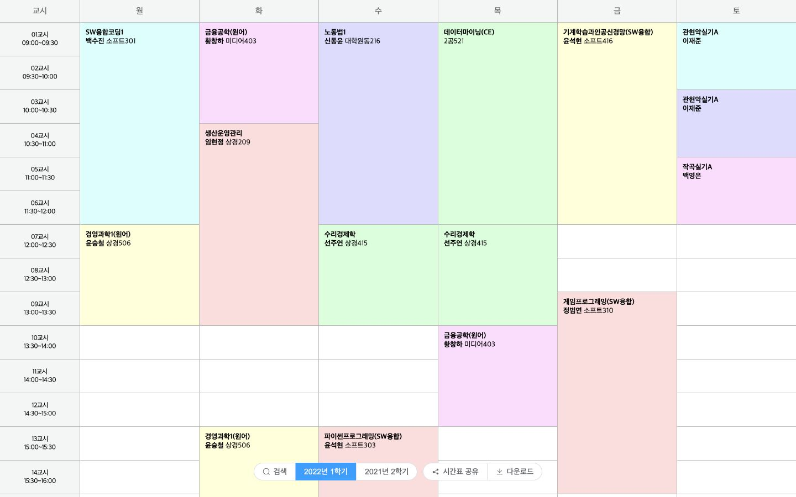

> 본 게시물은 이 사이드 프로젝트를 시작하게 된 계기와 어떤 부분에 대해서 고민했는지 다루고 있습니다.
- [단국대학교 강의 시간표 만들기](https://junilhwang.github.io/dku-schedule-manager/)
- [소스코드](https://github.com/junilHwang/dku-schedule-manager)

## 0. 간단한 요약

- 대학교 시간표를 긁어서 직접 시간표를 구성할 수 있는 서비스를 만들었다. ~~근데 왜 대학교측에서는 이런 기능을 안만들어주는걸까?~~
- 별도의 API서버가 없어도 되도록 구성했다.
- 대신에 Github Actions을 이용했다.
- Github Actions을 실행하여 시간표를 1시간마다 읽어들여서 json 파일로 저장한다.
- 저장된 json 파일을 이용하여 FE에서 시간표를 구성할 수 있게 만들었다.
- Github Pages로 호스팅했다.

## 1. 번뜩

대학교 재학 시절, 방학 때 마다 언제 시간표가 올라오나 기다렸고, 시간표가 올라와도 언제 [에브리타임](https://everytime.kr/)에 업로드되나 또 기다렸다. ~~그 시절에는 왜 직접 시간표 서비스를 만들 생각을 하지 않았을까?~~

에브리타임은 전국의 모든 대학교를 대상으로 서비스하기 때문에 누군가가 누군가가 에브리타임 측에 시간표를 정리해서 보내지 않으면 아무도 에브리타임 내에서 시간표를 만들 수 없었다. 이건 지금도 마찬가지인 상황이다.

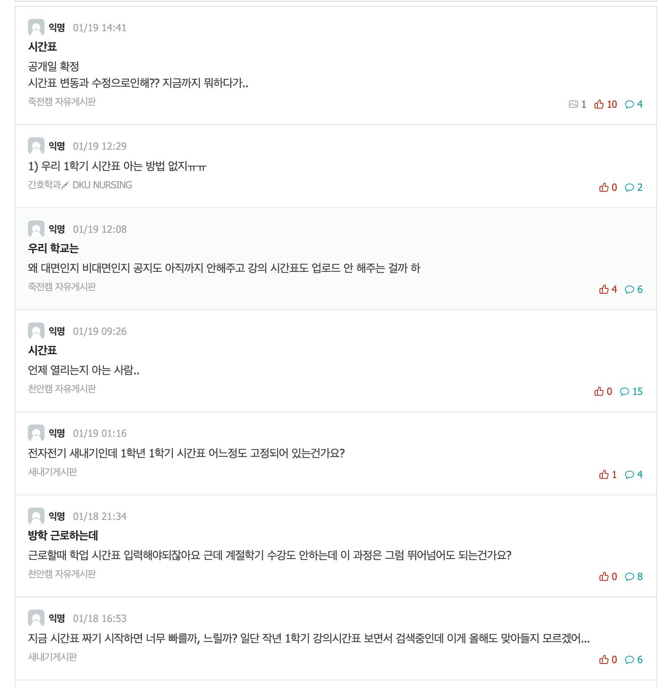

여기서 중요한 점은 에브리타임은 모든 학교를 대상으로 완전 자동화 하기가 힘들다는 것이다. 그래서 나는 내 모교인 단국대학교를 타겟팅하여 시간표 서비스를 만들어야겠다고 생각했다.

## 2. 시간표 긁어오기

처음에는 아예 API 서버를 만들까 고민했었는데, 서버를 만들게 될 경우 골치아픈 상황이 많을 것 같아서 일단 보류했다. 그래도 API 서버가 있으면 할 수 있는 일이 무척 많아진다. 내가 재학생이 아니라서 웹 포털의 모든 기능을 사용할 수 없는게 아쉬울뿐..

만약에 API 서버가 있다는 가정 하에 할 수 있는 일들을 나열해보자면

- 서비스에서 만든 시간표를, 그대로 대학교 웹 포털에 등록하기
- 시간표 공유
  - 지금도 이미지 기반으로 가능하긴 함
- 실시간 채팅
- ~~등록된 시간표를 기반으로 수강신청~~
  - 하면 잡혀감. 철컹철컹
  - 이론상 가능하긴 함
- 기타 등등..?
- 사실 지금 당장 생각나는게 딱히 없다.
- 할 수 있는게 무궁무진 하긴 하다.

어쨌든 별도의 서버가 없는 상태에서, 단국대 포털에 시간표가 올라오자마자 이를 읽어들이고 서비스로 제공해야 한다.

강의 시간표는 [이 링크](https://webinfo.dankook.ac.kr/tiac/univ/lssn/lpci/views/lssnPopup/tmtbl.do)에서 검색해볼 수 있는데, 검색 조건을 설정하고 전송하면 다음과 같은 네트워크 요청을 보낸다.

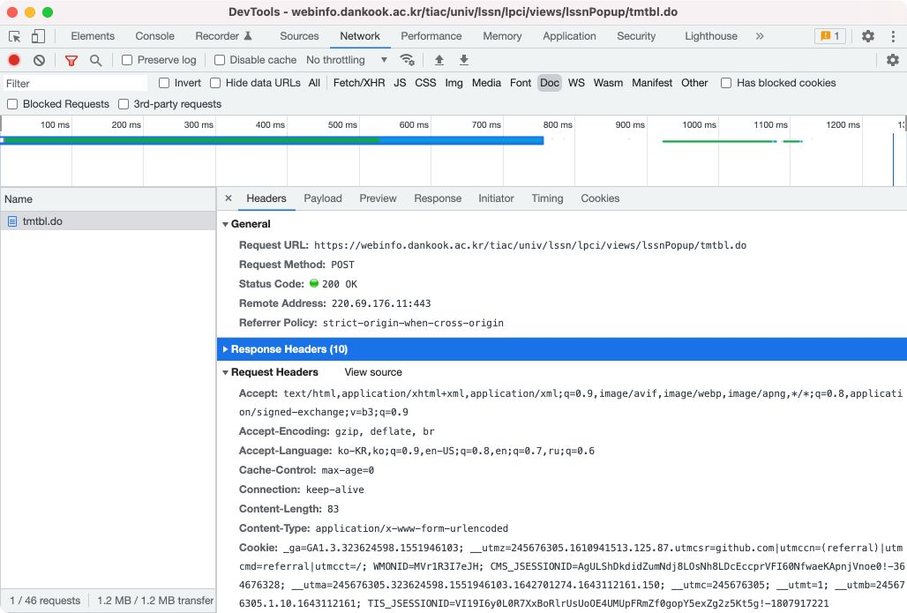

이 때 다음과 같이 크롬에서 발생한 네트워크 전송을 cURL 요청으로 복사하여 확인해볼 수 있다.

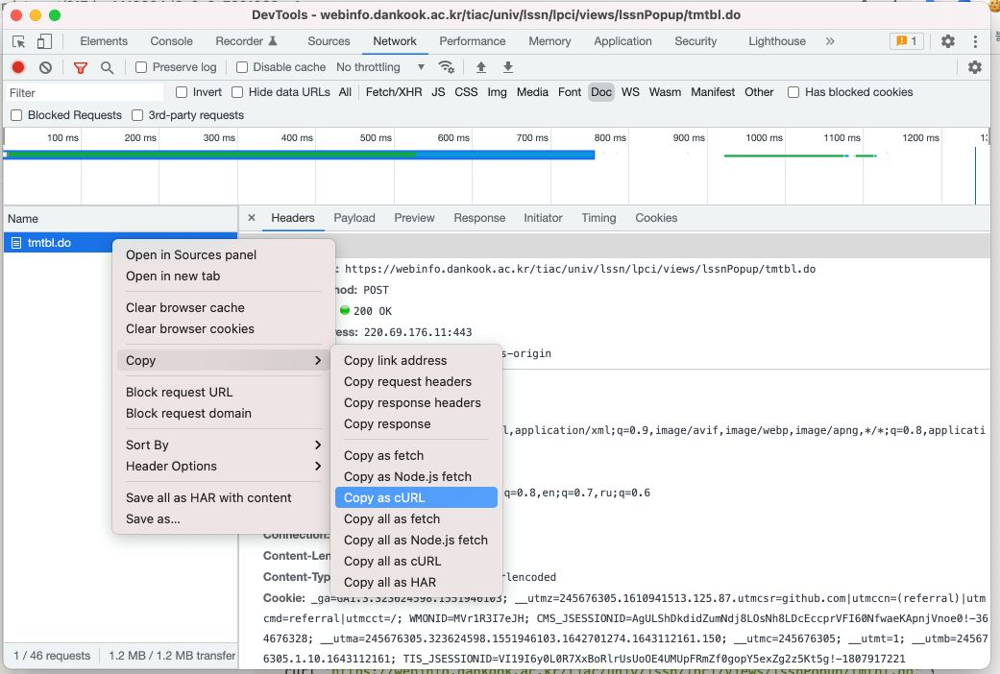

```bash
curl 'https://webinfo.dankook.ac.kr/tiac/univ/lssn/lpci/views/lssnPopup/tmtbl.do' \
  -H 'Connection: keep-alive' \
  -H 'Cache-Control: max-age=0' \
  -H 'sec-ch-ua: " Not;A Brand";v="99", "Google Chrome";v="97", "Chromium";v="97"' \
  -H 'sec-ch-ua-mobile: ?0' \
  -H 'sec-ch-ua-platform: "macOS"' \
  -H 'Upgrade-Insecure-Requests: 1' \
  -H 'Origin: https://webinfo.dankook.ac.kr' \
  -H 'Content-Type: application/x-www-form-urlencoded' \
  -H 'User-Agent: Mozilla/5.0 (Macintosh; Intel Mac OS X 10_15_7) AppleWebKit/537.36 (KHTML, like Gecko) Chrome/97.0.4692.71 Safari/537.36' \
  -H 'Accept: text/html,application/xhtml+xml,application/xml;q=0.9,image/avif,image/webp,image/apng,*/*;q=0.8,application/signed-exchange;v=b3;q=0.9' \
  -H 'Sec-Fetch-Site: same-origin' \
  -H 'Sec-Fetch-Mode: navigate' \
  -H 'Sec-Fetch-User: ?1' \
  -H 'Sec-Fetch-Dest: document' \
  -H 'Referer: https://webinfo.dankook.ac.kr/tiac/univ/lssn/lpci/views/lssnPopup/tmtbl.do' \
  -H 'Accept-Language: ko-KR,ko;q=0.9,en-US;q=0.8,en;q=0.7,ru;q=0.6' \
  -H $'Cookie: _ga=GA1.3.323624598.1551946103; __utmz=245676305.1610941513.125.87.utmcsr=github.com|utmccn=(referral)|utmcmd=referral|utmcct=/; WMONID=MVr1R3I7eJH; CMS_JSESSIONID=AgULShDkdidZumNdj8LOsNh8LDcEccprVFI60NfwaeKApnjVnoe0\u0021-364676328; __utma=245676305.323624598.1551946103.1642701274.1643112161.150; __utmc=245676305; __utmt=1; __utmb=245676305.1.10.1643112161; TIS_JSESSIONID=VI19I6y0L0R7XxBoRlrUsUoOE4UMUpFRmZf0gopY5exZg2z5Kt5g\u0021-1807917221' \
  --data-raw 'yy=2022&semCd=1&qrySxn=2&curiCparCd=&lesnPlcCd=1&mjSubjKnm=&mjDowCd=&grade=&pfltNm=' \
  --compressed
```

위에서 불필요한 파라미터를 날려버리고, 필요한 부분만 추출하면 다음과 같다.

```bash
# content-type, accept, data-raw(request body)를 제외한 나머지는 모두 제거한다.
curl 'https://webinfo.dankook.ac.kr/tiac/univ/lssn/lpci/views/lssnPopup/tmtbl.do' \
  -H 'Content-Type: application/x-www-form-urlencoded' \
  -H 'Accept: text/html,application/xhtml+xml,application/xml;q=0.9,image/avif,image/webp,image/apng,*/*;q=0.8,application/signed-exchange;v=b3;q=0.9' \
  --data-raw 'yy=2022&semCd=1&qrySxn=2&curiCparCd=&lesnPlcCd=1&mjSubjKnm=&mjDowCd=&grade=&pfltNm='
```

위의 curl 명령어를 실행해보면 다음과 같은 결과를 볼 수 있다.

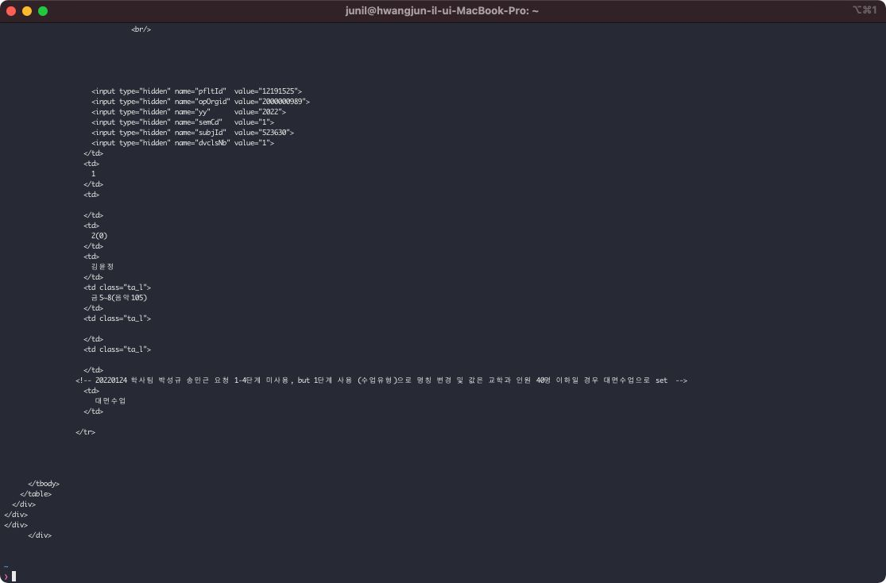

혹시 직접 실행해보았는가? 그렇다면 검색된 시간표가 HTML로 출력되는 것을 확인할 수 있을 것이다.

그런데 갑자기 accept를 `application/json` 으로 수정해보고 싶었다.

```bash
# 수신 방식(accept)은 application/json 으로
# 전송 데이터는 다음과 같음
curl 'https://webinfo.dankook.ac.kr/tiac/univ/lssn/lpci/views/lssnPopup/tmtbl.do' \
  -H 'Content-Type: application/x-www-form-urlencoded' \
  -H 'Accept: application/json' \
  --data-raw 'yy=2022&semCd=1&qrySxn=2&curiCparCd=&lesnPlcCd=1&mjSubjKnm=&mjDowCd=&grade=&pfltNm='
```

그랬더니 응답값을 JSON으로 보내줬다.

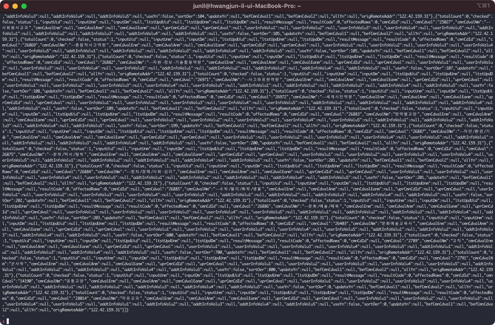


혹시나 해서 시도해봤는데, JSON으로 보내줬다. ~~개이득~~

왜 그런가 추측해봤는데 spring의 controller에서 ModelAndView를 사용해서 endpoint를 구성하면 accept에 따라서 응답값의 형태가 달라지는 것 같다. ~~아마 맞을 것 같은데 알아보기가 귀찮다.~~

어쨌든 결과적으로 HTML을 파싱해야 하는 수고를 덜었기 때문에 기분이 좋아졌다.

필요한 HTTP 요청을 확인했으니, 직접 코드로 만들어보자. 필자는 프론트엔드 개발자로 일하고 있기 때문에 NestJS를 이용해서(~~무슨상관인데?~~) 프로젝트를 구성했다.

::: tip NestJS

- Nest(NestJS)는 효율적이고 확장 가능한 Node.js 서버 측 애플리케이션을 구축하기 위한 프레임워크입니다.
- 프로그레시브 JavaScript를 사용하고 TypeScript로 구축되고 완벽하게 지원하며, OOP, FP, FRP의 요소를 결합하여 사용할 수 있습니다.
- 내부적으로 Nest는 Express(기본값)와 같은 강력한 HTTP 서버 프레임워크를 사용하며 선택적으로 Fastify도 사용하도록 구성할 수 있습니다.
- Nest는 이러한 일반적인 Node.js 프레임워크(Express/Fastify)보다 높은 수준의 추상화를 제공하지만 해당 API를 개발자에게 직접 노출합니다.
- 이를 통해 개발자는 기본 플랫폼에서 사용할 수 있는 수많은 타사 모듈을 자유롭게 사용할 수 있습니다.

라고  [공식문서](https://docs.nestjs.com/)에 나와있다.
:::

NestJS는 webserver 뿐만 아니라 [standalone application](https://docs.nestjs.com/standalone-applications)으로도 사용할 수 있다.

```ts
import { NestFactory } from '@nestjs/core';
import { AppModule } from './app.module';
import { AppService } from './app.service';

async function bootstrap() {
  const app = await NestFactory.createApplicationContext(AppModule);
  const appService: AppService = app.get(AppService);

  appService.saveSchedule(); // appService에서 데이터를 저장함

  await app.close();
}

bootstrap();
```

위와 같이 `NestFactory.createApplicationContext` 으로 만들 경우 단순하게 Nest로 구성된 코드를 실행해준다. 많은 기능이 필요 없기 때문에 appService에 schedule을 저장하는 코드를 구성했다.

[> 전체 코드 보기 <](https://github.dev/JunilHwang/dku-schedule-manager/blob/master/.packages/dku-schedule-cralwer/src/app.service.ts)

```ts{3-6,28-35,47-51}
const payloads = [
  {
    yy: 2021, // 년도
    semCd: 2,  // 학기
    qrySxn: 1,  // 1: 전공, 2: 교양
    lesnPlcCd: 1, // 1: 죽전캠, 2: 천안캠
  },
  /* 위의 양식에 따라 2021년 2학기 ~ 2022년 1학기 페이로드를 작성함 */
];

@Injectable()
export class AppService {
  private readonly scheduleClient: AxiosInstance;

  constructor() {
    const scheduleClient = axios.create({
      baseURL: "https://webinfo.dankook.ac.kr",
    });
    scheduleClient.interceptors.response.use(({ data }) => data);

    this.scheduleClient = scheduleClient;
  }

  public async saveSchedule() {
    const dataPath = path.join(process.env.INIT_CWD, "../../data");

    // 2021년 2학기와 2022년 1학기에 대한 모든 시간표 정보를 저장한다.
    for (const [key, payload] of Object.entries(payloadMap)) {
      const lectures: Lecture[] = await this.fetchSchedule(payload);
      fs.writeFileSync(
        `${dataPath}/${key}`, // 원래 더 복잡한 로직이지만, 일단 간단하게 표현했음
        JSON.stringify(lectures),
        "utf-8",
      );
    }
  }

  // 시간표를 가져오기 위한 API 요청
  public async fetchSchedule(payload: PayloadBody): Promise<Lecture[]> {
    const { scheduleClient } = this;
    const url = "/tiac/univ/lssn/lpci/views/lssnPopup/tmtbl.do";
    const data = Object.entries(payload)
      .map(([k, v]) => `${k}=${v}`)
      .join("&");
    const config = { headers };

    const response: ScheduleResponse = await scheduleClient.post(
      url,
      data,
      config,
    );

    // 원래 response에 별에별 정보가 다 들어있으나.. 딱 시간표 정보만 추출함
    return response.lctTmtblDscMjList;
  }
}
```

코드로 보면 좀 복잡해보일 수 있는데, 요약하자면 다음과 같은 기능을 수행하는 것이다.

- 단국대 포털에서 다음과 같은 데이터를 가져온다.
  - 죽전 캠퍼스의 2021년 2학기 교양 시간표
  - 천안 캠퍼스의 2021년 2학기 교양 시간표
  - 죽전 캠퍼스의 2021년 2학기 전공 시간표
  - 천안 캠퍼스의 2021년 2학기 전공 시간표
  - 죽전 캠퍼스의 2022년 1학기 교양 시간표
  - 천안 캠퍼스의 2022년 1학기 교양 시간표
  - 죽전 캠퍼스의 2022년 1학기 전공 시간표
  - 천안 캠퍼스의 2022년 1학기 전공 시간표
- 2021년 데이터는 테스트를 위해서 가져온다고 보면 된다.
- 시간표를 가져온다음에 JSON 파일로 저장한다.

  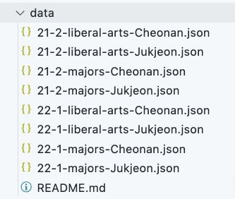

  - ~~음.. 그렇다. 별거 없다.~~
  - 그런데 여기서부터가 제일 중요하다.
  - **API 서버를 만들지 않기 위해서 github repository를 적극적으로 사용하는 것**이다.
- github actions을 이용하여 위의 프로세스를 주기적으로 실행한다.
  - 1시간 주기로 실행하면 적당할 것 같다.
- json파일이 만들어지면
  - commit 후에
  - github repository에 push한다. → 이게 제일 중요하다.
- push가 되는 순간, github pages가 호스팅 된다.
- github pages에서 json 파일을 읽어들인 후에 시간표를 구성할 수 있도록 만든다.
  - 여기서부터는 frontend의 영역이라고 보면 된다.

조금 흐름이 끊긴 감이 없지않아 있지만, 어쨌든 github actions을 구성해보자.

::: tip Github Actions
- Github Actions = Workflow 자동화 도구
- Github Actions를 사용하면 이제 세계적 수준의 CI/CD를 통해 모든 소프트웨어 워크플로를 쉽게 자동화할 수 있습니다.
- Github에서 바로 코드를 빌드, 테스트 및 배포하세요. 코드 검토, 분기 관리 및 문제 분류가 원하는 방식으로 작동하도록 합니다.

라고 공식문서에 나와있다.
:::

project root를 기준으로 `.github/workflows/main.yml` 폴더를 만들거나 그냥 github actions에서 workflow를 추가해도 된다.

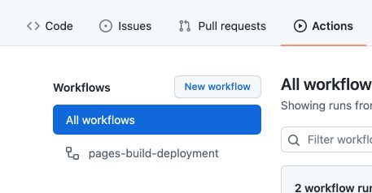

actions tab으로 이동한 다음에 `New workflow` 버튼을 클릭하면 만들어진다.

그리고 다음과 같이 작성했다.

```yaml
name: "Schedule Save"

on:
  schedule:
    # 1시간 마다 실행
    - cron: '0 */1 * * *'

  workflow_dispatch:

jobs:
  build:
    # ubuntu imageFmf tkdydgksek.
    runs-on: ubuntu-latest

    steps:
      # 현재 repository로 checkout
      - uses: actions/checkout@master
        with:
          ref: ${{ github.head_ref }}

      # node를 사용한다.
      - uses: actions/setup-node@v2

      # 패키지를 설치하고, build하고, build된걸 실행하는 과정이라고 보면 된다.
      - name: Data Save
          run: |
          cd .packages/dku-schedule-cralwer
          yarn install
          yarn build
          yarn start:prod
          cd ../..

      # 저장된 json파일을 github repository에 push 한다.
      - name: Commit And Push
        uses: actions-js/push@master
        with:
          github_token: ${{ secrets.GITHUB_TOKEN }}
          author_email: junil.h@kakao.com
          author_name: JunilHwang
          branch: master
```

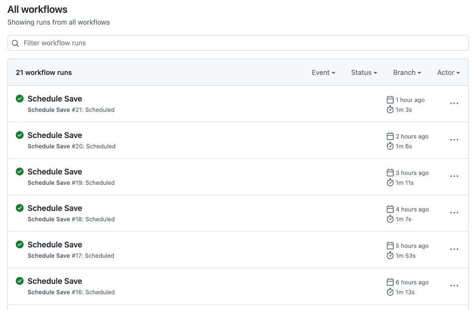

기본적으로 1시간 마다 실행되도록 구성했으며, 필요하다면 직접 workflow를 실행해도 된다.

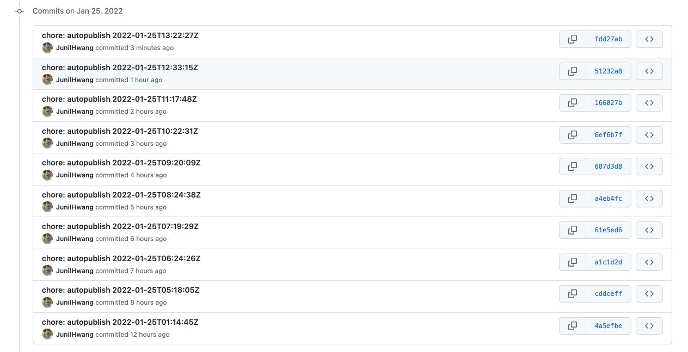

글을 작성하고 있는 날짜에 시간표가 계속 업데이트 되고 있어서 commit 내역이 자동으로 많아지고 있다. ~~개이득~~

## 3. FE


회사에서 신규 프로젝트를 Vue3 + Vite + Typescript로 진행할 예정이여서, 사이드 프로젝트에도 똑같은 기술 스택을 적용했다.

참고로 vite의 장점은 다음과 같다.

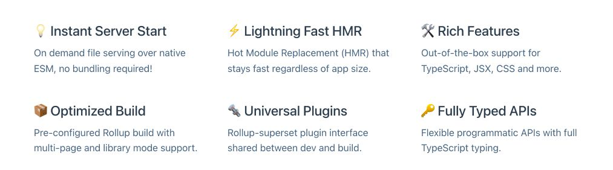

- 번들링을 하지 않기 때문에 실행 속도가 무척 빠르다.
  - 브라우저 모듈을 사용한다.
    - 내부적으로 rollup을 사용한다.
    - 브라우저 모듈을 사용하기 때문에 프로젝트 규모와 상관 없이 로딩 속도가 일정하다.
  - 즉, IE는 지원하지 않는다.
  - 억지로 지원할 수 있도록 환경을 구성할 순 있지만, 그렇다면 vite를 사용하는 이유가 없다.
- 핫 모듈 시스템이 빠르게 작동한다.
  - 파일이 변경되고 서버가 다시 실행되는 과정이 정말 빠르다.
  - 웹팩이랑 비교 불가
- vue, react 등의 프레임워크를 사용하기 위한 템플릿을 제공한다.

### 프로젝트 구성

vite 프로젝트 구성은 다음과 같이 할 수 있다.

```bash
> yarn create vite [프로젝트 이름] --template [템플릿 이름]
```

vite template은 `vanilla` `vanilla-ts` `vue` `vue-ts` `react` `react-ts` `preact` `preact-ts` `lit` `lit-ts` `svelte`` svelte-ts` 등이 존재한다. 자세한건 [공식문서](https://vitejs.dev/guide/#scaffolding-your-first-vite-project)에서 확인해볼 수 있다.

어쨌든 나는 `vue-ts`로 구성했다.

```bash
> yarn create vite dku-schedule-client --template vue-ts
```

추가로 vue-router도 설치했다. vue3와 같이 사용하기 위해선 최신 버전 router를 설치해야 한다.

```bash
> yarn add vue-router@next
```

그러면 다음과 같이 `package.json`이 구성될 것이다.

```json
{
  "name": "dku-schedule-client",
  "version": "0.0.0",
  "scripts": {
    "dev": "vite",
    "build": "vue-tsc --noEmit && vite build",
    "preview": "vite preview"
  },
  "dependencies": {
    "vue": "^3.2.25",
    "vue-router": "^4.0.12"
  },
  "devDependencies": {
    "@vitejs/plugin-vue": "^2.0.0",
    "typescript": "^4.4.4",
    "vite": "^2.7.2",
    "vue-tsc": "^0.29.8"
  }
}
```

### Vue3의 script setup

vue3에서 제일 신기했던(?) 것은 `<script setup>` 이다. 따로 export를 하지 않아도 되고, 선언된 변수를 template 내부에서 그냥 사용하면 된다.

```vue
<script setup>
const msg = 'Hello!'

function log() {
  console.log(msg)
}
</script>

<template>
  <div @click="log">{{ msg }}</div>
</template>
```

그리고 react의 useEffect 같은 hook도 있다.

```vue
<script setup>
import { ref, watchEffect } from 'vue';

const $root = ref(null);

watchEffect(() => {
  if (root.value === null) return;
  console.log(root.value);
})
</script>
<template>
  <div ref="$root">This is a root element</div>
</template>
```

template ref를 사용하려면 위와 같은 방식으로 사용해야 정상적으로 작동한다.

### 디자인시스템

디자인 시스템은 ElementUI Plus를 사용했다.

```bash
> yarn add element-plus @element-plus/icons-vue
```

- element ui plus의 icon을 사용하기 위해서 별도의 패키지를 추가로 설치해야 한다.

```ts
import { createApp } from "vue";
import ElementPlus from "element-plus";
import "element-plus/dist/index.css";
import "./styles/reset.scss";

// 한글어팩 적용
import ko from "element-plus/es/locale/lang/ko";
import App from "./App.vue";
import { router } from "./router";

const app = createApp(App)
  .use(ElementPlus, { locale: ko }) // App에 등록
  .use(router)
  .mount("#app");
```

그러면 다음과 같이 사용할 수 있다.

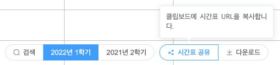

```vue
<script lang="ts" setup>
// icon 관련 component를 가져온다.
import { Download, Search, Share } from "@element-plus/icons-vue";
</script>

<div class="controller">
  <el-button-group>
    <el-button :icon="Search" @click="emit('search')" round plain>
      검색
    </el-button>

    <el-button
      v-for="{ label, value } in conditions"
      :type="value === condition ? 'primary' : 'default'"
      @click="emit('select-semester', value)"
      round
    >
      {{ label }}
    </el-button>
  </el-button-group>

  <el-button-group class="shares">
    <el-popover
      placement="top-start"
      :width="200"
      trigger="hover"
      content="클립보드에 시간표 URL을 복사합니다."
    >
      <template #reference>
        <el-button @click="emit('share')" :icon="Share" round plain>
          시간표 공유
        </el-button>
      </template>
    </el-popover>

    <el-popover
      placement="top-start"
      :width="200"
      trigger="hover"
      content="시간표 이미지를 다운로드합니다."
    >
      <template #reference>
        <el-button @click="emit('download')" :icon="Download" round plain>
          다운로드
        </el-button>
      </template>
    </el-popover>
  </el-button-group>
</div>
```

생각보다 더 깔끔해서 만족스러웠다.

그리고 alert 대신에 사용할 수 있는 Message 관련 API도 존재한다.

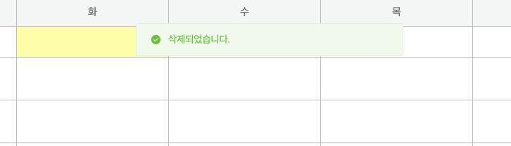

```ts
import { ElMessage } from "element-plus";

ElMessage.success("삭제되었습니다.");
```

### 시간표 저장

시간표를 이미지로 저장하기 위해서 html2canvas를 설치해서 사용했다.

```ts{12-19}
function handleDownload() {
  if ($main.value === null) return;
  const $clone = $main.value.cloneNode(true);
  const $cloneHeader = $clone.querySelector("header");
  $clone.querySelector(".controller").remove();

  $cloneHeader.style.cssText = "position: static; margin-bottom: -41px;";
  $clone.style.cssText = "width: 800px; position: absolute: left: -800px; top: 0;";
  $main.value.parentNode.appendChild($clone);

  // html -> canvas -> base64 -> 다운로드
  html2canvas($clone, { height: $clone.scrollHeight }).then((canvas) => {
    $clone.remove();
    const $anchor = document.createElement("a");
    $anchor.href = canvas.toDataURL();
    $anchor.download = "시간표.png";
    $anchor.click();
    $main.value.style = "";
  });
}
```

만들어진 시간표를 canvas로 변환하고, 다시 base64로 변환하여 이미지로 다운받을 수 있게 된다.

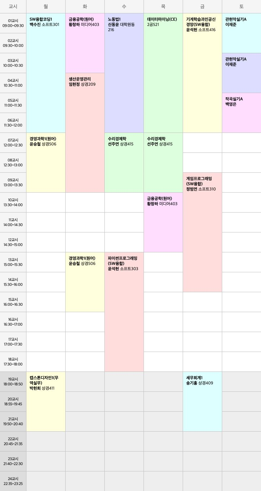

### 시간표 공유

이렇게 [링크](https://junilhwang.github.io/dku-schedule-manager/shared/?init=[{"buldAndRoomCont":"월7~9(상경323)<p>수1~3(상경323)","wkLecrEmpnm":"이봉수","subjMethod":null,"cybCoronaTyNm4":null,"cybCoronaTyNm":"원격수업","dvclsNb":1,"opOrgid":"2000000989","cybCoronaTyNm2":null,"dsgnCrd":0,"cybCoronaTyNm3":null,"oglngLctLanggCdnm":null,"yy":"2022","cybLtrTyNm":null,"curiCparNm":null,"kor":9,"crd":"3(0)","tmtblChgSxnCd":null,"tmtblChgSxnNm":null,"grade":3,"eng":9,"tkcrsEcaOrgnm":"SW융합대학<p>SW융합학부<p>SW융합경제경영전공","pfltId":"12011227","status":1,"subjKnm":"국제기업경영론","tkcrsEcaOrgid":"2000004874","subjId":"320190","semCd":"1","oglngLctLanggCd":null,"checked":"0"},{"buldAndRoomCont":"월4~6(2공105)<p>화1~3(소프트307)","wkLecrEmpnm":"나연묵","subjMethod":null,"cybCoronaTyNm4":null,"cybCoronaTyNm":"원격수업","dvclsNb":2,"opOrgid":"2000000989","cybCoronaTyNm2":null,"dsgnCrd":0,"cybCoronaTyNm3":null,"oglngLctLanggCdnm":null,"yy":"2022","cybLtrTyNm":null,"curiCparNm":null,"kor":0,"crd":"3(0)","tmtblChgSxnCd":null,"tmtblChgSxnNm":null,"grade":3,"eng":0,"tkcrsEcaOrgnm":"SW융합대학<p>SW융합학부<p>SW융합경제경영전공","pfltId":"11932468","status":1,"subjKnm":"데이터베이스(CE)","tkcrsEcaOrgid":"2000004874","subjId":"527900","semCd":"1","oglngLctLanggCd":null,"checked":"0"}])를 통해서 시간표를 공유할 수 있도록 만들었다. 귀찮아서 그냥 시간표 정보를 전부 uri에 때려박았다. 정확히는, 학교에서 제공하는 각 시간표에 대한 기본키(Primary Key)가 없어서 그냥 통짜로 정보를 집어넣었다. 어차피 크롬 전용으로 제공할 생각이고, 크롬의 경우 어느 정도의 uri 사이즈는 커버가 된다.

### 시간표 검색

- 일단 사이트에 접속하자 마자 모든 시간표 데이터를 가져온다.

```vue
<script setup lang="ts">
// 검색 옵션을 초기화하고, 현재 학기에 대한 시간표 데이터를 가져옴
async function fetchLectures() {
  searchOptions.lectures = await scheduleService.getAllSchedules(
    year.value,
    semester.value
  );
  searchOptions.days = [];
  searchOptions.times = [];
  searchOptions.query = "";
  searchOptions.grades = [];
  searchOptions.majors = [];
  searchOptions.page = 0;
  searchOptions.cursor = 0;
  searchOptions.currentLectures = [];
  fetchNextData();
}

// 데이터가 무척 많기 때문에, 렌더링에 필요한 데이터만 가져오는 함수
function fetchNextData() { /* 생략 */ }

// 컴포넌트가 로딩 되자 마자 시간표 데이터를 가져옴
fetchLectures();
</script>
```

- 일단 한 학기에 개설되는 강의가 대략 10000개 정도 된다.
- 그래서 이걸 한 번에 렌더링 할 경우 당연히 사이트가 버벅일 수 밖에 없다.
- 그래서 필요한 갯수만큼, `대략 100개씩 끊어서 가져오는 로직`이 필요하다.

```ts{15,21,26,31,36-40,74}
function fetchNextData() {
  const { grades, lectures, days, times, query, currentLectures, majors } = searchOptions;

  searchOptions.page += 1;

  // arr에 추가로 보여줄 만큼의 데이터를 쌓는다.
  const arr = [];

  // cursor 부터 반복문을 시작한다.
  // cursor가 lectures의 사이즈가 넘어가면 반복문이 종료된다.
  let cursor = searchOptions.cursor;
  for (; cursor < lectures.length; cursor += 1) {

    // arr가 pageSize 만큼 채워지면 반복문을 종료한다.
    if (arr.length >= pageSize) break;

    const lecture = lectures[cursor];
    const { grade, buldAndRoomCont, subjKnm, tkcrsEcaOrgnm } = lecture;

    // 검색어가 입력된 상태일 때, 검색어로 필터링
    if (query.length !== 0 && !subjKnm.includes(query)) {
      continue;
    }

    // 학년이 선택된 상태일 때, 학년으로 필터링
    if (grades.length !== 0 && !grades.includes(grade)) {
      continue;
    }

    // 전공이 선택된 상태일 때, 전공 정보로 필터링
    if (majors.length !== 0 && !majors.includes(tkcrsEcaOrgnm)) {
      continue;
    }

    // 요일이 선택된 상태일 때, 요일 정보로 필터링
    if (
      days.length !== 0 &&
      buldAndRoomCont &&
      days.filter((day) => buldAndRoomCont.includes(day)).length === 0
    ) {
      continue;
    }

    // 시간이 선택된 상태일 때, 요일 + 시간으로 필터링
    // 사실 이 로직은 문제가 있다. 요일과 시간의 and 조건이 정상적으로 작동하지 않는 상태임
    if (
      times.length !== 0 &&
      times.filter((timeKey) =>
        (buldAndRoomCont || "")
          .split("<p>")
          .map((v) => v.replace(/^([가-힣])(\d+(~\d+)?)(.*)/, "$2"))
          .map((v) => {
            const [start, end] = v.split("~").map(Number);
            if (end === undefined) return [start];
            return Array(end - start + 1)
              .fill(start)
              .map((v, k) => v + k);
          })
          .flatMap((v) => v)
          .includes(timeKey)
      ).length === 0
    ) {
      continue;
    }

    // 위의 조건들을 다 통과하면, arr에 과목 정보 추가
    arr.push(lecture);
  }

  // cursor값 초기화
  searchOptions.cursor = cursor;

  // 렌더링 될 데이터 추가
  currentLectures.push(...arr);
}
```

딱 봐도 망한 코드다. 정확히는, 리팩토링이 필요하다. 원래 Array 관련 메소드를 사용했었는데 그럴 경우 배열의 모든 요소를 순회하기 때문에 무척 비효율적이다. 배열 사이즈가 1000개 정도면 그냥 쓰겠지만, 10000개 정도 되니까 무조건 최적화가 필요한 상황이다. 그래서 몇 년 만에 이렇게 날 것의 for문을 사용했다. ~~Java의 Stream이 필요하다.~~

이럴 때 필요한 것이 바로 `함수형 프로그래밍` 이다. 인프런의 유인동님 강의를 추천한다.

일단 [FxTS](https://github.com/marpple/FxTS) 를 사용한다면 아마 다음과 같은 형태로 작성하면 될 것이다.

```ts
import { pipe, range, map, filter, concurrent, take, each } from "@fxts/core";

const 추가될_과목_정보_배열 = pipe(
  과목_정보_배열,
  filter(검색어_필터_함수),
  filter(학년_필터_함수),
  filter(요일_필터_함수),
  filter(시간_필터_함수),
  take(페이지_크기),
  concurrent(페이지_크기),
);
```

시작될 key값이 필요하기 때문에 초기 데이터에 대한 정제가 더 필요할 것 같다.

### Vite에서 프로젝트 외부 데이터 접근

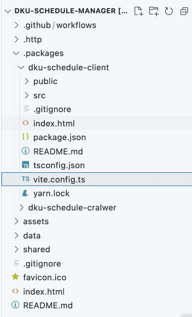

이 프로젝트의 github repository 구조는 위와 같다.

이를 보여주는 이유는, `/.packages/dku-schedule-client/src/*/**` 에서 `/data/*/**`에 대한 접근이 필요하기 때문이다.

vite는 기본적으로 브라우저 모듈 방식으로 파일 시스템을 가져오기 때문에, 프로젝트 외부에 있는 파일에 접근하기 위해선 별도의 설정이 필요하다.

```ts{9-13,18}
import { defineConfig } from "vite";
import vue from "@vitejs/plugin-vue";
import * as path from "path";

// https://vitejs.dev/config/
export default defineConfig({
  plugins: [vue()],
  resolve: {
    alias: {
      // alias를 이용해서 /data 폴더에 접근시 uri를 변경해준다.
      "/data": path.resolve(process.cwd(), "../../data"),
      "@": path.resolve(process.cwd(), "src"),
    },
  },
  server: {
    fs: {
      // 프로젝트 외부 접근을 허용한다.
      allow: [path.join(process.cwd(), "../../")],
    },
  },
  base: "./",
  build: {
    outDir: path.resolve(process.cwd(), "../../."),
  },
});
```

tsconfig에서도 alias 설정이 필요하다.

```ts{14-18}
{
  "compilerOptions": {
    "target": "esnext",
    "useDefineForClassFields": true,
    "module": "esnext",
    "moduleResolution": "node",
    "strict": true,
    "jsx": "preserve",
    "sourceMap": true,
    "resolveJsonModule": true,
    "esModuleInterop": true,
    "lib": ["esnext", "dom"],
    "types": ["element-plus/global", "@types/node"],
    "baseUrl": ".",
    "paths": {
      "/data/*": ["../../data/*"],
      "@/*": ["./src/*"]
    }
  },
  "include": ["src/**/*.ts", "src/**/*.d.ts", "src/**/*.tsx", "src/**/*.vue"]
}
```

코드에서는 다음과 같이 dynamic import를 이용해서 json 파일을 가져온다.

```ts{7,12}
async function _fetchData (
  path: string
): Promise<Lecture[]> {
  // production 모드일 때는 fetch api를 이용하여 json 파일을 가져온다.
  // dynamic import로 json을 가져올 경우 content-type 관련 오류가 발생하기 때문이다.
  if (import.meta.env.PROD) {
    return fetch(`.${path}`).then(res => res.json());
  }

  // 개발 모드일 때만 dynamic import를 사용한다.
  // 지금 생각해보니 proxy 설정을 사용해도 됐을듯.
  return import(/* @vite-ignore */path).then(v => v.default as Lecture[])
}
```

dev 모드일 때와 prod 모드일 때 사용하는 코드를 다르게 한다. 자세한 내용은 주석 참고

```ts
export async function getSchedules(
  payload: SchedulePayload
): Promise<Lecture[]> {
  const path = getDataPath(payload);
  if (!cache[path]) {
    cache[path] = await _fetchData(getDataPath(payload));
  }
  return cache[path];
}

export async function getAllSchedules(
  year = 2022,
  semester = 1,
): Promise<Lecture[]> {
  const results = await Promise.all([
    getSchedules({ year, semester, lectureType: LectureType.MAJOR, campusType: CampusType.JUKJEON }),
    getSchedules({ year, semester, lectureType: LectureType.MAJOR, campusType: CampusType.CHEONAN }),
    getSchedules({ year, semester, lectureType: LectureType.LIBERAL_ARTS, campusType: CampusType.JUKJEON }),
    getSchedules({ year, semester, lectureType: LectureType.LIBERAL_ARTS, campusType: CampusType.CHEONAN }),
  ]);
  return results.flatMap(v => v);
}
```

이렇게 한 번에 한 학기에 대한 과목 정보를 가져올 수 있도록 했다.

### 배포

배포는 별거 없다. 그냥 github pages를 사용하고, 빌드 후에 push하면 된다.

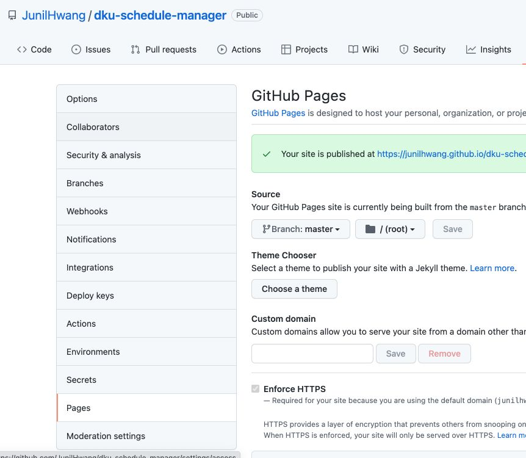

위의 사진 처럼, 그냥 master branch를 기준으로 github pages가 생성되도록 한다.

그리고 작성된 코드를 build후에 push하면 deploy가 실행된다.

```bash
# client 패키지 폴더로 이동한다.
> cd /.packages/dku-schedule-client

# 빌드 실행
> yarn build

# root로 이동 후 git push
> cd ../..
> git add .
> git commit -m "build"
> git push
```

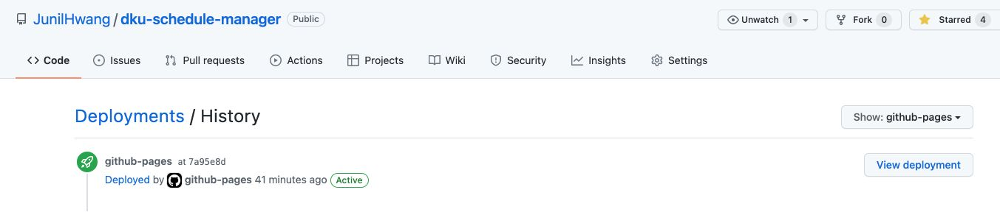

결과적으로 다음과 같은 프로세스를 가지게 된다.

- github action이 1시간 마다 실행
- 시간표 데이터 저장 후 commit, push
- push가 되면, 자동으로 github pages deploy
- 신규 시간표 데이터 반영

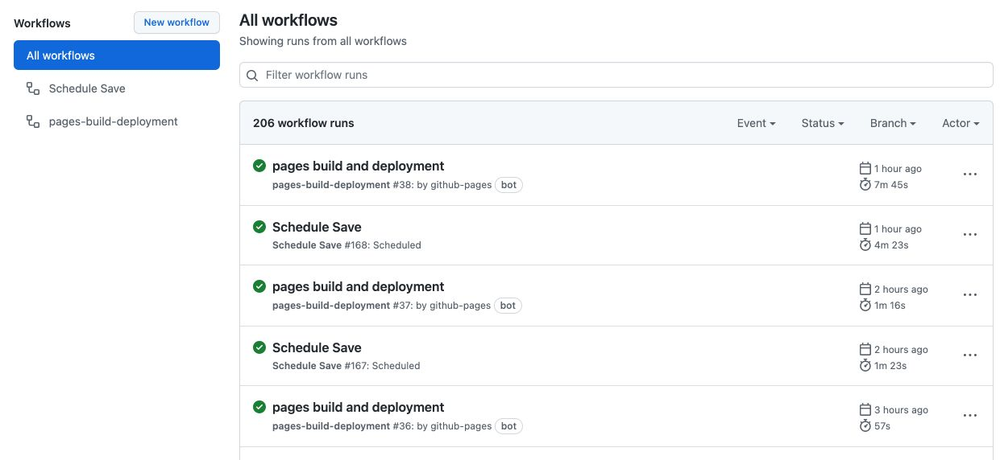

위에 보이는 것 처럼 Schedule이 실행 된 후에 바로 github pages가 deploy 되는 것을 확인할 수 있다.

## 4. 홍보

서비스가 완성된 다음에 에브리타임에 홍보했다.

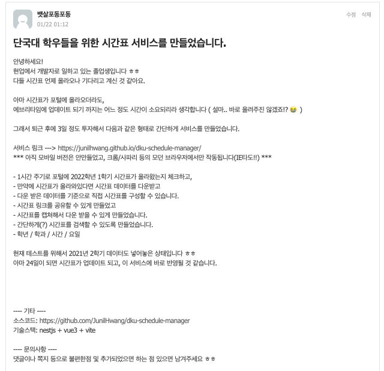

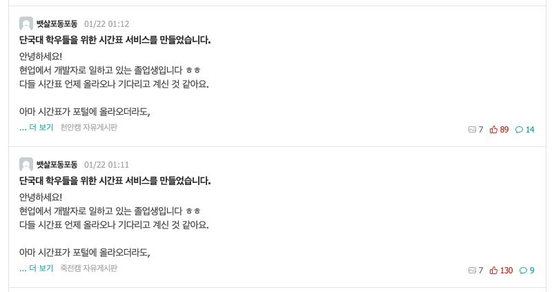

약간의 어그로를 위해서(?) 모시고 있는 주인님 사진을 같이 첨부했다.

   

예상대로, 고양이 사진 더 올려달라는 댓글이 많이 달렸다. ~~정확히는 그런 댓글만 달렸다.~~

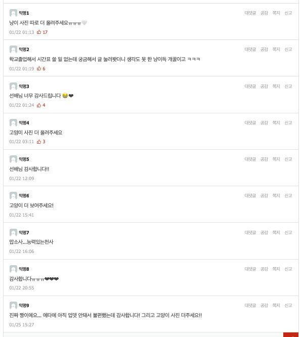

문제는, 아직 시간표가 공개되기 전이라서 사실 저 타이밍에 홍보해봤자 소용이 없었다는 점..

그래서 시간표가 공개된 다음에 다시 홍보했다.

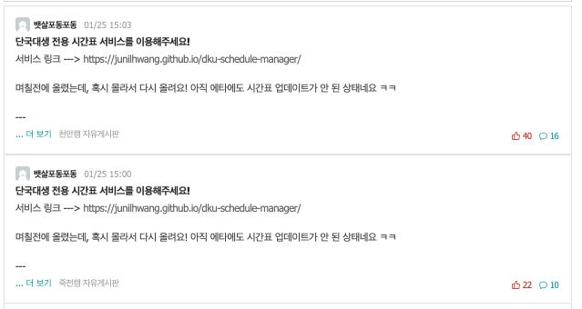

~~추천수의 차이는.. 아마도 고양이 사진 때문인듯~~

## 후기

- 나중에 고도화 해서 커뮤니티로 발전시키면 재밌을 것 같다.
- 근데 귀찮다.
- 짧은 기간 동안 몰입해서 만들어서 재밌었다.
- 테스트 코드도 작성해볼껄 하는 아쉬움이 있다.
- 다음 학기에도 써먹어야지

## 기타

- 소스코드는 [여기](https://github.com/JunilHwang/dku-schedule-manager)에서 확인할 수 있다.
- 코드가 좀 더럽다.
