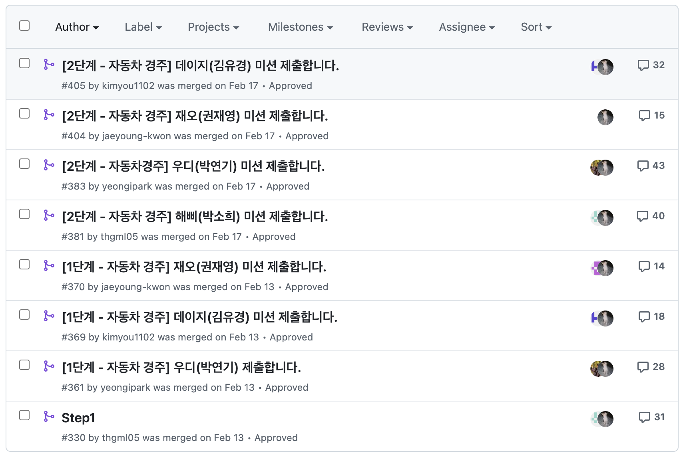

---

title: 자동차 경주 미션을 통해 산출된 코드 리뷰
description: 우아한 테크코스 리뷰어로 참여하면서 남긴 피드백을 정리한 내용입니다.
sidebarDepth: 1
date: 2025-04-08
tag: 클린코드, 피드백 정리, with-ai
thumbnail: https://raw.githubusercontent.com/JunilHwang/TIL/master/with-ai/code-review/woowacourse/racing-car/1.png

---

# [With AI] 자동차 경주 미션 피드백 정리

::: tip

본 게시물은 AI(Claude)와 함께 작성하였습니다.

:::


이 글은 [자동차 경주 미션 코드 리뷰](https://github.com/woowacourse/javascript-racingcar/pulls?q=is%3Apr+is%3Aclosed+assignee%3AJunilHwang) 과정에서 발견된 20가지 중요한 코드 개선 패턴을 담고 있습니다. 각 패턴은 실제 리뷰에서 논의되었던 문제 상황과 그에 대한 해결 방안을 명확하게 제시합니다. 제시된 패턴들을 이해하고 실제 코드에 적용한다면, 코드의 품질을 한 단계 더 끌어올릴 수 있을 것입니다.



## 1. 캡슐화: Private 필드와 테스트

### 문제점

객체의 내부 상태를 외부에서 직접 접근하여 변경할 수 있는 코드는 객체의 무결성을 해칠 위험이 있습니다.

```javascript
export default class Car {
  constructor(name) {
    this.name = name;
    this.position = 0;
  }

  move() {
    this.position += 1;
  }
}

// 외부에서 상태 직접 변경 시도
const car = new Car("myCar");
car.position = 1000; // 💥 객체 상태가 예기치 않게 변경될 수 있습니다.
```

### 해결책

Private 필드(`#`)를 사용하여 내부 상태를 외부로부터 보호하고, 필요한 경우 getter 메서드를 통해 접근하도록 제한합니다.

```javascript
export default class Car {
  #name;
  #position;

  constructor(name) {
    this.#name = name;
    this.#position = 0;
  }

  move() {
    this.#position += 1;
  }

  get name() {
    return this.#name;
  }

  get position() {
    return this.#position;
  }
}
```

### 얻는 효과

- 객체 내부 상태의 안정성 확보
- 객체지향 설계 원칙인 캡슐화 강화
- 외부의 직접적인 접근을 막아 예상치 못한 부작용 방지

## 2. 관심사의 분리: 도메인 로직과 I/O

### 문제점

자동차 경주 로직과 사용자 인터랙션(입력 및 출력) 코드가 하나의 클래스에 섞여 있으면 코드의 재사용성과 테스트 용이성이 떨어집니다.

```javascript
export default class Race {
  async run() {
    const carNames = await InputView.readCarNames();
    const tryCount = await InputView.readTryCount();
    const cars = this.createCars(carNames);

    OutputView.printResultTitle();
    this.startRace(cars, tryCount);

    const winners = this.findWinner(cars);
    OutputView.printWinners(winners);
  }

  // ... 기타 도메인 로직 ...
}
```

### 해결책

도메인 로직을 담당하는 클래스와 I/O를 처리하는 클래스를 분리하여 각자의 책임 영역을 명확히 합니다.

```javascript
// 도메인 로직 담당
export default class Race {
  constructor(cars, tryCount) {
    this.cars = cars;
    this.tryCount = tryCount;
  }

  start() {
    for (let i = 0; i < this.tryCount; i++) {
      this.moveAllCars();
    }
  }

  moveAllCars() {
    this.cars.forEach(car => {
      if (this.shouldMove()) car.move();
    });
  }

  findWinners() {
    const maxPosition = Math.max(...this.cars.map(car => car.position));
    return this.cars.filter(car => car.position === maxPosition);
  }
}

// I/O 및 흐름 제어 담당
export default class GameController {
  async run() {
    try {
      const carNames = await InputView.readCarNames();
      const tryCount = await InputView.readTryCount();
      const cars = carNames.map(name => new Car(name));

      const race = new Race(cars, tryCount);
      race.start();

      OutputView.printResultTitle();
      OutputView.printRaceResult(race.cars);

      const winners = race.findWinners();
      OutputView.printWinners(winners);
    } catch (error) {
      OutputView.printError(error.message);
    }
  }
}
```

### 얻는 효과

- 도메인 로직의 순수성 확보 및 재사용성 증대
- 다양한 환경에서의 코드 적용 용이성
- 단위 테스트 작성의 편리성 향상
- 단일 책임 원칙(SRP) 준수

## 3. 객체의 책임: 상태 검증

### 문제점

객체 생성에 필요한 유효성 검증 로직이 객체 외부의 유틸리티 함수 등에 위치하면 객체가 자신의 상태에 대한 책임을 온전히 지지 못합니다.

```javascript
// 외부 유틸리티 함수
export const validateCarNames = (names) => {
  if (names.length > MAX_CAR_NAME_LENGTH) {
    throw new Error(ERROR_MESSAGE.CAR_NAME_LENGTH);
  }
  // ... 기타 검증 로직 ...
};

// 컨트롤러에서 검증 호출
const carNames = await InputView.readCarNames();
validateCarNames(carNames);
const cars = carNames.map(name => new Car(name));
```

### 해결책

객체 생성 시 필요한 검증 로직을 객체 내부로 옮겨 객체 스스로 자신의 상태를 검증하도록 합니다.

```javascript
export default class Car {
  static NAME_LENGTH = { MIN: 1, MAX: 5 };
  #name;
  #position;

  constructor(name) {
    this.#validateName(name);
    this.#name = name;
    this.#position = 0;
  }

  #validateName(name) {
    if (name.length < Car.NAME_LENGTH.MIN || name.length > Car.NAME_LENGTH.MAX) {
      throw new Error(`자동차 이름은 ${Car.NAME_LENGTH.MIN}~${Car.NAME_LENGTH.MAX} 글자 사이여야 합니다.`);
    }
    // ... 추가 검증 로직 ...
  }

  // ... 기타 메서드 ...
}
```

### 얻는 효과

- 객체가 항상 유효한 상태를 유지하도록 보장
- 검증 로직의 중복 방지
- 객체지향 설계 원칙에 부합
- 도메인 지식의 명확한 위치 설정

## 4. 유연한 설계: 전진 조건 전략 패턴

### 문제점

자동차의 전진 조건이 클래스 내부에 고정되어 있으면 다양한 조건 변화에 유연하게 대처하기 어렵습니다.

```javascript
export default class Car {
  move(randomNumber) {
    if (randomNumber >= MOVE_THRESHOLD) {
      this.#position += 1;
    }
  }
}

// 사용 예시
const moveCars = (cars) => {
  cars.forEach(car => {
    const randomNumber = getRandomNumber();
    car.move(randomNumber);
  });
};
```

### 해결책

전략 패턴을 적용하여 전진 조건을 외부에서 함수 형태로 주입받도록 설계합니다.

```javascript
export default class Car {
  move(shouldMove) {
    if (shouldMove()) {
      this.#position += 1;
    }
  }
}

// 다양한 전진 전략
const randomMoveStrategy = () => Math.random() >= 0.4;
const alwaysMove = () => true;
const neverMove = () => false;

// 사용 예시
cars.forEach(car => {
  car.move(randomMoveStrategy);
});

// 다른 전략 적용
cars.forEach((car, index) => {
  car.move(() => index % 2 === 0); // 짝수 인덱스 차량만 이동
});
```

### 얻는 효과

- 다양한 게임 규칙 변화에 대한 높은 유연성
- 전진 조건 변경 시 핵심 도메인 코드 수정 최소화
- 단위 테스트 용이성 향상
- 개방-폐쇄 원칙(OCP) 준수

## 5. 명확한 표현: 테스트 코드의 가독성

### 문제점

테스트 코드가 동적 문자열 포맷팅이나 외부 변수에 의존하면 테스트의 의도와 실패 원인을 파악하기 어렵습니다.

```javascript
test.each(FAIL_CAR_NAME_TEST_CASES)('%s', (_, { carNames, errorMessage }) => {
  // given
  const race = new Race();

  // when & then
  expect(() => race.initCars(carNames)).toThrow(errorMessage);
});
```

### 해결책

테스트 케이스 설명에 구체적인 상황을 명시하고, 테스트 내용을 명확하게 드러냅니다.

```javascript
test.each([
  ["자동차 이름이 최대 글자 수를 초과하면 에러를 발생시킨다", "abcdef", Car.ERROR.NAME_LENGTH],
  ["자동차 이름이 최소 글자 수 미만이면 에러를 발생시킨다", "", Car.ERROR.NAME_LENGTH],
])("%s", (description, invalidName, expectedError) => {
  // given

  // when & then
  expect(() => new Car(invalidName)).toThrow(expectedError);
});
```

### 얻는 효과

- 테스트 실패 시 빠르게 원인 파악 가능
- 테스트 코드 자체로 요구사항 설명 가능
- 문서화 효과 및 유지보수 용이성 증대

## 6. 응집도 향상: 상수 위치의 중요성

### 문제점

모든 상수를 하나의 파일에 모아두면 사용되는 코드와 정의된 위치가 멀어져 코드의 응집도가 낮아집니다.

```javascript
// constants.js
export const ERROR_MESSAGE = {
  CAR_NAME_LENGTH: "[ERROR] 자동차 이름은 5자 이하로 입력해주세요.",
  TRY_COUNT_RANGE: "[ERROR] 시도 횟수는 1 이상 100 이하의 숫자만 가능합니다.",
  // ... 기타 메시지 ...
};

export const INPUT_MESSAGE = {
  ASK_CAR_NAMES: "경주할 자동차 이름을 입력하세요 (이름은 쉼표(,) 기준으로 구분합니다).",
  ASK_TRY_COUNT: "시도할 횟수를 입력하세요.",
  // ... 기타 메시지 ...
};
```

### 해결책

상수를 해당 상수가 사용되는 맥락과 가까운 위치에 정의하여 코드의 응집도를 높입니다.

```javascript
// domain/Car.js
export default class Car {
  static NAME_LENGTH = { MIN: 1, MAX: 5 };
  static ERROR = {
    NAME_LENGTH: `[ERROR] 자동차 이름은 ${Car.NAME_LENGTH.MIN}자 이상 ${Car.NAME_LENGTH.MAX}자 이하로 입력해주세요.`,
  };
  // ... 클래스 구현 ...
}

// view/InputView.js
export default class InputView {
  static MESSAGE = {
    ASK_CAR_NAMES: "경주할 자동차 이름을 입력하세요 (이름은 쉼표(,) 기준으로 구분합니다).\n",
    ASK_TRY_COUNT: "시도할 횟수를 입력하세요.\n",
  };
  // ... 클래스 구현 ...
}
```

### 얻는 효과

- 관련된 코드끼리 모여 응집도 향상
- 코드 변경 시 영향 범위 예측 용이
- 상수 이름 충돌 가능성 감소
- 코드의 가독성 및 유지보수성 증대

## 7. 명확한 분류: 커스텀 에러 클래스

### 문제점

일반적인 `Error` 객체만 사용하면 에러의 종류를 명확하게 구분하기 어렵고, 에러 처리 로직이 복잡해질 수 있습니다.

```javascript
if (name.length > MAX_CAR_NAME_LENGTH) {
  throw new Error(ERROR_MESSAGE.CAR_NAME_LENGTH);
}
```

### 해결책

에러의 종류별로 커스텀 에러 클래스를 만들어 에러를 더 명확하게 식별하고 처리할 수 있도록 합니다.

```javascript
// errors/CarError.js
export class CarError extends Error {
  constructor(message) {
    super(message);
    this.name = 'CarError';
  }
}

export class CarNameLengthError extends CarError {
  constructor(name, min, max) {
    super(`자동차 이름 "${name}"의 길이는 ${min}~${max}자 사이여야 합니다.`);
    this.name = 'CarNameLengthError';
  }
}

// 사용 예시
if (name.length < Car.NAME_LENGTH.MIN || name.length > Car.NAME_LENGTH.MAX) {
  throw new CarNameLengthError(name, Car.NAME_LENGTH.MIN, Car.NAME_LENGTH.MAX);
}

// 에러 처리
try {
  // ...
} catch (error) {
  if (error instanceof CarNameLengthError) {
    // 자동차 이름 길이 관련 처리
  } else if (error instanceof CarError) {
    // 일반적인 자동차 관련 에러 처리
  } else {
    // 예측하지 못한 에러 처리
  }
}
```

### 얻는 효과

- 에러의 종류별로 세밀한 처리 가능
- 디버깅 시 에러 정보의 명확성 증대
- 에러 메시지의 일관성 유지
- 타입 시스템과의 통합 용이성 향상

## 8. 의미 있는 데이터: 테스트 코드 개선

### 문제점

테스트 설명이 추상적이거나 일반적이어서 테스트가 어떤 특정 상황을 검증하는지 명확하지 않습니다.

```javascript
test.each([
  ["자동차는 움직인다.", true, 1, "pobi"],
  ["자동차는 움직이지 않는다.", false, 0, "woni"],
])("%s", (_, isCanMove, expectedPosition, carName) => {
  const car = new Car(carName);
  car.move(isCanMove);
  expect(car.position).toBe(expectedPosition);
});
```

### 해결책

테스트 설명에 구체적인 조건과 예상되는 결과를 명시하여 테스트의 의도를 명확하게 전달합니다.

```javascript
test.each([
  ["전진 조건이 참이면 자동차의 위치가 1 증가한다", true, 1, "pobi"],
  ["전진 조건이 거짓이면 자동차의 위치는 변하지 않는다", false, 0, "woni"],
])("%s", (description, moveCondition, expectedPosition, carName) => {
  const car = new Car(carName);
  car.move(() => moveCondition);
  expect(car.position).toBe(expectedPosition);
});
```

### 얻는 효과

- 테스트의 목적을 명확하게 이해 가능
- 테스트 실패 시 원인 분석 용이
- 비즈니스 요구사항과의 연결성 강화
- 새로운 개발자의 코드 이해도 향상

## 9. 흐름 제어: Generator 활용

### 문제점

복잡한 조건문으로 이루어진 단계별 흐름 제어는 코드의 가독성을 떨어뜨리고 유지보수를 어렵게 만듭니다.

```javascript
async play(step = App.STEP.CAR_NAME) {
  try {
    if (step === App.STEP.CAR_NAME) {
      await this.#readCarNames();
      step = App.STEP.TRY_NUMBER;
    }

    if (step === App.STEP.TRY_NUMBER) {
      await this.#readTryNumber();
      step = App.STEP.RACING;
    }

    if (step === App.STEP.RACING) {
      this.#race();
      step = App.STEP.WINNER;
    }

    if (step === App.STEP.WINNER) {
      this.#printWinner();
      return;
    }
  } catch (error) {
    Output.print(error.message);
    return this.play(step);
  }
}
```

### 해결책

Generator 함수를 사용하여 코드의 흐름을 더 명확하고 순차적으로 표현합니다.

```javascript
async play() {
  const gameFlow = this.#gameFlowGenerator();
  let currentStep = gameFlow.next();

  while (!currentStep.done) {
    try {
      await currentStep.value();
      currentStep = gameFlow.next();
    } catch (error) {
      Output.print(error.message);
      currentStep = gameFlow.next(true); // 에러 발생 시 현재 단계 재실행
    }
  }
}

*#gameFlowGenerator() {
  yield this.#readCarNames.bind(this);
  yield this.#readTryNumber.bind(this);
  yield this.#race.bind(this);
  yield this.#printWinner.bind(this);
}
```

### 얻는 효과

- 코드의 실행 흐름을 직관적으로 파악 가능
- 논리적인 단계를 선형적으로 표현
- 각 단계별 실행 제어 용이
- 에러 처리 로직 간결화

## 10. 명확한 초기화: 멤버 변수

### 문제점

멤버 변수에 기본값을 할당한 후 생성자에서 다시 초기화하는 것은 코드의 중복을 야기하고, 초기 상태를 혼동시킬 수 있습니다.

```javascript
class Car {
  #name = "";
  #position = 0;

  constructor(name) {
    this.#validate(name);
    this.#name = name;
  }

  // ...
}
```

### 해결책

멤버 변수를 선언만 하고 생성자에서 명시적으로 초기화하여 코드의 중복을 제거하고 초기 상태를 명확히 합니다.

```javascript
class Car {
  #name;
  #position;

  constructor(name) {
    this.#validate(name);
    this.#name = name;
    this.#position = 0;
  }
  // ...
}
```

### 얻는 효과

- 코드 중복 제거로 간결성 확보
- 객체의 초기 상태에 대한 명확한 이해 제공
- 생성자에서의 검증 및 할당 순서 보장
- 잠재적인 버그 발생 가능성 감소

## 11. 간결한 표현: 배열 메서드 활용

### 문제점

전통적인 `for` 루프를 사용하여 배열을 처리하는 코드는 길어지고, 인덱스 관리로 인한 실수가 발생할 수 있습니다.

```javascript
const results = [];
for (let i = 0; i < this.#tryCount; i++) {
  results.push(this.#getRoundResult(randomNumbers[i]));
}
return results;
```

### 해결책

`Array.from`과 `map`과 같은 배열 메서드를 활용하여 코드를 더 간결하고 명확하게 작성합니다.

```javascript
return Array.from({ length: this.#tryCount }, (_, index) =>
  this.#getRoundResult(randomNumbers[index])
);
```

### 얻는 효과

- 코드의 길이를 줄여 가독성 향상
- 개발자의 의도를 더 명확하게 표현
- 인덱스 관리의 복잡성 감소 및 오류 방지
- 함수형 프로그래밍 스타일 적용

## 12. 논리적 단순화: 불필요한 조건문 제거

### 문제점

조건식 자체가 불리언 값을 반환하는데 불필요하게 `if` 문을 사용하여 동일한 결과를 반환하는 코드는 장황합니다.

```javascript
isMove(number) {
  if (number >= Car.MOVE_THRESHOLD) {
    return true;
  }
  return false;
}
```

### 해결책

조건식을 직접 반환하여 코드를 더 간결하고 이해하기 쉽게 만듭니다.

```javascript
isMove(number) {
  return number >= Car.MOVE_THRESHOLD;
}
```

### 얻는 효과

- 코드의 간결성 및 가독성 향상
- 개발자의 의도를 명확하게 전달
- 유지보수 용이성 증대

## 13. 명확한 의미 전달: 에러 메시지 네이밍

### 문제점

에러 메시지 상수의 이름이 너무 일반적이어서 어떤 종류의 오류를 나타내는지 구체적으로 알기 어렵습니다.

```javascript
static #validateName(name) {
  if (name.length < CarValidator.MIN_NAME_LENGTH ||
      name.length > CarValidator.MAX_NAME_LENGTH) {
    throw new Error(CarValidator.ERROR_MESSAGE.nameLength);
  }
}
```

### 해결책

에러 메시지 상수의 이름을 더 구체적으로 작성하고, 관련 클래스나 기능별로 네임스페이스를 활용하여 의미를 명확히 합니다.

```javascript
static NameValidation = {
  Error: {
    TOO_SHORT: `[ERROR] 자동차 이름은 최소 ${Car.MIN_NAME_LENGTH}자 이상이어야 합니다.`,
    TOO_LONG: `[ERROR] 자동차 이름은 최대 ${Car.MAX_NAME_LENGTH}자 이하여야 합니다.`,
  },
};

static #validateName(name) {
  if (name.length < Car.MIN_NAME_LENGTH) {
    throw new Error(Car.NameValidation.Error.TOO_SHORT);
  }
  if (name.length > Car.MAX_NAME_LENGTH) {
    throw new Error(Car.NameValidation.Error.TOO_LONG);
  }
}
```

### 얻는 효과

- 오류의 종류를 명확하게 식별 가능
- 상수 이름의 일관성 유지
- 코드 탐색 및 이해 용이성 증대
- 유지보수 효율성 향상

## 14. 설계의 일관성: 도메인 상수 위치

### 문제점

도메인과 관련된 상수가 도메인 클래스 외부에 정의되어 있으면 코드의 응집도가 떨어지고, 상수의 의미를 파악하기 위해 여러 파일을 탐색해야 할 수 있습니다.

```javascript
// constants.js
export const MAX_CAR_NAME_LENGTH = 5;
export const MIN_CAR_NAME_LENGTH = 1;
export const MOVE_THRESHOLD = 4;

// Car.js
import { MAX_CAR_NAME_LENGTH, MIN_CAR_NAME_LENGTH, MOVE_THRESHOLD } from '../constants.js';

class Car {
  #validate(name) {
    if (name.length > MAX_CAR_NAME_LENGTH || name.length < MIN_CAR_NAME_LENGTH) {
      throw new Error('자동차 이름의 길이가 올바르지 않습니다.');
    }
  }

  move(randomNumber) {
    if (randomNumber >= MOVE_THRESHOLD) {
      this.#position += 1;
    }
  }
}
```

### 해결책

도메인과 관련된 상수를 해당 도메인 클래스 내부에 `static` 필드로 정의하여 코드의 응집도를 높이고 의미를 명확히 합니다.

```javascript
class Car {
  static NAME_LENGTH = { MIN: 1, MAX: 5 };
  static MOVE_THRESHOLD = 4;

  #name;
  #position;

  #validate(name) {
    if (name.length > Car.NAME_LENGTH.MAX || name.length < Car.NAME_LENGTH.MIN) {
      throw new Error('자동차 이름의 길이가 올바르지 않습니다.');
    }
  }

  move(randomNumber) {
    if (randomNumber >= Car.MOVE_THRESHOLD) {
      this.#position += 1;
    }
  }
}
```

### 얻는 효과

- 도메인 지식의 응집성 강화
- 관련 코드의 локальность 향상으로 유지보수 용이
- 클래스와 상수 간의 관계 명확화
- 코드 이해도 향상

## 15. 테스트 용이성: 의존성 주입 활용

### 문제점

테스트에서 `Math.random`과 같은 전역 객체의 동작을 모의(mocking)하는 방식은 테스트 코드를 불안정하게 만들고, 도메인 코드의 구현 세부 사항에 테스트가 의존하게 됩니다.

```javascript
// Race.js
race(cars) {
  cars.forEach(car => {
    const shouldMove = Car.shouldMove(); // 내부에서 Math.random 사용
    if (shouldMove) car.move();
  });
}

// Race.test.js
test('레이싱 게임을 진행한다', () => {
  const cars = [new Car('pobi'), new Car('woni')];
  jest.spyOn(Math, 'random').mockReturnValue(0.5); // 특정 값으로 모의
  race.race(cars);
  // ... 테스트 로직 ...
});
```

### 해결책

전략 패턴을 활용하여 이동 조건을 외부에서 함수 형태로 주입받도록 변경하고, 테스트 시에는 예측 가능한 전략을 주입하여 테스트의 신뢰성을 높입니다.

```javascript
// Race.js
race(cars, moveStrategy = Car.defaultMoveStrategy) {
  cars.forEach(car => {
    const shouldMove = moveStrategy();
    if (shouldMove) car.move();
  });
}

// Car.js
export default class Car {
  static MOVE_THRESHOLD = 4;
  static defaultMoveStrategy = () => Math.random() >= Car.MOVE_THRESHOLD / 10;
  // ...
}

// Race.test.js
test('항상 이동하는 전략으로 실행하면 모든 자동차가 전진한다', () => {
  const cars = [new Car('pobi'), new Car('woni')];
  const alwaysMove = () => true;
  race.race(cars, alwaysMove);
  cars.forEach(car => expect(car.position).toBe(1));
});

test('항상 멈추는 전략으로 실행하면 모든 자동차가 멈춘다', () => {
  const cars = [new Car('pobi'), new Car('woni')];
  const neverMove = () => false;
  race.race(cars, neverMove);
  cars.forEach(car => expect(car.position).toBe(0));
});
```

### 얻는 효과

- 구현 세부 사항이 아닌 동작에 기반한 테스트 작성 가능
- 테스트 코드의 안정성 및 예측 가능성 향상
- 모의 객체 사용의 복잡성 감소
- 다양한 이동 전략에 대한 테스트 용이성 확보

## 16. 함수형 사고: 출력 형식 개선

### 문제점

중첩된 `forEach` 루프는 코드의 가독성을 떨어뜨리고, 각 차량의 진행 상태를 출력하는 로직이 해당 메서드에 직접 결합되어 있어 변경에 취약합니다.

```javascript
printRaceResult(results) {
  console.log('실행 결과');
  results.forEach(roundResult => {
    roundResult.forEach(car => {
      console.log(`${car.name} : ${'-'.repeat(car.position)}`);
    });
    console.log('');
  });
}
```

### 해결책

`map` 메서드를 활용하여 데이터 변환 로직을 분리하고, 출력 형식을 더 명확하게 표현합니다.

```javascript
printRaceResult(results) {
  console.log('실행 결과');
  results.forEach(roundResult => {
    const output = roundResult
      .map(car => `${car.name} : ${'-'.repeat(car.position)}`)
      .join('\n');
    console.log(output);
    console.log('');
  });
}
```

### 얻는 효과

- 데이터 변환과 출력 로직의 분리
- 코드의 가독성 및 이해도 향상
- 함수형 프로그래밍 패러다임 적용
- 데이터 처리 흐름의 명확성 증대

## 17. 유연한 함수 설계: 인자 활용

### 문제점

함수가 특정 범위의 난수만 생성하도록 고정되어 있어 다른 범위의 난수가 필요할 경우 함수를 수정해야 합니다.

```javascript
export const getRandomNumber = () => {
  return Math.floor(Math.random() * 10); // 0부터 9 사이의 난수만 생성
};
```

### 해결책

함수가 인자를 통해 난수의 범위를 지정할 수 있도록 설계하여 함수의 유연성을 높입니다.

```javascript
export const getRandomNumber = (max = 10, min = 0) => {
  return Math.floor(Math.random() * (max - min)) + min;
};
```

### 얻는 효과

- 함수의 재사용성 향상
- 다양한 범위의 난수 생성 요구사항에 유연하게 대처 가능
- 기본값 설정을 통한 하위 호환성 유지
- 코드의 의도 명확화

## 18. 적절한 추상화: 함수 vs 클래스

### 문제점

모든 메서드가 `static`인 클래스는 인스턴스 생성이 불필요하며, 객체지향적인 관점에서 상태나 행위를 모델링하지 않는 경우 함수 모듈로 변경하는 것이 더 적절할 수 있습니다.

```javascript
export default class TryNumberValidator {
  static MIN_TRY_NUMBER = 1;
  static MAX_TRY_NUMBER = 100;
  static ERROR_MESSAGE = {
    RANGE: `[ERROR] 시도 횟수는 ${TryNumberValidator.MIN_TRY_NUMBER} 이상 ${TryNumberValidator.MAX_TRY_NUMBER} 이하의 숫자만 가능합니다.`,
    NOT_INTEGER: '[ERROR] 시도 횟수는 정수여야 합니다.',
  };

  static validate(tryNumber) {
    this.#validateRange(tryNumber);
    this.#validateInteger(tryNumber);
  }

  static #validateRange(tryNumber) {
    if (tryNumber < TryNumberValidator.MIN_TRY_NUMBER || tryNumber > TryNumberValidator.MAX_TRY_NUMBER) {
      throw new Error(TryNumberValidator.ERROR_MESSAGE.RANGE);
    }
  }

  static #validateInteger(tryNumber) {
    if (!Number.isInteger(tryNumber)) {
      throw new Error(TryNumberValidator.ERROR_MESSAGE.NOT_INTEGER);
    }
  }
}
```

### 해결책

인스턴스 상태나 행위를 다루지 않는 유틸리티성 메서드들은 함수 모듈로 분리하여 코드의 목적을 더 명확하게 드러냅니다.

```javascript
// tryNumberValidator.js
export const MIN_TRY_NUMBER = 1;
export const MAX_TRY_NUMBER = 100;
export const ERROR_MESSAGE = {
  RANGE: `[ERROR] 시도 횟수는 ${MIN_TRY_NUMBER} 이상 ${MAX_TRY_NUMBER} 이하의 숫자만 가능합니다.`,
  NOT_INTEGER: '[ERROR] 시도 횟수는 정수여야 합니다.',
};

export const validateTryNumber = (tryNumber) => {
  validateRange(tryNumber);
  validateInteger(tryNumber);
};

const validateRange = (tryNumber) => {
  if (tryNumber < MIN_TRY_NUMBER || tryNumber > MAX_TRY_NUMBER) {
    throw new Error(ERROR_MESSAGE.RANGE);
  }
};

const validateInteger = (tryNumber) => {
  if (!Number.isInteger(tryNumber)) {
    throw new Error(ERROR_MESSAGE.NOT_INTEGER);
  }
};
```

### 얻는 효과

- 코드의 목적과 구조를 일치시켜 가독성 향상
- 불필요한 인스턴스 생성을 방지하여 효율성 증대
- 함수형 프로그래밍 방식의 장점 활용
- 테스트 작성 용이성 향상

## 19. 안정적인 객체 관리: 방어적 배열 복사

### 문제점

객체의 내부 배열을 직접 반환하면 외부에서 해당 배열을 수정하여 객체의 불변성을 해치고 예기치 않은 부작용을 발생시킬 수 있습니다.

```javascript
get cars() {
  return this.#cars;
}
```

### 해결책

배열을 복사하여 반환함으로써 외부의 직접적인 수정을 방지하고 객체의 내부 상태를 보호합니다.

```javascript
get cars() {
  return [...this.#cars]; // 얕은 복사
}
```

### 얻는 효과

- 객체의 내부 상태를 외부로부터 보호
- 캡슐화 원칙 준수
- 예상치 못한 부작용 발생 방지
- 불변성 확보로 디버깅 용이성 향상

## 20. 추상화 수준 일치: 인터페이스 설계

### 문제점

메서드가 구체적인 구현 세부 사항(예: `randomNumbers` 배열의 인덱스)에 직접 의존하면 전진 조건 변경 시 메서드의 인터페이스도 함께 변경되어야 합니다.

```javascript
#getRoundResult(randomNumbers) {
  const roundResult = [];
  this.#cars.forEach((car, index) => {
    if (this.#shouldMove(randomNumbers[index])) {
      car.move();
    }
    roundResult.push({ name: car.getName(), position: car.getPosition() });
  });
  return roundResult;
}
```

### 해결책

더 높은 수준의 추상화를 제공하는 인터페이스를 설계하고, 구체적인 구현 세부 사항은 메서드 내부로 숨깁니다.

```javascript
#getRoundResult(moveStrategy) {
  const roundResult = [];
  this.#cars.forEach(car => {
    if (moveStrategy(car)) {
      car.move();
    }
    roundResult.push({ name: car.getName(), position: car.getPosition() });
  });
  return roundResult;
}

// 사용 예시
const randomMoveStrategy = () => Math.random() >= 0.4;
race.#getRoundResult(randomMoveStrategy);

const nameLengthBasedStrategy = (car) => car.getName().length > 3;
race.#getRoundResult(nameLengthBasedStrategy);
```

### 얻는 효과

- 메서드 인터페이스의 안정성 향상
- 구현 세부 사항의 캡슐화
- 다양한 이동 전략 적용 용이성
- 테스트 코드의 유연성 확보

## 결론

지금까지 자동차 경주 미션 코드 리뷰를 통해 발견한 20가지 코드 개선 패턴을 살펴보았습니다. 이러한 패턴들은 객체지향 설계 원칙, 관심사 분리, 유연한 설계, 테스트 용이성, 그리고 코드의 가독성과 유지보수성 향상이라는 핵심 목표를 중심으로 합니다.

이 글에서 제시된 패턴들을 여러분의 코드에 적용함으로써 더욱 견고하고 확장 가능하며 유지보수가 용이한 소프트웨어를 개발하는 데 도움이 되기를 바랍니다. 지속적인 코드 리뷰와 리팩토링을 통해 코드 품질을 꾸준히 개선해 나가는 것이 중요합니다.
