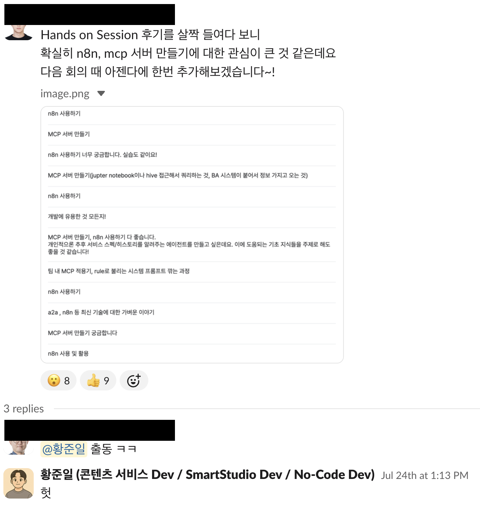
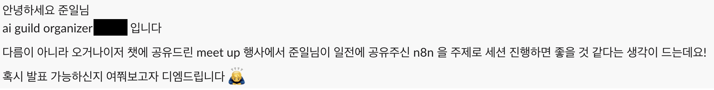
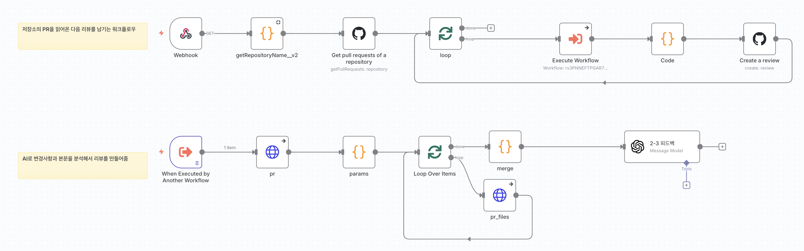
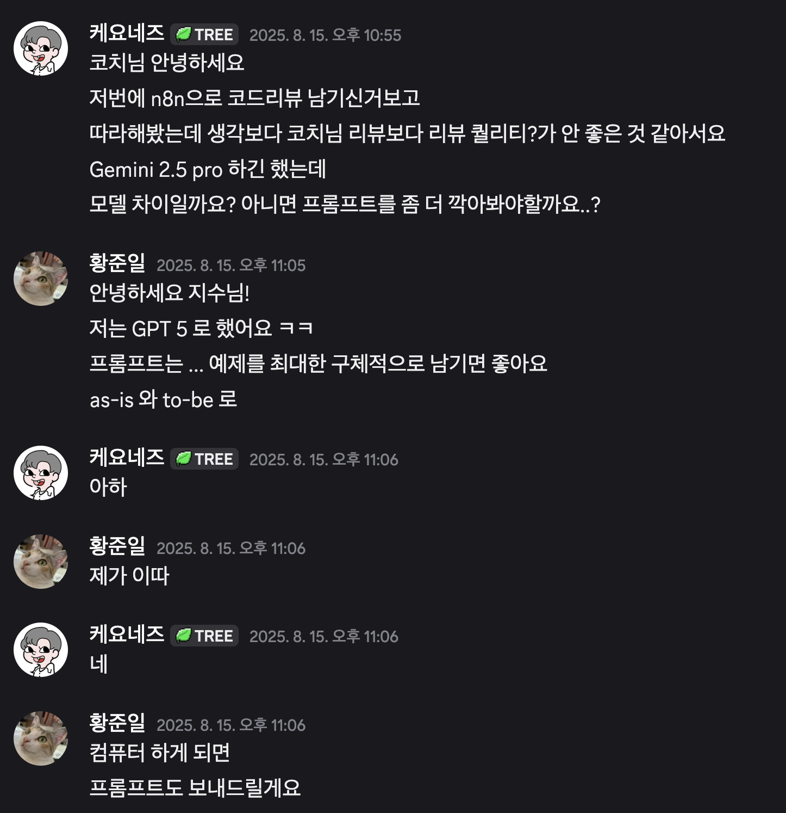
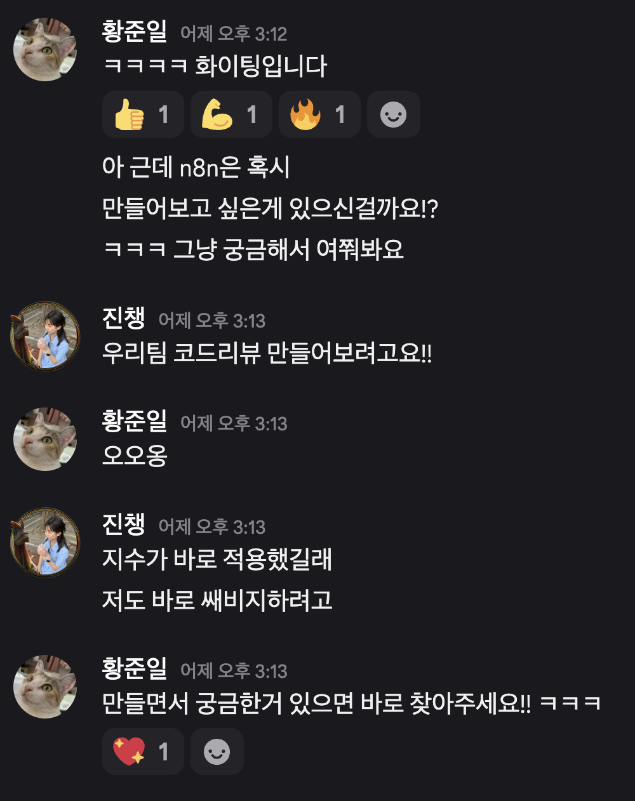

---

title: 변화는 가시화된 행동에서 시작한다
description: 변화는 어떻게 시작되는걸까? 에 대한 나의 개인적인 경험이다. 
date: 2025-08-17 09:00:00
tag: 생각
thumbnail: https://github.com/user-attachments/assets/abe6b9ae-8f70-4fcf-8245-9d5237c9fc3c

---

# 변화는 가시화된 행동에서 시작한다

일요일 오전 6시, 이유는 모르겠지만 자연스럽게 눈이 떠졌다. ~~사실 어제 저녁에 너무 매운걸 먹어서 그런가.. 배아파서 일어났다.~~

무엇을 할까 고민하다가 선선해진 날씨가 생각나서 30분정도 조깅을 하면서 "변화"라는 키워드에 대해 생각했고,
집으로 복귀 후 생각이 휘발되지 않도록 변화라는 키워드에 대해 글을 쓰고 있다.

::: tip 변화

이 글에서 ‘변화’는 누군가가 자발적으로 따라 하게 되는 상태를 뜻한다.
나는 그것이 가시화된 행동에서 시작한다고 믿는다.

:::

## F1 The Movie

최근에 **F1 더 무비** 라는 영화를 봤다.
영화의 모든 장면이 하나하나 다 인상 깊었는데, 특히 기억에 남는 장면을 꼽자면..

소니와 함께 조깅하는 사람들이 시간이 흐를수록 늘어나는 모습이었다.
팀 합류 초반에 소니는 혼자서 조깅을 했다.
크고 작은 사건들을 겪고, 점점 소니에 대한 신뢰가 생기면서 점점 소니와 함께 뛰어다니는 사람들이 생긴다.
영화 막바지에는 소니가 없을 때 다 같이 조깅하는 모습을 보면서 "그래 한 번 싸워보자!" 라는 느낌을 받았다.

어떻게 사람들은 소니와 뛸 생각을 하게 되었을까?
소니는 한 번도 "같이 뛰자" 라고 이야기하는 장면이 없었다.
**어떤 생각을 하는 사람인지 행동으로 보여줬다.**

그리고 누군가는 그 모습에 대해 '좋다는 느낌'을 받았다고 생각한다.
'소니가 옳다고 생각해' 까진 아니어도, 소니의 모습을 보고 인사이트를 얻었을 것이다.

소니는 **말이 아닌 행동으로 팀에게 자신의 생각과 자신의 감정을 전달**했다고 생각한다.
그렇게 팀원 한 명 한 명의 신뢰를 얻었고, 소니의 생각을 궁금해하고 존중했으며 자연스럽게 소니에게 이목이 집중되었다.

이렇게 누군가가 나에 대해 집중하도록, 주목하도록 만들 수 있는 상태를 만들 수 있다면 그때부터 크고 작은 변화를 만들어갈 수 있는 게 아닐까?

## n8n

작년 말에 n8n 이라는 도구에 대해 팀장님께서 가끔씩 언급했다. "이런걸로 우리도 자동화를 시도해 보면 좋겠어요" 라는 메시지를 계속 던진 것.
일단 나는 팀장님을 존경하고 신뢰한다. 모든 말을 주워담을 수는 없지만, 팀장님의 생각을 쫓아가 보려고 애쓰는 편이다.
그래서 n8n 이라는 것을 사용할 수 있는 환경이 갖춰졌을 때, **일단 n8n 으로 그 때의 내가 겪고 있는 문제를 해결할 수 있는 간단한 워크플로우를 만들었다.**

팀원들이 눈으로 n8n의 실체를 보게 되었을 때, 정신 차려 보니 수십 개의 n8n 워크플로우가 생겼다.

n8n에 대한 내용을 한 달에 한 번 진행하는 상위 조직의 올핸즈 미팅에서도 이야기를 꺼냈다.
사실 자주 꺼냈다.

n8n으로 계속 무언가를 만들어냈다. 간단한 워크플로우부터 시작해서 AI와 연계할 수 있는 API도 만들고, MCP도 만들고, RAG도 만들고.
그리고 이 이야기를 꺼낼 수 있는 기회가 있는 기회가 있을 때마다 소개를 했다.

조직 차원에서 "요즘 알고 싶은 AI 도구"에 대해 설문을 했을 때 n8n에 대한 이야기가 다수 있었고,

현재 조직에서 n8n에 대해 계속 소개하고 떠들면서 "이거 좋아요!"라고 이야기 해온 사람이 나여서 결국 내가 n8n에 대한 소개와 활용법에 대해 발표를 하게 되었다.

정신차려보니 내일모레 400명 정도 되는 조직원 앞에서 n8n을 주제로 발표를 하게 되었다. ~~어떡하지... 아직 발표 자료도 못 만들었다~~

**이러한 흐름은 행동을 통해 "좋아 보이는 상태"를 보여주는 것에서 시작이 된 게 아닐까?**

## 블로그 스터디

[link-preview: https://github.com/zum-study/zum-blog-study]

이전 회사에서 블로그 스터디를 2달 정도 진행했었다.
나를 포함하여 4명이 참여했고, 2주 간격으로 글 한 편을 작성한 다음 개발 조직에 공유했었다.

[link-preview: https://github.com/zum-study/zum-blog-study/tree/main/%ED%99%A9%EC%A4%80%EC%9D%BC]

그렇게 두 달 정도 스터디를 진행한 다음에 조금 쉬었다가 다시 새로 스터디를 모집했는데 갑자기 10명이 넘는 사람이 신청하여 당황했었다.
사람이 갑자기 확 많아져서 먼저 어떻게 운영하는 게 좋을지, 시간을 어떻게 써야 좋을지 등에 대해 고려를 못했달까..

여튼 인원이 많아진 이후에 스터디는 흐지부지 되었던걸로 기억한다.

여기서 내가 중요하게 생각하는 부분은 "스터디 해요!"를 강조했다기보단..
**내가 작성한 글을 보여주면서 "나도 써 보고 싶다." 라는 마음이 들도록 만들었다고 생각한다.**

그리고 다양한 교육과정에 멘토로 참여할 때, 교육을 운영하는 분들께서 "글쓰는 문화를 어떻게 만들어가면 좋을까요?" 등의 질문을 많이 해주신다.
글쓰기가 좋은걸 모르는 사람은 없다. 그치만 글쓰기는 글을 쓰고 싶어야 더 자주 더 잘 쓸 수 있다고 생각한다.

**쓰고 싶도록 만들어야 한다. 하고 싶도록 만들어야 한다.**

그래서 무언가 변화를 일으키고 싶을 때는 "마음"을 자극해야 한다고 생각한다. 구성원 중 누군가가 잘 작성한 글을 보여주는 것. 성장하는 모습을 보여주는 것. 그게 사람들에게 인사이트가 있어야 한다. 

## AI 코드리뷰

최근에 한 교육과정에 AI 코드리뷰를 적용했다.

무언가 존재하는 플랫폼을 사용한게 아니라, 과제의 특성과 나의 생각을 최대한 담아보려고 했다.
사실 코드리뷰를 통해 큰 효과를 보는 것 보다 이 일을 하고 싶었던 것 같다.
만들면서 재밌었다.
이전에 "AI 코드리뷰가 있으면 좋겠다"고 내가 수강생들에게 이야기했다. 누군가가 만들어주길 하는 마음으로..

이런 시스템이 있으면 좋다는 것을 누구나 알고 있다.
그치만 좋다는 것을 알아도 행동하는 사람은 드물다.

그런데 AI 코드리뷰 시스템을 만들어 놨더니 "그거 어떻게 만들어요? 저도 만들고 싶어요!" 등의 이야기를 하면서 메세지를 보내고 직접 자기만의 AI 코드리뷰 시스템을 만드는 모습을 목격했다.
실체가 눈앞에 있어서 그런걸까?

어쨌든 이번에도 같은 패턴이었다.
(행동) 먼저 만들고 → (가시화) 보이게 하고 → (공명) 맥락을 공유하자 → (확산) 따라 하는 사람이 생겼다.

## 정리

내 주변 환경을 변화시키는 것은 무척 어렵다.
내가 옳다고 믿는 것을 이야기 하고, 설득하고, 같이 움직이게 만들고.
상당히 피로한 과정이다.

나는 논리도 중요하지만 결국 **사람이 움직이게 되는 순간은 내면에 있는 욕구를 자극했을 때**라고 생각한다.
욕구의 형태는 사람마다 다르고, 누군가가 내가 가진 욕구를 자극할 때, 그 때 꿈틀거리면서 움직이는게 아닐까?

누군가가 나를 신뢰하도록 만들어야 하고 내 이야기에 귀를 기울이도록 만들어야 하는 데 그런 과정은 언제나 어렵다.
때로는 내가 하고 싶은 일을 하는 게 답이 될 수도 있고 때로는 주변의 문제를 해결하는 게 답이 될 수도 있다.

그건 결국 내가 어떤 사람이냐에 따라 다르다고 생각한다.
더 정확히는, 어떤 에너지를 가지고 있는 사람이냐에 따라 전략을 세워면 되지 않을까?

**어쨌든 변화는 행동의 가시화에서 시작된다.** 일단 행동하자.

